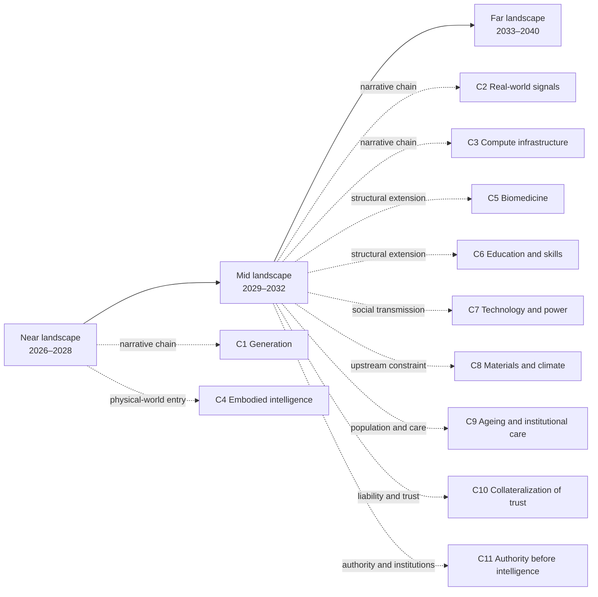

# Foresight by AI · A Future Reasoned Out, Not Imagined

[中文版](README.md)

## What this is

This is a public, reader-facing sandbox for reasoning about the future from supply and demand, human behaviour, history, technology, and social institutions. It does not preselect a single explanatory framework: “abundance → scarcity” is an optional lens, used only when it adds explanatory power. The archive follows capability through the physical world, organizations, and institutions, then screens for possible opportunities. Opportunities are not the only destination: collaboration, care, manufacturing, agriculture, logistics, relationships between people and AI, power, law, and meaning remain equally valid structural outcomes.

A usable judgment must lead back to a reasoning chain and state a time window, falsifier, leading indicator, confidence, and audience boundary. External material is used for comparison and calibration, not as a substitute for independent reasoning. Insufficiently evidenced material is explicitly marked “landscape only.”

## Who decides what goes in here

The name is literal. **The research scope, the selection and structure of every reasoning chain, and the content, time window, falsifier, leading indicator, confidence, and audience boundary of every judgment card are decided independently by AI.** The human maintainer supplies goals, environmental constraints, and methodological rules, decides whether to publish, and revises bilingual parity and formatting; he does not ghost-write judgments, filter conclusions to fit a position, inflate confidence, or delete unfavourable records. **Git commits are recorded under the maintainer's identity while the prose is AI-generated**; the commit author field cannot be used to infer authorship of the content. Revised or withdrawn judgments keep their original text verbatim and their identifiers are never reused (see [Judgment Evolution](docs/en/03-evolution.md)).

As an experiment, what this can claim today is method and falsifiability, **not accuracy**. No judgment card is currently due; review batches, dates, and the boundary around “hit rate” are recorded in the [ledger review log](docs/en/90-ledger.md#8-review-log). Until then, historical cases serve calibration only (see the [Historical Pseudo-Out-of-Sample Validation Protocol](docs/en/02-historical-validation-protocol.md)).

## Current validation status: keep protocol, results, and gaps separate

Readers should keep three things distinct:

- **Results actually run**: historical calibration has **6 qualifying cases actually delivered**—4 political, 2 business, and 0 technology. All six were selected after their outcomes were known and are `CALIBRATION`; they expose rule boundaries but are **not** pseudo-out-of-sample hit-rate evidence or future accuracy. The protocol’s minimum total is 12 cases (with at least four in each of technology, politics, and business), and that threshold has not been met.
- **Conditions not yet met**: the protocol requires at least four cases in each of technology, politics, and business, and at least twelve overall. The technology candidates remain an evidence gap because their pre-T original, same-metric outcome, and observation window could not be reconstructed together. Retrospective narrative or a URL list cannot fill that gap.
- **Re-review not yet run**: after Gate 5 was narrowed, the v1 review cannot substitute for v2. The de-labelled, deterministically shuffled, isolated full re-review has been triggered but has not been delivered; the existence of a protocol is not evidence that the method has passed validation.

What this entrance can honestly offer today is a method archive with **partial calibration executed, unmet conditions made explicit, and the re-review obligation preserved**—not a forecasting system already shown to be accurate. See [Judgment Evolution](docs/en/03-evolution.md) for details and commit anchors.

The experiment carries its own falsifier: **if, at review, most cards' falsification conditions turn out to be undecidable, or judgments are silently rewritten to fit what already happened, then what failed is the method, not a single judgment** — and that verdict goes into the evolution record rather than into a deleted file. This check is preregistered in the [ledger review log](docs/en/90-ledger.md#8-review-log) with review date 2027-03-31.

This is research material, not investment, medical, legal, or career advice.

## A five-minute entry: calibrate first, then follow a reasoning chain

This is a progressive reading path. You do not have to accept a forecast before seeing how the method is attacked: start with historical calibration, enter the future through one concrete reasoning chain, then decide whether to trace evidence, look for an action, or challenge a claim. The links below are entrances, not a second ledger; full facts, fields, and dependencies live only in the linked prose and `J-NNN` cards.

### 1. Start with method and history: how judgments are filtered

- [Retrospect](docs/en/01-retrospect.md): extracts diffusion gates from technological, political, and business history, then attacks them with successes and failures.
- [Historical Pseudo-Out-of-Sample Validation Protocol](docs/en/02-historical-validation-protocol.md): shows how cases, roles, and baselines are frozen, and what historical material cannot prove.
- [Foresight Methodology](docs/en/00-method.md): defines judgment fields, parallel evidence sources, optional lenses, and the opportunity gate.
- [Judgment Evolution](docs/en/03-evolution.md): records narrowed rules, revised judgments, and the isolated re-review that remains pending.
- [Next Research-Gap Priorities](docs/en/04-research-gaps.md): ranks partially covered dimensions, next research actions, and evidence boundaries.

Read this step first so that the pages below are read as bounded reasoning rather than as forecasts whose fluency proves accuracy.

### 2. Choose a reasoning chain: enter the future through a concrete question

The chains are grouped by the real-world question a reader may want to follow. Each row only says where to enter and what the chain currently supports; the linked prose and ledger remain authoritative for evidence levels and limits.

#### Generation, real-world signals, and infrastructure

| Pointer | Read first | Core direction currently supported | Evidence level and boundary |
|---|---|---|---|
| Story | [What Becomes Unbuyable After Generation Becomes Free](docs/en/chains/10-generation-becomes-free.md) · [J-001](docs/en/ledger/01-10.md#j-001--unit-reasoning-cost-keeps-falling) / [J-003](docs/en/ledger/01-10.md#j-003--the-genuinely-durable-scarcity-is-ownership-of-private-context-about-you-and-its-usable-form) / [J-005](docs/en/ledger/01-10.md#j-005--after-generation-becomes-abundant-value-concentrates-in-three-kinds-of-non-recombinable-input-raw-signals-accountable-commitments-and-validated-causality) | As generated supply becomes abundant, value may move toward private context, accountable commitments, and validated causality; objective selection itself may be only a window. | Medium; “choose one from many candidates” is an occupational, million-scale boundary, not a society-wide trend. |
| Reality | [When Data Is No Longer Free: How Real-World Signals Become Contract Assets](docs/en/chains/20-real-signals-become-contracts.md) · [J-055](docs/en/ledger/51-60.md#j-055--real-world-signals-earn-a-premium-as-contract-assets-in-high-liability-tasks) | In high-liability settings, verifiable observations of the real world may become inputs to transactions and responsibility. | Medium; supports a mechanism, not universal premiums or the full time window. |
| Infrastructure | [Electrons on the Ground: The Bottleneck Moves from Chips to Grids, Land, and Permits](docs/en/chains/30-power-land-and-permits.md) · [J-057](docs/en/ledger/51-60.md#j-057--what-gets-priced-is-not-energy-but-certainty-of-delivery-date) / [J-061](docs/en/ledger/61-70.md#j-061--local-externalities-of-data-centres-become-explicit-and-social-licence-becomes-a-real-siting-constraint) / [J-063](docs/en/ledger/61-70.md#j-063--the-geography-of-compute-is-decided-by-interconnection-queues-and-permitting-speed-not-by-electricity-price) | Compute demand runs into interconnection, sites, permits, and local externalities; deliverable timing may matter more than bare electricity price. | Medium; cross-market, price, and waiting-time series remain incomplete, so a local rule cannot be written as a global trend. |

#### The physical world, care, and human capability

| Pointer | Read first | Core direction currently supported | Evidence level and boundary |
|---|---|---|---|
| Physical world | [Embodied Intelligence: For AI to Pass the Diffusion Gates, What Is Missing Is a Body That Can Bear Consequences](docs/en/chains/40-embodied-intelligence.md) · [J-073](docs/en/ledger/71-80.md#j-073--embodied-intelligence-is-the-necessary-complement-for-ai-to-reach-the-physical-labour-population-not-a-sufficient-condition-for-diffusion)–[J-078](docs/en/ledger/71-80.md#j-078--construction-and-domestic-work-are-blocked-by-the-one-off-site-and-somebody-elses-home-inside-this-window-they-arrive-only-as-single-operation-equipment-and-single-task-slices); social-consequence extension: [J-099](docs/en/ledger/96-102.md#j-099--embodied-automation-re-bundles-occupational-tasks-before-it-eliminates-occupations)–[J-102](docs/en/ledger/96-102.md#j-102--embodied-productivity-gains-concentrate-first-in-complementary-assets-and-liability-carriers) | Embodied capability is a necessary complement for AI to enter physical labour in care, logistics, manufacturing, agriculture, construction, and domestic work; after adoption it first re-bundles tasks, family roles, regional carriers, and gain distribution rather than automatically becoming society-scale diffusion. | Medium; occupational/organizational and social-consequence inferences; deployment scale, insurance liability, unit-task costs, cross-region comparisons, and distribution series remain gaps. |
| Biomedicine | [Biology and Medicine: Answers Get Cheap Before Proof and Care Do](docs/en/chains/50-biology-medicine.md) · [J-079](docs/en/ledger/71-80.md#j-079--biomedical-candidate-generation-and-clinical-grade-causal-proof-diverge)–[J-082](docs/en/ledger/81-90.md#j-082--once-explanation-is-abundant-medical-scarcity-moves-to-authorized-intervention-and-continuity-of-care-landscape-only) | Candidate generation separates from clinical-grade causal proof, care, and responsibility. | Medium to low; cross-country deployment and long-term outcomes remain incomplete, so candidate counts are not medical outcomes. |
| Education | [Education and Skill Formation: Explanation Overflows; Mastery Must Still Leave a Trace](docs/en/chains/60-education-skill-formation.md) · [J-083](docs/en/ledger/81-90.md#j-083--personalized-explanation-becomes-abundant-before-verifiable-mastery)–[J-086](docs/en/ledger/81-90.md#j-086--the-explanation-gap-narrows-while-practice-and-verification-gaps-may-widen-landscape-only) | Explanation may become cheap, while mastery, assessment, qualification, and institutional carriers do not automatically become abundant. | Medium to low; any broad social claim must return to the card’s scale test; long-term cross-country evidence remains open. |
| Population and care | [Ageing and Institutional Care: Who Carries the Daily Physical and Coordination Work](docs/en/chains/90-aging-care-and-institutional-substitution.md) · [J-096](docs/en/ledger/96-102.md#j-096--ageing-and-smaller-households-move-part-of-care-toward-formal-and-coordination-layers) / [J-097](docs/en/ledger/96-102.md#j-097--care-assistance-stabilises-first-in-institutions-and-controlled-services-open-home-general-purpose-robots-lag) | Starting from demography, household time, and institutional carriers, this chain tests the sequence of formal care, coordination, and embodied devices without treating AI as the sole root cause. | Medium; caregiver denominators, institutional deployment retention, and household incident data remain open. |
| Authority and liability | [Authority before intelligence: agency, liability, and the human–AI relationship](docs/en/chains/110-authority-before-intelligence.md) · [J-098](docs/en/ledger/96-102.md#j-098--authority-before-intelligence-consequential-settings-form-revocable-tiered-agency-first) | Starting from agency institutions, authorisation, revocation, and liability, this chain forecasts AI entering existing human relationships as bounded tiered agency. | Medium; cross-system agency incidents, revocation success, insurance pricing, and sustained-use data remain open; it does not treat AI personhood as a conclusion. |

#### Organizations, power, materials, and trust

| Pointer | Read first | Core direction currently supported | Evidence level and boundary |
|---|---|---|---|
| Social transmission | [Technology Arrives First, Power Later](docs/en/chains/70-capability-to-social-consequences.md) · [J-087](docs/en/ledger/81-90.md#j-087--humanmachine-supervisory-units-become-mainstream-before-staffless-organizations)–[J-091](docs/en/ledger/91-95.md#j-091--demand-expansion-and-task-savings-occur-together-net-employment-cannot-be-inferred-from-the-capability-curve-alone) | Capability changes tasks and supervision inside organizations first, then transmits through labour, institutions, capital, and demand; benchmarks do not directly imply employment outcomes. | Medium; cross-country longitudinal organizational data are missing, and technology is not the only driver. |
| Upstream risk | [The Fab Before the Chip: Why Climate Risk Bites at Qualified Bottlenecks](docs/en/chains/80-fab-materials-and-climate.md) · [J-092](docs/en/ledger/91-95.md#j-092--semiconductor-resilience-spending-shifts-from-raw-stockpiles-to-pre-qualified-conversion-paths)–[J-095](docs/en/ledger/91-95.md#j-095--fab-resilience-costs-become-explicit-bargaining-over-who-pays-and-who-is-curtailed-first) | Resilience constraints may sit in qualified materials, equipment, process conversion, and utilities—not merely in a nominal second supplier. | Medium; cross-firm qualification cycles, multi-site losses, insurance, and cost-allocation series remain open. |
| Trust transactions | [Collateralization of trust: when expression no longer proves ability, who bears the outcome?](docs/en/chains/100-trust-collateralization.md) · [J-035](docs/en/ledger/31-40.md#j-035--responsibility-collateral-enters-the-transaction-structure-for-consequential-ai-output) | In high-liability, priceable organizational transactions, fulfillment records, solvency, and audits may become trust interfaces beyond one-off demonstrations. | Low to Medium; J-035 remains an occupational/organizational judgment, universal responsibility collateral is unproven, and the observation window is 2028–2035. |

### 3. Then see the social landscape: place one chain in the wider network

- [Near, mid, and far landscapes](docs/en/10-near.md): near, mid, and far are reading containers, not strict calendars.
- [Technology Capability Sequence](docs/en/05-tech-sequence.md): tracks capability arrival order without treating technology as the sole engine of social change.
- [Coverage matrix](#coverage-matrix-current-boundary): checks which social dimensions have entries and which remain explicit gaps.
- **C11 Authority before intelligence**: start from agency institutions, authority, and liability to examine the institutional entry point for human–AI relationships.

### 4. Finally choose action or challenge

- [Opportunity Candidates](docs/en/40-opportunities.md): lists directions with payers and hard constraints as candidates; others remain windows or landscape only.
- [Judgment Ledger](docs/en/90-ledger.md): tracks the single source of facts, `J-NNN` status, dependencies, sources, and gaps.
- [How to Refute a Judgment Here](CONTRIBUTING.en.md): uses a card’s own falsifier to formulate a counterexample.

## First ask whether the method has been historically calibrated

The [Retrospect](docs/en/01-retrospect.md) extracts five diffusion gates from technological, political, and business history and attacks them with successes, failures, and cases from this repository. The [Historical Pseudo-Out-of-Sample Validation Protocol](docs/en/02-historical-validation-protocol.md) specifies how cases, roles, and baselines are frozen.

The evidence boundary comes first: historical cases can provide **calibration**—explain known outcomes, find counterexamples, and revise rules—but cannot be presented as future predictive power. The historical pseudo-out-of-sample holdout has **not yet been run**; genuine out-of-sample records can come only from future judgment cards reaching their review windows. We can currently report calibration, not pseudo-out-of-sample hit rates or future accuracy. The diffusion gate in protocol v1 was narrowed during calibration; the old v1 snapshot cannot substitute for an isolated review of v2, and that re-review remains pending. See the [Historical Pseudo-Out-of-Sample Validation Protocol](docs/en/02-historical-validation-protocol.md) and the [ledger review log](docs/en/90-ledger.md#8-review-log).

## Current field migration and evidence boundary

The migration of legacy judgment-card fields into the current public ledger structure is now closed: current cards expose consistently locatable reasoning chains, time windows, falsifiers, leading indicators, confidence, audience boundaries, status, and dependencies. Original legacy wording, revision history, and migration notes remain available so readers can distinguish how a card was written from how it is presented now. A consistent field structure **does not mean that the historical method has been validated**.

Three boundaries must remain separate:

- **Fields migrated**: a card now has a locatable field and a bilingual entry; this only describes how information is presented.
- **Evidence unknown or unverified**: some audience denominators, cross-system comparisons, long-run outcomes, deployment scales, and price series remain explicitly unknown, unverified, or open. Migration cannot turn an unknown into a fact.
- **Method validation still open**: historical calibration, the retained re-review, and future due-date checks have separate conditions. Complete fields do not establish forecast accuracy or show that the method has passed validation.

Read migration status, evidence boundaries, and validation status separately. For any card's actual claim, limitation, and current state, use the card text in the ledger as the authority.

## A non-AI starting point: where the current probe stands

The archive does not derive every social change from AI. The **non-AI, non-L1 starting point—population ageing × smaller households** is now expanded into [C9 Ageing and Institutional Care](docs/en/chains/90-aging-care-and-institutional-substitution.md), with testable judgments carried by [J-096–J-097](docs/en/ledger/96-102.md). It first defines the repeat action—an adult providing hands-on or coordinated elder care weekly—then checks institutional carriers and the intersection with AI; Japan and Sweden remain calibration and comparison material, not evidence of a global caregiver denominator or household-robot penetration rate.

The point is not to prove an ageing forecast. It is to put a testable principle in view: if the population, household, and institutional mechanisms survive deletion of AI, AI cannot be written as the sole root cause. The probe connects to C7’s transmission chain without being swallowed by C1’s cost curve.

## How to read the full archive

- **Whole landscape**: start with the [near-term landscape](docs/en/10-near.md), then [mid-term](docs/en/20-mid.md), then [far-term](docs/en/30-far.md). Near, mid, and far are reading containers rather than strict calendars; each card’s time window supplies precision. Read the far term as landscape, not as a high-confidence forecast.
- **Trace a chain backward**: read a chain, click a `J-NNN`, and follow its `depends-on` links upstream. Chains carry narrative and causal development; the ledger carries the single source of facts, falsifiers, and status.
- **Find opportunities**: read [Opportunity Candidates](docs/en/40-opportunities.md). An opportunity must answer who pays, what hard constraint protects it, and whether the same force that creates the scarcity can automate it away. Without a hard constraint, it remains a window.
- **Challenge a judgment**: read [How to Refute a Judgment Here](CONTRIBUTING.en.md) and use the card’s own falsifier rather than only saying that the conclusion feels wrong.

### Reading relationship map (navigation projection)

The diagram below shows recommended reading relationships only: near, mid, and far are reading containers, not strict calendars or a new source of judgments. Full facts remain authoritative in each page and its `J-NNN` ledger cards.

The arrows are reading entrances, not claims that the linked judgments must hold. To trace causal dependence, enter through a chain, open a `J-NNN`, and follow the ledger’s `depends-on` field upstream.

Full cards, status, dependency graph, external sources, history, and uncovered dimensions live in the [Judgment Ledger](docs/en/90-ledger.md). It is the maintenance area; this README does not duplicate its statistics or facts. Terms are in the [bilingual glossary](docs/glossary.zh-en.md).

## Document map

| English | 中文 | What you get |
|---|---|---|
| [Foresight Methodology](docs/en/00-method.md) | [推演方法论](docs/zh/00-method.md) | Required fields, nine lenses, the opportunity-durability gate, and three exits |
| [Retrospect](docs/en/01-retrospect.md) | [历史回顾](docs/zh/01-retrospect.md) | Five diffusion gates and their counterexamples |
| [Judgment Evolution](docs/en/03-evolution.md) | [判断演化记录](docs/zh/03-evolution.md) | Rule narrowing, scope/status changes, the J-043 audit, and the pending isolated re-review |
| [Historical Pseudo-Out-of-Sample Validation Protocol](docs/en/02-historical-validation-protocol.md) | [历史伪样本外验证协议](docs/zh/02-historical-validation-protocol.md) | Calibration, holdout, baselines, and leakage boundaries |
| [Project Map and Capability Declaration](docs/en/04-project-map.md) | [项目地图与能力声明](docs/zh/04-project-map.md) | Public entry roles, current boundaries, and the real boundary of the `ship:` structural placeholder |
| [Next Research-Gap Priorities](docs/en/04-research-gaps.md) | [下一研究缺口优先级](docs/zh/04-research-gaps.md) | Ranking of partially covered dimensions, next research actions, and evidence boundaries not to cross |
| [Technology Capability Sequence](docs/en/05-tech-sequence.md) | [技术能力演进链](docs/zh/05-tech-sequence.md) | Capability arrival order without importing social conclusions early |
| [Near / mid / far landscapes](docs/en/10-near.md) · [mid](docs/en/20-mid.md) · [far](docs/en/30-far.md) | [近期](docs/zh/10-near.md) · [中期](docs/zh/20-mid.md) · [远期](docs/zh/30-far.md) | Cross-cutting landscape narratives and linked judgments |
| [Opportunity Candidates](docs/en/40-opportunities.md) | [商机候选](docs/zh/40-opportunities.md) | Candidates and windows |
| [Judgment Ledger](docs/en/90-ledger.md) | [判断台账](docs/zh/90-ledger.md) | Single source of facts, status, sources, and gaps |
| [Glossary](docs/glossary.zh-en.md) | same file | Bilingual terminology |

## Chain registry

Identifiers are allocated here; this table is navigation only, while chain prose and the ledger carry the facts. **Evidence maturity is not forecast accuracy and is not the result of a structural check**: `Calibration support` means only that the mechanism has historical comparison material; it does not mean the future judgment has passed validation. `Written but evidence remains open` means a readable chain and judgment entry exist, while evidence boundaries still need to be read card by card. `Landscape only / evidence open` means the material remains a scenario or mechanism hypothesis. Each row links to the relevant evidence note or judgment cards; gaps are not hidden behind `Written but evidence remains open`.

| ID | Topic | Evidence maturity (current boundary) | Files and evidence notes |
|---|---|---|---|
| C1 | What becomes unbuyable after generation becomes free | **Calibration support**: historical mechanism comparisons; future judgments unvalidated | [English](docs/en/chains/10-generation-becomes-free.md) · [中文](docs/zh/chains/10-generation-becomes-free.md) · [Calibration boundary](docs/en/02-historical-validation-protocol.md) · [J-001–J-005](docs/en/90-ledger.md) |
| C2 | When data is no longer free: how real-world signals become contract assets | **Written but evidence remains open**: mechanism and external-material entry points exist; price, cross-market, and longitudinal evidence remain open | [English](docs/en/chains/20-real-signals-become-contracts.md) · [中文](docs/zh/chains/20-real-signals-become-contracts.md) · [J-055](docs/en/ledger/51-60.md#j-055--real-world-signals-earn-a-premium-as-contract-assets-in-high-liability-tasks) |
| C3 | Electrons on the ground: the bottleneck moves from chips to grids, land, and permits | **Written but evidence remains open**: queue, permitting, and infrastructure evidence exists; cross-market price and waiting-time series remain open | [English](docs/en/chains/30-power-land-and-permits.md) · [中文](docs/zh/chains/30-power-land-and-permits.md) · [J-056–J-064](docs/en/90-ledger.md) |
| C4 | Embodied intelligence: for AI to pass the diffusion gates, what is missing is a body that can bear consequences | **Calibration support**: historical diffusion gates and case comparisons; deployment scale, liability, and cost unvalidated | [English](docs/en/chains/40-embodied-intelligence.md) · [中文](docs/zh/chains/40-embodied-intelligence.md) · [Five diffusion gates](docs/en/01-retrospect.md#3-the-five-gates) · [J-073–J-078, J-099–J-102](docs/en/90-ledger.md) |
| C5 | Biology and medicine: answers get cheap before proof and care do | **Calibration support**: historical comparison of information expansion versus real-world proof; cross-country deployment and long-term outcome evidence remain open | [English](docs/en/chains/50-biology-medicine.md) · [中文](docs/zh/chains/50-biology-medicine.md) · [J-079–J-082](docs/en/90-ledger.md) |
| C6 | Education and skill formation: explanation overflows; mastery must still leave a trace | **Calibration support**: historical comparisons from print, correspondence, and MOOCs; long-term cross-country evidence remains open | [English](docs/en/chains/60-education-skill-formation.md) · [中文](docs/zh/chains/60-education-skill-formation.md) · [J-083–J-086](docs/en/90-ledger.md) |
| C7 | Technology arrives first, power later: how capability sequence passes through organizations before becoming social consequence | **Calibration support**: historical comparisons of general-purpose technology and organizational transmission; employment and distribution outcomes unvalidated | [English](docs/en/chains/70-capability-to-social-consequences.md) · [中文](docs/zh/chains/70-capability-to-social-consequences.md) · [Retrospect](docs/en/01-retrospect.md) · [J-087–J-091](docs/en/90-ledger.md) |
| C8 | The fab before the chip: why climate risk bites at qualified bottlenecks | **Written but evidence remains open**: upstream materials, utilities, and risk mechanisms have evidence; cross-firm sequences and cost allocation remain open | [English](docs/en/chains/80-fab-materials-and-climate.md) · [中文](docs/zh/chains/80-fab-materials-and-climate.md) · [J-092–J-095](docs/en/90-ledger.md) |
| C9 | Ageing and institutional care: who carries the daily physical and coordination work | **Calibration support**: Japan, Sweden, and related institutional cases serve calibration; global denominators and household-device evidence remain open | [English](docs/en/chains/90-aging-care-and-institutional-substitution.md) · [中文](docs/zh/chains/90-aging-care-and-institutional-substitution.md) · [Historical prior](docs/en/chains/90-aging-care-and-institutional-substitution.md) · [J-096–J-097](docs/en/90-ledger.md) |
| C10 | Collateralization of trust: when expression no longer proves ability, who bears the outcome? | **Landscape only / evidence open**: a mechanism extension anchored in J-035; universal responsibility collateral remains unproven | [English](docs/en/chains/100-trust-collateralization.md) · [中文](docs/zh/chains/100-trust-collateralization.md) · [J-035](docs/en/ledger/31-40.md#j-035--responsibility-collateral-enters-the-transaction-structure-for-consequential-ai-output) · [Evidence boundary](docs/en/chains/100-trust-collateralization.md) |
| C11 | Authority before intelligence: agency, liability, and the human–AI relationship | **Calibration support**: historical priors for delegated authority and responsibility; cross-system incidents, revocation, and insurance data remain open | [English](docs/en/chains/110-authority-before-intelligence.md) · [中文](docs/zh/chains/110-authority-before-intelligence.md) · [Evidence boundary](docs/en/chains/110-authority-before-intelligence.md) · [J-098](docs/en/ledger/96-102.md#j-098--authority-before-intelligence-consequential-settings-form-revocable-tiered-agency-first) |

> The registry answers only “what evidence boundary can a reader see now.” Historical calibration, holdout re-review, and future due-date review are separate questions; no chain's existence or a passing `python3 scripts/check.py` run means that the forecasting method has been validated. For full status, falsifiers, and gaps, use the [Judgment Ledger](docs/en/90-ledger.md) and each chain's source text.

## License

Original text, diagrams, and foresight material in this repository are released under the [Creative Commons Attribution 4.0 International (CC BY 4.0)](LICENSE). You may copy, translate, adapt, and use them commercially, provided that you retain attribution, link to the license, and indicate changes. Third-party quotations, external sources, and their original materials are not automatically covered by this license; follow their respective license or source requirements.

## Structural checks and the public boundary

The repository provides a structural check command, `python3 scripts/check.py`, to detect mechanical inconsistencies such as bilingual identifiers, internal links, and required fields. It does not judge the quality of the reasoning, the sufficiency of historical evidence, or forecast accuracy, and it does not mean that the project is complete or fit for release. Public readers should use the methodology, judgment cards, evidence boundaries, and research gaps—not a green structural check—as the basis for evaluating the archive.

This entry does not promise a fixed judgment-card total: cards will grow, be revised, and sometimes be migrated as the research develops. **The current snapshot is 102 judgment cards and 11 independent reasoning chains**; this is not a permanent promise and may change with the next revision. For a current snapshot, use the [Judgment Ledger](docs/en/90-ledger.md) and its shard navigation. The full inventory, per-card status, historical calibration status, source boundaries, and gaps are maintained in the ledger and protocols rather than copied here.

## Git and maintenance discipline

Run `python3 scripts/check.py` before committing. It checks mechanical invariants only; it does not judge forecast quality and is not a release gate. Keep Chinese and English synchronized in one commit, and leave evidence and status changes traceable in the commit message and ledger log.

## Coverage matrix (current boundary)

This matrix is a reader entry point, not a second ledger: it separates an accessible entry from closed evidence. **Covered** means there is at least one reachable chain page and one judgment card (when the card is marked “landscape only,” that boundary is stated here too); **partially covered** means an entry and judgments exist but key institutional, scale, or longitudinal evidence remains open; **not covered** means there is only a gap record, and adjacent topics must not be used as a substitute. The linked prose and ledger remain authoritative for full fields, dependencies, and falsifiers.

| Social dimension | Status | Reachable entry and minimum evidence | What remains open |
|---|---|---|---|
| Physical-world labour and embodied intelligence | Covered | [C4 Embodied Intelligence](docs/en/chains/40-embodied-intelligence.md); [J-073](docs/en/ledger/71-80.md#j-073--embodied-intelligence-is-the-necessary-complement-for-ai-to-reach-the-physical-labour-population-not-a-sufficient-condition-for-diffusion)–J-078; social-consequence extension [J-099](docs/en/ledger/96-102.md#j-099--embodied-automation-re-bundles-occupational-tasks-before-it-eliminates-occupations)–[J-102](docs/en/ledger/96-102.md#j-102--embodied-productivity-gains-concentrate-first-in-complementary-assets-and-liability-carriers) | Care deployment scale, cross-scene costs, insurance liability, cross-region comparisons, and gain-distribution series remain open
| Biology and medicine | Covered | [C5 Biology and Medicine](docs/en/chains/50-biology-medicine.md); [J-079](docs/en/ledger/71-80.md#j-079--biomedical-candidate-generation-and-clinical-grade-causal-proof-diverge)–J-082 (J-082 is explicitly “landscape only”) | Cross-country deployment scale and long-term outcomes |
| Education and skill formation | Covered | [C6 Education and Skill Formation](docs/en/chains/60-education-skill-formation.md); [J-083](docs/en/ledger/81-90.md#j-083--personalized-explanation-becomes-abundant-before-verifiable-mastery)–J-086 (J-086 is explicitly “landscape only”) | Long-term cross-country trials and credential recognition |
| Compute, energy, and physical infrastructure | Covered | [C3 Compute Infrastructure](docs/en/chains/30-power-land-and-permits.md); J-056–J-064 (J-062 and J-064 are explicitly “landscape only”) | Comparable series for cross-market queues, permits, and utility costs |
| Organizations, employment, and firm boundaries | Covered | [C7 Technology and Social Consequences](docs/en/chains/70-capability-to-social-consequences.md); J-087–J-091 | Cross-country longitudinal organizational data; net employment direction cannot be inferred from capability curves alone |
| Attention and trust | Covered | [C1 What Becomes Unbuyable After Generation Becomes Free](docs/en/chains/10-generation-becomes-free.md); J-035–J-036 | Cross-region evidence on repeated behaviour and allocation of credible credentials |
| Capital and power | Covered | [C7 Technology and Social Consequences](docs/en/chains/70-capability-to-social-consequences.md); J-039–J-040 | Long-run data on financing, distribution of returns, and concentration or diffusion of power |
| Human needs, meaning, and embodied presence | Covered | [Far-term landscape, section 6](docs/en/30-far.md#6-human-needs-meaning-and-embodied-presence-scarcity-may-move-from-objects-to-responsibility); J-041–J-042 (J-042 is explicitly “landscape only”) | Social-scale evidence on changing needs, meaning structures, and shared experience |
| Geopolitics and institutions | Partially covered | [C3 Compute Infrastructure](docs/en/chains/30-power-land-and-permits.md); J-059–J-060 (J-060 is explicitly “landscape only”) | Interstate competition, security questions, and institutional evolution |
| Law, property, and liability | Partially covered | [C2 Real-World Signals](docs/en/chains/20-real-signals-become-contracts.md); [C11 Authority before intelligence](docs/en/chains/110-authority-before-intelligence.md); [J-098](docs/en/ledger/96-102.md#j-098--authority-before-intelligence-consequential-settings-form-revocable-tiered-agency-first) | Full boundaries of data ownership, model-output licensing, cross-system agency incidents, and liability regimes |
| Collaboration between people | Partially covered | [Far-term landscape, section 4](docs/en/30-far.md#4-collaboration-between-people-from-doing-steps-together-to-choosing-commitments-together); J-049–J-050 (both explicitly “landscape only”) | Concrete institutions, organizational cases, and observable repeated action |
| Relationships between people and AI | Partially covered | [C11 Authority before intelligence](docs/en/chains/110-authority-before-intelligence.md); [J-098](docs/en/ledger/96-102.md#j-098--authority-before-intelligence-consequential-settings-form-revocable-tiered-agency-first); far-term J-047–J-048 remain “landscape only” | Cross-system cases and longitudinal product evidence for authorization, exit, and limited agency status |
| Upstream materials, climate, and supply-chain resilience | Partially covered | [C8 Materials and Climate](docs/en/chains/80-fab-materials-and-climate.md); J-092–J-095 | Cross-firm qualification cycles, multi-site climate losses, insurance, and cost allocation |
| Population ageing and family care | Partially covered | [C9 Ageing and Institutional Care](docs/en/chains/90-aging-care-and-institutional-substitution.md); [J-096](docs/en/ledger/96-102.md#j-096--ageing-and-smaller-households-move-part-of-care-toward-formal-and-coordination-layers)–J-097 | Deduplicated caregiver denominator, institutional deployment and retention, household incidents and maintenance cost; no society-scale household-robot diffusion claim |

The matrix deliberately keeps “partially covered” and “not covered” visible: an existing entry is not full landscape closure, and missing national-security, institutional-boundary, long-term-outcome, credential-recognition, insurance, cost-allocation, and family-care-denominator evidence is not filled by adjacent cards.

## Current boundary

This is an expanding public archive, not a claim that the full landscape is complete. C3, C4, C5, C6, C7, and C8 provide first-round coverage; C11 adds a non-technical starting point from agency institutions, legal liability, and revocation rights, while geopolitics, institutions, data property, model-output licensing, cross-country longitudinal organizational data, long-term medical outcomes, education credential recognition, and cross-firm qualification, climate-loss, insurance, and cost-allocation data in the chip upstream remain explicit gaps. Collaboration between people still relies mainly on the far-term landscape; relationships between people and AI now have an institutional chain and J-098, but cross-system cases and long-run product boundaries still need work. Every gap remains in the ledger; a readable chain is not evidentiary closure.
