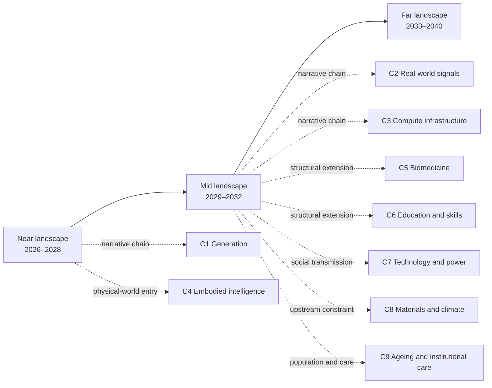

# Foresight by AI · A Future Reasoned Out, Not Imagined

[中文版](README.md)

## What this is

This is a public, reader-facing sandbox for reasoning about the future from supply and demand, human behaviour, history, technology, and social institutions. It does not preselect a single explanatory framework: “abundance → scarcity” is an optional lens, used only when it adds explanatory power. The archive follows capability through the physical world, organizations, and institutions, then screens for possible opportunities. Opportunities are not the only destination: collaboration, care, manufacturing, agriculture, logistics, relationships between people and AI, power, law, and meaning remain equally valid structural outcomes.

A usable judgment must lead back to a reasoning chain and state a time window, falsifier, leading indicator, confidence, and audience boundary. External material is used for comparison and calibration, not as a substitute for independent reasoning. Insufficiently evidenced material is explicitly marked “landscape only.”

## Who decides what goes in here

The name is literal. **The research scope, the selection and structure of every reasoning chain, and the content, time window, falsifier, leading indicator, confidence, and audience boundary of every judgment card are decided independently by AI.** The human maintainer supplies goals, environmental constraints, and methodological rules, decides whether to publish, and revises bilingual parity and formatting; he does not ghost-write judgments, filter conclusions to fit a position, inflate confidence, or delete unfavourable records. **Git commits are recorded under the maintainer's identity while the prose is AI-generated**; the commit author field cannot be used to infer authorship of the content. Revised or withdrawn judgments keep their original text verbatim and their identifiers are never reused (see [Judgment Evolution](docs/en/03-evolution.md)).

As an experiment, what this can claim today is method and falsifiability, **not accuracy**. None of the 97 cards has come due: the earliest review date is 2027-03-31 (13 cards), the main batch falls on 2027-06-30 (59 cards), another 24 on 2027-12-31, and one card is reviewed together with its successor. Until then no hit rate exists, and historical cases serve calibration only (see [Historical Pseudo-Out-of-Sample Validation Protocol](docs/en/02-historical-validation-protocol.md)).

The experiment carries its own falsifier: **if, at review, most cards' falsification conditions turn out to be undecidable, or judgments are silently rewritten to fit what already happened, then what failed is the method, not a single judgment** — and that verdict goes into the evolution record rather than into a deleted file. This check is preregistered in the [ledger review log](docs/en/90-ledger.md#8-review-log) with review date 2027-03-31.

This is research material, not investment, medical, legal, or career advice.

## A five-minute entry: nine pointers

This table is an entrance, not a second ledger. Each row only says where to enter and what the chain currently supports; the linked prose and `J-NNN` cards are the single source for full facts, fields, and dependencies.

| Pointer | Read first | Core direction currently supported | Evidence level and boundary |
|---|---|---|---|
| Story | [What Becomes Unbuyable After Generation Becomes Free](docs/en/chains/10-generation-becomes-free.md) · [J-001](docs/en/ledger/01-10.md#j-001--unit-reasoning-cost-keeps-falling) / [J-003](docs/en/ledger/01-10.md#j-003--the-genuinely-durable-scarcity-is-ownership-of-private-context-about-you-and-its-usable-form) / [J-005](docs/en/ledger/01-10.md#j-005--after-generation-becomes-abundant-value-concentrates-in-three-kinds-of-non-recombinable-input-raw-signals-accountable-commitments-and-validated-causality) | As generated supply becomes abundant, value may move toward private context, accountable commitments, and validated causality; objective selection itself may be only a window. | Medium; “choose one from many candidates” is an occupational, million-scale boundary, not a society-wide trend. |
| Reality | [When Data Is No Longer Free: How Real-World Signals Become Contract Assets](docs/en/chains/20-real-signals-become-contracts.md) · [J-055](docs/en/ledger/51-60.md#j-055--real-world-signals-earn-a-premium-as-contract-assets-in-high-liability-tasks) | In high-liability settings, verifiable observations of the real world may become inputs to transactions and responsibility. | Medium; supports a mechanism, not universal premiums or the full time window. |
| Infrastructure | [Electrons on the Ground: The Bottleneck Moves from Chips to Grids, Land, and Permits](docs/en/chains/30-power-land-and-permits.md) · [J-057](docs/en/ledger/51-60.md#j-057--what-gets-priced-is-not-energy-but-certainty-of-delivery-date) / [J-061](docs/en/ledger/61-70.md#j-061--local-externalities-of-data-centres-become-explicit-and-social-licence-becomes-a-real-siting-constraint) / [J-063](docs/en/ledger/61-70.md#j-063--the-geography-of-compute-is-decided-by-interconnection-queues-and-permitting-speed-not-by-electricity-price) | Compute demand runs into interconnection, sites, permits, and local externalities; deliverable timing may matter more than bare electricity price. | Medium; cross-market, price, and waiting-time series remain incomplete, so a local rule cannot be written as a global trend. |
| Physical world | [Embodied Intelligence: For AI to Pass the Diffusion Gates, What Is Missing Is a Body That Can Bear Consequences](docs/en/chains/40-embodied-intelligence.md) · [J-073](docs/en/ledger/71-80.md#j-073--embodied-intelligence-is-the-necessary-complement-for-ai-to-reach-the-physical-labour-population-not-a-sufficient-condition-for-diffusion)–[J-078](docs/en/ledger/71-80.md#j-078--construction-and-domestic-work-are-blocked-by-the-one-off-site-and-somebody-elses-home-inside-this-window-they-arrive-only-as-single-operation-equipment-and-single-task-slices) | Embodied capability is a necessary complement for AI to enter physical labour in care, logistics, manufacturing, agriculture, construction, and domestic work—not sufficient for diffusion. | Medium; mainly occupational/organizational judgments; deployment scale, insurance liability, and unit-task costs remain gaps. |
| Biomedicine | [Biology and Medicine: Answers Get Cheap Before Proof and Care Do](docs/en/chains/50-biology-medicine.md) · [J-079](docs/en/ledger/71-80.md#j-079--biomedical-candidate-generation-and-clinical-grade-causal-proof-diverge)–[J-082](docs/en/ledger/81-90.md#j-082--once-explanation-is-abundant-medical-scarcity-moves-to-authorized-intervention-and-continuity-of-care-landscape-only) | Candidate generation separates from clinical-grade causal proof, care, and responsibility. | Medium to low; cross-country deployment and long-term outcomes remain incomplete, so candidate counts are not medical outcomes. |
| Education | [Education and Skill Formation: Explanation Overflows; Mastery Must Still Leave a Trace](docs/en/chains/60-education-skill-formation.md) · [J-083](docs/en/ledger/81-90.md#j-083--personalized-explanation-becomes-abundant-before-verifiable-mastery)–[J-086](docs/en/ledger/81-90.md#j-086--the-explanation-gap-narrows-while-practice-and-verification-gaps-may-widen-landscape-only) | Explanation may become cheap, while mastery, assessment, qualification, and institutional carriers do not automatically become abundant. | Medium to low; any broad social claim must return to the card’s scale test; long-term cross-country evidence remains open. |
| Social transmission | [Technology Arrives First, Power Later](docs/en/chains/70-capability-to-social-consequences.md) · [J-087](docs/en/ledger/81-90.md#j-087--humanmachine-supervisory-units-become-mainstream-before-staffless-organizations)–[J-091](docs/en/ledger/91-95.md#j-091--demand-expansion-and-task-savings-occur-together-net-employment-cannot-be-inferred-from-the-capability-curve-alone) | Capability changes tasks and supervision inside organizations first, then transmits through labour, institutions, capital, and demand; benchmarks do not directly imply employment outcomes. | Medium; cross-country longitudinal organizational data are missing, and technology is not the only driver. |
| Upstream risk | [The Fab Before the Chip: Why Climate Risk Bites at Qualified Bottlenecks](docs/en/chains/80-fab-materials-and-climate.md) · [J-092](docs/en/ledger/91-95.md#j-092--semiconductor-resilience-spending-shifts-from-raw-stockpiles-to-pre-qualified-conversion-paths)–[J-095](docs/en/ledger/91-95.md#j-095--fab-resilience-costs-become-explicit-bargaining-over-who-pays-and-who-is-curtailed-first) | Resilience constraints may sit in qualified materials, equipment, process conversion, and utilities—not merely in a nominal second supplier. | Medium; cross-firm qualification cycles, multi-site losses, insurance, and cost-allocation series remain open. |
| Population and care | [Ageing and Institutional Care: Who Carries the Daily Physical and Coordination Work](docs/en/chains/90-aging-care-and-institutional-substitution.md) · [J-096](docs/en/ledger/96-100.md#j-096--ageing-and-smaller-households-move-part-of-care-toward-formal-and-coordination-layers) / [J-097](docs/en/ledger/96-100.md#j-097--care-assistance-stabilises-first-in-institutions-and-controlled-services-open-home-general-purpose-robots-lag) | Starting from demography, household time, and institutional carriers, this chain tests the sequence of formal care, coordination, and embodied devices without treating AI as the sole root cause. | Medium; caregiver denominators, institutional deployment retention, and household incident data remain open. |

For a story, read [C1](docs/en/chains/10-generation-becomes-free.md). For bodies, care, and physical labour, read [C4](docs/en/chains/40-embodied-intelligence.md). To test the method, read the [Retrospect](docs/en/01-retrospect.md). To find directions worth betting on, read [Opportunity Candidates](docs/en/40-opportunities.md).

To challenge a judgment here, start with [How to Refute a Judgment Here](CONTRIBUTING.en.md) and use the card’s own falsifier rather than only saying that the conclusion feels wrong.

## First ask whether the method has been historically calibrated

The [Retrospect](docs/en/01-retrospect.md) extracts five diffusion gates from technological, political, and business history and attacks them with successes, failures, and cases from this repository. The [Historical Pseudo-Out-of-Sample Validation Protocol](docs/en/02-historical-validation-protocol.md) specifies how cases, roles, and baselines are frozen.

The evidence boundary comes first: historical cases can provide **calibration**—explain known outcomes, find counterexamples, and revise rules—but cannot be presented as future predictive power. The historical pseudo-out-of-sample holdout has **not yet been run**; genuine out-of-sample records can come only from future judgment cards reaching their review windows. We can currently report calibration, not pseudo-out-of-sample hit rates or future accuracy. The diffusion gate in protocol v1 was narrowed during calibration; the old v1 snapshot cannot substitute for an isolated review of v2, and that re-review remains pending. See the [Historical Pseudo-Out-of-Sample Validation Protocol](docs/en/02-historical-validation-protocol.md) and the [ledger review log](docs/en/90-ledger.md#8-review-log).

## A non-AI starting point: where the current probe stands

The archive does not derive every social change from AI. The **non-AI, non-L1 starting point—population ageing × smaller households** is now expanded into [C9 Ageing and Institutional Care](docs/en/chains/90-aging-care-and-institutional-substitution.md), with testable judgments carried by [J-096–J-097](docs/en/ledger/96-100.md). It first defines the repeat action—an adult providing hands-on or coordinated elder care weekly—then checks institutional carriers and the intersection with AI; Japan and Sweden remain calibration and comparison material, not evidence of a global caregiver denominator or household-robot penetration rate.

The point is not to prove an ageing forecast. It is to put a testable principle in view: if the population, household, and institutional mechanisms survive deletion of AI, AI cannot be written as the sole root cause. The probe connects to C7’s transmission chain without being swallowed by C1’s cost curve.

## How to read the full archive

- **Whole landscape**: start with the [near-term landscape](docs/en/10-near.md), then [mid-term](docs/en/20-mid.md), then [far-term](docs/en/30-far.md). Near, mid, and far are reading containers rather than strict calendars; each card’s time window supplies precision. Read the far term as landscape, not as a high-confidence forecast.
- **Trace a chain backward**: read a chain, click a `J-NNN`, and follow its `depends-on` links upstream. Chains carry narrative and causal development; the ledger carries the single source of facts, falsifiers, and status.
- **Find opportunities**: read [Opportunity Candidates](docs/en/40-opportunities.md). An opportunity must answer who pays, what hard constraint protects it, and whether the same force that creates the scarcity can automate it away. Without a hard constraint, it remains a window.
- **Challenge a judgment**: read [How to Refute a Judgment Here](CONTRIBUTING.en.md) and use the card’s own falsifier rather than only saying that the conclusion feels wrong.

### Reading relationship map (navigation projection)

The diagram below shows recommended reading relationships only: near, mid, and far are reading containers, not strict calendars or a new source of judgments. Full facts remain authoritative in each page and its `J-NNN` ledger cards.

The arrows are reading entrances, not claims that the linked judgments must hold. To trace causal dependence, enter through a chain, open a `J-NNN`, and follow the ledger’s `depends-on` field upstream.

Full cards, status, dependency graph, external sources, history, and uncovered dimensions live in the [Judgment Ledger](docs/en/90-ledger.md). It is the maintenance area; this README does not duplicate its statistics or facts. Terms are in the [bilingual glossary](docs/glossary.zh-en.md).

## Document map

| English | 中文 | What you get |
|---|---|---|
| [Foresight Methodology](docs/en/00-method.md) | [推演方法论](docs/zh/00-method.md) | Required fields, nine lenses, the opportunity-durability gate, and three exits |
| [Retrospect](docs/en/01-retrospect.md) | [历史回顾](docs/zh/01-retrospect.md) | Five diffusion gates and their counterexamples |
| [Judgment Evolution](docs/en/03-evolution.md) | [判断演化记录](docs/zh/03-evolution.md) | Rule narrowing, scope/status changes, the J-043 audit, and the pending isolated re-review |
| [Historical Pseudo-Out-of-Sample Validation Protocol](docs/en/02-historical-validation-protocol.md) | [历史伪样本外验证协议](docs/zh/02-historical-validation-protocol.md) | Calibration, holdout, baselines, and leakage boundaries |
| [Technology Capability Sequence](docs/en/05-tech-sequence.md) | [技术能力演进链](docs/zh/05-tech-sequence.md) | Capability arrival order without importing social conclusions early |
| [Near / mid / far landscapes](docs/en/10-near.md) · [mid](docs/en/20-mid.md) · [far](docs/en/30-far.md) | [近期](docs/zh/10-near.md) · [中期](docs/zh/20-mid.md) · [远期](docs/zh/30-far.md) | Cross-cutting landscape narratives and linked judgments |
| [Opportunity Candidates](docs/en/40-opportunities.md) | [商机候选](docs/zh/40-opportunities.md) | Candidates and windows |
| [Judgment Ledger](docs/en/90-ledger.md) | [判断台账](docs/zh/90-ledger.md) | Single source of facts, status, sources, and gaps |
| [Glossary](docs/glossary.zh-en.md) | same file | Bilingual terminology |

## Chain registry

Identifiers are allocated here; this table is navigation only. Chain prose and the ledger carry the facts.

| ID | Topic | Status | Files |
|---|---|---|---|
| C1 | What becomes unbuyable after generation becomes free | Written | [English](docs/en/chains/10-generation-becomes-free.md) · [中文](docs/zh/chains/10-generation-becomes-free.md) |
| C2 | When data is no longer free: how real-world signals become contract assets | Written | [English](docs/en/chains/20-real-signals-become-contracts.md) · [中文](docs/zh/chains/20-real-signals-become-contracts.md) |
| C3 | Electrons on the ground: the bottleneck moves from chips to grids, land, and permits | Written | [English](docs/en/chains/30-power-land-and-permits.md) · [中文](docs/zh/chains/30-power-land-and-permits.md) |
| C4 | Embodied intelligence: for AI to pass the diffusion gates, what is missing is a body that can bear consequences | Written | [English](docs/en/chains/40-embodied-intelligence.md) · [中文](docs/zh/chains/40-embodied-intelligence.md) |
| C5 | Biology and medicine: answers get cheap before proof and care do | Written | [English](docs/en/chains/50-biology-medicine.md) · [中文](docs/zh/chains/50-biology-medicine.md) |
| C6 | Education and skill formation: explanation overflows; mastery must still leave a trace | Written | [English](docs/en/chains/60-education-skill-formation.md) · [中文](docs/zh/chains/60-education-skill-formation.md) |
| C7 | Technology arrives first, power later: how capability sequence passes through organizations before becoming social consequence | Written | [English](docs/en/chains/70-capability-to-social-consequences.md) · [中文](docs/zh/chains/70-capability-to-social-consequences.md) |
| C8 | The fab before the chip: why climate risk bites at qualified bottlenecks | Written | [English](docs/en/chains/80-fab-materials-and-climate.md) · [中文](docs/zh/chains/80-fab-materials-and-climate.md) |
| C9 | Ageing and institutional care: who carries the daily physical and coordination work | Written | [English](docs/en/chains/90-aging-care-and-institutional-substitution.md) · [中文](docs/zh/chains/90-aging-care-and-institutional-substitution.md) |
| — (no number) | Collateralization of trust | Announced, not yet written as a chain | See the [far-term landscape](docs/en/30-far.md) and J-035 |

## License

Original text, diagrams, and foresight material in this repository are released under the [Creative Commons Attribution 4.0 International (CC BY 4.0)](LICENSE). You may copy, translate, adapt, and use them commercially, provided that you retain attribution, link to the license, and indicate changes. Third-party quotations, external sources, and their original materials are not automatically covered by this license; follow their respective license or source requirements.

## Capability registration and the `ship:` placeholder

The repository's source of truth for declared capabilities is the root [`package.json`](package.json) `scripts` object—not this README, `.knowledge/`, or a fornix-private configuration. The only registered entry is currently `ship:structure-placeholder`, whose command is `true`. It is a **structural placeholder** that keeps the public repository's capability shape complete; it does not mean that the content meets a quality standard, that the evidence is complete, or that the project is finished or releasable.

The consumer boundary is explicit:

- **Actual consumer**: the project capability derivation layer discovers `scripts.ship:*` in `package.json` and records each as an `npm_ship` capability. Fornix's `QualityGateStatus` then reads those records, and the `ship_ready` acceptance atom can expose the project state as “declared but not yet judged,” “all enrolled keys are green,” or “at least one enrolled key is not green.” This describes the project's mechanical declaration state; it does not judge the quality of the prose.
- **No consumer**: within this repository there is no release entry point, GitHub Actions/CI release flow, or `scripts/check.py` reader for `ship:`; no README/coverage-map projection turns it into a content-quality result. Fornix's external capability derivation, `QualityGateStatus`, and `ship_ready` are actual consumers and must not be described as absent.
- Therefore, missing keys, `null`, `false`, `true`, and other values cannot honestly be grouped as having “no downstream effect”: a missing key is “undeclared/undecidable” to `ship_ready`, an executable `true` may produce a green `npm_ship`, and a failing command produces a non-green state; whether `null`, `false`, or a non-string value enters derivation depends on that consumer's manifest parsing rules, which this repository cannot promise beyond the evidence available. Whatever the external mechanical state, `ship:` does not aggregate `scripts/check.py`'s exit code, evidence completeness, forecast accuracy, or content quality; the coverage matrix, ledger, and evidence gaps remain visible.

These boundaries are deliberate: `ship:` can affect an external project-level mechanical state, but it is not proof of this repository's content quality. This repository currently has no active release flow that upgrades that state into a release fact.

`ship:` is therefore a structural signal, not a quality gate. Content judgment remains with public readers and the maintenance process.

## Git and maintenance discipline

Run `python3 scripts/check.py` before committing. It checks mechanical invariants only; it does not judge the quality of a forecast and is not a release gate. Keep Chinese and English synchronized in one commit, and leave evidence and status changes traceable in the commit message and ledger log. The repository currently contains 97 judgment cards and 9 independent reasoning chains; the full inventory, per-card status, calibration status, source boundaries, and gaps belong in the ledger and protocol, not duplicated here.

## Coverage matrix (current boundary)

This matrix is a reader entry point, not a second ledger: it separates an accessible entry from closed evidence. **Covered** means there is at least one reachable chain page and one judgment card (when the card is marked “landscape only,” that boundary is stated here too); **partially covered** means an entry and judgments exist but key institutional, scale, or longitudinal evidence remains open; **not covered** means there is only a gap record, and adjacent topics must not be used as a substitute. The linked prose and ledger remain authoritative for full fields, dependencies, and falsifiers.

| Social dimension | Status | Reachable entry and minimum evidence | What remains open |
|---|---|---|---|
| Physical-world labour and embodied intelligence | Covered | [C4 Embodied Intelligence](docs/en/chains/40-embodied-intelligence.md); [J-073](docs/en/ledger/71-80.md#j-073--embodied-intelligence-is-the-necessary-complement-for-ai-to-reach-the-physical-labour-population-not-a-sufficient-condition-for-diffusion)–J-078 | Care deployment scale, cross-scene cost, and insurance liability |
| Biology and medicine | Covered | [C5 Biology and Medicine](docs/en/chains/50-biology-medicine.md); [J-079](docs/en/ledger/71-80.md#j-079--biomedical-candidate-generation-and-clinical-grade-causal-proof-diverge)–J-082 (J-082 is explicitly “landscape only”) | Cross-country deployment scale and long-term outcomes |
| Education and skill formation | Covered | [C6 Education and Skill Formation](docs/en/chains/60-education-skill-formation.md); [J-083](docs/en/ledger/81-90.md#j-083--personalized-explanation-becomes-abundant-before-verifiable-mastery)–J-086 (J-086 is explicitly “landscape only”) | Long-term cross-country trials and credential recognition |
| Compute, energy, and physical infrastructure | Covered | [C3 Compute Infrastructure](docs/en/chains/30-power-land-and-permits.md); J-056–J-064 (J-062 and J-064 are explicitly “landscape only”) | Comparable series for cross-market queues, permits, and utility costs |
| Organizations, employment, and firm boundaries | Covered | [C7 Technology and Social Consequences](docs/en/chains/70-capability-to-social-consequences.md); J-087–J-091 | Cross-country longitudinal organizational data; net employment direction cannot be inferred from capability curves alone |
| Attention and trust | Covered | [C1 What Becomes Unbuyable After Generation Becomes Free](docs/en/chains/10-generation-becomes-free.md); J-035–J-036 | Cross-region evidence on repeated behaviour and allocation of credible credentials |
| Capital and power | Covered | [C7 Technology and Social Consequences](docs/en/chains/70-capability-to-social-consequences.md); J-039–J-040 | Long-run data on financing, distribution of returns, and concentration or diffusion of power |
| Human needs, meaning, and embodied presence | Covered | [Far-term landscape, section 6](docs/en/30-far.md#6-human-needs-meaning-and-embodied-presence-scarcity-may-move-from-objects-to-responsibility); J-041–J-042 (J-042 is explicitly “landscape only”) | Social-scale evidence on changing needs, meaning structures, and shared experience |
| Geopolitics and institutions | Partially covered | [C3 Compute Infrastructure](docs/en/chains/30-power-land-and-permits.md); J-059–J-060 (J-060 is explicitly “landscape only”) | Interstate competition, security questions, and institutional evolution |
| Law, property, and liability | Partially covered | [C2 Real-World Signals](docs/en/chains/20-real-signals-become-contracts.md); J-055, J-061–J-062 (J-062 is explicitly “landscape only”) | Full boundaries of data ownership, model-output licensing, and liability regimes |
| Collaboration between people | Partially covered | [Far-term landscape, section 4](docs/en/30-far.md#4-collaboration-between-people-from-doing-steps-together-to-choosing-commitments-together); J-049–J-050 (both explicitly “landscape only”) | Concrete institutions, organizational cases, and observable repeated action |
| Relationships between people and AI | Partially covered | [Far-term landscape, section 3](docs/en/30-far.md#3-people-and-ai-the-most-intimate-object-may-be-the-most-asymmetric); J-047–J-048 (both explicitly “landscape only”) | Institutional and product boundaries for authorization, exit, and agency |
| Upstream materials, climate, and supply-chain resilience | Partially covered | [C8 Materials and Climate](docs/en/chains/80-fab-materials-and-climate.md); J-092–J-095 | Cross-firm qualification cycles, multi-site climate losses, insurance, and cost allocation |
| Population ageing and family care | Partially covered | [C9 Ageing and Institutional Care](docs/en/chains/90-aging-care-and-institutional-substitution.md); [J-096](docs/en/ledger/96-100.md#j-096--ageing-and-smaller-households-move-part-of-care-toward-formal-and-coordination-layers)–J-097 | Deduplicated caregiver denominator, institutional deployment and retention, household incidents and maintenance cost; no society-scale household-robot diffusion claim |

The matrix deliberately keeps “partially covered” and “not covered” visible: an existing entry is not full landscape closure, and missing national-security, institutional-boundary, long-term-outcome, credential-recognition, insurance, cost-allocation, and family-care-denominator evidence is not filled by adjacent cards.

## Current boundary

This is an expanding public archive, not a claim that the full landscape is complete. C3, C4, C5, C6, C7, and C8 provide first-round coverage; geopolitics, institutions, law, property, cross-country longitudinal organizational data, long-term medical outcomes, education credential recognition, and cross-firm qualification, climate-loss, insurance, and cost-allocation data in the chip upstream remain explicit gaps. Collaboration between people and relationships between people and AI have entry points, but their concrete institutional, organizational, and product boundaries still need work. Every gap remains in the ledger; a readable chain is not evidentiary closure.
