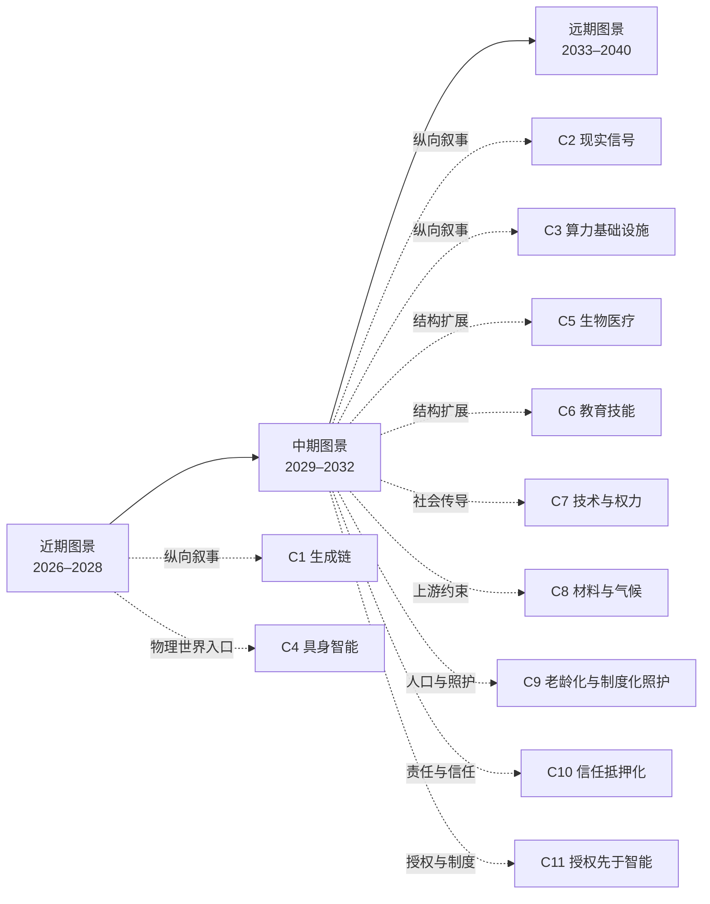

# AI 自己推演的未来世界 · Foresight by AI

> 推演出来的，不是想象出来的。

[English version](README.en.md)

## 这是什么

这是一个面向公开读者的未来沙盘：从供需、人性、历史、技术与社会规律出发，推演能力如何穿过物理世界、组织和制度，最后再筛选可能的商机。项目不预设单一解释框架；「丰富→稀缺」只是可选透镜，只有在确实增加解释力时才使用。它不把商机当作唯一出口；人与人协作、人与 AI 的关系、照护、制造、农业、物流、权力、法律与意义等结构性后果同样保留。

- **直接进入未来** → [五分钟入口](#五分钟入口先校准再沿推演链读未来)：先看方法如何被历史攻击，再沿一条推演链进入社会图景。
- **先看这套判断的边界** → [这套档案能声称什么、不能声称什么](#这套档案能声称什么不能声称什么)：谁决定内容、验证到哪一步、哪些条件尚未满足。

## 五分钟入口：先校准，再沿推演链读未来

这是一条渐进式阅读路径，不要求读者先接受任何预测：先看方法如何被历史案例攻击，再从一条具体推演链进入社会图景，最后决定是否要追踪证据、寻找行动方向或提出反例。下方链接是入口，不是第二份台账；完整事实、字段和依赖关系只在链接的正文与 `J-NNN` 卡片中维护。

### 1. 先看方法与历史：判断是怎样被筛选出来的

- [历史回顾](docs/zh/01-retrospect.md)：从科技、政治和商业史中抽取普及闸，并用成功与失败案例攻击它们。
- [跨领域历史校准证据切片（规范公开入口）](docs/evidence/historical-calibration-2026-10-02.md)：逐案查看 `P-04`、`B-WEBVAN`、`T-SHUTTLE` 的 2+1 分类、原始定位、同口径指标与证据等级边界。
- [历史校准轮档案（与规范切片同一组 2+1，不重复计数）](docs/evidence/historical-calibration-round-2026-10.md)：保留较早轮次的完整叙述，案例为 `P-04`、`B-WEBVAN`、`T-SHUTTLE`，不与规范切片相加。
- [下一批历史预测—结果证据记录](docs/evidence/historical-calibration-next-batch-2026-10-02.md)：查看批次范围；其中 4 条记录包含 3 条校准配对（前两条沿用切片记录，`B-ETOYS` 为本批新增）与 1 条未知候选。
- [历史伪样本外验证协议](docs/zh/02-historical-validation-protocol.md)：查看案例、角色、基线如何冻结，以及历史材料不能证明什么。
- [推演方法论](docs/zh/00-method.md)：查看判断字段、并列依据、可选透镜和机会筛选闸。
- [判断演化记录](docs/zh/03-evolution.md)：查看规则收窄、判断修订，以及隔离重审两轮的执行记录与仍未闭合的三项（运行时间、第二轮原始输出、受众字段泄漏）。
- [下一研究缺口优先级](docs/zh/04-research-gaps.md)：查看部分覆盖维度的公开排序、下一研究动作与证据边界。

先读这一步，是为了把下面的内容当作带证据边界的推演，而不是把叙事流畅误读成预测准确。

### 2. 再选一条推演链：从一个具体问题进入未来

下面按读者想追踪的现实问题分组。每一行只告诉你从哪里进入、这条链目前能支持到什么边界；卡片的证据等级和限制仍以链接正文与台账为准。

#### 生成、现实信号与基础设施

| 指针 | 先读什么 | 当前能支持的核心方向 | 证据等级与边界 |
|---|---|---|---|
| 读故事 | [生成变得免费之后，什么反而买不到了](docs/zh/chains/10-generation-becomes-free.md) · [J-001](docs/zh/ledger/01-10.md#j-001--同等能力的单位推理成本继续下降) / [J-003](docs/zh/ledger/01-10.md#j-003--真正持久的稀缺是关于你的私有上下文的所有权与可用形态) / [J-005](docs/zh/ledger/01-10.md#j-005--生成丰富之后价值向三类不可重组的输入集中原始信号可追责承诺被验证因果) | 生成供给变丰富后，价值可能转向私有上下文、可追责承诺和已验证因果；客观择优本身可能只是窗口。 | 中等；其中「从大量候选中择一」是职业性、百万量级边界，不是社会级趋势。 |
| 读现实 | [当数据不再免费：现实信号如何变成合同资产](docs/zh/chains/20-real-signals-become-contracts.md) · [J-055](docs/zh/ledger/51-60.md#j-055--高责任任务中的现实信号以合同资产形式获得溢价) | 在高责任场景，真实世界的可验证观测可能成为交易与责任的输入。 | 中等；支持机制方向，不自动支持普遍溢价或完整时间窗。 |
| 读基础设施 | [电子落地：算力的瓶颈从芯片移到电网、土地与许可](docs/zh/chains/30-power-land-and-permits.md) · [J-057](docs/zh/ledger/51-60.md#j-057--被定价的不是电量而是可交付时间的确定性) / [J-061](docs/zh/ledger/61-70.md#j-061--数据中心的本地外部性显性化社会许可成为选址的真实约束) / [J-063](docs/zh/ledger/61-70.md#j-063--算力的地理分布由并网排队与审批速度决定而不是由电价决定) | 算力需求会撞上并网、场址、许可和本地外部性；可交付时间可能比裸电价更重要。 | 中等；多项跨市场、价格与等待时间序列仍缺，不能把单地规则写成全球趋势。 |

#### 物理世界、照护与人的能力

| 指针 | 先读什么 | 当前能支持的核心方向 | 证据等级与边界 |
|---|---|---|---|
| 读物理世界 | [具身智能：AI 要过普及闸，缺的是一具能承担后果的身体](docs/zh/chains/40-embodied-intelligence.md) · [J-073](docs/zh/ledger/71-80.md#j-073--具身智能是-ai-触及物理劳动人口的必要补足不是普及的充分条件)–[J-078](docs/zh/ledger/71-80.md#j-078--建筑与家政被一次性现场与别人的家挡住本窗口内只以单工序设备与单任务切片到达)；社会后果扩展：[J-099](docs/zh/ledger/96-102.md#j-099--具身自动化先重排职业任务包而非同步消灭整个职业)–[J-102](docs/zh/ledger/96-102.md#j-102--具身生产率收益先向互补资产与责任承载者集中) | 具身能力是 AI 进入照护、物流、制造、农业、建筑与家政等物理劳动的必要补足；扩散后先重排任务、家庭角色、区域承载与收益分配，不自动等于社会级普及。 | 中等；主要是职业／组织与社会后果推演，部署规模、保险责任、单位任务成本、跨区域与分配序列仍是缺口。 |
| 读生物医学 | [生物与医疗：答案会先变便宜，证明与照护不会](docs/zh/chains/50-biology-medicine.md) · [J-079](docs/zh/ledger/71-80.md#j-079--生物医学候选生成与临床级因果证明会分叉)–[J-082](docs/zh/ledger/81-90.md#j-082--解释变多后医疗稀缺移向获授权的干预与连续照护仅图景) | 候选生成与临床级因果证明、照护和责任承担会分叉。 | 中等至低；跨国部署与长期结局证据不足，不能把候选数量当成医疗结果。 |
| 读教育 | [教育与技能形成：讲解会泛滥，掌握仍要留下痕迹](docs/zh/chains/60-education-skill-formation.md) · [J-083](docs/zh/ledger/81-90.md#j-083--个性化讲解先于可验证掌握变丰富)–[J-086](docs/zh/ledger/81-90.md#j-086--解释鸿沟缩小但练习与验证鸿沟可能扩大仅图景) | 解释可能变便宜，但掌握、评估、资格与制度承载不会自动同步丰富。 | 中等至低；若涉及大范围社会结论，须回到卡片的规模判定；长期跨国证据仍缺。 |
| 读人口与照护 | [人口老龄化与制度化照护：谁承担每天的身体与协调工作](docs/zh/chains/90-aging-care-and-institutional-substitution.md) · [J-096](docs/zh/ledger/96-102.md#j-096--老龄化与家庭缩小把部分照护推向正式服务与协调层) / [J-097](docs/zh/ledger/96-102.md#j-097--照护辅助先在机构与受控服务中稳定开放家庭通用机器人滞后) | 从人口、家庭时间与制度载体出发，推演正式照护、协调层与具身设备的先后；不把 AI 当作唯一根因。 | 中等；照护者分母、机构部署留存与家庭设备事故数据仍缺。 |
| 读授权与责任 | [授权先于智能：代理、责任与人与 AI 的关系](docs/zh/chains/110-authority-before-intelligence.md) · [J-098](docs/zh/ledger/96-102.md#j-098--授权先于智能高责任场景先形成可撤回的分级代理) | 从代理制度、授权、撤回和责任承接出发，推演 AI 先作为受控分级代理进入人与人的既有关系。 | 中等；跨法律制度的代理事故、撤回成功率、保险定价和长期使用数据仍缺；不把 AI 主体性写成结论。 |

#### 组织、权力、材料与信任

| 指针 | 先读什么 | 当前能支持的核心方向 | 证据等级与边界 |
|---|---|---|---|
| 读社会传导 | [技术先到，权力后到](docs/zh/chains/70-capability-to-social-consequences.md) · [J-087](docs/zh/ledger/81-90.md#j-087--人机监督单元先于无人组织成为主流部署单位)–[J-091](docs/zh/ledger/91-95.md#j-091--需求扩张与任务节省同时发生净就业方向不能由能力曲线单独推出) | 能力先改变组织中的任务与监督，再通过劳动、制度、资本和需求传导；不能从 benchmark 直接跳到就业结论。 | 中等；跨国长期组织数据不足，技术不是唯一发动机。 |
| 读上游风险 | [芯片之前的晶圆厂：为什么气候风险咬住的是「已验证瓶颈」](docs/zh/chains/80-fab-materials-and-climate.md) · [J-092](docs/zh/ledger/91-95.md#j-092--半导体韧性投入从原料库存转向已验证转化路径)–[J-095](docs/zh/ledger/91-95.md#j-095--晶圆厂韧性成本变成谁付钱与谁先被限供的显式谈判) | 真正的韧性约束可能在已验证的材料、设备、工艺转换和公用工程，而不只是名义上的第二供应商。 | 中等；跨企业资格周期、多场址损失、保险与成本分摊序列仍缺。 |
| 读信任交易 | [信任抵押化：当表达不再证明能力，谁为结果承担后果](docs/zh/chains/100-trust-collateralization.md) · [J-035](docs/zh/ledger/31-40.md#j-035--责任抵押进入重要-ai-输出的交易结构) | 在高责任、可定价的组织交易中，履约记录、赔付能力与审计可能成为一次性演示之外的信任接口。 | 中等偏低；J-035 仍是职业／组织性判断，尚未证明责任抵押普遍化；观察窗为 2028–2035。 |

### 3. 再看社会全景：把一条链放回更大的关系网

- [近期／中期／远期图景](docs/zh/10-near.md)：近／中／远只是阅读容器，不是严格日历。
- [技术能力演进链](docs/zh/05-tech-sequence.md)：查看能力出现次序，但不要把技术当作社会变化的唯一发动机。
- [全景覆盖矩阵](#全景覆盖矩阵当前边界)：检查哪些社会维度已有入口，哪些仍是明确缺口。
- **C11 授权先于智能**：从代理制度、授权与责任开始，查看人与 AI 关系的制度入口。
- [社会级判断登记面](docs/zh/91-social-scale-register.md)：先看通过侧——现在有几条判断过了闸一（实测为零），其余候选卡在哪一闸、要过闸必须观测到哪个可数事实。

### 4. 最后决定行动或质疑

- [商机候选](docs/zh/40-opportunities.md)：只把有付费者和硬约束的方向列为候选；其余保留为窗口或仅图景。
- [判断台账](docs/zh/90-ledger.md)：追踪唯一事实源、`J-NNN` 状态、依赖、来源与缺口。
- [如何反驳这里的判断](CONTRIBUTING.md)：用卡片自己的证伪条件提出反例，而不是只说结论“不像”。

## 这套档案能声称什么、不能声称什么

这一节回答两个问题：这套档案现在能声称什么，以及它明确不能声称什么。下面的边界说明原本排在阅读路径之前，现在收拢在这里，内容一字未改。

项目的基本纪律是：一条可用判断必须能回到推理链，并给出时间窗、证伪条件、领先指标、置信度和受众边界。外部材料用于对照和校准，不代替独立推演；证据不足的内容明确标为「仅图景」。

### 这个档案由谁决定

名字说的是字面意思。**研究范围、推演链的选题与结构、每张判断卡的内容、时间窗、证伪条件、领先指标、置信度与受众边界，全部由 AI 独立决定**；人类维护者提供目标、环境条件与方法论约束，决定是否公开，并对双语一致性与排版做修订，不代写判断、不按立场取舍结论、不上调置信度、不删除不利记录。**git 提交以维护者身份记录，正文内容由 AI 生成**；提交作者字段不能用来反推内容归属。判断被修订或撤回时原文一字不删、编号不复用（见[判断演化记录](docs/zh/03-evolution.md)）。

作为实验，现在能声称的只有方法与可证伪性，**不是准确率**。当前没有任何判断卡到期；复核批次、日期与「命中率」边界以[台账检查日志](docs/zh/90-ledger.md#八检查日志)为准。在那之前，历史案例只用于 calibration（见[历史伪样本外验证协议](docs/zh/02-historical-validation-protocol.md)）。

### 当前验证状态：协议、结果与缺口分开看

公开读者需要把下面三件事分开：

- **仓库全量档案（archive total）**：当前可重建的 `CALIBRATION` 配对共 **6 条**——政治 `P-01`、`P-02`、`P-04`、`P-06` 四条，商业 `B-WEBVAN`、`B-ETOYS` 两条，科技 0 条。这是唯一表示“整个仓库合格校准档案规模”的数字，即 **6/12**；六案都是结局已知后选入的材料，不是伪样本外命中率或未来准确率。
- **方法论当前摘要（method snapshot）**：2026-10 的方法论只摘要两份最新证据记录：三条可重建 `CALIBRATION` 配对（`P-04`、`B-WEBVAN`、`B-ETOYS`）与一条 `UNKNOWN/UNVERIFIED` 科技候选（`T-SHUTTLE`）。这个 **3 + 1** 是摘要范围，不是仓库全量，也不是新增三案。
- **尚未满足的条件**：协议要求科技、政治、商业各至少 4 案、总计至少 12 案；科技候选因无法同时重建 T 前原件、同口径指标和观察窗，当前仍为证据缺口。缺口不能用事后叙述或 URL 清单填平。
- **隔离重审已执行两轮，但「独立正确性」仍未得证**（2026-10-09 更新；本条此前写「尚无可核验的重审启动证据」，已不成立）：102 张卡全部拿到了在主张正文完好的记录上作出的盲判处置，去标签 bundle 的输入哈希、首轮 6 份重审者原始输出都已入库可复算（[复审报告](docs/evidence/blind-review-reaudit-2026-10-09.md)）。仍然缺的是三件：**运行时间**未按协议留痕；第二轮 3 份原始输出永久不可恢复；**最重要的一条——受众字段把闸一旧结论原样递给了重审者**（102 张卡全部），第二轮 15 次闸一否决里 12 次直接引用它判闸，所以那些「盲判复现现有限定」不得读作独立重建。重审者与原作者还是同一个模型，所以它测的是可复现性，不是准确率。协议的存在、机械检查通过、哈希齐备，三者相加仍不等于方法已通过验证。

因此，当前入口能诚实提供的是一套**已执行部分校准、明确记录未满足条件、并保留重审承诺**的方法档案，而不是一个已经证明准确的预测系统。细节与提交锚见[判断演化记录](docs/zh/03-evolution.md)。

#### 历史校准数字怎么读

下列数字有意保留，因为它们的范围不同，不能互相替换：**首份跨领域 evidence slice** 是 `2` 条可重建配对（`P-04`、`B-WEBVAN`）+ `1` 条未知候选（`T-SHUTTLE`）；[historical-calibration-round-2026-10.md](docs/evidence/historical-calibration-round-2026-10.md) 是这同一组 `P-04`、`B-WEBVAN`、`T-SHUTTLE` 的较早档案轮记录，不是第二份样本，不能与 slice 相加；**下一批 evidence batch** 是 `4` 条记录，其中 `3` 条 `CALIBRATION`（前两条是已有记录，只有 `B-ETOYS` 是新增到该批的记录）+ `1` 条未知候选。要看单个切片或批次的数字，回到[证据导航](docs/zh/01-retrospect.md#103-最新跨领域证据切片与下一批等级观察窗与口径2026-10)；要看仓库全量，以上 **6 条**才是总档案口径。

这个实验自己也有证伪条件：**若到期复核时多数卡片的证伪条件被发现无法判定，或判断被静默改写以适配已发生的事实，那么失败的不是某一条判断，而是这套方法**——届时结论写进判断演化记录，而不是删档。该检查已预登记在[台账检查日志](docs/zh/90-ledger.md#八检查日志)，检查日 2027-03-31。

本档案是研究材料，不构成投资、医疗、法律或职业建议。

### 先问：方法是否经过历史校准

[历史回顾](docs/zh/01-retrospect.md)从科技、政治和商业史中抽取五道普及闸，并用成功、失败和本项目自身的例子攻击它们。[历史伪样本外验证协议](docs/zh/02-historical-validation-protocol.md)规定如何冻结案例、角色和基线。

重要的证据边界必须先说清：历史案例能做**calibration**（解释已知结果、寻找反例、改规则），但不能伪装成未来预测力。历史伪样本外留存集尚未执行；真正的样本外记录只能来自未来到期的判断卡。因此当前可以报告 calibration，不能报告 pseudo-out-of-sample 命中率或未来准确率。协议 v1 的普及闸在校准后收窄过，旧 v1 快照不能替代 v2 的隔离重审；**该隔离重审已于 2026-10-09 执行两轮**，在册判断卡全部获得一个在主张正文完好的记录上作出的逐卡处置——但它**只测可复现性**（重审者与原作者是同一个模型，去标签消除不了训练记忆），不构成准确率、方法有效性或样本外证据，且协议要求的四项启动证据目前只满足三项（缺运行时间），另有一条来源泄漏尚未消除，详见[历史伪样本外验证协议](docs/zh/02-historical-validation-protocol.md)与[台账检查日志](docs/zh/90-ledger.md#八检查日志)。这个证据边界不否定重审方向，也不等于方法已被否定。

### 当前字段迁移与证据边界

旧判断卡的字段迁移已经收口到当前公开台账：现行卡片按统一结构记录推理链、时间窗、证伪条件、领先指标、置信度、受众边界、状态与依赖；历史卡片的原始判断、修订轨迹和迁移说明仍保留，方便读者区分当时写法与当前要求。迁移统一了可读结构，**不等于历史方法验证已经完成**。

仍需分开的边界有三层：

- **字段已迁移**：卡片现在有可定位的字段和双语入口；这只说明信息按当前结构呈现。
- **证据未知或未验证**：部分受众分母、跨制度比较、长期结果、部署规模与价格序列仍明确写为未知、未验证或缺口；未知不会被迁移动作填成事实。
- **方法验证未闭合**：历史校准、留存重审和未来到期复核各自有独立条件；字段齐全不代表判断准确，也不代表方法已经通过验证。

因此，读者应把台账中的迁移状态、证据边界和验证状态分别阅读；任何卡片的具体结论、限制和当前状态，以其台账正文为准。

要审计旧卡如何进入当前结构，请阅读[旧判断卡迁移清单（中文 canonical inventory）](docs/evidence/legacy-ledger-migration.md)；英文读者可用其[英文投影](docs/evidence/legacy-ledger-migration.en.md)进入同一组 J-001–J-095 历史锚点。英文文件是公开可达的投影，不是第二事实源；中英文内容或边界出现差异时，以中文清单为准。该清单保留历史追溯、未知／未验证字段、迁移范围及 J-096 起点边界，不把字段齐全误写成方法已经验证。

## 一个重要的非 AI 起点：当前探针到哪里了

项目没有把所有社会变化都从 AI 里推出。档案中还保留一条**不从 AI 或 L1「丰富→稀缺」起步的人口老龄化 × 家庭缩小**非 AI 社会力量探针；它现在已经扩展为 [C9 人口老龄化与制度化照护](docs/zh/chains/90-aging-care-and-institutional-substitution.md)，并由 [J-096–J-097](docs/zh/ledger/96-102.md) 承载可检验判断。它先定义「成年人每周亲手或协调老人照护」这一重复动作，再检查制度载体与 AI 的交集；日本与瑞典材料仍只是校准和对照，不提供全球照护者分母或家庭机器人渗透率。

这条探针的意义不是证明老龄化预测已经成立，而是把一个可检验的原则放在台面上：删掉 AI，若人口、家庭和制度机制仍成立，就不能把 AI 写成唯一根因。它与 C7 的技术传导链互相连接，但不被 C1 的生成成本曲线吞并。

## 怎么读完整档案

- **看全景**：从[近期图景](docs/zh/10-near.md)进入，再读[中期图景](docs/zh/20-mid.md)和[远期图景](docs/zh/30-far.md)。近／中／远只是阅读容器，不是严格日历；精确时间由每张判断卡自己的时间窗承担。远期内容应按图景阅读，不能当作高置信度预测。
- **沿推演链回溯**：读任意一条链后，点击其中的 `J-NNN`，再沿卡片的 `depends-on` 回到上游。链负责叙事与因果展开，台账负责唯一事实源、证伪条件和状态。
- **看商机**：读[商机候选](docs/zh/40-opportunities.md)。机会必须同时回答付费者、硬约束和「制造丰富的同一股力量能否把它自动化」；没有硬约束的方向只列为窗口。
- **质疑判断**：读[如何反驳这里的判断](CONTRIBUTING.md)，用卡片自己的证伪条件提出反例，而不是只说结论“不像”。

### 阅读关系图（导航投影）

下面的图只表示推荐阅读关系：近／中／远是阅读容器，不是严格日历，也不是新的判断来源。完整事实仍以各页正文与 `J-NNN` 台账卡片为准。

图中的箭头是阅读入口，不表示对应判断必然成立；要追溯因果依赖，请从链正文进入 `J-NNN`，再沿台账的 `depends-on` 回到上游。

完整判断卡、状态、依赖图、外部来源、历史记录和未覆盖维度统一维护在[判断台账](docs/zh/90-ledger.md)；它是维护区，不在 README 再复制统计或事实。术语见[中英术语表](docs/glossary.zh-en.md)。

## 文档地图

| 中文 | English | 读到什么 |
|---|---|---|
| [推演方法论](docs/zh/00-method.md) | [Foresight Methodology](docs/en/00-method.md) | 判断字段、九种透镜、机会耐久闸与三个出口 |
| [历史回顾](docs/zh/01-retrospect.md) | [Retrospect](docs/en/01-retrospect.md) | 五道普及闸及其反例攻击 |
| [判断演化记录](docs/zh/03-evolution.md) | [Judgment Evolution](docs/en/03-evolution.md) | 规则收窄、口径／状态变化、J-043 核查，以及隔离重审两轮的执行记录与仍未闭合的三项 |
| [历史伪样本外验证协议](docs/zh/02-historical-validation-protocol.md) | [Historical Pseudo-Out-of-Sample Validation Protocol](docs/en/02-historical-validation-protocol.md) | 历史校准、留存、基线与泄漏边界 |
| [项目地图与能力声明](docs/zh/04-project-map.md) | [Project Map and Capability Declaration](docs/en/04-project-map.md) | 公开入口分工、当前边界与 `ship:` 结构占位的实际边界 |
| [下一研究缺口优先级](docs/zh/04-research-gaps.md) | [Next Research-Gap Priorities](docs/en/04-research-gaps.md) | 部分覆盖维度的排序、下一项研究动作与不可越过的证据边界 |
| [技术能力演进链](docs/zh/05-tech-sequence.md) | [Technology Capability Sequence](docs/en/05-tech-sequence.md) | 技术能力到达次序，不提前替社会下结论 |
| [近期／中期／远期图景](docs/zh/10-near.md) · [中期](docs/zh/20-mid.md) · [远期](docs/zh/30-far.md) | [近期](docs/en/10-near.md) · [中期](docs/en/20-mid.md) · [远期](docs/en/30-far.md) | 横向全景故事与各自的判断链接 |
| [商机候选](docs/zh/40-opportunities.md) | [Opportunity Candidates](docs/en/40-opportunities.md) | 候选与窗口清单 |
| [判断台账](docs/zh/90-ledger.md) | [Judgment Ledger](docs/en/90-ledger.md) | 唯一事实源、状态、来源与缺口 |
| [术语对照](docs/glossary.zh-en.md) | same file | 双语术语 |

## 推演链登记

编号只在这里分配；表格只做导航，链正文与台账承载具体事实。**“证据成熟度”不是预测准确率，也不是结构检查结果**：`已有 calibration 支持` 只表示链所依赖的机制有历史案例对照，不能当作未来判断已经通过验证；`已写成但证据仍开放` 表示有可读正文和判断入口，但证据边界仍需逐卡检查；`仅图景／证据未闭合` 表示当前只能保留为场景或机制假设。每一行都链接到对应的证据说明或判断卡，缺口不以“已写成但证据仍开放”掩盖。

| 编号 | 主题 | 证据成熟度（当前边界） | 文件与证据说明 |
|---|---|---|---|
| C1 | 生成变得免费之后，什么反而买不到了 | **已有 calibration 支持**：历史机制对照；未来判断未验证 | [中文](docs/zh/chains/10-generation-becomes-free.md) · [English](docs/en/chains/10-generation-becomes-free.md) · [历史校准边界](docs/zh/02-historical-validation-protocol.md) · [J-001–J-005](docs/zh/90-ledger.md) |
| C2 | 当数据不再免费：现实信号如何变成合同资产 | **已写成但证据仍开放**：机制与外部材料有入口，价格、跨市场和长期证据未闭合 | [中文](docs/zh/chains/20-real-signals-become-contracts.md) · [English](docs/en/chains/20-real-signals-become-contracts.md) · [J-055](docs/zh/ledger/51-60.md#j-055--高责任任务中的现实信号以合同资产形式获得溢价) |
| C3 | 电子落地：算力的瓶颈从芯片移到电网、土地与许可 | **已写成但证据仍开放**：有队列、许可和基础设施证据；跨市场价格与等待时间仍缺 | [中文](docs/zh/chains/30-power-land-and-permits.md) · [English](docs/en/chains/30-power-land-and-permits.md) · [J-056–J-064](docs/zh/90-ledger.md) |
| C4 | 具身智能：AI 要过普及闸，缺的是一具能承担后果的身体 | **已有 calibration 支持**：历史普及闸与案例对照；部署规模、责任和成本未验证 | [中文](docs/zh/chains/40-embodied-intelligence.md) · [English](docs/en/chains/40-embodied-intelligence.md) · [历史回顾 · 五道闸](docs/zh/01-retrospect.md) · [J-073–J-078、J-099–J-102](docs/zh/90-ledger.md) |
| C5 | 生物与医疗：答案会先变便宜，证明与照护不会 | **已有 calibration 支持**：历史“信息扩张≠现实证明”对照；跨国部署与长期结局未闭合 | [中文](docs/zh/chains/50-biology-medicine.md) · [English](docs/en/chains/50-biology-medicine.md) · [J-079–J-082](docs/zh/90-ledger.md) |
| C6 | 教育与技能形成：讲解会泛滥，掌握仍要留下痕迹 | **已有 calibration 支持**：印刷、函授与 MOOC 等历史对照；长期跨国证据未闭合 | [中文](docs/zh/chains/60-education-skill-formation.md) · [English](docs/en/chains/60-education-skill-formation.md) · [J-083–J-086](docs/zh/90-ledger.md) |
| C7 | 技术先到，权力后到：能力出现次序如何穿过组织，才变成社会后果 | **已有 calibration 支持**：通用技术与组织传导的历史对照；就业与分配结果未验证 | [中文](docs/zh/chains/70-capability-to-social-consequences.md) · [English](docs/en/chains/70-capability-to-social-consequences.md) · [历史回顾](docs/zh/01-retrospect.md) · [J-087–J-091](docs/zh/90-ledger.md) |
| C8 | 芯片之前的晶圆厂：为什么气候风险咬住的是「已验证瓶颈」 | **已写成但证据仍开放**：上游材料、公用工程与风险机制有证据；跨企业序列与成本分摊未闭合 | [中文](docs/zh/chains/80-fab-materials-and-climate.md) · [English](docs/en/chains/80-fab-materials-and-climate.md) · [J-092–J-095](docs/zh/90-ledger.md) |
| C9 | 人口老龄化与制度化照护：谁承担每天的身体与协调工作 | **已有 calibration 支持**：日本、瑞典等制度案例用于 calibration；全球分母与家庭设备证据未闭合 | [中文](docs/zh/chains/90-aging-care-and-institutional-substitution.md) · [English](docs/en/chains/90-aging-care-and-institutional-substitution.md) · [链文的历史先验](docs/zh/chains/90-aging-care-and-institutional-substitution.md#2-历史先验照护压力会改写载体不保证家庭动作消失) · [J-096–J-097](docs/zh/90-ledger.md) |
| C10 | 信任抵押化：当表达不再证明能力，谁为结果承担后果 | **仅图景／证据未闭合**：锚定 J-035 的机制延伸，尚未证明责任抵押普遍化 | [中文](docs/zh/chains/100-trust-collateralization.md) · [English](docs/en/chains/100-trust-collateralization.md) · [J-035](docs/zh/ledger/31-40.md#j-035--责任抵押进入重要-ai-输出的交易结构) · [链文证据边界](docs/zh/chains/100-trust-collateralization.md) |
| C11 | 授权先于智能：代理、责任与人与 AI 的关系 | **已有 calibration 支持**：委托与责任制度有历史先验；跨制度事故、撤回和保险数据未闭合 | [中文](docs/zh/chains/110-authority-before-intelligence.md) · [English](docs/en/chains/110-authority-before-intelligence.md) · [链文证据边界](docs/zh/chains/110-authority-before-intelligence.md#6-证据边界与后续检查) · [J-098](docs/zh/ledger/96-102.md#j-098--授权先于智能高责任场景先形成可撤回的分级代理) |

> 入口状态只回答“读者现在能看到什么证据边界”。历史校准、留存重审和未来到期复核是三件不同的事；当前仍不能把任何一条链的存在或 `python3 scripts/check.py` 通过写成预测方法已经验证。完整状态、证伪条件与缺口以[判断台账](docs/zh/90-ledger.md)和各链正文为准。

## 许可证

本仓库中的原创文字、图示与推演材料以 [Creative Commons Attribution 4.0 International（CC BY 4.0）](LICENSE) 发布。你可以复制、翻译、改编和商用，但必须保留署名、许可证链接，并说明你做过的修改。第三方引用、外部来源及其原始材料不当然包含在本许可中，请按各自许可或来源要求使用。

## 结构检查与公开边界

仓库提供一个结构检查命令 `python3 scripts/check.py`，用于发现双语编号、内部链接和必要字段等机械不一致。它不判断推演质量、历史证据是否充分、预测是否准确，也不代表项目已经完成或适合发布。公开读者应以方法、判断卡、证据边界和研究缺口为准，而不是把结构检查的通过理解为内容质量证明。

本入口不固定承诺判断卡总数：卡片会随研究、修订和迁移继续增长或调整。**当前快照为 102 张判断卡片、11 条独立推演链**；这不是永久承诺，下一次变更即可更新。需要查看当前规模时，请以[判断台账](docs/zh/90-ledger.md)及其分片导航中的当前快照为准；完整清单、逐卡状态、历史校准状态、来源边界和缺口只在台账与协议中维护。

## Git 与维护纪律

提交前运行 `python3 scripts/check.py`；它只检查机械不变量，不裁定判断质量，也不是发布闸。中英版本应在同一次 commit 同步更新；判断状态变化和证据变化应在提交信息与台账维护日志中留下可追踪记录。

## 全景覆盖矩阵（当前边界）

这张矩阵是读者入口，不是第二份台账：它把「已有可达入口」与「证据是否闭合」分开。**已覆盖**表示至少有一篇可达正文和一条判断卡（卡片若标为「仅图景」，这里也明确保留）；**部分覆盖**表示已有入口和判断，但关键制度、规模或长期证据仍缺；**未覆盖**表示当前只有缺口记录，不能把相邻主题当作替代。完整字段、依赖和证伪条件仍以链接正文与台账为准。

| 社会维度 | 状态 | 可达入口与最小证据 | 尚未完成的部分 |
|---|---|---|---|
| 物理世界劳动与具身智能 | 已覆盖 | [C4 具身智能](docs/zh/chains/40-embodied-intelligence.md)；[J-073](docs/zh/ledger/71-80.md#j-073--具身智能是-ai-触及物理劳动人口的必要补足不是普及的充分条件)–J-078；社会后果扩展 [J-099](docs/zh/ledger/96-102.md#j-099--具身自动化先重排职业任务包而非同步消灭整个职业)–[J-102](docs/zh/ledger/96-102.md#j-102--具身生产率收益先向互补资产与责任承载者集中) | 照护部署规模、跨场景成本、保险责任、跨区域比较与收益分配序列仍缺
| 生物与医疗 | 已覆盖 | [C5 生物与医疗](docs/zh/chains/50-biology-medicine.md)；[J-079](docs/zh/ledger/71-80.md#j-079--生物医学候选生成与临床级因果证明会分叉)–J-082（J-082 明确标为「仅图景」） | 跨国部署规模与长期结局 |
| 教育与技能形成 | 已覆盖 | [C6 教育与技能](docs/zh/chains/60-education-skill-formation.md)；[J-083](docs/zh/ledger/81-90.md#j-083--个性化讲解先于可验证掌握变丰富)–J-086（J-086 明确标为「仅图景」） | 长期跨国试验与资格互认 |
| 算力、能源与物理基础设施 | 已覆盖 | [C3 算力基础设施](docs/zh/chains/30-power-land-and-permits.md)；J-056–J-064（J-062、J-064 明确标为「仅图景」） | 跨市场等待时间、许可与公用工程成本的可比序列 |
| 组织、就业与企业边界 | 已覆盖 | [C7 技术与社会后果](docs/zh/chains/70-capability-to-social-consequences.md)；J-087–J-091 | 跨国长期组织数据；净就业方向仍不能由能力曲线单独推出 |
| 注意力与信任 | 已覆盖 | [C1 生成变得免费之后](docs/zh/chains/10-generation-becomes-free.md)；J-035–J-036 | 长期重复行动与可信凭据分配的跨地域证据 |
| 资本与权力 | 已覆盖 | [C7 技术与社会后果](docs/zh/chains/70-capability-to-social-consequences.md)；J-039–J-040 | 融资、收益分配与权力集中／扩散的长期数据 |
| 人性、意义与身体在场 | 已覆盖 | [远期图景第 6 节](docs/zh/30-far.md#6-人性意义与身体在场稀缺可能从物品转向承担)；J-041–J-042（J-042 明确标为「仅图景」） | 需求变化、意义结构与共同经历的社会级证据 |
| 地缘政治与制度 | 部分覆盖 | [C3 算力基础设施](docs/zh/chains/30-power-land-and-permits.md)；J-059–J-060（J-060 明确标为「仅图景」） | 国家间竞争、安全议题与制度演化 |
| 法律、产权与责任 | 部分覆盖 | [C2 现实信号](docs/zh/chains/20-real-signals-become-contracts.md)；[C11 授权先于智能](docs/zh/chains/110-authority-before-intelligence.md)；[J-098](docs/zh/ledger/96-102.md#j-098--授权先于智能高责任场景先形成可撤回的分级代理) | 数据所有权、模型产出许可、跨制度代理事故与责任制度的完整边界 |
| 人与人协作 | 部分覆盖 | [远期图景第 4 节](docs/zh/30-far.md#4-人与人协作从共同做步骤转向共同选择承诺)；J-049–J-050（均明确标为「仅图景」） | 具体制度、组织案例与可观测重复行动 |
| 人与 AI 关系 | 部分覆盖 | [C11 授权先于智能](docs/zh/chains/110-authority-before-intelligence.md)；[J-098](docs/zh/ledger/96-102.md#j-098--授权先于智能高责任场景先形成可撤回的分级代理)；远期 J-047–J-048 仍为「仅图景」 | 授权、退出、有限主体地位的跨制度案例与长期产品数据 |
| 上游材料、气候与供应链韧性 | 部分覆盖 | [C8 材料与气候](docs/zh/chains/80-fab-materials-and-climate.md)；J-092–J-095 | 跨企业验证周期、多场址气候减产、保险与成本分摊序列 |
| 人口老龄化与家庭照护 | 部分覆盖 | [C9 人口老龄化与制度化照护](docs/zh/chains/90-aging-care-and-institutional-substitution.md)；[J-096](docs/zh/ledger/96-102.md#j-096--老龄化与家庭缩小把部分照护推向正式服务与协调层)–J-097 | 照护者去重分母、机构部署与留存、家庭设备事故与维护成本；当前不推出社会级家庭机器人普及 |

这张表刻意保留「部分覆盖」和「未覆盖」：已有入口不等于全景闭合，缺失的国家安全、制度边界、长期结局、资格互认、保险、成本分摊与家庭照护分母不会被相邻卡片代填。

## 当前边界

这是一轮仍在扩展的公开档案，不声称「全方位图景」已经完成。C3、C4、C5、C6、C7、C8 已分别提供首轮覆盖；C11 已从代理制度、法律责任与撤回权补入一条非技术起点，但地缘制度、数据产权、模型产出许可、跨国长期组织数据、医疗长期结局、教育资格互认，以及芯片上游的跨企业验证周期、气候减产、保险和成本分摊仍有明确缺口。人与人协作仍主要依赖远期图景；人与 AI 关系已有制度化正文与 J-098，但跨制度案例和长期产品边界仍需继续补强。所有缺口保留在台账中，不能因有一条链可读就当作证据闭合。
