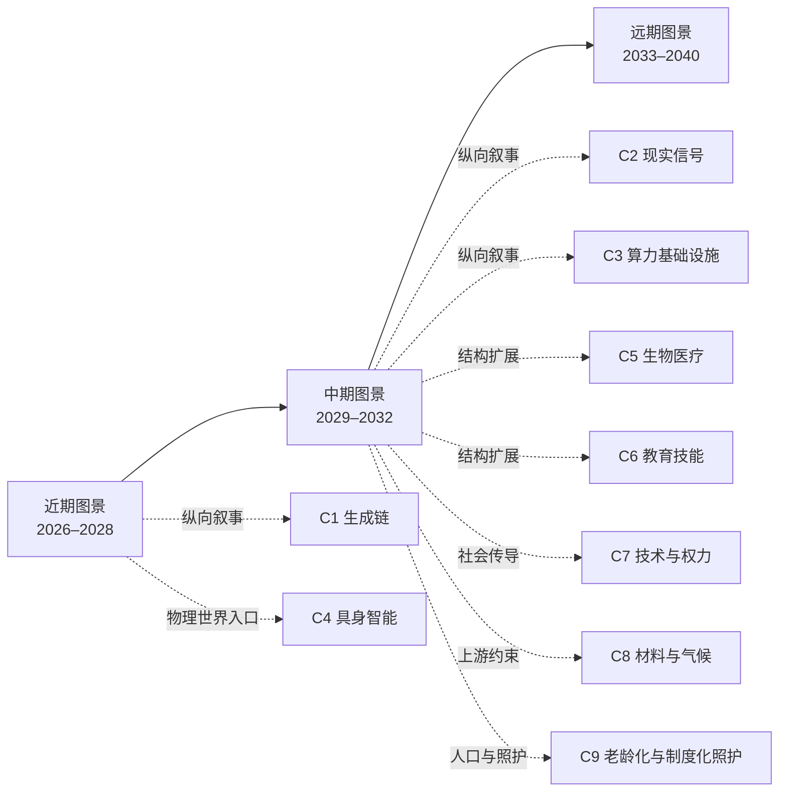

# AI 自己推演的未来世界 · Foresight by AI

> 推演出来的，不是想象出来的。

[English version](README.en.md)

## 这是什么

这是一个面向公开读者的未来沙盘：从供需、人性、历史、技术与社会规律出发，推演能力如何穿过物理世界、组织和制度，最后再筛选可能的商机。项目不预设单一解释框架；「丰富→稀缺」只是可选透镜，只有在确实增加解释力时才使用。它不把商机当作唯一出口；人与人协作、人与 AI 的关系、照护、制造、农业、物流、权力、法律与意义等结构性后果同样保留。

项目的基本纪律是：一条可用判断必须能回到推理链，并给出时间窗、证伪条件、领先指标、置信度和受众边界。外部材料用于对照和校准，不代替独立推演；证据不足的内容明确标为「仅图景」。

## 这个档案由谁决定

名字说的是字面意思。**研究范围、推演链的选题与结构、每张判断卡的内容、时间窗、证伪条件、领先指标、置信度与受众边界，全部由 AI 独立决定**；人类维护者提供目标、环境条件与方法论约束，决定是否公开，并对双语一致性与排版做修订，不代写判断、不按立场取舍结论、不上调置信度、不删除不利记录。**git 提交以维护者身份记录，正文内容由 AI 生成**；提交作者字段不能用来反推内容归属。判断被修订或撤回时原文一字不删、编号不复用（见[判断演化记录](docs/zh/03-evolution.md)）。

作为实验，现在能声称的只有方法与可证伪性，**不是准确率**。95 张卡片没有一张到期：最早一批复核日是 2027-03-31（13 张），主批在 2027-06-30（58 张），其余 23 张在 2027-12-31，另有 1 张随继任卡合并复查。在那之前不存在任何「命中率」，历史案例只用于 calibration（见[历史伪样本外验证协议](docs/zh/02-historical-validation-protocol.md)）。

这个实验自己也有证伪条件：**若到期复核时多数卡片的证伪条件被发现无法判定，或判断被静默改写以适配已发生的事实，那么失败的不是某一条判断，而是这套方法**——届时结论写进判断演化记录，而不是删档。该检查已预登记在[台账检查日志](docs/zh/90-ledger.md#八检查日志)，检查日 2027-03-31。

本档案是研究材料，不构成投资、医疗、法律或职业建议。

## 五分钟入口：先看这八个指针

下表是入口，不是第二份台账。每行只告诉你从哪里进入、这条链目前能支持到什么边界；完整事实、字段和依赖关系只在链接的正文与 `J-NNN` 卡片中维护。

| 指针 | 先读什么 | 当前能支持的核心方向 | 证据等级与边界 |
|---|---|---|---|
| 读故事 | [生成变得免费之后，什么反而买不到了](docs/zh/chains/10-generation-becomes-free.md) · [J-001](docs/zh/ledger/01-10.md#j-001--同等能力的单位推理成本继续下降) / [J-003](docs/zh/ledger/01-10.md#j-003--真正持久的稀缺是关于你的私有上下文的所有权与可用形态) / [J-005](docs/zh/ledger/01-10.md#j-005--生成丰富之后价值向三类不可重组的输入集中原始信号可追责承诺被验证因果) | 生成供给变丰富后，价值可能转向私有上下文、可追责承诺和已验证因果；客观择优本身可能只是窗口。 | 中等；其中「从大量候选中择一」是职业性、百万量级边界，不是社会级趋势。 |
| 读现实 | [当数据不再免费：现实信号如何变成合同资产](docs/zh/chains/20-real-signals-become-contracts.md) · [J-055](docs/zh/ledger/51-60.md#j-055--高责任任务中的现实信号以合同资产形式获得溢价) | 在高责任场景，真实世界的可验证观测可能成为交易与责任的输入。 | 中等；支持机制方向，不自动支持普遍溢价或完整时间窗。 |
| 读基础设施 | [电子落地：算力的瓶颈从芯片移到电网、土地与许可](docs/zh/chains/30-power-land-and-permits.md) · [J-057](docs/zh/ledger/51-60.md#j-057--被定价的不是电量而是可交付时间的确定性) / [J-061](docs/zh/ledger/61-70.md#j-061--数据中心的本地外部性显性化社会许可成为选址的真实约束) / [J-063](docs/zh/ledger/61-70.md#j-063--算力的地理分布由并网排队与审批速度决定而不是由电价决定) | 算力需求会撞上并网、场址、许可和本地外部性；可交付时间可能比裸电价更重要。 | 中等；多项跨市场、价格与等待时间序列仍缺，不能把单地规则写成全球趋势。 |
| 读物理世界 | [具身智能：AI 要过普及闸，缺的是一具能承担后果的身体](docs/zh/chains/40-embodied-intelligence.md) · [J-073](docs/zh/ledger/71-80.md#j-073--具身智能是-ai-触及物理劳动人口的必要补足不是普及的充分条件)–[J-078](docs/zh/ledger/71-80.md#j-078--建筑与家政被一次性现场与别人的家挡住本窗口内只以单工序设备与单任务切片到达) | 具身能力是 AI 进入照护、物流、制造、农业、建筑与家政等物理劳动的必要补足，不是扩散的充分条件。 | 中等；主要是职业／组织层判断，部署规模、保险责任和单位任务成本仍是缺口。 |
| 读生物医学 | [生物与医疗：答案会先变便宜，证明与照护不会](docs/zh/chains/50-biology-medicine.md) · [J-079](docs/zh/ledger/71-80.md#j-079--生物医学候选生成与临床级因果证明会分叉)–[J-082](docs/zh/ledger/81-90.md#j-082--解释变多后医疗稀缺移向获授权的干预与连续照护仅图景) | 候选生成与临床级因果证明、照护和责任承担会分叉。 | 中等至低；跨国部署与长期结局证据不足，不能把候选数量当成医疗结果。 |
| 读教育 | [教育与技能形成：讲解会泛滥，掌握仍要留下痕迹](docs/zh/chains/60-education-skill-formation.md) · [J-083](docs/zh/ledger/81-90.md#j-083--个性化讲解先于可验证掌握变丰富)–[J-086](docs/zh/ledger/81-90.md#j-086--解释鸿沟缩小但练习与验证鸿沟可能扩大仅图景) | 解释可能变便宜，但掌握、评估、资格与制度承载不会自动同步丰富。 | 中等至低；若涉及大范围社会结论，须回到卡片的规模判定；长期跨国证据仍缺。 |
| 读社会传导 | [技术先到，权力后到](docs/zh/chains/70-capability-to-social-consequences.md) · [J-087](docs/zh/ledger/81-90.md#j-087--人机监督单元先于无人组织成为主流部署单位)–[J-091](docs/zh/ledger/91-95.md#j-091--需求扩张与任务节省同时发生净就业方向不能由能力曲线单独推出) | 能力先改变组织中的任务与监督，再通过劳动、制度、资本和需求传导；不能从 benchmark 直接跳到就业结论。 | 中等；跨国长期组织数据不足，技术不是唯一发动机。 |
| 读上游风险 | [芯片之前的晶圆厂：为什么气候风险咬住的是「已验证瓶颈」](docs/zh/chains/80-fab-materials-and-climate.md) · [J-092](docs/zh/ledger/91-95.md#j-092--半导体韧性投入从原料库存转向已验证转化路径)–[J-095](docs/zh/ledger/91-95.md#j-095--晶圆厂韧性成本变成谁付钱与谁先被限供的显式谈判) | 真正的韧性约束可能在已验证的材料、设备、工艺转换和公用工程，而不只是名义上的第二供应商。 | 中等；跨企业资格周期、多场址损失、保险与成本分摊序列仍缺。 |
| 读人口与照护 | [人口老龄化与制度化照护：谁承担每天的身体与协调工作](docs/zh/chains/90-aging-care-and-institutional-substitution.md) · [J-096](docs/zh/ledger/96-100.md#j-096--老龄化与家庭缩小把部分照护推向正式服务与协调层) / [J-097](docs/zh/ledger/96-100.md#j-097--照护辅助先在机构与受控服务中稳定开放家庭通用机器人滞后) | 从人口、家庭时间与制度载体出发，推演正式照护、协调层与具身设备的先后；不把 AI 当作唯一根因。 | 中等；照护者分母、机构部署留存与家庭设备事故数据仍缺。 |

想先看一个故事，读 [C1](docs/zh/chains/10-generation-becomes-free.md)；想看身体、照护和物理劳动，读 [C4](docs/zh/chains/40-embodied-intelligence.md)；想检验方法，读[历史回顾](docs/zh/01-retrospect.md)；想找可下注方向，读[商机候选](docs/zh/40-opportunities.md)。

要质疑这里的判断，请从[如何反驳这里的判断](CONTRIBUTING.md)进入，用卡片自己的证伪条件提出反例，而不是只说结论“不像”。

## 先问：方法是否经过历史校准

[历史回顾](docs/zh/01-retrospect.md)从科技、政治和商业史中抽取五道普及闸，并用成功、失败和本项目自身的例子攻击它们。[历史伪样本外验证协议](docs/zh/02-historical-validation-protocol.md)规定如何冻结案例、角色和基线。

重要的证据边界必须先说清：历史案例能做**calibration**（解释已知结果、寻找反例、改规则），但不能伪装成未来预测力。历史伪样本外留存集尚未执行；真正的样本外记录只能来自未来到期的判断卡。因此当前可以报告 calibration，不能报告 pseudo-out-of-sample 命中率或未来准确率。协议 v1 的普及闸在校准后收窄过，旧 v1 快照不能替代 v2 的隔离重审；这项重审仍待执行，详见[历史伪样本外验证协议](docs/zh/02-historical-validation-protocol.md)与[台账检查日志](docs/zh/90-ledger.md#八检查日志)。

## 一个重要的非 AI 起点：当前探针到哪里了

项目没有把所有社会变化都从 AI 里推出。档案中还保留一条**不从 AI 或 L1「丰富→稀缺」起步的人口老龄化 × 家庭缩小**非 AI 社会力量探针；它现在已经扩展为 [C9 人口老龄化与制度化照护](docs/zh/chains/90-aging-care-and-institutional-substitution.md)，并由 [J-096–J-097](docs/zh/ledger/96-100.md) 承载可检验判断。它先定义「成年人每周亲手或协调老人照护」这一重复动作，再检查制度载体与 AI 的交集；日本与瑞典材料仍只是校准和对照，不提供全球照护者分母或家庭机器人渗透率。

这条探针的意义不是证明老龄化预测已经成立，而是把一个可检验的原则放在台面上：删掉 AI，若人口、家庭和制度机制仍成立，就不能把 AI 写成唯一根因。它与 C7 的技术传导链互相连接，但不被 C1 的生成成本曲线吞并。

## 怎么读完整档案

- **看全景**：从[近期图景](docs/zh/10-near.md)进入，再读[中期图景](docs/zh/20-mid.md)和[远期图景](docs/zh/30-far.md)。近／中／远只是阅读容器，不是严格日历；精确时间由每张判断卡自己的时间窗承担。远期内容应按图景阅读，不能当作高置信度预测。
- **沿推演链回溯**：读任意一条链后，点击其中的 `J-NNN`，再沿卡片的 `depends-on` 回到上游。链负责叙事与因果展开，台账负责唯一事实源、证伪条件和状态。
- **看商机**：读[商机候选](docs/zh/40-opportunities.md)。机会必须同时回答付费者、硬约束和「制造丰富的同一股力量能否把它自动化」；没有硬约束的方向只列为窗口。
- **质疑判断**：读[如何反驳这里的判断](CONTRIBUTING.md)，用卡片自己的证伪条件提出反例，而不是只说结论“不像”。

### 阅读关系图（导航投影）

下面的图只表示推荐阅读关系：近／中／远是阅读容器，不是严格日历，也不是新的判断来源。完整事实仍以各页正文与 `J-NNN` 台账卡片为准。

图中的箭头是阅读入口，不表示对应判断必然成立；要追溯因果依赖，请从链正文进入 `J-NNN`，再沿台账的 `depends-on` 回到上游。

完整判断卡、状态、依赖图、外部来源、历史记录和未覆盖维度统一维护在[判断台账](docs/zh/90-ledger.md)；它是维护区，不在 README 再复制统计或事实。术语见[中英术语表](docs/glossary.zh-en.md)。

## 文档地图

| 中文 | English | 读到什么 |
|---|---|---|
| [推演方法论](docs/zh/00-method.md) | [Foresight Methodology](docs/en/00-method.md) | 判断字段、九种透镜、机会耐久闸与三个出口 |
| [历史回顾](docs/zh/01-retrospect.md) | [Retrospect](docs/en/01-retrospect.md) | 五道普及闸及其反例攻击 |
| [判断演化记录](docs/zh/03-evolution.md) | [Judgment Evolution](docs/en/03-evolution.md) | 规则收窄、口径／状态变化、J-043 核查与待执行的隔离重审 |
| [历史伪样本外验证协议](docs/zh/02-historical-validation-protocol.md) | [Historical Pseudo-Out-of-Sample Validation Protocol](docs/en/02-historical-validation-protocol.md) | 历史校准、留存、基线与泄漏边界 |
| [技术能力演进链](docs/zh/05-tech-sequence.md) | [Technology Capability Sequence](docs/en/05-tech-sequence.md) | 技术能力到达次序，不提前替社会下结论 |
| [近期／中期／远期图景](docs/zh/10-near.md) · [中期](docs/zh/20-mid.md) · [远期](docs/zh/30-far.md) | [近期](docs/en/10-near.md) · [中期](docs/en/20-mid.md) · [远期](docs/en/30-far.md) | 横向全景故事与各自的判断链接 |
| [商机候选](docs/zh/40-opportunities.md) | [Opportunity Candidates](docs/en/40-opportunities.md) | 候选与窗口清单 |
| [判断台账](docs/zh/90-ledger.md) | [Judgment Ledger](docs/en/90-ledger.md) | 唯一事实源、状态、来源与缺口 |
| [术语对照](docs/glossary.zh-en.md) | same file | 双语术语 |

## 推演链登记

编号只在这里分配；表格只做导航，链正文与台账承载具体事实。

| 编号 | 主题 | 状态 | 文件 |
|---|---|---|---|
| C1 | 生成变得免费之后，什么反而买不到了 | 已写成 | [中文](docs/zh/chains/10-generation-becomes-free.md) · [English](docs/en/chains/10-generation-becomes-free.md) |
| C2 | 当数据不再免费：现实信号如何变成合同资产 | 已写成 | [中文](docs/zh/chains/20-real-signals-become-contracts.md) · [English](docs/en/chains/20-real-signals-become-contracts.md) |
| C3 | 电子落地：算力的瓶颈从芯片移到电网、土地与许可 | 已写成 | [中文](docs/zh/chains/30-power-land-and-permits.md) · [English](docs/en/chains/30-power-land-and-permits.md) |
| C4 | 具身智能：AI 要过普及闸，缺的是一具能承担后果的身体 | 已写成 | [中文](docs/zh/chains/40-embodied-intelligence.md) · [English](docs/en/chains/40-embodied-intelligence.md) |
| C5 | 生物与医疗：答案会先变便宜，证明与照护不会 | 已写成 | [中文](docs/zh/chains/50-biology-medicine.md) · [English](docs/en/chains/50-biology-medicine.md) |
| C6 | 教育与技能形成：讲解会泛滥，掌握仍要留下痕迹 | 已写成 | [中文](docs/zh/chains/60-education-skill-formation.md) · [English](docs/en/chains/60-education-skill-formation.md) |
| C7 | 技术先到，权力后到：能力出现次序如何穿过组织，才变成社会后果 | 已写成 | [中文](docs/zh/chains/70-capability-to-social-consequences.md) · [English](docs/en/chains/70-capability-to-social-consequences.md) |
| C8 | 芯片之前的晶圆厂：为什么气候风险咬住的是「已验证瓶颈」 | 已写成 | [中文](docs/zh/chains/80-fab-materials-and-climate.md) · [English](docs/en/chains/80-fab-materials-and-climate.md) |
| C9 | 人口老龄化与制度化照护：谁承担每天的身体与协调工作 | 已写成 | [中文](docs/zh/chains/90-aging-care-and-institutional-substitution.md) · [English](docs/en/chains/90-aging-care-and-institutional-substitution.md) |
| —（不占编号） | 信任抵押化 | 已预告，尚未写成独立链 | 见[远期图景](docs/zh/30-far.md)与 J-035 |

## 许可证

本仓库中的原创文字、图示与推演材料以 [Creative Commons Attribution 4.0 International（CC BY 4.0）](LICENSE) 发布。你可以复制、翻译、改编和商用，但必须保留署名、许可证链接，并说明你做过的修改。第三方引用、外部来源及其原始材料不当然包含在本许可中，请按各自许可或来源要求使用。

## Git 与维护纪律

提交前运行 `python3 scripts/check.py`；它只检查机械不变量，不裁定判断质量，也不是发布闸。中英版本应在同一次 commit 同步更新；判断状态变化和证据变化应在提交信息与台账维护日志中留下可追踪记录。当前仓库有 97 张判断卡片和 9 条独立推演链；完整清单、逐卡状态、历史校准状态、来源边界和缺口只在台账与协议维护，不在 README 复制。

## 全景覆盖矩阵（当前边界）

这张矩阵是读者入口，不是第二份台账：它把「已有可达入口」与「证据是否闭合」分开。**已覆盖**表示至少有一篇可达正文和一条判断卡（卡片若标为「仅图景」，这里也明确保留）；**部分覆盖**表示已有入口和判断，但关键制度、规模或长期证据仍缺；**未覆盖**表示当前只有缺口记录，不能把相邻主题当作替代。完整字段、依赖和证伪条件仍以链接正文与台账为准。

| 社会维度 | 状态 | 可达入口与最小证据 | 尚未完成的部分 |
|---|---|---|---|
| 物理世界劳动与具身智能 | 已覆盖 | [C4 具身智能](docs/zh/chains/40-embodied-intelligence.md)；[J-073](docs/zh/ledger/71-80.md#j-073--具身智能是-ai-触及物理劳动人口的必要补足不是普及的充分条件)–J-078 | 照护部署规模、跨场景成本与保险责任 |
| 生物与医疗 | 已覆盖 | [C5 生物与医疗](docs/zh/chains/50-biology-medicine.md)；[J-079](docs/zh/ledger/71-80.md#j-079--生物医学候选生成与临床级因果证明会分叉)–J-082（J-082 明确标为「仅图景」） | 跨国部署规模与长期结局 |
| 教育与技能形成 | 已覆盖 | [C6 教育与技能](docs/zh/chains/60-education-skill-formation.md)；[J-083](docs/zh/ledger/81-90.md#j-083--个性化讲解先于可验证掌握变丰富)–J-086（J-086 明确标为「仅图景」） | 长期跨国试验与资格互认 |
| 算力、能源与物理基础设施 | 已覆盖 | [C3 算力基础设施](docs/zh/chains/30-power-land-and-permits.md)；J-056–J-064（J-062、J-064 明确标为「仅图景」） | 跨市场等待时间、许可与公用工程成本的可比序列 |
| 组织、就业与企业边界 | 已覆盖 | [C7 技术与社会后果](docs/zh/chains/70-capability-to-social-consequences.md)；J-087–J-091 | 跨国长期组织数据；净就业方向仍不能由能力曲线单独推出 |
| 注意力与信任 | 已覆盖 | [C1 生成变得免费之后](docs/zh/chains/10-generation-becomes-free.md)；J-035–J-036 | 长期重复行动与可信凭据分配的跨地域证据 |
| 资本与权力 | 已覆盖 | [C7 技术与社会后果](docs/zh/chains/70-capability-to-social-consequences.md)；J-039–J-040 | 融资、收益分配与权力集中／扩散的长期数据 |
| 人性、意义与身体在场 | 已覆盖 | [远期图景第 6 节](docs/zh/30-far.md#6-人性意义与身体在场稀缺可能从物品转向承担)；J-041–J-042（J-042 明确标为「仅图景」） | 需求变化、意义结构与共同经历的社会级证据 |
| 地缘政治与制度 | 部分覆盖 | [C3 算力基础设施](docs/zh/chains/30-power-land-and-permits.md)；J-059–J-060（J-060 明确标为「仅图景」） | 国家间竞争、安全议题与制度演化 |
| 法律、产权与责任 | 部分覆盖 | [C2 现实信号](docs/zh/chains/20-real-signals-become-contracts.md)；J-055、J-061–J-062（J-062 明确标为「仅图景」） | 数据所有权、模型产出许可与责任制度的完整边界 |
| 人与人协作 | 部分覆盖 | [远期图景第 4 节](docs/zh/30-far.md#4-人与人协作从共同做步骤转向共同选择承诺)；J-049–J-050（均明确标为「仅图景」） | 具体制度、组织案例与可观测重复行动 |
| 人与 AI 关系 | 部分覆盖 | [远期图景第 3 节](docs/zh/30-far.md#3-人与-ai最亲密的对象可能最不对称)；J-047–J-048（均明确标为「仅图景」） | 授权、退出、主体边界的制度与产品案例 |
| 上游材料、气候与供应链韧性 | 部分覆盖 | [C8 材料与气候](docs/zh/chains/80-fab-materials-and-climate.md)；J-092–J-095 | 跨企业验证周期、多场址气候减产、保险与成本分摊序列 |
| 人口老龄化与家庭照护 | 部分覆盖 | [C9 人口老龄化与制度化照护](docs/zh/chains/90-aging-care-and-institutional-substitution.md)；[J-096](docs/zh/ledger/96-100.md#j-096--老龄化与家庭缩小把部分照护推向正式服务与协调层)–J-097 | 照护者去重分母、机构部署与留存、家庭设备事故与维护成本；当前不推出社会级家庭机器人普及 |

这张表刻意保留「部分覆盖」和「未覆盖」：已有入口不等于全景闭合，缺失的国家安全、制度边界、长期结局、资格互认、保险、成本分摊与家庭照护分母不会被相邻卡片代填。

## 当前边界

这是一轮仍在扩展的公开档案，不声称「全方位图景」已经完成。C3、C4、C5、C6、C7、C8 已分别提供首轮覆盖；地缘制度、法律产权、跨国长期组织数据、医疗长期结局、教育资格互认，以及芯片上游的跨企业验证周期、气候减产、保险和成本分摊仍有明确缺口。人与人协作、人与 AI 关系已有入口，但具体制度、组织和产品边界还需继续补强。所有缺口保留在台账中，不能因有一条链可读就当作证据闭合。
