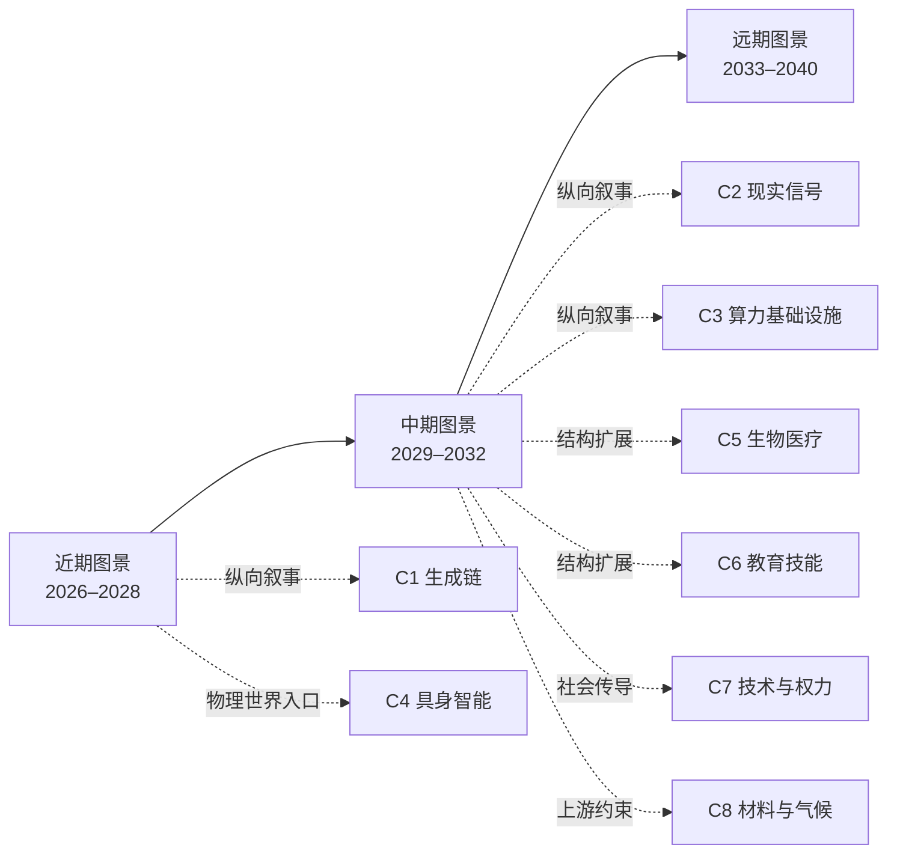

# ai-future · 未来沙盘推演

[English version](README.en.md)

## 这是什么

这是一个面向公开读者的未来沙盘：从供需、人性、历史、技术与社会规律出发，推演能力如何穿过物理世界、组织和制度，最后再筛选可能的商机。它不把商机当作唯一出口；人与人协作、人与 AI 的关系、照护、制造、农业、物流、权力、法律与意义等结构性后果同样保留。

项目的基本纪律是：一条可用判断必须能回到推理链，并给出时间窗、证伪条件、领先指标、置信度和受众边界。外部材料用于对照和校准，不代替独立推演；证据不足的内容明确标为「仅图景」。

## 五分钟入口：先看这八个指针

下表是入口，不是第二份台账。每行只告诉你从哪里进入、这条链目前能支持到什么边界；完整事实、字段和依赖关系只在链接的正文与 `J-NNN` 卡片中维护。

| 指针 | 先读什么 | 当前能支持的核心方向 | 证据等级与边界 |
|---|---|---|---|
| 读故事 | [生成变得免费之后，什么反而买不到了](docs/zh/chains/10-generation-becomes-free.md) · [J-001/J-003/J-005](docs/zh/90-ledger.md) | 生成供给变丰富后，价值可能转向私有上下文、可追责承诺和已验证因果；客观择优本身可能只是窗口。 | 中等；其中「从大量候选中择一」是职业性、百万量级边界，不是社会级趋势。 |
| 读现实 | [当数据不再免费：现实信号如何变成合同资产](docs/zh/chains/20-real-signals-become-contracts.md) · [J-055](docs/zh/90-ledger.md) | 在高责任场景，真实世界的可验证观测可能成为交易与责任的输入。 | 中等；支持机制方向，不自动支持普遍溢价或完整时间窗。 |
| 读基础设施 | [电子落地：算力的瓶颈从芯片移到电网、土地与许可](docs/zh/chains/30-power-land-and-permits.md) · [J-057/J-061/J-063](docs/zh/90-ledger.md) | 算力需求会撞上并网、场址、许可和本地外部性；可交付时间可能比裸电价更重要。 | 中等；多项跨市场、价格与等待时间序列仍缺，不能把单地规则写成全球趋势。 |
| 读物理世界 | [具身智能：AI 要过普及闸，缺的是一具能承担后果的身体](docs/zh/chains/40-embodied-intelligence.md) · [J-073–J-078](docs/zh/90-ledger.md) | 具身能力是 AI 进入照护、物流、制造、农业、建筑与家政等物理劳动的必要补足，不是扩散的充分条件。 | 中等；主要是职业／组织层判断，部署规模、保险责任和单位任务成本仍是缺口。 |
| 读生物医学 | [生物与医疗：答案会先变便宜，证明与照护不会](docs/zh/chains/50-biology-medicine.md) · [J-079–J-082](docs/zh/90-ledger.md) | 候选生成与临床级因果证明、照护和责任承担会分叉。 | 中等至低；跨国部署与长期结局证据不足，不能把候选数量当成医疗结果。 |
| 读教育 | [教育与技能形成：讲解会泛滥，掌握仍要留下痕迹](docs/zh/chains/60-education-skill-formation.md) · [J-083–J-086](docs/zh/90-ledger.md) | 解释可能变便宜，但掌握、评估、资格与制度承载不会自动同步丰富。 | 中等至低；若涉及大范围社会结论，须回到卡片的规模判定；长期跨国证据仍缺。 |
| 读社会传导 | [技术先到，权力后到](docs/zh/chains/70-capability-to-social-consequences.md) · [J-087–J-091](docs/zh/90-ledger.md) | 能力先改变组织中的任务与监督，再通过劳动、制度、资本和需求传导；不能从 benchmark 直接跳到就业结论。 | 中等；跨国长期组织数据不足，技术不是唯一发动机。 |
| 读上游风险 | [芯片之前的晶圆厂：为什么气候风险咬住的是「已验证瓶颈」](docs/zh/chains/80-fab-materials-and-climate.md) · [J-092–J-095](docs/zh/90-ledger.md) | 真正的韧性约束可能在已验证的材料、设备、工艺转换和公用工程，而不只是名义上的第二供应商。 | 中等；跨企业资格周期、多场址损失、保险与成本分摊序列仍缺。 |

想先看一个故事，读 C1；想看身体、照护和物理劳动，读 C4；想检验方法，读[历史回顾](docs/zh/01-retrospect.md)；想找可下注方向，读[商机候选](docs/zh/40-opportunities.md)。

要质疑这里的判断，请从[如何反驳这里的判断](CONTRIBUTING.md)进入，用卡片自己的证伪条件提出反例，而不是只说结论“不像”。

## 先问：方法是否经过历史校准

[历史回顾](docs/zh/01-retrospect.md)从科技、政治和商业史中抽取五道普及闸，并用成功、失败和本项目自身的例子攻击它们。[历史伪样本外验证协议](docs/zh/02-historical-validation-protocol.md)规定如何冻结案例、角色和基线。

重要的证据边界必须先说清：历史案例能做**calibration**（解释已知结果、寻找反例、改规则），但不能伪装成未来预测力。历史伪样本外留存集尚未执行；真正的样本外记录只能来自未来到期的判断卡。因此当前可以报告 calibration，不能报告 pseudo-out-of-sample 命中率或未来准确率。协议 v1 的普及闸在校准后收窄过，旧 v1 快照不能替代 v2 的隔离重审；这项重审仍待执行，详见[历史伪样本外验证协议](docs/zh/02-historical-validation-protocol.md)与[台账检查日志](docs/zh/90-ledger.md#八检查日志)。

## 一个重要的非 AI 起点：当前探针到哪里了

项目没有把所有社会变化都从 AI 里推出。档案中保留一条**人口老龄化 × 家庭缩小**的非 AI 社会力量探针：[台账缺口记录](docs/zh/90-ledger.md#六未覆盖维度缺口清单)。它先定义「成年人每周亲手或协调老人照护」这一重复动作，再检查制度载体与 AI 的交集；日本与瑞典材料目前只属于 `CALIBRATION`，瑞典关于家庭照护规模的反例为 `INDETERMINATE`。这不是 J-NNN 判断卡，也没有被升级为社会级结论；执行人口分母仍是缺口，下一次预登记检查日与数据截止日以台账为准。

这条探针的意义不是证明老龄化预测已经成立，而是把一个可检验的原则放在台面上：删掉 AI，若人口、家庭和制度机制仍成立，就不能把 AI 写成唯一根因。它与 C7 的技术传导链互相连接，但不被 C1 的生成成本曲线吞并。

## 怎么读完整档案

- **看全景**：从[近期图景](docs/zh/10-near.md)进入，再读[中期图景](docs/zh/20-mid.md)和[远期图景](docs/zh/30-far.md)。近／中／远只是阅读容器，不是严格日历；精确时间由每张判断卡自己的时间窗承担。远期内容应按图景阅读，不能当作高置信度预测。
- **沿推演链回溯**：读任意一条链后，点击其中的 `J-NNN`，再沿卡片的 `depends-on` 回到上游。链负责叙事与因果展开，台账负责唯一事实源、证伪条件和状态。
- **看商机**：读[商机候选](docs/zh/40-opportunities.md)。机会必须同时回答付费者、硬约束和「制造丰富的同一股力量能否把它自动化」；没有硬约束的方向只列为窗口。
- **质疑判断**：读[如何反驳这里的判断](CONTRIBUTING.md)，用卡片自己的证伪条件提出反例，而不是只说结论“不像”。

### 阅读关系图（导航投影）

下面的图只表示推荐阅读关系：近／中／远是阅读容器，不是严格日历，也不是新的判断来源。完整事实仍以各页正文与 `J-NNN` 台账卡片为准。

图中的箭头是阅读入口，不表示对应判断必然成立；要追溯因果依赖，请从链正文进入 `J-NNN`，再沿台账的 `depends-on` 回到上游。

完整判断卡、状态、依赖图、外部来源、历史记录和未覆盖维度统一维护在[判断台账](docs/zh/90-ledger.md)；它是维护区，不在 README 再复制统计或事实。术语见[中英术语表](docs/glossary.zh-en.md)。

## 文档地图

| 中文 | English | 读到什么 |
|---|---|---|
| [推演方法论](docs/zh/00-method.md) | [Foresight Methodology](docs/en/00-method.md) | 判断字段、九种透镜、机会耐久闸与三个出口 |
| [历史回顾](docs/zh/01-retrospect.md) | [Retrospect](docs/en/01-retrospect.md) | 五道普及闸及其反例攻击 |
| [判断演化记录](docs/zh/03-evolution.md) | [Judgment Evolution](docs/en/03-evolution.md) | 规则收窄、口径／状态变化、J-043 核查与待执行的隔离重审 |
| [历史伪样本外验证协议](docs/zh/02-historical-validation-protocol.md) | [Historical Pseudo-Out-of-Sample Validation Protocol](docs/en/02-historical-validation-protocol.md) | 历史校准、留存、基线与泄漏边界 |
| [技术能力演进链](docs/zh/05-tech-sequence.md) | [Technology Capability Sequence](docs/en/05-tech-sequence.md) | 技术能力到达次序，不提前替社会下结论 |
| [近期／中期／远期图景](docs/zh/10-near.md) · [中期](docs/zh/20-mid.md) · [远期](docs/zh/30-far.md) | [近期](docs/en/10-near.md) · [中期](docs/en/20-mid.md) · [远期](docs/en/30-far.md) | 横向全景故事与各自的判断链接 |
| [商机候选](docs/zh/40-opportunities.md) | [Opportunity Candidates](docs/en/40-opportunities.md) | 候选与窗口清单 |
| [判断台账](docs/zh/90-ledger.md) | [Judgment Ledger](docs/en/90-ledger.md) | 唯一事实源、状态、来源与缺口 |
| [术语对照](docs/glossary.zh-en.md) | same file | 双语术语 |

## 推演链登记

编号只在这里分配；表格只做导航，链正文与台账承载具体事实。

| 编号 | 主题 | 状态 | 文件 |
|---|---|---|---|
| C1 | 生成变得免费之后，什么反而买不到了 | 已写成 | [中文](docs/zh/chains/10-generation-becomes-free.md) · [English](docs/en/chains/10-generation-becomes-free.md) |
| C2 | 当数据不再免费：现实信号如何变成合同资产 | 已写成 | [中文](docs/zh/chains/20-real-signals-become-contracts.md) · [English](docs/en/chains/20-real-signals-become-contracts.md) |
| C3 | 电子落地：算力的瓶颈从芯片移到电网、土地与许可 | 已写成 | [中文](docs/zh/chains/30-power-land-and-permits.md) · [English](docs/en/chains/30-power-land-and-permits.md) |
| C4 | 具身智能：AI 要过普及闸，缺的是一具能承担后果的身体 | 已写成 | [中文](docs/zh/chains/40-embodied-intelligence.md) · [English](docs/en/chains/40-embodied-intelligence.md) |
| C5 | 生物与医疗：答案会先变便宜，证明与照护不会 | 已写成 | [中文](docs/zh/chains/50-biology-medicine.md) · [English](docs/en/chains/50-biology-medicine.md) |
| C6 | 教育与技能形成：讲解会泛滥，掌握仍要留下痕迹 | 已写成 | [中文](docs/zh/chains/60-education-skill-formation.md) · [English](docs/en/chains/60-education-skill-formation.md) |
| C7 | 技术先到，权力后到：能力出现次序如何穿过组织，才变成社会后果 | 已写成 | [中文](docs/zh/chains/70-capability-to-social-consequences.md) · [English](docs/en/chains/70-capability-to-social-consequences.md) |
| C8 | 芯片之前的晶圆厂：为什么气候风险咬住的是「已验证瓶颈」 | 已写成 | [中文](docs/zh/chains/80-fab-materials-and-climate.md) · [English](docs/en/chains/80-fab-materials-and-climate.md) |
| —（不占编号） | 信任抵押化 | 已预告，尚未写成独立链 | 见[远期图景](docs/zh/30-far.md)与 J-035 |

## 许可证

本仓库中的原创文字、图示与推演材料以 [Creative Commons Attribution 4.0 International（CC BY 4.0）](LICENSE) 发布。你可以复制、翻译、改编和商用，但必须保留署名、许可证链接，并说明你做过的修改。第三方引用、外部来源及其原始材料不当然包含在本许可中，请按各自许可或来源要求使用。

## Git 与维护纪律

提交前运行 `python3 scripts/check.py`；它只检查机械不变量，不裁定判断质量，也不是发布闸。中英版本应在同一次 commit 同步更新；判断状态变化和证据变化应在提交信息与台账维护日志中留下可追踪记录。当前仓库有 95 张判断卡片和 8 条独立推演链；完整清单、逐卡状态、历史校准状态、来源边界和缺口只在台账与协议维护，不在 README 复制。

## 当前边界

这是一轮仍在扩展的公开档案，不声称「全方位图景」已经完成。C3、C4、C5、C6、C7、C8 已分别提供首轮覆盖；地缘制度、法律产权、跨国长期组织数据、医疗长期结局、教育资格互认，以及芯片上游的跨企业验证周期、气候减产、保险和成本分摊仍有明确缺口。人与人协作、人与 AI 关系已有入口，但具体制度、组织和产品边界还需继续补强。所有缺口保留在台账中，不能因有一条链可读就当作证据闭合。
