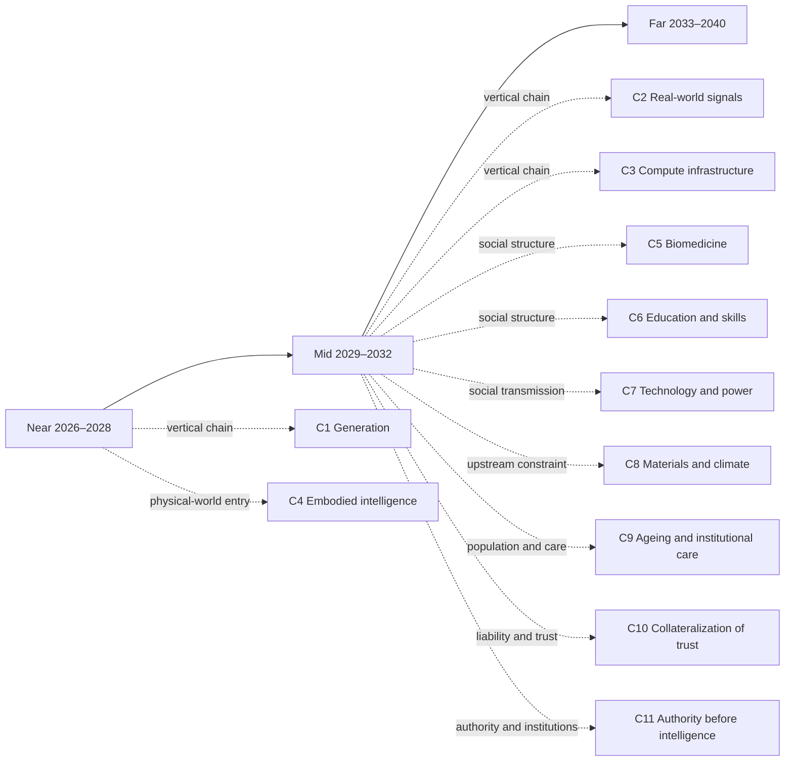

# Near-term landscape: 2026–2028

[中文版](../zh/10-near.md)

[Back to README / document map](../../README.en.md)

> On a Monday morning in March 2027, a cold-chain inspection company has eleven people and serves more than two hundred stores. Over the weekend the system ran four hundred–odd comparisons by itself and narrowed the procedure for issuing an inspection verdict down to seven candidate versions—nobody worked late for it, and nobody thinks it worth mentioning. What takes the whole morning is three other things: the largest client renews next week and this time wants to see, not the accuracy claims in the brochure, but how long each “verdict within three hours” actually took over the past two years; the supermarket downstream has a new head of procurement whose first question is “who signs this report”; and the batch of samples the system flags as “someone has to go look at this in person” stays there no matter how the thresholds are tuned. Not one of the eleven still writes reports by hand, yet each of them makes the same decision every day: what may be released automatically, and what someone has to answer for personally.
>
> That is roughly the shape of these three years: the generating, comparing, and screening side becomes cheap and abundant fast, while the “whose field, whose promise, whose liability” side is priced separately for the first time. The six dimensions below take that apart—but this does not treat “abundance → scarcity” as a conclusion. It treats it as a hypothesis to test: some scarcity will be absorbed by the same generative force, while some is blocked by physics, ownership, liability, trust, or embodied presence. Each of the six dimensions asks all three questions.
>
> This layer spreads one time window out horizontally. To follow a single causal line vertically instead, read [C1 · What Becomes Unbuyable After Generation Becomes Free](chains/10-generation-becomes-free.md).

## Reading navigation map (relationship projection)

This map provides reading entrances among the near/mid/far pages and the reasoning chains. It adds no judgment and does not replace the `J-NNN` ledger. Time layers are coarse reading containers; causal dependencies live in the ledger’s `depends-on` fields.

> This is a reading aid, not a new source of facts. Arrows indicate recommended entrances, not necessary causality.

## 1. One answer becomes a batch of attempts

As unit reasoning cost falls, systems will generate, compare, and revise in parallel rather than deliver one answer. [J-018](ledger/11-20.md#j-018--parallel-reasoning-before-long-horizon-autonomy) is the near-term spine; its direction is consistent with common expectations, but the reasoning here is about how many attempts the same budget buys, not whether models “can think.”

- **More abundant:** equivalent reasoning calls, candidate plans, and automated tests.
- **More scarce:** worthwhile task boundaries, private context, and judgment before irreversible action.
- **Third question:** objective selection will be automated by the same force and is a window; private context faces ownership/privacy constraints, while irreversible action faces physical and legal/liability constraints, so neither is simply copyable.
- **Who should change behavior now:** replace “generate more” with “generate—compare—verify,” and preserve isolation, approval, and rollback for real actions.

[J-019](ledger/11-20.md#j-019--token-saving-is-a-window) adds that saving tokens itself is only a window, not durable scarcity. I stake more on [J-018](ledger/11-20.md#j-018--parallel-reasoning-before-long-horizon-autonomy) and less on [J-019](ledger/11-20.md#j-019--token-saving-is-a-window). The strongest opposing mechanism is energy, chip supply, or service queues locking cost reductions inside single calls; if parallelism does not rise, this section must be revisited.

> **Scope tag · Gate 1**: The cited J-018, J-019 are occupational/organizational judgments; their audience ceiling is defined by the cited cards, so this passage makes no society-wide trend claim. See [Historical retrospective · Gate 1](01-retrospect.md#7-running-these-gates-on-what-we-ourselves-have-written) for the criterion and the [ledger review log](90-ledger.md#8-review-log) for card-level evidence.

## 2. Finding things becomes more expensive than making them

Code, images, video, and copy will become easier to synthesize. [J-020](ledger/11-20.md#j-020--reproducible-content-keeps-falling-in-price) tests an answer that is easy to overstate: objective quality selection will mostly be built into generation, rather than remain a permanent independent market.

- **More abundant:** format-correct, stylistically similar, reproducible content.
- **More scarce:** unrecorded observation, explicit context, and accountable factual sources.
- **Third question:** models can remove formal errors but cannot create a new field observation by recombination; physical presence, ownership, and liability are hard constraints, so this residual scarcity cannot be made abundant by the same force alone.
- **Who should change behavior now:** publishers should put source, time, observation conditions, and uncertainty beside the output rather than display only the finished artifact.

[J-021](ledger/21-30.md#j-021--first-hand-field-signals-earn-a-premium-first) judges that first-hand signals will earn a premium earlier than second-hand expression. This is consistent with the common direction that content will become abundant, but the project makes the more specific bet on unrecorded field reality rather than abstract “quality.” The strongest opposing mechanism is high-fidelity simulation becoming widely accepted as a substitute for observation; if buyers stop distinguishing field reality from recombination, downgrade [J-021](ledger/21-30.md#j-021--first-hand-field-signals-earn-a-premium-first).

> **Scope tag · Gate 1**: The cited J-020, J-021 are occupational/organizational judgments; their audience ceiling is defined by the cited cards, so this passage makes no society-wide trend claim. See [Historical retrospective · Gate 1](01-retrospect.md#7-running-these-gates-on-what-we-ourselves-have-written) for the criterion and the [ledger review log](90-ledger.md#8-review-log) for card-level evidence.

## 3. Being seen is not being believed

When everyone can receive personalized content, attention is no longer only about whether content exists; it is about who deserves time. [J-022](ledger/21-30.md#j-022--forgable-signals-drive-credential-upgrades) judges that forgable signals will push selection toward more expensive credentials. The direction is consistent with the consensus that trust will matter more, but the mechanism and time window are this project’s own bet.

- **More abundant:** personalized messages, recommendations, and apparently authentic interaction.
- **More scarce:** consistent identity, accountable commitments, and long relationships.
- **Third question:** a generator can copy surface signals but cannot create years of repeated exchange in one step; trust, relationships, and liability are hard constraints that more tokens cannot fill.
- **Who should change behavior now:** organizations should track fulfilled commitments rather than exposure; people should move important judgments from “who sounds right” toward “who bears the consequences.”

[J-023](ledger/21-30.md#j-023--attention-shifts-toward-fulfilled-commitments) says attention will move from expression toward relationships and commitments. [J-024](ledger/21-30.md#j-024--credentials-re-layer-landscape-only) remains a weaker landscape only: credentials may be re-layered, but the institutional destination is unclear. The strongest opposing mechanism is a platform internalizing reliable identity and liability so completely that users need no new credential layer; if screening costs keep falling after that internalization, [J-023](ledger/21-30.md#j-023--attention-shifts-toward-fulfilled-commitments) must be rewritten.

> **Scope tag · Gate 1**: The cited J-022, J-023, J-024 are occupational/organizational judgments; their audience ceiling is defined by the cited cards, so this passage makes no society-wide trend claim. See [Historical retrospective · Gate 1](01-retrospect.md#7-running-these-gates-on-what-we-ourselves-have-written) for the criterion and the [ledger review log](90-ledger.md#8-review-log) for card-level evidence.

## 4. Fewer people do the steps; more coordination is required

AI first lowers the cost of documents, scheduling, translation, and plans, then moves the bottleneck to authorization, review, and responsibility. [J-025](ledger/21-30.md#j-025--small-team-output-rises) bets that small teams will produce more verifiable output. This is consistent with the common direction of knowledge-work automation, but it does not mean people disappear from companies.

- **More abundant:** outsourceable, automatable, and monitorable knowledge-work steps.
- **More scarce:** people who define goals, allocate permissions, handle exceptions, and answer for outcomes.
- **Third question:** workflow orchestration can be automated; legal responsibility and organizational trust cannot be borne by generated text, so positions of responsibility will not become abundant at the same rate.
- **Who should change behavior now:** rewrite roles from “produce documents” toward “define boundaries, inspect evidence, and own decisions.”

[J-026](ledger/21-30.md#j-026--responsibility-boundaries-remain) judges that responsibility boundaries will not disappear along with production capacity. It is a structural consequence, not a forecast of headcount. The strongest opposing mechanism is regulation assigning all responsibility to platforms, leaving organizations without a need to redesign boundaries; if high-value use cases routinely transfer all liability to platforms, reduce confidence in [J-026](ledger/21-30.md#j-026--responsibility-boundaries-remain).

> **Scope tag · Gate 1**: The cited J-025, J-026 are occupational/organizational judgments; their audience ceiling is defined by the cited cards, so this passage makes no society-wide trend claim. See [Historical retrospective · Gate 1](01-retrospect.md#7-running-these-gates-on-what-we-ourselves-have-written) for the criterion and the [ledger review log](90-ledger.md#8-review-log) for card-level evidence.

## 5. Compute gets cheap; access points remain expensive

Falling reasoning cost will not distribute gains evenly. [J-027](ledger/21-30.md#j-027--rented-compute-spreads-capability) judges that rented compute will spread capability. This is consistent with the common expectation that model capability will diffuse, but it does not imply that power diffuses at the same time.

- **More abundant:** rentable compute and generation for small organizations.
- **More scarce:** stable energy, proprietary data, user access, and balance sheets able to absorb losses.
- **Third question:** compute calls can be copied; energy, ownership, liability, and distribution relationships cannot be copied at the same speed. This residue is therefore not infinitely manufacturable by software alone.
- **Who should change behavior now:** evaluate AI projects by asking who controls inputs, exits, and accident losses—not only by asking how capable the model is.

[J-028](ledger/21-30.md#j-028--access-becomes-a-bargaining-node-landscape-only) says data, distribution, and liability access may become new bargaining nodes, but it remains a weak landscape and should not directly become an opportunity. The strongest opposing mechanism is complete commoditization of models, energy, and distribution, eliminating access rents; if access prices lose their structural premium, [J-028](ledger/21-30.md#j-028--access-becomes-a-bargaining-node-landscape-only) fails.

> **Scope tag · Gate 1**: The cited J-027, J-028 are occupational/organizational judgments; their audience ceiling is defined by the cited cards, so this passage makes no society-wide trend claim. See [Historical retrospective · Gate 1](01-retrospect.md#7-running-these-gates-on-what-we-ourselves-have-written) for the criterion and the [ledger review log](90-ledger.md#8-review-log) for card-level evidence.

## 6. More choices do not automatically create new desires

[J-029](ledger/21-30.md#j-029--demand-side-anchors-persist) treats status, certainty, embodied presence, and responsibility as demand-side anchors rather than using “human nature is eternal” as proof. It is compatible with the conservative consensus that technology changes tools without automatically changing every need.

- **More abundant:** identities, works, and life plans to try.
- **More scarce:** relationships willing to share consequences, real experiences, and witnessed commitments.
- **Third question:** surface expression can be generated; shared experience, embodied presence, and repeated trust face physical, relational, and bodily constraints, and cannot be fully replaced by the same generative force.
- **Who should change behavior now:** do not confuse more options with more meaning; reserve time for irreplaceable presence and commitment.

[J-030](ledger/21-30.md#j-030--ai-mediates-coordination-not-shared-experience-landscape-only) extends the picture: AI can mediate coordination but cannot mediate shared experience. This is a weaker but useful structural landscape. The strongest opposing mechanism is a generational shift that treats persistent AI interaction as sufficiently real reciprocal relationship; if longitudinal behavior shows agent-mediated relationships reliably replacing shared experience, rewrite [J-030](ledger/21-30.md#j-030--ai-mediates-coordination-not-shared-experience-landscape-only).

> **Scope tag · Gate 1**: The cited J-030 are occupational/organizational judgments; their audience ceiling is defined by the cited cards, so this passage makes no society-wide trend claim. See [Historical retrospective · Gate 1](01-retrospect.md#7-running-these-gates-on-what-we-ourselves-have-written) for the criterion and the [ledger review log](90-ledger.md#8-review-log) for card-level evidence.

## Boundary of this layer

Biology and medicine, educational qualification, energy infrastructure, geopolitics and institutions, and intimate human–AI relationships remain uncovered; see [the ledger’s “Explicit gaps” section](90-ledger.md#6-explicit-gaps-dimensions-not-yet-covered). This layer does not turn an automatable window into a structural opportunity or a weaker landscape into fact; the full five-part cards and formal confidence remain in the ledger.
