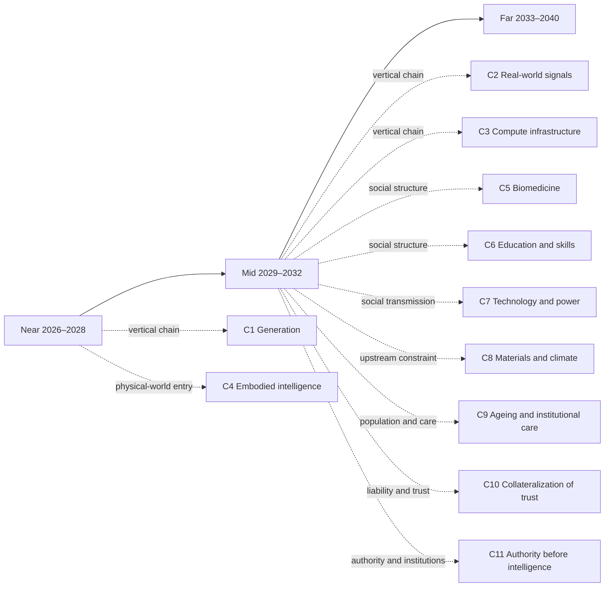

# Far-term landscape: 2033–2040

[中文版](../zh/30-far.md)

[Back to README / document map](../../README.en.md)

> Start with an inference—not a forecast, but what the mid-term judgments look like pushed one notch further. In March 2037, a seaside town has to decide whether three hundred households move or stay, and whether that decision was right will not be visible until around 2040. Plans are not what is missing: the system offers more combinations of relocation and reinforcement than anyone bothers to count, each with thirty years of counterfactual modeling, a phased implementation plan, and a compensation model, and any one of them can be understood in ten minutes. The town’s routine engineering work has run on granted boundaries for years; nobody approves anything step by step anymore. The four hours the seven people in that room spend are barely used for comparing plans—that part was finished long ago. What they are settling is something else: which options to give up, and, if this turns out wrong, who will still be here by then to clean up.
>
> The input that matters most is the one the system cannot supply: how this stretch of coast actually behaves in every storm over the next two years is beyond the models not because they are weak, but because those two years have not happened yet. It requires someone to stand on the same tidal flat for an hour on the same day of every week for two years, a hundred-odd times without a gap, with a name and a date on the record, or by then nobody will accept it. The other thing the system cannot do is quieter: each of the seven has an agent that attended all twenty earlier meetings and remembers every sentence, and that agent can be copied, paused, and transferred into someone else’s name; the seven people sitting there cannot. What makes the consent binding is precisely that inability—by then someone must still be present, and must still own this.
>
> On the way out somebody asks one of them why she is the one walking the flat. Because, she says, it is the only part of this that stops counting if someone else does it for me.
>
> That is roughly the shape of the far horizon: the generable side—plans, explanations, companionship, identity—keeps growing, while the side that asks who gave up the other options, who was present, and who still owns it when the results come in has neither grown nor become cheaper. Sections 1–6 below follow that fault line: the far horizon is not a straight line from near-term trends, but a test of the load-bearing walls—if the mid-term judgments hold, what must people and organizations rearrange? Sections 3.1, 4.1 and 7 do not follow that fault line; they re-examine the same objects from other starting points (see the next paragraph). Each section states its dependencies, branches, and action boundary. Low-confidence judgments remain structural landscapes, not disguised forecasts.
>
> The far horizon has no chain of its own yet. Sections 1–6 stand on mid-term judgments; to see where those dependencies come from, go back to the [mid-term landscape, 2029–2032](20-mid.md). Sections 3.1, 4.1 and 7 take entry points that do not start from AI, and stand on cards whose populations were counted in 2026 under frozen definitions and on [C9 · Ageing and Institutional Care](chains/90-aging-care-and-institutional-substitution.md).

## Reading navigation map (relationship projection)

This map provides reading entrances among the near/mid/far pages and the reasoning chains. It adds no judgment and does not replace the `J-NNN` ledger. Time layers are coarse reading containers; causal dependencies live in the ledger’s `depends-on` fields.

> This is a reading aid, not a new source of facts. Arrows indicate recommended entrances, not necessary causality.

## 1. Execution and infrastructure: people grant boundaries instead of operating every step

If [J-031](ledger/31-40.md#j-031--pausable-replayable-rollback-capable-action-environments-become-admission-conditions-for-long-horizon-ai-execution)’s rollback-capable environments, [J-032](ledger/31-40.md#j-032--authorization-review-and-exception-escalation-become-scarcer-than-execution-steps)’s authorization review, and [J-014](ledger/11-20.md#j-014--rehearsable-environments-follow-single-tool-integration)’s rehearsal environments take shape in the mid term, the high-value AI interface in 2033–2040 may no longer be “perform this step,” but “act within these boundaries; who owns the result?”

- **First question: what becomes abundant:** agent execution across tools, organizations, and time, with continuous task monitoring.
- **Second question: what becomes scarce as a result:** understandable authorization boundaries, genuinely reversible responsibility, and organizational positions able to absorb accidents.
- **Third question: can the same force that creates abundance automate the new scarcity?:** permissions, plans, and exception categories can scale through the same automation; physical harm, legal liability, and bodily consequences remain hard constraints and cannot become free copies.
- **What can be done now:** write agent permissions as auditable, pausable, rollback-capable boundaries; build incident rehearsal and human escalation before buying longer autonomy.
- **Boundary:** This is a low-confidence structural landscape. If high-fidelity simulation replaces real observation in high-liability settings, or accident rates keep falling without independent intervention, rewrite this section. The corresponding judgments are [J-043](ledger/41-50.md#j-043--high-value-agent-execution-may-shift-to-boundary-grants-rather-than-step-by-step-operation-landscape-only) and [J-044](ledger/41-50.md#j-044--liability-positions-able-to-absorb-accidents-become-the-load-bearing-wall-of-agent-infrastructure-landscape-only).

> **Scope tag · Gate 1**: The cited J-014, J-031, J-032, J-043, J-044 are occupational/organizational judgments; their audience ceiling is defined by the cited cards, so this passage makes no society-wide trend claim. See [Historical retrospective · Gate 1](01-retrospect.md#7-running-these-gates-on-what-we-ourselves-have-written) for the criterion and the [ledger review log](90-ledger.md#8-review-log) for card-level evidence.

## 2. Information and content: expression becomes infinite; unarranged reality becomes a scarce input

If [J-033](ledger/31-40.md#j-033--verifiable-records-of-real-interventions-become-more-valuable-than-explanation-itself)’s verified records of real intervention and [J-034](ledger/31-40.md#j-034--synthetic-evidence-is-accepted-first-in-low-liability-contexts-high-liability-contexts-still-require-real-trials)’s liability separation hold, the far-term content industry may focus less on who generates the most convincing artifact and more on who observed, intervened, and bears the result. Synthetic content does not disappear; it becomes a cheap substrate for exploring and explaining reality.

- **First question: what becomes abundant:** replayable histories, personalities, settings, explanations, and counterfactual simulations.
- **Second question: what becomes scarce as a result:** unarranged presence, shared experience, raw signals across elapsed time, and accountable causal records.
- **Third question: can the same force that creates abundance automate the new scarcity?:** synthesis, compression, and remixing can keep expanding automatically; physical presence, ownership, liability, and non-replayable time are hard constraints that more tokens cannot manufacture.
- **What can be done now:** preserve raw observation, collection conditions, accountable parties, and second-order interpretation as separate layers; in high-liability use, ask first who was present, who intervened, and who pays.
- **Boundary:** Low confidence. If high-liability fields broadly accept synthetic evidence without higher accident rates, withdraw the premium assigned to field reality. The corresponding judgments are [J-045](ledger/41-50.md#j-045--as-synthetic-expression-becomes-abundant-unarranged-observation-of-reality-becomes-scarce-landscape-only) and [J-046](ledger/41-50.md#j-046--high-liability-settings-retain-a-premium-for-field-causal-records-landscape-only).

> **Scope tag · Gate 1**: The cited J-033, J-034, J-045, J-046 are occupational/organizational judgments; their audience ceiling is defined by the cited cards, so this passage makes no society-wide trend claim. See [Historical retrospective · Gate 1](01-retrospect.md#7-running-these-gates-on-what-we-ourselves-have-written) for the criterion and the [ledger review log](90-ledger.md#8-review-log) for card-level evidence.

## 3. People and AI: the most intimate object may be the most asymmetric

If [J-041](ledger/41-50.md#j-041--ai-first-expands-the-coordination-radius-of-weak-ties)’s expansion of weak-tie coordination and [J-042](ledger/41-50.md#j-042--shared-experience-and-embodied-presence-remain-the-capacity-ceiling-for-strong-ties-landscape-only)’s embodied-presence ceiling persist, AI may become the most enduring, patient, and copyable interaction object. The issue is not only whether AI resembles a person, but that memory, patience, copyability, and refusal are asymmetric between the sides.

- **First question: what becomes abundant:** always-available companionship, long memory, personalized emotional mirroring, and relationship agents that can be paused, copied, and moved.
- **Second question: what becomes scarce as a result:** non-copyable reciprocity, commitments made meaningful by finite life, the other party’s genuine freedom to refuse, and relationships that share risk.
- **Third question: can the same force that creates abundance automate the new scarcity?:** language, reminders, retrieval, and personality style can scale; embodied presence, legal personhood, shared risk, and genuine refusal cannot be copied at zero cost by the same force.
- **What can be done now:** distinguish tool service from human commitment in product and family rules; preserve data portability, relationship exit, and records of real authorization.
- **Concrete action path (non-commercial, low-confidence example):** When a family gives a copyable AI continuous companionship or care reminders, the person receiving the service first chooses its permitted uses, who may access it, and a one-click pause contact. Whenever the AI is about to message relatives, give health advice, or make a commitment on that person’s behalf, the person must confirm it and the confirmation must be exportable. If the agent keeps contacting people after revocation, its history cannot be exported, or relatives mistake its words for the person’s commitment, the family pauses the agent, notifies the affected people, and switches that decision back to human confirmation. The observable failures are whether withdrawal took effect, mistaken-attribution events, and repair time—not the mere existence of a rule.
- **Status of the judgment:** This action path operationalizes the low-confidence, landscape-only J-047/J-048; it is not a forecast that this usage will become widespread and it is not an opportunity claim.
- **Boundary:** Low-confidence landscape only. If institutions recognize copyable AI as a full relationship subject and longitudinal behavior shows that non-copyable reciprocity is no longer needed, rewrite this section. The corresponding judgments are [J-047](ledger/41-50.md#j-047--copyable-ai-relationships-expand-companionship-supply-while-non-copyable-reciprocity-becomes-scarce-landscape-only) and [J-048](ledger/41-50.md#j-048--authorization-exit-and-subject-boundaries-in-humanai-relationships-become-normative-issues-landscape-only).

> **Scope tag · Gate 1**: The cited J-041 is an occupational/organizational judgment; J-042, J-047 and J-048 are landscape only (J-042’s card says Gate 1 “passes”, which speaks only to the scale axis; no licence to write at society scale has been granted, and the conflict is registered for ruling in [section 5 of the social-scale register](91-social-scale-register.md#5-this-page-re-judges-nothing-these-contradictions-are-registered)); their audience ceiling is defined by the cited cards, so this passage makes no society-wide trend claim. See [Historical retrospective · Gate 1](01-retrospect.md#7-running-these-gates-on-what-we-ourselves-have-written) for the criterion and the [ledger review log](90-ledger.md#8-review-log) for card-level evidence.

### 3.1 A different starting point: the human–AI relationship that has reached society scale is “asking”

The section above starts from J-041’s coordination radius, and J-041 traces all the way back to “unit reasoning cost keeps falling”—starting only from there is exactly the single-origin axis error the [method](00-method.md#1-legitimate-starting-points-for-reasoning) rules out. Here the same object is re-examined from other starting points: **human nature** (the “certainty” and “attribution of responsibility” anchors of [L8](00-method.md#l8--human-nature-and-demand)) and **historical regularity** (a new habit first rides on a carrier that already exists, see [Historical retrospective · Gate 3](01-retrospect.md#gate-3--nobody-builds-a-road-for-one-thing)), plus **agency institutions**—who may act in whose name, see [C11 · Authority before intelligence](chains/110-authority-before-intelligence.md). Agency institutions have no carrying lens in L1–L9; what carries them is Gate 4, see the [mapping of the five starting points to the lenses](00-method.md#mapping-the-five-starting-points-to-l1l9).

One dependency has to be disclosed: J-103, the only card below that clears Gate 1, states on its card that it depends on [J-001](ledger/01-10.md#j-001--unit-reasoning-cost-keeps-falling) (unit reasoning cost keeps falling)—that “asking” is possible at all, and free, does rest on reasoning cost. What is swapped here is not where the capability comes from but where two verdicts come from: whether “asking” has reached society scale is answered by the count under a frozen definition and by the existing carrier (Gate 3); why it stops at “asking” and does not reach “deciding” is answered by L8’s “certainty” and “attribution of responsibility” anchors.

**A scenario (an illustration, not a statistic):** the bookkeeper at a small hardware shop asks the general-purpose assistant on her phone seven or eight times a week—how to fill in the new invoicing rule, how to word a payment reminder without souring the relationship, whether a child’s fever in the night means a trip to the emergency room. She never lets it pay a supplier for her, and never lets it answer her boss for her: if an answer is wrong she just checks again; if a payment or a message is wrong, someone has to own it, and that someone can only be her. On the same evening her daughter, in middle school, spends half an hour chatting with a fictional character in a role-play app.

These two people perform two different actions. Going by the populations this repository has already counted under frozen definitions, the human–AI relationship in 2026 falls into three layers, an order of magnitude or more apart (the people in the scenario only illustrate the actions; they are not claimed to fall inside any count below—the 900 million is one service’s self-report, and which countries and regions that service covers lies outside this repository’s evidence):

- **“Asking” is already a society-scale action:** at least once in seven days, a person on their own initiative asks a general-purpose AI assistant a question or hands it a task; a single service self-reports over 900 million weekly actives, clearing the hundred-million weekly bar ([J-103](ledger/103-110.md#j-103--the-society-scale-ai-action-is-asking-not-deciding-hundred-million-weekly-reach-rests-on-the-free-tier), confidence Medium; the lower bound is self-reported and unaudited). It rides on carriers already in people’s pockets—phones and browsers—and nobody built a road for it.
- **Countable companion apps: the visible ceiling is in the tens of millions:** for companionship-style conversation with companion / character apps, the visible ceiling is Character.AI’s self-reported monthly actives of just over twenty million; vetoed at Gate 1 ([social action verdict §3](../evidence/social-action-verdict-2026-10-10.en.md#3-candidates-that-must-be-vetoed-item-by-item-verdicts)). This is one service’s self-report, and no time series shows that it has “stopped”; companionship-style conversation inside general-purpose assistants is a different action, never frozen and without a denominator, and is not in this number (see J-047’s “Why landscape only”).
- **Paying for someone or deciding for someone has no denominator yet:** for “handing a purchase or booking to an AI agent to order and pay”, no platform publishes a weekly user count, so it too is vetoed at Gate 1; in high-responsibility settings, agency first grows into tiered, revocable authority attached to some person’s or institution’s responsibility ([J-098](ledger/96-102.md#j-098--authority-before-intelligence-consequential-settings-form-revocable-tiered-agency-first), institutional / occupational, confidence Medium).

So the “most intimate object may be the most asymmetric” of the section above, within what can be counted, lands first on the countable, tens-of-millions companion-app users and on million-scale high-responsibility roles—not on every single person. Writing “asking” at society scale has a denominator behind it; writing “forming intimate relationships with AI” at society scale does not, for now.

**Cards under this object: their tier, and why they stop where they stop**

| Card | Claim (short) | Status and confidence | Audience scale and identity | Gate 1 | The specific reason it stops here |
|---|---|---|---|---|---|
| [J-103](ledger/103-110.md#j-103--the-society-scale-ai-action-is-asking-not-deciding-hundred-million-weekly-reach-rests-on-the-free-tier) | The society-scale AI action is “asking”, not “deciding” | Usable judgment · Medium | Hundred-millions · de-duplicated individuals who asked or handed over a task within seven days | Passes | Evidence strength: the denominator is one service’s self-reported lower bound, unaudited |
| [J-098](ledger/96-102.md#j-098--authority-before-intelligence-consequential-settings-form-revocable-tiered-agency-first) | High-responsibility settings form revocable tiered agency first | Usable judgment · Medium | Million-scale or smaller · high-responsibility roles, compliance staff and public institutions; tens-of-millions impact reach | Fails (institutional / occupational) | Authorisation and liability are low-frequency organisational actions; no society-scale weekly denominator exists |
| [J-047](ledger/41-50.md#j-047--copyable-ai-relationships-expand-companionship-supply-while-non-copyable-reciprocity-becomes-scarce-landscape-only) | Copyability expands companionship supply; non-copyable reciprocity becomes scarce | Landscape only · Low | The card’s hundred-millions figure is impact reach; countable companion-app users top out at tens of millions | Fails | Missing a countable action; the denominator is only a ceiling |
| [J-048](ledger/41-50.md#j-048--authorization-exit-and-subject-boundaries-in-humanai-relationships-become-normative-issues-landscape-only) | Authorisation, exit and subject boundaries become relationship norms | Landscape only · Low | The card’s hundred-millions figure is impact reach; the authorisation side is carried by J-098 | Fails | The personal and family side is missing a denominator: no register counts “AI relationship data and exit” as its own class |

The reasons for the two landscape-only cards are written into each card’s own “Why landscape only” field.

> **Scope tag · Gate 1**: In this subsection only J-103 clears Gate 1, and the only action that may be written at society scale is “asking”; J-098 is an institutional / occupational judgment, J-047 and J-048 are landscape only, and none of them may borrow a society-scale voice from this subsection.

## 4. Collaboration between people: from doing steps together to choosing commitments together

If [J-041](ledger/41-50.md#j-041--ai-first-expands-the-coordination-radius-of-weak-ties)’s coordination radius expands while [J-038](ledger/31-40.md#j-038--authorization-exception-escalation-and-responsibility-roles-do-not-shrink-as-fast-as-execution-steps)’s responsibility roles persist, AI will handle translation, scheduling, negotiation drafts, and context synchronization; people will appear together mainly at a few irreversible choice points.

- **First question: what becomes abundant:** instant collaboration drafts and agent negotiation across time zones, languages, and organizations.
- **Second question: what becomes scarce as a result:** human groups willing to give up alternatives for one future, share failure, and repair conflict.
- **Third question: can the same force that creates abundance automate the new scarcity?:** coordination text and candidate plans can scale automatically; trust, conflict repair, shared risk, and long-term reputation cannot be generated in one step.
- **What can be done now:** organizations should record what was jointly undertaken, not only message volume; make key commitments human-confirmed and traceable events.
- **Concrete action path (non-commercial, low-confidence example):** When a community or work group is about to let an agent negotiate an irreversible commitment (for example, a shared-care rota, a common-space renovation, or a long-term volunteer project), the agent first sends every member the cost, exit date, replacement person, and worst-case consequence. The commitment takes effect only after the pre-agreed quorum is reached and each person confirms separately. Once a month, people—not the agent—review whether it is being honored; if someone withdraws or a key condition changes, the agent may start renegotiation but cannot silently reuse the old authorization. If someone later denies taking responsibility, no replacement is found for a withdrawing member, or conflict exceeds the agreed repair window, the group records the failure and pauses the next step. The observable measures are joint-confirmation rate, replacement time after withdrawal, and conflict-repair time—not message volume.
- **Status of the judgment:** This action path operationalizes the low-confidence, landscape-only J-049/J-050; it is not a forecast that this collaboration pattern is already widespread and it is not an opportunity claim.
- **Boundary:** Low-confidence landscape only. If agent reputation and negotiation reliably replace human trust, reconsider the strong-tie capacity constraint. The corresponding judgments are [J-049](ledger/41-50.md#j-049--as-ai-coordination-becomes-abundant-jointly-bearing-irreversible-commitments-becomes-scarce-landscape-only) and [J-050](ledger/41-50.md#j-050--the-value-of-human-collaboration-shifts-from-doing-steps-together-to-choosing-commitments-together-landscape-only).

> **Scope tag · Gate 1**: The cited J-038 and J-041 are occupational/organizational judgments; J-049 and J-050 are landscape only (Gate 1 fails); their audience ceiling is defined by the cited cards, so this passage makes no society-wide trend claim. See [Historical retrospective · Gate 1](01-retrospect.md#7-running-these-gates-on-what-we-ourselves-have-written) for the criterion and the [ledger review log](90-ledger.md#8-review-log) for card-level evidence.

### 4.1 A different starting point: after one forced mass experiment, collaboration settled on “hybrid”

The section above also starts from J-041. Here three other starting points re-examine it: **historical regularity** (the forced move home in 2020 was a natural experiment of unprecedented scale; [L4](00-method.md#l4--diffusion-lag) is used to turn the plateau after it into a time window), **human nature** (the “presence” and “real relationships” anchors of [L8](00-method.md#l8--human-nature-and-demand)), and **supply and demand** (via [L3](00-method.md#l3--cost-structure): employers set office days by the cost of coordination and supervision; per the [mapping table](00-method.md#mapping-the-five-starting-points-to-l1l9), L3 is an “extension” of supply and demand with no source sentence in the starting-point text). AI is not part of this mechanism.

**A scenario (an illustration, not a statistic):** a nine-person product team is spread over three cities. In spring 2020 everyone was forced to work from home, and within months video calls were routine—the carrier was the camera already built into every computer and the broadband already in every home, and nobody built a road for it. By 2025 the company had set the rule at two office days a week. The team gradually sorted its work into two kinds: scheduling, code review and routine syncs stayed online; quarterly planning, deciding to kill a product line, and incident post-mortems were things people preferred to wait for until they could sit in the same room on the same day. That split is only a scenario—this repository has no data showing that most teams split their work this way.

What can be counted is something else: “at least part of the reference week’s paid work done in one’s own home”, under a frozen definition, sums to about 48 million qualifying people across the US, the UK and New Zealand, which stops at the tens-of-millions D tier (niche diffusion); the remote-work rate of employed Americans has been on a plateau since 2023; and whether people work from home is decided mainly by the employer, not by the worker ([J-104](ledger/103-110.md#j-104--paid-work-from-home-stops-at-the-d-tier-tens-of-millions-weekly-a-plateau-since-2023-and-the-employer-decides), confidence Medium). In other words: with the carrier long in place, and after a great deal of work that could be done from home was forced to try it, part of collaboration left the shared room but not all of it, and how much stays out is priced by the organisation. This is currently the firmest usable judgment in this repository about how people collaborate, and it does not start from AI. But be clear about what it measures: J-104 counts **where** people work, not **how** they collaborate. Its mechanism also differs from the section above’s, and the two compete: the section above imagines people appearing together mainly at a few irreversible choice points, so the choice points decide who shares a room; J-104 says employers set office days by the cost of coordination and supervision, so the cost ledger decides who shares a room. In this non-AI precedent only a shadow of similar shape to the section above is visible, and it cannot serve as evidence for that picture; if the cost ledger is the decisive force, time in the same room will follow cost, not choice points.

**Cards under this object: their tier, and why they stop where they stop**

| Card | Claim (short) | Status and confidence | Audience scale and identity | Gate 1 | The specific reason it stops here |
|---|---|---|---|---|---|
| [J-104](ledger/103-110.md#j-104--paid-work-from-home-stops-at-the-d-tier-tens-of-millions-weekly-a-plateau-since-2023-and-the-employer-decides) | Paid work from home stops at the niche tier; the employer decides | Usable judgment · Medium | Tens of millions · employed people doing part of the reference week’s paid work at home (about 48 million across the US, UK and New Zealand) | Fails (D tier, niche) | Scale stops at tens of millions; the definition runs wide, and the EU base was not obtained |
| [J-038](ledger/31-40.md#j-038--authorization-exception-escalation-and-responsibility-roles-do-not-shrink-as-fast-as-execution-steps) | Authorisation, exception escalation and responsibility roles do not shrink as fast as execution steps | Usable judgment · Medium | Constructed hundred-millions ceiling · responsibility roles, supervisors and professionals in organisations | Fails (occupational / organisational) | The hundred-millions figure is a ceiling constructed from occupations, not a statistic |
| [J-041](ledger/41-50.md#j-041--ai-first-expands-the-coordination-radius-of-weak-ties) | AI first expands the coordination radius of weak ties | Usable judgment · Medium | Constructed hundred-millions ceiling · digital communicators and organisational coordinators | Fails (occupational / organisational) | Same as above |
| [J-049](ledger/41-50.md#j-049--as-ai-coordination-becomes-abundant-jointly-bearing-irreversible-commitments-becomes-scarce-landscape-only) | The more abundant coordination gets, the scarcer jointly borne irreversible commitments become | Landscape only · Low | The card’s hundred-millions figure is impact reach | Fails | Missing a countable action; missing a historical control group |
| [J-050](ledger/41-50.md#j-050--the-value-of-human-collaboration-shifts-from-doing-steps-together-to-choosing-commitments-together-landscape-only) | Collaboration value shifts from doing steps together to choosing commitments together | Landscape only · Low | The card’s hundred-millions figure is impact reach | Fails | Missing a data source for the leading indicator; the premise “agents absorb most coordination” has not happened |

The reasons for the two landscape-only cards are written into each card’s own “Why landscape only” field.

> **Scope tag · Gate 1**: No card in this subsection clears Gate 1. J-104 is a tens-of-millions niche judgment, J-038 and J-041 are occupational / organisational judgments, and J-049 and J-050 are landscape only; none of them may be cited in a society-scale voice.

## 5. Power and institutions: more answers do not mean dispersed action rights

If [J-039](ledger/31-40.md#j-039--rented-models-become-abundant-while-energy-data-and-channel-control-create-access-rents)’s access rents, [J-040](ledger/31-40.md#j-040--balance-sheets-able-to-absorb-ai-accidents-become-a-separate-scarcity)’s liability balance sheets, and [J-035](ledger/31-40.md#j-035--responsibility-collateral-enters-the-transaction-structure-for-consequential-ai-output)’s responsibility collateral enter institutions, far-term power may reorganize around four access points: energy and compute, real-world data, action authorization, and compensation for accidents.

- **First question: what becomes abundant:** advice, forecasts, candidate policies, and simulated decisions for organizations and individuals.
- **Second question: what becomes scarce as a result:** institutional positions able to allocate real resources, sign permissions, access critical infrastructure, and bear losses.
- **Third question: can the same force that creates abundance automate the new scarcity?:** opinions, plans, and arguments can be generated without limit; ownership, state responsibility, enforcement, resource access, and solvency cannot scale at the same rate.
- **What can be done now:** record separately who may advise, execute, and compensate; evaluate AI projects by asking who controls inputs, exits, and accident losses.
- **Boundary:** Low-confidence landscape only. If open protocols continue dispersing critical resources and authorization and controllers lose structural premiums, withdraw the concentration direction. The corresponding judgments are [J-051](ledger/51-60.md#j-051--abundant-advice-does-not-automatically-disperse-real-action-rights-landscape-only) and [J-052](ledger/51-60.md#j-052--energy-real-world-data-authorization-and-compensation-form-far-term-institutional-access-points-landscape-only).

> **Scope tag · Gate 1**: The cited J-035, J-039, J-040, and J-052 are occupational/organizational judgments. J-051's billion-scale figure is an upper bound on people affected by an institutional arrangement, not a count of distinct people repeating the same action weekly; it therefore remains an institutional judgment and landscape only. The audience ceiling is defined by the cited cards, so this passage makes no society-wide trend claim. See [Historical retrospective · Gate 1](01-retrospect.md#7-running-these-gates-on-what-we-ourselves-have-written) for the criterion and the [ledger review log](90-ledger.md#8-review-log) for card-level evidence.

## 6. Human needs, meaning, and embodied presence: scarcity may move from objects to responsibility

If [J-042](ledger/41-50.md#j-042--shared-experience-and-embodied-presence-remain-the-capacity-ceiling-for-strong-ties-landscape-only)’s presence ceiling and [J-029](ledger/21-30.md#j-029--demand-side-anchors-persist)’s demand anchors are not overturned by new preferences, a reversal may appear: when answers, works, companionship, and identities can all be generated, “what I personally bore” becomes a source of status, trust, and meaning.

> **Scope label · downgrade (2026-10-09 isolated blind re-review)**: J-029, used as a premise here, has been scope-downgraded (round-1 blind record `R1-65` vetoed it at Gate 2; card status `REVISED`) and may only be read as an institutional / human-nature-constant judgment; the reversal pictured in this section cannot borrow a society-level voice from J-029. See the [J-029 card](ledger/21-30.md#j-029--demand-side-anchors-persist) and [section 5 of the isolated blind re-review](../evidence/blind-review-reaudit-2026-10-09.en.md#5-the-one-new-downgrade-j-029).

- **First question: what becomes abundant:** lives to try, generated achievement narratives, instant consolation, and replaceable identities.
- **Second question: what becomes scarce as a result:** non-delegable responsibility, experiences that consume real lifetime, bodily risk, and commitments witnessed by others over time.
- **Third question: can the same force that creates abundance automate the new scarcity?:** narratives and consolation can be automated; lifetime, bodily risk, relationship trust, and shared consequences are hard constraints.
- **What can be done now:** people and organizations should not only accumulate reproducible outputs; reserve time for experiences, commitments, and presence that agents cannot perform. Other institutional and commercial paths are **landscape only**, not opportunities.
- **Boundary:** This is the lowest-confidence Exit-B landscape. If a new generation broadly stops treating real experience, responsibility, and presence as sources of value, withdraw or rewrite the relevant judgments. The corresponding judgments are [J-053](ledger/51-60.md#j-053--as-generatable-goods-become-abundant-what-one-personally-bore-may-become-a-signal-of-meaning-landscape-only) and [J-054](ledger/51-60.md#j-054--non-delegable-time-bodily-risk-and-long-commitments-remain-demand-side-scarcities-landscape-only).

## 7. Social relationships (family care as the case): what changes first is who does the work, not whether the relationship remains

Whenever the sections above touched on social relationships, they started from “what AI makes abundant”. This section switches to starting points that do not presuppose AI, and does not use the abundance → scarcity questions: **population structure** (ageing × smaller households; [method §2.1](00-method.md#21-example-without-l1-population-households-and-care) registers it as a legitimate starting point that does not use L1, but it has no carrying lens in L1–L9), **supply and demand** (care demand rises as lives lengthen, while the number of hands at home able to give care falls as households shrink; whether the family, the market or public institutions fill the gap—“institutional substitution”—is only partly carried by [L3](00-method.md#l3--cost-structure)), and **human nature** (the “attribution of responsibility” and “real relationships” anchors of [L8](00-method.md#l8--human-nature-and-demand)). AI and robots are only tools that arrive later here. For J-096, delete them and the mechanism still holds; J-100 is different—it is conditional on stable deployment of embodied care assistance, a layer laid on top of this mechanism, and without deployment there is none of the reallocation it describes. This section takes only one relationship, family care, as its case: how courtship and marriage, friendship, community and intergenerational relationships evolve has not been reasoned about in this repository and cannot be inferred from this one case.

**A scenario (an illustration, not a statistic):** in 2031, a 58-year-old daughter works in the provincial capital; her 84-year-old mother lives alone in her home town three hundred kilometres away. Her care on Thursday evenings looks like this: confirm next week’s rota with the home-care agency, renew the service authorisation under the long-term-care insurance, look through the night’s alerts from the fall sensor, then spend an hour and a half on the phone with her mother. One weekend a month she goes back to cook, go with her mother to a follow-up appointment, and sort the pills into the box compartment by compartment. She does less hands-on care than ten years earlier and more authorising, coordinating and deciding on exceptions—but nobody would say she has stopped caring for her mother. The relationship has not been outsourced; what has been re-divided is the labour inside it.

**What can be counted:** under the definition frozen on 2026-10-10, “providing unpaid care to an elderly, ill or disabled family member or friend each week” has only two qualifying weekly measures—about 25.85 million in the US (caring for people aged 65 and over, at least weekly) and 5.4 million in the UK, together about 31 million, which is tens of millions (the US figure matches column labels by position in the archived table and the labels were not checked one by one; without it the sum is lower and the veto is unchanged, see [item 8 of §4 of the same verdict](../evidence/non-ai-social-action-verdict-2026-10-10.en.md#4-gap-list)); vetoed at Gate 1 ([§3 of the verdict on social actions that do not presuppose AI](../evidence/non-ai-social-action-verdict-2026-10-10.en.md#3-candidates-that-must-be-vetoed-item-by-item-verdicts)). Part of that veto comes from evidence coverage: weekly carers in the EU numbered about 70 million in 2019, but that reference period is too early and serves only as background; no qualifying figures were found for China, Japan or India. So what it says is not “the scale has been shown to be under a hundred million”, but “the part qualifying surveys can count is in the tens of millions”.

**The judgments on this layer:** [J-096](ledger/96-102.md#j-096--ageing-and-smaller-households-move-part-of-care-toward-formal-and-coordination-layers) judges that part of care moves from an implicit obligation inside the family to formal services, insurance / public payment and cross-agency coordination, without hands-on family care leaving; [J-100](ledger/96-102.md#j-100--embodied-care-reallocates-family-roles-before-it-removes-care-relationships) judges that if embodied care assistance is deployed stably, it first turns part of family members’ hands-on work into authorisation, coordination, payment and exception decisions, rather than making family care relationships leave altogether. The daughter’s Thursday evening above is the role these two cards describe. Both cards’ audience fields, the [social-scale register](91-social-scale-register.md) and [the J-096 card on the C9 chain page](chains/90-aging-care-and-institutional-substitution.md#judgment-card-1-j-096) previously said “million-scale (or smaller)”, which contradicts the count above; on 2026-10-10 they were corrected to tens of millions. Gate 1 still fails.

- **What can be done now:** families can first write down the authorisations inside care—who may sign for the older person, who takes the alert calls, who may stop a service, and who takes over once it is stopped. Anyone who wants to watch whether this layer is moving should record how much time family members spend each week on coordination versus hands-on care—not the sales of robots or services.
- **Boundary:** This section sets no falsifier of its own; the two cards’ own falsifiers govern. J-096: by 2033, in at least four systems with comparable demographic and care statistics, family-care time, formal-care spending and coordination roles have not moved toward formal / coordination carriers, or any movement is fully explained by a short-term business cycle rather than by changes in population structure and household size. J-100: by 2035, in at least three institutional settings, open-home care devices continuously perform three or more cross-space tasks while hands-on, coordination and exception-decision time all fall materially, with retention and accident rates no worse than in institutions (demonstrations or single-task devices do not count). If the former holds, this section’s “re-division” must be withdrawn; if the latter holds, family roles were not reallocated but replaced wholesale, and this section must be rewritten.

**Cards under this object: their tier, and why they stop where they stop**

| Card | Claim (short) | Status and confidence | Audience scale and identity | Gate 1 | The specific reason it stops here |
|---|---|---|---|---|---|
| [J-096](ledger/96-102.md#j-096--ageing-and-smaller-households-move-part-of-care-toward-formal-and-coordination-layers) | Part of care moves from implicit family obligation to formal services, payment and coordination | Usable judgment · Medium | Tens of millions · adults giving hands-on care or care coordination at least weekly (of which the “unpaid care” part is about 31 million qualifying across the US and UK) | Fails (institutional / occupational) | Qualifying surveys cover only a few countries; no global de-duplicated denominator |
| [J-100](ledger/96-102.md#j-100--embodied-care-reallocates-family-roles-before-it-removes-care-relationships) | Embodied care reallocates family roles first | Usable judgment · Medium | Tens of millions · adults performing hands-on care, coordination or device takeover weekly (of which the “unpaid care” part is about 31 million across the US and UK; device takeover itself has no count) | Fails (institutional / family relationships) | The “device takeover” action has not been counted at all |
| [J-041](ledger/41-50.md#j-041--ai-first-expands-the-coordination-radius-of-weak-ties) | AI first expands the coordination radius of weak ties | Usable judgment · Medium | Constructed hundred-millions ceiling · digital communicators and organisational coordinators | Fails (occupational / organisational) | The hundred-millions figure is a ceiling constructed from occupations, not a statistic |
| [J-042](ledger/41-50.md#j-042--shared-experience-and-embodied-presence-remain-the-capacity-ceiling-for-strong-ties-landscape-only) | Shared experience and embodied presence remain the ceiling on strong ties | Landscape only · Low | The card’s billion figure is impact reach | The card says “passes”, which speaks only to the scale axis; no licence to write at society scale has been granted, and the conflict is [registered for ruling](91-social-scale-register.md#5-this-page-re-judges-nothing-these-contradictions-are-registered) | Missing a historical control group; missing a data source for the leading indicator |

J-042’s reason is written into the card’s own “Why landscape only” field.

> **Scope tag · Gate 1**: No card in this section clears Gate 1, and the section covers only one relationship, family care. The tens-of-millions figure for care comes from qualifying surveys in two countries; J-096 and J-100 are institutional / occupational judgments, J-041 is an occupational / organisational judgment, and J-042 is landscape only; this section makes no society-wide trend claim.

## Honest far-term boundary and uncovered list

The far horizon is not a completed full-spectrum prophecy. Energy and physical infrastructure, biology and medicine, education and qualification, geopolitics, and law and property still need independent chains (the fiscal side of geopolitics and institutions now has [C13 · Fiscal Squeeze](chains/130-fiscal-squeeze-who-gets-cut.md), whose window runs to 2034 and which does not reason about far-term inter-state competition); concrete human–AI relationship norms cannot be inferred directly from capability. The gaps remain in [the ledger’s “Explicit gaps” section](90-ledger.md#6-explicit-gaps-dimensions-not-yet-covered) and must not be silently removed because this layer has structural landscapes. The far horizon’s purpose is to show which current judgments are load-bearing and where the next evidence must be gathered.
