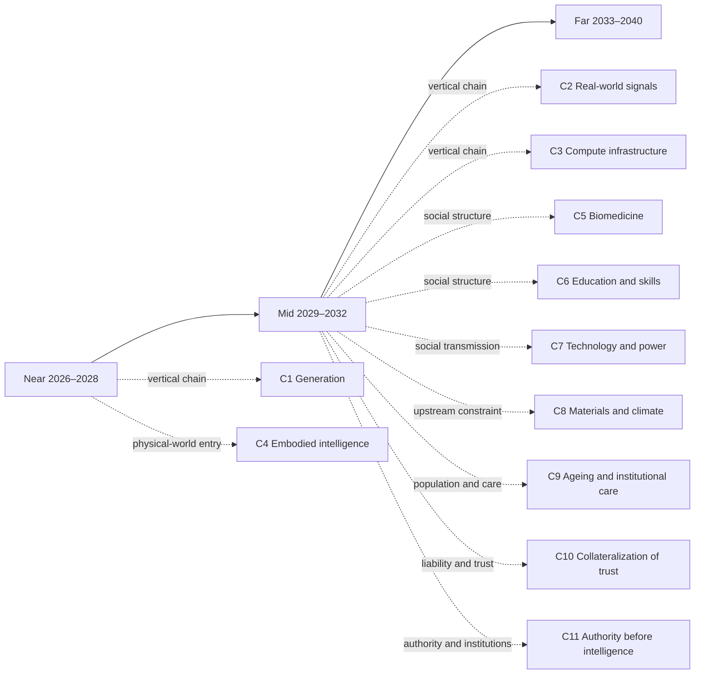

# Far-term landscape: 2033–2040

[中文版](../zh/30-far.md)

[Back to README / document map](../../README.en.md)

> Start with an inference—not a forecast, but what the mid-term judgments look like pushed one notch further. In March 2037, a seaside town has to decide whether three hundred households move or stay, and whether that decision was right will not be visible until around 2040. Plans are not what is missing: the system offers more combinations of relocation and reinforcement than anyone bothers to count, each with thirty years of counterfactual modeling, a phased implementation plan, and a compensation model, and any one of them can be understood in ten minutes. The town’s routine engineering work has run on granted boundaries for years; nobody approves anything step by step anymore. The four hours the seven people in that room spend are barely used for comparing plans—that part was finished long ago. What they are settling is something else: which options to give up, and, if this turns out wrong, who will still be here by then to clean up.
>
> The input that matters most is the one the system cannot supply: how this stretch of coast actually behaves in every storm over the next two years is beyond the models not because they are weak, but because those two years have not happened yet. It requires someone to stand on the same tidal flat for an hour on the same day of every week for two years, a hundred-odd times without a gap, with a name and a date on the record, or by then nobody will accept it. The other thing the system cannot do is quieter: each of the seven has an agent that attended all twenty earlier meetings and remembers every sentence, and that agent can be copied, paused, and transferred into someone else’s name; the seven people sitting there cannot. What makes the consent binding is precisely that inability—by then someone must still be present, and must still own this.
>
> On the way out somebody asks one of them why she is the one walking the flat. Because, she says, it is the only part of this that stops counting if someone else does it for me.
>
> That is roughly the shape of the far horizon: the generable side—plans, explanations, companionship, identity—keeps growing, while the side that asks who gave up the other options, who was present, and who still owns it when the results come in has neither grown nor become cheaper. The six sections below follow that fault line. The far horizon is not a straight line from near-term trends. It tests the load-bearing walls: if the mid-term judgments hold, what must people and organizations rearrange? Each section states its dependencies, branches, and action boundary. Low-confidence judgments remain structural landscapes, not disguised forecasts.
>
> The far horizon has no chain of its own yet. Every section in this layer stands on a mid-term judgment; to see where those dependencies come from, go back to the [mid-term landscape, 2029–2032](20-mid.md).

## Reading navigation map (relationship projection)

This map provides reading entrances among the near/mid/far pages and the reasoning chains. It adds no judgment and does not replace the `J-NNN` ledger. Time layers are coarse reading containers; causal dependencies live in the ledger’s `depends-on` fields.

> This is a reading aid, not a new source of facts. Arrows indicate recommended entrances, not necessary causality.

## 1. Execution and infrastructure: people grant boundaries instead of operating every step

If [J-031](ledger/31-40.md#j-031--pausable-replayable-rollback-capable-action-environments-become-admission-conditions-for-long-horizon-ai-execution)’s rollback-capable environments, [J-032](ledger/31-40.md#j-032--authorization-review-and-exception-escalation-become-scarcer-than-execution-steps)’s authorization review, and [J-014](ledger/11-20.md#j-014--rehearsable-environments-follow-single-tool-integration)’s rehearsal environments take shape in the mid term, the high-value AI interface in 2033–2040 may no longer be “perform this step,” but “act within these boundaries; who owns the result?”

- **First question: what becomes abundant:** agent execution across tools, organizations, and time, with continuous task monitoring.
- **Second question: what becomes scarce as a result:** understandable authorization boundaries, genuinely reversible responsibility, and organizational positions able to absorb accidents.
- **Third question: can the same force that creates abundance automate the new scarcity?:** permissions, plans, and exception categories can scale through the same automation; physical harm, legal liability, and bodily consequences remain hard constraints and cannot become free copies.
- **What can be done now:** write agent permissions as auditable, pausable, rollback-capable boundaries; build incident rehearsal and human escalation before buying longer autonomy.
- **Boundary:** This is a low-confidence structural landscape. If high-fidelity simulation replaces real observation in high-liability settings, or accident rates keep falling without independent intervention, rewrite this section. The corresponding judgments are [J-043](ledger/41-50.md#j-043--high-value-agent-execution-may-shift-to-boundary-grants-rather-than-step-by-step-operation-landscape-only) and [J-044](ledger/41-50.md#j-044--liability-positions-able-to-absorb-accidents-become-the-load-bearing-wall-of-agent-infrastructure-landscape-only).

> **Scope tag · Gate 1**: The cited J-014, J-031, J-032, J-043, J-044 are occupational/organizational judgments; their audience ceiling is defined by the cited cards, so this passage makes no society-wide trend claim. See [Historical retrospective · Gate 1](01-retrospect.md#7-running-these-gates-on-what-we-ourselves-have-written) for the criterion and the [ledger review log](90-ledger.md#8-review-log) for card-level evidence.

## 2. Information and content: expression becomes infinite; unarranged reality becomes a scarce input

If [J-033](ledger/31-40.md#j-033--verifiable-records-of-real-interventions-become-more-valuable-than-explanation-itself)’s verified records of real intervention and [J-034](ledger/31-40.md#j-034--synthetic-evidence-is-accepted-first-in-low-liability-contexts-high-liability-contexts-still-require-real-trials)’s liability separation hold, the far-term content industry may focus less on who generates the most convincing artifact and more on who observed, intervened, and bears the result. Synthetic content does not disappear; it becomes a cheap substrate for exploring and explaining reality.

- **First question: what becomes abundant:** replayable histories, personalities, settings, explanations, and counterfactual simulations.
- **Second question: what becomes scarce as a result:** unarranged presence, shared experience, raw signals across elapsed time, and accountable causal records.
- **Third question: can the same force that creates abundance automate the new scarcity?:** synthesis, compression, and remixing can keep expanding automatically; physical presence, ownership, liability, and non-replayable time are hard constraints that more tokens cannot manufacture.
- **What can be done now:** preserve raw observation, collection conditions, accountable parties, and second-order interpretation as separate layers; in high-liability use, ask first who was present, who intervened, and who pays.
- **Boundary:** Low confidence. If high-liability fields broadly accept synthetic evidence without higher accident rates, withdraw the premium assigned to field reality. The corresponding judgments are [J-045](ledger/41-50.md#j-045--as-synthetic-expression-becomes-abundant-unarranged-observation-of-reality-becomes-scarce-landscape-only) and [J-046](ledger/41-50.md#j-046--high-liability-settings-retain-a-premium-for-field-causal-records-landscape-only).

> **Scope tag · Gate 1**: The cited J-033, J-034, J-045, J-046 are occupational/organizational judgments; their audience ceiling is defined by the cited cards, so this passage makes no society-wide trend claim. See [Historical retrospective · Gate 1](01-retrospect.md#7-running-these-gates-on-what-we-ourselves-have-written) for the criterion and the [ledger review log](90-ledger.md#8-review-log) for card-level evidence.

## 3. People and AI: the most intimate object may be the most asymmetric

If [J-041](ledger/41-50.md#j-041--ai-first-expands-the-coordination-radius-of-weak-ties)’s expansion of weak-tie coordination and [J-042](ledger/41-50.md#j-042--shared-experience-and-embodied-presence-remain-the-capacity-ceiling-for-strong-ties-landscape-only)’s embodied-presence ceiling persist, AI may become the most enduring, patient, and copyable interaction object. The issue is not only whether AI resembles a person, but that memory, patience, copyability, and refusal are asymmetric between the sides.

- **First question: what becomes abundant:** always-available companionship, long memory, personalized emotional mirroring, and relationship agents that can be paused, copied, and moved.
- **Second question: what becomes scarce as a result:** non-copyable reciprocity, commitments made meaningful by finite life, the other party’s genuine freedom to refuse, and relationships that share risk.
- **Third question: can the same force that creates abundance automate the new scarcity?:** language, reminders, retrieval, and personality style can scale; embodied presence, legal personhood, shared risk, and genuine refusal cannot be copied at zero cost by the same force.
- **What can be done now:** distinguish tool service from human commitment in product and family rules; preserve data portability, relationship exit, and records of real authorization.
- **Concrete action path (non-commercial, low-confidence example):** When a family gives a copyable AI continuous companionship or care reminders, the person receiving the service first chooses its permitted uses, who may access it, and a one-click pause contact. Whenever the AI is about to message relatives, give health advice, or make a commitment on that person’s behalf, the person must confirm it and the confirmation must be exportable. If the agent keeps contacting people after revocation, its history cannot be exported, or relatives mistake its words for the person’s commitment, the family pauses the agent, notifies the affected people, and switches that decision back to human confirmation. The observable failures are whether withdrawal took effect, mistaken-attribution events, and repair time—not the mere existence of a rule.
- **Status of the judgment:** This action path operationalizes the low-confidence, landscape-only J-047/J-048; it is not a forecast that this usage will become widespread and it is not an opportunity claim.
- **Boundary:** Low-confidence landscape only. If institutions recognize copyable AI as a full relationship subject and longitudinal behavior shows that non-copyable reciprocity is no longer needed, rewrite this section. The corresponding judgments are [J-047](ledger/41-50.md#j-047--copyable-ai-relationships-expand-companionship-supply-while-non-copyable-reciprocity-becomes-scarce-landscape-only) and [J-048](ledger/41-50.md#j-048--authorization-exit-and-subject-boundaries-in-humanai-relationships-become-normative-issues-landscape-only).

> **Scope tag · Gate 1**: The cited J-041, J-047, J-048 are occupational/organizational judgments; their audience ceiling is defined by the cited cards, so this passage makes no society-wide trend claim. See [Historical retrospective · Gate 1](01-retrospect.md#7-running-these-gates-on-what-we-ourselves-have-written) for the criterion and the [ledger review log](90-ledger.md#8-review-log) for card-level evidence.

## 4. Collaboration between people: from doing steps together to choosing commitments together

If [J-041](ledger/41-50.md#j-041--ai-first-expands-the-coordination-radius-of-weak-ties)’s coordination radius expands while [J-038](ledger/31-40.md#j-038--authorization-exception-escalation-and-responsibility-roles-do-not-shrink-as-fast-as-execution-steps)’s responsibility roles persist, AI will handle translation, scheduling, negotiation drafts, and context synchronization; people will appear together mainly at a few irreversible choice points.

- **First question: what becomes abundant:** instant collaboration drafts and agent negotiation across time zones, languages, and organizations.
- **Second question: what becomes scarce as a result:** human groups willing to give up alternatives for one future, share failure, and repair conflict.
- **Third question: can the same force that creates abundance automate the new scarcity?:** coordination text and candidate plans can scale automatically; trust, conflict repair, shared risk, and long-term reputation cannot be generated in one step.
- **What can be done now:** organizations should record what was jointly undertaken, not only message volume; make key commitments human-confirmed and traceable events.
- **Concrete action path (non-commercial, low-confidence example):** When a community or work group is about to let an agent negotiate an irreversible commitment (for example, a shared-care rota, a common-space renovation, or a long-term volunteer project), the agent first sends every member the cost, exit date, replacement person, and worst-case consequence. The commitment takes effect only after the pre-agreed quorum is reached and each person confirms separately. Once a month, people—not the agent—review whether it is being honored; if someone withdraws or a key condition changes, the agent may start renegotiation but cannot silently reuse the old authorization. If someone later denies taking responsibility, no replacement is found for a withdrawing member, or conflict exceeds the agreed repair window, the group records the failure and pauses the next step. The observable measures are joint-confirmation rate, replacement time after withdrawal, and conflict-repair time—not message volume.
- **Status of the judgment:** This action path operationalizes the low-confidence, landscape-only J-049/J-050; it is not a forecast that this collaboration pattern is already widespread and it is not an opportunity claim.
- **Boundary:** Low-confidence landscape only. If agent reputation and negotiation reliably replace human trust, reconsider the strong-tie capacity constraint. The corresponding judgments are [J-049](ledger/41-50.md#j-049--as-ai-coordination-becomes-abundant-jointly-bearing-irreversible-commitments-becomes-scarce-landscape-only) and [J-050](ledger/41-50.md#j-050--the-value-of-human-collaboration-shifts-from-doing-steps-together-to-choosing-commitments-together-landscape-only).

> **Scope tag · Gate 1**: The cited J-038, J-041, J-049, J-050 are occupational/organizational judgments; their audience ceiling is defined by the cited cards, so this passage makes no society-wide trend claim. See [Historical retrospective · Gate 1](01-retrospect.md#7-running-these-gates-on-what-we-ourselves-have-written) for the criterion and the [ledger review log](90-ledger.md#8-review-log) for card-level evidence.

## 5. Power and institutions: more answers do not mean dispersed action rights

If [J-039](ledger/31-40.md#j-039--rented-models-become-abundant-while-energy-data-and-channel-control-create-access-rents)’s access rents, [J-040](ledger/31-40.md#j-040--balance-sheets-able-to-absorb-ai-accidents-become-a-separate-scarcity)’s liability balance sheets, and [J-035](ledger/31-40.md#j-035--responsibility-collateral-enters-the-transaction-structure-for-consequential-ai-output)’s responsibility collateral enter institutions, far-term power may reorganize around four access points: energy and compute, real-world data, action authorization, and compensation for accidents.

- **First question: what becomes abundant:** advice, forecasts, candidate policies, and simulated decisions for organizations and individuals.
- **Second question: what becomes scarce as a result:** institutional positions able to allocate real resources, sign permissions, access critical infrastructure, and bear losses.
- **Third question: can the same force that creates abundance automate the new scarcity?:** opinions, plans, and arguments can be generated without limit; ownership, state responsibility, enforcement, resource access, and solvency cannot scale at the same rate.
- **What can be done now:** record separately who may advise, execute, and compensate; evaluate AI projects by asking who controls inputs, exits, and accident losses.
- **Boundary:** Low-confidence landscape only. If open protocols continue dispersing critical resources and authorization and controllers lose structural premiums, withdraw the concentration direction. The corresponding judgments are [J-051](ledger/51-60.md#j-051--abundant-advice-does-not-automatically-disperse-real-action-rights-landscape-only) and [J-052](ledger/51-60.md#j-052--energy-real-world-data-authorization-and-compensation-form-far-term-institutional-access-points-landscape-only).

> **Scope tag · Gate 1**: The cited J-035, J-039, J-040, and J-052 are occupational/organizational judgments. J-051's billion-scale figure is an upper bound on people affected by an institutional arrangement, not a count of distinct people repeating the same action weekly; it therefore remains an institutional judgment and landscape only. The audience ceiling is defined by the cited cards, so this passage makes no society-wide trend claim. See [Historical retrospective · Gate 1](01-retrospect.md#7-running-these-gates-on-what-we-ourselves-have-written) for the criterion and the [ledger review log](90-ledger.md#8-review-log) for card-level evidence.

## 6. Human needs, meaning, and embodied presence: scarcity may move from objects to responsibility

If [J-042](ledger/41-50.md#j-042--shared-experience-and-embodied-presence-remain-the-capacity-ceiling-for-strong-ties-landscape-only)’s presence ceiling and [J-029](ledger/21-30.md#j-029--demand-side-anchors-persist)’s demand anchors are not overturned by new preferences, a reversal may appear: when answers, works, companionship, and identities can all be generated, “what I personally bore” becomes a source of status, trust, and meaning.

> **Scope label · downgrade (2026-10-09 isolated blind re-review)**: J-029, used as a premise here, has been scope-downgraded (round-1 blind record `R1-65` vetoed it at Gate 2; card status `REVISED`) and may only be read as an institutional / human-nature-constant judgment; the reversal pictured in this section cannot borrow a society-level voice from J-029. See the [J-029 card](ledger/21-30.md#j-029--demand-side-anchors-persist) and [section 5 of the isolated blind re-review](../evidence/blind-review-reaudit-2026-10-09.en.md#5-the-one-new-downgrade-j-029).

- **First question: what becomes abundant:** lives to try, generated achievement narratives, instant consolation, and replaceable identities.
- **Second question: what becomes scarce as a result:** non-delegable responsibility, experiences that consume real lifetime, bodily risk, and commitments witnessed by others over time.
- **Third question: can the same force that creates abundance automate the new scarcity?:** narratives and consolation can be automated; lifetime, bodily risk, relationship trust, and shared consequences are hard constraints.
- **What can be done now:** people and organizations should not only accumulate reproducible outputs; reserve time for experiences, commitments, and presence that agents cannot perform. Other institutional and commercial paths are **landscape only**, not opportunities.
- **Boundary:** This is the lowest-confidence Exit-B landscape. If a new generation broadly stops treating real experience, responsibility, and presence as sources of value, withdraw or rewrite the relevant judgments. The corresponding judgments are [J-053](ledger/51-60.md#j-053--as-generatable-goods-become-abundant-what-one-personally-bore-may-become-a-signal-of-meaning-landscape-only) and [J-054](ledger/51-60.md#j-054--non-delegable-time-bodily-risk-and-long-commitments-remain-demand-side-scarcities-landscape-only).

## Honest far-term boundary and uncovered list

The far horizon is not a completed full-spectrum prophecy. Energy and physical infrastructure, biology and medicine, education and qualification, geopolitics, and law and property still need independent chains; concrete human–AI relationship norms cannot be inferred directly from capability. The gaps remain in [the ledger’s “Explicit gaps” section](90-ledger.md#6-explicit-gaps-dimensions-not-yet-covered) and must not be silently removed because this layer has structural landscapes. The far horizon’s purpose is to show which current judgments are load-bearing and where the next evidence must be gathered.
