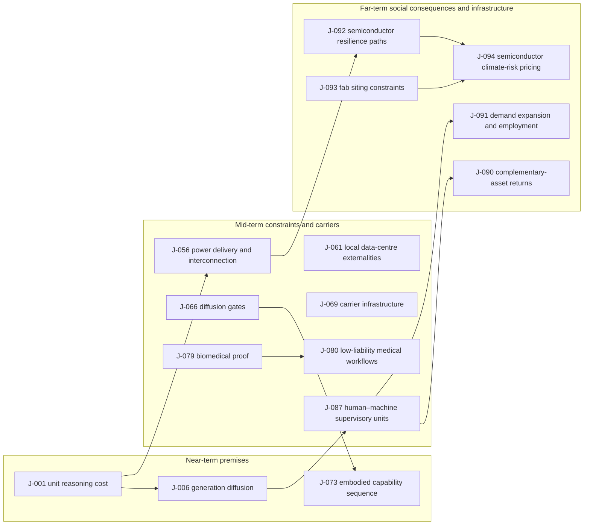

# Judgment Ledger

> The single register and governance entry point for all project judgments. Narrative documents cite `J-NNN`; complete judgment cards live in stable-numbered `ledger/` shards, while this file keeps the overview, dependency graph, review views, sources, and compatibility anchors.
> This ledger records how judgments are proposed, linked, revised, and reviewed. A falsified judgment is never deleted.

---

## Contents / navigation

- [1. How to use this ledger](#1-how-to-use-this-ledger)
- [2. Registered-judgment overview](#2-registered-judgment-overview)
- [3. The `depends-on` graph](#3-the-depends-on-graph)
- [4. Confidence-change history](#4-confidence-change-history)
- [5. Expiry-review procedure](#5-expiry-review-procedure)
- [6. Explicit gaps: dimensions not yet covered](#6-explicit-gaps-dimensions-not-yet-covered)
- [7. Formal judgment and opportunity index](#7-formal-judgment-and-opportunity-index)
- [8. Review log](#8-review-log)
- [9. External-comparison sources for this round](#9-external-comparison-sources-for-this-round)
- [Complete judgment-card shards](ledger/01-10.md) · [J-011–J-020](ledger/11-20.md) · [J-021–J-030](ledger/21-30.md) · [J-031–J-040](ledger/31-40.md) · [J-041–J-050](ledger/41-50.md) · [J-051–J-060](ledger/51-60.md) · [J-061–J-070](ledger/61-70.md) · [J-071–J-080](ledger/71-80.md) · [J-081–J-090](ledger/81-90.md) · [J-091–J-095](ledger/91-95.md)

## 1. How to use this ledger

### 1.1 Judgment-card fields

A testable judgment must contain every field below. J-001–J-086 are pre-migration cards and may temporarily carry scale only inside Diffusion-gate review while the checker warns; **J-087 and later fail validation without a standalone Audience scale field**. If any other field is missing, label the statement **landscape only**; it cannot serve as a business-opportunity judgment or summary conclusion.

- **ID**: `J-NNN`, three digits, globally unique; shared by Chinese and English; never reuse an old or revised ID.
- **Proposed date**: the date the judgment was first proposed, `YYYY-MM-DD`.
- **One-sentence judgment**: a proposition that can be supported or refuted by facts.
- **Audience scale** (standalone and required from J-087): affected group; hundred-thousand / million / tens-of-millions / hundred-millions / billion-scale; whether it raises existing professionals' ceiling or lets people who could not do it do it now; label a constructed estimate explicitly.
- **Diffusion-gate review**: state the audience magnitude, audience identity, Gate 1 verdict, and whether the judgment raises the ceiling of existing professionals or lets people who previously could not do the activity do it.
- **Lens**: name the supply–demand, human-nature, historical, technological, social, or other calibrated lenses actually used; do not force unused lenses merely for symmetry.
- **Reasoning chain**: each step from first principles and selected lenses; do not replace reasoning with another institution's prediction.
- **Time window**: the interval in which the judgment is expected to occur or remain valid.
- **Falsifier**: one concrete, observable event or data result that would make the author admit the judgment is wrong.
- **Leading indicator**: an observable signal expected to move before the outcome, with its observation frequency or source.
- **Confidence**: canonical values are `High` / `Medium` / `Low` / `Low (landscape only)`; formal field values have no sentence-final punctuation. Low-confidence items remain landscape only and do not enter the opportunity list.
- **depends-on**: the prerequisite `J-NNN` judgments. Write `—` when there is no dependency; never use a vague “see above.”
- **Strongest opposing mechanism**: the alternative mechanism or counterexample most capable of invalidating the judgment.
- **Against consensus**: the three comparison elements — where it agrees, where it diverges or what the evidence boundary is, and why the judgment is retained or confidence lowered; write “unknown” explicitly when the round is incomplete.
- **External comparison source**: the `EXT-NN` source identifiers supporting the comparison; state that comparison is incomplete when applicable.
- **Source**: the narrative document or chain where the judgment appears.
- **Next review**: the next date to review the falsifier, leading indicators, and external evidence.
- **Status**: **ACTIVE** (awaiting evidence), **HIT** (supported), **FALSIFIED** (falsifier triggered), or **REVISED** (the old card is retained, but the status note must distinguish two cases): (1) **scope downgrade** — only the audience, applicability, or narrative strength was narrowed, while the original proposition still has a time window, falsifier, and review date; the card remains independently due for review and stays in the calibration denominator. (2) **superseded by a new card** — the status note must name the successor `J-NNN` and state that the old card is no longer reviewed separately; review it with the successor when due, but do not use it as a current judgment or opportunity premise. Never infer calibration exclusion from the `REVISED` label alone.

### 1.2 Completed example card (example only)

> **Example card | EXAMPLE-J-000 (explicitly excluded from the formal numbering)**
> - **ID**: EXAMPLE-J-000
> - **Proposed date**: 2026-09-18
> - **One-sentence judgment**: In a hypothetical market, if the unit cost of repeatedly generating proposals falls by an order of magnitude, the value of a service that merely supplies more proposals will decline within three years.
> - **Audience scale**: affected group = professional buyers; million-scale; raises existing professionals' ceiling; constructed example estimate.
> - **Diffusion-gate review**: The example audience is millions of professional buyers; it raises the ceiling of existing professionals rather than enabling a new activity; Gate 1 fails.
> - **Lens**: Supply–demand and technological regularities.
> - **Reasoning chain**: Supply increases → proposal marginal cost falls → buyers no longer lack proposal quantity → value moves to selection and validation. This demonstrates dependency notation and is not adopted as a project judgment.
> - **Time window**: 2026-09-18 to 2029-09-18.
> - **Falsifier**: By 2029-09-18, buyers still broadly pay a premium for proposal quantity rather than verifiable outcomes, without supply or regulatory constraints explaining it.
> - **Leading indicator**: Unit generation cost and the median amount buyers pay for human selection, recorded every six months.
> - **Confidence**: Medium (example value)
> - **depends-on**: —
> - **Strongest opposing mechanism**: Regulation, liability, or scarce inputs may prevent proposal supply from expanding, preserving a quantity premium.
> - **Against consensus**: Unknown; this example does not perform an external comparison.
> - **External comparison source**: Comparison not completed (example).
> - **Source**: This example section.
> - **Next review**: 2029-09-18 (example value).
> - **Status**: ACTIVE (example value).

Copy the fields, not the example ID. The example does not enter the formal index.

---

## 2. Registered-judgment overview

| ID | Proposed date | One-sentence judgment | Time window | Confidence | depends-on | Source | Against consensus | Status | Next review |
|---|---|---|---|---|---|---|---|---|---|
| [J-001](#j-001--unit-reasoning-cost-keeps-falling) | 2026-09-18 | Unit reasoning cost falls another order of magnitude by the end of 2029 | 2026–2029 | High | — | [C1](chains/10-generation-becomes-free.md) | Directionally consistent, but the tenfold-by-2029 claim is unverified; sources support a decline channel, not the specific magnitude. | REVISED (2026-09-20 diffusion-gate downgrade to an occupational/organizational judgment; the old card is kept) | 2027-03-31 |
| [J-002](#j-002--selecting-objectively-high-quality-from-abundant-output-is-not-a-durable-scarcity-but-merely-a-24-year-window) | 2026-09-18 | Objective quality selection is a 2–4 year window, not durable scarcity | through 2029 | Medium | J-001 | [C1](chains/10-generation-becomes-free.md) | Retain with a different mechanism: objective selection may be partly internalized, while liability- and domain-sensitive QA may persist. | REVISED (2026-09-20 diffusion-gate downgrade to an occupational/organizational judgment; the old card is kept) | 2027-03-31 |
| [J-003](#j-003--the-genuinely-durable-scarcity-is-ownership-of-private-context-about-you-and-its-usable-form) | 2026-09-18 | Ownership and usable form of private personal or organizational context are more likely to become durable scarcity | 2027–2033 | Medium | J-001, J-002 | [C1](chains/10-generation-becomes-free.md) | Retain with a narrower evidence boundary: sources support governance of private context, not that it must become durable scarcity. | REVISED (2026-09-20 diffusion-gate downgrade to an occupational/organizational judgment; the old card is kept) | 2027-06-30 |
| [J-004](#j-004--as-ai-shifts-from-generating-content-to-executing-actions-the-scarce-item-is-infrastructure-that-makes-actions-reversible) | 2026-09-18 | As AI executes actions, infrastructure that makes actions reversible becomes scarce | 2027–2032 | Medium | J-001 | [C1](chains/10-generation-becomes-free.md) | Partly consistent: isolation, oversight, and recovery have support; scarcity and timing of reversible infrastructure remain unverified. | REVISED (2026-09-19 opportunity-durability review; narrowed and superseded by J-065; the old card is kept) | — |
| [J-005](#j-005--after-generation-becomes-abundant-value-concentrates-in-three-kinds-of-non-recombinable-input-raw-signals-accountable-commitments-and-validated-causality) | 2026-09-18 | Raw signals, accountable commitments, and verified causality become more valuable than reproducible text | 2029–2033 | Medium | J-001 | [C1](chains/10-generation-becomes-free.md) | Mechanistically consistent but should be limited to high-liability domains: traceable signals and real-world causal validation matter, without implying all three inputs broadly appreciate. | REVISED (2026-09-20 diffusion-gate downgrade to an occupational/organizational judgment; the old card is kept) | 2027-06-30 |
| [J-006](#j-006--reasoning-throughput-precedes-long-horizon-autonomy) | 2026-09-18 | Reasoning throughput precedes long-horizon autonomy | 2026–2028 | High | J-001 | [Technology Capability Sequence](05-tech-sequence.md) | Directionally consistent but ordering is unproven: capability and throughput scaling before reliable long-horizon agents remains testable. | REVISED (2026-09-20 diffusion-gate downgrade to an occupational/organizational judgment; the old card is kept) | 2027-03-31 |
| [J-007](#j-007--resumable-context-precedes-reliable-long-term-memory) | 2026-09-18 | Resumable context precedes reliable long-term memory | 2026–2029 | High | J-006 | [Technology Capability Sequence](05-tech-sequence.md) | Consistent in direction but with a different mechanism: retrievable context is often combined with long windows, not proven to have a fixed industry order. | REVISED (2026-09-20 diffusion-gate downgrade to an occupational/organizational judgment; the old card is kept) | 2027-03-31 |
| [J-008](#j-008--sourced-long-term-memory-becomes-a-prerequisite-for-reliable-collaboration) | 2026-09-18 | Sourced long-term memory becomes a prerequisite for reliable collaboration | 2028–2031 | Medium | J-007 | [Technology Capability Sequence](05-tech-sequence.md) | Retain with a different mechanism: provenance, versioning, and revisability improve auditability, but are not proven necessary for every high-value collaboration. | REVISED (2026-09-20 diffusion-gate downgrade to an occupational/organizational judgment; the old card is kept) | 2027-06-30 |
| [J-009](#j-009--continuous-execution-in-constrained-workflows-matures-first) | 2026-09-18 | Continuous execution in constrained workflows matures first | 2027–2030 | High | J-008 | [Technology Capability Sequence](05-tech-sequence.md) | Consistent with the consensus: constrained, checkable workflows mature before open-world autonomy; sources support the constraint transition, not a replacement of the original chain. | REVISED (2026-09-20 diffusion-gate downgrade to an occupational/organizational judgment; the old card is kept) | 2027-06-30 |
| [J-010](#j-010--long-horizon-autonomy-follows-constrained-continuous-execution) | 2026-09-18 | Long-horizon autonomy follows constrained continuous execution | 2029–2033 | Medium | J-009 | [Technology Capability Sequence](05-tech-sequence.md) | Directionally consistent but the window is unverified: long-horizon capability is growing while reliable deployment remains horizon-limited. | REVISED (2026-09-20 diffusion-gate downgrade to an occupational/organizational judgment; the old card is kept) | 2027-06-30 |
| [J-011](#j-011--cross-media-consistency-precedes-long-range-coherence) | 2026-09-18 | Cross-media consistency precedes long-range coherence | 2027–2030 | Medium | J-006, J-007 | [Technology Capability Sequence](05-tech-sequence.md) | Retain but with insufficient evidence: research supports long-range coherence difficulty, not that cross-media consistency must arrive first. | REVISED (2026-09-20 diffusion-gate downgrade to an occupational/organizational judgment; the old card is kept) | 2027-06-30 |
| [J-012](#j-012--cross-time-coherence-depends-on-state-and-evaluation) | 2026-09-18 | Cross-time coherence depends on state and evaluation | 2029–2034 | Medium | J-008, J-011 | [Technology Capability Sequence](05-tech-sequence.md) | Mechanistically consistent but the window is unverified: long-range coherence depends on state retention, spatiotemporal representation, and ongoing evaluation. | REVISED (2026-09-20 diffusion-gate downgrade to an occupational/organizational judgment; the old card is kept) | 2027-06-30 |
| [J-013](#j-013--checkable-tool-calls-precede-open-environment-action) | 2026-09-18 | Checkable tool calls precede open-environment action | 2027–2030 | High | J-009 | [Technology Capability Sequence](05-tech-sequence.md) | Consistent with the consensus: structured, checkable tool calls are productized; the strict ordering remains this project’s judgment. | REVISED (2026-09-20 diffusion-gate downgrade to an occupational/organizational judgment; the old card is kept) | 2027-03-31 |
| [J-014](#j-014--rehearsable-environments-follow-single-tool-integration) | 2026-09-18 | Rehearsable environments follow single-tool integration | 2028–2032 | Medium | J-009, J-013 | [Technology Capability Sequence](05-tech-sequence.md) | Retain only as an evidence-limited landscape: governance supports rehearsable, recoverable environments, not a market order or window. | REVISED (2026-09-20 diffusion-gate downgrade to an occupational/organizational judgment; the old card is kept) | 2027-06-30 |
| [J-015](#j-015--formal-verification-precedes-open-world-evaluation) | 2026-09-18 | Formal verification precedes open-world evaluation | 2026–2029 | High | J-006, J-009 | [Technology Capability Sequence](05-tech-sequence.md) | Directionally consistent with a broader mechanism: executable tests generally precede open-world outcome evaluation, without proving universal default integration. | REVISED (2026-09-20 diffusion-gate downgrade to an occupational/organizational judgment; the old card is kept) | 2027-03-31 |
| [J-016](#j-016--open-world-evaluation-is-the-final-gate-for-expanding-autonomy) | 2026-09-18 | Open-world evaluation is the final gate for expanding autonomy | 2029–2035 | Medium | J-010, J-012, J-014, J-015 | [Technology Capability Sequence](05-tech-sequence.md) | Retain only as an evidence-limited landscape: open-world feedback may constrain autonomous authority, but is not established as the final gate. | REVISED (2026-09-20 diffusion-gate downgrade to an occupational/organizational judgment; the old card is kept) | 2027-06-30 |
| [J-017](#j-017--ai-mediation-expands-weak-tie-coordination-faster-than-strong-relationships) | 2026-09-18 | AI mediation expands weak-tie coordination faster than strong relationships, without expanding the number of relationships in which people can remain present | 2027–2033 | Medium | J-006, J-007 | [C1](chains/10-generation-becomes-free.md) | Directionally consistent but causality remains unverified: sources support weak/strong tie differences, not an AI-mediated capacity effect. | REVISED (2026-09-20 diffusion-gate downgrade to an occupational/organizational judgment; the old card is kept) | 2027-06-30 |
| [J-018](#j-018--parallel-reasoning-before-long-horizon-autonomy) | 2026-09-18 | Parallel reasoning becomes the default workflow before long-horizon autonomy | 2026–2028 | High | J-006, J-009 | [Near-term landscape](10-near.md) | Consistent with the consensus: generate–compare–revise may become common before long-horizon autonomy, but the window remains this project’s inference. | REVISED (2026-09-20 diffusion-gate downgrade to an occupational/organizational judgment; the old card is kept) | 2027-03-31 |
| [J-019](#j-019--token-saving-is-a-window) | 2026-09-18 | Saving tokens itself is a window, not durable scarcity | 2026–2028 | Medium | J-001, J-006 | [Near-term landscape](10-near.md) | Retain with a different mechanism: cost decline can come from inference efficiency and hardware scheduling; public prices do not prove optimization premiums vanish. | REVISED (2026-09-20 diffusion-gate downgrade to an occupational/organizational judgment; the old card is kept) | 2027-03-31 |
| [J-020](#j-020--reproducible-content-keeps-falling-in-price) | 2026-09-18 | Reproducible content keeps falling in marginal price as objective selection is internalized | 2026–2028 | Medium | J-002, J-015 | [Near-term landscape](10-near.md) | Consistent with rising content supply, but liability-sensitive selection may persist; detection, labeling, and provenance remain specialized layers. | REVISED (2026-09-20 diffusion-gate downgrade to an occupational/organizational judgment; the old card is kept) | 2027-03-31 |
| [J-021](#j-021--first-hand-field-signals-earn-a-premium-first) | 2026-09-18 | First-hand field signals earn a premium earlier than second-hand expression | 2026–2029 | Medium | J-005, J-015 | [Near-term landscape](10-near.md) | Retain with a different mechanism: traceable first-hand sources may gain value first; broad field-premium pricing is unproven. | REVISED (2026-09-20 diffusion-gate downgrade to an occupational/organizational judgment; the old card is kept) | 2027-06-30 |
| [J-022](#j-022--forgable-signals-drive-credential-upgrades) | 2026-09-18 | As forgable signals multiply, selection moves toward more expensive credentials | 2026–2029 | Medium | J-005, J-017 | [Near-term landscape](10-near.md) | Consistent with trust becoming more important, with a provenance, identity, and liability-credential mechanism; adoption and cost remain unknown. | REVISED (2026-09-20 diffusion-gate downgrade to an occupational/organizational judgment; the old card is kept) | 2027-06-30 |
| [J-023](#j-023--attention-shifts-toward-fulfilled-commitments) | 2026-09-18 | Attention shifts from expression toward relationships and fulfilled commitments | 2027–2030 | Medium | J-017, J-022, J-013 | [Near-term landscape](10-near.md) | Evidence is insufficient, though the direction is retained: fulfillment records may matter more as expression grows, but usage data does not prove an attention shift. | REVISED (2026-09-20 diffusion-gate downgrade to an occupational/organizational judgment; the old card is kept) | 2027-06-30 |
| [J-024](#j-024--credentials-re-layer-landscape-only) | 2026-09-18 | Credentials may be re-layered, but the institutional destination remains uncertain | 2027–2032 | Low | J-022, J-013 | [Near-term landscape](10-near.md) | Boundary evidence supports possible credential stratification; the institutional endpoint remains uncertain, so keep it landscape-only. | REVISED (2026-09-20 diffusion-gate downgrade to an occupational/organizational judgment; the old card is kept) | 2027-06-30 |
| [J-025](#j-025--small-team-output-rises) | 2026-09-18 | Small teams complete more verifiable output with fewer steps | 2027–2030 | Medium | J-009, J-013 | [Near-term landscape](10-near.md) | Consistent with knowledge-work automation, but causal evidence for higher net output in small teams remains insufficient. | REVISED (2026-09-20 diffusion-gate downgrade to an occupational/organizational judgment; the old card is kept) | 2027-06-30 |
| [J-026](#j-026--responsibility-boundaries-remain) | 2026-09-18 | Responsibility boundaries do not disappear at the same rate as knowledge-work capacity | 2027–2032 | Medium | J-009, J-013 | [Near-term landscape](10-near.md) | Consistent with the consensus: automating execution will not remove oversight and liability boundaries at the same rate; rules do not forecast job counts. | REVISED (2026-09-20 diffusion-gate downgrade to an occupational/organizational judgment; the old card is kept) | 2027-06-30 |
| [J-027](#j-027--rented-compute-spreads-capability) | 2026-09-18 | Rented compute spreads capability without distributing gains evenly | 2026–2029 | Medium | J-001, J-006 | [Near-term landscape](10-near.md) | Consistent with capability diffusion, with uneven gains more specifically constrained by energy, data, and organizational capacity. | REVISED (2026-09-20 diffusion-gate downgrade to an occupational/organizational judgment; the old card is kept) | 2027-03-31 |
| [J-028](#j-028--access-becomes-a-bargaining-node-landscape-only) | 2026-09-18 | Data, distribution, and liability access may become new bargaining nodes | 2027–2032 | Low | J-005, J-013 | [Near-term landscape](10-near.md) | Boundary evidence only: energy, data, and liability access may become bargaining points, but persistent rents are unproven. | REVISED (2026-09-20 diffusion-gate downgrade to an occupational/organizational judgment; the old card is kept) | 2027-06-30 |
| [J-029](#j-029--demand-side-anchors-persist) | 2026-09-18 | Status, certainty, embodied presence, and responsibility remain demand-side anchors | 2026–2030 | Medium | J-017, J-011 | [Near-term landscape](10-near.md) | Consistent with the conservative direction: social contact, well-being, and responsibility remain plausible demand anchors, but preferences through 2030 are unproven. | ACTIVE | 2027-06-30 |
| [J-030](#j-030--ai-mediates-coordination-not-shared-experience-landscape-only) | 2026-09-18 | AI mediates coordination but cannot mediate shared experience | 2027–2032 | Low | J-017, J-011 | [Near-term landscape](10-near.md) | Boundary evidence only: AI can mediate coordination, but causal and generational evidence for substituting shared experience is insufficient. | REVISED (2026-09-20 diffusion-gate downgrade to an occupational/organizational judgment; the old card is kept) | 2027-06-30 |
| [J-031](#j-031--pausable-replayable-rollback-capable-action-environments-become-admission-conditions-for-long-horizon-ai-execution) | 2026-09-18 | Pausable, replayable, rollback-capable action environments become admission conditions for long-horizon AI execution | 2026–2032 | Medium | J-010 | [Mid-term landscape](20-mid.md) | Retain with a different mechanism: logging, oversight, and risk control have institutional support; a complete rollback gate and its window are unverified. | REVISED (2026-09-20 diffusion-gate downgrade to an occupational/organizational judgment; the old card is kept) | 2027-06-30 |
| [J-032](#j-032--authorization-review-and-exception-escalation-become-scarcer-than-execution-steps) | 2026-09-18 | Authorization review and exception escalation become scarcer than execution steps | 2027–2032 | Medium | J-013 | [Mid-term landscape](20-mid.md) | Consistent with the consensus but relative scarcity is unproven: authorization review and escalation are institutionalized, while supply comparisons are missing. | REVISED (2026-09-20 diffusion-gate downgrade to an occupational/organizational judgment; the old card is kept) | 2027-06-30 |
| [J-033](#j-033--verifiable-records-of-real-interventions-become-more-valuable-than-explanation-itself) | 2026-09-18 | Verifiable records of real interventions become more valuable than explanation itself | 2029–2033 | Medium | J-005 | [Mid-term landscape](20-mid.md) | Retain with a different mechanism: compliance evidence, model risk controls, and intervention records are gaining value; superiority to explanation is unproven. | REVISED (2026-09-20 diffusion-gate downgrade to an occupational/organizational judgment; the old card is kept) | 2027-06-30 |
| [J-034](#j-034--synthetic-evidence-is-accepted-first-in-low-liability-contexts-high-liability-contexts-still-require-real-trials) | 2026-09-18 | Synthetic evidence is accepted first in low-liability contexts; high-liability contexts still require real trials | 2028–2033 | Medium | J-005 | [Mid-term landscape](20-mid.md) | Consistent with the consensus but the window is unverified: low-liability settings may adopt synthetic evidence earlier, while high-liability settings retain real-world validation. | REVISED (2026-09-20 diffusion-gate downgrade to an occupational/organizational judgment; the old card is kept) | 2027-06-30 |
| [J-035](#j-035--responsibility-collateral-enters-the-transaction-structure-for-consequential-ai-output) | 2026-09-18 | Responsibility collateral enters the transaction structure for consequential AI output | 2028–2033 | Medium | J-005 | [Mid-term landscape](20-mid.md) | Retain with a different mechanism: liability governance, insurance, and compensation are entering transactions, but universal “liability collateral” is unproven. | REVISED (2026-09-20 diffusion-gate downgrade to an occupational/organizational judgment; the old card is kept) | 2027-06-30 |
| [J-036](#j-036--long-term-fulfillment-records-allocate-attention-better-than-one-off-natural-expression) | 2026-09-18 | Long-term fulfillment records allocate attention better than one-off natural expression | 2027–2032 | Medium | J-017 | [Mid-term landscape](20-mid.md) | Evidence is insufficient, though the direction is retained: long-term fulfillment records may support credibility, without direct attention-allocation evidence. | REVISED (2026-09-20 diffusion-gate downgrade to an occupational/organizational judgment; the old card is kept) | 2027-06-30 |
| [J-037](#j-037--comparable-small-teams-produce-more-verifiable-output) | 2026-09-18 | Comparable small teams produce more verifiable output | 2027–2031 | Medium | J-009 | [Mid-term landscape](20-mid.md) | Consistent with the consensus but causally unproven: diffusion supports plausibility, not higher output by equally sized small teams. | REVISED (2026-09-20 diffusion-gate downgrade to an occupational/organizational judgment; the old card is kept) | 2027-06-30 |
| [J-038](#j-038--authorization-exception-escalation-and-responsibility-roles-do-not-shrink-as-fast-as-execution-steps) | 2026-09-18 | Authorization, exception escalation, and responsibility roles do not shrink as fast as execution steps | 2027–2032 | Medium | J-013 | [Mid-term landscape](20-mid.md) | Consistent with the consensus: oversight, validation, escalation, and responsibility will not disappear with automation, while job counts and timing are unproven. | REVISED (2026-09-20 diffusion-gate downgrade to an occupational/organizational judgment; the old card is kept) | 2027-06-30 |
| [J-039](#j-039--rented-models-become-abundant-while-energy-data-and-channel-control-create-access-rents) | 2026-09-18 | Rented models become abundant, while energy, data, and channel control create access rents | 2027–2033 | Medium | J-001 | [Mid-term landscape](20-mid.md) | Retain with a different mechanism: model rental may become abundant, while energy and infrastructure constraints are real; data and channel rents remain unproven. | REVISED (2026-09-20 diffusion-gate downgrade to an occupational/organizational judgment; the old card is kept) | 2027-06-30 |
| [J-040](#j-040--balance-sheets-able-to-absorb-ai-accidents-become-a-separate-scarcity) | 2026-09-18 | Balance sheets able to absorb AI accidents become a separate scarcity | 2028–2033 | Medium | J-005 | [Mid-term landscape](20-mid.md) | Evidence is insufficient but grounded in current practice: insurance and liability governance exist, while a balance-sheet scarcity premium is unproven. | REVISED (2026-09-20 diffusion-gate downgrade to an occupational/organizational judgment; the old card is kept) | 2027-06-30 |
| [J-041](#j-041--ai-first-expands-the-coordination-radius-of-weak-ties) | 2026-09-18 | AI first expands the coordination radius of weak ties | 2027–2033 | Medium | J-017 | [Mid-term landscape](20-mid.md) | Directionally consistent but unproven: AI broadens communication and coordination, without enough causal data to separate weak- and strong-tie effects. | REVISED (2026-09-20 diffusion-gate downgrade to an occupational/organizational judgment; the old card is kept) | 2027-06-30 |
| [J-042](#j-042--shared-experience-and-embodied-presence-remain-the-capacity-ceiling-for-strong-ties-landscape-only) | 2026-09-18 | Shared experience and embodied presence remain the capacity ceiling for strong ties (landscape only) | 2027–2033 | Low | J-011 | [Mid-term landscape](20-mid.md) | Evidence is insufficient: ethics and care governance preserve human agency, but do not establish strong-tie capacity or substitution effects. | ACTIVE | 2027-06-30 |
| [J-043](#j-043--high-value-agent-execution-may-shift-to-boundary-grants-rather-than-step-by-step-operation-landscape-only) | 2026-09-18 | High-value agent execution may shift to boundary grants rather than step-by-step operation (landscape only) | 2033–2040 | Low | J-031, J-032, J-014 | [Far-term landscape](30-far.md) | Evidence-limited landscape: current governance supports permission boundaries, but cannot establish a long-term shift from stepwise operation to boundary grants. | REVISED (2026-09-20 diffusion-gate downgrade to an occupational/organizational judgment; the old card is kept) | 2027-12-31 |
| [J-044](#j-044--liability-positions-able-to-absorb-accidents-become-the-load-bearing-wall-of-agent-infrastructure-landscape-only) | 2026-09-18 | Liability positions able to absorb accidents become the load-bearing wall of agent infrastructure (landscape only) | 2033–2040 | Low | J-032, J-040 | [Far-term landscape](30-far.md) | Evidence-limited landscape: liability and insurance are institutional topics, but solvency as an agent-infrastructure bottleneck is unestablished. | REVISED (2026-09-20 diffusion-gate downgrade to an occupational/organizational judgment; the old card is kept) | 2027-12-31 |
| [J-045](#j-045--as-synthetic-expression-becomes-abundant-unarranged-observation-of-reality-becomes-scarce-landscape-only) | 2026-09-18 | As synthetic expression becomes abundant, unarranged observation of reality becomes scarce (landscape only) | 2033–2040 | Low | J-033, J-034 | [Far-term landscape](30-far.md) | Retain but with insufficient evidence: provenance standards support the relative importance of original records, not inevitable scarcity of unarranged observation. | REVISED (2026-09-20 diffusion-gate downgrade to an occupational/organizational judgment; the old card is kept) | 2027-12-31 |
| [J-046](#j-046--high-liability-settings-retain-a-premium-for-field-causal-records-landscape-only) | 2026-09-18 | High-liability settings retain a premium for field causal records (landscape only) | 2033–2040 | Low | J-033, J-034 | [Far-term landscape](30-far.md) | Evidence-limited landscape: high-liability settings require provenance and validation, but a price premium for field causal records is unproven. | REVISED (2026-09-20 diffusion-gate downgrade to an occupational/organizational judgment; the old card is kept) | 2027-12-31 |
| [J-047](#j-047--copyable-ai-relationships-expand-companionship-supply-while-non-copyable-reciprocity-becomes-scarce-landscape-only) | 2026-09-18 | Copyable AI relationships expand companionship supply, while non-copyable reciprocity becomes scarce (landscape only) | 2033–2040 | Low | J-041, J-042 | [Far-term landscape](30-far.md) | Evidence-limited landscape: copyable AI companionship may expand supply, but reciprocity scarcity and long-term substitution lack evidence. | REVISED (2026-09-20 diffusion-gate downgrade to an occupational/organizational judgment; the old card is kept) | 2027-12-31 |
| [J-048](#j-048--authorization-exit-and-subject-boundaries-in-humanai-relationships-become-normative-issues-landscape-only) | 2026-09-18 | Authorization, exit, and subject boundaries in human–AI relationships become normative issues (landscape only) | 2033–2040 | Low | J-041, J-042 | [Far-term landscape](30-far.md) | Consistent with the consensus that the normative issue exists, but predictive evidence is insufficient; authorization, exit, and subject boundaries lack a stable endpoint. | REVISED (2026-09-20 diffusion-gate downgrade to an occupational/organizational judgment; the old card is kept) | 2027-12-31 |
| [J-049](#j-049--as-ai-coordination-becomes-abundant-jointly-bearing-irreversible-commitments-becomes-scarce-landscape-only) | 2026-09-18 | As AI coordination becomes abundant, jointly bearing irreversible commitments becomes scarce (landscape only) | 2033–2040 | Low | J-041, J-038 | [Far-term landscape](30-far.md) | Evidence-limited landscape: advice supply may grow, but comparable data on jointly bearing irreversible commitments is absent. | REVISED (2026-09-20 diffusion-gate downgrade to an occupational/organizational judgment; the old card is kept) | 2027-12-31 |
| [J-050](#j-050--the-value-of-human-collaboration-shifts-from-doing-steps-together-to-choosing-commitments-together-landscape-only) | 2026-09-18 | The value of human collaboration shifts from doing steps together to choosing commitments together (landscape only) | 2033–2040 | Low | J-041, J-038 | [Far-term landscape](30-far.md) | Retain but with insufficient evidence: governance preserves human confirmation at key points, but does not prove a wholesale shift in collaboration value. | REVISED (2026-09-20 diffusion-gate downgrade to an occupational/organizational judgment; the old card is kept) | 2027-12-31 |
| [J-051](#j-051--abundant-advice-does-not-automatically-disperse-real-action-rights-landscape-only) | 2026-09-18 | Abundant advice does not automatically disperse real action rights (landscape only) | 2033–2040 | Low | J-039, J-040, J-035 | [Far-term landscape](30-far.md) | Evidence-limited landscape: infrastructure, liability, and resource control may concentrate, but the relationship between advice abundance and action rights is unproven. | REVISED (2026-09-20 diffusion gate: the billion-scale figure is an upper bound for affected people, not a count of distinct weekly actors; the object is an institutional arrangement, retained as a landscape/institutional judgment) | 2027-12-31 |
| [J-052](#j-052--energy-real-world-data-authorization-and-compensation-form-far-term-institutional-access-points-landscape-only) | 2026-09-18 | Energy, real-world data, authorization, and compensation form far-term institutional access points (landscape only) | 2033–2040 | Low | J-039, J-040, J-035 | [Far-term landscape](30-far.md) | Retain but with insufficient evidence: energy, real-world data, authorization, and compensation have present-day entry points; the long-term combination remains an inference. | REVISED (2026-09-20 diffusion-gate downgrade to an occupational/organizational judgment; the old card is kept) | 2027-12-31 |
| [J-053](#j-053--as-generatable-goods-become-abundant-what-one-personally-bore-may-become-a-signal-of-meaning-landscape-only) | 2026-09-18 | As generatable goods become abundant, what one personally bore may become a signal of meaning (landscape only) | 2033–2040 | Low | J-042, J-029 | [Far-term landscape](30-far.md) | Evidence-limited landscape: human agency and responsibility have current support, but personally borne experience as a meaning signal lacks generational evidence. | ACTIVE | 2027-12-31 |
| [J-054](#j-054--non-delegable-time-bodily-risk-and-long-commitments-remain-demand-side-scarcities-landscape-only) | 2026-09-18 | Non-delegable time, bodily risk, and long commitments remain demand-side scarcities (landscape only) | 2033–2040 | Low | J-042, J-029 | [Far-term landscape](30-far.md) | Evidence-limited landscape: bodies, care, and real-world risk remain governance objects, but demand-side scarcity through 2033–2040 is unproven. | ACTIVE | 2027-12-31 |
| [J-055](#j-055--real-world-signals-earn-a-premium-as-contract-assets-in-high-liability-tasks) | 2026-09-18 | In high-liability tasks, real-world signals with provenance, permission, calibration, and liability chains are more likely than data files alone to earn a structural premium | 2029–2033 | Medium | J-005, J-033, J-034, J-039 | [C2: How Real-World Signals Become Contract Assets](chains/20-real-signals-become-contracts.md) | Directionally consistent with stronger data governance and provenance, but narrowed here to high-liability tasks; an independent premium for real-world signals remains unproven. | REVISED (2026-09-20 diffusion-gate downgrade to an occupational/organizational judgment; the old card is kept) | 2027-06-30 |
| [J-056](#j-056--the-binding-constraint-on-compute-expansion-moves-from-chip-supply-to-power-delivery-and-interconnection-permits) | 2026-09-19 | The binding constraint on compute expansion moves from chip supply to power delivery and interconnection permitting | 2026–2031 | Medium | J-001, J-027 | [C3: Electrons on the Ground](chains/30-power-land-and-permits.md) | Directionally consistent with "AI electricity use is a real constraint," but this project claims something narrower: the binding constraint is the timing of delivery and permitting, not total generation; load-side queue data was not obtained this round. | REVISED (2026-09-20 diffusion-gate downgrade to an occupational/organizational judgment; the old card is kept) | 2027-03-31 |
| [J-057](#j-057--what-gets-priced-is-not-energy-but-certainty-of-delivery-date) | 2026-09-19 | In compute power transactions what is priced is mainly not energy but certainty of being live on the promised date | 2027–2032 | Medium | J-056 | [C3: Electrons on the Ground](chains/30-power-land-and-permits.md) | Partly consistent but reversed: terms protect the seller, the card claims buyer premium; falsifier not computable today. | REVISED (2026-09-20 diffusion-gate downgrade to an occupational/organizational judgment; the old card is kept) | 2027-06-30 |
| [J-058](#j-058--ai-load-splits-into-latency-sensitive-and-schedulable-halves-and-the-schedulable-half-becomes-a-grid-flexibility-resource) | 2026-09-19 | AI load splits into latency-sensitive and schedulable halves, and the schedulable half becomes a flexibility resource the grid pays for | 2027–2033 | Medium | J-056, J-018 | [C3: Electrons on the Ground](chains/30-power-land-and-permits.md) | Mechanism confirmed (EPRI measurement), scale unknown: no industry breakdown of contracted capacity; falsifier not computable. | REVISED (2026-09-20 diffusion-gate downgrade to an occupational/organizational judgment; the old card is kept) | 2027-06-30 |
| [J-059](#j-059--the-handle-of-compute-control-moves-from-hardware-export-to-the-use-side) | 2026-09-19 | Rental lets capability cross borders while hardware stays put, so the handle of compute control moves from hardware export to parties, purposes, and site authorization | 2026–2031 | Medium | J-001, J-027 | [C3: Electrons on the Ground](chains/30-power-land-and-permits.md) | Partly consistent with one divergence: control has indeed moved beyond the chip (weights and data-centre authorization), but the landing point is not the account-level remote-access licensing this project expected. | REVISED (2026-09-20 diffusion-gate downgrade to an occupational/organizational judgment; the old card is kept) | 2027-03-31 |
| [J-060](#j-060--energy-rich-hosts-trade-sites-for-compute-and-gain-rent-rather-than-capability-sovereignty-landscape-only) | 2026-09-19 | Energy-rich hosts trade sites and power for compute investment and gain rent and employment rather than capability sovereignty (landscape only) | 2028–2035 | Low | J-056, J-059 | [C3: Electrons on the Ground](chains/30-power-land-and-permits.md) | Country-level caps and data-centre authorization already exist, but the inference about host states' long-run bargaining position lacks evidence; kept as landscape only. | REVISED (2026-09-20 diffusion-gate downgrade to an occupational/organizational judgment; the old card is kept) | 2027-12-31 |
| [J-061](#j-061--local-externalities-of-data-centres-become-explicit-and-social-licence-becomes-a-real-siting-constraint) | 2026-09-19 | Local externalities of data centres become explicit and social licence becomes a real cost line in siting | 2026–2031 | Medium | J-056 | [C3: Electrons on the Ground](chains/30-power-land-and-permits.md) | Consistent, and the tariff half already happened early (Ohio, Georgia); the moratoria half has no systematic count. | REVISED (2026-09-20 diffusion-gate downgrade to an occupational/organizational judgment; the old card is kept) | 2027-06-30 |
| [J-062](#j-062--heavy-assets-are-taxable-while-the-value-layer-is-mobile-so-local-shares-stay-structurally-low-landscape-only) | 2026-09-19 | What can be taxed is the immovable heavy asset while the profit sits in a mobile value layer, so local shares stay structurally low (landscape only) | 2028–2035 | Low | J-061, J-039 | [C3: Electrons on the Ground](chains/30-power-land-and-permits.md) | Half evidenced: taxable assets quantified (JLARC), value-layer escape unstudied. | REVISED (2026-09-20 diffusion-gate downgrade to an occupational/organizational judgment; the old card is kept) | 2027-12-31 |
| [J-063](#j-063--the-geography-of-compute-is-decided-by-interconnection-queues-and-permitting-speed-not-by-electricity-price) | 2026-09-19 | Until grid expansion catches up, the geography of compute is explained by interconnection queues and permitting speed rather than electricity price | 2026–2030 | Medium | J-056, J-057 | [C3: Electrons on the Ground](chains/30-power-land-and-permits.md) | Mechanism confirmed (DOE, ERCOT); no price-versus-wait-time data exists, so the falsifier is not computable. | REVISED (2026-09-20 diffusion-gate downgrade to an occupational/organizational judgment; the old card is kept) | 2027-03-31 |
| [J-064](#j-064--if-efficiency-gains-keep-outpacing-load-growth-the-constraint-in-this-chain-dissolves-in-the-long-run-landscape-only) | 2026-09-19 | If efficiency gains keep outpacing load growth and load can migrate across regions, this chain's constraint dissolves in the long run (landscape only) | 2033–2040 | Low | J-056, J-058 | [C3: Electrons on the Ground](chains/30-power-land-and-permits.md) | Decoupling happened historically (2010-2018), current data runs the other way (LBNL, IEA); kept as counter-hypothesis. | REVISED (2026-09-20 diffusion-gate downgrade to an occupational/organizational judgment; the old card is kept) | 2027-12-31 |
| [J-065](#j-065--once-ai-executes-across-ownership-boundaries-the-scarce-item-is-not-rollback-software-but-the-right-to-reverse) | 2026-09-19 | What is scarce is not sandbox and rollback software but the right to pull state back out of the counterparty's ledger | 2027–2033 | Medium | J-001 | [C1](chains/10-generation-becomes-free.md) | Partly consistent: existing liability and insurance frameworks treat cross-party loss allocation as an institutional problem (EXT-14, EXT-15); the boundary is that they do not judge whether AI-action reversal becomes an independent supply layer or show that major settlement networks provide it by default; retained because cross-party reversal is constrained by property and trust, so the access layer may remain a localized paid position as machine execution scales. | REVISED (2026-09-20 diffusion-gate downgrade to an occupational/organizational judgment; the old card is kept) | 2027-06-30 |
| [J-066](#j-066--the-five-gates-are-necessary-not-sufficient) | 2026-09-19 | The five diffusion gates are necessary, not sufficient: fail any one and the answer is no, pass all five and you merely qualify to compete | 2026–2036 | Medium | J-067, J-068, J-069, J-070, J-071 | [Retrospect](01-retrospect.md) | Consistent with Rogers 1962's five attributes and Moore 1991's chasm; the divergence is that this document rewrites scored attributes into veto-style necessary conditions, at the cost of betting everything on the gate set being complete — a cost the New Coke counter-example makes explicit. | ACTIVE | 2027-06-30 |
| [J-067](#j-067--the-audience-ceiling-of-a-capability-is-the-headcount-and-frequency-of-the-activity-it-serves) | 2026-09-19 | A capability's audience ceiling is set by how many people perform the activity it serves and how often, not by the ceiling of the technology | 2026–2036 | Medium | — | [Retrospect](01-retrospect.md) | A genuine gap in the literature: Rogers characterizes attributes of the innovation itself and Bass treats market potential as an exogenous parameter; neither asks how many people perform the activity. Confidence is not raised because no external framework has ever calibrated it. | ACTIVE | 2027-06-30 |
| [J-068](#j-068--what-diffuses-replaces-an-activity-already-happening-not-something-added-on-top) | 2026-09-19 | What diffuses replaces an activity already happening, rather than adding one more thing on top of it | 2026–2036 | Medium | — | [Retrospect](01-retrospect.md) | Heavily overlapping with Rogers's relative advantage; the divergence is that only "replaces nothing" is treated as a veto condition here, with the size of the cost drop demoted to a speed variable rather than a pass mark. | ACTIVE | 2027-06-30 |
| [J-069](#j-069--infrastructure-that-serves-only-one-capability-does-not-get-built) | 2026-09-19 | Dedicated infrastructure that exists for one capability alone does not get built; the capability waits until its carrier exists for other reasons | 2026–2036 | Medium | — | [Retrospect](01-retrospect.md) | The literature offers only neighbours (Teece's complementary assets, Zittrain's generativity); they answer who profits and why general platforms grow unexpected applications, not whether this dedicated infrastructure will be built at all. | ACTIVE | 2027-06-30 |
| [J-070](#j-070--when-many-parties-must-change-together-change-needs-enforceable-and-observable-authority-a-single-subsidizing-party-or-a-local-closed-loop) | 2026-09-19 | When many parties must change together, change happens only if one of three unlocks holds: enforceable and observable authority, a single subsidizing party, or a local closed loop | 2026–2036 | Medium | — | [Retrospect](01-retrospect.md) | Consistent with Olson 1965 on collective action (coercion, selective incentives, small groups); the increment here is the half-clause that enforcement must be observable, drawn from Prohibition and the US metrication attempt. | ACTIVE | 2027-06-30 |
| [J-071](#j-071--recurring-net-burden-not-gross-friction-sets-the-voluntary-adoption-ceiling) | 2026-09-19 | Voluntary adoption must compare recurring net burden with the real incumbent; only a positive, material burden that accumulates with frequency pushes the ceiling far below the activity population | 2026–2036 | Medium | — | [Retrospect](01-retrospect.md) | Partly overlaps Rogers's complexity and relative advantage; self-service retail refuted the veto based on any recurring friction, so this round narrows the rule to a net comparison. | REVISED (2026-09-21 Gate 5 narrowed; v1 snapshot retained and counted in the calibration denominator) | 2027-06-30 |
| [J-072](#j-072--choosing-one-from-dozens-of-generated-candidates-is-an-occupational-judgment-not-a-society-level-trend) | 2026-09-19 | "Choosing one from dozens of candidates" is an occupational judgment with a ceiling in the millions at weekly frequency; it fails Gate 1 | 2026–2031 | Medium | J-066, J-067 | [Retrospect](01-retrospect.md) | Partly consistent: Rogers's diffusion framework explains innovation attributes and adoption speed, while the Bass model treats market potential as a diffusion parameter (EXT-33, EXT-38); the boundary is that neither answers the headcount and frequency of owning a choice nor validates this card's constructed estimate; retained because accountability makes the activity different from recommender-automated choice, but current evidence is only a role-structure estimate, so confidence remains Medium. | ACTIVE | 2027-06-30 |
| [J-073](#j-073--embodied-intelligence-is-the-necessary-complement-for-ai-to-reach-the-physical-labour-population-not-a-sufficient-condition-for-diffusion) | 2026-09-20 | Embodiment is the necessary complement for AI to reach the physical-labour population, not a sufficient condition: changing the denominator only opens Gate 1 | 2026–2040 | Medium | J-006, J-066, J-067, J-068, J-069, J-070, J-071 | [C4: Embodied Intelligence](chains/40-embodied-intelligence.md) | Both ends agree (IFR proves embodied capability can diffuse; Abundant Robotics proves technical feasibility is not commercial feasibility); nothing calibrates the arrival order in between, and four key data series are recorded as gaps. | ACTIVE | 2027-06-30 |
| [J-074](#j-074--contact-transfer-in-care-crosses-inside-institutions-first-and-homes-reach-no-society-level-diffusion-inside-this-window) | 2026-09-20 | Contact bed-to-chair transfer becomes standard institutional equipment no earlier than 2032–2038; homes reach no society-level diffusion inside this window | 2026–2038 | Medium | J-073, J-066 | [C4: Embodied Intelligence](chains/40-embodied-intelligence.md) | Agreement: ROBEAR proves capability-side feasibility was demonstrated a decade ago, so the silence cannot be explained by capability; the boundary is no deployment-scale or retention data, and US-only occupational figures. | ACTIVE | 2027-12-31 |
| [J-075](#j-075--warehousings-bottleneck-has-moved-from-moving-to-grasping-unstructured-picking-arrives-first-and-door-to-door-delivery-does-not-hold-inside-this-window) | 2026-09-20 | Warehousing's bottleneck moved from moving to grasping; unstructured picking at 2028–2033, door-to-door delivery does not hold inside this window | 2026–2033 | Medium | J-073, J-066 | [C4: Embodied Intelligence](chains/40-embodied-intelligence.md) | Agreement: official occupational data proves material-handling roles are millions-scale and citable; the boundary is one country only, with no public data on per-pick pricing penetration or deployment hours. | ACTIVE | 2027-06-30 |
| [J-076](#j-076--manufacturings-one-real-scaling-passed-through-gate-4s-local-closed-loop-flexible-assembly-and-high-mix-low-volume-are-still-outside-the-gate) | 2026-09-20 | Manufacturing's scaling passed through Gate 4's local closed loop; flexible assembly at 2028–2034, high-mix low-volume holds only locally inside this window | 2026–2034 | Medium | J-073, J-066 | [C4: Embodied Intelligence](chains/40-embodied-intelligence.md) | Agreement: IFR proves embodied capability can genuinely diffuse; the divergence is that a total does not imply a composition, and no public series exists for installation composition, changeover time or residual values. | ACTIVE | 2027-06-30 |
| [J-077](#j-077--in-agriculture-what-crossed-is-milking-not-harvesting-seasonality-and-fragmentation-hold-cost-per-task-above-labour) | 2026-09-20 | In agriculture what crossed is milking, not harvesting; selective harvesting is not a mainstream practice before 2030 | 2026–2030 | Medium | J-073, J-066 | [C4: Embodied Intelligence](chains/40-embodied-intelligence.md) | Agreement: Abundant Robotics proves technical feasibility is not commercial feasibility and FAO supports where the denominator sits; the boundary is a single case on the failure side and FAO used for magnitude only. | ACTIVE | 2027-06-30 |
| [J-078](#j-078--construction-and-domestic-work-are-blocked-by-the-one-off-site-and-somebody-elses-home-inside-this-window-they-arrive-only-as-single-operation-equipment-and-single-task-slices) | 2026-09-20 | On-site construction robots remain single-operation equipment through 2040, and open-ended household tasks reach no society-level diffusion inside this window | 2026–2040 | Medium | J-073, J-066 | [C4: Embodied Intelligence](chains/40-embodied-intelligence.md) | Agreement: Hadrian is still at single-operation scale after a decade, and ILO proves domestic demand is already paid for; the boundary is that both are single-case or single-group definitions and this is a negative long-window judgment. | ACTIVE | 2027-12-31 |
| [J-079](#j-079--biomedical-candidate-generation-and-clinical-grade-causal-proof-diverge) | 2026-09-21 | Biomedical candidate generation and ranking get cheaper, while clinical-grade causal proof does not accelerate proportionally | 2026–2034 | Medium | J-005, J-034, J-066 | [C5: Biology and Medicine](chains/50-biology-medicine.md) | FDA's risk and context-of-use framework supports “generation is not proof,” not this card's window or acceleration ceiling. | ACTIVE | 2027-06-30 |
| [J-080](#j-080--low-liability-medical-workflows-diffuse-before-autonomous-care-without-professional-review) | 2026-09-21 | Summarization, coding, scheduling, and review-based decision support become routine before autonomous diagnosis and treatment without professional review | 2026–2031 | Medium | J-079, J-066, J-068, J-069 | [C5: Biology and Medicine](chains/50-biology-medicine.md) | FDA's list proves authorized products exist, not deployment scale or autonomy level. | ACTIVE | 2027-06-30 |
| [J-081](#j-081--more-drug-candidates-do-not-proportionally-shorten-human-trial-time) | 2026-09-21 | AI increases drug candidates reaching laboratories, but candidate growth does not translate proportionally into approvals | 2026–2034 | Medium | J-079, J-066 | [C5: Biology and Medicine](chains/50-biology-medicine.md) | FDA supports risk-linked credibility requirements, not a forecast of development time or success rate. | ACTIVE | 2027-06-30 |
| [J-082](#j-082--once-explanation-is-abundant-medical-scarcity-moves-to-authorized-intervention-and-continuity-of-care-landscape-only) | 2026-09-21 | In chronic disease, ageing, and primary care, the bottleneck moves from standard explanation to authorized intervention, continuous observation, and exception escalation | 2027–2034 | Low (landscape only) | J-079, J-080, J-032, J-066 | [C5: Biology and Medicine](chains/50-biology-medicine.md) | WHO supports workforce, accountability, and safety boundaries, not that AI worsens care queues. | ACTIVE | 2027-12-31 |
| [J-083](#j-083--personalized-explanation-becomes-abundant-before-verifiable-mastery) | 2026-09-21 | Personalized explanations, examples, and immediate feedback become routine, but verifiable mastery does not grow proportionally | 2026–2030 | Medium | J-001, J-066 | [C6: Education and Skill Formation](chains/60-education-skill-formation.md) | UNESCO supports human-centred and pedagogical boundaries, not that outcomes fail to rise proportionally. | ACTIVE | 2027-06-30 |
| [J-084](#j-084--ai-tutoring-enters-teacher-and-institutional-workflows-before-replacing-schools) | 2026-09-21 | AI tutoring diffuses first through teacher assignment, curriculum alignment, and institutional supervision rather than large-scale school replacement | 2026–2031 | Medium | J-083, J-066, J-068, J-069, J-070, J-071 | [C6: Education and Skill Formation](chains/60-education-skill-formation.md) | OECD supports institutions as carriers, not that schools retain their current boundaries. | ACTIVE | 2027-06-30 |
| [J-085](#j-085--take-home-artifact-signals-weaken-while-controlled-performance-and-process-evidence-gain-weight) | 2026-09-21 | High-stakes admissions and hiring reduce the weight of take-home artifacts without process verification and increase controlled performance and process evidence | 2027–2034 | Medium | J-022, J-083, J-084, J-066 | [C6: Education and Skill Formation](chains/60-education-skill-formation.md) | UNESCO supports assessment redesign, not which assessment forms gain weight. | ACTIVE | 2027-06-30 |
| [J-086](#j-086--the-explanation-gap-narrows-while-practice-and-verification-gaps-may-widen-landscape-only) | 2026-09-21 | AI narrows access gaps in explanation, but without carrier institutions skill and opportunity gaps may fail to fall or may widen | 2027–2034 | Low (landscape only) | J-083, J-084, J-066, J-069, J-070 | [C6: Education and Skill Formation](chains/60-education-skill-formation.md) | The World Bank supports the scale of foundational learning deficits, not AI's direction of effect on inequality. | ACTIVE | 2027-12-31 |
| [J-087](#j-087--humanmachine-supervisory-units-become-mainstream-before-staffless-organizations) | 2026-09-21 | Human–machine supervisory units become mainstream before staffless organizations | 2026–2031 | Medium | J-006, J-007, J-009, J-066, J-068 | [C7: Technology Arrives First, Power Later](chains/70-capability-to-social-consequences.md) | NIST supports governance, monitoring, and human oversight, not this organizational form or its time window. | ACTIVE | 2027-06-30 |
| [J-088](#j-088--junior-production-seats-shrink-before-occupations-as-a-whole-apprenticeship-carriers-become-the-new-bottleneck) | 2026-09-21 | Junior production seats shrink before occupations as a whole; apprenticeship carriers become the new bottleneck | 2027–2034 | Medium | J-087, J-083, J-066 | [C7: Technology Arrives First, Power Later](chains/70-capability-to-social-consequences.md) | The ILO's 2025 global occupational-exposure index (EXT-60) supports task transformation over whole-job replacement for most occupations, not the direction of junior hiring or skill formation. | ACTIVE | 2027-06-30 |
| [J-089](#j-089--permission-audit-and-appeal-control-planes-become-production-infrastructure-before-broad-autonomous-authority) | 2026-09-21 | Permission, audit, and appeal control planes become production infrastructure before broad autonomous authority | 2026–2032 | Medium | J-007, J-009, J-031, J-055, J-070 | [C7: Technology Arrives First, Power Later](chains/70-capability-to-social-consequences.md) | NIST and the EU AI Act support governance, logging, and human oversight, not the diffusion order of appeal control planes. | ACTIVE | 2027-06-30 |
| [J-090](#j-090--productivity-gains-first-concentrate-with-scarce-complementary-asset-owners-competition-and-institutions-decide-whether-they-spread) | 2026-09-21 | Productivity gains first concentrate with scarce complementary-asset owners; competition and institutions decide whether they spread | 2027–2035 | Medium | J-001, J-039, J-056, J-087 | [C7: Technology Arrives First, Power Later](chains/70-capability-to-social-consequences.md) | Teece's complementary-assets theory supports the value-capture mechanism, not AI's distribution or the length of concentration. | ACTIVE | 2027-12-31 |
| [J-091](#j-091--demand-expansion-and-task-savings-occur-together-net-employment-cannot-be-inferred-from-the-capability-curve-alone) | 2026-09-21 | Demand expansion and task savings occur together; net employment cannot be inferred from the capability curve alone | 2027–2035 | Medium | J-001, J-037, J-073, J-087 | [C7: Technology Arrives First, Power Later](chains/70-capability-to-social-consequences.md) | The ILO's 2025 global occupational-exposure index supports task transformation over whole-job replacement for most occupations and makes clear that exposure alone does not yield a net-employment outcome; it does not provide demand elasticity, output expansion, or net-employment direction. | ACTIVE | 2027-12-31 |
| [J-092](#j-092--semiconductor-resilience-spending-shifts-from-raw-stockpiles-to-pre-qualified-conversion-paths) | 2026-09-22 | Semiconductor resilience spending shifts from raw stockpiles to pre-qualified conversion paths | 2026–2032 | Medium | J-056, J-069, J-070 | [C8: The Fab Before the Chip](chains/80-fab-materials-and-climate.md) | OECD, USGS, and DOE support concentration, by-product coupling, and supply-chain vulnerability, not firms' spending order or qualification duration. | ACTIVE | 2027-06-30 |
| [J-093](#j-093--advanced-fab-siting-is-priced-as-a-bundle-of-firm-power-water-quality-and-discharge-capacity) | 2026-09-22 | Advanced-fab siting is priced as a bundle of firm power, water quality, and discharge capacity | 2026–2033 | Medium | J-061, J-069 | [C8: The Fab Before the Chip](chains/80-fab-materials-and-climate.md) | DOE and TSMC support utilities and water risk as operating constraints, not bundle pricing or siting weights. | ACTIVE | 2027-06-30 |
| [J-094](#j-094--semiconductor-climate-risk-is-priced-through-qualified-output-loss-not-hazard-maps-alone) | 2026-09-22 | Semiconductor climate risk is priced through qualified-output loss, not hazard maps alone | 2027–2034 | Medium | J-092, J-093 | [C8: The Fab Before the Chip](chains/80-fab-materials-and-climate.md) | External material supports exposure and adaptation spending, not multi-site output loss or insurance and contract pricing. | ACTIVE | 2027-12-31 |
| [J-095](#j-095--fab-resilience-costs-become-explicit-bargaining-over-who-pays-and-who-is-curtailed-first) | 2026-09-22 | Fab-resilience costs become explicit bargaining over who pays and who is curtailed first | 2027–2034 | Medium | J-061, J-070, J-093 | [C8: The Fab Before the Chip](chains/80-fab-materials-and-climate.md) | Current material supports the existence of infrastructure cost, not that allocation and curtailment clauses become standard. | ACTIVE | 2027-12-31 |


The overview is a navigation aid. Every full card, strongest opposing mechanism, and evidence is registered in this ledger; source links return to the relevant narrative or technology chain, and IDs and statuses stay synchronized here. The overview’s “near / mid / far” labels are reading containers only; each card’s own time window is the judgment boundary, so overlap with or across a container is not a contradiction.
---

## 3. The `depends-on` graph

### Notation

Use comma-separated formal IDs, for example: `depends-on: J-001, J-002`. A dependency means “if the upstream mechanism fails, this judgment must be reviewed”; it does not mean that both judgments happen simultaneously or point to an article location. A far-horizon judgment without an explicit near-term dependency should be downgraded to landscape only.

Every dependency edge is stored three times in this ledger: on the card’s `depends-on` field (authoritative), in the graph below, and in the depends-on column of the section-2 overview. When a card is added or any `depends-on` changes, update all three in the same commit. Adding a card without wiring it into the graph lets the “complete” view below silently omit the new judgment, which destroys its only purpose: enumerating every affected judgment when an upstream is falsified.

Current dependency tree (complete view, covering J-001–J-095; each card’s `depends-on` is authoritative):

```text
J-001 (root)
J-002 <- J-001
J-003 <- J-001, J-002
J-004 <- J-001
J-005 <- J-001
J-006 <- J-001
J-007 <- J-006
J-008 <- J-007
J-009 <- J-008
J-010 <- J-009
J-011 <- J-006, J-007
J-012 <- J-008, J-011
J-013 <- J-009
J-014 <- J-009, J-013
J-015 <- J-006, J-009
J-016 <- J-010, J-012, J-014, J-015
J-017 <- J-006, J-007
J-018 <- J-006, J-009
J-019 <- J-001, J-006
J-020 <- J-002, J-015
J-021 <- J-005, J-015
J-022 <- J-005, J-017
J-023 <- J-017, J-022, J-013
J-024 <- J-022, J-013
J-025 <- J-009, J-013
J-026 <- J-009, J-013
J-027 <- J-001, J-006
J-028 <- J-005, J-013
J-029 <- J-017, J-011
J-030 <- J-017, J-011
J-031 <- J-010
J-032 <- J-013
J-033 <- J-005
J-034 <- J-005
J-035 <- J-005
J-036 <- J-017
J-037 <- J-009
J-038 <- J-013
J-039 <- J-001
J-040 <- J-005
J-041 <- J-017
J-042 <- J-011
J-043 <- J-031, J-032, J-014
J-044 <- J-032, J-040
J-045 <- J-033, J-034
J-046 <- J-033, J-034
J-047 <- J-041, J-042
J-048 <- J-041, J-042
J-049 <- J-041, J-038
J-050 <- J-041, J-038
J-051 <- J-039, J-040, J-035
J-052 <- J-039, J-040, J-035
J-053 <- J-042, J-029
J-054 <- J-042, J-029
J-055 <- J-005, J-033, J-034, J-039
J-056 <- J-001, J-027
J-057 <- J-056
J-058 <- J-056, J-018
J-059 <- J-001, J-027
J-060 <- J-056, J-059
J-061 <- J-056
J-062 <- J-061, J-039
J-063 <- J-056, J-057
J-064 <- J-056, J-058
J-065 <- J-001
J-066 <- J-067, J-068, J-069, J-070, J-071
J-067 (root)
J-068 (root)
J-069 (root)
J-070 (root)
J-071 (root)
J-072 <- J-066, J-067
J-073 <- J-006, J-066, J-067, J-068, J-069, J-070, J-071
J-074 <- J-073, J-066
J-075 <- J-073, J-066
J-076 <- J-073, J-066
J-077 <- J-073, J-066
J-078 <- J-073, J-066
J-079 <- J-005, J-034, J-066
J-080 <- J-079, J-066, J-068, J-069
J-081 <- J-079, J-066
J-082 <- J-079, J-080, J-032, J-066
J-083 <- J-001, J-066
J-084 <- J-083, J-066, J-068, J-069, J-070, J-071
J-085 <- J-022, J-083, J-084, J-066
J-086 <- J-083, J-084, J-066, J-069, J-070
J-087 <- J-006, J-007, J-009, J-066, J-068
J-088 <- J-087, J-083, J-066
J-089 <- J-007, J-009, J-031, J-055, J-070
J-090 <- J-001, J-039, J-056, J-087
J-091 <- J-001, J-037, J-073, J-087
J-092 <- J-056, J-069, J-070
J-093 <- J-061, J-069
J-094 <- J-092, J-093
J-095 <- J-061, J-070, J-093
```

### What to do when an upstream judgment is falsified

1. Change the upstream card to **FALSIFIED**, recording the trigger date, evidence, and observation scope while preserving the original card.
2. Search every card's `depends-on` field for direct downstream IDs, then repeat layer by layer to enumerate the complete affected set.
3. Mark every affected card `REVIEW_REQUIRED` (or, where the formal status vocabulary has only three values, record that review state in the review log); do not continue treating it as a live basis.
4. Recheck each affected card's reasoning chain, time window, falsifier, and leading indicator. Distinguish “still holds,” “needs a new numbered revision,” and “also falsified.”
5. Update the Chinese and English ledgers, narrative references, and opportunity sources in the same commit. The commit message must name the upstream ID, trigger evidence, and affected IDs.
6. Record the result in the review log. Never delete the old card: the propagation path must remain reconstructable.

---

### Layered visual entry point (projection of the text dependency graph)

The Mermaid subgraph below projects only a readable backbone of the dependency graph for GitHub readers. It is not a second source of truth and does not replace the complete text graph above. When a dependency changes, edit the card’s `depends-on`, then update the text graph and overview in the same commit and run the checker; from a far-horizon node, follow the arrows back to near-term premises.



Reading path: click J-090 or J-094 to open its complete card, then follow that card’s `depends-on` field upstream to near-term premises such as J-001, J-006, J-056, and J-073. The complete edge set remains authoritative in the text graph and card fields.


## 4. Confidence-change history

Confidence is a reviewable stake size, not a rhetorical adverb. Append every change; do not overwrite the old value.

**Record format:**

```text
[YYYY-MM-DD] J-NNN: old confidence → new confidence
Triggering evidence: observable data, event, or reasoning change (with link or file anchor)
Impact: changed intermediate steps, falsifier, or dependency interpretation
Rationale: why this changes the stake size rather than only the wording
Author: <name or role>
```

**Format example (not a formal change):**

```text
[2027-03-01] EXAMPLE-J-000: medium → low
Triggering evidence: cost did not fall during the observation window and a repeatable substitute appeared (example/link)
Impact: the example may no longer enter the opportunity list
Rationale: the cost-decline premise of the reasoning chain weakened
Author: example
```

Change-history table:

| Date | Judgment ID | Old confidence | New confidence | Evidence and rationale | Commit |
|---|---|---|---|---|---|
| — | — | — | — | No formal changes yet | — |

---

## 5. Expiry-review procedure

The end of a time window or arrival of a **Next review** date is not an automatic HIT; it is a mandatory review event. **Build the due set from preregistered fields, never from status or the observed result**: every card with an original time window, falsifier, and due review date enters the review and calibration denominator whether its status is `ACTIVE` or scope-downgraded `REVISED`. **Classification snapshot as of 2026-09-21**: the scope-downgraded `REVISED` set is **J-001–J-003, J-005–J-028, J-030–J-041, J-043–J-052, J-055–J-065, and J-071: 61 cards**. Their audience, applicability, or narrative strength was narrowed, but the original propositions still face reality. This 61 is the current set carrying the narrowing note; the 61 members in the 2026-09-20 Section 8 row are a different set (the 60 newly downgraded cards plus J-004) and must not be interchanged. The only card currently superseded by a named successor is **J-004 → J-065**: do not count J-004 as a separate outcome; review it with J-065 to avoid counting the same proposition twice. This enumeration is a dated aid for human review, not the selection rule; future due sets follow each card's Section 1 classification, and any new supersession must name its successor in the old card's status note. A bare `REVISED` label is never an exclusion rule.

The 2026-09-20 Gate 1 review is not a complete result under the current rule: after J-071 was narrowed on 2026-09-21, every old review that depends on Gate 5 or the combined five-gate judgment must undergo the de-labelled, shuffled, context-isolated process in Section 11 B of the protocol. Mechanically independent Gate 1 fields remain as historical annotations, but must not be read as a completed v2 full-ledger review.

Handle each due card in this order:

### Due-review view, sorted by next-review date

This view projects the preregistered **Next review** field only; it does not filter by status or outcome. Full fields remain authoritative in the shards. J-004 has no independent date and is reviewed with its named successor J-065.

| Next review | Judgments to review |
|---|---|
| 2027-03-31 | [J-001](ledger/01-10.md#j-001--unit-reasoning-cost-keeps-falling), [J-002](ledger/01-10.md#j-002--selecting-objectively-high-quality-from-abundant-output-is-not-a-durable-scarcity-but-merely-a-24-year-window), [J-006](ledger/01-10.md#j-006--reasoning-throughput-precedes-long-horizon-autonomy), [J-007](ledger/01-10.md#j-007--resumable-context-precedes-reliable-long-term-memory), [J-013](ledger/11-20.md#j-013--checkable-tool-calls-precede-open-environment-action), [J-015](ledger/11-20.md#j-015--formal-verification-precedes-open-world-evaluation), [J-018](ledger/11-20.md#j-018--parallel-reasoning-before-long-horizon-autonomy), [J-019](ledger/11-20.md#j-019--token-saving-is-a-window), [J-020](ledger/11-20.md#j-020--reproducible-content-keeps-falling-in-price), [J-027](ledger/21-30.md#j-027--rented-compute-spreads-capability), [J-056](ledger/51-60.md#j-056--the-binding-constraint-on-compute-expansion-moves-from-chip-supply-to-power-delivery-and-interconnection-permits), [J-059](ledger/51-60.md#j-059--the-handle-of-compute-control-moves-from-hardware-export-to-the-use-side), [J-063](ledger/61-70.md#j-063--the-geography-of-compute-is-decided-by-interconnection-queues-and-permitting-speed-not-by-electricity-price) |
| 2027-06-30 | [J-003](ledger/01-10.md#j-003--the-genuinely-durable-scarcity-is-ownership-of-private-context-about-you-and-its-usable-form), [J-005](ledger/01-10.md#j-005--after-generation-becomes-abundant-value-concentrates-in-three-kinds-of-non-recombinable-input-raw-signals-accountable-commitments-and-validated-causality), [J-008](ledger/01-10.md#j-008--sourced-long-term-memory-becomes-a-prerequisite-for-reliable-collaboration), [J-009](ledger/01-10.md#j-009--continuous-execution-in-constrained-workflows-matures-first), [J-010](ledger/01-10.md#j-010--long-horizon-autonomy-follows-constrained-continuous-execution), [J-011](ledger/11-20.md#j-011--cross-media-consistency-precedes-long-range-coherence), [J-012](ledger/11-20.md#j-012--cross-time-coherence-depends-on-state-and-evaluation), [J-014](ledger/11-20.md#j-014--rehearsable-environments-follow-single-tool-integration), [J-016](ledger/11-20.md#j-016--open-world-evaluation-is-the-final-gate-for-expanding-autonomy), [J-017](ledger/11-20.md#j-017--ai-mediation-expands-weak-tie-coordination-faster-than-strong-relationships), [J-021](ledger/21-30.md#j-021--first-hand-field-signals-earn-a-premium-first), [J-022](ledger/21-30.md#j-022--forgable-signals-drive-credential-upgrades), [J-023](ledger/21-30.md#j-023--attention-shifts-toward-fulfilled-commitments), [J-024](ledger/21-30.md#j-024--credentials-re-layer-landscape-only), [J-025](ledger/21-30.md#j-025--small-team-output-rises), [J-026](ledger/21-30.md#j-026--responsibility-boundaries-remain), [J-028](ledger/21-30.md#j-028--access-becomes-a-bargaining-node-landscape-only), [J-029](ledger/21-30.md#j-029--demand-side-anchors-persist), [J-030](ledger/21-30.md#j-030--ai-mediates-coordination-not-shared-experience-landscape-only), [J-031](ledger/31-40.md#j-031--pausable-replayable-rollback-capable-action-environments-become-admission-conditions-for-long-horizon-ai-execution), [J-032](ledger/31-40.md#j-032--authorization-review-and-exception-escalation-become-scarcer-than-execution-steps), [J-033](ledger/31-40.md#j-033--verifiable-records-of-real-interventions-become-more-valuable-than-explanation-itself), [J-034](ledger/31-40.md#j-034--synthetic-evidence-is-accepted-first-in-low-liability-contexts-high-liability-contexts-still-require-real-trials), [J-035](ledger/31-40.md#j-035--responsibility-collateral-enters-the-transaction-structure-for-consequential-ai-output), [J-036](ledger/31-40.md#j-036--long-term-fulfillment-records-allocate-attention-better-than-one-off-natural-expression), [J-037](ledger/31-40.md#j-037--comparable-small-teams-produce-more-verifiable-output), [J-038](ledger/31-40.md#j-038--authorization-exception-escalation-and-responsibility-roles-do-not-shrink-as-fast-as-execution-steps), [J-039](ledger/31-40.md#j-039--rented-models-become-abundant-while-energy-data-and-channel-control-create-access-rents), [J-040](ledger/31-40.md#j-040--balance-sheets-able-to-absorb-ai-accidents-become-a-separate-scarcity), [J-041](ledger/41-50.md#j-041--ai-first-expands-the-coordination-radius-of-weak-ties), [J-042](ledger/41-50.md#j-042--shared-experience-and-embodied-presence-remain-the-capacity-ceiling-for-strong-ties-landscape-only), [J-055](ledger/51-60.md#j-055--real-world-signals-earn-a-premium-as-contract-assets-in-high-liability-tasks), [J-057](ledger/51-60.md#j-057--what-gets-priced-is-not-energy-but-certainty-of-delivery-date), [J-058](ledger/51-60.md#j-058--ai-load-splits-into-latency-sensitive-and-schedulable-halves-and-the-schedulable-half-becomes-a-grid-flexibility-resource), [J-061](ledger/61-70.md#j-061--local-externalities-of-data-centres-become-explicit-and-social-licence-becomes-a-real-siting-constraint), [J-065](ledger/61-70.md#j-065--once-ai-executes-across-ownership-boundaries-the-scarce-item-is-not-rollback-software-but-the-right-to-reverse), [J-066](ledger/61-70.md#j-066--the-five-gates-are-necessary-not-sufficient), [J-067](ledger/61-70.md#j-067--the-audience-ceiling-of-a-capability-is-the-headcount-and-frequency-of-the-activity-it-serves), [J-068](ledger/61-70.md#j-068--what-diffuses-replaces-an-activity-already-happening-not-something-added-on-top), [J-069](ledger/61-70.md#j-069--infrastructure-that-serves-only-one-capability-does-not-get-built), [J-070](ledger/61-70.md#j-070--when-many-parties-must-change-together-change-needs-enforceable-and-observable-authority-a-single-subsidizing-party-or-a-local-closed-loop), [J-071](ledger/71-80.md#j-071--recurring-net-burden-not-gross-friction-sets-the-voluntary-adoption-ceiling), [J-072](ledger/71-80.md#j-072--choosing-one-from-dozens-of-generated-candidates-is-an-occupational-judgment-not-a-society-level-trend), [J-073](ledger/71-80.md#j-073--embodied-intelligence-is-the-necessary-complement-for-ai-to-reach-the-physical-labour-population-not-a-sufficient-condition-for-diffusion), [J-075](ledger/71-80.md#j-075--warehousings-bottleneck-has-moved-from-moving-to-grasping-unstructured-picking-arrives-first-and-door-to-door-delivery-does-not-hold-inside-this-window), [J-076](ledger/71-80.md#j-076--manufacturings-one-real-scaling-passed-through-gate-4s-local-closed-loop-flexible-assembly-and-high-mix-low-volume-are-still-outside-the-gate), [J-077](ledger/71-80.md#j-077--in-agriculture-what-crossed-is-milking-not-harvesting-seasonality-and-fragmentation-hold-cost-per-task-above-labour), [J-079](ledger/71-80.md#j-079--biomedical-candidate-generation-and-clinical-grade-causal-proof-diverge), [J-080](ledger/71-80.md#j-080--low-liability-medical-workflows-diffuse-before-autonomous-care-without-professional-review), [J-081](ledger/81-90.md#j-081--more-drug-candidates-do-not-proportionally-shorten-human-trial-time), [J-083](ledger/81-90.md#j-083--personalized-explanation-becomes-abundant-before-verifiable-mastery), [J-084](ledger/81-90.md#j-084--ai-tutoring-enters-teacher-and-institutional-workflows-before-replacing-schools), [J-085](ledger/81-90.md#j-085--take-home-artifact-signals-weaken-while-controlled-performance-and-process-evidence-gain-weight), [J-087](ledger/81-90.md#j-087--humanmachine-supervisory-units-become-mainstream-before-staffless-organizations), [J-088](ledger/81-90.md#j-088--junior-production-seats-shrink-before-occupations-as-a-whole-apprenticeship-carriers-become-the-new-bottleneck), [J-089](ledger/81-90.md#j-089--permission-audit-and-appeal-control-planes-become-production-infrastructure-before-broad-autonomous-authority), [J-092](ledger/91-95.md#j-092--semiconductor-resilience-spending-shifts-from-raw-stockpiles-to-pre-qualified-conversion-paths), [J-093](ledger/91-95.md#j-093--advanced-fab-siting-is-priced-as-a-bundle-of-firm-power-water-quality-and-discharge-capacity) |
| 2027-12-31 | [J-043](ledger/41-50.md#j-043--high-value-agent-execution-may-shift-to-boundary-grants-rather-than-step-by-step-operation-landscape-only), [J-044](ledger/41-50.md#j-044--liability-positions-able-to-absorb-accidents-become-the-load-bearing-wall-of-agent-infrastructure-landscape-only), [J-045](ledger/41-50.md#j-045--as-synthetic-expression-becomes-abundant-unarranged-observation-of-reality-becomes-scarce-landscape-only), [J-046](ledger/41-50.md#j-046--high-liability-settings-retain-a-premium-for-field-causal-records-landscape-only), [J-047](ledger/41-50.md#j-047--copyable-ai-relationships-expand-companionship-supply-while-non-copyable-reciprocity-becomes-scarce-landscape-only), [J-048](ledger/41-50.md#j-048--authorization-exit-and-subject-boundaries-in-humanai-relationships-become-normative-issues-landscape-only), [J-049](ledger/41-50.md#j-049--as-ai-coordination-becomes-abundant-jointly-bearing-irreversible-commitments-becomes-scarce-landscape-only), [J-050](ledger/41-50.md#j-050--the-value-of-human-collaboration-shifts-from-doing-steps-together-to-choosing-commitments-together-landscape-only), [J-051](ledger/51-60.md#j-051--abundant-advice-does-not-automatically-disperse-real-action-rights-landscape-only), [J-052](ledger/51-60.md#j-052--energy-real-world-data-authorization-and-compensation-form-far-term-institutional-access-points-landscape-only), [J-053](ledger/51-60.md#j-053--as-generatable-goods-become-abundant-what-one-personally-bore-may-become-a-signal-of-meaning-landscape-only), [J-054](ledger/51-60.md#j-054--non-delegable-time-bodily-risk-and-long-commitments-remain-demand-side-scarcities-landscape-only), [J-060](ledger/51-60.md#j-060--energy-rich-hosts-trade-sites-for-compute-and-gain-rent-rather-than-capability-sovereignty-landscape-only), [J-062](ledger/61-70.md#j-062--heavy-assets-are-taxable-while-the-value-layer-is-mobile-so-local-shares-stay-structurally-low-landscape-only), [J-064](ledger/61-70.md#j-064--if-efficiency-gains-keep-outpacing-load-growth-the-constraint-in-this-chain-dissolves-in-the-long-run-landscape-only), [J-074](ledger/71-80.md#j-074--contact-transfer-in-care-crosses-inside-institutions-first-and-homes-reach-no-society-level-diffusion-inside-this-window), [J-078](ledger/71-80.md#j-078--construction-and-domestic-work-are-blocked-by-the-one-off-site-and-somebody-elses-home-inside-this-window-they-arrive-only-as-single-operation-equipment-and-single-task-slices), [J-082](ledger/81-90.md#j-082--once-explanation-is-abundant-medical-scarcity-moves-to-authorized-intervention-and-continuity-of-care-landscape-only), [J-086](ledger/81-90.md#j-086--the-explanation-gap-narrows-while-practice-and-verification-gaps-may-widen-landscape-only), [J-090](ledger/81-90.md#j-090--productivity-gains-first-concentrate-with-scarce-complementary-asset-owners-competition-and-institutions-decide-whether-they-spread), [J-091](ledger/91-95.md#j-091--demand-expansion-and-task-savings-occur-together-net-employment-cannot-be-inferred-from-the-capability-curve-alone), [J-094](ledger/91-95.md#j-094--semiconductor-climate-risk-is-priced-through-qualified-output-loss-not-hazard-maps-alone), [J-095](ledger/91-95.md#j-095--fab-resilience-costs-become-explicit-bargaining-over-who-pays-and-who-is-curtailed-first) |
| No independent date (merged by successor mapping) | [J-004](ledger/01-10.md#j-004--as-ai-shifts-from-generating-content-to-executing-actions-the-scarce-item-is-infrastructure-that-makes-actions-reversible) |

1. Filter the overview for every preregistered judgment whose **Next review** date has arrived or whose time window has ended, including both `ACTIVE` cards and the scope-downgraded `REVISED` set above. Read the full card and every upstream `depends-on` judgment first. Only an old card that names a successor and explicitly says it is no longer reviewed separately may be merged with its successor.
2. Check the card's **falsifier** literally. If one `J-NNN` retains multiple rule versions (for example, J-071's old v1 snapshot and v2 candidate), check and record each version separately in the review log's `Rule version` field, unless the old card explicitly names a successor and says it is no longer reviewed separately. Denominator membership follows whether that version is an independent preregistered judgment: J-071's v1 snapshot remains in the calibration denominator, while the v2 candidate may not enter holdout before isolated re-review. Did the specified observable trigger occur? If so, record `FALSIFIED`, with date, evidence, and observation scope.
3. If the falsifier did not trigger, check the **leading indicator**: did it move in the expected direction, at the stated frequency, and without missing or substituted data? Supporting indicators without the full outcome must not be pre-labelled `HIT`.
4. Record `HIT` only when evidence within the window clearly supports the judgment and no falsifier triggered. State the supporting evidence and uncovered counterexamples.
5. If the preregistered condition cannot be computed because data are private, definitions changed, a source ended, or for another reason, record **`INDETERMINATE`**, naming the missing quantity, why it is not computable, and the next review date. Do not rewrite the original condition to manufacture a result, and do not remove the card from the due set or calibration denominator. `INDETERMINATE` is the result of this review; it does not automatically change the card's `ACTIVE` / `REVISED` status.
6. Use **all independent preregistered judgments due in this round** as the calibration denominator. Report counts and shares for `HIT`, `FALSIFIED`, and `INDETERMINATE`. Never exclude a card after the fact because of its status label, missing evidence, an unfavorable result, a scope downgrade, or a miss. A named predecessor–successor pair counts once, with the mapping recorded in the log.
7. Check all downstream dependencies: an upstream HIT, FALSIFIED, INDETERMINATE, or revision can require downstream review. Follow the propagation steps in Section 3.
8. Update both ledgers in one commit. Add the date, per-card result, evidence anchors, and next action to the review log. The commit message must name the judgment ID and new evidence, never a generic “update docs.”

Review-log format:

| Date | Judgment ID | Rule version | Status at review | Falsifier check | Leading-indicator check | Result (HIT / FALSIFIED / INDETERMINATE) | In denominator? | Evidence / reason indeterminate | Next action |
|---|---|---|---|---|---|---|---|---|---|
| 2026-09-18 | J-001 and other initial judgments | v1 | ACTIVE | Not due | Registered; no review point yet | — | Not yet | Initial registration | Review at each card's window or checkpoint |

---

## 6. Explicit gaps: dimensions not yet covered

The full-landscape promise remains open. The first chain is not full coverage. Each gap below must remain visible until it receives an independent reasoning chain, bilingual document, and judgment cards.

| Gap dimension | Question to answer | Priority | Status |
|---|---|---|---|
| Embodied intelligence and physical-world labour | How does AI extend beyond screens into care, logistics, manufacturing, agriculture, construction, and domestic work that moves mass or touches bodies? | High | Covered (C4: arrival order, cost per task, priced liability, and scene fragmentation; care deployment scale and cross-scene cost series remain explicit gaps) |
| Social consequences of the technology capability sequence | As technical capabilities arrive in sequence, how are division of labour, institutions, employment, and human–AI relationships rewritten step by step? | High | Covered (C7: organizational work units, occupational entry, permission/audit/appeal, complementary-asset returns, and demand elasticity; cross-national longitudinal organizational data remain an evidence gap) |
| Energy and physical infrastructure | How do hard constraints in compute, data centers, grids, chips, and materials migrate? | High | Covered (C3: J-056–J-064 cover grids, land, and permits; C8: J-092–J-095 cover materials, equipment, site utilities, and climate transmission; cross-firm qualification cycles, multi-site climate-related output loss, insurance terms, and utility-cost allocation remain open) |
| Biology and medicine | After generation enters experiments, diagnosis, and care, which steps remain constrained by bodies and trials? | High | Covered (C5: candidate generation, clinical proof, drug trials, and continuity of care; cross-national deployment scale and long-term outcome series remain open) |
| Education and skill formation | When “knowing how” becomes cheap, where do learning, screening, and qualification become scarce? | High | Covered (C6: explanation, mastery, institutional carriers, assessment, and qualification; long-term cross-national randomized trials and credential-recognition series remain open) |
| Geopolitics and institutions | How do compute, data, and critical infrastructure change bargaining power among states and organizations? | Medium | Partially covered (J-059–J-060 cover the migration of the control handle and host-state bargaining; inter-state competition and security questions remain open) |
| Law and property | How do liability, data ownership, model output, and licensing rewrite transaction boundaries? | High | Partially covered (C2 and J-055 cover high-liability real-world signals; C3's J-061–J-062 cover local externalities and the tax-base mismatch; data ownership and model-output licensing remain open) |
| Organizations and employment | How do coordination costs, employment relationships, and firm boundaries change? | High | Covered (J-037–J-038; expansion remains) |
| Collaboration between people | How does AI mediation change division of labor, trust, negotiation, and joint decisions? | High | Covered (far-term landscape §4, J-049–J-050; concrete institutional and organizational cases still need expansion) |
| Relationships between people and AI | What norms grow from asymmetries in memory, patience, copyability, and exclusivity? | High | Covered (far-term landscape §3, J-047–J-048; concrete institutional and product boundaries still need expansion) |
| Attention and trust | When content is unlimited and signals are easy to forge, how are attention and credible credentials allocated? | High | Covered (J-035–J-036; expansion remains) |
| Capital and power | What new bottlenecks form around compute ownership, financing, and distribution of returns? | Medium | Covered (J-039–J-040; expansion remains) |
| Human needs, meaning, and embodied presence | Which needs remain stable under supply change, and which preferences actually drift? | Medium | Covered (J-041–J-042; expansion remains) |
| Upstream materials and climate coupling of compute | How do chip-manufacturing materials, equipment, water, and climate conditions couple, and through which nodes do they reach output and local resource allocation? | Medium | Covered (C8: J-092–J-095; comparable cross-firm qualification cycles, multi-site climate-related output loss, insurance terms, and utility-cost allocation remain open; current climate material supports only event/exposure and one point transmission, not a repeated trend) |
| Population ageing and family care | Starting without AI, how do ageing, smaller families, and care institutions change who repeatedly cares for older people; does this actually become a hundred-million-person weekly action? | High | Gap record (below; first probe, not a judgment card) |

### 6.1 First non-AI social-force diffusion-gate gap record: population ageing × smaller families

> **Record type**: This is a gap entering later historical calibration, not a J-NNN judgment card, and it does not claim to pass the diffusion gates. It deliberately starts from demographic and institutional forces, then checks the intersection with AI.

- **Candidate force**: population ageing raises long-term-care demand, while lower fertility, later marriage, and smaller households reduce the care time available from co-resident relatives. This mechanism does not require falling model cost.
- **Repeat action to test**: an adult personally provides hands-on care for an older relative **at least weekly**, or repeatedly coordinates medication, appointments, home services, and paid care. Later validation must separate hands-on care from care coordination; counts of older people, potentially affected households, or service budgets must not be substituted for actual repeat actors.
- **Best current frequency evidence**: OECD's *Health at a Glance 2023* reports that across 25 countries with comparable data, 13% of surveyed people aged 50 and over provided informal care on average; 8% did so daily and 6% weekly (the components reflect rounding and survey definitions and should not be mechanically added). This establishes that weekly and daily action exists, but **does not provide a worldwide count of distinct people**: only 25 countries are covered, only people aged 50 and over are counted, and SHARE, ELSA, HRS, and national survey definitions are not fully identical. There is therefore not yet enough evidence to write “a hundred million distinct people perform this weekly.” The actual-actor denominator remains an explicit data gap rather than something to fill by extrapolating the older population or the 13% figure.
- **Historical case (`CALIBRATION`; “mechanism present,” not society-wide scale)**: Japan introduced long-term-care insurance in 2000. A JILPT policy review describes it as promoting the “socialization” of long-term care and reducing the burden on families with older relatives needing care. The case shows that ageing and family burden can force financing and service carriers to reorganize without AI. It also shows that the result need not be ever more hands-on family care; actions can move to insurance, formal services, and coordinators.
- **Counterexample probe (`CALIBRATION`; `INDETERMINATE`)**: Sweden is also old, and the country's official portal places overall responsibility for elder care on municipalities while listing home help, special housing, and around-the-clock assistance. This establishes that a formal public carrier exists and therefore refutes “family is the only possible carrier.” It does not prove zero family care, however, and supplies no family-carer share, so it **cannot** refute “ageing still coincides with mass weekly hands-on family care.” The probe exposes the same gap as the positive case: an institutional arrangement cannot stand in for absence of an acting population. Later work must obtain country-level shares of weekly hands-on and coordination carers, including Sweden, before rejecting or retaining that proposition. For now, the case only shows why Gates 3 and 4 must examine the public-service carrier and decision rights.
- **Intersection with AI root J-001**: cheaper generation and reasoning may reduce the cost of scheduling, records, reminders, benefits navigation, and cross-provider coordination; embodied systems may also take over some standardized physical tasks. Delete J-001 entirely, however, and the rise in older people, contraction of family-care supply, and reorganization of long-term-care finance and municipal/insurance carriers remain. AI changes **who performs some sub-actions and at what cost**; it is not the root cause of this social force.
- **Next evidence gate**: The next review is preregistered for **2027-06-30**; the data pull closes on that date and may use only comparable country-level observations whose reference period ends by **2027-03-31** (later observations are deferred to the following round). The decision will be made against the same action definition: distinct carers × weekly/daily frequency × hands-on/coordination action, with at least two systems with strong formal-care supply and two with high family-care shares. If that denominator and like-for-like comparison are available, the result may be promoted to a judgment review; if not, the gap remains open, any uncomputable counterexample is recorded as `INDETERMINATE`, and no J-NNN card is created. Affected population must not masquerade as performing population.

Gaps may be filled or explicitly downgraded later, but never silently removed.

---

## 7. Formal judgment and opportunity index

| Source judgment | Opportunity or window | Hard constraint | Status |
|---|---|---|---|
| [J-003](#j-003--the-genuinely-durable-scarcity-is-ownership-of-private-context-about-you-and-its-usable-form) | [O-001 · Ownership layer for private context](40-opportunities.md#o-001--ownership-layer-for-private-context) | Ownership/privacy | Candidate |
| [J-065](#j-065--once-ai-executes-across-ownership-boundaries-the-scarce-item-is-not-rollback-software-but-the-right-to-reverse) | [O-002 · The Access Layer for Cross-Party Reversal Rights](40-opportunities.md#o-002--the-access-layer-for-cross-party-reversal-rights) | Ownership/privacy + trust/relationship | Candidate (narrowed 2026-09-19 out of J-004 / the former O-002) |
| [J-005](#j-005--after-generation-becomes-abundant-value-concentrates-in-three-kinds-of-non-recombinable-input-raw-signals-accountable-commitments-and-validated-causality) | [O-003 · Accountable commitment layer](40-opportunities.md#o-003--accountable-commitment-layer) | Legal liability | Candidate |
| [J-057](#j-057--what-gets-priced-is-not-energy-but-certainty-of-delivery-date) | [O-004 · Certainty layer for deliverable power and permitted sites](40-opportunities.md#o-004--certainty-layer-for-deliverable-power-and-permitted-sites) | Physical + law/liability + ownership/privacy | Candidate |
| [J-092](#j-092--semiconductor-resilience-spending-shifts-from-raw-stockpiles-to-pre-qualified-conversion-paths) | [O-005 · Qualification and Failover Layer for Semiconductor Conversion Paths](40-opportunities.md#o-005--qualification-and-failover-layer-for-semiconductor-conversion-paths) | Physical + ownership/privacy + law/liability | Screening direction (excluded from candidate count; next screen 2027-06-30) |
| [J-002](#j-002--selecting-objectively-high-quality-from-abundant-output-is-not-a-durable-scarcity-but-merely-a-24-year-window) | AI output quality assurance / selection | No hard constraint; likely automated | Window |
| [J-019](#j-019--token-saving-is-a-window) | Prompt optimization / token-saving tools | No hard constraint; the rejection rate falls as models get stronger | Window |
| [J-065](#j-065--once-ai-executes-across-ownership-boundaries-the-scarce-item-is-not-rollback-software-but-the-right-to-reverse) · [J-031](#j-031--pausable-replayable-rollback-capable-action-environments-become-admission-conditions-for-long-horizon-ai-execution) | Within-boundary action sandboxes / shadow environments / rollback of your own resources | No hard constraint; the platform has every incentive to bundle it as a default and give it away | Window (downgraded 2026-09-19 out of the former O-002) |
| [J-057](#j-057--what-gets-priced-is-not-energy-but-certainty-of-delivery-date) | Bridge generation and interconnection acceleration | Value comes from the queue; it closes once grid expansion catches up | Window |
---

## 8. Review log

| Date | Action | Result | Commit |
|---|---|---|---|
| 2026-09-22 | Restored non-AI social-force probe boundaries and corrected the L1 lens label (both languages) | Kept EXT-62–EXT-64, the Japan/Sweden `CALIBRATION` labels, Sweden's `INDETERMINATE` boundary, holdout/accuracy-denominator exclusion, and the bilingual probe log on main; preregistered the 2027-06-30 review date and 2027-03-31 data cutoff; separated L1 abundance → scarcity from the later opportunity-durability test. No probe was promoted to a J-NNN card. | — |
| 2026-09-22 | Second-round historical-calibration defect repair (J-066, J-071) | Old v1 snapshot remains in calibration; v2 candidate is not counted yet; J-071's old and narrowed rules, J-066's counterexample boundary, EXT-66, and bilingual backflow were repaired; the protocol v2 input-table change and rule backflow landed in adjacent commits, and the isolated re-review has not run | `9e28494` / `0e1485d` |
| 2026-09-23 | [Judgment evolution record](03-evolution.md) | Summarizes the five diffusion gates, the second-round Gate 5 narrowing, the **2026-09-20 Gate 1 review snapshot of 61 cards (60 newly narrowed cards + J-004)**, the J-043 history check, and the distinction between scope/status changes, confidence changes, and not-yet-occurring HIT/FALSIFIED results; records that the protocol §11.B isolated full re-review has been triggered but not run | — |
| 2026-09-18 | J-031–J-042 metadata repair review | Repaired misaligned Source, Next review, and Status fields in the bilingual cards; e25f0fd passed fresh-context acceptance | e25f0fd |
| 2026-09-18 | Mid-term expansion: added J-031–J-042, completed six-dimension narrative, dependency graph, and review log | Bilingual card fields are equivalent; low-confidence cards remain landscape only; window opportunities are marked in the narrative | — |
| 2026-09-18 | Narrow correction: restored J-006–J-016 to the overview, aligned the technology-chain gap status, and clarified containers versus card windows | Both ledgers cover J-001–J-030; technology-chain status is equivalent; card-specific windows remain authoritative | — |
| 2026-09-18 | C2 successor chain and J-055 bilingual delivery | Added the real-signal contract-asset chain; connected bilingual C1 links; synchronized J-055 in the overview, dependency graph, and full card; kept the law-and-property gap partially covered | c4e4adcc |
| 2026-09-19 | Dependency-graph completeness and duplicate review (J-001–J-055, both languages) | Edge-by-edge check: 55 graph entries, 55 cards, and 55 overview rows agree exactly; no duplicate edges, no edge pointing at a non-existent ID, no cycles, every node traces back to J-001; the Chinese and English graphs match edge for edge. Also recorded the three-place synchronization rule in section 3 and in the pre-publication checklist | — |
| 2026-09-19 |  First external-comparison round closed (J-001–J-055, both languages) | All 55 cards carry "Against consensus" and "External comparison source"; the EXT-1–EXT-18 index now names the chapter or topic anchor actually used and what each source does and does not support. The 40 cards that previously stated only agreement/divergence received the third §1.2 element — why the judgment is retained or confidence lowered; J-043 was re-marked as "may / landscape only"; the stale "external comparison is not complete" sentence in `20-mid.md` was replaced with the actual comparison verdict. Independent reasoning text and reasoning chains were left unchanged, and both languages landed in one commit  | — |
| 2026-09-19 | C3 energy–geopolitics–law chain delivered: added J-056–J-064 and the bilingual chain document | The nine new cards are synchronized across the overview, the dependency graph, and the card section; in the gap list "energy and physical infrastructure" becomes covered, "geopolitics and institutions" and "law and property" become partially covered, and a new gap for upstream materials and climate coupling was added; EXT-19 and EXT-20 were registered; J-057, J-058, J-061, J-062, J-063, and J-064 completed no external comparison this round and are explicitly marked unknown per the methodology | — |
| 2026-09-19 |  First external comparison closed for the nine C3 cards (J-056–J-064, both languages) | Twelve sources added as EXT-21–EXT-32 (FERC's PJM co-located load order, PUCO's AEP Ohio data-centre tariff, Georgia PSC large-load billing rules, Duke Nicholas Institute flexible-load modelling, EPRI DCFlex field measurement, PJM cleared demand response, the LBNL data-centre energy report, Masanet et al. 2020, Virginia JLARC Report 598, DOE's recommendations on powering AI, ERCOT large-load queue data, and Good Jobs First [⚠ advocacy]). J-057, J-058, J-061, J-062, J-063 and J-064 — previously marked "unknown / comparison not completed" — now carry all three elements, and J-056 and J-060 received the third; no ACTIVE judgment in the ledger still lacks a comparison. Three falsifiers were found to be **not computable today** and this was written into the cards (J-057 confidential contract terms, J-058 no industry breakdown of demand response, J-063 no price-versus-wait-time comparison), with one leading indicator added to J-058 and J-063 to make each falsifiable again. One source misuse is corrected: EXT-19 (LBNL *Queued Up*) covers generation and storage interconnection only, not the load side. Independent reasoning text, reasoning chains and falsifiers were left unchanged, and both languages landed in one commit  | — |
| 2026-09-19 | Reader reachability and bilingual parity closed (whole repository, both languages) | The README document map became a bilingual table of real links and gained entries for the three time-layer files; every J-NNN and O-NNN in prose now points at a full heading-slug anchor (GitHub does not match short anchors); English `10-near.md` and `30-far.md` had 39 malformed nested links removed; the glossary gained the five hard-constraint categories, the three exits, and the card-field vocabulary, and three terms were corrected to match actual usage in the prose. **One failed self-check is corrected here**: the commit message of d28d747 claims "596 internal links resolve with zero failures", but that figure came from an intermediate tree without the C3 references; its own tree had 602 links and 6 dangling ones, because the README referenced a C3 chain not yet committed. 6c47aee closed the gap at 842 links with zero failures. Lesson: run the checklist on the tree you are about to commit, never on an intermediate one | d28d747 / 6c47aee |
| 2026-09-19 | O-002 re-reviewed against the opportunity-durability gate's third question: disposition decided and the candidate narrowed (both languages) | The former O-002, "Reversible Infrastructure for AI Action," contained **not one sentence** answering the opportunity-durability gate's third question, and the subject of its "physical" argument was the protected object rather than the scarce item. Taken apart layer by layer, it splits in two: when an action does **not** cross an ownership boundary (your own database, your own cloud resources, a test sandbox), rollback is pure software and the system being operated on is held by the platform itself, which has every incentive to bundle it as a default and give it away — that half has payers but fails the opportunity-durability gate, and is downgraded to the Window List; when an action **does** cross an ownership boundary, the state lands in the counterparty's ledger, reversal must be consented to and executed by that party, whose default interest is finality, and compute cannot copy that obligation — that half is retained as candidate O-002, "The Access Layer for Cross-Party Reversal Rights," with the hard constraint changed from "physical + law/liability" to **ownership/privacy + trust/relationship**. Per the section-1 rule, J-004 is marked `REVISED` and kept verbatim, and the new card J-065 carries the narrowed judgment, synchronized into the overview, the dependency graph, and the opportunity index. Three related contradictions were fixed alongside: `00-method.md`'s example for exit A was precisely the item being downgraded (the methodology was citing itself into a contradiction); `20-mid.md` had long described "pausable, replayable, rollback-capable action environments" as a window opportunity without ever registering it (now registered, source J-031); and the section-7 index was missing the J-019 window row (added). **The cost is recorded honestly**: J-065 completed no external comparison this round and is marked "unknown" per the methodology, so the property "no ACTIVE judgment in this ledger still lacks a comparison" is temporarily void until the next comparison round | — |
| 2026-09-19 | Historical retrospective delivered: diffusion gates extracted from the history of technology, politics and business, then attacked (both languages) | Added the bilingual `01-retrospect.md` prose plus seven cards J-066–J-072 and six sources EXT-33–EXT-38. **Every new section this round is appended at the end of the file as section 11; not one existing section number and not one existing card was touched.** Each of the five gates (scale / substitution / carrier / decision rights / cost) carries 2 successes + 2 failures across all three domains, with three self-attack locks attached: the exclusivity test (section 5), the sufficiency counter-example New Coke (section 6 — passes all five gates, withdrawn after 79 days), and a back-check of this project's own judgments (section 7: the C1 opening, "choosing one out of sixty candidates," is judged an **occupational** matter at millions scale and weekly frequency and fails Gate 1; no existing card was deleted or downgraded, only qualified by audience size). **Three proactive corrections with their costs recorded**: (1) the popular narrative that Vietnam War military shipping forced container standardization runs opposite to the primary material (the DoD was adapting to an already-commercialized civilian system, and the military CONEX was a separate system), so the prose explicitly declines to use it; (2) J-068's originally drafted title contained "and cuts the unit cost by an order of magnitude," which conflicts with this document's own passing case (China's household responsibility system), so before landing it was narrowed to judge on "substitution vs addition" alone, with the size of the cost drop demoted to a speed variable; (3) the hydrogen fuel-cell car cell is the weakest in the exclusivity table (retail hydrogen per kilometre costs more than gasoline), so the fork — if that row's exclusivity fails, Gate 3 should be merged into Gate 2 and the five gates contract to four — is written into the prose rather than avoided. J-072 completed no external comparison this round and is marked "unknown" per the methodology | — |
| 2026-09-19 | Historical retrospective repaired after independent review | After `2f8f54f`, fresh-context review rejected the fifth row in section 5: by Gate 5's own test Dvorak was a one-time amortizable cost, and "on everybody else's machine too" was Gate 4's mechanism. Gate 5 was rebuilt rather than merged because Google Glass's social cost and 3D television's per-use burden contain no multi-party coordination. J-071's "hobbyists" wording was narrowed to the measurable "far below the headcount of the activity," with the falsifier changed to majority adoption (>50%); verdict dates were added. The MOOC attack and answer are in the narrative; EXT-39 (CDC) and EXT-40 (WHO) were added. The unresolved weak point is contact lenses' "replacement": most wearers use them alongside frame glasses. | 2f8f54f |
| 2026-09-20 | Embodied-intelligence and physical-world labour dimension delivered (C4, both languages) | Added the C4 chain across care, logistics, manufacturing, agriculture, construction, and domestic work; recorded that embodied capability is necessary but not sufficient for diffusion, and corrected the coverage status of collaboration and human–AI relationships. | — |
| 2026-09-20 | Diffusion gate (Gate 1 · scale) reviewed across the whole ledger: all 72 cards given an audience-scale magnitude and a pass/fail verdict, with the conclusions fed back into the prose (both languages) | **Counting method**: each card's “Diffusion-gate review” field records exactly one audience-scale magnitude, so the 72 cards map one-to-one onto magnitudes with no double counting and no omission; the buckets sum to 72. **Distribution**: hundred-thousand-scale 6 (J-066–J-071) / million-scale 17 (J-001–J-016, J-072) / ten-million-scale 26 / hundred-million-scale 18 / billion-scale 5. **The two figures this round was asked for**: (1) **occupational “million-scale”** — strictly the million-scale bucket, **17 cards, 23.6%**; widened to “occupational/method judgments at million-scale or below” (adding the 6 hundred-thousand-scale cards), **23 cards, 31.9%**. (2) **“billion-scale, society-wide”** — **5 cards, 6.9%**, of which **4 pass Gate 1** (J-029, J-042, J-053, J-054; 5.6%); J-051 has a billion-scale audience but what it judges is an institutional and resource-allocation arrangement rather than a repeatable individual consumption activity, so it fails. **Disposition**: the **60 cards** that fail Gate 1 and were `ACTIVE` are now `REVISED`, with the original card text kept word for word and identifiers not reused; the overview table's status column is synchronised. J-004 was already `REVISED` on 2026-09-19 for a different reason, so this round only adds its diffusion-gate review field and leaves the status alone. J-066–J-072 are the test itself rather than predicted society-wide consumption activities: their diffusion-gate verdicts are recorded but their status is not downgraded. **Fed back into the prose**: the C1 opening now reads as an occupational scenario instead of an “inevitable result” and links to J-072; 39 sections across 10-near / 20-mid / 30-far / chains carry a visible downgrade marker (39 per language, section-for-section symmetric); O-001–O-004 and the window list in 40-opportunities each carry an upstream-downgrade note; both READMEs correct the false claim that the chains and time layers cover the same judgments (measured overlap is only 9; 14 chain-only, 39 time-layer-only, 10 in neither) and state that all 12 far-term cards (J-043–J-054) carry confidence “Low (landscape only).” **Cost recorded honestly**: every audience-scale magnitude is a constructed estimate, not citable occupational statistics, and can be attacked; this is the only weak-evidence source added this round, as weak and from the same source as the section-7 estimate for the C1 opening. **Three clarifications added after the 2026-09-20 review**: (1) **why hundred-million-scale plus weekly frequency still fails Gate 1 (audience scale)** — the figures on all 18 hundred-million-scale cards (J-017, J-018, J-020, J-022, J-023, J-025, J-026, J-030, J-036, J-037, J-038, J-041, J-045, J-047, J-048, J-049, J-050, J-061) are constructed upper bounds on the audience (estimated from occupational roles, organizational nodes, or a population in need), not citable statistics, and not one of them establishes the society-level threshold of a hundred million distinct individuals performing the same action every week, so Gate 1 fails on every one of them. The 10 whose audience is written as possible users, platform participants, or an affected population (J-017, J-020, J-022, J-023, J-030, J-036, J-041, J-047, J-048, J-061) additionally record that **an estimate of reach is not a count of people repeating the action**. None of these 18 verdicts is upgraded merely because the number itself is larger. (2) **Self-attack on this test** — the threshold line itself (“a hundred million distinct individuals performing the same action every week”) has been calibrated against no external literature at all (see section 8 of the historical retrospective: Gate 1 is a genuine gap in the literature); and “pick one out of a large pile of candidates” is something e-commerce recommendation has done for a billion people daily for years, which shows the scale test can both mistake an activity that was automated long ago for new scarcity and, by counting only “the same action,” miss one force spread across several actions. The way to overturn this test is citable occupational or behavioural statistics, not a larger adjective. (3) **61 and 60 are not the same number** — 60 cards were newly set to `REVISED` this round; adding J-004, which was already `REVISED` on 2026-09-19 for a different reason and received only a diffusion-gate narrowing note this round, **61 cards currently carry a diffusion-gate narrowing note**. The two numbers must not be swapped where the READMEs or the prose cite them | — |
| 2026-09-20 | The C4 chain's six judgments formally registered as J-073–J-078 (both languages) | The six judgments in the prose of the [C4 chain](chains/40-embodied-intelligence.md) are now registered as cards: **J-073, the core judgment** — embodied intelligence is the **necessary complement** for AI to reach the physical-labour population, not a **sufficient condition** for diffusion (changing the denominator only opens Gate 1; Gates 2 through 5 do not open automatically as model capability improves); **J-074–J-078** are the five squares — care, warehousing and logistics, manufacturing and assembly, agriculture, and construction / domestic work. The six cards entered **section 2's overview, section 3's complete graph, and the C4 card area** in step, with the dependency edges identical in all three places (J-073 ← J-006, J-066–J-071; J-074–J-078 ← J-073, J-066), and the complete graph's coverage statement changed from J-001–J-072 to **J-001–J-078**. **Every card is registered against Gate 1's two questions**: an audience-scale magnitude (J-073 billion-scale, J-074–J-078 hundred-million-scale, all judged **FAIL on Gate 1** under the 2026-09-20 review's definitions, and all written as occupational/organizational judgments from the start, so no downgrade is at issue), and the "raises the ceiling of existing professionals / lets people who previously could not do it do it" verdict — all six fall in the former, and the only two that could have fallen in the latter (home contact transfer, open-ended household tasks) are both judged not to hold inside this window. Each card's reasoning chain states **when cost per task crosses labour** and its **hard constraints** (inside the five-category whitelist). Seven sources were added as EXT-41–EXT-47 (FAO employment indicators, ILO domestic workers, O\*NET 53-7062 / 31-1121, Riken ROBEAR, IFR, The Robot Report [⚠ a single company case], FBR Hadrian [⚠ vendor self-description]), and all six cards completed the three-element comparison. **Costs recorded honestly**: (1) all six audience-scale magnitudes are constructed estimates rather than citable statistics; (2) the four data series that matter most to this chain had no publicly checkable definition this round (cost-per-task time series by scene, insurance rates and liability rulings for embodied work, the learning curve of deployment hours per unit, and deployment scale and retention in care worldwide), so confidence stays at Medium across the board; (3) **this round changed both bilingual READMEs and both bilingual ledgers**: the README card count now agrees with J-073–J-078 at 78, and the README coverage wording for collaboration between people and relationships between people and AI now agrees with the ledger; the ledger restores and explicitly retains the uncovered gap for the social consequences of the technology capability sequence. The chain prose and other sections were left untouched by this round | — |
| 2026-09-21 | C5 biology/medicine and C6 education/skill formation delivered bilingually (J-079–J-086) | Added two chains and eight cards; registered EXT-48–EXT-54; changed both gaps to “covered with evidence gaps retained.” All eight cards entered the overview, dependency graph, and card section; both Gate 1 questions are recorded per card; J-082 and J-086 are explicitly low-confidence landscape only. **Cost recorded honestly**: all eight audience magnitudes are constructed reach/occupational estimates rather than citable statistics for the same repeated action, so all fail Gate 1; education lacks cross-national long-term randomized trials and credential-recognition series, while medicine lacks cross-national deployment and long-term outcome series. | af13853 |
| 2026-09-21 | C7 social consequences of capability sequence delivered bilingually (J-087–J-091) | Added a five-stage transmission chain across organizations, labour, institutions, capital, and demand. Every card treats capability as a trigger rather than the sole engine and registers audience scale, dependencies, external comparison, falsifier, and data gaps; the corresponding high-priority gap is now covered. | — |
| 2026-09-22 | C8 bilingual delivery: upstream materials and climate coupling in chip manufacturing (J-092–J-095) | Added four cards on qualified conversion paths, site-utility bundles, climate event–exposure–transmission, and allocation of resilience cost; each registers the five-part test, audience scale, depends-on links, external comparison, and falsifier. One incident, a hazard map, or a nominal second supplier is explicitly insufficient for a society-level trend. The gap is marked covered while qualification-cycle, multi-site loss, insurance, and cost-allocation data remain explicit. | — |
| 2026-09-22 | C8 opportunity outlet entered screening (O-005) | C8 identifies a qualification-and-failover layer for qualified conversion paths as a direction to screen; it keeps the same opportunity-durability discipline as O-001–O-004 and is not declared a formal candidate yet. | — |
| 2026-09-21 | `REVISED` due-calibration semantics repaired (both languages) | Due sets now come from preregistered time windows, falsifiers, and review dates rather than status labels; the 60 scope-downgraded `REVISED` cards remain independently due and in the denominator, while J-004 is explicitly reviewed together with successor J-065; uncomputable preregistered checks are recorded as `INDETERMINATE` and remain in the denominator. The methodology and contribution guide now use the same two-case definition. | 4a111a0 / follow-up revision |
| 2026-09-21 | First non-AI social-force diffusion-gate gap record (population ageing × smaller families, both languages) | Defined “an adult provides hands-on or coordination elder care weekly” as the candidate repeat action. EXT-62 supplies daily/weekly informal-care evidence for people aged 50+ in 25 countries but not a worldwide distinct-person denominator; Japan's long-term-care insurance is the mechanism-present `CALIBRATION` case. Municipal responsibility in Sweden establishes a public alternative carrier only; without a family-carer share, its counterexample verdict on “mass weekly hands-on family care” is `INDETERMINATE`. The demographic and institutional mechanism survives deletion of J-001; AI changes some sub-action costs only. Because the performing-population denominator remains insufficient, this round records a gap and creates no judgment card. | — |

---


## 9. External-comparison sources for this round

This comparison followed the independent reasoning. External material marks agreement, disagreement, or evidence boundaries; it does not rewrite the reasoning chain or validate a forecast window by itself. Each source includes the chapter, abstract, or topic anchor actually used; “supports” is limited to that anchor and does not support the project’s full time window.

- **EXT-1**: Stanford AI Index 2025, **sections: Technical Performance / Inference Cost**; supports capability and unit-inference-cost decline, not the specific 2029 magnitude. <https://hai.stanford.edu/ai-index/2025-ai-index-report>
- **EXT-2**: Anthropic, Building effective agents, **sections: Workflows / When to use agents**; supports constrained workflows and agent boundaries, not industry timing. <https://www.anthropic.com/engineering/building-effective-agents>
- **EXT-3**: METR, AI task completion time horizons, **topic: task-duration/success-rate curves**; supports long-task reliability limits, not this project’s window. <https://metr.org/time-horizons/>
- **EXT-4**: NIST AI RMF Generative AI Profile, **topics: Govern / Measure / Manage**; supports governance, testing, monitoring, and human oversight, not long-term interface order. <https://www.nist.gov/itl/ai-risk-management-framework>
- **EXT-5**: Video-generation spatiotemporal-consistency review, **abstract/sections: spatiotemporal consistency and long-video evaluation**; supports long-range coherence difficulty, not cross-media ordering. <https://arxiv.org/html/2502.17863v2>
- **EXT-6**: OpenAI Structured Outputs / Function Calling, **sections: JSON Schema / tool calls**; supports productized structured tool calls, not ordering before open-world action. <https://developers.openai.com/api/docs/guides/structured-outputs>
- **EXT-7**: FDA Real-World Evidence, **sections: RWE definition and high-liability use**; supports the importance of real-world evidence in high-liability settings, not universal price premiums. <https://www.fda.gov/science-research/science-and-research-special-topics/real-world-evidence>
- **EXT-8**: LongRAG and MemoRAG, **abstract/method sections: retrieval and memory for long-context tasks**; supports retrieval-memory mechanisms, not fixed industry order. <https://arxiv.org/abs/2406.15319>; <https://arxiv.org/abs/2409.05591>
- **EXT-9**: WHO, Ethics and governance of AI for health, **topics: human oversight / accountability**; supports real-world governance and human agency, not far-term relationship substitution. <https://www.who.int/publications/i/item/9789240029200>
- **EXT-10**: EU AI Act, **Article 14: Human oversight**, plus high-risk logging, accuracy, and resilience provisions; supports current oversight and permission requirements, not a 2033–2040 shift to boundary grants. <https://eur-lex.europa.eu/eli/reg/2024/1689/oj/eng>
- **EXT-11**: C2PA Content Credentials, **topics: signed provenance / edit history**; supports provenance mechanisms, not inevitable scarcity of field observation. <https://c2pa.org/>
- **EXT-12**: IEA Energy and AI, **sections: data-centre electricity demand / grid constraints**; supports energy and grid constraints, not the full rent chain. <https://www.iea.org/reports/energy-and-ai>
- **EXT-13**: Federal Reserve SR 11-7, **sections: validation / ongoing monitoring / independent review**; supports model-governance records, not attention-shift forecasts. <https://www.federalreserve.gov/boarddocs/srletters/2011/sr1107.pdf>
- **EXT-14**: NAIC AI Model Bulletin, **topics: insurance governance / accountability**; supports insurance and liability governance, not solvency as a far-term infrastructure bottleneck. <https://content.naic.org/sites/default/files/call_materials/Model%20Bulletin%2010.23%20Clean.pdf>
- **EXT-15**: European Commission AI liability rules, **topics: AI harm liability / evidence**; supports liability and evidence issues, not universal formation of “liability collateral.” <https://commission.europa.eu/topics/business-and-industry/contract-rules/digital-contracts/liability-rules-artificial-intelligence_en>
- **EXT-16**: Anthropic Economic Index, **topic: augmentation / automation use distribution**; supports coexistence of augmentation and automation, not causal conclusions about small teams or attention. <https://www.anthropic.com/research/the-anthropic-economic-index>
- **EXT-17**: MIT/OpenAI longitudinal chatbot study, **findings: AI interaction, loneliness, and offline social contact**; supports continuing relationship needs, not AI substitution for shared experience. <https://www.media.mit.edu/publications/how-ai-and-human-behaviors-shape-psychosocial-effects-of-extended-chatbot-use/>
- **EXT-18**: Weak- and strong-tie review, **sections: information opportunities / well-being / reciprocity**; supports relationship-type differences, not AI causal capacity change. <https://link.springer.com/chapter/10.1007/978-981-97-4084-0_4>
- **EXT-19**: Lawrence Berkeley National Laboratory, *Queued Up: 2026 Edition* (characteristics of plants seeking interconnection as of end-2025), **sections: queue size / time from interconnection request to commercial operation**; supports grid interconnection being a slow variable — the generation and storage queue is very large and the median time from request to commercial operation exceeded five years for projects completed in 2025; **does not support** any conclusion about load-side (data-centre) queues, which the report does not cover, nor this project's time window. <https://emp.lbl.gov/queues>
- **EXT-20**: U.S. BIS, *Regulatory Framework for the Responsible Diffusion of Advanced Artificial Intelligence Technology* (January 2025), **topics: advanced computing chip controls / controls on closed model weights (10^26 operations threshold) / Data Center Validated End User authorization (UVEU and NVEU) and security conditions**; supports control having moved beyond the chip as a physical object to model weights and data-centre operator authorization; **does not support** the existence of a standalone cloud or remote-access licensing regime (the framework manages foreign access through site authorization and country allocations), nor this project's time window or assumed enforcement intensity for use-side duties. <https://www.bis.gov/press-release/biden-harris-administration-announces-regulatory-framework-responsible-diffusion-advanced-artificial>

- **EXT-21**: U.S. FERC, *PJM Interconnection, L.L.C.*, 193 FERC ¶ 61,217 (18 December 2025), **sections: three tiers of transmission service for co-located load — interim non-firm, firm contract demand (minimum one-year committed capacity), non-firm contract demand — plus unreserved use charges for over-withdrawal**; supports the claim that large-load contracts are tiered by commitment level and term rather than by per-kilowatt-hour price; **does not support** any transaction price or damages figure, applies to PJM only, and is rulemaking rather than transaction statistics. <https://www.ferc.gov/news-events/news/ferc-directs-nations-largest-grid-operator-create-new-rules-embrace-innovation-and>
- **EXT-22**: Public Utilities Commission of Ohio (PUCO), AEP Ohio data-centre tariff settlement (Case No. 24-508-EL-ATA, approved 9 July 2025), **terms: new data centres above 25 MW must pay for at least 85% of subscribed capacity, contract terms up to 12 years, a 4-year ramp, early-termination exit fees and collateral**; supports that regulators have separated large load into its own class, built price protection around whether commitments are honoured, and did so to shield residential ratepayers; **does not support** cross-state generality (AEP Ohio territory only), contains no delay-damages formula for missed delivery dates, and includes no after-the-fact assessment of residential bill impact. <https://puco.ohio.gov/news/puco-orders-aep-ohio-to-create-data-center-specific-tariff>
- **EXT-23**: Nicholas Institute, Duke University, *Rethinking Load Growth: Assessing the Potential for Integration of Large Flexible Loads in US Power Systems* (February 2025), **sections: curtailment modelling across the 22 largest balancing areas and the curtailment-duration tables**; supports the technical potential that if new large loads accept 0.25–1.0% annual curtailment (averaging 1.7–2.5 hours per event), the US could host nearly 100 GW of additional load; **does not support** any contracted capacity, and models large flexible loads generically (electrolysers, charging, and others) rather than AI training and inference specifically. <https://nicholasinstitute.duke.edu/publications/rethinking-load-growth>
- **EXT-24**: EPRI, DCFlex initiative field demonstration in Phoenix (with Emerald AI, 2025), **result: an AI compute cluster reduced power draw by 25% through a three-hour grid peak event without affecting core services**; supports the measured feasibility of the mechanism that part of AI load is pausable, deferrable and shiftable; **does not support** any conclusion about scale — a single pilot with a very small sample, and EPRI states explicitly that data centres cannot simply be cut like traditional interruptible load. <https://dcflex.epri.com/>
- **EXT-25**: PJM Monitoring Analytics, *2024 State of the Market Report for PJM*, **Section 6 Demand Response: cleared demand-response capacity (UCAP) of about 8,064.7 MW**; supports that demand response has reached contracted scale at the largest US grid operator; **does not support** any answer about data centres themselves — the figure is an all-sector total mixing industrial, commercial and residential load, with no industry breakdown. <https://www.monitoringanalytics.com/reports/PJM_State_of_the_Market/2024/2024-som-pjm-sec6.pdf>
- **EXT-26**: Lawrence Berkeley National Laboratory / DOE, *2024 United States Data Center Energy Usage Report* (December 2024), **sections: Executive Summary key findings and the 2014–2028 historical/projected data tables**; supports that US data-centre electricity rose from about 4.4% of national consumption in 2023 toward 6.7–12% by 2028, meaning recent load growth has outpaced what efficiency gains offset; **does not support** a global reading (US only), and the 2028 range is wide and scenario-dependent. <https://eta-publications.lbl.gov/sites/default/files/2024-12/lbnl-2024-united-states-data-center-energy-usage-report_1.pdf>
- **EXT-27**: Masanet, Shehabi, Koomey et al., *Recalibrating global data center energy-use estimates*, *Science* (February 2020, peer-reviewed), **body text and figures: global data-centre compute instances versus energy use, 2010–2018**; supports the historical precedent that efficiency once outran load growth for eight years (compute instances up 550%, energy up only about 6%); **does not support** extrapolation past 2019 into the large-model era, and the paper itself makes no prediction about whether decoupling continues. <https://www.science.org/doi/10.1126/science.aba3758>
- **EXT-28**: Virginia Joint Legislative Audit and Review Commission (JLARC), *Data Centers in Virginia* (Report 598, December 2024), **sections: the sales and use tax exemption (about $928 million of state revenue forgone in FY23, claimed by roughly 90% of the industry), local property tax as the main retained revenue, the construction-phase share of jobs in the economic-impact figures, and grid capacity constraints in Northern Virginia**; supports both the mechanism that immovable heavy assets are taxable while local retention rests on property tax with jobs concentrated in construction, and the finding that the largest cluster is development-constrained by substation and transmission capacity; **does not support** national generalization (Virginia only) and gives no permanent-jobs-per-dollar ratio. <https://jlarc.virginia.gov/pdfs/reports/Rpt598.pdf>
- **EXT-29**: U.S. Department of Energy, *Recommendations on Powering Artificial Intelligence and Data Center Infrastructure* (30 July 2024), **sections: connection requests for hyperscale facilities of 300–1000 MW+ with 1–3 year lead times, and co-location with existing generation to obtain power faster**; supports the mechanism that access speed rather than electricity price drives siting and sourcing; **does not support** any quantitative conclusion — it is an advisory, descriptive document with no correlation test between siting and price or queue length. <https://www.energy.gov/sites/default/files/2024-08/Powering%20AI%20and%20Data%20Center%20Infrastructure%20Recommendations%20July%202024.pdf>
- **EXT-30**: ERCOT, *Large Load Interconnection (LLI) Status & Analytics Update* (monthly), **charts: MW with planning studies approved versus MW approved to energize**; supports a persistent and growing backlog in large-load interconnection, and is currently the **only** public ISO-level queue data specifically covering the load side rather than generation; **does not support** cross-market comparison (Texas only), counts queued requests rather than built capacity, and carries no electricity-price variable for comparison. <https://www.ercot.com/gridinfo/planning>
- **EXT-31**: Good Jobs First, *Most States Fail to Disclose which Data Center Companies Get Huge Tax Breaks* (2024) and *2023: A Year of Megadeals in Review* (2024), **statistics: 36 states offer data-centre-specific tax breaks while only 11 disclose the recipient companies; subsidy per job in tracked megadeals averages over $262,000**; supports the argument that investment is large while jobs are few and incentive transparency is low; **⚠ this is a subsidy-watchdog advocacy organization rather than a government body**, its sample is the megadeals it tracks itself, and 14 states are missing from the data, so it must not be read as a full-sample statistic. <https://goodjobsfirst.org/most-states-fail-to-disclose-which-data-center-companies-get-huge-tax-breaks/>
- **EXT-32**: Georgia Public Service Commission, large-load billing rules (approved 23 January 2025) and *Data Center Fact Sheet*, **content: risk-priced minimum-billing requirements and longer contract terms for loads above 100 MW**; supports a second jurisdiction independently separating large load into its own class to prevent cost shifting onto residential customers; **does not support** any effect assessment — it is a rule document and does not quantify the actual impact on residential bills. <https://psc.ga.gov/site/downloads/datacenterfactsheet.pdf>
- **EXT-33**: Everett Rogers, *Diffusion of Innovations* (first edition 1962), **subject: the five attributes of an innovation — relative advantage, compatibility, complexity, trialability, observability**; supports the overlap between this document's Gate 2 and relative advantage, and between Gate 5 and complexity, as well as the tradition of explaining diffusion speed by attributes of the innovation itself; **does not support** the veto-style reading used here (Rogers's five attributes are scored — higher means faster — not "fail one and the answer is no"), and offers no prior screening variable of the form "how many people perform the activity, and how often." <https://en.wikipedia.org/wiki/Diffusion_of_innovations>
- **EXT-34**: Paul David, *Clio and the Economics of QWERTY* (1985) and Katz & Shapiro, *Network Externalities, Competition, and Compatibility* (1985), **subject: path dependence and network externalities**; supports the claim that adoption is not decided by technical merit alone, and the mechanism by which the value of adopting depends on whether others adopt too — which is what sharpens Gates 4 and 5; **does not support** this document's three-way split of unlock conditions (enforceable and observable authority / a single subsidizing party / a local closed loop), which is induced here from cases rather than taken from either paper. <https://en.wikipedia.org/wiki/Path_dependence>
- **EXT-35**: Geoffrey Moore, *Crossing the Chasm* (1991), **subject: the discontinuity between early adopters and the early majority**; supports the existence of this document's premise that technical success is not the same as crossing into a mass market; **does not support** the five gates — Moore offers a market-entry strategy (pick a beachhead, build the whole product), not a screen for whether a capability can reach society-wide scale. <https://en.wikipedia.org/wiki/Crossing_the_Chasm>
- **EXT-36**: Mancur Olson, *The Logic of Collective Action* (1965), **subject: rational self-interested individuals do not automatically act for a common interest unless the group is small or coercion and selective incentives exist**; supports the core mechanism of Gate 4 and the theoretical origin of its three unlock paths (coercion → (a), selective incentives → (b) a single subsidizing party, small groups → (c) a local closed loop); **does not support** this document's emphasis on the half-clause that enforcement must be observable — that half comes from Prohibition and the US metrication attempt, not from Olson. <https://en.wikipedia.org/wiki/The_Logic_of_Collective_Action>
- **EXT-37**: David Teece, *Profiting from Technological Innovation* (1986) on complementary assets, and Jonathan Zittrain, *The Generative Internet* (2006) on generativity, **subject: the complementary assets innovation profit depends on, and why general-purpose platforms can carry unanticipated applications**; supports the claim that the notion of a "carrier" has neighbours in the literature; **does not support** treating either as equivalent to Gate 3 — they answer who captures value from an innovation and why general platforms grow new applications, whereas Gate 3 asks a prior existence question: will this dedicated infrastructure be built at all. <https://en.wikipedia.org/wiki/David_Teece>
- **EXT-38**: Frank Bass, *A New Product Growth for Model Consumer Durables* (1969), **subject: the shape of an adoption curve characterized by coefficients of innovation and imitation**; supports the claim that diffusion has a modellable temporal form; **does not support** Gate 1 — the Bass model treats market potential m as an **exogenously given parameter** and never asks how many people perform the activity, which is precisely the quantity Gate 1 asks about. <https://en.wikipedia.org/wiki/Bass_diffusion_model>
- **EXT-39**: U.S. CDC, contact-lens wear and care series (MMWR 2015 *Contact Lens Wearer Demographics and Risk Behaviors*, MMWR 2016 *Contact Lens–Related Corneal Infections*, and CDC care guidance), **data: 16.7% of U.S. adults wore contact lenses in 2014 (40.9 million, self-report); about 45 million people of all ages in 2016; about one million all-cause keratitis outpatient and emergency visits per year and about $175 million in direct medical costs in 2010; guidance requires washing and drying hands before every insertion or removal, removing lenses before sleep, showering or swimming, and keeping lenses away from water**; supports the Gate 5 exclusive case and its ceiling magnitude; **does not support** the stronger claim that adoption has stalled, nor provide the share of vision-correction users wearing contacts (CDC combines glasses and contacts in NHIS); <https://www.cdc.gov/mmwr/preview/mmwrhtml/mm6432a2.htm>
- **EXT-40**: World Health Organization, *Blindness and visual impairment* fact sheet, **data: at least 2.2 billion people have near or distance vision impairment; about 1 billion have an unmet need, including 826 million with presbyopia and 88.4 million with uncorrected refractive error**; supports the billion-scale daily activity of vision correction; **does not support** using this as the denominator of people already wearing corrective lenses, so this document does not calculate that ratio; <https://www.who.int/news-room/fact-sheets/detail/blindness-and-visual-impairment>

- **EXT-41**: Food and Agriculture Organization of the United Nations (FAO), *Employment indicators 2000–2023* (July 2025 update), **subject: the size of agricultural employment and its share across income groups**; supports the **order of magnitude** that agricultural employment worldwide is still in the **hundreds of millions** with a markedly higher share in low- and middle-income countries, and supports the claim that most of the potential object of agricultural embodiment is not on capital-intensive farms in high-wage countries; **does not support** any precise global figure (definitions, years and statistical boundaries are as given in the source), nor any automatable share broken down by operation type. <https://www.fao.org/statistics/highlights-archive/highlights-detail/employment-indicators-2000-2023-%28july-2025-update%29/en>
- **EXT-42**: International Labour Organization (ILO), *Domestic workers* topic page, **subject: domestic workers as a separately counted group and the informal share among them**; supports domestic workers being a group in the **tens of millions**, a large part of it informally employed, and therefore that domestic demand is real and already being paid for; **does not support** treating that headcount as an addressable market for home robots, nor any conclusion about the automatable share of domestic tasks. <https://www.ilo.org/topics-and-sectors/domestic-workers>
- **EXT-43**: U.S. O\*NET occupational data, **53-7062 "Laborers and Freight, Stock, and Material Movers, Hand"** and **31-1121 "Home Health Aides"**, **content: occupation size and outlook (the latter listed among the fastest-growing)**; supports the existence proof that these physical activities really do exist at **millions scale** with an official definition to cite, and supports using headcount and wages as a leading indicator in adoption-dense regions; **does not support** extrapolation to the world (United States only), nor any conclusion about machine substitution rates. <https://www.onetonline.org/link/localtrends/53-7062.00>; <https://www.onetonline.org/link/localtrends/31-1121.00>
- **EXT-44**: Riken (Japan), ROBEAR transfer-robot prototype (released 2015-02-23), **content: a force-controlled prototype demonstration of lifting and transferring a care recipient**; supports the **capability-side** feasibility of contact transfer having been demonstrated a decade ago, so that "still not standard ward equipment a decade later" cannot be explained by capability; **does not support** any conclusion about deployment scale, retention, or a production successor — no checkable source was found this round. <https://www.riken.jp/en/news_pubs/research_news/pr/2015/20150223_2/>
- **EXT-45**: International Federation of Robotics (IFR), *Global robot demand in factories doubles over 10 years*, **content: a ten-year view of factory robot demand**; supports that embodied capability **can** genuinely diffuse, and draws the boundary conditions under which that diffusion happened (repetitive motion, rigid workpieces, calibratable positions, fixed takt); **does not support** any breakdown of new installations by application type (a total cannot separate palletizing growth from an assembly breakthrough), nor extrapolating the factory's diffusion rate to care, agriculture, construction and homes. <https://ifr.org/ifr-press-releases/news/global-robot-demand-in-factories-doubles-over-10-years>
- **EXT-46**: The Robot Report, *Abundant Robotics shuts down fruit harvesting business*, **content: an apple-harvesting robot company shutting the business down after the technology worked in orchards**; supports "technical feasibility is not commercial feasibility" and serves as the concrete specimen on the failure side of selective harvesting; **⚠ a single company case**, not a statistic over the class, and the shutdown may be jointly driven by funding and management reasons, so it must not be read as proof that harvesting is technically infeasible. <https://www.therobotreport.com/abundant-robotics-shuts-down-fruit-harvesting-business/>
- **EXT-47**: FBR, Hadrian bricklaying machine product page, **content: a decade-scale push in this direction and the stage it currently sits at (single operation and demonstration projects)**; supports "what blocks on-site construction is not laying speed but trade sequencing, inspection, permits and weather"; **⚠ vendor self-description**, not an independent assessment, and supports no conclusion about cost, schedule or deployment scale. <https://www.fbr.com.au/view/hadrian>
- **EXT-48**: U.S. FDA, *AI-enabled Medical Devices*, **topic: FDA-authorized AI medical-device list, market pathways, and decision dates (accessed 2026-09-21)**; supports that AI medical devices have received market authorization through multiple pathways and that intended use and decision dates are traceable; **does not support** exhaustive coverage, clinical adoption scale, complete identification of foundation models, or widespread autonomous care. <https://www.fda.gov/medical-devices/software-medical-device-samd/artificial-intelligence-enabled-medical-devices>
- **EXT-49**: U.S. FDA, *Considerations for the Use of Artificial Intelligence To Support Regulatory Decision-Making for Drug and Biological Products*, **topic: Context of Use, risk, and the model-credibility framework**; supports establishing credibility according to Context of Use and risk; **does not support** a particular acceleration magnitude, success rate, or this chain's windows. <https://www.fda.gov/regulatory-information/search-fda-guidance-documents/considerations-use-artificial-intelligence-support-regulatory-decision-making-drug-and-biological>
- **EXT-50**: WHO, *Ethics and governance of artificial intelligence for health* (the same source as EXT-9), **topic: six ethical principles and autonomy, transparency, accountability, equity, and safety in governance**; supports these boundaries not being automatically erased by model capability; **does not support** a particular regulatory endpoint or adoption order. <https://www.who.int/publications/i/item/9789240029200>
- **EXT-51**: WHO, *Health workforce*, **topic: health-worker supply, occupational categories, and geographic-distribution constraints**; supports health-worker supply and geographic distribution as real capacity constraints; **does not support** converting workforce shortages into an AI market or automation share. <https://www.who.int/news-room/fact-sheets/detail/health-workforce>
- **EXT-52**: UNESCO, *Guidance for generative AI in education and research*, **topic: human-centred design, age appropriateness, privacy, teacher involvement, and pedagogy**; supports these boundaries for educational use; **does not support** a specific learning effect, teacher replacement, or assessment endpoint. <https://www.unesco.org/en/articles/guidance-generative-ai-education-and-research>
- **EXT-53**: OECD, *Digital Education Outlook 2023*, **topic: digital-education governance, interoperable ecosystems, and teacher capacity**; supports digital education depending on these institutional capabilities rather than one tool; **does not support** a generative-AI adoption order or permanent school boundaries. <https://www.oecd.org/en/publications/oecd-digital-education-outlook-2023_c74f03de-en.html>
- **EXT-54**: World Bank, *What is Learning Poverty?*, **topic: definition and global scale of foundational learning deficits**; supports foundational learning deficits as a billion-scale education-system problem; **does not support** attributing the deficit to scarcity of explanation or predicting AI's direction of effect on inequality. <https://www.worldbank.org/en/topic/education/brief/what-is-learning-poverty>
- **EXT-55**: Clarence Saunders, US patent *Self-Serving Store* (US1242872A), **mechanism: customers select goods themselves, traverse a continuous path, and settle at the exit, reducing clerks and overhead**; supports transfer of recurring picking labor to shoppers and the need to compare net rather than gross friction; **does not support** the inventor's sales claims or protocol `S` scale. <https://patents.google.com/patent/US1242872A/en>
- **EXT-56**: US NHTSA, *Seat Belt Use in 2024—Overall Results*, **data: 91.2% observed national use, scoped to daytime front-seat outboard occupants**; supports recurring bodily friction reaching high adoption under law and enforcement; **does not support** all occupants / all hours or law-only causality. <https://crashstats.nhtsa.dot.gov/Api/Public/ViewPublication/813799>
- **EXT-57**: Google, *A message on Stadia and our long term streaming strategy* (2022-09-29), **facts: Google called the technology proven at scale and strong, yet ended service on 2023-01-18 because user traction missed expectations**; supports technical usability not guaranteeing adoption; **does not support** any specific pricing, library, or competition cause. <https://blog.google/products-and-platforms/products/stadia/message-on-stadia-streaming-strategy/>
- **EXT-58**: US Congressional Research Service, *Daylight Saving Time: Background and Legislation*, **chronology: emergency year-round DST began 1974-01-06, was rolled back early, and standard time returned 1974-10-27**; supports compulsory launch not guaranteeing retention; **does not support** one causal account of public opposition. <https://www.congress.gov/crs-product/R45208>
- **EXT-59**: Reserve Bank of India, Annual Report 2017–18 Chapter V, **fact: the 2016 withdrawal of specified banknotes created surplus banking-system liquidity**; retained only as a mechanism probe; **does not support** an exact return share or success/failure coding because this page contains neither. <https://www.rbi.org.in/scripts/AnnualReportPublications.aspx?Id=1232>
- **EXT-60**: International Labour Organization (ILO), *Generative AI and Jobs: A Refined Global Index of Occupational Exposure* (Working Paper 140, 20 May 2025), **topic: global occupational-exposure gradients built from 29,753 tasks, and the boundary between task transformation and whole-job replacement**; supports that about one in four workers are in occupations with some GenAI exposure and that task transformation is more likely than whole-job replacement for most occupations; **does not support** claims about junior seats, apprenticeship carriers, demand elasticity, or net employment, and the exposure index must be linked with national microdata for more specific projections. <https://www.ilo.org/publications/generative-ai-and-jobs-refined-global-index-occupational-exposure>
- **EXT-61**: Brynjolfsson, Rock, and Syverson, *The Productivity J-Curve: How Intangibles Complement General Purpose Technologies* (NBER Working Paper 25148, 2018; revised 2020; published 2021), **topic: general-purpose technologies requiring complementary intangible investment in business processes, products, business models, and human capital before measured productivity gains arrive**; supports organizational co-invention and fixed redesign cost after core capability arrives; **does not support** who captures AI gains, the duration of concentration, or this chain's time window. <https://www.nber.org/papers/w25148>
- **EXT-62**: OECD, *Health at a Glance 2023: Informal carers*, **scope: people aged 50 and over in 25 countries with comparable data, around 2019 or nearest year**; reports 13% providing informal care on average, including 8% daily and 6% weekly; supports the existence and order of magnitude of weekly/daily care action; **does not support** a worldwide count of distinct carers, while SHARE, ELSA, HRS, and national survey definitions are not fully identical, so the percentage cannot be extrapolated directly into a hundred-million-actor claim. <https://www.oecd.org/en/publications/health-at-a-glance-2023_7a7afb35-en/full-report/informal-carers_d9627891.html>
- **EXT-63**: Japan Institute for Labour Policy and Training (JILPT), *Long-term Care Leave and Family Caregiving* (*Japan Labor Review* 14(1), 2017), **topic: Japan introduced long-term-care insurance in 2000, promoting the socialization of care and reducing family burden**; supports ageing and family burden triggering reorganization of finance and service carriers without AI; **does not support** a society-wide count of weekly family carers and is not the Ministry of Health's primary statutory text. <https://www.jil.go.jp/english/JLR/documents/2017/JLR53_inamori.pdf>
- **EXT-64**: Sweden's official national portal, *Elderly care in Sweden*, **topic: elder care mainly rests with municipalities, which retain overall responsibility for funding and allocating home help and special housing, while older people with disabilities may receive around-the-clock assistance**; supports formal public-care institutions changing who performs the action; **does not support** “zero family care” and provides no informal-carer share, so it cannot independently establish cross-national scale. <https://sweden.se/life/society/elderly-care-in-sweden>
- **EXT-65**: Ai Hisano, *Cellophane, the New Visuality, and the Creation of Self-Service Food Retailing* (Harvard Business School Working Paper 17-106, May 2017, p. 7, citing *Meat Merchandising* 24(8), August 1948), **data: 39% of independent grocers and 56% of chain grocers were on a complete self-service basis in 1948**; supports recurring picking labor reaching a majority within the frozen subgroup; **does not support** consumer-level `S`, a majority of independents, or a full diffusion time series from one annual point. <https://ideas.repec.org/p/hbs/wpaper/17-106.html>
- **EXT-66**: NHTSA, *Seat Belt Use in 1994: Use Rates in the United States*, **data: the first nationally representative NOPUS observation recorded 58% use among front-seat outboard occupants in 1994**; supports coding the seat-belt case as `D`, not `S` without an absolute count; **does not support law-only causality**. <https://www.nhtsa.gov/behavioral-safety-research/seat-belts/seat-belt-use-1994-use-rates-united-states>
- **EXT-67**: OECD, *Mapping the Semiconductor Value Chain: Working Towards Identifying Dependencies and Vulnerabilities* (24 June 2025), **topic: regional concentration of critical inputs, segment specialization, and growing trade dependence**; supports C8's starting point in exposure and common nodes; **does not support** future shortage, resilience-budget migration, or the windows of J-092–J-095. <https://www.oecd.org/en/publications/mapping-the-semiconductor-value-chain_4154cdbf-en.html>
- **EXT-68**: USGS, *Mineral Commodity Summaries 2025: Gallium*, **facts: primary gallium is recovered as a by-product of bauxite and zinc processing, and reported US net import reliance was 100% in 2020–2024**; supports supply elasticity being coupled to other processing chains; **does not support** global shortage probability, semiconductor demand share, or qualification duration. <https://pubs.usgs.gov/periodicals/mcs2025/mcs2025-gallium.pdf>
- **EXT-69**: US Department of Energy, *Semiconductor Supply Chain: Deep Dive Assessment* (February 2022), **topic: linked vulnerabilities across materials, manufacturing equipment, manufacturing capability, and geography**; supports C8 using common conversion nodes rather than a single mineral as its unit of analysis; **does not support** post-2022 investment outcomes, climate-loss frequency, or the chain's time windows. <https://www.energy.gov/sites/default/files/2022-02/Semiconductor%20Supply%20Chain%20Report%20-%20Final.pdf>
- **EXT-70**: ASML, *2024 Annual Report* and FY2024 results (29 January 2025), **fact: only a small number of High-NA EUV systems had reached shipment or revenue recognition**; supports the specialization of leading-edge lithography and its service ecosystem; **does not support** all semiconductor production depending on EUV or quantify industry-wide outage risk. <https://www.asml.com/en/investors/annual-report/2024>
- **EXT-71**: TSMC, *2024 Sustainability Report*, **topic: water-reclamation investment, water-risk management, and drought response**; supports water and adaptation as fab operating issues; **does not support** industry-wide climate causality, multi-site output loss, insurance terms, or the outcomes in J-093–J-095. <https://esg.tsmc.com/en-US/file/public/e-all_2024.pdf>
- **EXT-72**: WTO, *DS590: Japan — Measures Related to the Exportation of Products and Technology to Korea* (2019–2023), **topic: an export-licensing dispute over fluorinated polyimide, resist polymers, and hydrogen fluoride**; supports process-chemical supply passing through policy nodes; **does not support** export volume, output loss, substitute-qualification time, or a final ruling after withdrawal. <https://www.wto.org/english/tratop_e/dispu_e/cases_e/ds590_e.htm>
- **EXT-73**: Japan Ministry of Economy, Trade and Industry, *Update of METI's licensing policies and procedures on exports of controlled items to the Republic of Korea* (1 July 2019), **fact: the three material classes moved to individual licence review from 4 July 2019**; supports a formal institutional change; **does not support** company inventory, actual shipments, or process-substitution outcomes. <https://www.meti.go.jp/english/press/2019/0701_001.html>
- **EXT-74**: UNU-EHS, *Technical Report: Taiwan drought* (31 August 2022), **facts: 2020–2021 drought, low reservoirs, restrictions on households and firms, and a requirement that semiconductor manufacturers cut water use by up to 15%**; supports event and exposure; **does not support** output loss and records no observed production impact at the time. <https://collections.unu.edu/view/unu:9027>
- **EXT-75**: FERC/NERC, *The February 2021 Cold Weather Outages in Texas and the South Central United States* (16 November 2021), **fact: the freeze caused severe power-system failure and load shedding**; supports utility exposure; **does not support** semiconductor shutdowns because the report does not name fabs. <https://www.ferc.gov/news-events/news/final-report-february-2021-freeze-underscores-winterization-recommendations>
- **EXT-76**: NXP, *NXP Resumes Austin TX Manufacturing* (11 March 2021), **fact: the company reported two Austin fabs stopping for roughly three to four weeks after winter-storm disruption to gas, electricity, and water**; supports existence of a point transmission path; **does not support** lost wafers, financial loss, or an industry trend. <https://www.nxp.com/company/about-nxp/newsroom/NW-NXP-RESUMES-OPERATIONS-AUSTIN>

> **First non-AI social-force probe (2026-09-21)**: EXT-62 through EXT-64 were added only for the population-ageing × smaller-family gap record in §6.1. Japan and Sweden are both known-outcome `CALIBRATION` cases and may no longer enter a holdout or accuracy denominator. The Swedish material establishes only that a public carrier exists; without a country-level share of weekly family carers, its counterexample verdict on “mass weekly hands-on family care” is `INDETERMINATE`. Because the worldwide denominator of distinct weekly actors remains unavailable, this round creates no judgment card and does not substitute counts of affected older people or families for the performing population.

> **Second historical calibration round closed (2026-09-21)**: among EXT-55 through EXT-66, EXT-55, EXT-65, and EXT-66 supply this round's four-case evidence; every known-outcome case is labelled `CALIBRATION` and may enter neither the holdout nor an accuracy denominator. Piggly Wiggly self-service retail demotes J-071 from “any recurring gross friction” to a rule candidate based on “recurring net burden relative to the real incumbent”; seat belts only confirm the compulsion bypass and are coded D; Stadia shows that technology plus carrier is insufficient but does not prove all five gates passed; year-round DST must abstain on Gate 5 at T and therefore is not counted as a J-066 sufficiency counterexample. India demonetization remains a mechanism probe because no single target activity was preregistered and the authoritative page lacks the exact return share. The old J-071 snapshot remains in the calibration denominator, while the new candidate must face later holdout attack. The feedback surface includes `00-method.md`, `01-retrospect.md`, `02-historical-validation-protocol.md`, and J-066 / J-071; old holdouts may not validate the new version.

> **C3 comparison round closed (19 September 2026)**: EXT-21 through EXT-32 were added here. All nine cards J-056–J-064 have now completed their first external comparison, and no ACTIVE judgment in this ledger is still marked "unknown / comparison not completed" (**this clause went void the same day**: the later O-002 opportunity-durability review added J-065, which is a product of that re-review, has not been compared yet, and is marked "unknown" per the methodology until the next round). The added comparison surfaced three cases where the **falsifier is currently not computable**, each written into the card itself rather than hidden: J-057 (large-load contract terms are commercially confidential and no public statistics on terms exist), J-058 (no statistics on contracted data-centre demand-response capacity broken out by industry), and J-063 (no public data comparing the explanatory power of electricity price versus interconnection wait time for siting). One **frequently misused source is also corrected**: EXT-19 (LBNL *Queued Up*) covers generation and storage interconnection queues only and **does not cover the load side**, so it must not be used as evidence about data-centre siting or large-load queues.

> **C4 comparison round closed (20 September 2026)**: EXT-41 through EXT-47 were added here, and all six cards J-073–J-078 completed their first external comparison with the three elements present, so this registration adds no judgment marked "unknown / comparison not completed." **The evidential strength of this batch must be read honestly**: only EXT-45 (IFR) is an industry-level statistic; EXT-41, EXT-42 and EXT-43 are **order-of-magnitude** and existence evidence (O\*NET covers the United States only); EXT-44, EXT-46 and EXT-47 are **a single prototype or a single company case**, with EXT-46's shutdown possibly driven jointly by funding and management reasons and EXT-47 being vendor self-description. The four data series that matter most to this chain were **all unavailable this round**, and each is written into the cards rather than hidden: (1) cost-per-task time series by scene; (2) insurance rates and liability rulings for embodied work; (3) the learning curve of deployment hours per unit; (4) deployment scale and retention in care worldwide. Confidence for J-073–J-078 therefore stays at Medium across the board, and none of these cards may be cited as grounds for "embodied intelligence is about to diffuse."

## 10. Judgment cards for technology and cross-domain chains

These judgments support the capability order in `05-tech-sequence.md`. Each preserves the five-part test and strongest opposing mechanism; the arrival of a capability is not the same as universal adoption.

#### J-001 · Unit reasoning cost keeps falling

- **Full card**: [Open the complete J-001 card](ledger/01-10.md#j-001--unit-reasoning-cost-keeps-falling)
- **One-sentence judgment**: The unit cost of reasoning at equal capability falls another order of magnitude by the end of 2029.

#### J-002 · “Selecting objectively high quality from abundant output” is not a durable scarcity, but merely a 2–4 year window

- **Full card**: [Open the complete J-002 card](ledger/01-10.md#j-002--selecting-objectively-high-quality-from-abundant-output-is-not-a-durable-scarcity-but-merely-a-24-year-window)
- **One-sentence judgment**: Selecting objectively high quality from abundant output is not a durable scarcity; it is merely a 2–4 year window.

#### J-003 · The genuinely durable scarcity is ownership of “private context about you” and its usable form

- **Full card**: [Open the complete J-003 card](ledger/01-10.md#j-003--the-genuinely-durable-scarcity-is-ownership-of-private-context-about-you-and-its-usable-form)
- **One-sentence judgment**: The genuinely durable scarcity is ownership of private context about you and its usable form.

#### J-004 · As AI shifts from “generating content” to “executing actions,” the scarce item is infrastructure that “makes actions reversible”

- **Full card**: [Open the complete J-004 card](ledger/01-10.md#j-004--as-ai-shifts-from-generating-content-to-executing-actions-the-scarce-item-is-infrastructure-that-makes-actions-reversible)
- **One-sentence judgment**: As AI shifts from generating content to executing actions, the scarce item is infrastructure that makes actions reversible.

#### J-065 · Once AI executes across ownership boundaries, the scarce item is not rollback software but the right to reverse

- **Full card**: [Open the complete J-065 card](ledger/61-70.md#j-065--once-ai-executes-across-ownership-boundaries-the-scarce-item-is-not-rollback-software-but-the-right-to-reverse)
- **One-sentence judgment**: What is scarce is not sandbox and rollback software but the right to pull state back out of the counterparty’s ledger.

#### J-005 · After generation becomes abundant, value concentrates in three kinds of non-recombinable input: raw signals, accountable commitments, and validated causality

- **Full card**: [Open the complete J-005 card](ledger/01-10.md#j-005--after-generation-becomes-abundant-value-concentrates-in-three-kinds-of-non-recombinable-input-raw-signals-accountable-commitments-and-validated-causality)
- **One-sentence judgment**: After generation becomes abundant, value concentrates in three kinds of non-recombinable input: raw signals, accountable commitments, and validated causality.

#### J-017 · AI mediation expands weak-tie coordination faster than strong relationships

- **Full card**: [Open the complete J-017 card](ledger/11-20.md#j-017--ai-mediation-expands-weak-tie-coordination-faster-than-strong-relationships)
- **One-sentence judgment**: From 2027 to 2033, AI mediation will expand weak-tie coordination faster than strong relationships, without expanding the number of relationships in which a person can remain present over time.

#### J-006 · Reasoning throughput precedes long-horizon autonomy

- **Full card**: [Open the complete J-006 card](ledger/01-10.md#j-006--reasoning-throughput-precedes-long-horizon-autonomy)
- **One-sentence judgment**: By 2028, the number of parallel reasoning paths affordable per task will rise substantially, making generate–compare–revise workflows common before long-horizon autonomous execution.

#### J-007 · Resumable context precedes reliable long-term memory

- **Full card**: [Open the complete J-007 card](ledger/01-10.md#j-007--resumable-context-precedes-reliable-long-term-memory)
- **One-sentence judgment**: From 2026 to 2029, task-level retrieval context will become a common base for multi-session collaboration before sourced, revisable long-term memory matures.

#### J-008 · Sourced long-term memory becomes a prerequisite for reliable collaboration

- **Full card**: [Open the complete J-008 card](ledger/01-10.md#j-008--sourced-long-term-memory-becomes-a-prerequisite-for-reliable-collaboration)
- **One-sentence judgment**: From 2028 to 2031, long-term memory with sources, dates, and confidence boundaries will become necessary for high-value continuous collaboration rather than a chat-product extra.

#### J-009 · Continuous execution in constrained workflows matures first

- **Full card**: [Open the complete J-009 card](ledger/01-10.md#j-009--continuous-execution-in-constrained-workflows-matures-first)
- **One-sentence judgment**: From 2027 to 2030, constrained workflows with checkable inputs and outputs and limited permissions will achieve stable continuous execution before open-world autonomy matures.

#### J-010 · Long-horizon autonomy follows constrained continuous execution

- **Full card**: [Open the complete J-010 card](ledger/01-10.md#j-010--long-horizon-autonomy-follows-constrained-continuous-execution)
- **One-sentence judgment**: From 2029 to 2033, autonomous execution across longer horizons with fewer human confirmations will reach acceptable reliability in some high-value settings.

#### J-011 · Cross-media consistency precedes long-range coherence

- **Full card**: [Open the complete J-011 card](ledger/11-20.md#j-011--cross-media-consistency-precedes-long-range-coherence)
- **One-sentence judgment**: From 2027 to 2030, local consistency of entities and formats across text, images, and audio will become reusable before causal coherence across long time spans.

#### J-012 · Cross-time coherence depends on state and evaluation

- **Full card**: [Open the complete J-012 card](ledger/11-20.md#j-012--cross-time-coherence-depends-on-state-and-evaluation)
- **One-sentence judgment**: From 2029 to 2034, cross-time coherence in long stories, persistent interactive environments, and multi-round design will reach production quality only after state memory and repeated evaluation mature.

#### J-013 · Checkable tool calls precede open-environment action

- **Full card**: [Open the complete J-013 card](ledger/11-20.md#j-013--checkable-tool-calls-precede-open-environment-action)
- **One-sentence judgment**: From 2027 to 2030, tool calls with parameters, preconditions, permissions, and structured results will spread before systems expand into continuous action in complex environments.

#### J-014 · Rehearsable environments follow single-tool integration

- **Full card**: [Open the complete J-014 card](ledger/11-20.md#j-014--rehearsable-environments-follow-single-tool-integration)
- **One-sentence judgment**: From 2028 to 2032, environments combining snapshots, shadow execution, permission boundaries, and rollback points will arrive after single-tool integration but before high-value autonomous action becomes common.

#### J-015 · Formal verification precedes open-world evaluation

- **Full card**: [Open the complete J-015 card](ledger/11-20.md#j-015--formal-verification-precedes-open-world-evaluation)
- **One-sentence judgment**: From 2026 to 2029, tests, schemas, static checks, and counterexample search will be absorbed by generation systems before independent evaluation of real-world outcomes matures.

#### J-016 · Open-world evaluation is the final gate for expanding autonomy

- **Full card**: [Open the complete J-016 card](ledger/11-20.md#j-016--open-world-evaluation-is-the-final-gate-for-expanding-autonomy)
- **One-sentence judgment**: From 2029 to 2035, independent observation, causal intervention, and continuous monitoring will become the final technical gate for widening the authorization of long-horizon autonomous action.

#### J-018 · Parallel reasoning before long-horizon autonomy

- **Full card**: [Open the complete J-018 card](ledger/11-20.md#j-018--parallel-reasoning-before-long-horizon-autonomy)
- **One-sentence judgment**: By 2028, generate–compare–revise becomes the default workflow before long-horizon autonomy.

#### J-019 · Token saving is a window

- **Full card**: [Open the complete J-019 card](ledger/11-20.md#j-019--token-saving-is-a-window)
- **One-sentence judgment**: From 2026–2028, stronger models and cheaper repeated attempts compress the value of saving tokens; it is a window, not durable scarcity.

#### J-020 · Reproducible content keeps falling in price

- **Full card**: [Open the complete J-020 card](ledger/11-20.md#j-020--reproducible-content-keeps-falling-in-price)
- **One-sentence judgment**: By 2028, reproducible content keeps falling in marginal price as objective selection becomes part of generation.

#### J-021 · First-hand field signals earn a premium first

- **Full card**: [Open the complete J-021 card](ledger/21-30.md#j-021--first-hand-field-signals-earn-a-premium-first)
- **One-sentence judgment**: From 2026–2029, unrecorded field observations and traceable sources earn a premium earlier than second-hand expression.

#### J-022 · Forgable signals drive credential upgrades

- **Full card**: [Open the complete J-022 card](ledger/21-30.md#j-022--forgable-signals-drive-credential-upgrades)
- **One-sentence judgment**: From 2026–2029, more forgable personalized signals push important decisions toward costlier identity, fulfillment, and liability credentials.

#### J-023 · Attention shifts toward fulfilled commitments

- **Full card**: [Open the complete J-023 card](ledger/21-30.md#j-023--attention-shifts-toward-fulfilled-commitments)
- **One-sentence judgment**: From 2027–2030, important attention allocation shifts from expression quality toward relationship continuity and fulfilled commitments.

#### J-024 · Credentials re-layer (landscape only)

- **Full card**: [Open the complete J-024 card](ledger/21-30.md#j-024--credentials-re-layer-landscape-only)
- **One-sentence judgment**: From 2027–2032, credentials may re-layer around fulfillment, liability, and presence, but the institutional form is uncertain.

#### J-025 · Small-team output rises

- **Full card**: [Open the complete J-025 card](ledger/21-30.md#j-025--small-team-output-rises)
- **One-sentence judgment**: From 2027–2030, small teams complete more verifiable output with fewer steps.

#### J-026 · Responsibility boundaries remain

- **Full card**: [Open the complete J-026 card](ledger/21-30.md#j-026--responsibility-boundaries-remain)
- **One-sentence judgment**: From 2027–2032, responsibility boundaries do not disappear at the same rate as knowledge-work steps.

#### J-027 · Rented compute spreads capability

- **Full card**: [Open the complete J-027 card](ledger/21-30.md#j-027--rented-compute-spreads-capability)
- **One-sentence judgment**: From 2026–2029, rented compute spreads access to AI capability for small organizations without distributing gains evenly.

#### J-028 · Access becomes a bargaining node (landscape only)

- **Full card**: [Open the complete J-028 card](ledger/21-30.md#j-028--access-becomes-a-bargaining-node-landscape-only)
- **One-sentence judgment**: From 2027–2032, proprietary data, distribution, and liability capacity may become more important bargaining nodes than models.

#### J-029 · Demand-side anchors persist

- **Full card**: [Open the complete J-029 card](ledger/21-30.md#j-029--demand-side-anchors-persist)
- **One-sentence judgment**: From 2026–2030, status, certainty, embodied presence, and responsibility remain demand-side anchors despite richer expression and choice.

#### J-030 · AI mediates coordination, not shared experience (landscape only)

- **Full card**: [Open the complete J-030 card](ledger/21-30.md#j-030--ai-mediates-coordination-not-shared-experience-landscape-only)
- **One-sentence judgment**: From 2027–2032, AI mediates context synchronization and relationship coordination but not experiences requiring embodied presence and shared consequences.

#### J-031 · Pausable, replayable, rollback-capable action environments become admission conditions for long-horizon AI execution

- **Full card**: [Open the complete J-031 card](ledger/31-40.md#j-031--pausable-replayable-rollback-capable-action-environments-become-admission-conditions-for-long-horizon-ai-execution)
- **One-sentence judgment**: Pausable, replayable, rollback-capable action environments become admission conditions for long-horizon AI execution

#### J-032 · Authorization review and exception escalation become scarcer than execution steps

- **Full card**: [Open the complete J-032 card](ledger/31-40.md#j-032--authorization-review-and-exception-escalation-become-scarcer-than-execution-steps)
- **One-sentence judgment**: Authorization review and exception escalation become scarcer than execution steps

#### J-033 · Verifiable records of real interventions become more valuable than explanation itself

- **Full card**: [Open the complete J-033 card](ledger/31-40.md#j-033--verifiable-records-of-real-interventions-become-more-valuable-than-explanation-itself)
- **One-sentence judgment**: Verifiable records of real interventions become more valuable than explanation itself

#### J-034 · Synthetic evidence is accepted first in low-liability contexts; high-liability contexts still require real trials

- **Full card**: [Open the complete J-034 card](ledger/31-40.md#j-034--synthetic-evidence-is-accepted-first-in-low-liability-contexts-high-liability-contexts-still-require-real-trials)
- **One-sentence judgment**: Synthetic evidence is accepted first in low-liability contexts; high-liability contexts still require real trials

#### J-035 · Responsibility collateral enters the transaction structure for consequential AI output

- **Full card**: [Open the complete J-035 card](ledger/31-40.md#j-035--responsibility-collateral-enters-the-transaction-structure-for-consequential-ai-output)
- **One-sentence judgment**: Responsibility collateral enters the transaction structure for consequential AI output

#### J-036 · Long-term fulfillment records allocate attention better than one-off natural expression

- **Full card**: [Open the complete J-036 card](ledger/31-40.md#j-036--long-term-fulfillment-records-allocate-attention-better-than-one-off-natural-expression)
- **One-sentence judgment**: Long-term fulfillment records allocate attention better than one-off natural expression

#### J-037 · Comparable small teams produce more verifiable output

- **Full card**: [Open the complete J-037 card](ledger/31-40.md#j-037--comparable-small-teams-produce-more-verifiable-output)
- **One-sentence judgment**: Comparable small teams produce more verifiable output

#### J-038 · Authorization, exception escalation, and responsibility roles do not shrink as fast as execution steps

- **Full card**: [Open the complete J-038 card](ledger/31-40.md#j-038--authorization-exception-escalation-and-responsibility-roles-do-not-shrink-as-fast-as-execution-steps)
- **One-sentence judgment**: Authorization, exception escalation, and responsibility roles do not shrink as fast as execution steps

#### J-039 · Rented models become abundant, while energy, data, and channel control create access rents

- **Full card**: [Open the complete J-039 card](ledger/31-40.md#j-039--rented-models-become-abundant-while-energy-data-and-channel-control-create-access-rents)
- **One-sentence judgment**: Rented models become abundant, while energy, data, and channel control create access rents

#### J-040 · Balance sheets able to absorb AI accidents become a separate scarcity

- **Full card**: [Open the complete J-040 card](ledger/31-40.md#j-040--balance-sheets-able-to-absorb-ai-accidents-become-a-separate-scarcity)
- **One-sentence judgment**: Balance sheets able to absorb AI accidents become a separate scarcity

#### J-041 · AI first expands the coordination radius of weak ties

- **Full card**: [Open the complete J-041 card](ledger/41-50.md#j-041--ai-first-expands-the-coordination-radius-of-weak-ties)
- **One-sentence judgment**: AI first expands the coordination radius of weak ties

#### J-042 · Shared experience and embodied presence remain the capacity ceiling for strong ties (landscape only)

- **Full card**: [Open the complete J-042 card](ledger/41-50.md#j-042--shared-experience-and-embodied-presence-remain-the-capacity-ceiling-for-strong-ties-landscape-only)
- **One-sentence judgment**: Shared experience and embodied presence remain the capacity ceiling for strong ties (landscape only)

#### J-055 · Real-world signals earn a premium as contract assets in high-liability tasks

- **Full card**: [Open the complete J-055 card](ledger/51-60.md#j-055--real-world-signals-earn-a-premium-as-contract-assets-in-high-liability-tasks)
- **One-sentence judgment**: In high-liability tasks, real-world signals with provenance, permission, calibration, and liability chains are more likely than data files alone to earn a structural premium.

#### J-056 · The binding constraint on compute expansion moves from chip supply to power delivery and interconnection permits

- **Full card**: [Open the complete J-056 card](ledger/51-60.md#j-056--the-binding-constraint-on-compute-expansion-moves-from-chip-supply-to-power-delivery-and-interconnection-permits)
- **One-sentence judgment**: Within this window the binding constraint on compute expansion moves from chip supply to power delivery and interconnection permitting.

#### J-057 · What gets priced is not energy but certainty of delivery date

- **Full card**: [Open the complete J-057 card](ledger/51-60.md#j-057--what-gets-priced-is-not-energy-but-certainty-of-delivery-date)
- **One-sentence judgment**: In compute-related power transactions, what is mainly priced is not energy but the certainty of being live on the promised date.

#### J-058 · AI load splits into latency-sensitive and schedulable halves, and the schedulable half becomes a grid flexibility resource

- **Full card**: [Open the complete J-058 card](ledger/51-60.md#j-058--ai-load-splits-into-latency-sensitive-and-schedulable-halves-and-the-schedulable-half-becomes-a-grid-flexibility-resource)
- **One-sentence judgment**: AI load splits into latency-sensitive and schedulable halves, and the schedulable half becomes a flexibility resource the grid pays for rather than merely a burden.

#### J-059 · The handle of compute control moves from hardware export to the use side

- **Full card**: [Open the complete J-059 card](ledger/51-60.md#j-059--the-handle-of-compute-control-moves-from-hardware-export-to-the-use-side)
- **One-sentence judgment**: Once rental architectures let capability cross borders while hardware stays put, the handle of compute control moves from hardware export to use-side control of parties, purposes, and site authorization.

#### J-060 · Energy-rich hosts trade sites for compute and gain rent rather than capability sovereignty (landscape only)

- **Full card**: [Open the complete J-060 card](ledger/51-60.md#j-060--energy-rich-hosts-trade-sites-for-compute-and-gain-rent-rather-than-capability-sovereignty-landscape-only)
- **One-sentence judgment**: Host states with surplus energy and fast permitting trade sites and power for compute investment and obtain rent, employment, and tax revenue rather than any right of disposal over the capability itself (landscape only).

#### J-061 · Local externalities of data centres become explicit and social licence becomes a real siting constraint

- **Full card**: [Open the complete J-061 card](ledger/61-70.md#j-061--local-externalities-of-data-centres-become-explicit-and-social-licence-becomes-a-real-siting-constraint)
- **One-sentence judgment**: The local externalities of data centres become explicit, turning social licence from an implicit premise into a real cost line in siting.

#### J-062 · Heavy assets are taxable while the value layer is mobile, so local shares stay structurally low (landscape only)

- **Full card**: [Open the complete J-062 card](ledger/61-70.md#j-062--heavy-assets-are-taxable-while-the-value-layer-is-mobile-so-local-shares-stay-structurally-low-landscape-only)
- **One-sentence judgment**: What can be taxed is the immovable heavy asset while what earns the profit is the instantly mobile value layer, so the share captured locally stays structurally low (landscape only).

#### J-063 · The geography of compute is decided by interconnection queues and permitting speed, not by electricity price

- **Full card**: [Open the complete J-063 card](ledger/61-70.md#j-063--the-geography-of-compute-is-decided-by-interconnection-queues-and-permitting-speed-not-by-electricity-price)
- **One-sentence judgment**: Until grid expansion catches up, the geography of compute is explained mainly by interconnection queues and permitting speed rather than by electricity price.

#### J-064 · If efficiency gains keep outpacing load growth, the constraint in this chain dissolves in the long run (landscape only)

- **Full card**: [Open the complete J-064 card](ledger/61-70.md#j-064--if-efficiency-gains-keep-outpacing-load-growth-the-constraint-in-this-chain-dissolves-in-the-long-run-landscape-only)
- **One-sentence judgment**: If energy per unit of service keeps falling faster than load grows, and schedulable load can migrate freely across regions, this chain's power and permitting constraint dissolves on its own in the long run (landscape only).

## 11. Judgment cards for the far-term social landscape

> This section collects the far-term social-landscape cards (J-043–J-054). They cover cross-domain consequences for agents, real-world signals, human and human–AI relationships, institutions, and meaning; they are not judgments about the order in which technical capabilities appear. Low-confidence cards are explicitly marked landscape only.

#### J-043 · High-value agent execution may shift to boundary grants rather than step-by-step operation (landscape only)

- **Full card**: [Open the complete J-043 card](ledger/41-50.md#j-043--high-value-agent-execution-may-shift-to-boundary-grants-rather-than-step-by-step-operation-landscape-only)
- **One-sentence judgment**: High-value agent execution may shift to boundary grants rather than step-by-step operation (landscape only).

#### J-044 · Liability positions able to absorb accidents become the load-bearing wall of agent infrastructure (landscape only)

- **Full card**: [Open the complete J-044 card](ledger/41-50.md#j-044--liability-positions-able-to-absorb-accidents-become-the-load-bearing-wall-of-agent-infrastructure-landscape-only)
- **One-sentence judgment**: Liability positions able to absorb accidents become the load-bearing wall of agent infrastructure (landscape only).

#### J-045 · As synthetic expression becomes abundant, unarranged observation of reality becomes scarce (landscape only)

- **Full card**: [Open the complete J-045 card](ledger/41-50.md#j-045--as-synthetic-expression-becomes-abundant-unarranged-observation-of-reality-becomes-scarce-landscape-only)
- **One-sentence judgment**: As synthetic expression becomes abundant, unarranged observation of reality becomes scarce (landscape only).

#### J-046 · High-liability settings retain a premium for field causal records (landscape only)

- **Full card**: [Open the complete J-046 card](ledger/41-50.md#j-046--high-liability-settings-retain-a-premium-for-field-causal-records-landscape-only)
- **One-sentence judgment**: High-liability settings retain a premium for field causal records (landscape only).

#### J-047 · Copyable AI relationships expand companionship supply, while non-copyable reciprocity becomes scarce (landscape only)

- **Full card**: [Open the complete J-047 card](ledger/41-50.md#j-047--copyable-ai-relationships-expand-companionship-supply-while-non-copyable-reciprocity-becomes-scarce-landscape-only)
- **One-sentence judgment**: Copyable AI relationships expand companionship supply, while non-copyable reciprocity becomes scarce (landscape only).

#### J-048 · Authorization, exit, and subject boundaries in human–AI relationships become normative issues (landscape only)

- **Full card**: [Open the complete J-048 card](ledger/41-50.md#j-048--authorization-exit-and-subject-boundaries-in-humanai-relationships-become-normative-issues-landscape-only)
- **One-sentence judgment**: Authorization, exit, and subject boundaries in human–AI relationships become normative issues (landscape only).

#### J-049 · As AI coordination becomes abundant, jointly bearing irreversible commitments becomes scarce (landscape only)

- **Full card**: [Open the complete J-049 card](ledger/41-50.md#j-049--as-ai-coordination-becomes-abundant-jointly-bearing-irreversible-commitments-becomes-scarce-landscape-only)
- **One-sentence judgment**: As AI coordination becomes abundant, jointly bearing irreversible commitments becomes scarce (landscape only).

#### J-050 · The value of human collaboration shifts from doing steps together to choosing commitments together (landscape only)

- **Full card**: [Open the complete J-050 card](ledger/41-50.md#j-050--the-value-of-human-collaboration-shifts-from-doing-steps-together-to-choosing-commitments-together-landscape-only)
- **One-sentence judgment**: The value of human collaboration shifts from doing steps together to choosing commitments together (landscape only).

#### J-051 · Abundant advice does not automatically disperse real action rights (landscape only)

- **Full card**: [Open the complete J-051 card](ledger/51-60.md#j-051--abundant-advice-does-not-automatically-disperse-real-action-rights-landscape-only)
- **One-sentence judgment**: Abundant advice does not automatically disperse real action rights (landscape only).

#### J-052 · Energy, real-world data, authorization, and compensation form far-term institutional access points (landscape only)

- **Full card**: [Open the complete J-052 card](ledger/51-60.md#j-052--energy-real-world-data-authorization-and-compensation-form-far-term-institutional-access-points-landscape-only)
- **One-sentence judgment**: Energy, real-world data, authorization, and compensation form far-term institutional access points (landscape only).

#### J-053 · As generatable goods become abundant, what one personally bore may become a signal of meaning (landscape only)

- **Full card**: [Open the complete J-053 card](ledger/51-60.md#j-053--as-generatable-goods-become-abundant-what-one-personally-bore-may-become-a-signal-of-meaning-landscape-only)
- **One-sentence judgment**: As generatable goods become abundant, what one personally bore may become a signal of meaning (landscape only).

#### J-054 · Non-delegable time, bodily risk, and long commitments remain demand-side scarcities (landscape only)

- **Full card**: [Open the complete J-054 card](ledger/51-60.md#j-054--non-delegable-time-bodily-risk-and-long-commitments-remain-demand-side-scarcities-landscape-only)
- **One-sentence judgment**: Non-delegable time, bodily risk, and long commitments remain demand-side scarcities (landscape only).

## 12. Pre-publication checklist

Run the script first, then walk the items it cannot judge:

```
python3 scripts/check.py
```

It covers the machine-checkable half of the list below. Exit code 0 means
pass; otherwise it prints each failure. On the ledger side: internal links and
heading anchors, required card fields, the standalone Audience scale field on
new cards (J-001–J-086 warn during migration; a later identifier fails if the
field is missing), duplicate J identifiers inside either ledger, the confidence
whitelist, dependency edges agreeing in all three places, and bilingual parity
— where "parity" means exactly three things, that the two trees hold the **same
filenames**, the **same judgment-card identifiers**, and the **same number of
`##` sections per same-named file**. It does **not** compare prose, so two files
with the same name saying different things pass. On the README side: the chain
registry and the chain files on disk cover each other in both directions (every
chain file is linked by both registries; every row's files exist, are linked on
both sides, and are named by the `<ID x 10>-` rule; the two registries allocate
the same identifiers), the registry Topic is contained in the corresponding
chain file's H1, every `C<n>` cited anywhere is an identifier the registry
allocated, a chain cited by title carries a title taken verbatim from that
file's own H1 (an abbreviation is allowed, a rename is not), the two languages
state each count the same number of times, and the two counts the READMEs state
— "N judgment cards" and "N independent reasoning chains" — equal what the
repository holds. State the count check's boundary plainly: it reads only those
two fixed phrasings, and its reach is held by the rule that both languages must
state each count the same number of times and may never both fall to zero. A
rewrite on one side is caught; **dropping the same count from both languages in
one commit is not**. One recurring trap: GitHub does **not** collapse runs of
hyphens in heading anchors, so `J-001 · Title` is `#j-001--title`; a short
`#j-001` fragment silently fails to jump (43 of them were repaired in one pass
on 2026-09-19).

The script's own credibility is carried by negative cases:

```
python3 scripts/check.py --self-test
```

It copies the tree into a temporary directory and breaks that copy one way at a
time — dangling anchor, a dependency edge disagreeing with its card, a card in
one language only, **equal bilingual card counts with different identifier
members**, an out-of-whitelist confidence value, a missing required field, a
**new card with Audience scale missing, embedded inside another field, or
structurally incomplete**; a chain file landing on disk with no registry row, a
registry row deleted while its file stays, a row registering one language only,
an identifier registered in one README only, a row linking a file that is not
there, a registry Topic absent from its chain file's H1, the announced-direction
row claiming an identifier, a row id written as `C3 (draft)`, prose citing an
unallocated identifier, a chain cited under a title its file does not carry; a
card count off by one, a count spelled so it cannot be read, a stale chain
count, a count dropped from one language, and the **same J identifier registered
twice** — plus an accept/reject matrix over confidence values and the edits that
must **not** be reported (an abbreviated title citation, a second announced row
holding no number, prose naming cards without counting them). It asserts every
breakage is caught **by the right check**; the repository itself is not modified.
Run it whenever the script changes: on 2026-09-19 the confidence whitelist was
compared by substring, so `极高` ("extremely high", which contains `高`) passed
while every positive case stayed green — only a negative case exposes a
criterion written too wide. The second lesson of that same day is the other
half: `ee3a5eb` claimed "verified against four deliberate breakages" but left
nothing re-runnable behind, and one of the four turned out not to work at all.
**A claim does not count; only a negative case sitting in `NEGATIVE_CASES`,
which the next person can re-run unchanged, counts.**

The remaining items are judgment calls a script cannot make. Walk them by
hand before publishing:

- [ ] Year boundaries match the single authority in `00-method.md`.
- [ ] Every judgment card has ID, proposed date, one-sentence judgment, diffusion-gate review, lens, reasoning chain, time window, falsifier, leading indicator, confidence, depends-on, strongest opposing mechanism, consensus comparison, external comparison source, source, next review, and status; **J-087 and later must also carry a standalone Audience scale field**, not bury scale only inside the diffusion-gate review.
- [ ] Every internal link resolves and returns to the source argument.
- [ ] Chinese and English files are updated as equivalent projections in the same commit.
- [ ] Dependency edges agree in all three places: each card's `depends-on`, the section-3 graph, and the depends-on column of the section-2 overview; the graph covers every registered ID, has no duplicate lines, and has no edge pointing at a non-existent ID.
- [ ] Hard constraints use only the five-item whitelist: physical, legal/liability, trust/relationship, ownership/privacy, or embodied presence.
- [ ] **For every opportunity candidate you can point at the one sentence saying why the scarce item cannot be copied by the same force**: open each candidate in `40-opportunities.md`, find that anti-copying sentence in the prose, and confirm it meets two conditions — the **subject is the scarce item itself** (not the object being protected, and not a demand-side reason of the form "why anyone needs it"), and it is **not a restatement of the irreversibility lens** (per section 3 irreversibility is only a supporting lens, so "the cost of a mistake is real-world damage" does not answer the second question). Any candidate without that sentence falls back to being a window opportunity. The item above can only check the hard constraint's **label**, which does not stop a relabelling: the O-002 of 2026-09-19 landed literally inside the whitelist two rounds in a row while not one sentence in the section answered the second question, and this is the item that caught it.
- [ ] **Protected-field verification**: the external-comparison pass may write only `Against consensus` and `External comparison source`; `One-sentence judgment`, `Reasoning chain`, `Falsifier`, `Leading indicator`, and `Confidence` are outputs of the independent forecast and must not be changed by comparison. Use `git log --follow` to locate each card's first-write commit as the baseline, split the ledgers into `### J-NNN` text blocks, and compare those protected fields card by card in both language trees. If a protected field changed, judge the direction locally: weakening the claim (adding “may,” downgrading to “landscape only,” or lowering confidence with a stated reason) is allowed; rewriting the claim to match external material is not—it is contamination by the external consensus.
- [ ] Every card's "Against consensus" field is in one of exactly two acceptable states, and is never simply missing: (a) comparison done — it carries all three elements from `00-method.md` §1.2 (where it agrees, where it diverges or where the evidence ends, and why the judgment is retained or confidence lowered accordingly) plus at least one EXT ID in "External comparison source"; or (b) comparison not done this round — it says "unknown" explicitly per `00-method.md` §1.1 item 4, and "External comparison source" is marked not completed. A bare "consistent with the consensus" without saying where, and an uncompared card that fails to say "unknown", are both non-compliant.

---

## 13. Judgment cards distilled from the historical retrospective

> The seven cards in this section come from [Retrospect: What It Takes to Become a Society-Wide Habit](01-retrospect.md), and are this project's first batch of judgments that **depend on no premise about AI at all**: they are induced from cases in technology, politics and business between 1956 and 2020, and would still hold if AI stopped improving tomorrow. J-067 through J-071 are the only roots in the whole ledger that do not depend on J-001.

#### J-066 · The five gates are necessary, not sufficient

- **Full card**: [Open the complete J-066 card](ledger/61-70.md#j-066--the-five-gates-are-necessary-not-sufficient)
- **One-sentence judgment**: If a capability fails any one of the five diffusion gates it will not become the way a whole society does things; passing all five only means it qualifies to compete, and guarantees nothing.

#### J-067 · The audience ceiling of a capability is the headcount and frequency of the activity it serves

- **Full card**: [Open the complete J-067 card](ledger/61-70.md#j-067--the-audience-ceiling-of-a-capability-is-the-headcount-and-frequency-of-the-activity-it-serves)
- **One-sentence judgment**: The upper bound on how many people a capability can affect is set by how many people perform the activity it serves and how often they perform it, not by the ceiling of the technology.

#### J-068 · What diffuses replaces an activity already happening, not something added on top

- **Full card**: [Open the complete J-068 card](ledger/61-70.md#j-068--what-diffuses-replaces-an-activity-already-happening-not-something-added-on-top)
- **One-sentence judgment**: Capabilities that diffuse all replace one concrete activity the user already performs today; anything that replaces nothing and merely adds one more thing is capped at hobbyists.

#### J-069 · Infrastructure that serves only one capability does not get built

- **Full card**: [Open the complete J-069 card](ledger/61-70.md#j-069--infrastructure-that-serves-only-one-capability-does-not-get-built)
- **One-sentence judgment**: If the new infrastructure a capability requires has no second use and no independent revenue source, that infrastructure either does not get built, or the capability must wait until someone else builds it for other reasons.

#### J-070 · When many parties must change together, change needs enforceable and observable authority, a single subsidizing party, or a local closed loop

- **Full card**: [Open the complete J-070 card](ledger/61-70.md#j-070--when-many-parties-must-change-together-change-needs-enforceable-and-observable-authority-a-single-subsidizing-party-or-a-local-closed-loop)
- **One-sentence judgment**: If adoption requires many parties to change at once, change moves beyond pilots only when one of three holds: a party that can both compel and observe compliance, a single party able to subsidize everyone's start-up cost at once, or a local closed loop that need not wait for the whole society.

#### J-071 · Recurring net burden, not gross friction, sets the voluntary-adoption ceiling

- **Full card**: [Open the complete J-071 card](ledger/71-80.md#j-071--recurring-net-burden-not-gross-friction-sets-the-voluntary-adoption-ceiling)
- **One-sentence judgment**: Voluntary adoption must compare **recurring net burden relative to the real incumbent**: added bodily, social, learning, and monetary burden minus saved waiting, price, time, and process cost. Only a positive, material burden that accumulates with frequency pushes the ceiling far below the activity population.

#### J-072 · Choosing one from dozens of generated candidates is an occupational judgment, not a society-level trend

- **Full card**: [Open the complete J-072 card](ledger/71-80.md#j-072--choosing-one-from-dozens-of-generated-candidates-is-an-occupational-judgment-not-a-society-level-trend)
- **One-sentence judgment**: The activity "faced with a batch of already-generated candidates, pick one and own the outcome" is performed by a global population in the millions at weekly frequency, so any scarcity derived from it is an occupational judgment and must not be written in a society-level voice.

## 14. Judgment cards for the C4 embodied-intelligence chain

> The six cards in this section come from [C4: Embodied Intelligence](chains/40-embodied-intelligence.md) and were registered on 2026-09-20. By convention the chain's prose allocates no judgment identifiers; the complete card fields are registered here. J-073 is the chain's core judgment; J-074 through J-078 are the per-square judgments for care, warehousing and logistics, manufacturing and assembly, agriculture, and construction and domestic work, and all of them stand on J-073 and J-066. **All six cards are written as occupational/organizational judgments**: what they judge is the order in which embodied capability arrives in which scenes, not a daily activity of "the whole society," and each card carries its own Gate 1 verdict.

#### J-073 · Embodied intelligence is the necessary complement for AI to reach the physical-labour population, not a sufficient condition for diffusion

- **Full card**: [Open the complete J-073 card](ledger/71-80.md#j-073--embodied-intelligence-is-the-necessary-complement-for-ai-to-reach-the-physical-labour-population-not-a-sufficient-condition-for-diffusion)
- **One-sentence judgment**: As long as AI can only move information, Gate 1 holds its audience ceiling down to "the share of people whose work surface is a screen"; being able to move mass, be present on site, and touch a human body is the **necessary complement** that changes that denominator, but changing the denominator only opens Gate 1 — Gates 2 through 5 do not open automatically as model capability improves, so embodiment is **not** a sufficient condition for society-level diffusion.

#### J-074 · Contact transfer in care crosses inside institutions first, and homes reach no society-level diffusion inside this window

- **Full card**: [Open the complete J-074 card](ledger/71-80.md#j-074--contact-transfer-in-care-crosses-inside-institutions-first-and-homes-reach-no-society-level-diffusion-inside-this-window)
- **One-sentence judgment**: Care is the square with the most certain demand, but what blocks it is not "can it lift" — it is "the person is alive throughout" plus the cost paid afresh on every single use; contact bed-to-chair transfer becomes standard institutional equipment no earlier than 2032–2038, and first in the handful of countries with the highest labour costs and heaviest nursing-injury compensation exposure, while home settings reach no society-level diffusion inside this window (to 2040).

#### J-075 · Warehousing's bottleneck has moved from moving to grasping: unstructured picking arrives first and door-to-door delivery does not hold inside this window

- **Full card**: [Open the complete J-075 card](ledger/71-80.md#j-075--warehousings-bottleneck-has-moved-from-moving-to-grasping-unstructured-picking-arrives-first-and-door-to-door-delivery-does-not-hold-inside-this-window)
- **One-sentence judgment**: Warehousing is where embodied intelligence pencils out first (goods feel no pain, the building belongs to one legal entity, the floor is flat), and what is actually stuck is the cost of the failure tail in unstructured picking; scaled single-item picking in controlled large warehouses sits conservatively at 2028–2033, while door-to-door last-mile delivery does not hold inside this window because it trips Gate 3 and Gate 4 at once.

#### J-076 · Manufacturing's one real scaling passed through Gate 4's local closed loop; flexible assembly and high-mix low-volume are still outside the gate

- **Full card**: [Open the complete J-076 card](ledger/71-80.md#j-076--manufacturings-one-real-scaling-passed-through-gate-4s-local-closed-loop-flexible-assembly-and-high-mix-low-volume-are-still-outside-the-gate)
- **One-sentence judgment**: Manufacturing is the only scene where "robots already scaled" can be cited directly, but that scaling passed through Gate 4's clause (c), the local closed loop, and happened only inside one set of boundary conditions — repetitive motions, rigid workpieces, calibratable positions, fixed takt; flexible assembly becoming routine on high-volume lines sits conservatively at 2028–2034, and high-mix low-volume small and mid-sized manufacturers hold inside this window only locally, in the few industrial clusters with dense integrator ecosystems, which is not society-level diffusion.

#### J-077 · In agriculture what crossed is milking, not harvesting: seasonality and fragmentation hold cost per task above labour

- **Full card**: [Open the complete J-077 card](ledger/71-80.md#j-077--in-agriculture-what-crossed-is-milking-not-harvesting-seasonality-and-fragmentation-hold-cost-per-task-above-labour)
- **One-sentence judgment**: Automatic milking is already standard equipment on mid-to-large dairy farms in high-wage countries because the action repeats daily, the location is fixed, the animal walks into the machine by itself, the output is measurable and failure is contained; selective harvesting stays at local pilots on single crops inside this window and does not become a mainstream practice before 2030, because seasonality crushes the denominator while fragmentation inflates the adaptation cost.

#### J-078 · Construction and domestic work are blocked by the one-off site and somebody else's home: inside this window they arrive only as single-operation equipment and single-task slices

- **Full card**: [Open the complete J-078 card](ledger/71-80.md#j-078--construction-and-domestic-work-are-blocked-by-the-one-off-site-and-somebody-elses-home-inside-this-window-they-arrive-only-as-single-operation-equipment-and-single-task-slices)
- **One-sentence judgment**: Construction and domestic work share the hardest property — the work environment is different every time and does not belong to whoever is working in it; through 2040 on-site construction robots remain single-operation equipment and do not substitute for the site process as a whole, open-ended household tasks reach no society-level diffusion, and home embodiment continues as single-task slices (vacuuming, dishwashing, mowing).

## 15. Judgment cards for the C5 biology-and-medicine chain

> These four cards come from [C5: Biology and Medicine](chains/50-biology-medicine.md). They judge professional and institutional processes; patient reach does not substitute for the audience performing the repeated action.

#### J-079 · Biomedical candidate generation and clinical-grade causal proof diverge

- **Full card**: [Open the complete J-079 card](ledger/71-80.md#j-079--biomedical-candidate-generation-and-clinical-grade-causal-proof-diverge)
- **One-sentence judgment**: From 2026 to 2034, biomedical candidate generation and ranking get much cheaper, while clinical-grade causal proof does not accelerate proportionally.

#### J-080 · Low-liability medical workflows diffuse before autonomous care without professional review

- **Full card**: [Open the complete J-080 card](ledger/71-80.md#j-080--low-liability-medical-workflows-diffuse-before-autonomous-care-without-professional-review)
- **One-sentence judgment**: From 2026 to 2031, summarization, coding, scheduling, and review-based decision support become routine before autonomous diagnosis and treatment without professional review.

#### J-081 · More drug candidates do not proportionally shorten human trial time

- **Full card**: [Open the complete J-081 card](ledger/81-90.md#j-081--more-drug-candidates-do-not-proportionally-shorten-human-trial-time)
- **One-sentence judgment**: By 2034, AI increases drug candidates reaching laboratories, but candidate growth does not translate proportionally into approvals.

#### J-082 · Once explanation is abundant, medical scarcity moves to authorized intervention and continuity of care (landscape only)

- **Full card**: [Open the complete J-082 card](ledger/81-90.md#j-082--once-explanation-is-abundant-medical-scarcity-moves-to-authorized-intervention-and-continuity-of-care-landscape-only)
- **One-sentence judgment**: From 2027 to 2034, the bottleneck in chronic disease, ageing, and primary care moves from standard explanation to authorized intervention, continuous observation, and exception escalation.

## 16. Judgment cards for the C6 education-and-skill-formation chain

> These four cards come from [C6: Education and Skill Formation](chains/60-education-skill-formation.md). The scale gate screens the people and frequency of the action; “affects billions” does not itself create a society-level forecast.

#### J-083 · Personalized explanation becomes abundant before verifiable mastery

- **Full card**: [Open the complete J-083 card](ledger/81-90.md#j-083--personalized-explanation-becomes-abundant-before-verifiable-mastery)
- **One-sentence judgment**: From 2026 to 2030, personalized explanations, examples, and immediate feedback become routine, but verifiable mastery does not grow proportionally.

#### J-084 · AI tutoring enters teacher and institutional workflows before replacing schools

- **Full card**: [Open the complete J-084 card](ledger/81-90.md#j-084--ai-tutoring-enters-teacher-and-institutional-workflows-before-replacing-schools)
- **One-sentence judgment**: From 2026 to 2031, AI tutoring diffuses first through teacher assignment, curriculum alignment, and institutional supervision rather than large-scale school replacement.

#### J-085 · Take-home artifact signals weaken while controlled performance and process evidence gain weight

- **Full card**: [Open the complete J-085 card](ledger/81-90.md#j-085--take-home-artifact-signals-weaken-while-controlled-performance-and-process-evidence-gain-weight)
- **One-sentence judgment**: From 2027 to 2034, high-stakes admissions and hiring reduce the weight of take-home artifacts without process verification and increase controlled performance and process evidence.

#### J-086 · The explanation gap narrows while practice and verification gaps may widen (landscape only)

- **Full card**: [Open the complete J-086 card](ledger/81-90.md#j-086--the-explanation-gap-narrows-while-practice-and-verification-gaps-may-widen-landscape-only)
- **One-sentence judgment**: From 2027 to 2034, AI narrows access gaps in explanation, but without carrier institutions skill and opportunity gaps may fail to fall or may widen.

## 17. Judgment cards for the C7 social-consequence chain

> These five cards come from [C7: Technology Arrives First, Power Later](chains/70-capability-to-social-consequences.md). They test how capability passes through organizations, labour, institutions, capital, and demand. Capability is a trigger and feasibility boundary, while diffusion gates, supply and demand, human behaviour, and institutions jointly determine the outcome.

#### J-087 · Human–machine supervisory units become mainstream before staffless organizations

- **Full card**: [Open the complete J-087 card](ledger/81-90.md#j-087--humanmachine-supervisory-units-become-mainstream-before-staffless-organizations)
- **One-sentence judgment**: From 2026 to 2031, organizations adopting generation and tool use first split work into machine-default execution, human exception handling, and accountable boundary setting rather than broadly becoming staffless.

#### J-088 · Junior production seats shrink before occupations as a whole; apprenticeship carriers become the new bottleneck

- **Full card**: [Open the complete J-088 card](ledger/81-90.md#j-088--junior-production-seats-shrink-before-occupations-as-a-whole-apprenticeship-carriers-become-the-new-bottleneck)
- **One-sentence judgment**: From 2027 to 2034, in generation-intensive occupations junior production seats and routine hours shrink relatively before total occupational headcount, making supervised practice a skill-formation bottleneck.

#### J-089 · Permission, audit, and appeal control planes become production infrastructure before broad autonomous authority

- **Full card**: [Open the complete J-089 card](ledger/81-90.md#j-089--permission-audit-and-appeal-control-planes-become-production-infrastructure-before-broad-autonomous-authority)
- **One-sentence judgment**: From 2026 to 2032, identity, permission, logging, pause, audit, and appeal enter core production systems before tool-using AI broadly receives high-liability autonomous authority.

#### J-090 · Productivity gains first concentrate with scarce complementary-asset owners; competition and institutions decide whether they spread

- **Full card**: [Open the complete J-090 card](ledger/81-90.md#j-090--productivity-gains-first-concentrate-with-scarce-complementary-asset-owners-competition-and-institutions-decide-whether-they-spread)
- **One-sentence judgment**: From 2027 to 2035, early productivity gains after general-model prices fall flow first to parties owning customers, proprietary workflow data, licences, channels, liability-bearing capital, compute, or power rather than spreading automatically with technical access.

#### J-091 · Demand expansion and task savings occur together; net employment cannot be inferred from the capability curve alone

- **Full card**: [Open the complete J-091 card](ledger/91-95.md#j-091--demand-expansion-and-task-savings-occur-together-net-employment-cannot-be-inferred-from-the-capability-curve-alone)
- **One-sentence judgment**: From 2027 to 2035, AI-intensive industries see both lower labour hours per unit and expansion in variety, frequency, or customer segments; demand elasticity and non-automated hard constraints jointly determine net employment.

## 18. Judgment cards for the C8 upstream-materials and climate-coupling chain

> These four cards come from [C8: The Fab Before the Chip](chains/80-fab-materials-and-climate.md). They separate mineral stock and nominal supplier count from a qualified conversion path that can actually switch, and judge climate coupling through event–exposure–transmission rather than a single incident.

#### J-092 · Semiconductor resilience spending shifts from raw stockpiles to pre-qualified conversion paths

- **Full card**: [Open the complete J-092 card](ledger/91-95.md#j-092--semiconductor-resilience-spending-shifts-from-raw-stockpiles-to-pre-qualified-conversion-paths)
- **One-sentence judgment**: From 2026 to 2032, resilience investment for advanced semiconductors shifts from larger raw-material and finished-goods inventories toward pre-qualified alternate refining, electronic-grade conversion, tool service, recipes, and process-transfer paths.

#### J-093 · Advanced-fab siting is priced as a bundle of firm power, water quality, and discharge capacity

- **Full card**: [Open the complete J-093 card](ledger/91-95.md#j-093--advanced-fab-siting-is-priced-as-a-bundle-of-firm-power-water-quality-and-discharge-capacity)
- **One-sentence judgment**: From 2026 to 2033, advanced-fab siting and public support increasingly price firm power, power quality, inlet-water quality, reuse, discharge, and climate adaptation as a bundle rather than comparing land, tax, and average utility prices separately.

#### J-094 · Semiconductor climate risk is priced through qualified-output loss, not hazard maps alone

- **Full card**: [Open the complete J-094 card](ledger/91-95.md#j-094--semiconductor-climate-risk-is-priced-through-qualified-output-loss-not-hazard-maps-alone)
- **One-sentence judgment**: From 2027 to 2034, semiconductor procurement, insurance, finance, and siting will systematically price climate risk, but the testable transmission unit is not the number of facilities in hazard zones: it is at least one multi-site qualified-output loss, longer alternate-path qualification, or related supplier interruption that inventory or qualified alternate paths cannot absorb; if the window ends without that transmission but pricing has changed based only on hazard maps or disclosure regulation, the judgment is falsified.

#### J-095 · Fab-resilience costs become explicit bargaining over who pays and who is curtailed first

- **Full card**: [Open the complete J-095 card](ledger/91-95.md#j-095--fab-resilience-costs-become-explicit-bargaining-over-who-pays-and-who-is-curtailed-first)
- **One-sentence judgment**: From 2027 to 2034, major fab projects increasingly specify in approvals, subsidies, and utility contracts who funds dedicated water, power, and adaptation assets and whether fabs, residents, or other industry are curtailed first during scarcity.
