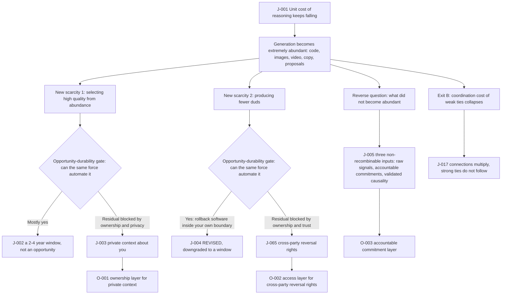

# C1 · What Becomes Unbuyable After Generation Becomes Free

[中文版](../../zh/chains/10-generation-becomes-free.md)

> **Where this chain sits**: This is the starting point for the entire analysis. Every more distant judgment has to step forward from here.
> **In one sentence**: When the cost of “making something” approaches zero, value migrates wholesale to “before it is made” and “after it is made”—to **who you are, what you want, and whether you dare to take responsibility for the result**.

> **Boundary note**: every judgment this chain cites — J-001, J-002, J-003, J-004 (status `REVISED`), J-005, J-017, J-035, J-065, J-072 — **does not pass Gate 1 (scale)** and is an occupational / organizational / institutional judgment. Each card’s audience ceiling is defined by its own “audience scale” and “diffusion-gate review” fields, so no step of this chain may be restated as a claim about “all society,” “generally,” or “the norm.” See [Historical retrospective · Gate 1](../01-retrospect.md#7-running-these-gates-on-what-we-ourselves-have-written) for the criterion and the [ledger review log](../90-ledger.md#8-review-log) for card-level evidence. This note covers the whole file once: the identical “Scope tag · Gate 1” block that was repeated in every section before 2026-10-09 has been consolidated here, with no change to any judgment or conclusion — each card’s audience magnitude and gate reasoning have always lived only in its ledger card, and both this note and the former per-section tags are signposts to it.

---

## I. A Glimpse of an Afternoon in 2029

A thirty-person company has neither a design department nor a frontend team. The head of marketing wants to redesign the product. She speaks to the system for forty seconds, and twelve minutes later receives **sixty** complete, launch-ready proposals—copy, images, motion, analytics instrumentation, and A/B traffic splits, all included.

She stares at the screen and spends two full afternoons deciding nothing.

Not because the proposals are poor. At least twenty of the sixty are better than anything her company has ever made. The problem is that **she cannot say which one she wants**. She knows “what our company’s sensibility is,” but that sentence has never been written down. It is scattered across thousands of decisions over the past seven years, across conversations with the founder, and across the few times she rejected a proposal with the words, “This doesn’t feel like us.”

The system can generate everything—except **her**.

On the third day she does something: she digs out every proposal rejected over the past seven years and writes down, one by one, “why it was rejected at the time.” The document ultimately becomes the company’s most valuable asset—because it alone can reduce sixty options to three.

What this chain argues is that **the scenario above is not a joke—but neither is it "an inevitable result for the whole of society." It is an occupational scenario that can be derived from the cost structure.** Whoever performs this activity must satisfy three conditions at once—producing candidates in bulk as part of the job, holding the decision personally, and doing so at least weekly—which puts the global figure at **million-scale, weekly**. It therefore does not pass Gate 1 of the [diffusion gates](../01-retrospect.md#7-running-these-gates-on-what-we-ourselves-have-written), and is recorded as [J-072](../ledger/71-80.md#j-072--choosing-one-from-dozens-of-generated-candidates-is-an-occupational-judgment-not-a-society-level-trend). The reasoning in this chain therefore holds only within that occupational population and may not be restated in the voice of "the whole of society," "generally," or "becomes the norm"; on this same chain, what could actually reach society scale is not "choosing" but "making." And it asks what unbuyable things this will create.

---

## II. The Skeleton of the Chain

> **How to read this diagram**: boxes are reasoning steps, diamonds are the opportunity-durability gate, and arrows are the dependency order the prose argues; the diagram projects only the load-bearing steps and does not replace the prose — the evidence for each step sits in the sections below and in the ledger cards.

**Lenses used in this chain** (definitions in [Methodology §2](../00-method.md)):

- **L1 Abundance → scarcity**: Used at the outset to locate where value is heading.
- **L2 Constraint migration**: L1 can say what appreciates, but cannot say “an entirely nonexistent thing will emerge”—the chain’s critical step (the bottleneck jumps from production capacity to choice) relies on L2.
- **L6 Irreversibility**: Used to split “which domains are completely rewritten by cheap generation and which barely change.” This dividing line is more useful than industry categories.
- **L8 Human constants**: Used for a reverse check in the sixth loop—if a conclusion requires human nature to change, it is probably wrong.

**Lenses not used**: L3 (cost structure), L4 (diffusion lag), L5 (signals and forgery), L7 (institutional lag), L9 (relational asymmetry). Why: this chain reasons only about *where value migrates*. It does not reason about adoption speed or time windows (L4), organizational boundaries and outsourcing (L3), where screening moves once a credential becomes cheap to forge (L5), or the rent window that opens before institutions arrive and closes after (L7) — those four carry their own weight in [C2](20-real-signals-become-contracts.md), [C3](30-power-land-and-permits.md), and [C10](100-trust-collateralization.md). L9 is absent too: section VII (“connections multiply, strong ties do not follow”) rests on L8’s sub-regularity (cognitive limits on the number of strong ties), and the asymmetric human–AI relationship is carried by [C11](110-authority-before-intelligence.md).

Reverse-looked-up against the [mapping table](../00-method.md#mapping-the-five-starting-points-to-l1l9), this chain’s base is **supply and demand** (L1 verbatim, L2 as an extension) + **human nature** (L8) + **the second half of the technology clause** (L6). It touches neither the historical-regularity nor the social-regularity clause — that is this chain’s own entry-point skew, and a reader may use it to judge the chain out of bounds.

---

## III. First Loop: Why Costs Must Keep Falling

**Observed fact**: The marginal cost of unit intelligence (each effective reasoning instance) is steadily falling, and the decline does not depend on any single breakthrough.

**Reasoning**: Reasoning is **parallelizable deterministic computation**. Historically, every kind of parallelizable deterministic computation—spinning, printing, lithography, bandwidth, storage—has followed a learning curve: every doubling of cumulative output lowers unit cost by a fixed proportion. There is no reason to think tokens are an exception.

More importantly, cost declines have **three mutually independent channels**:

1. **Hardware efficiency**: how many operations can be performed per watt;
2. **Model efficiency**: the number of parameters and amount of computation required for equivalent capability (distillation, sparsity, better training recipes);
3. **Scheduling and reuse**: caching, batching, and routing simple requests to smaller models.

The independence of the three means **none of them has to work miracles**. As long as all three do not stall at once, total cost will keep falling. This is the real reason for the high confidence in this judgment—it is not betting on a technological breakthrough, but on three independent random events not failing simultaneously.

> See [judgment ledger J-001](../ledger/01-10.md#j-001--unit-reasoning-cost-keeps-falling).

---

## IV. Second Loop: So What Becomes Scarce? First, Test a Popular Answer

The most intuitive answer (and the initial assumption when this project began) is: **selecting the genuinely high-quality one from an enormous volume of output becomes scarce.**

That answer is **half right and half a trap**. It must pass the opportunity-durability gate.

### Opportunity-durability gate: Can “selecting high quality” be automated by the same force that makes generation abundant?

**Mostly, yes.** The reason is that in a substantial number of domains, “quality” is **formalizable**:

- Code: whether it compiles, passes tests, or contains security vulnerabilities;
- Mathematics and logic: right or wrong;
- Factual content: whether it can be verified by independent sources;
- Even design: whether contrast meets requirements, loading is fast enough, or click-through rate is higher.

Anything formalizable can be automatically checked by the same force; and generative models can naturally **generate and then self-select** (sample many + score + eliminate). So “helping people pick the objectively higher-quality one” will not remain scarce for long; it will become a built-in model function.

> See [judgment ledger J-002](../ledger/01-10.md#j-002--selecting-objectively-high-quality-from-abundant-output-is-not-a-durable-scarcity-but-merely-a-24-year-window).

### But one residue cannot be absorbed

Models can judge “this is high quality,” but **cannot judge “this is what you want.”**

Because “what you want” is:

- Distributed across thousands of small tradeoffs you have made in the past, and never fully written down;
- Something you cannot clearly explain yourself—you can recognize it, but cannot describe it;
- **Private**, legally yours, with no coercive mechanism that can force you to hand it over.

The only hard constraint here is **ownership / private property**: the critical historical context is lawfully held by a particular person or organization and cannot be copied by compute alone or seized by force. The difficulty of self-expressing human preferences deepens the demand-side information gap, but it is not a sixth hard constraint. No matter how cheap generation becomes, it cannot generate your history.

So what is scarce is not “the ability to select,” but **the input selection requires**: structured, machine-usable preferences and context about you (as an individual or organization).

> See [judgment ledger J-003](../ledger/01-10.md#j-003--the-genuinely-durable-scarcity-is-ownership-of-private-context-about-you-and-its-usable-form).

---

## V. Third Loop: The Second Popular Answer—“Produce Fewer Duds”

Another initial assumption is: **using tokens efficiently, rather than wasting compute on one dud after another, becomes scarce.**

This too must pass the opportunity-durability gate.

**Most of it will be automated.** Dud rates are a function of model capability: the stronger the model, the more likely it is to get it right the first time; meanwhile costs are falling, so the cost of duds is shrinking at the same time. Squeezed from both sides, the room for “saving tokens” as a business is contracting rather than expanding.

**But one residue cannot be absorbed, and it is hard: when outcomes are irreversible, the cost of a dud is not tokens but real-world loss.**

- Generate ten versions of copy and choose one—the cost of duds ≈ 0;
- Generate ten database migration scripts and **run all of them once** before choosing—the company is already gone.

In writing, drawing, and coding drafts, “try a few more times” is free; in actions such as ordering, paying, sending, deploying, signing, and administering medication, **the trial itself is damage**. This exposes the **physical and legal/liability constraints** underneath: irreversibility is a supporting lens for judging risk, not a separate category of hard constraint.

So what is scarce is not “making fewer mistakes”—and it is **not** the software that “turns irreversible things into reversible things” either. I got that step wrong in the first pass, and the opportunity-durability review of 2026-09-19 took it apart. Shadow environments, action sandboxes, and one-click rollback are pure software as long as the action does **not** cross your own ownership boundary (your own database, your own cloud resources, a test sandbox): precisely what the same force that makes generation abundant is best at producing—and the system being operated on is held by the platform itself, which has every incentive to bundle rollback as a default and give it away. That half has payers, but it fails the opportunity-durability gate.

What genuinely cannot be copied is the other half: the **right to reverse across ownership boundaries**. Once an action writes state into **someone else’s** ledger—funds captured, goods released, a right transferred, a contract in force—reversal must be consented to and executed by that party, whose default interest is **finality**, not reversibility; finality is exactly what it sells, and reversal capacity is rationed and separately priced (dispute fees, escrow fees, issuance fees). Compute can copy sandbox code without limit; it cannot copy the counterparty’s obligation to unwind. Historically this kind of cross-party unwind has been built for real only inside a handful of closed networks—card-scheme chargebacks, securities settlement reversal, escrow and letters of credit—and every one of them was ground out of membership rules, collateral, and long-running repeated games, not out of a software schedule. So the hard constraint is not “physical”; it is **ownership / private property** and **trust / relationship**.

(And for actions that are **physically irreversible**—goods consumed, a person harmed, a dose injected—no reversibility product exists at all; the residue is only “who compensates,” which is the territory of the second kind of input in the next section.)

> See [judgment ledger J-065](../ledger/61-70.md#j-065--once-ai-executes-across-ownership-boundaries-the-scarce-item-is-not-rollback-software-but-the-right-to-reverse). The original judgment, [J-004](../ledger/01-10.md#j-004--as-ai-shifts-from-generating-content-to-executing-actions-the-scarce-item-is-infrastructure-that-makes-actions-reversible), is kept in the ledger rather than deleted, with status now `REVISED`—keeping it is what makes it visible how this step was turned back by the project’s own opportunity-durability gate.

---

## VI. Fourth Loop: Pull the Camera Back—What Did Not Become Abundant?

The first two loops ask “what troubles does abundance bring?” A more powerful question is the reverse: **list the things that did not become abundant along with it; they will appreciate as a whole.**

The essence of generation is **recombination of existing patterns**. Therefore, anything that cannot be obtained through recombination will not become abundant:

1. **Irreproducible raw signals**—things happening in the real world that have not yet been recorded. No matter how capable a model is, it cannot generate a new observation; to obtain one, someone or some device must be **on site**. Hard constraint: physical presence.
2. **Accountable commitments**—“If this statement is wrong, who pays?” When content is unlimited, content itself is no longer a filter; **responsibility** becomes the only filter still available. And responsibility can only be borne by an entity that can be sued. Hard constraint: law.
3. **Validated causality**—correlations can be generated without limit; causality can only be obtained through **intervention** (conducting experiments, changing reality, and observing the result). Hard constraint: physics + time.

> See [judgment ledger J-005](../ledger/01-10.md#j-005--after-generation-becomes-abundant-value-concentrates-in-three-kinds-of-non-recombinable-input-raw-signals-accountable-commitments-and-validated-causality).

---

## VII. So What Can Be Done Now?

Three opportunity candidates that fall directly out of this chain (full reasoning in [`../40-opportunities.md`](../40-opportunities.md)):

- **[O-001](../40-opportunities.md#o-001--ownership-layer-for-private-context) Ownership layer for private context**—turn “who we are, what we have rejected, and why we rejected it” into a portable, licensable, and priceable asset. Derived from [J-003](../ledger/01-10.md#j-003--the-genuinely-durable-scarcity-is-ownership-of-private-context-about-you-and-its-usable-form).
- **[O-002](../40-opportunities.md#o-002--the-access-layer-for-cross-party-reversal-rights) The access layer for cross-party reversal rights**—delayed-finality settlement, programmable escrow, and pre-negotiated unilateral rescission windows: acquiring the counterparty’s obligation to unwind, assembling it, and opening it to machine-initiated actions. Derived from [J-065](../ledger/61-70.md#j-065--once-ai-executes-across-ownership-boundaries-the-scarce-item-is-not-rollback-software-but-the-right-to-reverse). (Within-boundary sandboxes and rollback of your own resources were downgraded to a window opportunity on 2026-09-19.)
- **[O-003](../40-opportunities.md#o-003--accountable-commitment-layer) Accountable commitment layer**—an intermediary layer that attaches real compensation liability to AI output. Derived from [J-005](../ledger/01-10.md#j-005--after-generation-becomes-abundant-value-concentrates-in-three-kinds-of-non-recombinable-input-raw-signals-accountable-commitments-and-validated-causality).

One thing explicitly **not** recommended as a structural opportunity:

- ❌ **Generic “AI output quality assurance / selection” tools**—[J-002](../ledger/01-10.md#j-002--selecting-objectively-high-quality-from-abundant-output-is-not-a-durable-scarcity-but-merely-a-24-year-window) judges this to be a 2–4 year window that will be internalized by model vendors. It can capture the window, but do not invest in it as a long-term moat.

### Structural consequence (Exit B): connection will multiply faster than strong relationships

AI will first drive down the **coordination cost of weak ties**: introductions, translation, scheduling, shared context, and compressing an argument into three sentences can all be mediated. A person can therefore keep in touch with more people. But the bottleneck for strong relationships is not sending information; it is shared experience, mutual responsibility, repair after conflict, and finite attention. Lower communication cost expands weak-tie networks without automatically expanding the number of relationships in which a person can remain present over time.

> See [judgment ledger J-017](../ledger/11-20.md#j-017--ai-mediation-expands-weak-tie-coordination-faster-than-strong-relationships).

**Who should change what behavior**: people and organizations should separate coordination from commitment. Delegate compressible context synchronization to AI, but keep decisions with shared consequences, conflict repair, and important rituals as human presence; otherwise organizations will gain more connections while mistaking connection count for trust.

---

## VIII. Where I May Be Wrong (The Strongest Counterarguments)

**Counterargument 1: Preferences may be easier to reproduce than I think.**
[J-003](../ledger/01-10.md#j-003--the-genuinely-durable-scarcity-is-ownership-of-private-context-about-you-and-its-usable-form) rests on “your choices cannot be reconstructed from a small amount of interaction.” If a model can reliably infer individual preferences from very few examples (for example, reaching 80% approval from you after observing two weeks of ordinary use), then “private context” is not an asset but a temporary cache that can be rebuilt in a few weeks, and the entire [O-001](../40-opportunities.md#o-001--ownership-layer-for-private-context) thesis collapses.
**Signal that would make me withdraw it**: A publicly reproducible result showing that a small amount of general interaction is enough to reconstruct preferences with high individual approval.

**Counterargument 2: The reversal right may be given away by its holders, or buyers may not want it at all.**
[J-065](../ledger/61-70.md#j-065--once-ai-executes-across-ownership-boundaries-the-scarce-item-is-not-rollback-software-but-the-right-to-reverse) assumes cross-party reversal rights will be scarce enough to be worth acquiring and reselling. But payment and settlement networks (or regulators) could simply mandate a uniform reversal window for machine actions and give it away, leaving the access layer nothing to do; and a plainer possibility is that buyers do not want reversibility at all—delayed finality ties up capital, and if that cost of capital exceeds the expected loss from accidents, organizations will rationally choose “irreversible plus compensate afterwards,” and demand flows to the commitment layer instead.
**Signal that would make me withdraw it**: By 2033, the major payment and settlement networks have written a reversal window for machine-initiated actions into their default rules and do not price it separately; or high-consequence procurement still shows no separately priced escrow / delayed-finality line item while liability-insurance line items expand over the same period.

**Counterargument 3: The chain as a whole assumes falling costs will not be blocked by non-technical factors.**
If energy, supply chains, or regulation impose a hard ceiling on compute, [J-001](../ledger/01-10.md#j-001--unit-reasoning-cost-keeps-falling) fails, the premise of “extremely abundant generation” itself does not hold, and everything afterward is void. I judge this probability to be low (because the three decline channels are mutually independent), but it is the only mechanism capable of overturning the entire chain in one stroke.
**Signal that would make me withdraw it**: The falsification condition for [J-001](../ledger/01-10.md#j-001--unit-reasoning-cost-keeps-falling) is triggered.

---

## IX. What This Chain Grows Into

- From [J-005](../ledger/01-10.md#j-005--after-generation-becomes-abundant-value-concentrates-in-three-kinds-of-non-recombinable-input-raw-signals-accountable-commitments-and-validated-causality) (raw signals appreciate) → follows the medium-term **shift from free data collection to contractual pricing for data**, see [C2: When Data Is No Longer Free: How Real-World Signals Become Contract Assets](20-real-signals-become-contracts.md).
- From [J-002](../ledger/01-10.md#j-002--selecting-objectively-high-quality-from-abundant-output-is-not-a-durable-scarcity-but-merely-a-24-year-window) + [J-005](../ledger/01-10.md#j-005--after-generation-becomes-abundant-value-concentrates-in-three-kinds-of-non-recombinable-input-raw-signals-accountable-commitments-and-validated-causality) (accountable commitments become the filter) → follows the long-term **collateralization of trust**: when “speaking well” is no longer a capability signal, society returns to older, more expensive credentials—guarantees, collateral, long-term relationships, and identity. That direction has not yet been written as a chain of its own; for now it sits in [section 5 of the far-term landscape](../30-far.md#5-power-and-institutions-more-answers-do-not-mean-dispersed-action-rights) and in [J-035](../ledger/31-40.md#j-035--responsibility-collateral-enters-the-transaction-structure-for-consequential-ai-output), mostly as “scenario only.” It also **holds no chain identifier**: this chain tail once announced it as “C3,” while the file written as C3 is the power-and-permits chain; identifier ownership is recorded in the [chain registry](../../../README.en.md#chain-registry).

> C2 and C3 are both written as testable successor chains: [C2 · When Data Is No Longer Free: How Real-World Signals Become Contract Assets](20-real-signals-become-contracts.md) continues along the raw-signal line, while [C3 · Electrons on the Ground: The Bottleneck Moves from Chips to Grids, Land, and Permits](30-power-land-and-permits.md) takes apart the premise this chain has quietly assumed throughout—that compute can be had as long as you are willing to pay for it. Every chain's identifier, topic, and status is listed in the [chain registry](../../../README.en.md#chain-registry).
