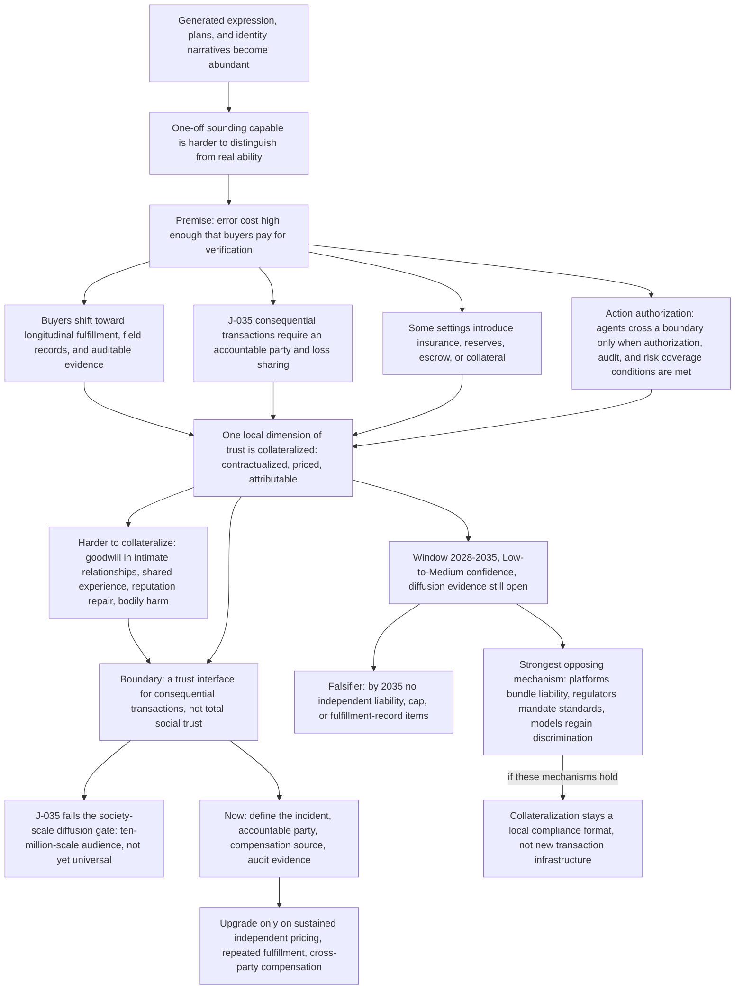

# C10 · Collateralization of trust: when expression no longer proves ability, who bears the outcome?

[中文版](../../zh/chains/100-trust-collateralization.md)

> **Where this chain sits**: It continues from C1's “generated expression becomes cheap” and C2's “real-world signals enter contracts.” It does not upgrade J-035's occupational/organizational judgment into a society-wide inevitability.
> **In one sentence**: As language, plans, and identity narratives become cheap to generate, consequential transactions may rely more on verifiable fulfillment, solvency, and pre-agreed loss sharing; this may collateralize part of trust, but responsibility collateral has not yet formed universally.

> **Boundary note**: every judgment this chain cites — J-035 — **does not pass Gate 1 (scale)** and is an occupational / organizational / institutional judgment. Each card’s audience ceiling is defined by its own “audience scale” and “diffusion-gate review” fields, so no step of this chain may be restated as a claim about “all society,” “generally,” or “the norm.” See [Historical retrospective · Gate 1](../01-retrospect.md#7-running-these-gates-on-what-we-ourselves-have-written) for the criterion and the [ledger review log](../90-ledger.md#8-review-log) for card-level evidence.

---

## I. The night before a consequential procurement decision

An organization is preparing to connect an AI system to a real workflow. The vendor's demonstration is impeccable: the explanations are clear, the case studies plentiful, the answers immediate, and it can even generate a risk report that looks more complete than one produced by a human team.

The buyer's final questions are slower and less flattering: If the report is wrong, who pays? Has this company repeatedly delivered in comparable settings? After an incident, which reserve, insurance policy, or authorized entity will actually absorb the loss?

This does not mean every person and every transaction enters an age of collateral. It may begin in high-liability, priceable organizational transactions that require repeated fulfillment. Casual conversation, low-risk content, and one-off personal expression should not be made to speak for this chain.

**The evidence boundary comes first**: J-035 is currently a Medium-confidence occupational/organizational judgment. Its diffusion-gate review places the audience at roughly ten-million-scale buyers, insurers, and professionals around consequential output, and it fails the society-scale diffusion gate. The current card explicitly says that universal “responsibility collateral” is unproven. This chain discusses a testable extension mechanism; the existence of the chain is not evidence that J-035 has been validated.

---

## II. The skeleton of the chain

> **How to read this diagram**: boxes are reasoning steps and arrows are the dependency order the prose argues; the diagram projects only the load-bearing steps and does not replace the prose — the evidence for each step sits in the sections below and in the ledger cards.

**Lens declaration for this chain** (codes defined in [Methodology §2 · Toolbox of lenses](../00-method.md#2-toolbox-of-lenses); reverse lookup to the five starting points in the [mapping table](../00-method.md#mapping-the-five-starting-points-to-l1l9)):

- **L5 Signals and forgery**: the core step — once the cost of a one-off performance that merely *sounds* competent collapses, screening moves to guarantees, collateral, long relationships, and attributable identity.
- **L2 Constraint migration** (written above as “C1's constraint migration”): the bottleneck jumps from “can you convince me?” to “who pays if this is wrong, and which reserve actually absorbs it?”
- **L6 Irreversibility**: in high-consequence transactions the cost of an error is real-world loss and legal liability, not rewriting a report.
- **L8 Human nature and demand**: its “paying for certainty” and “attribution of responsibility” elements — the buyer purchases recourse, not a better demo.

**Lenses in use that this page previously failed to record** (reclassified 2026-10-10 after an independent attack): this page used to list L1, L3, L4, L7 and L9 together as unused. Four of them are refuted by this page's own text, so that denial is withdrawn — L1, L3 and L7 are in use, and L4 is reclassified as partly used. **L1 (abundance → scarcity)**: the old wording "L1 enters only as an input from [C1](10-generation-becomes-free.md); no second flip is run inside the chain" does not hold — the four-step inversion of [Methodology §3](../00-method.md#3-the-opportunity-durability-gate-and-three-exits-not-every-scarcity-is-a-business-opportunity-and-business-opportunities-are-not-the-only-things-that-count) is run in full in this chain's body: (1) what becomes abundant — the skeleton's first node, "Generated expression, plans, and identity narratives become abundant"; (2) what becomes scarce — the one-sentence summary at the top, "consequential transactions may rely more on verifiable fulfillment, solvency, and pre-agreed loss sharing", which is L1: "After something becomes cheaper and more plentiful, something complementary that did not become abundant at the same rate may rise in value"; (3) can it become abundant again — section V's strongest opposing mechanism, "Platforms may bundle liability and provide it for free" and "stronger models may restore enough discriminating power to one-off expression"; (4) classification — section VI's "would justify upgrading an opportunity from a mechanism window to a structural candidate". The abundance and scarcity in the first two steps do share their source with C1's J-005, but steps 3 and 4 are re-run here on this chain's own material, so "no second flip is run inside the chain" cannot be true alongside this page's text. What survives is only the half-sentence that this chain does not treat "abundance → scarcity" as a universal explanation — the core step it names for itself is still L5. **L3 (cost structure)**: the old wording "it does not rearrange procuring organizations’ boundaries" denies only one face of L3. L3: "Organizational boundaries are shaped by coordination costs and transaction costs", and the definition names "how products are bundled" as a use. All four branches of the skeleton, B1–B4, start from one premise node — "Premise: error cost high enough that buyers pay for verification", which section III states as the buyer paying "for lower attribution costs"; verification and attribution costs are transaction costs, and this is the premise node of the whole chain. Section IV's "allow agents to cross a boundary only when authorization, audit, and risk coverage conditions are met" makes whether an agent may cross a boundary a function of those verification and risk-coverage conditions (in the skeleton, B4 hangs directly under that premise). Section V's strongest opposing mechanism, "Platforms may bundle liability and provide it for free", its against-consensus line, "The disagreement is whether a separately priced, cross-setting responsibility-collateral layer emerges", and section VI's "pilot combinations of fulfillment records, field-intervention evidence, and compensation arrangements as auditable contract appendices" all reason about how products are bundled. The literal face of the old wording — whether the procuring organizations' own company size and employment relationships are rearranged — is indeed not reasoned about here, and that much is kept. **L4 (diffusion lag)**: the old wording "it writes no adoption time window for collateralization (L4 — a gap registered here)" contradicts section V's own "a provisional observation window of **2028–2035**" (the skeleton's WIN node likewise reads "Window 2028-2035"). The accurate statement is that this chain **does write a time window** — exactly what L4: "Use this to turn a directional judgment into a time window" describes — but the window is **not derived from L4's four cycles**. L4: "Depreciation cycles, regulatory cycles, procurement cycles, and skill-formation cycles determine the speed of adoption"; section V says only that this is "a medium-to-far-term mechanism judgment extending from J-035", whose lens field reads "L2 (constraint migration) + L7 (institutional-rent window)" and whose time window is 2028–2033, and nowhere does this chain's body use those four cycles to compute 2028 or 2035. L4 is therefore reclassified as partly used, and the gap registration is narrowed to this: the window is not derived from the four cycles. **L7 (institutional lag)**: section V's strongest opposing mechanism, "regulators may mandate uniform compensation and audit standards, leaving no rent for an independent “trust collateral” product", is an instance of L7: "once institutions settle, the rents may disappear"; and the lens field of this chain's only judgment anchor, J-035, itself reads "L7 (institutional-rent window)". The old delegation "when insurance and compensation institutions land (L7) is carried by [C11](110-authority-before-intelligence.md)" is withdrawn as well: checked against C11's current body, insurance appears there only in section 1's question "who has insurance, assets, or a duty to appeal", the reverse boundary in section 2.3, the pending Gate 5 item in card J-098, the leading indicator "liability attribution and insurance exclusions after agent incidents", the strongest opposing mechanism, and the insurance-pricing data that section 6 defers to the next round — nowhere does it infer when insurance and compensation institutions land. So the face of L7 this chain uses is the closing of the rent; the question of when institutions land is not written here, nor carried by C11 — it is a blank no chain carries, not a delegated step.

**Lenses not used**: L9 (relational asymmetry). Why (rewritten 2026-10-10 after the attack; the old wording "explicitly out of scope" was an announcement a reader could not check): the step in this chain that looks most like L9 is section IV's passage beginning "Harder to collateralize in the same way are goodwill in intimate relationships" together with "Collateral can make some transactions more enforceable; it cannot automatically create forgiveness, loyalty, or meaning". It does touch relationships, but L9 starts from an object of continuous interaction — L9: "People build a relationship model of any object with which they interact continuously" — and requires naming which element of the pair is asymmetric, then deriving from it "norms, dependencies, and forms of harm that did not previously exist"; section IV only draws the outer edge of collateralization — these relationships **cannot** be collateralized — without naming any asymmetry or deriving any new relational form. The parties to the transactions in this chain (buyer and vendor, insured and insurer) are accountable legal entities, and the agent in the skeleton's B4 is an authorized executor, not a relational object. Nor does this chain claim that collateral replaces relational trust. Reverse-looked-up against the [mapping table](../00-method.md#mapping-the-five-starting-points-to-l1l9), the reclassified base is **social regularity** (L5, almost an expansion of the clause) + **supply and demand** (L1; L2 as an extension; L3 as an extension with no source sentence in the clauses) + **historical regularity** (L4 partly used, L7) + **the second half of the technology clause** (L6) + **human nature** (L8, which per the mapping table also carries the demand-side half of the supply-and-demand clause). The old sentence "with no historical-regularity clause — which means this chain carries no historical-case calibration at all, and its confidence ceiling therefore stops at medium" loses its premise (L4 and L7 both look up to historical regularity), so that reasoning, derived from the lens map, is withdrawn. But the base touching the history clause and the body being calibrated on historical cases are two different things: checked against the body, this chain names no historical case — section V has only the one phrase "the mechanism has institutional precedents", without saying which precedent, and no precedent is used to compute the observation window or the confidence; L7 carries only the mechanism of the strongest opposing argument here, not a case calibration. The confidence ceiling therefore still stops at medium (this chain reports "Low-to-Medium"), with the reason restated as: the body cites no historical case — no longer derived from the lens map.

---

## III. First loop: abundant expression weakens one-off proof

When the same model can generate professional language, complete case studies, and risk explanations for different parties, expression remains useful but becomes less discriminating. The buyer must ask not only whether the words are fluent, but whether they come from real experience, can be delivered repeatedly, and are backed by an enforceable arrangement when they fail.

This does not require human preferences to change or AI to replace every decision. It requires only that, in a consequential transaction, the cost of error is high enough for the buyer to pay for lower attribution costs. The observable intermediate products are not “society suddenly stops trusting language,” but more contract fields, audit requirements, insurance clauses, and verifiable fulfillment histories.

The relationship to J-035 is **mechanism continuation, not evidence upgrade**: J-035 already retains the reason that consequential output must leave its loss with a party able to bear it, while its 2028–2033 window and universality remain unclosed by external evidence.

---

## IV. Second loop: what can be collateralized, and what cannot?

“Collateralization of trust” does not turn human trust into one universal deposit. More precisely, the parts of trust that can be contractualized, priced, and assigned responsibility may acquire external forms such as collateral, insurance, or reserves.

Potentially externalizable elements include:

- **Outcome liability**: pay compensation for defined errors or specify a contractual cap;
- **Fulfillment consistency**: use longitudinal records, repeat business, defaults, and field evidence to measure delivery;
- **Action authorization**: allow agents to cross a boundary only when authorization, audit, and risk coverage conditions are met;
- **Loss-absorption capacity**: use insurance, reserves, escrow, and collateral to turn “who absorbs the accident” from a verbal promise into an institutional arrangement.

Harder to collateralize in the same way are goodwill in intimate relationships, open-ended political commitments, shared experience, reputation repair, and bodily harm that money cannot restore. Collateral can make some transactions more enforceable; it cannot automatically create forgiveness, loyalty, or meaning.

The central boundary is therefore: **collateralization may expand the trust interface for consequential transactions, not the total amount of trust in society.**

---

## V. Time window, falsifier, and leading indicators

This is a medium-to-far-term mechanism judgment extending from J-035, with a provisional observation window of **2028–2035** and **Low-to-Medium confidence**: the mechanism has institutional precedents, but cross-industry diffusion and society-scale evidence remain open.

- **Falsifier**: By 2035, procurement and renewal of high-value AI services still rely mainly on one-off demonstrations and no-liability promises, with no observable independent items for liability insurance, compensation caps, audits, or verifiable fulfillment histories; or these items become common without changing selection or pricing in consequential transactions.
- **Leading indicators**: AI liability premiums and exclusions; compensation caps, reserves, escrow, or collateral in contracts; the share of procurement requiring field evidence and fulfillment history; accountability and renewal changes after agent incidents. Observe semiannually or annually, with matched non-AI service comparisons.
- **Strongest opposing mechanism**: Platforms may bundle liability and provide it for free; regulators may mandate uniform compensation and audit standards, leaving no rent for an independent “trust collateral” product; stronger models may restore enough discriminating power to one-off expression. If these mechanisms hold, collateralization remains a local compliance format rather than new transaction infrastructure.
- **Against consensus**: The direction agrees with the view that high-liability AI needs governance, auditing, and insurance arrangements. The disagreement is whether a separately priced, cross-setting responsibility-collateral layer emerges. This chain does not turn directional agreement into evidence for its window or diffusion scale.

---

## VI. What can be done now?

For high-liability AI buyers: do not ask only about model accuracy and demonstrations. Define the incident, accountable party, source of compensation, audit evidence, exit mechanism, and losses that cannot be shifted.

For providers and insurers: pilot combinations of fulfillment records, field-intervention evidence, and compensation arrangements as auditable contract appendices, but validate them within bounded industries and liability scopes. Do not package them as a universal social-credit layer.

For researchers: collect real contracts, insurance pricing, procurement clauses, and post-incident attribution, rather than inferring that trust has been collateralized from launch counts or model leaderboards.

These are risk-governance and measurement suggestions, not validation of J-035 and not automatically a business opportunity. Only sustained evidence of independent pricing, repeated fulfillment, and cross-party compensation would justify upgrading an opportunity from a mechanism window to a structural candidate.

---

## VII. Where this chain connects

- It returns to [C1: What becomes unbuyable after generation becomes free](10-generation-becomes-free.md)'s three non-recombinable inputs: accountable commitments, real signals, and validated causality;
- It continues [C2: When data is no longer free: how real-world signals become contract assets](20-real-signals-become-contracts.md), moving from “who owns the signal?” to “who bears the loss when it is wrong?”;
- It connects with [C4: Embodied intelligence](40-embodied-intelligence.md) and [C5: Biology and medicine](50-biology-medicine.md): the more irreversible bodily and clinical risks are, the less evidence and liability arrangements can be replaced by generated text;
- Its current judgment anchor is [J-035](../ledger/31-40.md#j-035--responsibility-collateral-enters-the-transaction-structure-for-consequential-ai-output). Continue reviewing that card's status, falsifier, and historical migration rather than treating this chain as a second ledger.

> **Chain status**: Written as a bilingual reader entry; this only means that readable prose exists. It does not mean J-035 is validated or that “collateralization of trust” has become a universal social trend.
