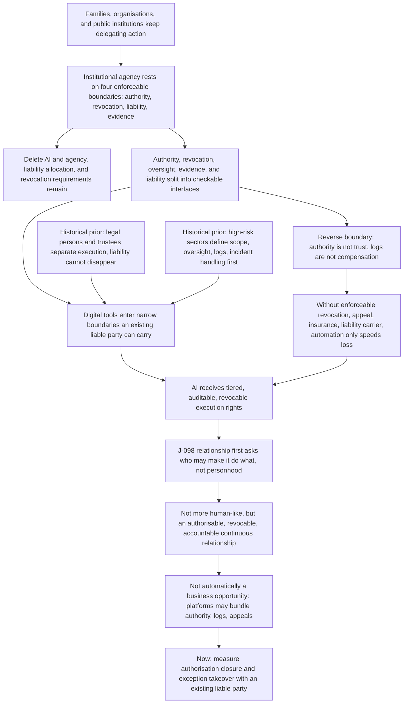

# C11: Authority before intelligence: agency, liability, and the human–AI relationship

[中文版](../../zh/chains/110-authority-before-intelligence.md)

> **Where this chain starts**: This is not a chain that begins with “models get more capable, so people hand decisions to AI.” It starts with agency, legal persons, guardianship, medical proxies, and contractual liability—institutions that already exist—then asks whether a new tool can fit inside their boundaries.
>
> **One-sentence thesis**: The human–AI relationship will first be shaped by who may authorise an action, who can revoke it, and who bears an irreversible consequence. AI can expand the scope of delegated execution without automatically becoming a legal person or bearing liability in its own right.

> **Boundary note**: every judgment this chain cites — J-009, J-031, J-055, J-065, J-070, J-098 — **does not pass Gate 1 (scale)** and is an occupational / organizational / institutional judgment. Each card’s audience ceiling is defined by its own “audience scale” and “diffusion-gate review” fields, so no step of this chain may be restated as a claim about “all society,” “generally,” or “the norm.” See [Historical retrospective · Gate 1](../01-retrospect.md#7-running-these-gates-on-what-we-ourselves-have-written) for the criterion and the [ledger review log](../90-ledger.md#8-review-log) for card-level evidence.

## 1. Take “agency” out of AI first

Before AI, societies already used agents, companies, guardians, medical proxies, and trustees to put one person’s intent into another person’s action. Institutional agency persists not because an agent “resembles” the principal, but because four boundaries can be written and enforced:

1. **Authority boundary**: who may the agent represent, and for what class of matter?
2. **Revocation boundary**: can the principal or superior stop the authority before action completes?
3. **Liability boundary**: who absorbs the loss, and who has insurance, assets, or a duty to appeal?
4. **Evidence boundary**: can a later reviewer identify who decided, on what basis, and whether the boundary was crossed?

These questions remain if AI is deleted. AI changes execution speed, replication, and interface; it does not create the agency relationship itself.

**Lens declaration for this chain** (codes defined in [Methodology §2 · Toolbox of lenses](../00-method.md#2-toolbox-of-lenses); reverse lookup to the five starting points in the [mapping table](../00-method.md#mapping-the-five-starting-points-to-l1l9)):

This chain’s opening variable, **institutionalised agency** (agents, legal persons, guardianship, medical authorisation, fiduciary relationships), is none of L1–L9. The [mapping table](../00-method.md#mapping-the-five-starting-points-to-l1l9) in [Methodology §2](../00-method.md#2-toolbox-of-lenses) already registers this vacancy in its social-regularity row: “who decides, and multi-party coordination” — which this project does use — has **no source sentence** in §1’s five clauses, where only one mechanism, signal screening, made it into L5. This chain therefore does not let a lens vouch for authority boundaries; it calibrates them against two sets of historical precedent (corporate/fiduciary relationships, and high-risk industries). Four steps are lens-carried:

- **L7 Institutional lag**: technology first, institutions later — digital tools enter narrow boundaries an existing liable party can absorb, and permission tables, logs, and appeal routes turn from compliance appendices into the production system itself.
- **L6 Irreversibility**: revocation, appeal, and compensation are hard conditions precisely because an automated error costs real-world loss rather than one more generation.
- **L9 Relational asymmetry**: in a human–AI authorisation relationship one side can be copied, paused, and rolled back while the other cannot — the third of L9’s four asymmetries.
- **L8 Human nature and demand**: its “attribution of responsibility” and “real relationships” elements, used to check that authorisation is not trust and a log is not compensation.

**Lenses in use that this page previously failed to record** (reclassified 2026-10-10 after an independent attack): this page used to list L1, L2, L3, L4 and L5 together as unused. Three of them are refuted by this page's own text, so that denial is withdrawn. **L3 (cost structure)**: this chain's only card, J-098 (section 10 below; its `Source` field is sections 2–3 of this chain), declares "organisational coordination (**L3**)" verbatim in its lens field, and sections 3 and 11 — "software can make permissions, logs, and appeals clearer" and "platforms may bundle liability, insurance, and audit and provide them for free" — are exactly the "how products are bundled" criterion L3's definition names. **L1 (abundance → scarcity)**: section 4 is titled "Scarcity reversal", and its claim that "even if companionship and expression become abundant, a continuous relationship that can be authorised, revoked, and held accountable remains constrained by law, organisation, and bodily presence" is L1's mechanism itself (something becomes abundant; the complement that did not keep pace appreciates). The same card declares L1 — and because L2 was also listed as unused, this step previously had **no declared lens carrying it at all**. **L4 (diffusion lag)**: the old wording "the adoption speed and time window of authorisation institutions are not written here" contradicts section 10's own "**Time window**: 2027–2035" and "observed quarterly or annually". The accurate statement is that this chain **does write a time window but does not derive it from L4's four cycles**, so L4 is reclassified as partly used and the gap registration is kept in that narrower form.

**Lenses not used**: L2 (constraint migration), L5 (signals and forgery). Why: this chain deliberately refuses to start from "models get more capable", so it runs no moving bottleneck (L2); the shift in screening after credentials become forgeable (L5) is carried by [C2](20-real-signals-become-contracts.md) and [C10](100-trust-collateralization.md), and nothing in this chain's body takes a collapse in forgery cost as a premise. Reverse-looked-up against the mapping table, the reclassified carried base is **supply and demand** (L1 partly used; L3 as an extension with no source sentence in the clauses) + **historical regularity** (L7) + **the second half of the technology clause** (L6) + **human nature** (L8, L9 — where L8, per the mapping table, also carries the demand-side half of the supply-and-demand clause); supply and demand was missing from this list before and is now restored. Its opening point still sits in the social-regularity clause's vacancy — and L9 states of itself that "the form of the relationship diverges from every historical precedent," so it can be vouched for only by the human-nature clause and never calibrated by historical regularity. That is a natural ceiling on this chain's confidence.

## 2. Historical priors: institutions carry delegation before tools receive authority

### 2.1 Legal persons and trustees: execution can be separated, liability cannot disappear

Companies and trustees have long separated “an organisation can execute” from “a party must answer for the result.” That makes complex coordination possible while leaving signature authority, conflicts of interest, duties of care, and recourse. The more steps a tool can replace, the more it must sit inside an existing liability position rather than leave liability in the phrase “the system suggested it.”

### 2.2 High-risk sectors: define supervision and evidence before widening delegation

Aviation, medicine, and finance did not begin by declaring an automated system an autonomous legal subject and then searching for liability. They generally define operating scope, human oversight, logs, and incident handling first. Existing AI-governance material likewise treats human oversight, records, and accountability as institutional questions (EXT-10, EXT-14, EXT-15). These sources support the reality of institutional boundaries, not one regulatory endpoint or a specific timetable.

### 2.3 Reverse boundary: authority is not trust, and logs are not compensation

An authorisation can show who permitted what without proving that the agent can do it. A log can reconstruct an action without automatically compensating its victim. If an agency relationship has no enforceable revocation, appeal, insurance, or liability carrier, more automated execution only increases the speed of loss.

## 3. Reasoning chain: institutional agency → computable permissions → AI enters bounded relationships

> **How to read this diagram**: boxes are reasoning steps and arrows are the dependency order the prose argues; the diagram projects only the load-bearing steps and does not replace the prose — the evidence for each step sits in the sections below and in the ledger cards.

The key question is not whether AI is clever enough, but whether the delegation closes the loop. A model can generate an opinion, but that opinion becomes social action only when a party authorises data access and execution, receives appeals, and absorbs losses. If AI is deleted, agency institutions, liability allocation, and revocation requirements remain; AI is therefore not the sole external driver of this social chain.

### Judgment card: J-098

- **Judgment**: From 2027–2035, human–AI relationships in consequential settings are more likely to stabilise first as tiered agency attached to the liability of a person, organisation, or public institution. Authorisation, revocation, logs, and appeals become visible interfaces before AI is broadly recognised as an independent liable subject.
- **Audience scale**: Direct actors are a million-scale-or-smaller population of high-liability professionals, compliance and safety staff, service providers, and public institutions; affected customers, workers, and residents are a tens-of-millions impact reach. It raises existing professionals' ceiling and organisations' execution capacity; it does not give people without liability standing broad access to irreversible decision rights.
- **Diffusion-gate review**: Gate 1 fails: authority and liability are low-frequency organisational/occupational actions with no society-scale weekly actor denominator; Gate 2 partly passes: AI can replace records, matching, and execution steps but not authority or liability; Gate 3 passes inside existing organisations and remains unlocked for unsupported personal relationships; Gate 4 partly passes: law and contracts can close local loops, while cross-party revocation and appeals remain non-uniform; Gate 5 remains unverified because cross-industry series for incidents, insurance, training, and audit burden are missing. This is therefore an institutional/occupational judgment, not a society-scale forecast of AI personhood.
- **What can be done now**: Make authority scope, revocation, overreach alerts, action logs, human takeover, appeals, and loss allocation first-class product or procurement fields. Measure them in one narrow workflow with an existing liable party rather than starting from an “AI employee” or “AI friend” personhood narrative.
- **Lens**: Agency institutions (**carried by no lens in L1–L9**; it belongs to the clause vacancy registered in the social-regularity row of the mapping table — who decides, and multi-party coordination, have no source sentence), legal liability (**L6**), organisational coordination (**L3**), power and relationship boundaries (**L7**, **L9**) (codes in [Methodology §2](../00-method.md#2-toolbox-of-lenses); gaps in the [mapping table](../00-method.md#mapping-the-five-starting-points-to-l1l9)).
- **Reasoning chain**: Society needs durable delegation → institutions split authority, revocation, oversight, evidence, and liability → existing liable parties carry digital agents first → AI expands execution inside controlled boundaries → the human–AI relationship first becomes a rights-and-liability relationship.
- **Time window**: 2027–2035.
- **Falsifier**: By 2033, in at least three consequential institutional settings, large numbers of continuously used AI agents operate outside the liability of a person, organisation, or public institution without traceable authority, revocation, logs, appeals, and compensation arrangements; or these interfaces become widespread without changing procurement, incident handling, or practical limits on agent authority. One-off demonstrations, no-liability chat, and pilots do not falsify the judgment.
- **Leading indicator**: Share of consequential-AI contracts with authority, revocation, and overreach clauses; sustained deployments with human takeover and appeal paths; liability attribution and insurance exclusions after agent incidents; cross-party revocation completion time; observe quarterly or annually.
- **Confidence**: Medium
- **depends-on**: J-009, J-031, J-055, J-065, J-070.
- **Strongest opposing mechanism**: Platforms may bundle liability, insurance, and audit for free, preventing a durable market for independent authorisation infrastructure; or some regimes may allow low-risk agents to acquire de facto autonomy first and force legal recognition later.
- **Against consensus**: **Partly consistent**: existing governance frameworks commonly emphasise human oversight, logs, and accountability. **Boundary**: these materials do not prove that tiered agency will diffuse in the same order across industries, or that AI can never receive a limited legal status. **Why retain**: the carrier for agency predates the tool, and liability and revocation are institutional interfaces that fluent language cannot replace.
- **External comparison source**: EXT-10, EXT-14, EXT-15.
- **Source**: Sections 2–3 of this chain.
- **Next review**: 2027-06-30.
- **Status**: ACTIVE

## 4. Scarcity reversal: not “more human-like,” but a revocable liability relationship

Human–AI discussion is easily pulled toward expression: does it feel like a friend, colleague, or expert? This chain asks about observable social actions instead: who grants authority, who takes over during an exception, who can obtain evidence, and who provides compensation. Even if companionship and expression become abundant, a **continuous relationship that can be authorised, revoked, and held accountable** remains constrained by law, organisations, and physical presence.

That is not automatically a business opportunity. Software can clarify authority, logs, and appeals, and platforms may bundle them for free. What must be tested is who pays, who keeps using the system, and who accepts the incident. **What can be done now**: measure authorisation closure and exception takeover in consequential settings; do not write “make AI more human-like” as a society-scale need.

## 5. The picture to carry away

In 2031, a public-service organisation may let an AI agent read selected records, draft a proposal, and schedule the next step, while forbidding it to widen its own authority. Residents can inspect the record, revoke access, and find the party that bears the consequence. Another organisation may market the same model as an “autonomous employee”; if it cannot answer who pays, who takes over, and how to appeal, it has not truly entered an institutional relationship.

> **Landscape only**: This scene connects the judgment; it is not a second formal card and does not claim that legal systems will change in sync.

## 6. Evidence boundary and next review

Current material supports that authority, oversight, logs, and liability are real institutional questions, and that cross-party action creates friction around revocation and loss allocation. It does not support a timetable for AI personhood, global deployment scale, or business-model returns. The next round should add agency-incident data across legal systems, successful revocation rates, insurance pricing, and sustained-use data.

A gap is not a falsification. When a condition cannot be computed, record `INDETERMINATE` under the ledger rules rather than turning institutional silence into a forecast hit.
