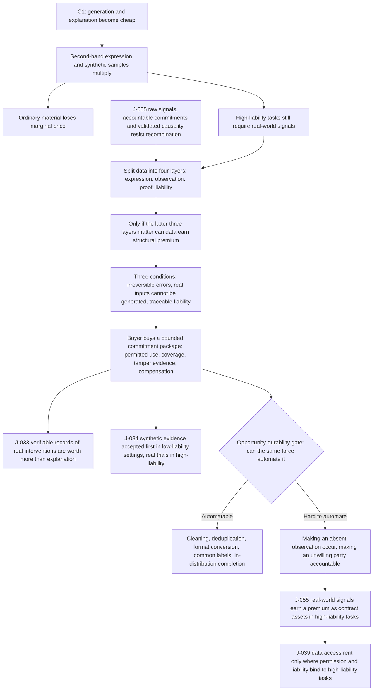

# C2 · When Data Is No Longer Free: How Real-World Signals Become Contract Assets

[中文版](../../zh/chains/20-real-signals-become-contracts.md)

> **How this follows [C1](10-generation-becomes-free.md)**: C1 argues that generation becomes abundant while irreproducible raw signals, accountable commitments, and validated causality do not become copyable in parallel. This chain follows only the first branch: when explanation becomes cheap, ownership of real-world signals, permission to use them, and responsibility for their accuracy become part of the transaction.
> **In one sentence**: Data will not become expensive as a whole; but in high-liability settings, unarranged real-world observations will move from casually collected feedstock to contract assets carrying provenance, permitted use, responsibility, and update duties.

> **Boundary note**: every judgment this chain cites — J-005, J-033, J-034, J-039, J-055 — **does not pass Gate 1 (scale)** and is an occupational / organizational / institutional judgment. Each card’s audience ceiling is defined by its own “audience scale” and “diffusion-gate review” fields, so no step of this chain may be restated as a claim about “all society,” “generally,” or “the norm.” See [Historical retrospective · Gate 1](../01-retrospect.md#7-running-these-gates-on-what-we-ourselves-have-written) for the criterion and the [ledger review log](../90-ledger.md#8-review-log) for card-level evidence. This note covers the whole file once: the identical “Scope tag · Gate 1” block that was repeated in every section before 2026-10-09 has been consolidated here, with no change to any judgment or conclusion — each card’s audience magnitude and gate reasoning have always lived only in its ledger card, and both this note and the former per-section tags are signposts to it.

## I. A procurement negotiation in 2030

An industrial-maintenance company wants to train an agent. Models and generated code are cheap. The hard part is the last mile: Which machine produced a sensor record? Was the equipment calibrated? Was anything removed or altered? If the model orders a shutdown and an accident follows, who is responsible?

The seller no longer quotes only “how many gigabytes.” The proposal has four lines: field collection, sensor calibration, permitted use, and compensation for error. The buyer is not merely buying files. It is buying a traceable piece of reality and an accountable party if that piece proves unreliable.

This is not a replay of “data is the new oil.” Oil can be stored and resold. The value of one observation often lies in **the fact that it happened, where it happened, who can prove it, and who will stand behind its error**. As synthetic explanations multiply, the traded object shifts from the data file to its provenance and liability chain.

## II. The chain

> **How to read this diagram**: boxes are reasoning steps, diamonds are the opportunity-durability gate, and arrows are the dependency order the prose argues; the diagram projects only the load-bearing steps and does not replace the prose — the evidence for each step sits in the sections below and in the ledger cards.

**Lens declaration for this chain** (codes defined in [Methodology §2 · Toolbox of lenses](../00-method.md#2-toolbox-of-lenses); reverse lookup to the five starting points in the [mapping table](../00-method.md#mapping-the-five-starting-points-to-l1l9)):

- **L1 Abundance → scarcity**: once explanation gets cheap, un-copied real-world observation appreciates relative to it.
- **L2 Constraint migration**: the bottleneck jumps from “is there data?” to “can provenance, permission, and liability be proven?”
- **L5 Signals and forgery**: synthetic samples collapse the cost of forging something that *looks like* a real record, so screening moves to calibration logs, timestamps, and a party that can be pursued.
- **L6 Irreversibility**: in high-liability settings the cost of an error is real-world loss, not one more generation.

**Lenses not used**: L3 (cost structure), L4 (diffusion lag), L7 (institutional lag), L8 (human nature and demand), L9 (relational asymmetry). Why: this chain reasons only about the step from “a data file” to “a constrained bundle of commitments.” It writes no adoption speed or time window (L4), does not rearrange either side’s organizational boundary (L3), and touches neither demand-side human anchors nor relational asymmetry (L8 / L9). L7 is grazed only where section 8 cites J-039’s “data access rent”; this chain never makes institutional lag a reasoning step of its own — that is carried by [C3](30-power-land-and-permits.md). Reverse-looked-up against the [mapping table](../00-method.md#mapping-the-five-starting-points-to-l1l9), the base here is **supply and demand** (L1, L2) + **social regularity** (L5) + **the second half of the technology clause** (L6), with no historical-regularity or human-nature clause.

It does **not** claim that all data appreciates, or that “someone needs data” automatically constitutes an opportunity.

## III. First step: split “data” into layers

C1’s [J-005](../ledger/01-10.md#j-005--after-generation-becomes-abundant-value-concentrates-in-three-kinds-of-non-recombinable-input-raw-signals-accountable-commitments-and-validated-causality) does not say that total data volume becomes scarce. It identifies three inputs that recombination cannot easily supply: raw signals, accountable commitments, and validated causality. In data transactions, at least four layers must be separated:

1. **Expression layer**: summaries, labels, reports, and forecasts. These become easier to generate, so ordinary use cases face price pressure.
2. **Observation layer**: what actually happened at a time, place, device, or body. It requires presence, sensors, or an experiment.
3. **Proof layer**: whether collection can be verified, with timestamps, calibration, versions, and access logs.
4. **Liability layer**: who must notify, correct, recollect, or compensate when the data is wrong.

Only when the latter three layers matter to the task can data earn structural premium. Provenance for ordinary marketing copy does not automatically become a valuable asset; an observation that determines a shutdown or treatment path can push error cost into the contract.

## IV. Second step: why high-liability settings contract first

High-liability settings share three conditions:

- **Errors are not easily reversible**: missing a failure or misusing a sample cannot be repaired by writing a better explanation afterward;
- **Real inputs cannot be generated from nothing**: simulation can fill known distributions but cannot guarantee coverage of unobserved anomalies;
- **Liability must be traceable**: regulators, insurers, and counterparties need to know who supplied what, and what was guaranteed within which boundary.

The buyer therefore purchases not “more data,” but a bounded commitment package: permitted uses, covered time and place, tamper evidence, notification duties, recollection duties, and compensation if it fails.

This extends [J-033](../ledger/31-40.md#j-033--verifiable-records-of-real-interventions-become-more-valuable-than-explanation-itself) and [J-034](../ledger/31-40.md#j-034--synthetic-evidence-is-accepted-first-in-low-liability-contexts-high-liability-contexts-still-require-real-trials): verifiable records of real interventions may be worth more than explanations, while synthetic evidence may be accepted first in low-liability settings and real trials retained in high-liability settings.

## V. Third step: pass the opportunity-durability gate

Can the same force that makes the new scarcity abundant eliminate it? **Partly, but not completely.**

- Automatable: cleaning, deduplication, format conversion, common labels, in-distribution completion, and cross-checking existing records.
- Hard to automate: making an absent observation genuinely occur; making an unwilling party legally accountable; giving an unperformed intervention a real outcome.

High-fidelity simulation will steadily expand the substitutable range, and regulators may accept more synthetic evidence. This chain therefore does not claim that real-world data is “always scarce.” It makes the narrower claim that in tasks where error is costly, out-of-distribution risk matters, and liability must land somewhere, **provenance and liability chains** are more likely than file volume to earn a premium.

## VI. What can be done now

- **Organizations should change procurement**: buy not “how many rows,” but which part of reality, proven to what degree, and with what liability allocation.
- **Data providers should record boundaries**: collection conditions, calibration, missingness, permitted uses, and withdrawal mechanisms should not be afterthoughts.
- **Founders can test a narrow entry point**: a combined provenance, permission, calibration, and liability layer for high-liability industries—not another general-purpose data lake.

This is not automatically a durable business. An independent value layer exists only if buyers keep paying for provenance, liability, and update duties, and if platform defaults or synthetic simulation do not absorb those requirements completely.

## VII. Where I may be wrong

**Counterargument 1: a world model becomes good enough to replace observation.** If synthetic evidence is accepted by regulators, insurers, and buyers across multiple high-liability fields, with no worse incident rate than real data, the provenance premium disappears. Watch synthetic-evidence share in high-liability approvals, insurance-rate differences, and real-trial budgets.

**Counterargument 2: platforms absorb liability and hide the contract.** If large platforms use unified compensation and internal audit to absorb all errors, buyers stop paying separately for data provenance, calibration, and provider identity. Contractualization may then remain an internal platform function rather than an independent market.

**Counterargument 3: data ownership or privacy rules reduce usable data without creating a tradable asset.** Constraint is not bargaining power. If licensing only adds friction without a verifiable liability premium, this chain should be downgraded to an industry-specific compliance-cost landscape.

## VIII. What this chain grows into

- It extends C1’s [J-005](../ledger/01-10.md#j-005--after-generation-becomes-abundant-value-concentrates-in-three-kinds-of-non-recombinable-input-raw-signals-accountable-commitments-and-validated-causality) and makes it more specific as judgment [J-055](../ledger/51-60.md#j-055--real-world-signals-earn-a-premium-as-contract-assets-in-high-liability-tasks).
- It gives [J-039](../ledger/31-40.md#j-039--rented-models-become-abundant-while-energy-data-and-channel-control-create-access-rents)’s “data access rent” a narrower test: not all data collects rent; real-world signals can do so only when permission and liability bind them to high-liability tasks.
- If [J-055](../ledger/51-60.md#j-055--real-world-signals-earn-a-premium-as-contract-assets-in-high-liability-tasks) is supported, the next chain should study who gains bargaining power over cross-organizational real-world signals. If it is falsified, data contractualization should be downgraded from structural judgment to sector-specific compliance cost.
- This chain shares one premise with C1: that compute can be bought if you are willing to pay. C1 does interrogate it, but only as one of its strongest counterarguments (counterargument 3: a hard ceiling on compute from energy, supply chains, or regulation voids the whole chain), without developing it; what develops it into a chain of its own is [C3 · Electrons on the Ground: The Bottleneck Moves from Chips to Grids, Land, and Permits](30-power-land-and-permits.md) — and if delivery dates are set by interconnection queues rather than by price, then the “update duty” and “continued supply” clauses in this chain carry an extra layer of delivery risk, one the seller understands no better than the buyer does.

> **Current status**: This is a testable mid-term reasoning chain, not a conclusion about all data markets. The full judgment card is [J-055](../ledger/51-60.md#j-055--real-world-signals-earn-a-premium-as-contract-assets-in-high-liability-tasks). Every written chain, and every direction announced but not yet written, is listed in the [chain registry](../../../README.en.md#chain-registry).
