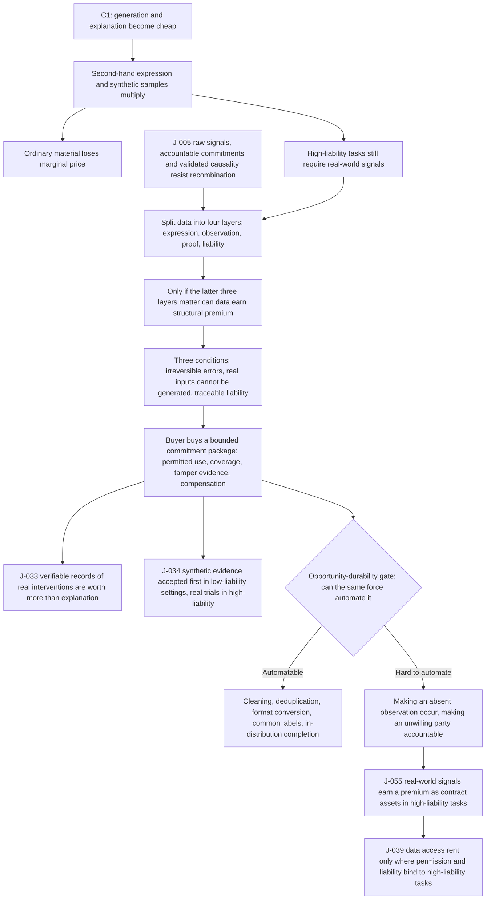

# C2 · When Data Is No Longer Free: How Real-World Signals Become Contract Assets

[中文版](../../zh/chains/20-real-signals-become-contracts.md)

> **How this follows [C1](10-generation-becomes-free.md)**: C1 argues that generation becomes abundant while irreproducible raw signals, accountable commitments, and validated causality do not become copyable in parallel. This chain follows only the first branch: when explanation becomes cheap, ownership of real-world signals, permission to use them, and responsibility for their accuracy become part of the transaction.
> **In one sentence**: Data will not become expensive as a whole; but in high-liability settings, unarranged real-world observations will move from casually collected feedstock to contract assets carrying provenance, permitted use, responsibility, and update duties.

> **Boundary note**: every judgment this chain cites — J-005, J-033, J-034, J-039, J-055 — **does not pass Gate 1 (scale)** and is an occupational / organizational / institutional judgment. Each card’s audience ceiling is defined by its own “audience scale” and “diffusion-gate review” fields, so no step of this chain may be restated as a claim about “all society,” “generally,” or “the norm.” See [Historical retrospective · Gate 1](../01-retrospect.md#7-running-these-gates-on-what-we-ourselves-have-written) for the criterion and the [ledger review log](../90-ledger.md#8-review-log) for card-level evidence. This note covers the whole file once: the identical “Scope tag · Gate 1” block that was repeated in every section before 2026-10-09 has been consolidated here, with no change to any judgment or conclusion — each card’s audience magnitude and gate reasoning have always lived only in its ledger card, and both this note and the former per-section tags are signposts to it.

## I. A procurement negotiation in 2030

An industrial-maintenance company wants to train an agent. Models and generated code are cheap. The hard part is the last mile: Which machine produced a sensor record? Was the equipment calibrated? Was anything removed or altered? If the model orders a shutdown and an accident follows, who is responsible?

The seller no longer quotes only “how many gigabytes.” The proposal has four lines: field collection, sensor calibration, permitted use, and compensation for error. The buyer is not merely buying files. It is buying a traceable piece of reality and an accountable party if that piece proves unreliable.

This is not a replay of “data is the new oil.” Oil can be stored and resold. The value of one observation often lies in **the fact that it happened, where it happened, who can prove it, and who will stand behind its error**. As synthetic explanations multiply, the traded object shifts from the data file to its provenance and liability chain.

## II. The chain

> **How to read this diagram**: boxes are reasoning steps, diamonds are the opportunity-durability gate, and arrows are the dependency order the prose argues; the diagram projects only the load-bearing steps and does not replace the prose — the evidence for each step sits in the sections below and in the ledger cards.

**Lens declaration for this chain** (codes defined in [Methodology §2 · Toolbox of lenses](../00-method.md#2-toolbox-of-lenses); reverse lookup to the five starting points in the [mapping table](../00-method.md#mapping-the-five-starting-points-to-l1l9)):

- **L1 Abundance → scarcity**: once explanation gets cheap, un-copied real-world observation appreciates relative to it.
- **L2 Constraint migration**: the bottleneck jumps from “is there data?” to “can provenance, permission, and liability be proven?”
- **L5 Signals and forgery**: synthetic samples collapse the cost of forging something that *looks like* a real record, so screening moves to calibration logs, timestamps, and a party that can be pursued.
- **L6 Irreversibility**: in high-liability settings the cost of an error is real-world loss, not one more generation.
- **L7 Institutional lag** (partly used; added 2026-10-10): enters only through two load-bearing steps in the diagram — J-034’s synthetic evidence approved in order of liability (technology first, institutions later), and J-039’s “data access rent”; this chain does not reason about when that rent opens or closes.
- **L8 Human nature and demand** (partly used; added 2026-10-10): only its “accountability” and “certainty” demand-side anchors — an independent value layer exists only if buyers keep paying for who stands behind an error, for provenance, and for update duties.

**Lenses in use that this page previously failed to record** (reclassified 2026-10-10 after an independent attack): this page used to list L7 and L8 together with L3, L4, and L9 as unused. L7 and L8 are refuted by **this page's own text**, so that denial is withdrawn and both are reclassified as **partly used**. L7 (institutional lag): the old wording said L7 is grazed only where section 8 cites J-039 and that "this chain never makes institutional lag a reasoning step of its own"; neither holds. The section 2 diagram draws both "J-039 data access rent only where permission and liability bind to high-liability tasks" and "J-034 synthetic evidence accepted first in low-liability settings, real trials in high-liability" as boxes, and the reading note under it says "boxes are reasoning steps" and "the diagram projects only the load-bearing steps"; the lens fields of those two cards are "L1 (abundance-to-scarcity) + L2 (constraint migration) + L7 (institutional-rent window)" and "L2 (constraint migration) + L7 (institutional-rent window)". Both cards have the mid-term landscape, not this chain, as their Source, but this chain uses them as load-bearing steps, so L7 enters with them in section 2, section 4 (which extends J-034), and section 8. The chain body writes no separate derivation that starts from institutional lag; L7 enters entirely through those two cards. Two faces of L7 are used: L7: "Technology comes first; institutions arrive later" (J-034: approval of synthetic evidence lands in order of liability, and high-liability regulators retain real trials), and the rent itself (J-039's data access rent). Its time face is not used, namely L7: "Temporary rents may arise while institutions have not yet settled; once institutions settle, the rents may disappear" — section 8 sets a structural condition on the data rent ("not all data collects rent; real-world signals can do so only when permission and liability bind them to high-liability tasks"), not the time condition that institutions have not yet settled; the rent's disappearance appears only as a boundary, in section 5's "regulators may accept more synthetic evidence" and in counterargument 1, and this page derives from it no date at which the rent opens or closes. L8 (human nature and demand): the old wording "touches neither demand-side human anchors" does not hold. Section 6's "An independent value layer exists only if buyers keep paying for provenance, liability, and update duties, and if platform defaults or synthetic simulation do not absorb those requirements completely" is exactly the demand-side check that L1's own definition requires (L1: "its boundary is that demand structure may also be rewritten, so it must be checked with L8"), and section 1 locates an observation's value in "who will stand behind its error" and has the buyer purchase "an accountable party if that piece proves unreliable." These steps use the "accountability" anchor of L8: "Status, certainty, accountability, real relationships, and the sense of presence are anchors for checking the demand side", and touch "certainty" through provenance and update duties; the status, real-relationship, and presence anchors are not used (the observation layer in section 3 "requires presence" of a sensor or an experiment at the scene, not a demand-side sense of presence), nor is the strong-relationship sub-law. The old delegation "that is carried by [C3](30-power-land-and-permits.md)" is too broad as well: C3's section 13 turns only J-039's "energy access rent" "from a conclusion into a testable mechanism", and C3 is the only other reasoning chain whose body cites J-039 at all. The data-access-rent end has no second carrier and is tested, narrowly, only in this chain's section 8; so L7 at that end cannot be delegated away and is recorded here as partly used by this chain.

**Lenses not used**: L3 (cost structure), L4 (diffusion lag), L9 (relational asymmetry). Why (each rewritten 2026-10-10 after the attack as a reverse attempt; the old wording "writes no adoption speed or time window" and "does not rearrange either side’s organizational boundary" gave only conclusions readers could not check): L3 — the step that looks most like it is section 4 writing what the buyer purchases as "a bounded commitment package" and section 6 proposing "a combined provenance, permission, calibration, and liability layer," which falls squarely under L3's stated use of reasoning about "how products are bundled"; counterargument 2 also imagines platforms absorbing liability as an internal function. But the commitment package is derived from section 4's three high-liability conditions (errors are not easily reversible, real inputs cannot be generated from nothing, liability must be traceable), not from L3: "Organizational boundaries are shaped by coordination costs and transaction costs"; counterargument 2 states only a falsifying case — "large platforms use unified compensation and internal audit to absorb all errors" — without comparing the transaction costs of platform internalization against an independent contract, and this chain does not infer on which side of an organizational boundary the liability layer finally lands. L4 — the step that looks most like it is J-034's "accepted first in low-liability settings" in the diagram, which does give an adoption order; section 1 also sets its scene "in 2030." But J-034's order runs by liability level, not by a speed derived from L4: "Depreciation cycles, regulatory cycles, procurement cycles, and skill-formation cycles determine the speed of adoption" (that card's lens field declares only L2 and L7); "in 2030" is a scene setting, and this page writes no time window for any step — the only window in this chain, 2029–2033, sits on card J-055, whose lens field is L1, L2, L5, L6; and section 6's "change procurement" changes what is bought, not how fast the procurement cycle turns. L9 — the step that looks most like it is the asymmetry in section 1, where the buyer does not know "Which machine produced a sensor record" while the seller does, and section 5's "making an unwilling party legally accountable." But that is an information asymmetry between trading parties about provenance, which this chain screens with calibration logs, timestamps, and compensation terms (the L5 route); L9 presupposes L9: "People build a relationship model of any object with which they interact continuously", and its output is L9: "Each asymmetry will grow a set of norms, dependencies, and forms of harm that did not previously exist". No such relationship model exists between buyer and seller, and this chain lands on contract terms, not on a relational form. Reverse-looked-up against the [mapping table](../00-method.md#mapping-the-five-starting-points-to-l1l9), the reclassified base is **supply and demand** (L1; L2 as an extension with no source sentence in the clauses) + **social regularity** (L5) + **the second half of the technology clause** (L6) + **the latter half of historical regularity** (L7, partly used, entering only through J-034 and J-039) + **part of human nature** (L8's "accountability" and "certainty" anchors) — so the old clause "with no historical-regularity or human-nature clause" is withdrawn as well.

It does **not** claim that all data appreciates, or that “someone needs data” automatically constitutes an opportunity.

## III. First step: split “data” into layers

C1’s [J-005](../ledger/01-10.md#j-005--after-generation-becomes-abundant-value-concentrates-in-three-kinds-of-non-recombinable-input-raw-signals-accountable-commitments-and-validated-causality) does not say that total data volume becomes scarce. It identifies three inputs that recombination cannot easily supply: raw signals, accountable commitments, and validated causality. In data transactions, at least four layers must be separated:

1. **Expression layer**: summaries, labels, reports, and forecasts. These become easier to generate, so ordinary use cases face price pressure.
2. **Observation layer**: what actually happened at a time, place, device, or body. It requires presence, sensors, or an experiment.
3. **Proof layer**: whether collection can be verified, with timestamps, calibration, versions, and access logs.
4. **Liability layer**: who must notify, correct, recollect, or compensate when the data is wrong.

Only when the latter three layers matter to the task can data earn structural premium. Provenance for ordinary marketing copy does not automatically become a valuable asset; an observation that determines a shutdown or treatment path can push error cost into the contract.

## IV. Second step: why high-liability settings contract first

High-liability settings share three conditions:

- **Errors are not easily reversible**: missing a failure or misusing a sample cannot be repaired by writing a better explanation afterward;
- **Real inputs cannot be generated from nothing**: simulation can fill known distributions but cannot guarantee coverage of unobserved anomalies;
- **Liability must be traceable**: regulators, insurers, and counterparties need to know who supplied what, and what was guaranteed within which boundary.

The buyer therefore purchases not “more data,” but a bounded commitment package: permitted uses, covered time and place, tamper evidence, notification duties, recollection duties, and compensation if it fails.

This extends [J-033](../ledger/31-40.md#j-033--verifiable-records-of-real-interventions-become-more-valuable-than-explanation-itself) and [J-034](../ledger/31-40.md#j-034--synthetic-evidence-is-accepted-first-in-low-liability-contexts-high-liability-contexts-still-require-real-trials): verifiable records of real interventions may be worth more than explanations, while synthetic evidence may be accepted first in low-liability settings and real trials retained in high-liability settings.

## V. Third step: pass the opportunity-durability gate

Can the same force that makes the new scarcity abundant eliminate it? **Partly, but not completely.**

- Automatable: cleaning, deduplication, format conversion, common labels, in-distribution completion, and cross-checking existing records.
- Hard to automate: making an absent observation genuinely occur; making an unwilling party legally accountable; giving an unperformed intervention a real outcome.

High-fidelity simulation will steadily expand the substitutable range, and regulators may accept more synthetic evidence. This chain therefore does not claim that real-world data is “always scarce.” It makes the narrower claim that in tasks where error is costly, out-of-distribution risk matters, and liability must land somewhere, **provenance and liability chains** are more likely than file volume to earn a premium.

## VI. What can be done now

- **Organizations should change procurement**: buy not “how many rows,” but which part of reality, proven to what degree, and with what liability allocation.
- **Data providers should record boundaries**: collection conditions, calibration, missingness, permitted uses, and withdrawal mechanisms should not be afterthoughts.
- **Founders can test a narrow entry point**: a combined provenance, permission, calibration, and liability layer for high-liability industries—not another general-purpose data lake.

This is not automatically a durable business. An independent value layer exists only if buyers keep paying for provenance, liability, and update duties, and if platform defaults or synthetic simulation do not absorb those requirements completely.

## VII. Where I may be wrong

**Counterargument 1: a world model becomes good enough to replace observation.** If synthetic evidence is accepted by regulators, insurers, and buyers across multiple high-liability fields, with no worse incident rate than real data, the provenance premium disappears. Watch synthetic-evidence share in high-liability approvals, insurance-rate differences, and real-trial budgets.

**Counterargument 2: platforms absorb liability and hide the contract.** If large platforms use unified compensation and internal audit to absorb all errors, buyers stop paying separately for data provenance, calibration, and provider identity. Contractualization may then remain an internal platform function rather than an independent market.

**Counterargument 3: data ownership or privacy rules reduce usable data without creating a tradable asset.** Constraint is not bargaining power. If licensing only adds friction without a verifiable liability premium, this chain should be downgraded to an industry-specific compliance-cost landscape.

## VIII. What this chain grows into

- It extends C1’s [J-005](../ledger/01-10.md#j-005--after-generation-becomes-abundant-value-concentrates-in-three-kinds-of-non-recombinable-input-raw-signals-accountable-commitments-and-validated-causality) and makes it more specific as judgment [J-055](../ledger/51-60.md#j-055--real-world-signals-earn-a-premium-as-contract-assets-in-high-liability-tasks).
- It gives [J-039](../ledger/31-40.md#j-039--rented-models-become-abundant-while-energy-data-and-channel-control-create-access-rents)’s “data access rent” a narrower test: not all data collects rent; real-world signals can do so only when permission and liability bind them to high-liability tasks.
- If [J-055](../ledger/51-60.md#j-055--real-world-signals-earn-a-premium-as-contract-assets-in-high-liability-tasks) is supported, the next chain should study who gains bargaining power over cross-organizational real-world signals. If it is falsified, data contractualization should be downgraded from structural judgment to sector-specific compliance cost.
- This chain shares one premise with C1: that compute can be bought if you are willing to pay. C1 does interrogate it, but only as one of its strongest counterarguments (counterargument 3: a hard ceiling on compute from energy, supply chains, or regulation voids the whole chain), without developing it; what develops it into a chain of its own is [C3 · Electrons on the Ground: The Bottleneck Moves from Chips to Grids, Land, and Permits](30-power-land-and-permits.md) — and if delivery dates are set by interconnection queues rather than by price, then the “update duty” and “continued supply” clauses in this chain carry an extra layer of delivery risk, one the seller understands no better than the buyer does.

> **Current status**: This is a testable mid-term reasoning chain, not a conclusion about all data markets. The full judgment card is [J-055](../ledger/51-60.md#j-055--real-world-signals-earn-a-premium-as-contract-assets-in-high-liability-tasks). Every written chain, and every direction announced but not yet written, is listed in the [chain registry](../../../README.en.md#chain-registry).
