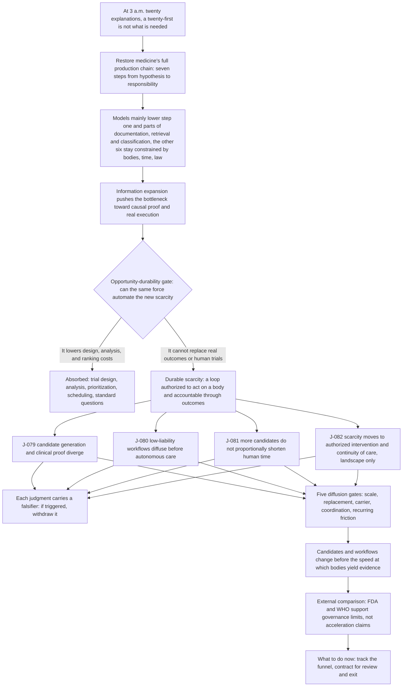

# C5 · Biology and Medicine: Answers Get Cheap Before Proof and Care Do

[中文版](../../zh/chains/50-biology-medicine.md)

> **In one sentence**: AI will first make “what might this be, and what could we try?” nearly limitless; medicine will still be short of evidence, authorization, and care capacity that can responsibly turn a candidate into an intervention on a particular body.

> **Boundary note**: every judgment this chain cites — J-079–J-082 — **does not pass Gate 1 (scale)** and is an occupational / organizational / institutional judgment. Each card’s audience ceiling is defined by its own “audience scale” and “diffusion-gate review” fields, so no step of this chain may be restated as a claim about “all society,” “generally,” or “the norm.” See [Historical retrospective · Gate 1](../01-retrospect.md#7-running-these-gates-on-what-we-ourselves-have-written) for the criterion and the [ledger review log](../90-ledger.md#8-review-log) for card-level evidence.

## 1. At 3 a.m., the screen offers twenty explanations

The emergency physician does not need a twenty-first explanation. She needs to know which explanation changes this person's treatment; who can detect, stop, and bear the consequence of an error; and whether a bed, test, drug, and nurse are actually available.

This is not a denial of AI capability. It restores medicine's full production chain: **generate hypotheses → measure bodies → validate prospectively → obtain authorization → intervene → observe outcomes → bear responsibility**. Models mainly lower the cost of the first step and parts of documentation, retrieval, and classification. The other six remain constrained by bodies, time, ethics, law, and organizational capacity.

Printing made medical knowledge easier to copy without replacing clinical trials. Imaging made observation finer without automatically assigning diagnostic responsibility. Computational screening enlarged the molecule space without settling human toxicity or long-term efficacy on a screen. The repeated historical pattern is not that information is useless, but that **information expansion pushes the bottleneck toward causal proof and real execution**.

**Lens declaration for this chain** (codes defined in [Methodology §2 · Toolbox of lenses](../00-method.md#2-toolbox-of-lenses); reverse lookup to the five starting points in the [mapping table](../00-method.md#mapping-the-five-starting-points-to-l1l9)):

- **L1 Abundance → scarcity**: candidate explanations and candidate molecules become abundant, so the complementary prospective validation that does not grow with them appreciates.
- **L2 Constraint migration**: the bottleneck jumps from “we cannot think of a hypothesis” to causal proof, authorization, and real-world execution.
- **L4 Diffusion lag**: low-liability workflows become routine before autonomous diagnosis, governed by procurement, licensing, and training cycles rather than model capability.
- **L6 Irreversibility**: in human trials and clinical action the cost of an error is bodily harm and legal liability, not one more generation.
- **L7 Institutional lag**: practice authorization, accepted endpoints, and compensation rules decide when “can do” becomes “is permitted to do.”
- **L8 Human nature and demand**: only its anchors of “accountability, real relationships, and the sense of presence” — touch and trust in long-term care, and who bears a treatment error, are not absorbed just because explanations become abundant.

**Lenses in use that this page previously failed to record** (reclassified 2026-10-10 after an independent attack): this page used to list L3, L5, L8, and L9 together as unused. The denial of **L8 (human nature and demand)** is refuted by this chain's own text and is withdrawn. The old wording said L8 appears only inside J-080's “Underserved regions” opposing case as demand-side availability and is not made an independent reasoning step (the earlier English rendering, “is never made a reasoning step,” dropped “independent” and so denied more than the Chinese did). But in section 2's opportunity-durability table, the long-term-care row names the new scarcity as “Continuous observation, touch, trust, and exception escalation” and answers the gate question with “it cannot remove the cost of bodies and relationships being present”; the conclusion right after it defines the durable scarcity as “a loop authorized to act on a body and accountable through outcomes,” in which “Physical, legal/liability, and embodied-presence constraints combine” — this is the diagram's “Durable scarcity” node from which all four cards are drawn; and the opening scene lists “who can detect, stop, and bear the consequence of an error” among what the physician actually lacks. These run exactly L8: “accountability, real relationships, and the sense of presence are anchors for checking the demand side” — the gate answers “cannot” because the need for touch, trust, and someone who bears the consequence does not disappear when explanations become abundant. That is a load-bearing cell of the gate table, not an aside inside an opposing case, so it cannot be true alongside the old wording. L8 is used through those three anchors only: the “Status” and “certainty” anchors and the strong-relationship sub-law are not invoked, and the “Physical” and “legal” faces of that conclusion are carried by L6 and L7, not counted under L8. **L3 (cost structure)** (found while checking the attack's verdict) cannot stay a clean “unused” either: J-081's lens field reads “L2 constraint migration + cost structure,” which is L3's own title. Read line by line, though, J-081's reasoning chain (more candidates competing for “wet-lab, participant, site, and regulatory capacity that has not expanded proportionally”) and its “Why retained” line, “candidate computation and human time follow different production functions,” reason about capacity queues, not L3's “Organizational boundaries are shaped by coordination costs and transaction costs” — nothing about company size, employment, outsourcing boundaries, or bundling; and the body step that looks most like L3, section 4's coordination gate (“A local institutional loop has one accountable actor and diffuses first”), rules on diffusion speed, not on where an organization's boundary sits. So L3 is **named on a card but its mechanism is not run** in this chain: this page takes it off the “unused” list without counting it as used, and does not re-hang J-081's queueing argument on L3; the mismatch between the card field and the mechanism is annotated in place in J-081's lens field; the field itself is unchanged.

**Lenses not used**: L5 (signals and forgery), L9 (relational asymmetry). Why (rewritten 2026-10-10 as reverse attempts after the attack): **L5** — the step that looks most like L5 is section 2's sentence “Physical, legal/liability, and embodied-presence constraints combine”: among the harder-to-forge credentials L5 lists are “accountable identities, or embodied presence.” But L5's mechanism is “Once the cost of forging text, images, or credentials collapses, screening will seek guarantees, collateral, long-term relationships, accountable identities, or embodied presence—evidence that is harder to forge,” and this chain never takes that step: presence and liability are scarce here because treatment must act on a real body and someone must bear the outcome, not because a once-effective signal became cheap to forge and screeners turned to them instead. No step of the chain mentions forgery or a shift in screening (the “Computational screening” of section 1 screens molecules, not signals), and section 6's “rather than treating demonstration counts as clinical capacity” says demonstrations stop at step one of the production chain — again not a collapse of forging cost. The two share vocabulary; the mechanism is not run. The old “carried by C2 and C10” is narrowed: those chains carry L5's general mechanism (forgery of data records and of competent-sounding performances), but neither reasons about medical credentials — the only medical sentence in the body of [C2](20-real-signals-become-contracts.md), “an observation that determines a shutdown or treatment path can push error cost into the contract,” is about data premium, and [C10](100-trust-collateralization.md) mentions clinical risk only in its list of connected chains — so where screening moves once medical credentials become cheap to forge is carried by no chain at present. **L9** — L9's definition names “doctors and patients” among the relationships it covers, and the most L9-like step here is the long-term-care row of section 2, where AI supplies explanations, reminders, and remote Q&A continuously and “trust” is listed as new scarcity. But the chain never asks which element of that relationship is asymmetric, nor derives what L9 requires — “Each asymmetry will grow a set of norms, dependencies, and forms of harm that did not previously exist”; the row's conclusion is that AI “can absorb standard Q&A” while the cost of presence remains — where the scarcity sits, not the form of the relationship. The old “The asymmetry of the clinician–patient relationship (L9) is carried by C11” is withdrawn: [C11](110-authority-before-intelligence.md) uses L9 only for the human–AI authorisation relationship (“one side can be copied, paused, and rolled back while the other cannot”) and nowhere reasons about clinician–patient asymmetry, so that asymmetry too is carried by no chain at present. Reverse-looked-up against the [mapping table](../00-method.md#mapping-the-five-starting-points-to-l1l9), the reclassified base is **supply and demand** (L1, L2 as an extension) + **historical regularity** (L4, L7) + **the second half of the technology clause** (L6) + **one item of the human-nature clause** (L8, i.e. the “preference for real presence and accountable responsibility” in the §1 clause) — so the old “with no human-nature or social-regularity clause” is narrowed accordingly: this chain only lacks a social-regularity clause. L5 is unused; L3 is only named on a card and, even if counted, would trace back under the mapping table only to supply and demand, a category already listed (as an extension with no source sentence).

**The skeleton of this chain**:

> **How to read this diagram**: boxes are reasoning steps, diamonds are the opportunity-durability gate, and arrows are the dependency order the prose argues; the diagram projects only the load-bearing steps and does not replace the prose — the evidence for each step sits in the sections below and in the ledger cards.

## 2. Can the same force automate the new scarcity?

| Stage | What AI makes abundant | New scarcity | Can the same force automate it? |
|---|---|---|---|
| Triage and diagnosis | Candidate explanations, image labels, chart summaries | Prospective validation for a particular population and setting | It can lower design and analysis costs; generated output cannot substitute for real outcomes |
| Drug development | Targets, molecules, indications, and trial-design candidates | Wet experiments, human safety, recruitment, and follow-up time | It can prioritize; it cannot copy the same irreversible human trial |
| Clinical treatment | Guideline retrieval, communication drafts, risk prompts | Authorization, liability, beds, equipment, and care time | It can assist scheduling; it cannot grant itself a licence or create embodied presence |
| Long-term care | Explanations, reminders, remote Q&A | Continuous observation, touch, trust, and exception escalation | It can absorb standard Q&A; it cannot remove the cost of bodies and relationships being present |

The durable scarcity here is therefore not “medical answers,” but **a loop authorized to act on a body and accountable through outcomes**. Physical, legal/liability, and embodied-presence constraints combine.

## 3. Four judgments and four ways reality could overturn them

### [J-079](../ledger/71-80.md#j-079--biomedical-candidate-generation-and-clinical-grade-causal-proof-diverge) · Candidate generation and clinical proof diverge

From 2026 to 2034, biomedical candidate generation and ranking are likely to get much cheaper without clinical-grade causal proof accelerating in the same proportion. The reason is not that models “cannot reason,” but that trustworthy causality must still pass through real samples, time, and subject protection. Better biological models, surrogate endpoints, and synthetic controls may compress experimental and clinical stages together. If at least three high-liability categories halve candidate-to-approved-intervention time without more real samples or follow-up, while safety withdrawals do not rise, this judgment should be withdrawn.

### [J-080](../ledger/71-80.md#j-080--low-liability-medical-workflows-diffuse-before-autonomous-care-without-professional-review) · Low-liability workflows diffuse before autonomous care

Summarization, coding, scheduling, and clinician-reviewed decision support are more likely than care without professional review to become routine from 2026 to 2031. The former replaces existing work, fits hospital carriers, and allows local rollback; the latter must additionally cross licensing, liability, and irreversible-treatment boundaries. Underserved regions may nevertheless accept “worse but immediately available” autonomous systems first. If at least two large jurisdictions sustain more encounters without human review than review-based support, without one-off mandated procurement, this judgment fails.

### [J-081](../ledger/81-90.md#j-081--more-drug-candidates-do-not-proportionally-shorten-human-trial-time) · More drug candidates do not proportionally shorten human time

As search expands, more candidates compete for wet-lab, participant, site, and regulatory capacity that has not expanded proportionally. Candidate growth therefore need not translate proportionally into approvals by 2034. Predictive biomarkers, adaptive trials, and digital endpoints are the strongest counter-mechanism: if AI-origin candidates cut both median first-in-human-to-approval time and failure rates by half across three therapeutic areas, the same force will have changed human time too.

### [J-082](../ledger/81-90.md#j-082--once-explanation-is-abundant-medical-scarcity-moves-to-authorized-intervention-and-continuity-of-care-landscape-only) · Once explanation is abundant, scarcity moves to authorized intervention and continuity of care (landscape only)

In chronic disease, ageing, and primary care, standard explanation and reminders are likely to grow faster than authorized intervention, continuous observation, and exception escalation. Without local resources and liability chains, more advice merely creates unmet demand. Remote monitoring, home robotics, and task redesign may make continuity of care scalable; cross-national longitudinal evidence is still inadequate, so this remains a low-confidence landscape only. If several countries raise intervention hours, follow-up completion, and exception-response speed within five years of widespread AI Q&A while staff and institutional capacity cease to cause queues, withdraw this landscape.

The complete audience scale, time window, falsifier, leading indicators, dependencies, confidence, and external comparison for all four judgments are recorded in [ledger cards J-079–J-080](../ledger/71-80.md#j-079--biomedical-candidate-generation-and-clinical-grade-causal-proof-diverge) and [ledger cards J-081–J-082](../ledger/81-90.md#j-081--more-drug-candidates-do-not-proportionally-shorten-human-trial-time).

## 4. Applying the five diffusion gates

1. **Scale**: Patient reach is enormous, but patient counts cannot masquerade as the denominator of professional actions; all four judgments are occupational/organizational.
2. **Replace an existing action**: Summarization, retrieval, and coding readily replace old actions. Generating extra candidates without replacing trial work may increase congestion.
3. **Existing carrier**: Hospital information systems, pharmaceutical R&D, and regulatory processes are ready carriers; continuous home care is more fragmented.
4. **Coordination**: A local institutional loop has one accountable actor and diffuses first. Cross-hospital, payer, regulator, and patient data loops move more slowly.
5. **Recurring friction**: Every review, consent, sample, and follow-up is a recurring cost that a one-off purchase cannot hide.

The conclusion is not “AI will not change medicine.” It is: **it changes candidates and workflows before it changes the speed at which bodies yield evidence.**

## 5. External comparison and evidence boundaries

- **FDA, AI-enabled Medical Devices**: supports that AI medical devices have been authorized through multiple market pathways and that intended use and decision dates are traceable; does not support exhaustive coverage, clinical adoption scale, complete identification of foundation models, or widespread autonomous care. <https://www.fda.gov/medical-devices/software-medical-device-samd/artificial-intelligence-enabled-medical-devices>
- **FDA, Considerations for the Use of Artificial Intelligence To Support Regulatory Decision-Making for Drug and Biological Products**: supports establishing credibility according to Context of Use and risk; does not support a particular acceleration magnitude, success rate, or this chain's windows. <https://www.fda.gov/regulatory-information/search-fda-guidance-documents/considerations-use-artificial-intelligence-support-regulatory-decision-making-drug-and-biological>
- **WHO, Ethics and governance of artificial intelligence for health**: supports autonomy, transparency, accountability, equity, and safety as governance boundaries not automatically erased by model capability; does not support a particular regulatory endpoint or adoption order. <https://www.who.int/publications/i/item/9789240029200>
- **WHO, Health workforce**: supports health-worker supply and distribution as real capacity constraints; does not justify converting a global shortage directly into an AI market or automation share. <https://www.who.int/news-room/fact-sheets/detail/health-workforce>

## 6. What can be done now

- Researchers: publish and track the “candidates → human trials → approvals” funnel rather than treating demonstration counts as clinical capacity.
- Health institutions: put review rights, exception escalation, post-deployment monitoring, and exit mechanisms into procurement contracts, not only model accuracy.
- Builders: prefer tools that enter existing liability chains and remove old work. If a product only adds another advice channel, first prove who handles the added advice.
- Readers: when seeing “AI discovers drugs” or “AI practises medicine,” ask which step of the production chain it has reached, and who bears the next one.
