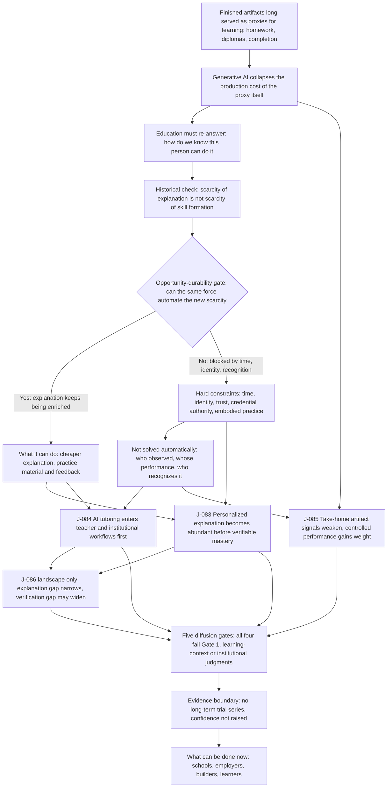

# C6 · Education and Skill Formation: Explanation Overflows; Mastery Must Still Leave a Trace

[中文版](../../zh/chains/60-education-skill-formation.md)

> **In one sentence**: AI will first give everyone an infinitely patient explainer. The scarce things become sustained practice, observed real performance, and credible proof on which someone else is willing to grant an opportunity.

> **Boundary note**: every judgment this chain cites — J-083–J-086 — **does not pass Gate 1 (scale)** and is an occupational / organizational / institutional judgment. Each card’s audience ceiling is defined by its own “audience scale” and “diffusion-gate review” fields, so no step of this chain may be restated as a claim about “all society,” “generally,” or “the norm.” See [Historical retrospective · Gate 1](../01-retrospect.md#7-running-these-gates-on-what-we-ourselves-have-written) for the criterion and the [ledger review log](../90-ledger.md#8-review-log) for card-level evidence.

## 1. A student submits a perfect essay, then cannot answer the next question

The essay on the teacher's desk is well structured and fluent. She asks: “If we reverse this condition, does the conclusion still hold?” The student is silent.

Finished artifacts have long served as proxies for learning: homework for mastery, a diploma for capability, course completion for skill formation. Generative AI does more than make cheating easier. It collapses the production cost of **the proxy itself**. Once a polished artifact can be outsourced, education must return to an older question: how do we know that this person can actually do it?

Printing expanded textbook supply without eliminating schools. Correspondence, broadcast, and MOOCs expanded access to courses without automatically producing completion, practice discipline, or qualifications employers accept. History repeatedly shows that **scarcity of explanation and scarcity of skill formation are different things**. Skill requires feedback over time, motivation, and embodied or social practice. Qualification further requires a trusted institution that can turn observation into opportunity.

**Lens declaration for this chain** (codes defined in [Methodology §2 · Toolbox of lenses](../00-method.md#2-toolbox-of-lenses); reverse lookup to the five starting points in the [mapping table](../00-method.md#mapping-the-five-starting-points-to-l1l9)):

- **L1 Abundance → scarcity**: explanation and finished artefacts become abundant, so the complementary sustained practice and credible observation that do not grow with them appreciate.
- **L2 Constraint migration**: the bottleneck jumps from “no explanation is available” to “practice time, real performance, and who will vouch for it.”
- **L4 Diffusion lag**: a local loop inside existing institutions diffuses before an institution is rebuilt, at the speed of curriculum, assessment, and credentialing cycles.
- **L5 Signals and forgery**: the cost of forging take-home artefacts collapses, so screening moves to more expensive, harder-to-subcontract identity, live performance, and long records — the core step of this chain.
- **L7 Institutional lag**: qualifications and opportunity are granted by schools, employers, and public bodies, and recognition structures move more slowly than tools.
- **L8 Human nature and demand**: motivation, belonging, and norms are the demand-side anchors for checking whether more explanation converts into mastery.

**Lenses in use that this page previously failed to record** (reclassified 2026-10-10 after an independent attack): this page used to list L3, L6, and L9 together as unused. L9 (relational asymmetry) is refuted by this page's own text and reclassified as **partly used**. The one-sentence thesis at the top of this page, "AI will first give everyone an infinitely patient explainer", is an instance of the second of L9's four asymmetries — L9: "one side has infinite patience, never tires"; the "Mentorship and peers" row of the table in section 2 writes the AI side as "Always-available Q&A and role-play", the same asymmetry landing on the teacher–student relationship L9 names. **The face in use**: an explainer that never tires and is always available is written into the chain's starting point as a premise, used alongside L1's abundance of explanation. **The face not used**: L9's key output, "Each asymmetry will grow a set of norms, dependencies, and forms of harm that did not previously exist", is not derived here — none of the lens fields of J-083–J-086 declares L9, and no step of the body derives a new norm, dependency, or form of harm from this asymmetry. Both halves of the old wording "only foreshadowed here and is carried by C11" fail: as a premise it already bears weight in the one-sentence thesis, so it is not a foreshadowing; and apart from this declaration line the body of this chain never points to [C11](110-authority-before-intelligence.md), whose page head takes from L9 only copying, pausing, and rolling back in a human–AI authorisation relationship — "the third of L9’s four asymmetries" — and whose body contains no teacher, student, or patience. The foreshadowing has no landing, so the delegation to C11 is withdrawn: the derivation face is currently developed neither in this chain nor in C11.

**Lenses not used**: L3 (cost structure), L6 (irreversibility). Why (rewritten 2026-10-10 after the attack as reverse attempts: the old wording gave L3 only a bare denial, and for L6 did not name the step in the body that looks most like it): **L3** — the step in this chain that looks most like L3 is J-084, "AI tutoring enters teacher and institutional workflows before replacing schools": it judges that the bundle in "schools already carry identity, curriculum, peers, assessment, and credentials" will not be taken apart by AI tutoring, which resembles the "how products are bundled" criterion L3's definition names. But its derivation is "a local loop is therefore easier to diffuse than a rebuilt institution" — adoption order (that card's lens field reads "L4 diffusion lag + diffusion Gates 3–5"); no step of the chain uses coordination or transaction costs to locate the organizational boundary of a school or employer. The only talk of coordination is Gate 4 in section 4, "Cross-institution credential recognition needs observable authority or shared standards", and [the diffusion gates are not a tenth optional lens](../00-method.md#the-diffusion-gates-are-not-a-tenth-optional-lens). The outsourcing in section 1's "Once a polished artifact can be outsourced" and J-085's "harder-to-outsource identity" is an individual handing the artifact to AI; this chain reasons about it as a collapse in forgery cost (L5), not as L3's outsourcing boundary. **L6** — the step that looks most like L6 is section 2: the main constraint lies not in generation but in the fact that AI "cannot bear practice time for the learner", and the list of hard constraints includes "legal/credential authority", which resembles L6's "the main cost is not generation cost". But L6's threshold is L6: "If one mistake causes physical harm, legal liability, property loss, or irreversible reputational damage", whereas the cost of a learning error is usually revocable and repeatable, and no step in this chain's body rests on a learning error being irreversible — errors are the very material of practice (J-083: "practice still requires attention, time, and behavioural change after feedback"). The "legal/credential authority" there means who has the authority to recognize the result, which this chain hands to L7, not legal liability incurred by one mistake. That is precisely the line between education and [C5](50-biology-medicine.md): C5 declares L6 on the grounds that "in human trials and clinical action the cost of an error is bodily harm and legal liability, not one more generation". Reverse-looked-up against the [mapping table](../00-method.md#mapping-the-five-starting-points-to-l1l9), the reclassified base is **supply and demand** (L1; L2 as an extension; L8 also carries the demand-side half) + **historical regularity** (L4, L7) + **social regularity** (L5) + **human nature** (L8; L9 partly used, which falls here via L8) — of the five starting points, the only clause this chain still does not touch through a lens is technology: its second half is carried only by L6, which is unused here. One qualification: J-083's "Explanation is copyable" is an instance of the clause's first half, "deterministic work that can be parallelized, copied, and digitized is more likely to become cheaper", but the mapping table registers that half as carried by no lens in L1–L9, so this step has no lens behind it.

**The skeleton of this chain**:

> **How to read this diagram**: boxes are reasoning steps, diamonds are the opportunity-durability gate, and arrows are the dependency order the prose argues; the diagram projects only the load-bearing steps and does not replace the prose — the evidence for each step sits in the sections below and in the ledger cards.

## 2. Can the same force automate the new scarcity?

| Stage | What AI makes abundant | New scarcity | Can the same force automate it? |
|---|---|---|---|
| Explanation and practice material | Examples and feedback at any difficulty, language, and style | Learners' sustained effort and correction | It can lower feedback cost; it cannot bear practice time for the learner |
| Homework and portfolios | Complete text, code, images, and presentations | Whether the artifact represents the person's capability | It can generate more detection methods and harder-to-detect proxy artifacts at once |
| Assessment | Questions, draft grading, capability profiles | Trusted identity, controlled conditions, and reviewable observation | It can assist recording; it cannot grant recognition shared by schools, industries, and employers |
| Mentorship and peers | Always-available Q&A and role-play | Motivation, belonging, norms, and situated demonstration | It can partly simulate them; it cannot automatically create groups with durable mutual commitment |

The hard constraint is not that “AI is not smart enough.” It is time, identity, trust, legal/credential authority, and embodied practice. The same force can keep enriching explanations. It does not automatically solve **who observed, whether the performance belonged to the person, and who recognizes the result**.

## 3. Four judgments and four ways reality could overturn them

### [J-083](../ledger/81-90.md#j-083--personalized-explanation-becomes-abundant-before-verifiable-mastery) · Personalized explanation becomes abundant before verifiable mastery

From 2026 to 2030, explanations, examples, and immediate feedback tailored to a learner are likely to become routine without verifiable mastery rising proportionally. Explanation is copyable; practice still requires attention, time, and behavioural change after feedback. High-quality adaptive tutoring may improve pacing and motivation together. If widespread use across countries, ages, and subjects produces proportional gains in controlled transfer and long-term retention after two years without curriculum redesign, withdraw this judgment.

### [J-084](../ledger/81-90.md#j-084--ai-tutoring-enters-teacher-and-institutional-workflows-before-replacing-schools) · AI tutoring enters teacher and institutional workflows before replacing schools

Institutional tutoring can replace Q&A, practice generation, and formative feedback, while schools already carry identity, curriculum, peers, assessment, and credentials. From 2026 to 2031, a local loop is therefore easier to diffuse than a rebuilt institution. School cost, geography, and adult-learning demand are the strongest counter-mechanism. If broadly recognized qualifications from AI pathways outside schools or employers persistently outnumber institution-embedded pathways in at least three large education systems, this judgment fails. Because the object is an institutional arrangement, affected student numbers do not substitute for Gate 1's action denominator; this remains an institutional judgment.

### [J-085](../ledger/81-90.md#j-085--take-home-artifact-signals-weaken-while-controlled-performance-and-process-evidence-gain-weight) · Take-home artifact signals weaken while controlled performance and process evidence gain weight

As artifact-generation costs fall, finished work correlates less with personal capability. Selectors still need differentiation, so costlier but harder-to-outsource identity, live performance, and longitudinal records gain weight from 2027 to 2034. Process records can also be forged, and controlled assessment may amplify anxiety and inequality. If leading universities and large employers keep increasing the independent weight of take-home artifacts without process verification while predictive validity does not decline, this judgment is falsified.

### [J-086](../ledger/81-90.md#j-086--the-explanation-gap-narrows-while-practice-and-verification-gaps-may-widen-landscape-only) · The explanation gap narrows while practice and verification gaps may widen (landscape only)

Cheap explanation first benefits people with devices and self-direction, while mastery still depends on time, feedback, and practice environments, and qualifications still depend on institutional recognition. Without schools, employers, or public institutions as carriers, skill and opportunity gaps may fail to fall or may widen. Low-cost, offline, high-quality tutoring may instead deliver the largest marginal gains to learners with the fewest resources. Long-term evidence remains inadequate, so this is retained only as a low-confidence landscape. If regions adding no teachers, devices, assessment, or social support nevertheless shrink income-group gaps in independent mastery and qualifications for five consecutive years, withdraw this landscape.

The complete audience scale, time window, falsifier, leading indicators, dependencies, confidence, and external comparison for all four judgments are recorded in [ledger cards J-083–J-086](../ledger/81-90.md#j-083--personalized-explanation-becomes-abundant-before-verifiable-mastery).

## 4. Applying the five diffusion gates

1. **Scale**: [J-083](../ledger/81-90.md#j-083--personalized-explanation-becomes-abundant-before-verifiable-mastery) has constructed billion-scale reach and learning can be daily, but no citable statistic establishes a billion distinct people performing the same AI-tutoring action daily. [J-084](../ledger/81-90.md#j-084--ai-tutoring-enters-teacher-and-institutional-workflows-before-replacing-schools), [J-085](../ledger/81-90.md#j-085--take-home-artifact-signals-weaken-while-controlled-performance-and-process-evidence-gain-weight), and [J-086](../ledger/81-90.md#j-086--the-explanation-gap-narrows-while-practice-and-verification-gaps-may-widen-landscape-only) judge school, employer, or public carriers. All four fail Gate 1 and remain learning-context or institutional judgments; [J-086](../ledger/81-90.md#j-086--the-explanation-gap-narrows-while-practice-and-verification-gaps-may-widen-landscape-only) is additionally “landscape only.”
2. **Replace an existing action**: Course-integrated Q&A, practice, and feedback can replace old actions. Opening another independent chat window easily becomes an added burden.
3. **Existing carrier**: Schools, corporate training, libraries, and assessment systems are carriers. A personal tool with no credential exit may collapse when curiosity fades.
4. **Coordination**: One school or employer can form a local closed loop. Cross-institution credential recognition needs observable authority or shared standards.
5. **Recurring friction**: If every use demands login, prompting, verification, or supervision, long-term use falls. Functions that genuinely diffuse disappear into existing workflows.

## 5. External comparison and evidence boundaries

- **UNESCO, Guidance for generative AI in education and research**: supports human-centred design, age appropriateness, privacy, teacher involvement, and pedagogical boundaries; does not support a specific learning effect, teacher replacement, or assessment endpoint. <https://www.unesco.org/en/articles/guidance-generative-ai-education-and-research>
- **OECD, Digital Education Outlook 2023**: supports digital education depending on governance, interoperable ecosystems, and teacher capacity rather than one tool; does not support a specific adoption order for generative AI or permanent school boundaries. <https://www.oecd.org/en/publications/oecd-digital-education-outlook-2023_c74f03de-en.html>
- **World Bank, What is Learning Poverty?**: supports foundational learning deficits as a billion-scale education-system problem; does not attribute the deficit to scarcity of explanation or predict AI's direction of effect on inequality. <https://www.worldbank.org/en/topic/education/brief/what-is-learning-poverty>
- **Evidence gap**: This round found no publicly checkable, cross-country, cross-subject series of replicated long-term randomized trials of generative AI tutoring. Confidence in these four judgments must not be raised from short single-course studies.

## 6. What can be done now

- Schools: place AI inside existing practice-feedback loops while keeping independent performance checkpoints. Do not let “AI enabled” stand in for learning outcomes.
- Employers: rely less on polished artifacts and more on short live tasks, oral follow-ups, work trials, and sourced process records.
- Builders: if a product cannot enter a curriculum, teacher workflow, employer, or credential exit, first prove which high-frequency old action it replaces rather than only that it answers better.
- Learners: after using AI for an explanation, close it and solve under a changed condition. Transfer, not the feeling of understanding, is mastery.
