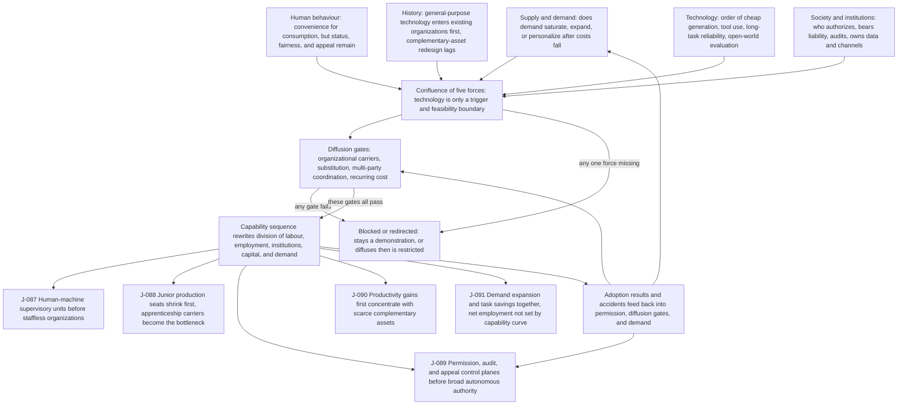

# C7 · Technology Arrives First, Power Later: How Capability Sequence Passes Through Organizations Before Becoming Social Consequence

[中文版](../../zh/chains/70-capability-to-social-consequences.md)

> **One-sentence judgment**: Technical capability does not rewrite society directly. It first lowers the cost of a task, then passes through workflows, liability, authority, and scarce complementary assets. Only when those intermediaries move does capability sequence rewrite the division of labour, employment, institutions, capital, and demand.

> **Boundary note**: every judgment this chain cites — J-087–J-091 — **does not pass Gate 1 (scale)** and is an occupational / organizational / institutional judgment. Each card’s audience ceiling is defined by its own “audience scale” and “diffusion-gate review” fields, so no step of this chain may be restated as a claim about “all society,” “generally,” or “the norm.” See [Historical retrospective · Gate 1](../01-retrospect.md#7-running-these-gates-on-what-we-ourselves-have-written) for the criterion and the [ledger review log](../90-ledger.md#8-review-log) for card-level evidence.

---

## 1. 9 a.m. in 2030: the model can do the work, but the organization still cannot hand it over

An insurer's claims model can already read medical records, check a policy, call databases, and draft a payment decision. In the demonstration, it finishes in ten minutes what took two hours.

In production, three people still sit beside it. One decides which claims may be delegated, one handles exceptions, and one explains who approved what after a dispute. The company does not instantly lose a department. It first grows a new work unit: **the machine takes the first pass; a person defines the boundary and signs for the consequence**.

This is not simply because the technology is “not advanced enough.” Even if the model becomes ten times stronger tomorrow, model parameters alone cannot decide who signed the policy, whose account pays the claim, whom the regulator questions, or whether an error can be reversed.

The [Technology Capability Sequence](../05-tech-sequence.md) answers “what arrives first.” This chain answers the other half: **what capability must pass through before arrival becomes a social consequence.**

---

## 2. Not a single-cause technology chain, but a confluence of five forces

This chain does not use the formula “the model gets stronger, therefore society must do X.” Every step checks all five legitimate starting points listed in [Methodology §1](../00-method.md) at once, and names in the code vocabulary of [Methodology §2](../00-method.md#2-toolbox-of-lenses) which lens carries each:

1. **Supply and demand** (**L1 Abundance → scarcity**; the demand-side half of **L8 Human nature and demand**): after costs fall, does demand saturate, expand, or move toward higher frequency and personalization?
2. **Human behaviour** (**L8 Human nature and demand**): will people exchange convenience for more consumption while retaining demands for status, fairness, and appeal?
3. **History** (**L4 Diffusion lag**, **L3 Cost structure**): general-purpose technologies usually enter existing organizations before competing organizational forms emerge; complementary-asset redesign often lags the core equipment.
4. **Technology** (**no lens in L1–L9 carries this**, see below): in what order do cheap generation, tool use, long-task reliability, and open-world evaluation mature?
5. **Society and institutions** (**L7 Institutional lag**, **L6 Irreversibility**): who may authorize, who bears liability, who can audit, and who owns the data, channels, capital, and customer relationships?

**Lenses not used, and one registered gap**: this chain does not invoke L2 (constraint migration), L5 (signals and forgery), or L9 (relational asymmetry) — the moving bottleneck is carried by [C3](30-power-land-and-permits.md), the shift in screening after credentials become forgeable by [C2](20-real-signals-become-contracts.md) and [C10](100-trust-collateralization.md), and human–AI relational asymmetry by [C11](110-authority-before-intelligence.md). **The fourth force, technology, is carried by no lens in L1–L9**: L6 corresponds only to *which steps fall slowly*, while *which kind of work gets cheap first* is the hardest gap in the technology-regularity row of the [mapping table](../00-method.md#mapping-the-five-starting-points-to-l1l9). This chain therefore never asserts capability arrival in the voice of a lens; it writes it as a **trigger and feasibility boundary** and points back to the [technology sequence](../05-tech-sequence.md). “Multi-party coordination” inside the fifth force likewise has no source sentence (registered in §2); it can only pass through Gate 4 of the diffusion gates and never enters the lens layer.

Technology is therefore a **trigger and a feasibility boundary**, not the sole engine. Organizational carriers, substitution, multi-party coordination, and recurring cost still face the [five diffusion gates extracted in the historical retrospective](../01-retrospect.md).

| Technical gate | Cost reduced first | Social gate that must also open | First consequence if it opens |
|---|---|---|---|
| Cheap generation and structured output | Drafting, classification, comparison | The capability must replace an action inside an existing workflow | Human–machine work units, not “staffless firms” |
| Tool use and persistent context | Cross-system execution and handoff | Identity, permission, logs, reversal, and exception escalation | An authority control plane enters daily operations |
| Long-task reliability | Sustained execution and coordination | Responsibility must be locatable and failure must be interruptible | Management shifts from chasing tasks to setting boundaries |
| Open-world evaluation and embodiment | More informational and physical tasks | Real feedback, sites, energy, licences, bodies, and channels | Returns flow toward scarce complementary assets |

This table states a **conditional order**, not a calendar promise. The five judgments below turn consequences for organizations, labour, institutions, capital, and demand into falsifiable propositions.

---

## 3. First transmission: work units are reorganized before whole firms disappear

As generation and tool use mature first, the easiest pieces to automate are bounded tasks whose outputs can be reviewed. Organizations will not begin by handing an entire occupation to a model. They will first split work into three layers:

- **machine-default execution** for frequent, replayable, low-liability actions;
- **human exception handling** for conflicting goals, missing data, boundary crossings, and anomalies;
- **accountable boundary setting** for tool access, budgets, deadlines, and stop conditions.

The minimum production unit changes from “one person operating one application” to “one accountable person supervising a set of machine executions.” That does not make the one-person company inevitable: customer acquisition, capital, licences, distribution, negotiation, and physical fulfilment do not vanish with the same capability.

Formal judgment: [J-087 · Human–machine supervisory units become mainstream before staffless organizations](../ledger/81-90.md#j-087--humanmachine-supervisory-units-become-mainstream-before-staffless-organizations).

---

## 4. Second transmission: jobs do not disappear cleanly; entry routes narrow first

Junior work often serves two functions at once: producing drafts, organizing information, and moving processes cheaply; and giving entrants the repeated practice through which judgment forms. The first function is especially exposed to early generation and tool-use capability, while no replacement carrier for the second appears automatically.

The first labour-market change may therefore be not total occupational headcount but the **route into the occupation**. The same senior output needs fewer junior production hours, yet future experts still need somewhere to acquire feedback-rich real practice. If firms remove junior seats without rebuilding apprenticeship, simulation, rotation, or supervised fieldwork, succession and professional-judgment supply tighten later.

This is a labour consequence and a power consequence: whoever owns a verifiable practice environment gains control over entry into high-liability work.

Formal judgment: [J-088 · Junior production seats shrink before occupations as a whole; apprenticeship carriers become the new bottleneck](../ledger/81-90.md#j-088--junior-production-seats-shrink-before-occupations-as-a-whole-apprenticeship-carriers-become-the-new-bottleneck).

---

## 5. Third transmission: as execution gets cheaper, authorization and appeal get more expensive

When a model only advises, an organization controls who may see an answer. Once a model can call tools and execute over time, it must control:

- which principal may instruct it;
- which data and assets it may touch;
- its budget, duration, and risk ceiling;
- which anomalies force a human handoff;
- who can pause, audit, reverse, and appeal after a dispute.

Institutional change therefore does not wait for full autonomy. It first appears as a dull control plane: permission tables, action logs, accountable signatures, exception queues, external audits, and appeal channels. As capability approaches execution, these structures move from compliance attachments into the production system itself.

This also shows why technology sequence is not the sole engine. If law imposes no traceable responsibility, buyers bear no cost from accidents, or internal asset ownership is unclear, the same execution capability may remain a demonstration—or diffuse with high losses and then be restricted.

Formal judgment: [J-089 · Permission, audit, and appeal control planes become production infrastructure before broad autonomous authority](../ledger/81-90.md#j-089--permission-audit-and-appeal-control-planes-become-production-infrastructure-before-broad-autonomous-authority).

---

## 6. Fourth transmission: once core capability becomes cheap, returns first flow to complementary assets

As models and calls get cheaper, scarcity rents on the model itself come under pressure. Turning capability into revenue still requires customer relationships, proprietary workflow data, licences, liability-bearing capital, compute and power, distribution, and physical deployment.

During the first adjustment, incumbent asset owners can absorb more of the gain. They already own data, customers, regulatory standing, and channels, and can fund the fixed cost of workflow redesign. Small teams gain a higher technical ceiling, but not automatic bargaining power. Returns may spread only when open standards, portable data, public infrastructure, competition policy, or new channels reduce the complementary-asset barrier.

Formal judgment: [J-090 · Productivity gains first concentrate with scarce complementary-asset owners; competition and institutions decide whether they spread](../ledger/81-90.md#j-090--productivity-gains-first-concentrate-with-scarce-complementary-asset-owners-competition-and-institutions-decide-whether-they-spread).

---

## 7. Fifth transmission: cheapness does not only cut jobs; it creates demand that was previously unaffordable

Translating “fewer people per task” directly into “proportional employment decline” omits demand elasticity. Cheaper, faster, and more personalized services pull previously uneconomic or unaffordable work into the market: more variants, finer customer segments, longer service hours, more local languages, and lower price points.

The more testable near- and mid-term proposition is therefore not how many net jobs AI creates or destroys. It is: **in adoption-intensive industries, labour hours per unit fall while variety and service frequency rise; net employment depends on whether demand expansion exceeds unit labour savings.** In health, care, and construction, where bodies, licences, and sites bind, expansion lands more heavily in non-automated steps. In purely digital and demand-saturated fields, headcount contraction is more likely to arrive first.

Formal judgment: [J-091 · Demand expansion and task savings occur together; net employment cannot be inferred from the capability curve alone](../ledger/91-95.md#j-091--demand-expansion-and-task-savings-occur-together-net-employment-cannot-be-inferred-from-the-capability-curve-alone).

---

## 8. Stack the five cards: one social transmission chain

> **How to read this diagram**: boxes are reasoning steps and arrows are the dependency order the prose argues; the diagram projects only the load-bearing steps and does not replace the prose — the evidence for each step sits in the surrounding sections and in the ledger cards.

The five forces enter from the same starting line, and any one can block or redirect the outcome. Adoption results and accidents feed back into permission, diffusion gates, and demand. Technology opens feasibility; it does not sit upstream of organizations, institutions, supply and demand, or human behaviour.

These are not independent headlines. Together they form a reversible test. If organizations can capture durable autonomous value without redesigning workflows, J-087 fails. If junior entry does not contract relatively, J-088 fails. If autonomous authority expands without audit and appeal entering production, J-089 fails. If returns do not tilt toward complementary assets, J-090 fails. If unit costs fall but variety and frequency do not expand, the demand side of J-091 fails.

---

## 9. Four leaps this chain explicitly refuses

1. **It does not infer unemployment from benchmarks.** Occupations are bundles of tasks, and demand volume can change.
2. **It does not turn “can do” into “will diffuse.”** All five diffusion gates still apply.
3. **It does not turn organizational adoption into social authorization.** A private organization may close an internal loop without proving public authority can delegate the same way.
4. **It does not turn productivity into broad prosperity.** Complementary-asset ownership, competition, and institutions determine distribution.

This chain therefore supplies first-round coverage of the social transmission of technical sequence. It is not technological determinism and not a final forecast of net employment or distribution.

---

## 10. What to observe now

The most informative signals over the next two years are not another model score but five kinds of organizational data:

- the share of work handled by machine default versus human exception takeover;
- whether junior hiring, apprenticeship places, and supervised field hours move together;
- whether AI permission, logging, audit, and appeal enter core operational systems rather than remain policy documents;
- whether adoption gains accrue to model suppliers, owners of data/channels/licences, labour, or consumers;
- whether lower service hours per unit lead to more varieties, frequency, customer segments, and total volume.

These indicators break “AI changes everything” into social claims that can be proved wrong year by year. Full cards, windows, and falsifiers are in the [Judgment Ledger](../90-ledger.md).
