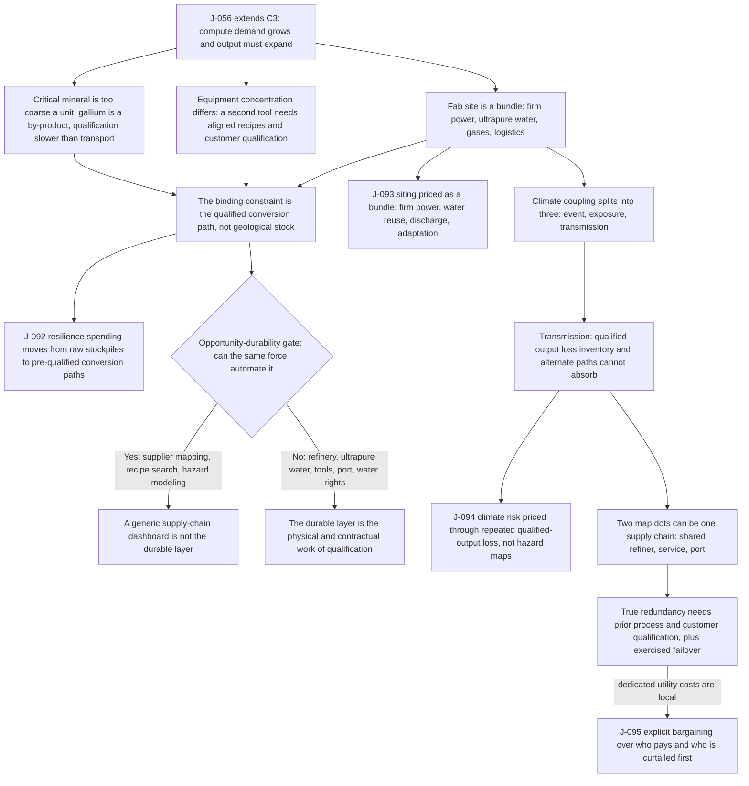

# C8 · The Fab Before the Chip: Why Climate Risk Bites at Qualified Bottlenecks

[中文版](../../zh/chains/80-fab-materials-and-climate.md)

> **This chain extends [C3](30-power-land-and-permits.md).** C3 follows computation downstream to grids, land, and permits. This chain walks one step upstream: before a chip can be shipped, a specific process must receive qualified materials, ultrapure water, stable power, gases, chemicals, tools, spare parts, and logistics at the same place and time.
>
> **In one sentence**: the durable scarcity is not “minerals” in the abstract but **qualified conversion paths that can keep running through local water, power, and climate shocks**. A mine, warehouse, or second building is not redundancy if the replacement material, process, or site has not already passed qualification.

> **Boundary note**: every judgment this chain cites — J-056, J-061, J-092–J-095 — **does not pass Gate 1 (scale)** and is an occupational / organizational / institutional judgment. Each card’s audience ceiling is defined by its own “audience scale” and “diffusion-gate review” fields, so no step of this chain may be restated as a claim about “all society,” “generally,” or “the norm.” See [Historical retrospective · Gate 1](../01-retrospect.md#7-running-these-gates-on-what-we-ourselves-have-written) for the criterion and the [ledger review log](../90-ledger.md#8-review-log) for card-level evidence.

## 1. 2031: three warehouses and no usable substitute

A semiconductor procurement team has done what the risk manual asked. It has six months of a critical input in three warehouses, contracts with two suppliers, and a second fab on another coast.

Then a drought restricts industrial water at the primary cluster. Production slows. The team releases inventory from the other warehouses and discovers that inventory is not the binding constraint: the alternate grade has not passed the exact process qualification, the second supplier depends on the same refining region, and the “second fab” cannot run the same product without months of process transfer and customer approval.

Nothing is physically absent. Ore exists. Chemicals exist. Buildings exist. Yet usable supply does not.

That distinction is the spine of this chain: **a substitute exists economically only after it can enter the qualified process without destroying yield, safety, or customer approval**.

## 2. Skeleton of the chain

> **How to read this diagram**: boxes are reasoning steps, diamonds are the opportunity-durability gate, and arrows are the dependency order the prose argues; the diagram projects only the load-bearing steps and does not replace the prose — the evidence for each step sits in the sections below and in the ledger cards.

**Lens declaration for this chain** (codes defined in [Methodology §2 · Toolbox of lenses](../00-method.md#2-toolbox-of-lenses); reverse lookup to the five starting points in the [mapping table](../00-method.md#mapping-the-five-starting-points-to-l1l9)):

- **L1 Abundance → scarcity** (written above as “supply-and-demand bottlenecks”): compute investment becomes abundant, so the complementary qualified conversion path that does not expand with it appreciates.
- **L2 Constraint migration**: the bottleneck jumps from geological reserves to “a qualified recipe that keeps running through local water, power, and climate shocks.”
- **L4 Diffusion lag**: process qualification, customer approval, and line-transfer cycles decide when a second source actually exists.
- **L6 Irreversibility** (part of what was written above as “physical/geographic constraints”): yield loss, safety incidents, and voided customer approvals cost real-world loss, not one more run.
- **L7 Institutional lag**: export licensing, supply-priority rules, and resilience-cost allocation land only after a shock.

**Lenses not used**: L3 (cost structure), L5 (signals and forgery), L8 (human nature and demand), L9 (relational asymmetry). Why: this chain does not reason about semiconductor firms’ organizational boundaries or outsourcing (L3), involves no forged credential (L5), and touches neither demand-side human anchors nor relational asymmetry (L8 / L9). The earlier wording also listed “physical/geographic constraints” as a lens, but in L1–L9 that is **not a lens**: under [Methodology §3](../00-method.md#3-the-opportunity-durability-gate-and-three-exits-not-every-scarcity-is-a-business-opportunity-and-business-opportunities-are-not-the-only-things-that-count), physics is one of the five **hard constraints**, used at the opportunity-durability gate rather than in the lens layer. The phrase is kept here with its membership named, and it is not counted as a tenth lens. Reverse-looked-up against the [mapping table](../00-method.md#mapping-the-five-starting-points-to-l1l9), the base is **supply and demand** (L1, L2 as an extension) + **historical regularity** (L4, L7) + **the second half of the technology clause** (L6), with no human-nature or social-regularity clause.

It does **not** claim that the world is running out of minerals, that one drought proves a global trend, or that every semiconductor process has the same inputs.

## 3. “Critical mineral” is too coarse a unit

A mineral can be abundant in the crust and still be hard to expand at the point that matters. Gallium illustrates the distinction. USGS records primary gallium as a by-product of bauxite and zinc processing. That means its supply response is coupled to other industries: a higher gallium price does not automatically call forth a dedicated gallium mine.

The chain continues after extraction. Semiconductor production needs purity, consistency, qualified recipes, and customer acceptance. Material from a second country or vendor is not a drop-in substitute merely because it has the same chemical name. Qualification can be slower than transport and inventory release.

OECD’s semiconductor value-chain mapping independently finds critical inputs concentrated in particular regions, economies specialized by segment, and trade dependencies growing. The 2019 Japan–Korea dispute supplies one real boundary case for process chemicals: the WTO docket and Japan's Ministry of Economy, Trade and Industry notice establish only that fluorinated polyimide, photoresists, and hydrogen fluoride entered a formal export-licensing dispute. They provide no fab-output loss, inventory-duration, or substitute-qualification data. This chain therefore uses the case only as existence evidence that chemical paths can pass through policy nodes, not as proof that a shortage occurred.

The bounded conclusion is [J-092](../ledger/91-95.md#j-092--semiconductor-resilience-spending-shifts-from-raw-stockpiles-to-pre-qualified-conversion-paths): through 2032, resilience spending moves from raw stockpiles toward pre-qualified refining, electronic-grade conversion, alternate recipes, and process transfer.

This is an industry judgment, not a society-wide trend. Its performing audience is at most millions of procurement, process, equipment, policy, and infrastructure professionals. Most people encounter its effects only through prices and availability.

## 4. Equipment concentration is a different bottleneck from material concentration

Materials are consumed; advanced tools are maintained, calibrated, upgraded, and embedded in a process. That makes their failure mode different.

ASML’s official reporting shows that High-NA EUV systems were only beginning customer shipment and revenue recognition in 2024. The evidence supports a narrow point: leading-edge lithography depends on a tiny installed base of extraordinarily specialized systems and their service ecosystem. It does not support a forecast that all chip production stops if one vendor is interrupted; many semiconductor products use older processes and different tools.

The resilience response is therefore not simply “buy another machine.” A second tool creates usable capacity only after facilities, trained service, masks, recipes, metrology, yield learning, and customer qualification align. This is why J-092 names **conversion paths**, not commodities.

The strongest opposing mechanism is standardization: if recipes become portable, tool interfaces open, and qualification cycles collapse, equipment and material concentration may remain visible without remaining binding. That is a real falsifier, not a footnote.

## 5. A fab site is a bundle of firm utilities

A leading fab does not buy “water” and “electricity” as generic totals. It needs stable power quality, treatment capacity, ultrapure water, discharge rights, gases and chemicals, waste handling, and qualified logistics together. A cheap site missing one element is not a cheaper fab site.

The US Department of Energy’s semiconductor supply-chain assessment lists materials, manufacturing equipment, and geographically concentrated production as linked vulnerabilities. TSMC’s sustainability reporting documents both water-reclamation investment and operational management of drought risk. These sources establish that water and resilience are operating requirements; they do not establish that a specific future drought will curtail global output.

The forecast is narrower: [J-093](../ledger/91-95.md#j-093--advanced-fab-siting-is-priced-as-a-bundle-of-firm-power-water-quality-and-discharge-capacity) says that by 2033 advanced-fab siting and public support will increasingly price a **bundle** of firm power, water quality/reuse, discharge capacity, and climate adaptation rather than land, tax, and average utility prices separately.

Its counter-mechanism is technical decoupling. High recovery, alternative cooling, on-site treatment, dedicated power, and flexible production could reduce dependence on public systems enough that the bundle stops binding. The indicators therefore track withdrawal per wafer, recovery rates, curtailment clauses, dedicated utility investment, and production loss—not drought headlines.

## 6. Climate coupling: event, exposure, transmission

“Climate change threatens chips” is not yet a usable judgment. It collapses three different propositions:

1. **Event**: drought, flood, heat, wildfire, storm, or sea-level hazard becomes more severe or frequent in a manufacturing region.
2. **Exposure**: a fab, supplier, port, grid, or water system lies in that hazard’s path.
3. **Transmission**: the event actually produces lost qualified output that inventory, reuse, alternate transport, or another qualified site cannot absorb.

A single incident proves only that a transmission path can exist. It does not establish a cross-industry trend. The United Nations University report on Taiwan's 2021 drought documents reservoirs, restrictions, and industrial exposure while explicitly not establishing semiconductor output loss. In the same year, the FERC/NERC report establishes a large power-system interruption during the US freeze, while NXP's company notice supplies only one firm's three-to-four-week transmission sample. Together they still do not prove a cross-region trend: the first two do not establish chip-output loss, and the third is a single self-reported company incident.

[J-094](../ledger/91-95.md#j-094--semiconductor-climate-risk-is-priced-through-qualified-output-loss-not-hazard-maps-alone) is therefore written around repeated output loss: climate risk becomes a priced semiconductor constraint only with one of three transmission signals: multi-site qualified-output loss, longer alternate-path qualification, or related supplier interruption **that inventory and qualified alternate paths cannot absorb**. Conversely, if the loss trigger never occurs by the end of the 2034 window but insurance, finance, or siting has systematically changed based only on hazard maps or disclosure regulation, J-094 also fails; if neither the trigger nor that prior pricing occurs, the result is indeterminate.

This formulation deliberately refuses three shortcuts:

- counting facilities in hazard zones without measuring downtime;
- counting nominal second suppliers without tracing shared refining, tool, port, power, or water nodes;
- treating a company’s sustainability investment as proof that the forecast has already occurred.

If interruptions remain local, brief, and absorbed by inventory or qualified alternate paths, J-094's loss trigger has not occurred: while the window remains open it stays `ACTIVE`, and the absence of a trigger is not recorded as a HIT or falsification; at expiry, only an uncomputable preregistered quantity is `INDETERMINATE`. But if the loss trigger never occurs by the end of the 2034 window while insurance, finance, or siting has systematically changed based only on hazard maps or disclosure regulation, J-094's symmetric falsifier applies. If the trigger occurs and insurance, contracts, inventory, and siting still do not respond, it also fails.

## 7. Redundancy is a process state, not a site count

A map with two dots can still contain one supply chain. Two suppliers can use the same refiner; two fabs can depend on the same tool service team; two regions can share a port, grid corridor, chemical precursor, or customer qualification bottleneck.

True redundancy has to be exercised before the emergency:

- alternate material lots have passed process and customer qualification;
- recipes and masks can move;
- tools, parts, and trained service exist at the receiving site;
- output from the alternate site can reach the same customer specification;
- failover drills reveal the common node rather than merely confirming paperwork.

That is why the operational advice is “trace and qualify,” not “reshore everything.” Geographic dispersion can improve resilience, but only if it removes a shared transformation node. Otherwise it raises cost while preserving the same failure mode.

## 8. Who pays for resilience is a distributional question

Public support for fabs is often justified by national resilience. Yet a resilient site may require dedicated power, water treatment, reservoirs, reclaimed-water networks, roads, emergency response, or preferential restoration after an outage. Those costs and priorities are local even when the benefits are national or corporate.

[J-095](../ledger/91-95.md#j-095--fab-resilience-costs-become-explicit-bargaining-over-who-pays-and-who-is-curtailed-first) predicts that through 2034 large fab projects increasingly carry explicit bargains over who funds dedicated utilities and who is curtailed first during scarcity. The affected population can reach the tens of millions around major clusters, but that is a distributional reach, not millions performing one repeated action; the card must not be quoted as a society-wide behavior trend.

The claim is falsified if major projects continue to receive ordinary undifferentiated utility service while resilience costs, outage priority, and water rights remain immaterial to approvals and contracts. It is also weakened if closed-loop systems and dedicated generation make the public allocation conflict disappear.

This is where the chain meets [J-061](../ledger/61-70.md#j-061--local-externalities-of-data-centres-become-explicit-and-social-licence-becomes-a-real-siting-constraint): both data centres and fabs can concentrate benefits and localize infrastructure costs. They are not identical. Fabs support larger industrial employment and supply ecosystems, and their water-quality and contamination constraints are process-specific. The comparison is a mechanism probe, not an equivalence claim.

## 9. What the same force can and cannot automate

AI and better software can accelerate supplier mapping, recipe search, predictive maintenance, hazard modeling, inventory optimization, and permit documentation.

They cannot automatically create a qualified alternate refinery, make ultrapure water available during a catchment-wide shortage, install and service a missing lithography platform, move a port, or grant a water right. Nor can they compress a customer’s reliability evidence to zero without changing who bears failure liability.

The durable layer is therefore not a generic “supply-chain dashboard.” It is the physical and contractual work of qualification: alternate-process development, recovery systems, shared-node tracing, exercised failover, and enforceable allocation rules.

## 10. So who should change what

- **Chip buyers and fab operators**: replace supplier counts with qualified-path maps. Record refinery, electronic-grade conversion, tool/service, utility, port, and customer-approval dependencies; exercise failover before disruption.
- **Materials and equipment suppliers**: sell qualification evidence, portability, recovery, and service continuity—not merely units or tonnes.
- **Governments**: attach public support to measurable additionality: qualified alternate capacity, water recovery, dedicated utility funding, transparent curtailment rules, and removal of common nodes. A second building with the same dependency is not resilience.
- **Utilities and host communities**: negotiate service priority, cost allocation, discharge, drought restrictions, and emergency restoration before approval, not during shortage.
- **Founders**: a durable opportunity may be explored in “qualification tooling plus physical execution”: electronic-grade recovery, alternate-recipe qualification, process-transfer evidence, common-node audits, and tested failover. This is **not an automatically registered opportunity candidate**; it still needs a separate opportunity-durability and payer review.

## 11. Where I could be wrong

**Counter one: qualification becomes cheap and portable.** Standard recipes, modular tools, simulation accepted by customers, or interoperable process controls could shrink transfer cycles enough that inventory and nominal multi-sourcing become adequate. J-092 weakens first.

**Counter two: fabs decouple from local utilities.** Very high water recovery, closed-loop cooling, on-site treatment, dedicated generation, and robust storage could turn climate exposure into a manageable cost rather than a binding constraint. J-093 and J-095 weaken.

**Counter three: geographic concentration produces loss without a pricing response.** If **at least three manufacturing regions repeatedly suffer the unabsorbed output loss before 2032**, yet insurance, contracts, inventory, and siting still do not change, J-094 fails. If hazard maps never translate into losses of that class but prior insurance, finance, or siting pricing has already changed, J-094 also fails; if neither occurs, the result is indeterminate.

**Counter four: demand or process mix changes.** A compute investment slowdown, longer-lived nodes, architectural efficiency, or substitution toward less demanding processes could reduce expansion pressure. This chain must then be re-read with J-056 rather than preserved by rhetoric.

## 12. Comparison with external material

The comparison was performed after the causal chain was drafted.

- **Agreement**: OECD and the US DOE support geographic and segment concentration across semiconductor inputs; USGS supports the by-product character and import dependence of gallium; ASML supports the specialized, narrow installed-base character of leading-edge lithography; TSMC supports water recovery and drought management as operating concerns.
- **Divergence**: external sources mainly map exposure, current operations, or policy concerns. They do **not** establish this chain’s forecast that spending moves toward pre-qualified paths, that utility bundles become the priced siting object, that climate risk is priced through repeated qualified-output loss, or that local allocation bargains become standard.
- **Why the judgments remain**: every step names an observable transmission mechanism and a withdrawal condition. No card treats a hazard map, a company incident, or a single-source share as sufficient evidence of a social trend.

## 13. Evidence register and boundaries

- **EXT-67**: OECD, *Mapping the Semiconductor Value Chain: Working Towards Identifying Dependencies and Vulnerabilities* (24 June 2025). Supports concentration of critical inputs in particular regions, specialization by segment, and growing trade dependencies; does not by itself establish any future shortage or this chain’s time windows. <https://www.oecd.org/en/publications/mapping-the-semiconductor-value-chain_4154cdbf-en.html>
- **EXT-68**: USGS, *Mineral Commodity Summaries 2025: Gallium*. Supports that primary gallium is recovered as a by-product of bauxite and zinc processing and that reported US net import reliance was 100% in 2020–2024; does not establish shortage probability or semiconductor demand share. <https://pubs.usgs.gov/periodicals/mcs2025/mcs2025-gallium.pdf>
- **EXT-69**: US Department of Energy, *Semiconductor Supply Chain: Deep Dive Assessment* (February 2022). Supports linked vulnerabilities across materials, equipment, manufacturing, and geography; does not establish post-2022 investment outcomes or climate-loss frequency. <https://www.energy.gov/sites/default/files/2022-02/Semiconductor%20Supply%20Chain%20Report%20-%20Final.pdf>
- **EXT-70**: ASML, *2024 Annual Report* and FY2024 results (29 January 2025). Supports the specialized transition to High-NA EUV and the small number of systems then reaching shipment/revenue recognition; does not imply all semiconductor production depends on EUV or quantify industry-wide outage risk. <https://www.asml.com/en/investors/annual-report/2024>
- **EXT-71**: TSMC, *2024 Sustainability Report*. Supports water-reclamation investment, water-risk management, and drought response as operating concerns; company self-reporting does not establish industry-wide climate causality or future output loss. <https://esg.tsmc.com/en-US/file/public/e-all_2024.pdf>
- **EXT-72**: WTO, *DS590: Japan — Measures Related to the Exportation of Products and Technology to Korea* (2019–2023). Supports fluorinated polyimide, resist polymers, and hydrogen fluoride entering a formal export-licensing dispute and their use in displays and semiconductors; it does not establish export volume, output loss, substitute-qualification time, or a final ruling. <https://www.wto.org/english/tratop_e/dispu_e/cases_e/ds590_e.htm>
- **EXT-73**: Japan Ministry of Economy, Trade and Industry, *Update of METI's licensing policies and procedures on exports of controlled items to the Republic of Korea* (1 July 2019). Supports the three classes moving to individual licence review from 4 July 2019; it does not establish company inventory, actual shipments, or process-substitution outcomes. <https://www.meti.go.jp/english/press/2019/0701_001.html>
- **EXT-74**: UNU-EHS, *Technical Report: Taiwan drought* (31 August 2022). Supports 2020–2021 drought, low reservoir levels, household/business restrictions, and exposure through a requirement that semiconductor manufacturers reduce water use by up to 15%; the secondary synthesis also records no observed production impact and does not prove output loss. <https://collections.unu.edu/view/unu:9027>
- **EXT-75**: FERC/NERC, *The February 2021 Cold Weather Outages in Texas and the South Central United States* (16 November 2021). Supports severe power-system failure and load shedding during the freeze; the report does not name fabs and cannot independently support semiconductor shutdowns. <https://www.ferc.gov/news-events/news/final-report-february-2021-freeze-underscores-winterization-recommendations>
- **EXT-76**: NXP, *NXP Resumes Austin TX Manufacturing* (11 March 2021). Supports the company's report that two Austin fabs stopped for roughly three to four weeks after winter-storm disruption to gas, electricity, and water; it provides no lost-wafer or financial-loss figure, and one company notice cannot establish an industry trend. <https://www.nxp.com/company/about-nxp/newsroom/NW-NXP-RESUMES-OPERATIONS-AUSTIN>

> **Current status**: C8 adds four Medium-confidence, occupational/institutional judgments [J-092](../ledger/91-95.md#j-092--semiconductor-resilience-spending-shifts-from-raw-stockpiles-to-pre-qualified-conversion-paths)–[J-095](../ledger/91-95.md#j-095--fab-resilience-costs-become-explicit-bargaining-over-who-pays-and-who-is-curtailed-first). None is a society-wide behavior claim. The highest-value missing data are comparable time series for process-qualification duration, multi-site climate-related qualified-output loss, semiconductor insurance terms, and local utility cost allocation.
