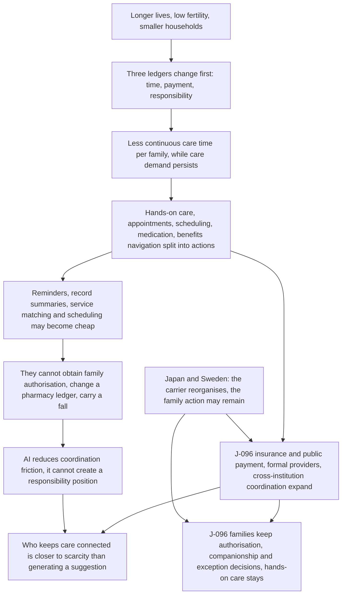
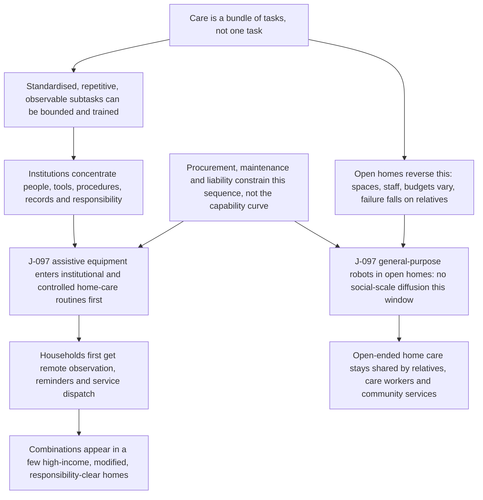

# C9: Ageing and Institutional Care: Who Carries the Daily Physical and Coordination Work?

[中文版](../../zh/chains/90-aging-care-and-institutional-substitution.md)

> **Chain entry**: This is not a chain that starts with AI and asks what care will become. It starts with demography, household size, labour supply, and institutions, then asks whether AI and embodied systems can lower the cost of particular actions.
>
> **One-sentence thesis**: More older people will not automatically create a unified market in which a billion people provide hands-on care every week. More likely, care first moves from an invisible family obligation toward formal services, public/insurance payment, and cross-institution coordination, while bodily contact and long-term responsibility remain the hardest parts to copy cheaply.

> **Boundary note**: every judgment this chain cites — J-066, J-069, J-073, J-074, J-096, J-097 — **does not pass Gate 1 (scale)** and is an occupational / organizational / institutional judgment. Each card’s audience ceiling is defined by its own “audience scale” and “diffusion-gate review” fields, so no step of this chain may be restated as a claim about “all society,” “generally,” or “the norm.” See [Historical retrospective · Gate 1](../01-retrospect.md#7-running-these-gates-on-what-we-ourselves-have-written) for the criterion and the [ledger review log](../90-ledger.md#8-review-log) for card-level evidence.

## 1. Take the problem out of AI first

Ageing is a social force that still exists if AI is deleted: longer lives, low fertility and later marriage reduce co-resident relatives, changing the ratio between working-age people and care demand. It changes three ledgers before it changes what a robot can do:

1. **The time ledger**: can a family member keep taking leave, escorting someone, and providing night care?
2. **The payment ledger**: is care unpaid family work, or is it purchased through insurance, taxes, personal payment, or employer benefits?
3. **The responsibility ledger**: when an action concerns falls, medication, transfers, cognitive changes, or end-of-life decisions, who is authorised, liable, and able to prove that the right thing was done?

These ledgers explain why the number of older people is not a robot-market denominator. They also explain why care belongs in a whole-society landscape without necessarily becoming a product used frequently by everyone.

**Lens declaration for this chain** (codes defined in [Methodology §2 · Toolbox of lenses](../00-method.md#2-toolbox-of-lenses); reverse lookup to the five starting points in the [mapping table](../00-method.md#mapping-the-five-starting-points-to-l1l9)):

This chain’s opening variable, **demographic structure**, is none of L1–L9. [Methodology §2.1](../00-method.md#21-example-without-l1-population-households-and-care) already registers “ageing × shrinking households” as the **example that does not use L1**, and permits it to start from demography, family relations, and institutional carrying capacity. The L codes begin to carry weight only at the second step:

- **L1 Abundance → scarcity** (invoked locally, not as the opening; added 2026-10-10): once generation and explanation become abundant, scarcity lands on carrying continuous responsibility (sections 3 and 5).
- **L2 Constraint migration** (added 2026-10-10): once AI lowers coordination friction, the bottleneck jumps to authorisation and liability positions; coordination roles and narrow care-coordination tasks emerge from that.
- **L3 Cost structure**: the three ledgers (time / payment / liability) decide whether care is borne by the family, the market, or public institutions — this is a make-or-buy boundary, exactly what L3’s coordination and transaction costs address.
- **L4 Diffusion lag**: institutional procurement, training, maintenance, and reimbursement cycles decide when an embodied device actually reaches the bedside.
- **L5 Signals and forgery** (partly used; added 2026-10-10): only its “evidence that is harder to forge” end — long-term relationships, bodily presence, and accountable takeover (section 5).
- **L6 Irreversibility**: falls, medication, transfers, and end-of-life decisions cost bodily harm and legal liability.
- **L8 Human nature and demand**: its “real relationships and presence” and “attribution of responsibility” elements — families do not withdraw merely because a device works.

**Lenses in use that this page previously failed to record** (reclassified 2026-10-10 after an independent attack): this page used to list L1, L2, L5, L7, and L9 together as unused. The first three are refuted by **this chain's own card and prose**, so that denial is withdrawn. **L1 (abundance → scarcity) is reclassified as in use (invoked locally, not as the opening)**: the half that says the chain does not open with L1 still holds, see above and §2.1; but the lens field of this page's [Judgment card 1 (J-096)](#judgment-card-1-j-096) reads “supply/demand and payment (**L1**, **L3**)”, and the same card's `Source` field in the ledger points back here. Section 3 lands on “Who keeps care connected is closer to scarcity than generating a suggestion”, section 5 is titled “Scarcity reversal”, and starting from “If generation and explanation become abundant” it runs a whole flip — what becomes scarce, whether it can be made abundant again, and why it is not yet promoted to an opportunity. That is L1: “After something becomes cheaper and more plentiful, something complementary that did not become abundant at the same rate may rise in value”. The old wording “this chain invents no abundance→scarcity flip in order to qualify for exit B” cannot be true alongside it; §2.1 itself says only that “this question does not need an L1 abundance–scarcity inversion”, and allows that “L1 can be invoked locally”. **L2 (constraint migration) is reclassified as in use**: section 3 says “AI can reduce coordination friction; it cannot create a responsibility position by itself” — once coordination is made cheap, the system does not speed up evenly; the binding constraint jumps to family authorisation, the pharmacy ledger, liability for a fall, and irreversible decisions at midnight. That is L2: “Removing one bottleneck does not make every part of a system speed up evenly; the bottleneck jumps to another part”. What the chain derives next covers the first two uses named in L2: “Use this to look for new roles, categories, and risks” — “insurance/public services and coordination roles carry some actions” in J-096's reasoning chain (new roles), and section 5's “start with narrow tasks such as care coordination, scheduling, escalation, authorisation records, and service traceability” (new categories). **L5 (signals and forgery) is reclassified as partly used**: the scarce items section 5 lists — “having someone arrive, take over, and carry consequences when an exception occurs”, “remaining trustworthy in a long relationship”, and “The first two are constrained by bodily presence, labour time, and liability law” — are exactly the long-term relationships, embodied presence, and accountability among L5: “screening will seek guarantees, collateral, long-term relationships, accountable identities, or embodied presence—evidence that is harder to forge” (guarantees and collateral do not appear). What is not used is L5's engine end: no step of this chain is premised on “the cost of forging text, images, or credentials collapses”, and no party switches screening signals as a result — section 5 starts from generation becoming abundant (L1), and these credentials appear here as scarce carrying capacity, not as screening signals. The old wording “L2 and L5 carry none of its steps” therefore holds for neither.

**Lenses not used**: L7 (institutional lag), L9 (relational asymmetry). Why (rewritten 2026-10-10 after the attack; each reason names the step that looks most like the lens and why it is not that lens): **L7** — the step most like it is section 2's Japanese long-term-care insurance: “When family pressure no longer matches the demographic structure, institutions can organise financing, eligibility assessment, and service supply”; institutions do arrive late here. But L7 is “Technology comes first; institutions arrive later”, and from that it asks of a rent “when does it open?” and “when does it close?”; here the institutions follow demographic structure, not technology, and the chain derives no rent window that opens or closes as institutions settle. This chain is about **institutions substituting for the existing bearer** — a mechanism that is only **partly carried**: which party bears the care (family, market, or public institution) is a make-or-buy boundary already carried by L3 as declared above, but “institutions substitute for the existing bearer” itself has no source sentence in L1–L9; the “entry-point gap” paragraph after the [mapping table](../00-method.md#mapping-the-five-starting-points-to-l1l9) registers it as “only partly carried”. The chain therefore calibrates it against two historical cases, Japan and Sweden, rather than letting a lens vouch for it. The old claim that it “is registered as a clause vacancy in the social-regularity row of the §2 mapping table” was a mis-citation and is withdrawn: the vacancies that row registers are who holds the decision and multi-party coordination, mandated adoption, and norm formation — not institutional substitution. **L9** — the step most like it is J-096's “families retain authorisation, companionship, and exception decisions” and section 5's “remaining trustworthy in a long relationship”: AI does enter care relationships here. But L9 asks “which element is asymmetric in this relationship”, and requires deriving “a set of norms, dependencies, and forms of harm that did not previously exist”; this chain names none of L9's four asymmetries, and its question stops at who carries the action and the liability (L3, L6, L8). The reallocation of family roles once devices and AI mediate care is reasoned in [C4 §12.2](40-embodied-intelligence.md#122-family-relationships-a-device-can-replace-one-care-task-without-replacing-kin-authorization-and-presence) (“Family members partly shift from **hands-on operators** to authorizers, coordinators, payers, and exception decision-makers”), whose card [J-100](../ledger/96-102.md#j-100--embodied-care-reallocates-family-roles-before-it-removes-care-relationships) declares “Family relations (**L8**, **L9**)” in its lens field. The old pointer “carried by [C11](110-authority-before-intelligence.md)” is withdrawn: C11's body never discusses caregiving at all. Reverse-looked-up against the [mapping table](../00-method.md#mapping-the-five-starting-points-to-l1l9), the reclassified carried part of this chain's base is **supply and demand** (L1 invoked locally; L2 and L3 as extensions, L3 with no source sentence) + **historical regularity** (L4) + **the second half of the technology clause** (L6) + **human nature** (L8) + **social regularity** (L5, only its credential-list end) — for supply and demand the old lookup gave only “**an extension of supply and demand** (L3, with no source sentence)” and it had no social regularity at all, missing the supply-and-demand clause itself that L1 brings and the social regularity that L5 brings. The old sentence “its opening point and its core mechanism both fall outside the clauses” is also only half true: the opening point (demography) does fall outside the clauses, but the core mechanism does not as a whole — when a device actually reaches the bedside is carried by L4 (historical regularity, verbatim); why a mistake costs bodily harm and legal liability, so that a responsibility position is hard to copy cheaply, is carried by L6 (second half of the technology clause, verbatim); and the bearer-boundary face is carried by L3 (an extension with no source sentence). What truly falls outside the clauses is only the opening point and the mechanism “institutions substitute for the existing bearer” itself — these can be calibrated only against the Japanese and Swedish cases, and that is a natural ceiling on this chain's confidence, not an omission.

## 2. Historical priors: care pressure changes the carrier, not necessarily the family action

### 2.1 Japan: from family obligation to long-term-care insurance

Japan's introduction of long-term-care insurance in 2000 shows an earlier question than “can AI provide care?” When family pressure no longer matches the demographic structure, institutions can organise financing, eligibility assessment, and service supply, moving some care from households to formal providers. It calibrates a mechanism; it does not prove future scale.

### 2.2 Sweden: formal public carriers can replace some family actions

Sweden places overall responsibility for elderly care with municipalities and provides home help, special housing, and around-the-clock assistance. This is another institutional path: care can be carried by public organisations rather than only by co-resident children. It does not prove that family care is zero, or that every country can reproduce Nordic fiscal and governance conditions.

### 2.3 Two reverse boundaries

- **The formal-supply boundary**: even when institutions recognise long-term care as a public issue, families may still carry transport, emotional support, night-time exceptions, and decisions. Socialisation is not family exit.
- **The capability/carrier boundary**: contact-transfer robots demonstrated lifting and moving a person in prototypes years ago, but routine ward deployment still requires safety liability, cleaning, training, maintenance, and procurement. Capability cannot substitute for an organisation that can carry it.

This chain therefore does not treat Japan or Sweden as forecasts. They are two observed institutional responses. Together they support “the carrier can be reorganised” and warn against reducing care to either family or robots.

## 3. Reasoning chain A: demography → household time gap → formal service and coordination layers

> **How to read this diagram**: boxes are reasoning steps, and arrows are the dependency order the prose argues; the diagram projects only the load-bearing steps and does not replace the prose — the evidence for each step sits in the sections below and in the ledger cards.

The key question is not whether demand grows, but who carries the actions after it grows. Generating reminders, summarising records, matching services, and scheduling may become cheap. They do not automatically obtain family authorisation, change a pharmacy ledger, carry liability for a fall, or make an irreversible decision at midnight. AI can reduce coordination friction; it cannot create a responsibility position by itself.

### Judgment card 1: J-096

- **Judgment**: From 2027–2035, ageing and smaller households will move part of care from invisible family obligations toward formal services, insurance/public payment, and cross-institution coordination; this will not mean that hands-on family care exits.
- **Audience scale**: The affected population is a constructed tens-of-millions impact reach of care recipients, family members, and care workers. The actual repeated actors are adults who provide hands-on care or care coordination at least weekly; available comparable evidence supports only subgroups at no more than the million scale, not billion-scale diffusion. The change mainly reallocates existing caregivers’ burden and lets households that cannot sustain care use formal services.
- **Diffusion-gate review**: Affected people are not one social action’s actors; comparable evidence cannot yet construct a global deduplicated denominator. Gate 1 fails, so this is written as an institutional and occupational judgment.
- **Lens**: Demography (**carried by no lens in L1–L9**; see §2.1, “example without L1”), supply/demand and payment (**L1**, **L3**), institutional substitution (**only partly carried**: the “family, market, or public institution?” face of it is a make-or-buy boundary and is carried by **L3**; but “institutions substitute for the existing bearer” itself has no source sentence in L1–L9, and L7 covers only the “institutions arrive late” end), family relations (**L8**) (codes in [Methodology §2](../00-method.md#2-toolbox-of-lenses); gaps in the [mapping table](../00-method.md#mapping-the-five-starting-points-to-l1l9)).
- **Reasoning chain**: Persistent elder-care demand → less available family time → scheduling, leave, and continuity gaps in unpaid care → insurance/public services and coordination roles carry some actions → families retain authorisation, companionship, and exception decisions.
- **Time window**: 2027–2035.
- **Falsifier**: By 2033, in at least four comparable demographic and care systems, family-care time, formal-care spending, and coordination roles have not moved toward formal/coordination carriers; or any movement is fully explained by a short-term business cycle rather than demographic structure and household size.
- **Leading indicator**: Daily/weekly frequency of informal care, care leave and labour-force exit, long-term-care insurance/public-care spending, home-care hours, coordination roles, and waiting time; annually.
- **Confidence**: Medium
- **depends-on**: J-066, J-073.
- **Strongest opposing mechanism**: Productivity and migration expand purchasable care supply, or delayed disability keeps demand below what demographic structure implies, so the division between household and formal carriers barely changes.
- **Against consensus**: **Partly consistent**: OECD comparable surveys show that daily/weekly informal care is real, while Japan and Sweden show that institutions can reorganise the carrier. **Boundary**: these materials do not provide a global caregiver denominator or prove that formal services expand in every system. **Why retain**: family time cannot be stored; institutions can change who acts, but cannot erase continuity of care.
- **External comparison source**: EXT-62, EXT-63, EXT-64.
- **Source**: Sections 2–3 of this chain.
- **Next review**: 2027-06-30.
- **Status**: ACTIVE

## 4. Reasoning chain B: standardised action → institutional carrier first → open household environment later

Care is a bundle of tasks. Institutions concentrate people, tools, procedures, records, and responsibility in one place, making it easier to deploy assistance first: transfers, cleaning, medication sorting, vital-sign collection, and exception escalation can be bounded and repeatedly trained. Households are the opposite: spaces differ, staff are not fixed, budgets are fragmented, tasks have no clean boundaries, and failure falls directly on relatives and the person receiving care.

> **How to read this diagram**: boxes are reasoning steps, and arrows are the dependency order the prose argues; the diagram projects only the load-bearing steps and does not replace the prose — the evidence for each step sits in the sections below and in the ledger cards.

This does not mean households will not adopt technology. It means the unit of adoption is unlikely to be “each household buys a general-purpose robot.” A more plausible sequence is single-task equipment and sensing in institutions → remote observation, reminders, and service dispatch at home → combinations in a minority of high-income, modified, responsibility-clear homes. Procurement, maintenance, and liability constrain this sequence; a capability curve alone does not determine it.

### Judgment card 2: J-097

- **Judgment**: From 2027–2038, contact transfer, exception observation, and standardised care assistance are more likely to form stable routines first in institutions and controlled home-care services; general-purpose robots in open-ended homes will not constitute social-scale diffusion in this window.
- **Audience scale**: Direct actors are no more than a million-scale population of care institutions, care workers, maintenance providers, and payers; the main effect is to raise existing professionals’ ceiling. Care recipients and families are a tens-of-millions impact reach, not the denominator for one high-frequency technical action.
- **Diffusion-gate review**: Institutional procurement and household deployment are low-frequency organisational decisions; there is no citable deduplicated weekly-use denominator for open-ended household tasks. Gate 1 fails, so this is written as an occupational/institutional judgment.
- **Lens**: Task decomposability (**carried by no lens in L1–L9**; it belongs to the “which work gets cheap first” gap in the technology-regularity row of the mapping table), institutional economics (**L3**), physical and liability constraints (**L6**), diffusion gates (**not a lens**; see §2, “the diffusion gates are not a tenth optional lens”) (codes in [Methodology §2](../00-method.md#2-toolbox-of-lenses); gaps in the [mapping table](../00-method.md#mapping-the-five-starting-points-to-l1l9)).
- **Reasoning chain**: Repetitive tasks are easier to standardise → institutions concentrate procurement and training → liability, maintenance, and records can bind to an organisation → controlled settings stabilise first → heterogeneous homes, rare exceptions, and externalised liability slow general-purpose devices.
- **Time window**: 2027–2038.
- **Falsifier**: By 2035, across multiple income levels and at least three institutional settings, general-purpose home-care robots are used continuously by large numbers of households, cover at least three cross-space tasks (such as transfers, cleaning, and exception handling), and have retention, incident, and maintenance performance no worse than institutional deployments. Demonstrations, pilots, or single-task devices do not falsify this card.
- **Leading indicator**: Paid institutional deployments and retention, equipment hours per thousand recipients, months of continuous household use, cross-task success, human takeover and incident rates, and maintenance/modification cost; annually.
- **Confidence**: Medium
- **depends-on**: J-073, J-074, J-066, J-069.
- **Strongest opposing mechanism**: Low-cost hardware/software, home modification, and insurance payment mature together, making homes controlled environments; or labour scarcity forces high subsidies and bypasses natural diffusion speed.
- **Against consensus**: **Partly consistent**: embodied systems’ diffusion in factories and contact-transfer prototypes support “capability can exist while institutions carry it first.” **Boundary**: current sources lack cross-country deployment, retention, and household incident data, so institutional priority is not an observed fact yet. **Why retain**: open homes combine physical uncertainty, externalised liability, and maintenance cost; historical diffusion suggests these can bind before the capability curve.
- **External comparison source**: EXT-43, EXT-44, EXT-45.
- **Source**: Section 4 of this chain.
- **Next review**: 2027-12-31.
- **Status**: ACTIVE

## 5. Scarcity reversal: not “care advice,” but carrying continuous responsibility

If generation and explanation become abundant, the obvious response is to call care-information filtering a business opportunity. C1 already warns that objective filtering may be internalised and cannot be assumed durable scarcity. In care, the harder scarcity may be:

- observing continuously within an authorisation boundary, not answering once;
- having someone arrive, take over, and carry consequences when an exception occurs;
- connecting family, care facility, pharmacy, hospital, and payer records;
- remaining trustworthy in a long relationship instead of wrapping one wrong suggestion in certainty.

The first two are constrained by bodily presence, labour time, and liability law; AI generation should not be assumed to automate them away quickly. The latter two may be partly improved by software but still face privacy, interoperability, authorisation, and incentive constraints. **What can be done now**: start with narrow tasks such as care coordination, scheduling, escalation, authorisation records, and service traceability; do not start with a social-scale “universal home robot” narrative.

This is an actionable direction, not a formal opportunity conclusion. It still needs the durability gate: willingness to pay, retention, incident liability, and real repeated-actor data. Without those data, keep the statement as landscape rather than investment advice.

## 6. The picture to carry away

In 2032, a daughter may not lift her mother from bed to chair by hand every day, but she may still confirm a care plan weekly, authorise a cross-institution record, or decide whether to travel when an exception occurs. A transfer device may be routine procurement in a care home while a household robot still handles one narrow action—or merely connects a person to a service. The change is not “people replaced by machines.” It is care split into more priced, recorded, and accountable collaborative units; bodily presence and long-term commitment become more visibly priced.

> **Landscape only**: This 2032 scene connects the judgments; it is not a third formal card. It does not claim universality or turn one household’s adoption into a social trend.

## 7. Evidence boundary and next review

The historical and institutional material used here supports only that care carriers can be reorganised, informal care is real, and institutions and households face different constraints. It does not support a global count of care actors, a household-robot penetration rate, or a revenue forecast for a business model. The next round should prioritise comparable denominators for hands-on versus coordination care, institutional deployment and retention, household incidents and maintenance cost, and comparable series from at least two systems with strong formal care and two with high family-care shares.

A gap is not a falsification. When a preregistered condition cannot be computed, record `INDETERMINATE` under the ledger rules rather than rewriting silence as a hit.
