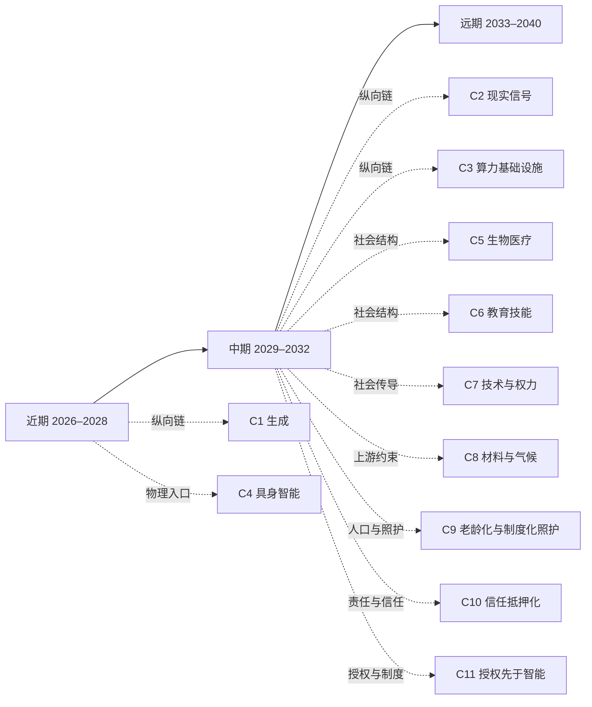

# 近期图景：2026–2028

[English version](../en/10-near.md)

[返回 README／文档地图](../../README.md)

> 2027 年 3 月的一个周一早上，一家做冷链检测的公司只有十一个人，却同时服务两百多家门店。周末系统自己跑完四百多次比对，把出具检测结论的流程压到七个候选版本——没人加班，也没人觉得这件事值得一提。占掉整个上午的是另外三件：最大的客户下周要续约，对方这次要看的不是准确率宣传页，而是过去两年里每一次“三小时内出结论”实际用了多久；下游超市换了采购负责人，新来的那位第一句话是“这份报告谁签字”；而那批被系统标成“必须有人到现场看一眼”的样本，怎么调阈值都还在。十一个人里没有一个还在手写报告，但每个人每天都在做同一个决定：哪些可以自动放行，哪些必须有人亲自担下来。
>
> 近期这三年的形状大致就是这样：生成、比对和筛选这一侧迅速变得便宜而丰富，而“谁的现场、谁的承诺、谁担后果”这一侧第一次被单独拿出来定价。以下六个维度分别拆开这件事——但这不是把“丰富→稀缺”当成结论，而是把它当作待检验的起点：有些稀缺会被同一股生成力量吃掉，有些会被物理、产权、责任、信任或身体在场挡住。六个维度都走完这三步。
>
> 这一层是横向铺开同一个时间窗。想沿一条因果线纵向读到底，见 [C1 · 生成变得免费之后，什么反而买不到了](chains/10-generation-becomes-free.md)。

## 阅读导航图（关系投影）

本图只提供近／中／远三页与推演链的阅读入口，不新增判断，也不替代 `J-NNN` 台账。时间层是粗粒度阅读容器；因果依赖请回到台账的 `depends-on`。

> 本图是阅读辅助，不是新的事实源。箭头表示推荐入口而非必然因果。

## 1. 一次回答，变成一批尝试

单位推理成本下降后，系统会并行生成、比较和修正，而不是只交付一个答案。[J-018](ledger/11-20.md#j-018--并行推理先于长程自主执行) 是这条近期主线；它与常见预期一致，但这里的推理重点是“同一预算能尝试多少次”，不是“模型会不会思考”。

- **变丰富**：同等能力的推理调用、候选方案和自动测试次数。
- **变稀缺**：值得继续的任务边界、私有上下文，以及不可逆动作前的判断。
- **第三问**：客观筛选会被同一股力量自动化，属于窗口；私有上下文受产权与私有性约束，不可逆动作受物理和法律责任约束，不能被简单复制。
- **现在谁该改变什么行为**：把“多生成”改成“生成—比较—验证”，真实动作保留隔离、审批和回滚。

[J-019](ledger/11-20.md#j-019--节省-token-只是窗口) 进一步判断，节省 token 本身只是窗口，不是持久稀缺。我对 [J-018](ledger/11-20.md#j-018--并行推理先于长程自主执行) 押注较重，对 [J-019](ledger/11-20.md#j-019--节省-token-只是窗口) 则保留更多余地。最强反方是能源、芯片供应或服务排队把成本下降锁在单次调用；若并行度不升，这一节的主线就要重审。

> **范围标签 · 闸一**：本段引用的 J-018, J-019 已判为职业／组织性判断；受众天花板由所引卡片定义，不作社会级趋势断言。完整判据见[历史回顾 · 闸一](01-retrospect.md#七用这道闸检验我们自己写过的东西)，逐卡依据见[判断台账 · 检查日志](90-ledger.md#八检查日志)。

## 2. 找东西比造东西贵

代码、图像、视频和文案的合成速度继续上升。[J-020](ledger/11-20.md#j-020--可复制内容的价格继续下降) 检验一个容易被夸大的答案：客观质量筛选大部分会被生成系统内置，而不是永久留下一个独立市场。

- **变丰富**：格式正确、风格相似、可复制的内容。
- **变稀缺**：尚未被记录的真实观测、明确语境和可追责的事实来源。
- **第三问**：模型能删掉形式错误，却不能凭重组生成新的现场观测；物理在场、产权和法律责任构成硬约束，因此残留稀缺不能被同一股力量完全制造丰富。
- **现在谁该改变什么行为**：发布者把来源、时间、观察条件和不确定性放到正文旁，而不是只展示成品。

[J-021](ledger/21-30.md#j-021--一手现场信号先获得溢价) 判断一手信号会比二手表达更早获得溢价。这与“内容会过剩”的常见方向一致，但本项目更具体地押注“未被记录的现场”而非抽象的高质量。最强反方是高保真模拟被广泛接受，替代真实观测；若买方不再区分现场与重组，[J-021](ledger/21-30.md#j-021--一手现场信号先获得溢价) 应降级。

> **范围标签 · 闸一**：本段引用的 J-020, J-021 已判为职业／组织性判断；受众天花板由所引卡片定义，不作社会级趋势断言。完整判据见[历史回顾 · 闸一](01-retrospect.md#七用这道闸检验我们自己写过的东西)，逐卡依据见[判断台账 · 检查日志](90-ledger.md#八检查日志)。

## 3. 看见不等于相信

当每个人都能得到个性化内容，注意力不再只是“有没有内容”，而是“谁值得把时间交给他”。[J-022](ledger/21-30.md#j-022--可伪造信号推动凭据升级) 判断可伪造信号会把筛选推向更昂贵的凭据；这个方向与“信任会变重要”的共识一致，但机制和时间窗是本项目自己的下注。

- **变丰富**：个性化消息、推荐和看似真实的互动。
- **变稀缺**：持续一致的身份、可追责承诺与长期关系。
- **第三问**：生成器可以复制表面信号，却不能一次生成多年重复博弈；信任、关系和法律责任是硬约束，不能靠更多 token 自动补齐。
- **现在谁该改变什么行为**：组织少追逐曝光量，多记录承诺兑现率；个人把重要判断从“说得像”移向“谁承担后果”。

[J-023](ledger/21-30.md#j-023--注意力转向兑现承诺) 认为注意力会从表达转向关系与承诺，[J-024](ledger/21-30.md#j-024--身份凭据重新分层仅图景) 则只保留为较弱图景：身份凭据可能重新分层，但制度落点不明。最强反方是平台把可靠身份和责任全部内置，用户无需新凭据；若平台内置责任后筛选成本持续下降，[J-023](ledger/21-30.md#j-023--注意力转向兑现承诺) 需要重写。

> **范围标签 · 闸一**：本段引用的 J-022, J-023, J-024 已判为职业／组织性判断；受众天花板由所引卡片定义，不作社会级趋势断言。完整判据见[历史回顾 · 闸一](01-retrospect.md#七用这道闸检验我们自己写过的东西)，逐卡依据见[判断台账 · 检查日志](90-ledger.md#八检查日志)。

## 4. 做步骤的人变少，协调更密

AI 先压低文档、排程、翻译和方案制作成本，再把瓶颈推向授权、审查和承担后果。[J-025](ledger/21-30.md#j-025--小团队产出能力上升) 押注小团队能完成更多可验证产出；这条与“知识工作被自动化”的共识方向一致，但不等于“公司里不再需要人”。

- **变丰富**：可外包、可自动化、可监控的知识工作步骤。
- **变稀缺**：能定义目标、分配权限、处理异常并为结果负责的人。
- **第三问**：流程编排会被自动化；法律责任与组织信任不能由一段生成文本承担，因此责任位置不会同步丰富。
- **现在谁该改变什么行为**：职位描述从“产出文件”改为“定义边界、检查证据、承担决定”。

[J-026](ledger/21-30.md#j-026--责任边界不会同步消失) 判断责任边界不会与产能同步消失，属于较稳的结构后果而不是就业人数预测。最强反方是监管把责任统一归给平台，使组织无需重新设计边界；若高价值场景普遍由平台承担全部后果，[J-026](ledger/21-30.md#j-026--责任边界不会同步消失) 应降置信度。

> **范围标签 · 闸一**：本段引用的 J-025, J-026 已判为职业／组织性判断；受众天花板由所引卡片定义，不作社会级趋势断言。完整判据见[历史回顾 · 闸一](01-retrospect.md#七用这道闸检验我们自己写过的东西)，逐卡依据见[判断台账 · 检查日志](90-ledger.md#八检查日志)。

## 5. 算力便宜，入口仍贵

推理成本下降不会平均分配收益。[J-027](ledger/21-30.md#j-027--租用算力扩大能力扩散) 判断算力租用会扩大能力扩散；这与“模型能力会普及”的常见预期一致，但不意味着权力同时扩散。

- **变丰富**：小组织可租用的计算与生成能力。
- **变稀缺**：稳定能源、专有数据、用户入口，以及能承担损失的资产负债表。
- **第三问**：算力调用可复制；能源、产权、法律责任和分发关系不能同速复制，因此这一部分不是同一股软件力量可以无限制造的丰富。
- **现在谁该改变什么行为**：评估 AI 项目时同时问“谁控制输入、出口和事故损失”，不要只看模型能力。

[J-028](ledger/21-30.md#j-028--入口成为议价节点仅图景) 认为数据、分发和责任入口可能形成新的议价节点，但它目前只是较弱图景，不应直接当商机。最强反方是模型、能源和分发全部商品化，入口租金无法持续；若准入价格不再有结构性溢价，[J-028](ledger/21-30.md#j-028--入口成为议价节点仅图景) 失效。

> **范围标签 · 闸一**：本段引用的 J-027, J-028 已判为职业／组织性判断；受众天花板由所引卡片定义，不作社会级趋势断言。完整判据见[历史回顾 · 闸一](01-retrospect.md#七用这道闸检验我们自己写过的东西)，逐卡依据见[判断台账 · 检查日志](90-ledger.md#八检查日志)。

## 6. 选择变多，不等于欲望变新

[J-029](ledger/21-30.md#j-029--需求侧锚点保持) 把地位、确定性、真实在场和责任归属当作需求侧锚点，而不是把“人性永恒”当证明。它与“技术改变工具、不自动改变全部需求”的保守共识相容。

- **变丰富**：可试的身份、作品和生活方案。
- **变稀缺**：愿意共同承担后果的关系、真实经历和被看见的承诺。
- **第三问**：表面表达可自动生成；共同经历、身体在场和重复关系受物理、信任和身体约束，不能被同一股生成力量完整替代。
- **现在谁该改变什么行为**：不要把更多选择当成更多意义，为不可替代的在场和承诺留出时间。

[J-030](ledger/21-30.md#j-030--ai-代理协调而非共同经历仅图景) 进一步描绘 AI 能代理协调、却不能代理共同经历；这是一条较弱但值得保留的结构图景。最强反方是新一代人真的把持续的 AI 互动视为足够真实的互惠关系；若纵向行为显示代理关系稳定替代共同经历，[J-030](ledger/21-30.md#j-030--ai-代理协调而非共同经历仅图景) 应重写。

> **范围标签 · 闸一**：本段引用的 J-030 已判为职业／组织性判断；受众天花板由所引卡片定义，不作社会级趋势断言。完整判据见[历史回顾 · 闸一](01-retrospect.md#七用这道闸检验我们自己写过的东西)，逐卡依据见[判断台账 · 检查日志](90-ledger.md#八检查日志)。

## 本层边界

生物医疗、教育资格、能源基础设施、地缘制度、人与 AI 的亲密关系等仍未覆盖，见 [台账「六、未覆盖维度缺口清单」](90-ledger.md#六未覆盖维度缺口清单)。本层不把可自动化的窗口机会包装成结构性商机，也不把较弱图景写成事实；完整五件套与正式置信度只在台账中登记。
