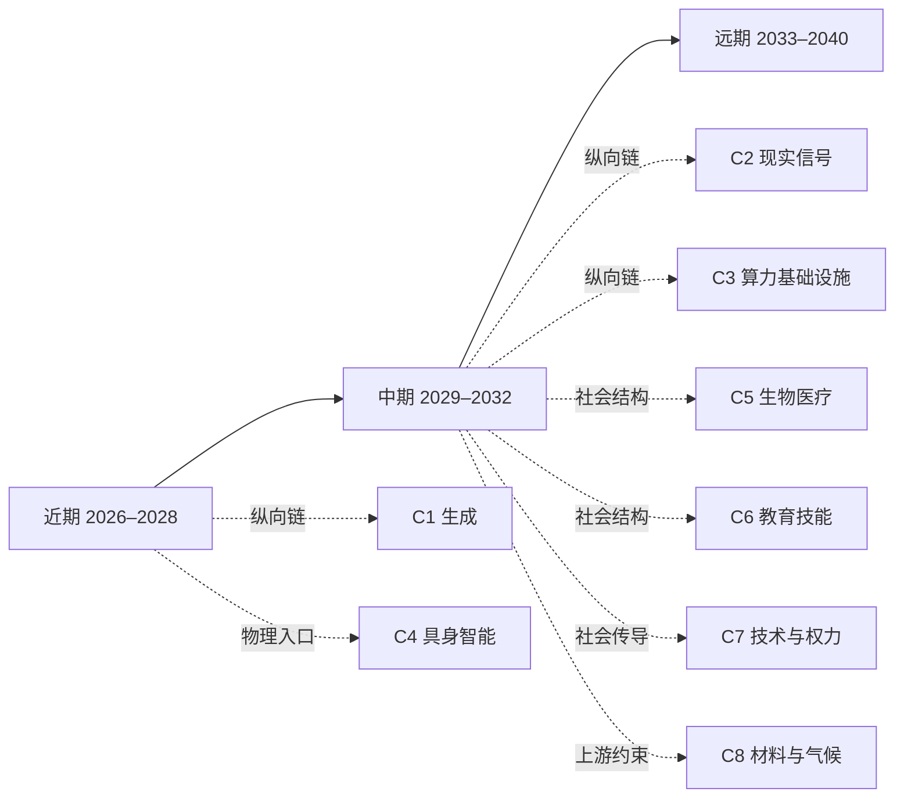

# 中期图景：2029–2032

[返回 README／文档地图](../../README.md)

> 2031 年 7 月，一家处理跨境退货与理赔的公司换掉了墙上的仪表盘。旧的那块显示这个月自动完成了多少步，数字一直在涨，看久了没有意义；新的那块只留一列，标题是“等一个人”。那天下午这一列里有六项，排在最前面的已经等了九个小时。
>
> 公司里能按下这一列的只有两个人，其中一个在休产假。剩下的那位不缺信息：每一项都附着系统写好的三页理由，条理清楚，措辞比她自己写的好。她要翻的是另一栏——这条流程上一次走完之后，现实里到底发生了什么，而不是当时系统预计会发生什么。这一栏常常是空的。空着的那几项，系统能补出一段看上去很合理的复盘，用来排队足够了；可一旦要拿去申请赔付，对方不认。
>
> 她也不缺权限。她缺的是她自己：按下去的每一项，合同里都有一行写着“错了赔到哪一档”，而那一行下面署的是她的名字。九个小时就是这么来的——不是系统慢，是她不愿意把一件自己没看懂的事，变成一句自己要负责的话。
>
> 那天下午她按了四项，退回两项。晚上还有一通电话要打：其中一家品牌这次损失不小，系统已经把邮件、赔付方案和三种措辞都拟好了，但那通电话得她自己打。
>
> 中期的形状大致就是这样：执行本身不再是瓶颈，瓶颈换成了那一列“等一个人”——哪些动作允许自动做完、越过边界之后由谁决定、决定错了谁赔。以下六个维度分别拆开这件事。中期不是凭空跳到科幻未来，而是把近期已写下的技术判断向组织、制度和真实世界后果推进；每条中期推论都依赖近期判断，若上游被证伪，下游必须重审。完整卡片见 [`90-ledger.md`](90-ledger.md)，正文中的编号均直接回到台账，台账是字段与状态的唯一来源。
>
> 这一层是横向铺开同一个时间窗。想沿一条因果线纵向读到底，见 [C2 · 当数据不再免费：现实信号如何变成合同资产](chains/20-real-signals-become-contracts.md)——它的论证正落在这几年。

## 阅读导航图（关系投影）

本图只提供近／中／远三页与推演链的阅读入口，不新增判断，也不替代 `J-NNN` 台账。时间层是粗粒度阅读容器；因果依赖请回到台账的 `depends-on`。

> 本图是阅读辅助，不是新的事实源。箭头表示推荐入口而非必然因果。

## 1. 算力与 token：生成不再是瓶颈，执行边界成为瓶颈

如果 [J-001](90-ledger.md#j-001--同等能力的单位推理成本继续下降) 和 [J-006](90-ledger.md#j-006--推理吞吐先于长程自主性) 成立，2029 年前后同一预算已经能搜索大量方案。中期问题不再是“能不能生成”，而是能否让系统连续行动而不把试错成本转嫁给现实世界。

- **变丰富**：候选计划、并行推理和自动修正。
- **变稀缺**：可检查的权限、可回放的状态和可恢复的行动。
- **第三问**：简单验证会被内置；跨系统状态、物理损害和责任归属受物理与法律／责任约束。
- **所以谁改变行为**：组织应先购买“可观察、可暂停、可回滚”的行动环境，再购买更长的自主权限。
- **窗口机会**：可暂停、可回放、可回滚的行动环境。

[J-010](90-ledger.md#j-010--长程自主执行晚于受限连续执行) 依赖 [J-009](90-ledger.md#j-009--受限工作流中的连续执行先成熟)：若受限工作流没有先稳定，长程自主执行的时间窗和可靠性判断一起动摇。中期由此分出两条判断：可暂停、可回放、可回滚的行动环境会先成为必要条件（[J-031](90-ledger.md#j-031--可暂停可回放可回滚的行动环境成为长程-ai-执行的准入条件)），而授权审查会比执行步骤更稀缺（[J-032](90-ledger.md#j-032--授权审查与异常升级比执行步骤更稀缺)）。若 [J-010](90-ledger.md#j-010--长程自主执行晚于受限连续执行) 被证伪，[J-031](90-ledger.md#j-031--可暂停可回放可回滚的行动环境成为长程-ai-执行的准入条件) 对长程行动的需求边界会后移，[J-032](90-ledger.md#j-032--授权审查与异常升级比执行步骤更稀缺) 则只保留在受限工作流内。其强反方是供应商把长任务切成大量不可见的短流程，从而绕过显式环境建设。

> **范围标签 · 闸一**：本段引用的 J-001, J-006, J-009, J-010, J-031, J-032 已判为职业／组织性判断；受众天花板由所引卡片定义，不作社会级趋势断言。完整判据见[历史回顾 · 闸一](01-retrospect.md#七用这道闸检验我们自己写过的东西)，逐卡依据见[判断台账 · 检查日志](90-ledger.md#八检查日志)。

## 2. 信息与内容：内容成为原料，因果成为产品

近期的 [J-002](90-ledger.md#j-002--从海量产出中筛出客观高质量不是持久稀缺只是-24-年的窗口) 判断客观择优会被内化，[J-005](90-ledger.md#j-005--生成丰富之后价值向三类不可重组的输入集中原始信号可追责承诺被验证因果) 则把价值推向原始信号、可追责承诺和被验证因果。中期会出现一个不舒服的转折：解释越来越便宜，改变现实仍然昂贵。

- **变丰富**：对任何既有资料的解释、摘要、预测和模拟方案。
- **变稀缺**：新的观测、真实干预和愿意承担错误代价的主体。
- **第三问**：合成资料能自动扩张，但不能自动完成被监管接受的真实实验与责任承诺；物理、时间和法律责任构成硬约束。
- **所以谁改变行为**：研发和决策者把“模型说什么”与“现实做了什么”分成两套记录，不能用漂亮解释替代干预证据。
- **窗口机会**：真实干预记录与合成证据分层工具。

[J-005](90-ledger.md#j-005--生成丰富之后价值向三类不可重组的输入集中原始信号可追责承诺被验证因果) 的推论分成两个中期判断：真实干预的可验证记录会比解释本身更值钱（[J-033](90-ledger.md#j-033--真实干预的可验证记录比解释本身更有价值)），而合成证据会先在低责任场景被接受、高责任场景仍要求现实试验（[J-034](90-ledger.md#j-034--合成证据先在低责任场景获准高责任场景仍要求现实试验)）。两条都依赖 [J-005](90-ledger.md#j-005--生成丰富之后价值向三类不可重组的输入集中原始信号可追责承诺被验证因果)；若 [J-005](90-ledger.md#j-005--生成丰富之后价值向三类不可重组的输入集中原始信号可追责承诺被验证因果) 被证伪，现场信号不再有结构性溢价，[J-033](90-ledger.md#j-033--真实干预的可验证记录比解释本身更有价值) 与 [J-034](90-ledger.md#j-034--合成证据先在低责任场景获准高责任场景仍要求现实试验) 都会动摇。外部对照已完成：方向上与“数据越来越重要”的常见说法一致，但对照只能支持到更窄的范围——合规证据、模型风险治理与现实干预记录的价值在高责任场景上升（EXT-7、EXT-13、EXT-9），既未证明它必然高于解释本身，也未给出时间窗。因此本项目仍坚持更具体的押注：“未被记录的信号”和“可赔付承诺”，而不是数据总量（逐条对照结论见 [J-033](90-ledger.md#j-033--真实干预的可验证记录比解释本身更有价值)、[J-034](90-ledger.md#j-034--合成证据先在低责任场景获准高责任场景仍要求现实试验) 的「与共识」字段）。

最强反方是高保真世界模型和监管制度共同接受合成实验，令真实试验不再是必需输入；若发生，[J-005](90-ledger.md#j-005--生成丰富之后价值向三类不可重组的输入集中原始信号可追责承诺被验证因果) 必须重审。

> **范围标签 · 闸一**：本段引用的 J-002, J-005, J-033, J-034 已判为职业／组织性判断；受众天花板由所引卡片定义，不作社会级趋势断言。完整判据见[历史回顾 · 闸一](01-retrospect.md#七用这道闸检验我们自己写过的东西)，逐卡依据见[判断台账 · 检查日志](90-ledger.md#八检查日志)。

## 3. 注意力与信任：可信度从表达迁移到抵押

近期 [J-017](90-ledger.md#j-017--ai-中介会比强关系更快扩大弱关系协调) 把弱关系协调与强关系承诺拆开；[J-005](90-ledger.md#j-005--生成丰富之后价值向三类不可重组的输入集中原始信号可追责承诺被验证因果) 则指出责任主体本身会升值。若两条成立，内容越像真的，读者越需要问“错了谁赔”。

- **变丰富**：个性化解释、身份叙事和仿真的亲密互动。
- **变稀缺**：长期一致、可追责、愿意押上资产的信任。
- **第三问**：表情、语言和即时耐心能被复制；重复博弈、关系修复、法律责任不能一次生成。
- **所以谁改变行为**：组织为重要 AI 输出建立责任、审计和赔付路径；个人把“可信”理解为可追责的关系，而不只是语气自然。
- **窗口机会**：履约记录、责任抵押与审计接口。

由此形成两条中期判断：责任抵押会进入重要 AI 输出的交易结构（[J-035](90-ledger.md#j-035--责任抵押进入重要-ai-输出的交易结构)），长期履约记录会比一次性的自然表达更能分配注意力（[J-036](90-ledger.md#j-036--长期履约记录比一次自然表达更能分配注意力)）。若 [J-017](90-ledger.md#j-017--ai-中介会比强关系更快扩大弱关系协调) 被证伪，弱关系协调并未变便宜，[J-036](90-ledger.md#j-036--长期履约记录比一次自然表达更能分配注意力) 的凭据升级会失去压力；若 [J-005](90-ledger.md#j-005--生成丰富之后价值向三类不可重组的输入集中原始信号可追责承诺被验证因果) 被证伪，[J-035](90-ledger.md#j-035--责任抵押进入重要-ai-输出的交易结构) 的赔付基础也会消失。强反方是平台把所有责任外包给使用者，社会接受低责任的廉价服务；那会让责任抵押变成窗口而非结构机会。

> **范围标签 · 闸一**：本段引用的 J-005, J-017, J-035, J-036 已判为职业／组织性判断；受众天花板由所引卡片定义，不作社会级趋势断言。完整判据见[历史回顾 · 闸一](01-retrospect.md#七用这道闸检验我们自己写过的东西)，逐卡依据见[判断台账 · 检查日志](90-ledger.md#八检查日志)。

## 4. 组织与就业：公司边界由责任而非产能决定

近期 [J-009](90-ledger.md#j-009--受限工作流中的连续执行先成熟) 认为受限工作流先成熟，[J-013](90-ledger.md#j-013--可检查的工具调用先于开放环境行动) 认为可检查工具调用先普及。由此推演，中期组织不一定变成“没有人”，而更可能变成少数人管理更多可验证的代理流程。

- **变丰富**：可拆分、可监控的工作步骤和小团队的产出能力。
- **变稀缺**：跨团队授权、异常升级和最终责任的组织位置。
- **第三问**：流程协调可以自动化；责任、关系和失败后的谈判仍受法律与信任约束。
- **所以谁改变行为**：招聘与教育从“会不会做步骤”移向“会不会定义边界、判断异常、承担后果”。
- **窗口机会**：小团队代理流程的权限与异常升级层。

由此形成两条中期判断：同规模小团队的可验证产出会提高（[J-037](90-ledger.md#j-037--同规模小团队的可验证产出提高)），而授权、异常升级和责任岗位不会按同样速度减少（[J-038](90-ledger.md#j-038--授权异常升级和责任岗位不会与执行步骤同速减少)）。若 [J-009](90-ledger.md#j-009--受限工作流中的连续执行先成熟) 被证伪，[J-037](90-ledger.md#j-037--同规模小团队的可验证产出提高) 的连续执行前提消失；若 [J-013](90-ledger.md#j-013--可检查的工具调用先于开放环境行动) 被证伪，[J-038](90-ledger.md#j-038--授权异常升级和责任岗位不会与执行步骤同速减少) 的可编程权限前提消失。强反方是企业选择把所有代理流程留在供应商内部，客户只购买结果，导致组织边界变化被隐藏而非消失。

> **范围标签 · 闸一**：本段引用的 J-009, J-013, J-037, J-038 已判为职业／组织性判断；受众天花板由所引卡片定义，不作社会级趋势断言。完整判据见[历史回顾 · 闸一](01-retrospect.md#七用这道闸检验我们自己写过的东西)，逐卡依据见[判断台账 · 检查日志](90-ledger.md#八检查日志)。

## 5. 资本与权力：稀缺从模型转向准入

如果 [J-001](90-ledger.md#j-001--同等能力的单位推理成本继续下降) 的成本下降和 [J-005](90-ledger.md#j-005--生成丰富之后价值向三类不可重组的输入集中原始信号可追责承诺被验证因果) 的真实输入升值同时成立，资本不会只追逐“最强模型”，而会追逐能源、数据、分发、许可与赔付能力的控制权。

- **变丰富**：可租用的通用推理和生成能力。
- **变稀缺**：低成本能源、独家现实数据、关键渠道以及能吸收事故的资产负债表。
- **第三问**：软件调用可复制；产权、能源接入、关系网络和责任能力不能同速复制。
- **所以谁改变行为**：创业者把“模型能力”与“准入能力”分开估值；监管者观察谁能把收益私有化、把损失社会化。
- **窗口机会**：能源、数据、渠道与事故偿付能力的准入层。

由此形成两条中期判断：租用模型本身会更丰富，但能源、数据与渠道控制形成准入租金（[J-039](90-ledger.md#j-039--模型租用更丰富但能源数据和渠道控制形成准入租金)），能吸收事故的资产负债表成为另一种稀缺（[J-040](90-ledger.md#j-040--能吸收-ai-事故的资产负债表成为独立稀缺)）。若 [J-001](90-ledger.md#j-001--同等能力的单位推理成本继续下降) 被证伪，[J-039](90-ledger.md#j-039--模型租用更丰富但能源数据和渠道控制形成准入租金) 的模型丰裕前提消失；若 [J-005](90-ledger.md#j-005--生成丰富之后价值向三类不可重组的输入集中原始信号可追责承诺被验证因果) 被证伪，[J-040](90-ledger.md#j-040--能吸收-ai-事故的资产负债表成为独立稀缺) 的责任吸收溢价会动摇。这只是中置信度结构图景，不作为独立商机卡。强反方是算力、能源和数据都快速商品化，制度也及时分散准入权；若准入价格不再有结构性溢价，本图景降置信度。

> **范围标签 · 闸一**：本段引用的 J-001, J-005, J-039, J-040 已判为职业／组织性判断；受众天花板由所引卡片定义，不作社会级趋势断言。完整判据见[历史回顾 · 闸一](01-retrospect.md#七用这道闸检验我们自己写过的东西)，逐卡依据见[判断台账 · 检查日志](90-ledger.md#八检查日志)。

## 6. 人性与关系：AI 可以代理协调，不能代理共同经历

[J-017](90-ledger.md#j-017--ai-中介会比强关系更快扩大弱关系协调) 建立在 [J-006](90-ledger.md#j-006--推理吞吐先于长程自主性) 和 [J-007](90-ledger.md#j-007--可接续上下文先于可靠长期记忆) 上：沟通与共享背景变便宜，但强关系容量受注意力、身体和重复承担约束。中期最容易犯的错误，是把“有人替你回复”误读成“有人替你在场”。

- **变丰富**：随时可用的陪伴式回复、关系维护提醒和冲突摘要。
- **变稀缺**：非代理的共同经历、真正的互惠和需要当事人承担的修复。
- **第三问**：语言和提醒可自动化；身体在场、信任关系和共同后果不能被同一股生成力量复制。
- **所以谁改变行为**：家庭、学校和组织为不能代理的决定保留共同在场，把 AI 用于准备和回顾而不是替代承担。
- **窗口机会**：弱关系协调工具；强关系在场仅作图景，不是商机。

由此形成两条中期判断：AI 会先扩大弱关系的协调半径（[J-041](90-ledger.md#j-041--ai-先扩大弱关系的协调半径)），但共同经历与身体在场仍构成强关系的容量上限（[J-042](90-ledger.md#j-042--共同经历与身体在场仍是强关系容量上限仅图景)）。若 [J-017](90-ledger.md#j-017--ai-中介会比强关系更快扩大弱关系协调) 被证伪，前者的协调供给前提消失；若 [J-011](90-ledger.md#j-011--跨媒介一致性先于长时连贯性) 被证伪，后者关于多模态表达扩张的前提减弱。这是出口 B 的结构性图景，置信度中低，不能包装成商业机会。强反方是人类把 AI 代理的持续互动视为足够真实的互惠关系；若行为显示代理关系能稳定替代共同经历，本条需要改写。

> **范围标签 · 闸一**：本段引用的 J-006, J-007, J-011, J-017, J-041 已判为职业／组织性判断；受众天花板由所引卡片定义，不作社会级趋势断言。完整判据见[历史回顾 · 闸一](01-retrospect.md#七用这道闸检验我们自己写过的东西)，逐卡依据见[判断台账 · 检查日志](90-ledger.md#八检查日志)。

## 本层边界

远期反馈、能源与物理基础设施、生物医疗、教育资格、地缘制度的完整链条仍未覆盖，见 [台账「六、未覆盖维度缺口清单」](90-ledger.md#六未覆盖维度缺口清单)。上述中期段落使用近期判断作支点；若支点被证伪，不保留原文的确定语气。
