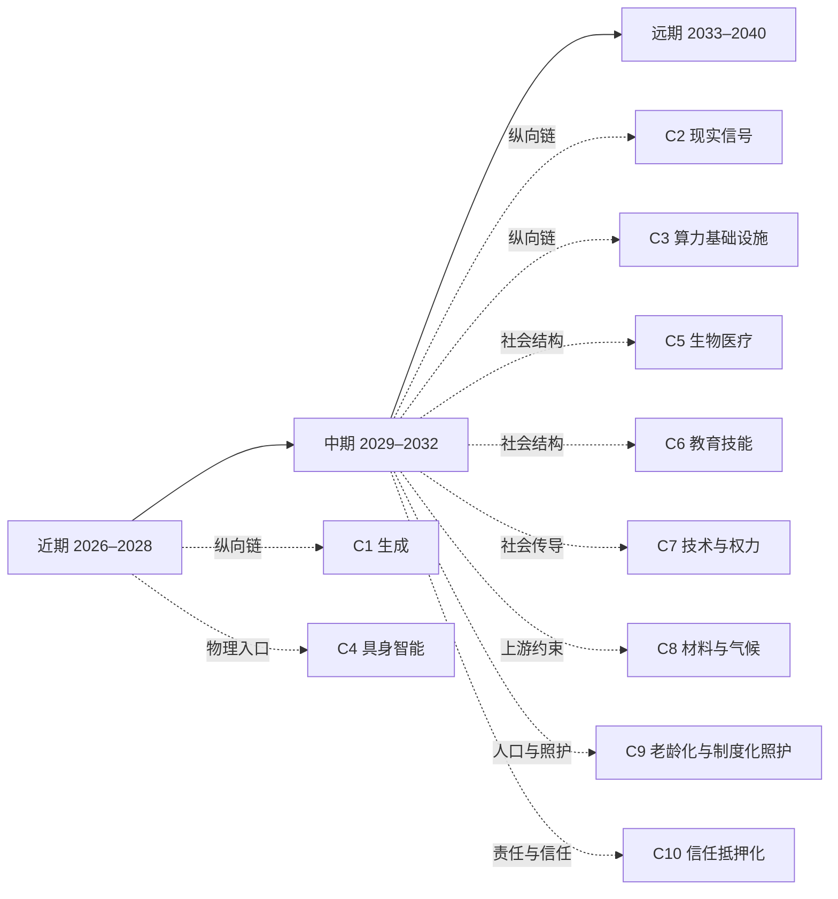

# 远期图景：2033–2040

[English version](../en/30-far.md)

[返回 README／文档地图](../../README.md)

> 先看一幕推论——不是预测，而是把中期判断往前推一格之后可能的样子。2037 年 3 月，一个海边小镇要决定三百户人家是搬还是留，而这件事的对错要到 2040 年前后才看得出来。方案不缺：系统给出的迁移与加固组合多到没人再数，每一套都配了三十年的反事实推演、分期方案和赔付模型，任何一套都能在十分钟内读懂。镇上的日常工程调度早就按授权边界在跑，没有人再逐步批准什么。会议室里那七个人花掉的四个小时，几乎没有用在比较方案上——那部分早就做完了。他们在定的是别的：放弃哪些选项，以及万一错了，到那时谁还在这里收拾。
>
> 最关键的那项输入，系统给不了：这段海岸线在接下来两年每一场风暴里的真实表现，不是模型不够好，是这两年还没过去。它要求有人在两年里每周同一天去同一片滩涂站一个小时，一百来次，中间不能断，记录上还得有名字和日期，否则到那时没人会认。另一件系统替不了的事更安静：七个人各自的代理都参加过之前那二十次会议，记得每一句话，可以被复制、暂停、迁移到别人名下；坐在这里的七个人不能。让这份同意真正成立的，恰恰是这种“不能”——到那时必须还有人在场，并且认这件事。
>
> 散会时有人问其中一位，为什么是你去看滩涂。她说：因为这件事里，只有这一件别人替我做了就不算数。
>
> 远期的形状大致就是这样：可生成的那一侧（方案、解释、陪伴、身份）继续变多，而“谁放弃了别的选项、谁在场、谁到时候还认账”这一侧既没有变多，也没有变便宜。以下六段沿这条裂缝展开。远期不是把近期趋势画成一条直线，而是检查承重墙：如果中期判断成立，人与组织会被迫重新安排什么？本层每段都明确依赖、分叉和行动边界。低置信度判断保留为结构图景，不伪装成预测。
>
> 远期还没有专属的推演链。这一层每一段都踩在中期判断上，想看这些依赖从哪里来，回到[中期图景 2029–2032](20-mid.md)。

## 阅读导航图（关系投影）

本图只提供近／中／远三页与推演链的阅读入口，不新增判断，也不替代 `J-NNN` 台账。时间层是粗粒度阅读容器；因果依赖请回到台账的 `depends-on`。

> 本图是阅读辅助，不是新的事实源。箭头表示推荐入口而非必然因果。

## 1. 执行与基础设施：人类从逐步操作转向授予边界

如果 [J-031](90-ledger.md#j-031--可暂停可回放可回滚的行动环境成为长程-ai-执行的准入条件) 的可回滚环境、[J-032](90-ledger.md#j-032--授权审查与异常升级比执行步骤更稀缺) 的授权审查，以及 [J-014](90-ledger.md#j-014--可演练环境晚于单工具接入) 的可演练环境在中期形成，2033–2040 年高价值 AI 的主要界面可能不再是“请系统做这一步”，而是“在这些边界内行动，结果由谁负责”。

- **第一问：什么变丰富**：跨工具、跨组织、跨时间的代理执行，以及对任务的连续监控。
- **第二问：因此什么变稀缺**：人能理解的授权边界、真正可撤销的责任、以及能吸收事故的组织位置。
- **第三问：新稀缺能否被同一股力量自动化**：权限描述、计划和异常分类可以被同一股自动化力量扩张；现实损害、法律责任和身体后果仍受法律／责任与物理硬约束，不能被复制成无成本供给。
- **所以现在可以做什么**：把代理权限写成可审计、可暂停、可回滚的边界；在购买更长自主权限前，先建立事故演练和人工升级路径。
- **判断边界**：这是低置信度的结构图景。若高保真模拟在高责任场景中长期替代现实观测，或事故率在没有独立干预的情况下持续下降，本段需重写。对应判断为 [J-043](90-ledger.md#j-043--高价值代理执行可能转向边界授权而非逐步操作仅图景) 与 [J-044](90-ledger.md#j-044--可吸收事故的责任位置成为代理基础设施的承重墙仅图景)。

> **范围标签 · 闸一**：本段引用的 J-014, J-031, J-032, J-043, J-044 已判为职业／组织性判断；受众天花板由所引卡片定义，不作社会级趋势断言。完整判据见[历史回顾 · 闸一](01-retrospect.md#七用这道闸检验我们自己写过的东西)，逐卡依据见[判断台账 · 检查日志](90-ledger.md#八检查日志)。

## 2. 信息与内容：表达无限，未经安排的现实成为稀有输入

如果 [J-033](90-ledger.md#j-033--真实干预的可验证记录比解释本身更有价值) 的真实干预记录和 [J-034](90-ledger.md#j-034--合成证据先在低责任场景获准高责任场景仍要求现实试验) 的责任分层成立，远期内容产业的核心可能从“谁生成得更像”转向“谁实际观察、干预并承担结果”。合成内容不是消失，而是变成探索和解释现实的廉价底层。

- **第一问：什么变丰富**：可回放的历史、人格、场景、解释与反事实模拟。
- **第二问：因此什么变稀缺**：没有被生成器预先安排的现场、共同经历、时间流逝中的原始信号，以及可追责的因果记录。
- **第三问：新稀缺能否被同一股力量自动化**：合成、压缩和重混会继续自动扩张；物理在场、产权、责任与不可回放的时间是硬约束，不能由更多 token 自动制造。
- **所以现在可以做什么**：保存原始观察、采集条件、责任主体和二次解释的分层记录；凡是高责任用途，先问“谁在现场、谁干预、谁赔付”。
- **判断边界**：低置信度。若高责任领域普遍接受合成证据且事故率不升，真实现场的溢价判断应撤回。对应判断为 [J-045](90-ledger.md#j-045--合成表达越丰富未经安排的现实观察越稀缺仅图景) 与 [J-046](90-ledger.md#j-046--高责任场景仍为现场因果记录保留溢价仅图景)。

> **范围标签 · 闸一**：本段引用的 J-033, J-034, J-045, J-046 已判为职业／组织性判断；受众天花板由所引卡片定义，不作社会级趋势断言。完整判据见[历史回顾 · 闸一](01-retrospect.md#七用这道闸检验我们自己写过的东西)，逐卡依据见[判断台账 · 检查日志](90-ledger.md#八检查日志)。

## 3. 人与 AI：最亲密的对象可能最不对称

如果 [J-041](90-ledger.md#j-041--ai-先扩大弱关系的协调半径) 的弱关系协调扩张与 [J-042](90-ledger.md#j-042--共同经历与身体在场仍是强关系容量上限仅图景) 的身体在场上限持续，AI 可能成为最长期、最耐心、也最容易复制的互动对象。问题不只是“AI 像不像人”，而是双方的记忆、耐心、复制性和拒绝能力并不对称。

- **第一问：什么变丰富**：随时可回应的陪伴、长期记忆、个性化情绪镜像，以及可暂停、复制、迁移的关系代理。
- **第二问：因此什么变稀缺**：不可复制的互惠、由有限生命赋予的承诺、对方真正拒绝你的自由，以及共同承担风险的关系。
- **第三问：新稀缺能否被同一股力量自动化**：话术、提醒、记忆检索与人格风格可以规模化；身体在场、法律主体性、共同风险和真正的拒绝不能被同一股力量无成本复制。
- **所以现在可以做什么**：在产品和家庭规则中明确哪些互动是工具服务、哪些承诺必须由人类主体确认；保留数据可迁移、关系可退出和真实授权记录。
- **判断边界**：这是低置信度、仅图景。若制度承认可复制 AI 为完整关系主体，且长期行为显示人类不再需要不可复制互惠，本段需改写。对应判断为 [J-047](90-ledger.md#j-047--ai-关系的复制性扩大陪伴供给但不可复制互惠成为稀缺仅图景) 与 [J-048](90-ledger.md#j-048--人与-ai-的授权退出与主体边界成为关系规范议题仅图景)。

> **范围标签 · 闸一**：本段引用的 J-041, J-047, J-048 已判为职业／组织性判断；受众天花板由所引卡片定义，不作社会级趋势断言。完整判据见[历史回顾 · 闸一](01-retrospect.md#七用这道闸检验我们自己写过的东西)，逐卡依据见[判断台账 · 检查日志](90-ledger.md#八检查日志)。

## 4. 人与人协作：从共同做步骤转向共同选择承诺

如果 [J-041](90-ledger.md#j-041--ai-先扩大弱关系的协调半径) 的协调半径扩大、[J-038](90-ledger.md#j-038--授权异常升级和责任岗位不会与执行步骤同速减少) 的责任岗位仍存在，AI 会处理大量翻译、排程、谈判草案和背景同步，人类只在少数不可逆的选择点共同出现。

- **第一问：什么变丰富**：跨时区、跨语言、跨组织的即时协作草案和代理谈判。
- **第二问：因此什么变稀缺**：愿意为同一个未来放弃其他选项、共同承担失败并修复冲突的人类小组。
- **第三问：新稀缺能否被同一股力量自动化**：协调文本与候选方案可以自动扩张；信任、冲突修复、共同风险与长期声誉不能一次生成。
- **所以现在可以做什么**：组织应记录“共同承担了什么”，而不只记录消息数量；把关键承诺设计成需要人类共同确认、可回溯的事件。
- **判断边界**：低置信度、仅图景。若代理之间的声誉与谈判稳定替代人类互信，强关系容量约束需重审。对应判断为 [J-049](90-ledger.md#j-049--ai-协调越丰富共同承担不可逆承诺越稀缺仅图景) 与 [J-050](90-ledger.md#j-050--人类协作的价值从共同做步骤转向共同选择承诺仅图景)。

> **范围标签 · 闸一**：本段引用的 J-038, J-041, J-049, J-050 已判为职业／组织性判断；受众天花板由所引卡片定义，不作社会级趋势断言。完整判据见[历史回顾 · 闸一](01-retrospect.md#七用这道闸检验我们自己写过的东西)，逐卡依据见[判断台账 · 检查日志](90-ledger.md#八检查日志)。

## 5. 权力与制度：答案变多，不等于行动权分散

如果 [J-039](90-ledger.md#j-039--模型租用更丰富但能源数据和渠道控制形成准入租金) 的准入租金、[J-040](90-ledger.md#j-040--能吸收-ai-事故的资产负债表成为独立稀缺) 的责任资产负债表和 [J-035](90-ledger.md#j-035--责任抵押进入重要-ai-输出的交易结构) 的责任抵押进入制度，远期权力可能围绕能源与算力、现实数据、行动授权和事故赔付四个入口重组。

- **第一问：什么变丰富**：给组织和个人的建议、预测、候选政策与模拟决策。
- **第二问：因此什么变稀缺**：能够分配真实资源、签署许可、接入关键基础设施并承担损失的制度位置。
- **第三问：新稀缺能否被同一股力量自动化**：意见、方案和论证可以无限生成；产权、国家责任、执法、资源接入与赔付能力不能同速生成。
- **所以现在可以做什么**：把“谁可以建议”“谁可以执行”“谁必须赔付”拆开记录；评估 AI 项目时同时检查输入、出口与事故损失由谁控制。
- **判断边界**：低置信度、仅图景。若开放协议持续分散关键资源与授权，且控制者不再获得结构性溢价，应撤回集中化方向。对应判断为 [J-051](90-ledger.md#j-051--建议供给丰富不会自动分散真实行动权仅图景) 与 [J-052](90-ledger.md#j-052--能源现实数据授权与赔付形成远期制度入口仅图景)。

> **范围标签 · 闸一**：本段引用的 J-035, J-039, J-040, J-052 已判为职业／组织性判断；J-051 的十亿量级是受制度安排影响的人口上限，不是每周重复执行同一动作的人数，因此保留为制度性判断与仅图景；受众天花板由所引卡片定义，不作社会级趋势断言。完整判据见[历史回顾 · 闸一](01-retrospect.md#七用这道闸检验我们自己写过的东西)，逐卡依据见[判断台账 · 检查日志](90-ledger.md#八检查日志)。

## 6. 人性、意义与身体在场：稀缺可能从物品转向承担

如果 [J-042](90-ledger.md#j-042--共同经历与身体在场仍是强关系容量上限仅图景) 的在场上限和 [J-029](90-ledger.md#j-029--需求侧锚点保持) 的需求锚点没有被新偏好彻底冲垮，远期可能出现一种反转：当答案、作品、陪伴和身份都能生成，“我亲自承担过什么”成为地位、信任和意义的来源。

- **第一问：什么变丰富**：可试的人生、可生成的成就叙事、即时安慰与可替换身份。
- **第二问：因此什么变稀缺**：不可委托的责任、真正消耗生命时间的经历、身体风险和被他人长期见证的承诺。
- **第三问：新稀缺能否被同一股力量自动化**：叙事和安慰可以自动化；生命时间、身体风险、关系信任和共同后果是硬约束。
- **所以现在可以做什么**：个人和组织不要只积累可复制的输出；为不能由代理代做的经历、承诺和在场预留时间。其余制度与商业化路径目前**仅图景**，不应包装成商机。
- **判断边界**：这是最低置信度的出口 B 图景。若新一代人普遍不再把真实经历、责任和在场视为价值来源，相关判断必须撤回或重写。对应判断为 [J-053](90-ledger.md#j-053--当可生成物普遍丰富个人承担过什么可能成为意义信号仅图景) 与 [J-054](90-ledger.md#j-054--不可委托的时间身体风险与长期承诺保持需求侧稀缺仅图景)。

## 远期的诚实边界与未覆盖清单

远期不是已完成的全方位预言。能源与物理基础设施、生物医疗、教育与资格、地缘制度、法律与产权的完整链条仍需独立推演；人与 AI 的具体关系规范也不能从技术能力直接推出。缺口保留在 [台账「六、未覆盖维度缺口清单」](90-ledger.md#六未覆盖维度缺口清单)，不能因为本层有结构图景就静默删除。远期判断的用途，是告诉读者当前哪些判断是承重墙，以及下一轮该从哪里补证据。
