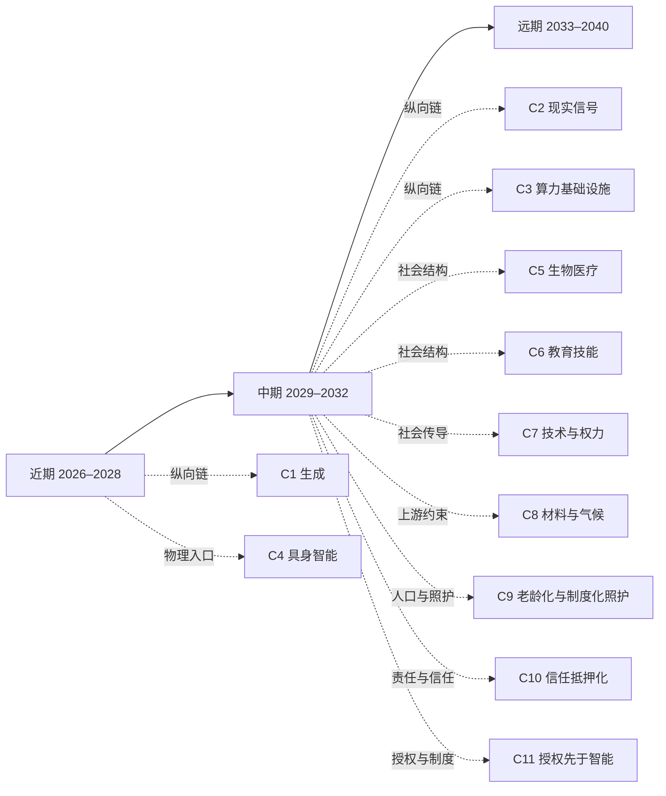

# 远期图景：2033–2040

[English version](../en/30-far.md)

[返回 README／文档地图](../../README.md)

> 先看一幕推论——不是预测，而是把中期判断往前推一格之后可能的样子。2037 年 3 月，一个海边小镇要决定三百户人家是搬还是留，而这件事的对错要到 2040 年前后才看得出来。方案不缺：系统给出的迁移与加固组合多到没人再数，每一套都配了三十年的反事实推演、分期方案和赔付模型，任何一套都能在十分钟内读懂。镇上的日常工程调度早就按授权边界在跑，没有人再逐步批准什么。会议室里那七个人花掉的四个小时，几乎没有用在比较方案上——那部分早就做完了。他们在定的是别的：放弃哪些选项，以及万一错了，到那时谁还在这里收拾。
>
> 最关键的那项输入，系统给不了：这段海岸线在接下来两年每一场风暴里的真实表现，不是模型不够好，是这两年还没过去。它要求有人在两年里每周同一天去同一片滩涂站一个小时，一百来次，中间不能断，记录上还得有名字和日期，否则到那时没人会认。另一件系统替不了的事更安静：七个人各自的代理都参加过之前那二十次会议，记得每一句话，可以被复制、暂停、迁移到别人名下；坐在这里的七个人不能。让这份同意真正成立的，恰恰是这种“不能”——到那时必须还有人在场，并且认这件事。
>
> 散会时有人问其中一位，为什么是你去看滩涂。她说：因为这件事里，只有这一件别人替我做了就不算数。
>
> 远期的形状大致就是这样：可生成的那一侧（方案、解释、陪伴、身份）继续变多，而“谁放弃了别的选项、谁在场、谁到时候还认账”这一侧既没有变多，也没有变便宜。下面第 1–6 节沿这条裂缝展开：远期不是把近期趋势画成一条直线，而是检查承重墙——如果中期判断成立，人与组织会被迫重新安排什么？3.1、4.1 与第 7 节不沿这条裂缝走，而是从别的起点重看同一批对象（见下一段）。本层每段都明确依赖、分叉和行动边界。低置信度判断保留为结构图景，不伪装成预测。
>
> 远期还没有专属的推演链。第 1–6 节都踩在中期判断上，想看这些依赖从哪里来，回到[中期图景 2029–2032](20-mid.md)；3.1、4.1 与第 7 节换了入口，主要踩在 2026 年已按冻结口径数过人数的卡片和 [C9 · 人口老龄化与制度化照护](chains/90-aging-care-and-institutional-substitution.md) 上：4.1 与第 7 节的机制不以 AI 为前提；3.1 的对象本身就是 AI，它换掉的是规模与边界判定的起点，「问」这项能力本身仍踩在推理成本上（见该节）。

## 阅读导航图（关系投影）

本图只提供近／中／远三页与推演链的阅读入口，不新增判断，也不替代 `J-NNN` 台账。时间层是粗粒度阅读容器；因果依赖请回到台账的 `depends-on`。

> 本图是阅读辅助，不是新的事实源。箭头表示推荐入口而非必然因果。

## 1. 执行与基础设施：人类从逐步操作转向授予边界

如果 [J-031](ledger/31-40.md#j-031--可暂停可回放可回滚的行动环境成为长程-ai-执行的准入条件) 的可回滚环境、[J-032](ledger/31-40.md#j-032--授权审查与异常升级比执行步骤更稀缺) 的授权审查，以及 [J-014](ledger/11-20.md#j-014--可演练环境晚于单工具接入) 的可演练环境在中期形成，2033–2040 年高价值 AI 的主要界面可能不再是“请系统做这一步”，而是“在这些边界内行动，结果由谁负责”。

- **第一问：什么变丰富**：跨工具、跨组织、跨时间的代理执行，以及对任务的连续监控。
- **第二问：因此什么变稀缺**：人能理解的授权边界、真正可撤销的责任、以及能吸收事故的组织位置。
- **第三问：新稀缺能否被同一股力量自动化**：权限描述、计划和异常分类可以被同一股自动化力量扩张；现实损害、法律责任和身体后果仍受法律／责任与物理硬约束，不能被复制成无成本供给。
- **所以现在可以做什么**：把代理权限写成可审计、可暂停、可回滚的边界；在购买更长自主权限前，先建立事故演练和人工升级路径。
- **判断边界**：这是低置信度的结构图景。若高保真模拟在高责任场景中长期替代现实观测，或事故率在没有独立干预的情况下持续下降，本段需重写。对应判断为 [J-043](ledger/41-50.md#j-043--高价值代理执行可能转向边界授权而非逐步操作仅图景) 与 [J-044](ledger/41-50.md#j-044--可吸收事故的责任位置成为代理基础设施的承重墙仅图景)。

> **范围标签 · 闸一**：本段引用的 J-014, J-031, J-032, J-043, J-044 已判为职业／组织性判断；受众天花板由所引卡片定义，不作社会级趋势断言。完整判据见[历史回顾 · 闸一](01-retrospect.md#七用这道闸检验我们自己写过的东西)，逐卡依据见[判断台账 · 检查日志](90-ledger.md#八检查日志)。

## 2. 信息与内容：表达无限，未经安排的现实成为稀有输入

如果 [J-033](ledger/31-40.md#j-033--真实干预的可验证记录比解释本身更有价值) 的真实干预记录和 [J-034](ledger/31-40.md#j-034--合成证据先在低责任场景获准高责任场景仍要求现实试验) 的责任分层成立，远期内容产业的核心可能从“谁生成得更像”转向“谁实际观察、干预并承担结果”。合成内容不是消失，而是变成探索和解释现实的廉价底层。

- **第一问：什么变丰富**：可回放的历史、人格、场景、解释与反事实模拟。
- **第二问：因此什么变稀缺**：没有被生成器预先安排的现场、共同经历、时间流逝中的原始信号，以及可追责的因果记录。
- **第三问：新稀缺能否被同一股力量自动化**：合成、压缩和重混会继续自动扩张；物理在场、产权、责任与不可回放的时间是硬约束，不能由更多 token 自动制造。
- **所以现在可以做什么**：保存原始观察、采集条件、责任主体和二次解释的分层记录；凡是高责任用途，先问“谁在现场、谁干预、谁赔付”。
- **判断边界**：低置信度。若高责任领域普遍接受合成证据且事故率不升，真实现场的溢价判断应撤回。对应判断为 [J-045](ledger/41-50.md#j-045--合成表达越丰富未经安排的现实观察越稀缺仅图景) 与 [J-046](ledger/41-50.md#j-046--高责任场景仍为现场因果记录保留溢价仅图景)。

> **范围标签 · 闸一**：本段引用的 J-033, J-034, J-045, J-046 已判为职业／组织性判断；受众天花板由所引卡片定义，不作社会级趋势断言。完整判据见[历史回顾 · 闸一](01-retrospect.md#七用这道闸检验我们自己写过的东西)，逐卡依据见[判断台账 · 检查日志](90-ledger.md#八检查日志)。

## 3. 人与 AI：最亲密的对象可能最不对称

如果 [J-041](ledger/41-50.md#j-041--ai-先扩大弱关系的协调半径) 的弱关系协调扩张与 [J-042](ledger/41-50.md#j-042--共同经历与身体在场仍是强关系容量上限仅图景) 的身体在场上限持续，AI 可能成为最长期、最耐心、也最容易复制的互动对象。问题不只是“AI 像不像人”，而是双方的记忆、耐心、复制性和拒绝能力并不对称。

- **第一问：什么变丰富**：随时可回应的陪伴、长期记忆、个性化情绪镜像，以及可暂停、复制、迁移的关系代理。
- **第二问：因此什么变稀缺**：不可复制的互惠、由有限生命赋予的承诺、对方真正拒绝你的自由，以及共同承担风险的关系。
- **第三问：新稀缺能否被同一股力量自动化**：话术、提醒、记忆检索与人格风格可以规模化；身体在场、法律主体性、共同风险和真正的拒绝不能被同一股力量无成本复制。
- **所以现在可以做什么**：在产品和家庭规则中明确哪些互动是工具服务、哪些承诺必须由人类主体确认；保留数据可迁移、关系可退出和真实授权记录。
- **具体行动路径（非商业、低置信度示例）**：当一个家庭把连续陪伴或照护提醒交给可复制的 AI 时，先由被陪伴者本人选择用途、可访问的人和一键暂停联系人；当 AI 要代本人向家人发消息、给出健康建议或作出承诺时，必须由本人确认，确认后的记录可导出。若撤销后代理仍继续联系、历史无法导出，或家人把代理的话误当成本人的承诺，家庭立即暂停该代理、通知相关人并改由真人确认；这些失败后果可以通过撤回是否生效、误认事件和关系修复时间观察，而不是把规则存在本身当成趋势证据。
- **判断状态**：以上行动路径服务于低置信度的 J-047/J-048 仅图景，不是对普遍使用方式的预测，也不是商业机会主张。
- **判断边界**：这是低置信度、仅图景。若制度承认可复制 AI 为完整关系主体，且长期行为显示人类不再需要不可复制互惠，本段需改写。对应判断为 [J-047](ledger/41-50.md#j-047--ai-关系的复制性扩大陪伴供给但不可复制互惠成为稀缺仅图景) 与 [J-048](ledger/41-50.md#j-048--人与-ai-的授权退出与主体边界成为关系规范议题仅图景)。

> **范围标签 · 闸一**：本段引用的 J-041 已判为职业／组织性判断；J-042、J-047、J-048 为仅图景（J-042 卡面闸一写「过」，只说明规模轴，社会级书写许可未授予，冲突已在[社会级判断登记页第五节](91-social-scale-register.md#五本页不改判这些矛盾已登记待裁)登记待裁）；受众天花板由所引卡片定义，不作社会级趋势断言。完整判据见[历史回顾 · 闸一](01-retrospect.md#七用这道闸检验我们自己写过的东西)，逐卡依据见[判断台账 · 检查日志](90-ledger.md#八检查日志)。

### 3.1 换一个起点：已经到了社会级的人与 AI 关系，是「问」

上面这段从 J-041 的协调半径起手，而 J-041 一路踩回「单位推理成本下降」——只从那里起手，正是[方法论](00-method.md#1-合法的推理起点)判为主轴错误的单一起点。这里换起点重看同一个对象：**人性规律**（[L8](00-method.md#l8--人性与需求) 的「确定性」与「责任归属」两个锚）和**历史规律**（新习惯先搭在早已存在的载体上，见[历史回顾 · 闸三](01-retrospect.md#闸三--没有人会为一件事单独修一条路)），外加**代理制度**——谁可以以谁的名义行事，见 [C11 · 授权先于智能](chains/110-authority-before-intelligence.md)。代理制度在 L1–L9 中没有承载透镜，承载它的是闸四，见[五类起点与透镜的对应表](00-method.md#五类起点与-l1l9-的对应表)。

需要交代一层依赖：下面唯一过闸一的 J-103，卡片写明依赖 [J-001](ledger/01-10.md#j-001--同等能力的单位推理成本继续下降)（推理成本继续下降）——「问」能做、能免费，确实踩在推理成本上。这里换掉的不是能力从哪来，而是两个判定从哪来：「问」是否到了社会级，由冻结口径下的计数和既有载体（闸三）回答；它为什么停在「问」、不到「拍板」，由 L8 的「确定性」与「责任归属」回答。

**一个场景（示例，不是统计）**：一家小五金店的记账员，一周向手机里的通用助手问七八次——新的开票规定怎么填、催款信怎么写才不伤和气、孩子夜里发烧要不要去急诊。她从不让它替自己给供应商付款，也不让它替自己回老板的消息：问错了，她再查一遍就行；付错了、说错了，总得有个人认账，而那个人只能是她。同一个晚上，她上初中的女儿在一个角色扮演应用里，和一个虚构角色聊了半小时。

这两个人做的是两种不同的动作。按本仓库已用冻结口径数过的人数看，2026 年人与 AI 的关系分成三层，层与层之间差着数量级（场景人物只示意动作，不代表她们落在下面哪一个计数里：9 亿来自单一服务的自报，那项服务覆盖哪些国家和地区，不在本仓库的取证范围内）：

- **「问」已经是社会级动作**：7 天内至少一次主动向通用 AI 助手提问或交办任务，单一服务自报周活超 9 亿，过了亿级周频门槛（[J-103](ledger/103-110.md#j-103--社会级的-ai-动作是问不是拍板亿级周频靠免费档撑住)，置信度中；下限来自自报、未经审计）。它搭的载体是早已在口袋里的手机和浏览器，没有人为它单独修路。
- **可数的陪伴应用，可见上限在千万级**：与陪伴／角色类应用做情感陪伴式对话，可见上限是 Character.AI 自报的月活两千万出头，闸一否决（[社会动作判定 §3](../evidence/social-action-verdict-2026-10-10.md#3-必须判否的候选逐条判定)）。这只是一家服务的自报，没有任何时间序列能说明它「停住了」；在通用助手里做陪伴式对话，是另一个没有冻结、也没有分母的动作，不在这个数里（见 J-047 的「为何停在仅图景」）。
- **替人付钱、替人拍板，还没有分母**：「把一次购物或订票交给 AI 代为下单付款」找不到任何平台公布的周活人数，同样闸一否决；在高责任场景里，代理先长成挂在某个人或机构责任之下、可以撤回的分级授权（[J-098](ledger/96-102.md#j-098--授权先于智能高责任场景先形成可撤回的分级代理)，制度／职业性，置信度中）。

所以上一段说的「最亲密的对象可能最不对称」，在能数到的范围内，先落在可数的、千万级的陪伴应用使用者和百万级的高责任岗位身上，而不是落在每一个人身上。把「问」写成社会级有分母撑着；把「与 AI 建立亲密关系」写成社会级，目前没有。

**本对象名下的卡片：档位，以及停在这里的原因**

| 卡 | 主张（简） | 状态与置信度 | 受众量级与身份 | 闸一 | 停在这里的具体原因 |
|---|---|---|---|---|---|
| [J-103](ledger/103-110.md#j-103--社会级的-ai-动作是问不是拍板亿级周频靠免费档撑住) | 社会级的 AI 动作是「问」不是「拍板」 | 可用判断 · 中 | 亿量级 · 7 天内主动提问或交办任务的去重个人 | 过 | 证据强度：分母是单一服务的自报下限，未经审计 |
| [J-098](ledger/96-102.md#j-098--授权先于智能高责任场景先形成可撤回的分级代理) | 高责任场景先形成可撤回的分级代理 | 可用判断 · 中 | 百万量级以内 · 高责任岗位、合规人员与公共机构；千万量级影响面 | 不过（制度／职业性） | 授权与责任是低频的组织动作，不存在社会级周频分母 |
| [J-047](ledger/41-50.md#j-047--ai-关系的复制性扩大陪伴供给但不可复制互惠成为稀缺仅图景) | 复制性扩大陪伴供给，不可复制互惠变稀缺 | 仅图景 · 低 | 卡面亿量级是影响面；可数的陪伴应用使用者上限在千万量级 | 不过 | 缺可数动作；分母只有上限 |
| [J-048](ledger/41-50.md#j-048--人与-ai-的授权退出与主体边界成为关系规范议题仅图景) | 授权、退出与主体边界成为关系规范议题 | 仅图景 · 低 | 卡面亿量级是影响面；授权一面已由 J-098 承担 | 不过 | 个人与家庭一面缺分母：没有把「AI 关系数据与退出」单列成类的登记 |

两张「仅图景」卡的原因，已写进各自卡片的「为何停在仅图景」字段。

> **范围标签 · 闸一**：本小节只有 J-103 过闸一，能以社会级口吻书写的只是「问」这一个动作；J-098 为制度／职业性判断，J-047、J-048 为仅图景，不得借本小节取得社会级口吻。

## 4. 人与人协作：从共同做步骤转向共同选择承诺

如果 [J-041](ledger/41-50.md#j-041--ai-先扩大弱关系的协调半径) 的协调半径扩大、[J-038](ledger/31-40.md#j-038--授权异常升级和责任岗位不会与执行步骤同速减少) 的责任岗位仍存在，AI 会处理大量翻译、排程、谈判草案和背景同步，人类只在少数不可逆的选择点共同出现。

- **第一问：什么变丰富**：跨时区、跨语言、跨组织的即时协作草案和代理谈判。
- **第二问：因此什么变稀缺**：愿意为同一个未来放弃其他选项、共同承担失败并修复冲突的人类小组。
- **第三问：新稀缺能否被同一股力量自动化**：协调文本与候选方案可以自动扩张；信任、冲突修复、共同风险与长期声誉不能一次生成。
- **所以现在可以做什么**：组织应记录“共同承担了什么”，而不只记录消息数量；把关键承诺设计成需要人类共同确认、可回溯的事件。
- **具体行动路径（非商业、低置信度示例）**：当一个社区或工作小组准备让代理替它谈成一项不可逆承诺（例如共同照护排班、共享空间改造或长期志愿项目）时，代理先把成本、退出日期、替代人选和最坏后果发给每位成员；只有达到事先约定的成员数、每人分别确认后，承诺才生效。每月一次由真人共同检查兑现情况；有人退出或关键条件变化时，代理只能发起重谈，不能静默沿用旧授权。若事后有人否认自己承担过责任、无人接替退出者，或冲突超过约定修复期限，项目就记录为失败并暂停下一步执行；可观察的不是消息量，而是共同确认率、退出后的接替时间和冲突修复时间。
- **判断状态**：以上行动路径服务于低置信度的 J-049/J-050 仅图景，不是对组织协作方式已经普及的预测，也不是商业机会主张。
- **判断边界**：低置信度、仅图景。若代理之间的声誉与谈判稳定替代人类互信，强关系容量约束需重审。对应判断为 [J-049](ledger/41-50.md#j-049--ai-协调越丰富共同承担不可逆承诺越稀缺仅图景) 与 [J-050](ledger/41-50.md#j-050--人类协作的价值从共同做步骤转向共同选择承诺仅图景)。

> **范围标签 · 闸一**：本段引用的 J-038、J-041 已判为职业／组织性判断；J-049、J-050 为仅图景（闸一不过）；受众天花板由所引卡片定义，不作社会级趋势断言。完整判据见[历史回顾 · 闸一](01-retrospect.md#七用这道闸检验我们自己写过的东西)，逐卡依据见[判断台账 · 检查日志](90-ledger.md#八检查日志)。

### 4.1 换一个起点：一次被迫的大实验之后，协作停在了「混合」

上面这段同样从 J-041 起手。这里换三个起点重看：**历史规律**（2020 年的强制居家是一次规模空前的自然实验；[L4](00-method.md#l4--扩散滞后) 用来把它之后的平台期写成时间窗）、**人性规律**（[L8](00-method.md#l8--人性与需求) 的「在场感」与「真实关系」两个锚）、**供需关系**（经 [L3](00-method.md#l3--成本结构)：到岗天数由雇主按协调与监督成本决定；按[对应表](00-method.md#五类起点与-l1l9-的对应表)，L3 对供需是「延伸」，没有条文源句）。这条机制里没有 AI。

**一个场景（示例，不是统计）**：一个九人的产品小组分在三座城市。2020 年春天被迫全员居家，几个月内视频会议就成了日常——载体是早已装在每台电脑上的摄像头和家里的宽带，没有人为它单独修路。到 2025 年，公司把规矩定成每周两天到岗。小组自己慢慢分出了两类事：排期、代码评审和例行同步留在线上；季度规划、决定砍掉一条产品线、事故复盘，大家宁可等到同一天坐进同一间屋子。这个分法只是场景——本仓库没有任何数据证明多数团队这样分。

能数到的是另一件事：「参照周内至少一部分有酬工作在自己家里完成」按冻结口径，美、英、新三国合格分量合计约 4,800 万，停在千万量级的分众档；美国在岗者的远程率 2023 年后进入平台期；在不在家，主要由雇主决定，而不是由本人决定（[J-104](ledger/103-110.md#j-104--居家有酬工作停在分众档千万级周频2023-年后进入平台期去留由雇主决定)，置信度中）。也就是说：载体早已就位、大批可以在家完成的工作被迫试过一遍之后，协作的一部分离开了同一间屋子，但没有整体离开，留下多少由组织按成本定。这是本仓库目前关于「人与人协作方式」最硬的一条可用判断，它不从 AI 起手。但要说清它量的是什么：J-104 数的是人**在哪里**工作，不是人**怎样**协作。它的机制也和上一段不同，而且彼此竞争：上一段设想人类只在少数不可逆的选择点共同出现，是「选择点」决定谁同处一室；J-104 说的是雇主按协调与监督成本定到岗天数，是「成本账」决定谁同处一室。在这条非 AI 前例里，只能看到一个和上一段形状相近的影子，不能当作它的证据；如果成本账才是决定性的力量，同处一室的时间会跟着成本走，而不是跟着选择点走。

**本对象名下的卡片：档位，以及停在这里的原因**

| 卡 | 主张（简） | 状态与置信度 | 受众量级与身份 | 闸一 | 停在这里的具体原因 |
|---|---|---|---|---|---|
| [J-104](ledger/103-110.md#j-104--居家有酬工作停在分众档千万级周频2023-年后进入平台期去留由雇主决定) | 居家有酬工作停在分众档，去留由雇主决定 | 可用判断 · 中 | 千万量级 · 参照周内部分有酬工作在家完成的在岗者（美英新合计约 4,800 万） | 不过（D 档，分众） | 规模停在千万级；口径偏宽，欧盟基数未取得 |
| [J-038](ledger/31-40.md#j-038--授权异常升级和责任岗位不会与执行步骤同速减少) | 授权、异常升级与责任岗位不随执行步骤同速减少 | 可用判断 · 中 | 构造式亿量级上限 · 组织中的责任岗位、监督者与专业者 | 不过（职业／组织性） | 亿量级是按职业构造的上限，不是统计 |
| [J-041](ledger/41-50.md#j-041--ai-先扩大弱关系的协调半径) | AI 先扩大弱关系的协调半径 | 可用判断 · 中 | 构造式亿量级上限 · 数字沟通者与组织协调者 | 不过（职业／组织性） | 同上 |
| [J-049](ledger/41-50.md#j-049--ai-协调越丰富共同承担不可逆承诺越稀缺仅图景) | 协调越丰富，共同承担不可逆承诺越稀缺 | 仅图景 · 低 | 卡面亿量级是影响面 | 不过 | 缺可数动作；缺历史对照组 |
| [J-050](ledger/41-50.md#j-050--人类协作的价值从共同做步骤转向共同选择承诺仅图景) | 协作价值从共同做步骤转向共同选择承诺 | 仅图景 · 低 | 卡面亿量级是影响面 | 不过 | 缺领先指标的数据源；前提「代理吸收大部分协调」尚未发生 |

两张「仅图景」卡的原因，已写进各自卡片的「为何停在仅图景」字段。

> **范围标签 · 闸一**：本小节没有一张卡过闸一。J-104 是千万量级的分众判断，J-038、J-041 为职业／组织性判断，J-049、J-050 为仅图景；都不得以社会级口吻引用。

## 5. 权力与制度：答案变多，不等于行动权分散

如果 [J-039](ledger/31-40.md#j-039--模型租用更丰富但能源数据和渠道控制形成准入租金) 的准入租金、[J-040](ledger/31-40.md#j-040--能吸收-ai-事故的资产负债表成为独立稀缺) 的责任资产负债表和 [J-035](ledger/31-40.md#j-035--责任抵押进入重要-ai-输出的交易结构) 的责任抵押进入制度，远期权力可能围绕能源与算力、现实数据、行动授权和事故赔付四个入口重组。

- **第一问：什么变丰富**：给组织和个人的建议、预测、候选政策与模拟决策。
- **第二问：因此什么变稀缺**：能够分配真实资源、签署许可、接入关键基础设施并承担损失的制度位置。
- **第三问：新稀缺能否被同一股力量自动化**：意见、方案和论证可以无限生成；产权、国家责任、执法、资源接入与赔付能力不能同速生成。
- **所以现在可以做什么**：把“谁可以建议”“谁可以执行”“谁必须赔付”拆开记录；评估 AI 项目时同时检查输入、出口与事故损失由谁控制。
- **判断边界**：低置信度、仅图景。若开放协议持续分散关键资源与授权，且控制者不再获得结构性溢价，应撤回集中化方向。对应判断为 [J-051](ledger/51-60.md#j-051--建议供给丰富不会自动分散真实行动权仅图景) 与 [J-052](ledger/51-60.md#j-052--能源现实数据授权与赔付形成远期制度入口仅图景)。

> **范围标签 · 闸一**：本段引用的 J-035, J-039, J-040, J-052 已判为职业／组织性判断；J-051 的十亿量级是受制度安排影响的人口上限，不是每周重复执行同一动作的人数，因此保留为制度性判断与仅图景；受众天花板由所引卡片定义，不作社会级趋势断言。完整判据见[历史回顾 · 闸一](01-retrospect.md#七用这道闸检验我们自己写过的东西)，逐卡依据见[判断台账 · 检查日志](90-ledger.md#八检查日志)。

## 6. 人性、意义与身体在场：稀缺可能从物品转向承担

如果 [J-042](ledger/41-50.md#j-042--共同经历与身体在场仍是强关系容量上限仅图景) 的在场上限和 [J-029](ledger/21-30.md#j-029--需求侧锚点保持) 的需求锚点没有被新偏好彻底冲垮，远期可能出现一种反转：当答案、作品、陪伴和身份都能生成，“我亲自承担过什么”成为地位、信任和意义的来源。

> **范围标签 · 降级（2026-10-09 隔离盲判复审）**：本段作为前提引用的 J-029 已被口径降级（首轮盲判 `R1-65` 以闸二否决，卡片状态 `REVISED`），只能按制度／人性常数类判断阅读；本节的反转图景不得借 J-029 取得社会级口吻。依据见 [J-029 卡片](ledger/21-30.md#j-029--需求侧锚点保持)与[隔离盲判复审第 5 节](../evidence/blind-review-reaudit-2026-10-09.md#5-唯一的新降级j-029)。

- **第一问：什么变丰富**：可试的人生、可生成的成就叙事、即时安慰与可替换身份。
- **第二问：因此什么变稀缺**：不可委托的责任、真正消耗生命时间的经历、身体风险和被他人长期见证的承诺。
- **第三问：新稀缺能否被同一股力量自动化**：叙事和安慰可以自动化；生命时间、身体风险、关系信任和共同后果是硬约束。
- **所以现在可以做什么**：个人和组织不要只积累可复制的输出；为不能由代理代做的经历、承诺和在场预留时间。其余制度与商业化路径目前**仅图景**，不应包装成商机。
- **判断边界**：这是最低置信度的出口 B 图景。若新一代人普遍不再把真实经历、责任和在场视为价值来源，相关判断必须撤回或重写。对应判断为 [J-053](ledger/51-60.md#j-053--当可生成物普遍丰富个人承担过什么可能成为意义信号仅图景) 与 [J-054](ledger/51-60.md#j-054--不可委托的时间身体风险与长期承诺保持需求侧稀缺仅图景)。

## 7. 社会关系（以家庭照护为例）：先变的是谁来做，而不是关系还在不在

前面几段谈到社会关系时，都从「AI 让什么变丰富」起手。这一节换成不以 AI 为前提的起点，也不用「丰富→稀缺」三问：**人口结构**（老龄化 × 家庭缩小；[方法论 §2.1](00-method.md#21-不采用-l1-的示例人口家庭与照护) 把它登记为不采用 L1 的合法起点，但 L1–L9 中没有承载透镜）、**供需关系**（照护需求随寿命延长上升，家里能亲手照护的人手随家庭缩小减少；缺口由家庭、市场还是公共制度来补——即「制度替代」——只被 [L3](00-method.md#l3--成本结构) 部分承载）、**人性规律**（[L8](00-method.md#l8--人性与需求) 的「责任归属」与「真实关系」）。AI 和机器人在这里只是后来介入的工具。对 J-096 而言，把它们删掉，这条机制照样成立；J-100 不同——它以具身照护辅助稳定部署为条件，是叠在这条机制上的一层，没有部署就没有它说的那种重分配。本节只拿家庭照护这一种关系做例子：婚恋、友谊、社区与代际关系会怎样演变，本仓库还没有推演，不能从这一例推出。

**一个场景（示例，不是统计）**：2031 年，一位 58 岁的女儿在省城上班，84 岁的母亲独居在三百公里外的老家。她每周四晚上的照护是这样的：确认下周家政机构的排班，续签长期护理保险的服务授权，翻一遍夜里跌倒传感器的报警记录，然后和母亲打一个半小时的电话。每个月有一个周末她回去，自己做饭、陪着复诊、把药一格一格分好。她亲手做的照护比十年前少了，她做的授权、协调和异常决定比十年前多了——但没有人会说她不再照顾母亲了。关系没有被外包，被重新分工的是关系里的劳动。

**能数到的部分**：按 2026-10-10 的冻结口径，「每周为一位高龄、患病或失能的家人或亲友提供无酬照料」只有两个合格的周口径——美国约 2,585 万（照料 65 岁以上老人、每周至少一次）、英国约 540 万，合计约 3,100 万，在千万量级（美国数字按存档表格中的位置对应列标签，列标签未逐一核对；去掉它合计更低，否决不变，见[同一判定 §4 第 8 条](../evidence/non-ai-social-action-verdict-2026-10-10.md#4-缺口清单)），闸一否决（[不以 AI 为前提的社会动作判定 §3](../evidence/non-ai-social-action-verdict-2026-10-10.md#3-必须判否的候选逐条判定)）。这个否决有一部分来自取证覆盖：欧盟 2019 年的每周照护者约 7,000 万，参照期太早，只能作背景；中国、日本、印度没有找到合格数字。所以它说的不是「规模被证明不足一亿」，而是「能被合格调查数到的部分在千万级」。

**这一层上的判断**：[J-096](ledger/96-102.md#j-096--老龄化与家庭缩小把部分照护推向正式服务与协调层) 判断部分照护会从家庭内部的隐性义务转向正式服务、保险／公共支付与跨机构协调，但家庭亲手照护不会因此退出；[J-100](ledger/96-102.md#j-100--具身照护先重分配家庭角色而非消除家庭照护关系) 判断具身照护辅助若稳定部署，会先把家庭成员的一部分亲手执行转为授权、协调、支付与异常决策，而不是让家庭照护关系整体退出。上面那位女儿的周四晚上，就是这两张卡描述的角色。J-096 卡、[C9 链页上的 J-096 卡](chains/90-aging-care-and-institutional-substitution.md#判断卡片-1j-096)，以及[社会级判断登记页](91-social-scale-register.md)上 J-096、J-100 两行，此前写的是「百万量级（以内）」，与上面这次计数矛盾；J-100 卡此前没有给量级，只写「现有 OECD 可比调查只覆盖有限调查子群」。2026-10-10 这几处已统一改为千万量级；闸一仍不过。

- **所以现在可以做什么**：家庭可以先把照护里的授权写下来——谁能替老人签字、谁接报警电话、谁能停掉一项服务、停掉之后由谁接手；想观察这一层是否在变的人，该记的是家庭成员每周花在协调上的时间与亲手照护的时间各是多少，而不是机器人或服务的销量。
- **判断边界**：本节不另立证伪条件，以两张卡各自的为准——J-096：到 2033 年，在至少四个人口与照护统计可比的制度中，家庭照护时间、正式照护支出和协调岗位都没有向正式／协调载体移动，或移动完全由短期经济周期解释、而非人口结构与家庭规模变化；J-100：到 2035 年，在至少三个制度环境中，开放家庭照护设备持续承担三类以上跨空间任务，且家庭亲手、协调和异常决策的时长都显著下降、留存与事故率不劣于机构（只有演示或单任务设备不算推翻）。前者成立，本节的「重新分工」应撤回；后者成立，说明家庭角色不是被重分配而是被整体替代，本节应改写。

**本对象名下的卡片：档位，以及停在这里的原因**

| 卡 | 主张（简） | 状态与置信度 | 受众量级与身份 | 闸一 | 停在这里的具体原因 |
|---|---|---|---|---|---|
| [J-096](ledger/96-102.md#j-096--老龄化与家庭缩小把部分照护推向正式服务与协调层) | 部分照护从家庭隐性义务转向正式服务、支付与协调 | 可用判断 · 中 | 千万量级 · 每周至少一次亲手照护或照护协调的成年人（其中「无酬照料」一项，美英合格合计约 3,100 万） | 不过（制度／职业性） | 合格调查只覆盖少数国家，没有全球去重分母 |
| [J-100](ledger/96-102.md#j-100--具身照护先重分配家庭角色而非消除家庭照护关系) | 具身照护先重分配家庭角色 | 可用判断 · 中 | 千万量级 · 每周亲手照护、协调或设备接管的成年人（其中「无酬照料」一项美英合计约 3,100 万；设备接管尚无计数） | 不过（制度／家庭关系） | 「设备接管」这一动作还没有任何计数 |
| [J-041](ledger/41-50.md#j-041--ai-先扩大弱关系的协调半径) | AI 先扩大弱关系的协调半径 | 可用判断 · 中 | 构造式亿量级上限 · 数字沟通者与组织协调者 | 不过（职业／组织性） | 亿量级是按职业构造的上限，不是统计 |
| [J-042](ledger/41-50.md#j-042--共同经历与身体在场仍是强关系容量上限仅图景) | 共同经历与身体在场仍是强关系容量上限 | 仅图景 · 低 | 卡面十亿量级是影响面 | 卡面写「过」，只说明规模轴；社会级书写许可未授予，冲突已[登记待裁](91-social-scale-register.md#五本页不改判这些矛盾已登记待裁) | 缺历史对照组；缺领先指标的数据源 |

J-042 的原因已写进卡片自己的「为何停在仅图景」字段。

> **范围标签 · 闸一**：本节没有一张卡过闸一，且只覆盖家庭照护一种关系。照护的千万量级来自两国合格调查；J-096、J-100 为制度／职业性判断，J-041 为职业／组织性判断，J-042 为仅图景；本节不作社会级趋势断言。

## 远期的诚实边界与未覆盖清单

远期不是已完成的全方位预言。能源与物理基础设施、生物医疗、教育与资格、地缘制度、法律与产权的完整链条仍需独立推演（地缘制度的财政一侧已有 [C13 · 财政挤压](chains/130-fiscal-squeeze-who-gets-cut.md)，窗口到 2034 年，不推演远期的国家间竞争）；人与 AI 的具体关系规范也不能从技术能力直接推出。缺口保留在 [台账「六、未覆盖维度缺口清单」](90-ledger.md#六未覆盖维度缺口清单)，不能因为本层有结构图景就静默删除。远期判断的用途，是告诉读者当前哪些判断是承重墙，以及下一轮该从哪里补证据。
