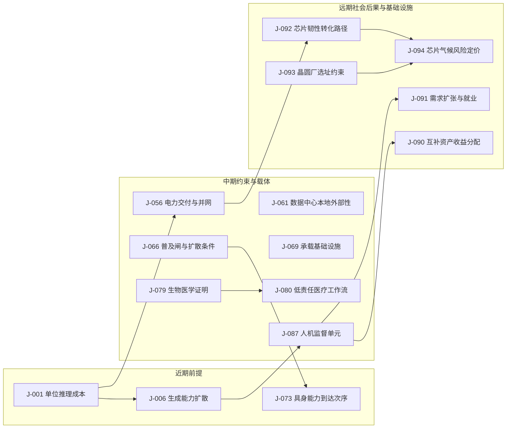

# 判断台账

[English version](../en/90-ledger.md)

> 全项目判断的唯一登记册与治理入口。叙事文档只引用 `J-NNN`；完整判断卡片按稳定编号区间分片保存在 `ledger/`，本文件保留总览、依赖、到期、来源与兼容锚点。
> 本文件记录判断如何提出、依赖、变更与复盘；被证伪的判断不删除。

---

## 目录 / 导航

- [一、如何使用本台账](#一如何使用本台账)
- [二、在册判断总览](#二在册判断总览)
- [三、depends-on 依赖链](#三depends-on-依赖链)
- [四、置信度变更史](#四置信度变更史)
- [五、到期检查流程](#五到期检查流程)
- [六、未覆盖维度缺口清单](#六未覆盖维度缺口清单)
- [七、正式判断与机会索引](#七正式判断与机会索引)
- [八、检查日志](#八检查日志)
- [九、本轮外部对照来源](#九本轮外部对照来源)
- [十、技术与跨域推演链判断卡片](#十技术与跨域推演链判断卡片)
- [十一、远期社会图景判断卡片](#十一远期社会图景判断卡片)
- [十二、发布前自检清单](#十二发布前自检清单)
- [十三、历史回顾提炼的普及闸判断卡片](#十三历史回顾提炼的普及闸判断卡片)
- [十四、C4 具身智能推演链判断卡片](#十四c4-具身智能推演链判断卡片)
- [十五、C5 生物与医疗推演链判断卡片](#十五c5-生物与医疗推演链判断卡片)
- [十六、C6 教育与技能形成推演链判断卡片](#十六c6-教育与技能形成推演链判断卡片)
- [十七、C7 技术能力次序的社会后果判断卡片](#十七c7-技术能力次序的社会后果判断卡片)
- [十八、C8 芯片上游材料与气候耦合判断卡片](#十八c8-芯片上游材料与气候耦合判断卡片)
- [十九、C9 人口老龄化与制度化照护判断卡片](#十九c9-人口老龄化与制度化照护判断卡片)
- [二十、C11 授权先于智能判断卡片](#二十c11-授权先于智能判断卡片)
- [完整判断卡片分片](ledger/01-10.md) · [J-011–J-020](ledger/11-20.md) · [J-021–J-030](ledger/21-30.md) · [J-031–J-040](ledger/31-40.md) · [J-041–J-050](ledger/41-50.md) · [J-051–J-060](ledger/51-60.md) · [J-061–J-070](ledger/61-70.md) · [J-071–J-080](ledger/71-80.md) · [J-081–J-090](ledger/81-90.md) · [J-091–J-095](ledger/91-95.md) · [J-096–J-102](ledger/96-102.md)
- [兼容导航：旧版 J-091–J-102](ledger/91-100.md) · [兼容入口：旧版 J-096–J-102](ledger/96-100.md)

## 一、如何使用本台账

### 1. 判断卡片字段

一条可检验的判断必须填写以下字段。J-001–J-086 为迁移前存量卡，可暂由「普及闸复核」承载规模信息并由脚本报警告；**J-087 起缺少独立「受众规模」字段即校验失败**。缺少其余任一项，只能标为「仅图景」，不得作为商机判断或摘要结论。

- **编号**：`J-NNN`，三位数字，全项目唯一；中英文共用，不复用已证伪或已修正的编号。
- **提出日期**：首次提出这条判断的日期，格式 `YYYY-MM-DD`。
- **一句话判断**：可在一口气内读完、能够被事实支持或推翻的命题。
- **受众规模**（J-087 起独立必填）：分别写受影响人口（会承担成本、获得服务或被制度波及的人）与实际重复执行者／行为分母（在 T 时执行同一明确定义动作、可去重计数的人）；写十万／百万／千万／亿／十亿量级、动作、时间点或区间、频次和证据来源；说明它是提高既有专业者上限，还是让原本不会的人也能做；只有构造式影响面时必须标为「影响面」，不能冒充行动人口。亿级或十亿级普及主张若缺少可核验动作、去重分母和频次，必须降级为影响面、制度／职业性判断或仅图景。
- **普及闸复核**：写明受众规模量级、受众身份、闸一结论，以及它提高既有专业者上限还是让原本不会的人也能做。
- **透镜**：列出本判断实际采用的供需关系、人性、历史规律、技术规律、社会规律或其他经校准透镜；不为框架整齐强塞未使用的透镜。
- **推理链**：从底层规律与所选透镜出发，逐步写出中间环节，不以「某机构预测」代替论证。
- **时间窗**：判断预计发生或有效的起止区间；窗口结束仍未发生时，必须检查是否证伪或修正。
- **证伪条件**：一个具体、可观察、足以使作者承认判断错误的事件或数据结果。
- **领先指标**：结果出现前应先变化的可观测信号，并写明观察频率或来源。
- **置信度**：规范值为 `高`／`中`／`低`／`低（仅图景）`；字段值不加句末标点。低置信度只能作为「仅图景」，不进入商机候选。
- **depends-on**：本判断依赖的其他 `J-NNN`；没有依赖写 `—`，不能用含糊的「见上文」代替。
- **最强反方**：最能使这条判断失效的替代机制或反例。
- **与共识**：外部对照的三要素——一致在哪里、分歧或证据边界在哪里、为何仍坚持或据此降低置信度；若本轮未完成，必须明确写「未知」。
- **外部对照来源**：支持上述对照的 `EXT-NN` 来源编号；未完成对照时明确写未完成。
- **出处**：这条判断在叙事文档或推演链中的来源链接。
- **下次检查日**：下一次复查证伪条件、领先指标与外部证据的日期。
- **状态**：`ACTIVE`（等待窗口或证据）／`HIT`（证据支持）／`FALSIFIED`（证伪条件触发）／`REVISED`（旧卡保留，但必须在状态说明中区分两类）：① **口径降级**——只收窄受众、适用范围或叙事强度，原命题仍有时间窗、证伪条件和检查日；该卡继续独立接受到期检查并进入校准分母。② **新卡取代**——状态说明必须点名继任 `J-NNN`，并明确旧卡不再单独检查；到期时随继任卡复查，但旧卡不得再作为当前判断或商机依据。不能仅凭 `REVISED` 标签判断一张卡是否退出校准。

### 2. 填写示例（仅示例，不是项目正式判断）

> **示例卡片｜EXAMPLE-J-000（明确不计入正式编号）**
> - **编号**：EXAMPLE-J-000
> - **提出日期**：2026-09-18
> - **一句话判断**：在某个假想市场中，若可重复生成方案的单位成本下降一个数量级，单纯「多给方案」的服务价值会在三年内下降。
> - **受众规模**：受影响人口＝职业买方；百万量级影响面。实际重复执行者／行为分母＝在 T 时每周至少一次提交并比较此类方案的去重职业买方；本示例没有可引用的该分母、动作频次或来源，因此不得把「百万」写成百万级普及；提高既有专业者上限；构造式示例估计。**负例**：如果只写「受影响人口＝十亿学习者、日频」，却没有定义 T 时同一动作、去重分母和频次，不能据此声称十亿人普及，只能写影响面／仅图景。
> - **普及闸复核**：示例受众为百万量级的职业买方；提高既有专业者上限，不让原本不会的人获得新动作；闸一不过。
> - **透镜**：供需关系、技术规律。
> - **推理链**：供给增加 → 方案边际成本下降 → 买方不再缺方案数量 → 价值转向取舍与验证；但这只是演示依赖写法，不代表本项目已采纳该命题。
> - **时间窗**：2026-09-18 至 2029-09-18。
> - **证伪条件**：到 2029-09-18，买方仍普遍按方案数量而非可验证结果支付溢价，且该现象不是由监管或供给受限造成。
> - **领先指标**：同类方案的单位生成成本与买方为人工筛选支付的中位数，每半年记录一次。
> - **置信度**：中（示例值）
> - **depends-on**：—
> - **最强反方**：监管、责任或稀缺输入可能使方案供给无法真正扩张，数量溢价因而保留。
> - **与共识**：未知；本示例不承担外部对照。
> - **外部对照来源**：未完成对照（示例）。
> - **出处**：本节示例。
> - **下次检查日**：2029-09-18（示例值）。
> - **状态**：ACTIVE（示例值）。

正式卡片应复制上述字段，不应复制示例的编号；示例中的内容不会自动进入判断总表。

---

## 二、在册判断总览

| ID | 提出日期 | 一句话判断 | 时间窗 | 置信度 | depends-on | 出处 | 与共识 | 状态 | 下次检查 |
|---|---|---|---|---|---|---|---|---|---|
| [J-001](#j-001--同等能力的单位推理成本继续下降) | 2026-09-18 | 同等能力的单位推理成本到 2029 年底再降一个数量级 | 2026–2029 | 高 | — | [C1](chains/10-generation-becomes-free.md) | 与方向一致，但“2029 年再降十倍”证据不足；来源支持下降通道，不支持具体数量级。 | REVISED（2026-09-20 普及闸降级为职业／组织性判断；旧卡保留） | 2027-03-31 |
| [J-002](#j-002--从海量产出中筛出客观高质量不是持久稀缺只是-24-年的窗口) | 2026-09-18 | 「筛出客观高质量」不是持久稀缺，只是 2–4 年窗口 | 至 2029 | 中 | J-001 | [C1](chains/10-generation-becomes-free.md) | 仍坚持但机制不同：客观择优可能部分内置，责任型和领域型质检仍可能保留。 | REVISED（2026-09-20 普及闸降级为职业／组织性判断；旧卡保留） | 2027-03-31 |
| [J-003](#j-003--真正持久的稀缺是关于你的私有上下文的所有权与可用形态) | 2026-09-18 | 关于个人或组织的私有上下文，其所有权与可用形态更可能成为持久稀缺 | 2027–2033 | 中 | J-001, J-002 | [C1](chains/10-generation-becomes-free.md) | 仍坚持但证据边界更窄：外部材料支持私有上下文治理权重要，不证明其必然成为持久稀缺。 | REVISED（2026-09-20 普及闸降级为职业／组织性判断；旧卡保留） | 2027-06-30 |
| [J-004](#j-004--随着-ai-从生成内容转向执行动作稀缺项是让行动可撤销的基础设施) | 2026-09-18 | 当 AI 执行动作时，让行动可撤销的基础设施会变得稀缺 | 2027–2032 | 中 | J-001 | [C1](chains/10-generation-becomes-free.md) | 部分一致：隔离、监督与恢复机制已有依据；可撤销基础设施的独立稀缺性与时间窗仍证据不足。 | REVISED（2026-09-19 机会耐久闸复核，由 J-065 收窄取代；旧卡保留） | — |
| [J-005](#j-005--生成丰富之后价值向三类不可重组的输入集中原始信号可追责承诺被验证因果) | 2026-09-18 | 原始信号、可追责承诺与被验证因果会比可复制文本更有价值 | 2029–2033 | 中 | J-001 | [C1](chains/10-generation-becomes-free.md) | 与机制一致但需收窄到高责任领域：可追溯信号与现实因果验证重要，不推出三类输入普遍升值。 | REVISED（2026-09-20 普及闸降级为职业／组织性判断；旧卡保留） | 2027-06-30 |
| [J-006](#j-006--推理吞吐先于长程自主性) | 2026-09-18 | 推理吞吐先于长程自主性 | 2026–2028 | 高 | J-001 | [技术能力演进链](05-tech-sequence.md) | 方向一致但顺序尚未证实：能力与吞吐扩张早于可靠长程代理仍是可检验假设。 | REVISED（2026-09-20 普及闸降级为职业／组织性判断；旧卡保留） | 2027-03-31 |
| [J-007](#j-007--可接续上下文先于可靠长期记忆) | 2026-09-18 | 可接续上下文先于可靠长期记忆 | 2026–2029 | 高 | J-006 | [技术能力演进链](05-tech-sequence.md) | 与方向一致但机制不同：可检索上下文常与长窗口组合，不能据此断言固定产业先后。 | REVISED（2026-09-20 普及闸降级为职业／组织性判断；旧卡保留） | 2027-03-31 |
| [J-008](#j-008--有来源的长期记忆成为可靠协作前提) | 2026-09-18 | 有来源的长期记忆成为可靠协作前提 | 2028–2031 | 中 | J-007 | [技术能力演进链](05-tech-sequence.md) | 仍坚持但机制不同：来源、版本与可修正性提高审计能力，尚未证明是所有高价值协作的必要条件。 | REVISED（2026-09-20 普及闸降级为职业／组织性判断；旧卡保留） | 2027-06-30 |
| [J-009](#j-009--受限工作流中的连续执行先成熟) | 2026-09-18 | 受限工作流中的连续执行先成熟 | 2027–2030 | 高 | J-008 | [技术能力演进链](05-tech-sequence.md) | 与共识一致：受限、可检查工作流先于开放世界自主执行，外部材料支持约束迁移而非替代原链。 | REVISED（2026-09-20 普及闸降级为职业／组织性判断；旧卡保留） | 2027-06-30 |
| [J-010](#j-010--长程自主执行晚于受限连续执行) | 2026-09-18 | 长程自主执行晚于受限连续执行 | 2029–2033 | 中 | J-009 | [技术能力演进链](05-tech-sequence.md) | 方向一致但时间窗证据不足：长程能力在增长，可靠部署仍受任务时长与成功率约束。 | REVISED（2026-09-20 普及闸降级为职业／组织性判断；旧卡保留） | 2027-06-30 |
| [J-011](#j-011--跨媒介一致性先于长时连贯性) | 2026-09-18 | 跨媒介一致性先于长时连贯性 | 2027–2030 | 中 | J-006, J-007 | [技术能力演进链](05-tech-sequence.md) | 仍坚持但证据不足：研究支持长时一致性困难，不证明跨媒介一致性必然先到。 | REVISED（2026-09-20 普及闸降级为职业／组织性判断；旧卡保留） | 2027-06-30 |
| [J-012](#j-012--跨时间连贯生成依赖状态与验证) | 2026-09-18 | 跨时间连贯生成依赖状态与验证 | 2029–2034 | 中 | J-008, J-011 | [技术能力演进链](05-tech-sequence.md) | 与机制一致但时间窗不足：长时连贯生成依赖状态保持、时空表示与持续评估。 | REVISED（2026-09-20 普及闸降级为职业／组织性判断；旧卡保留） | 2027-06-30 |
| [J-013](#j-013--可检查的工具调用先于开放环境行动) | 2026-09-18 | 可检查的工具调用先于开放环境行动 | 2027–2030 | 高 | J-009 | [技术能力演进链](05-tech-sequence.md) | 与共识一致：结构化、可检查工具调用已有产品化依据，但严格先后仍是项目判断。 | REVISED（2026-09-20 普及闸降级为职业／组织性判断；旧卡保留） | 2027-03-31 |
| [J-014](#j-014--可演练环境晚于单工具接入) | 2026-09-18 | 可演练环境晚于单工具接入 | 2028–2032 | 中 | J-009, J-013 | [技术能力演进链](05-tech-sequence.md) | 仅保留为证据不足的景观：可演练、可恢复环境有治理依据，但统一市场顺序与时间窗未证实。 | REVISED（2026-09-20 普及闸降级为职业／组织性判断；旧卡保留） | 2027-06-30 |
| [J-015](#j-015--形式化验证先于开放世界评估) | 2026-09-18 | 形式化验证先于开放世界评估 | 2026–2029 | 高 | J-006, J-009 | [技术能力演进链](05-tech-sequence.md) | 与方向一致但机制更宽：可执行测试通常先于开放世界结果评估，未证明所有系统默认内置。 | REVISED（2026-09-20 普及闸降级为职业／组织性判断；旧卡保留） | 2027-03-31 |
| [J-016](#j-016--开放世界评估是自主边界扩张的最后门槛) | 2026-09-18 | 开放世界评估是自主边界扩张的最后门槛 | 2029–2035 | 中 | J-010, J-012, J-014, J-015 | [技术能力演进链](05-tech-sequence.md) | 仅保留为证据不足的景观：开放世界反馈可能限制自主授权扩张，但不是已证实的最后门槛。 | REVISED（2026-09-20 普及闸降级为职业／组织性判断；旧卡保留） | 2027-06-30 |
| [J-017](#j-017--ai-中介会比强关系更快扩大弱关系协调) | 2026-09-18 | AI 中介会比强关系更快扩大弱关系协调，但不会同步扩大人能长期在场的强关系数量 | 2027–2033 | 中 | J-006, J-007 | [C1](chains/10-generation-becomes-free.md) | 与方向一致但因果仍待验证：外部材料支持弱／强关系分层，不直接证明 AI 中介造成容量差异。 | REVISED（2026-09-20 普及闸降级为职业／组织性判断；旧卡保留） | 2027-06-30 |
| [J-018](#j-018--并行推理先于长程自主执行) | 2026-09-18 | 并行推理会先于长程自主执行成为默认工作流 | 2026–2028 | 高 | J-006, J-009 | [近期图景](10-near.md) | 与共识一致：并行的生成—比较—修正可能先于长程自主成为常态，但时间窗仍是项目推断。 | REVISED（2026-09-20 普及闸降级为职业／组织性判断；旧卡保留） | 2027-03-31 |
| [J-019](#j-019--节省-token-只是窗口) | 2026-09-18 | 节省 token 本身只是窗口，不是持久稀缺 | 2026–2028 | 中 | J-001, J-006 | [近期图景](10-near.md) | 仍坚持但机制不同：成本下降同时来自推理效率与硬件调度；公开价格尚不足以证明优化溢价消失。 | REVISED（2026-09-20 普及闸降级为职业／组织性判断；旧卡保留） | 2027-03-31 |
| [J-020](#j-020--可复制内容的价格继续下降) | 2026-09-18 | 可复制内容的边际价格持续下降，客观择优逐步内置 | 2026–2028 | 中 | J-002, J-015 | [近期图景](10-near.md) | 与内容供给增加方向一致，但责任型筛选未必消失；检测、标注与来源机制仍需专门层。 | REVISED（2026-09-20 普及闸降级为职业／组织性判断；旧卡保留） | 2027-03-31 |
| [J-021](#j-021--一手现场信号先获得溢价) | 2026-09-18 | 一手现场信号会比二手表达更早获得溢价 | 2026–2029 | 中 | J-005, J-015 | [近期图景](10-near.md) | 仍坚持但机制不同：可追溯的一手来源可能先升值；尚无普遍现场溢价的价格证据。 | REVISED（2026-09-20 普及闸降级为职业／组织性判断；旧卡保留） | 2027-06-30 |
| [J-022](#j-022--可伪造信号推动凭据升级) | 2026-09-18 | 可伪造信号增加后，筛选会转向更昂贵的凭据 | 2026–2029 | 中 | J-005, J-017 | [近期图景](10-near.md) | 与“信任更重要”方向一致，但机制偏向来源、身份与责任凭据升级；采用率和成本仍未知。 | REVISED（2026-09-20 普及闸降级为职业／组织性判断；旧卡保留） | 2027-06-30 |
| [J-023](#j-023--注意力转向兑现承诺) | 2026-09-18 | 注意力分配会从表达转向关系与承诺兑现 | 2027–2030 | 中 | J-017, J-022, J-013 | [近期图景](10-near.md) | 证据不足，方向可保留：表达供给增加后履约记录可能更重要，但现有使用数据不能直接证明注意力转移。 | REVISED（2026-09-20 普及闸降级为职业／组织性判断；旧卡保留） | 2027-06-30 |
| [J-024](#j-024--身份凭据重新分层仅图景) | 2026-09-18 | 身份凭据可能重新分层，但制度落点尚不确定 | 2027–2032 | 低 | J-022, J-013 | [近期图景](10-near.md) | 边界证据支持“凭据分层可能出现”，制度落点仍不确定，继续标为仅图景。 | REVISED（2026-09-20 普及闸降级为职业／组织性判断；旧卡保留） | 2027-06-30 |
| [J-025](#j-025--小团队产出能力上升) | 2026-09-18 | 小团队能以更少步骤完成更多可验证产出 | 2027–2030 | 中 | J-009, J-013 | [近期图景](10-near.md) | 与知识工作自动化方向一致，但小团队净产出的因果证据仍不足。 | REVISED（2026-09-20 普及闸降级为职业／组织性判断；旧卡保留） | 2027-06-30 |
| [J-026](#j-026--责任边界不会同步消失) | 2026-09-18 | 责任边界不会与知识工作产能同步消失 | 2027–2032 | 中 | J-009, J-013 | [近期图景](10-near.md) | 与共识一致：执行步骤自动化不会同步消除监督与责任边界；法规要求不等于岗位数量预测。 | REVISED（2026-09-20 普及闸降级为职业／组织性判断；旧卡保留） | 2027-06-30 |
| [J-027](#j-027--租用算力扩大能力扩散) | 2026-09-18 | 算力租用会扩大能力扩散，但不平均分配收益 | 2026–2029 | 中 | J-001, J-006 | [近期图景](10-near.md) | 与能力扩散方向一致，但收益不均的机制更具体地落在能源、数据与组织能力约束。 | REVISED（2026-09-20 普及闸降级为职业／组织性判断；旧卡保留） | 2027-03-31 |
| [J-028](#j-028--入口成为议价节点仅图景) | 2026-09-18 | 数据、分发和责任入口可能成为新的议价节点 | 2027–2032 | 低 | J-005, J-013 | [近期图景](10-near.md) | 仅有边界证据：能源、数据与责任入口可能成为议价点，但持续租金尚未证实。 | REVISED（2026-09-20 普及闸降级为职业／组织性判断；旧卡保留） | 2027-06-30 |
| [J-029](#j-029--需求侧锚点保持) | 2026-09-18 | 地位、确定性、真实在场和责任归属仍是需求侧锚点 | 2026–2030 | 中 | J-017, J-011 | [近期图景](10-near.md) | 与保守方向一致：现实社交、福祉与责任仍是合理需求锚点，但不能证明 2030 年偏好不变。 | REVISED（2026-10-09 隔离盲判复审口径降级：收回社会级书写许可，按制度／人性常数类判断书写；旧卡保留） | 2027-06-30 |
| [J-030](#j-030--ai-代理协调而非共同经历仅图景) | 2026-09-18 | AI 能代理协调，但不能代理共同经历 | 2027–2032 | 低 | J-017, J-011 | [近期图景](10-near.md) | 仅有边界证据：AI 已能代理协调，但能否替代共同经历尚无充分因果与代际证据。 | REVISED（2026-09-20 普及闸降级为职业／组织性判断；旧卡保留） | 2027-06-30 |
| [J-031](#j-031--可暂停可回放可回滚的行动环境成为长程-ai-执行的准入条件) | 2026-09-18 | 可暂停、可回放、可回滚的行动环境成为长程 AI 执行的准入条件 | 2026–2032 | 中 | J-010 | [中期图景](20-mid.md) | 仍坚持但机制不同：日志、监督与风险控制已有制度依据，完整可回滚准入条件及时间窗未证实。 | REVISED（2026-09-20 普及闸降级为职业／组织性判断；旧卡保留） | 2027-06-30 |
| [J-032](#j-032--授权审查与异常升级比执行步骤更稀缺) | 2026-09-18 | 授权审查与异常升级比执行步骤更稀缺 | 2027–2032 | 中 | J-013 | [中期图景](20-mid.md) | 与共识一致但相对稀缺性不足：授权审查和异常升级已制度化，供给比较仍缺数据。 | REVISED（2026-09-20 普及闸降级为职业／组织性判断；旧卡保留） | 2027-06-30 |
| [J-033](#j-033--真实干预的可验证记录比解释本身更有价值) | 2026-09-18 | 真实干预的可验证记录比解释本身更有价值 | 2029–2033 | 中 | J-005 | [中期图景](20-mid.md) | 仍坚持但机制不同：合规证据、模型风险与现实干预记录的价值上升有依据，尚未证明必高于解释。 | REVISED（2026-09-20 普及闸降级为职业／组织性判断；旧卡保留） | 2027-06-30 |
| [J-034](#j-034--合成证据先在低责任场景获准高责任场景仍要求现实试验) | 2026-09-18 | 合成证据先在低责任场景获准，高责任场景仍要求现实试验 | 2028–2033 | 中 | J-005 | [中期图景](20-mid.md) | 与共识一致但时间窗不足：低责任场景较易采用合成证据，高责任场景保留现实验证。 | REVISED（2026-09-20 普及闸降级为职业／组织性判断；旧卡保留） | 2027-06-30 |
| [J-035](#j-035--责任抵押进入重要-ai-输出的交易结构) | 2026-09-18 | 责任抵押进入重要 AI 输出的交易结构 | 2028–2033 | 中 | J-005 | [中期图景](20-mid.md) | 仍坚持但机制不同：责任治理、保险与赔付安排正在进入交易结构，尚未普遍形成“责任抵押”。 | REVISED（2026-09-20 普及闸降级为职业／组织性判断；旧卡保留） | 2027-06-30 |
| [J-036](#j-036--长期履约记录比一次自然表达更能分配注意力) | 2026-09-18 | 长期履约记录比一次自然表达更能分配注意力 | 2027–2032 | 中 | J-017 | [中期图景](20-mid.md) | 证据不足，方向可保留：长期履约记录可能支持可信度判断，但没有注意力分配的直接证据。 | REVISED（2026-09-20 普及闸降级为职业／组织性判断；旧卡保留） | 2027-06-30 |
| [J-037](#j-037--同规模小团队的可验证产出提高) | 2026-09-18 | 同规模小团队的可验证产出提高 | 2027–2031 | 中 | J-009 | [中期图景](20-mid.md) | 与共识一致但因果证据不足：AI 扩散支持可能性，不能单独证明同规模小团队产出提高。 | REVISED（2026-09-20 普及闸降级为职业／组织性判断；旧卡保留） | 2027-06-30 |
| [J-038](#j-038--授权异常升级和责任岗位不会与执行步骤同速减少) | 2026-09-18 | 授权、异常升级和责任岗位不会与执行步骤同速减少 | 2027–2032 | 中 | J-013 | [中期图景](20-mid.md) | 与共识一致：监督、验证、异常升级与责任不会随自动化同步消失，但岗位数量与时间窗未证实。 | REVISED（2026-09-20 普及闸降级为职业／组织性判断；旧卡保留） | 2027-06-30 |
| [J-039](#j-039--模型租用更丰富但能源数据和渠道控制形成准入租金) | 2026-09-18 | 模型租用更丰富，但能源、数据和渠道控制形成准入租金 | 2027–2033 | 中 | J-001 | [中期图景](20-mid.md) | 仍坚持但机制不同：模型租用可能丰富，能源与基础设施接入的约束较实，数据和渠道租金仍未证实。 | REVISED（2026-09-20 普及闸降级为职业／组织性判断；旧卡保留） | 2027-06-30 |
| [J-040](#j-040--能吸收-ai-事故的资产负债表成为独立稀缺) | 2026-09-18 | 能吸收 AI 事故的资产负债表成为独立稀缺 | 2028–2033 | 中 | J-005 | [中期图景](20-mid.md) | 证据不足但有现实锚点：保险与责任治理存在，资产负债表成为独立稀缺的未来溢价尚未证实。 | REVISED（2026-09-20 普及闸降级为职业／组织性判断；旧卡保留） | 2027-06-30 |
| [J-041](#j-041--ai-先扩大弱关系的协调半径) | 2026-09-18 | AI 先扩大弱关系的协调半径 | 2027–2033 | 中 | J-017 | [中期图景](20-mid.md) | 方向一致但证据不足：AI 扩大沟通与协调范围，尚无足够数据区分弱关系与强关系的因果变化。 | REVISED（2026-09-20 普及闸降级为职业／组织性判断；旧卡保留） | 2027-06-30 |
| [J-042](#j-042--共同经历与身体在场仍是强关系容量上限仅图景) | 2026-09-18 | 共同经历与身体在场仍是强关系容量上限（仅图景） | 2027–2033 | 低 | J-011 | [中期图景](20-mid.md) | 证据不足：伦理与照护治理保留人的主体性，但不能替代强关系容量与替代效应研究。 | ACTIVE | 2027-06-30 |
| [J-043](#j-043--高价值代理执行可能转向边界授权而非逐步操作仅图景) | 2026-09-18 | 高价值代理执行可能转向边界授权，而非逐步操作（仅图景） | 2033–2040 | 低 | J-031, J-032, J-014 | [远期图景](30-far.md) | 证据不足的景观：现行治理支持权限边界设计，但不能外推从逐步操作转为边界授权的长期界面。 | REVISED（2026-09-20 普及闸降级为职业／组织性判断；旧卡保留） | 2027-12-31 |
| [J-044](#j-044--可吸收事故的责任位置成为代理基础设施的承重墙仅图景) | 2026-09-18 | 可吸收事故的责任位置成为代理基础设施的承重墙（仅图景） | 2033–2040 | 低 | J-032, J-040 | [远期图景](30-far.md) | 证据不足的景观：责任与保险已被制度讨论，但偿付能力成为代理基础设施瓶颈尚未成立。 | REVISED（2026-09-20 普及闸降级为职业／组织性判断；旧卡保留） | 2027-12-31 |
| [J-045](#j-045--合成表达越丰富未经安排的现实观察越稀缺仅图景) | 2026-09-18 | 合成表达越丰富，未经安排的现实观察越稀缺 | 2033–2040 | 低 | J-033, J-034 | [远期图景](30-far.md) | 仍坚持但证据不足：来源标准的发展支持原始记录相对重要，不能证明未经安排观察必成稀缺品。 | REVISED（2026-09-20 普及闸降级为职业／组织性判断；旧卡保留） | 2027-12-31 |
| [J-046](#j-046--高责任场景仍为现场因果记录保留溢价仅图景) | 2026-09-18 | 高责任场景仍为现场因果记录保留溢价（仅图景） | 2033–2040 | 低 | J-033, J-034 | [远期图景](30-far.md) | 证据不足的景观：高责任场景要求来源与验证，但现场因果记录溢价尚无价格证据。 | REVISED（2026-09-20 普及闸降级为职业／组织性判断；旧卡保留） | 2027-12-31 |
| [J-047](#j-047--ai-关系的复制性扩大陪伴供给但不可复制互惠成为稀缺仅图景) | 2026-09-18 | AI 关系的复制性扩大陪伴供给，但不可复制互惠成为稀缺（仅图景） | 2033–2040 | 低 | J-041, J-042 | [远期图景](30-far.md) | 证据不足的景观：可复制 AI 陪伴可能扩大供给，但互惠稀缺与长期替代没有数据。 | REVISED（2026-09-20 普及闸降级为职业／组织性判断；旧卡保留） | 2027-12-31 |
| [J-048](#j-048--人与-ai-的授权退出与主体边界成为关系规范议题仅图景) | 2026-09-18 | 人与 AI 的授权、退出与主体边界成为关系规范议题（仅图景） | 2033–2040 | 低 | J-041, J-042 | [远期图景](30-far.md) | 与规范问题存在的共识一致，但预测证据不足：授权、退出与主体边界仍未形成稳定制度终点。 | REVISED（2026-09-20 普及闸降级为职业／组织性判断；旧卡保留） | 2027-12-31 |
| [J-049](#j-049--ai-协调越丰富共同承担不可逆承诺越稀缺仅图景) | 2026-09-18 | AI 协调越丰富，共同承担不可逆承诺越稀缺（仅图景） | 2033–2040 | 低 | J-041, J-038 | [远期图景](30-far.md) | 证据不足的景观：建议供给增长可观察，共同承担不可逆承诺没有可比数据。 | REVISED（2026-09-20 普及闸降级为职业／组织性判断；旧卡保留） | 2027-12-31 |
| [J-050](#j-050--人类协作的价值从共同做步骤转向共同选择承诺仅图景) | 2026-09-18 | 人类协作的价值从共同做步骤转向共同选择承诺（仅图景） | 2033–2040 | 低 | J-041, J-038 | [远期图景](30-far.md) | 仍坚持但证据不足：治理把人类确认保留在关键节点，但不能证明协作价值整体迁移。 | REVISED（2026-09-20 普及闸降级为职业／组织性判断；旧卡保留） | 2027-12-31 |
| [J-051](#j-051--建议供给丰富不会自动分散真实行动权仅图景) | 2026-09-18 | 建议供给丰富不会自动分散真实行动权（仅图景） | 2033–2040 | 低 | J-039, J-040, J-035 | [远期图景](30-far.md) | 证据不足的景观：基础设施、责任与资源控制可能集中，但建议丰富与行动权的关系未证实。 | REVISED（2026-09-20 普及闸：十亿量级是受影响人群上限，不等于亿级不同个人每周重复执行同一动作；判断对象是制度安排，保留为仅图景／制度性判断） | 2027-12-31 |
| [J-052](#j-052--能源现实数据授权与赔付形成远期制度入口仅图景) | 2026-09-18 | 能源、现实数据、授权与赔付形成远期制度入口（仅图景） | 2033–2040 | 低 | J-039, J-040, J-035 | [远期图景](30-far.md) | 仍坚持但证据不足：能源、现实数据、授权与赔付已有现实入口，远期组合仍属推演。 | REVISED（2026-09-20 普及闸降级为职业／组织性判断；旧卡保留） | 2027-12-31 |
| [J-053](#j-053--当可生成物普遍丰富个人承担过什么可能成为意义信号仅图景) | 2026-09-18 | 当可生成物普遍丰富，个人承担过什么可能成为意义信号（仅图景） | 2033–2040 | 低 | J-042, J-029 | [远期图景](30-far.md) | 证据不足的景观：人的主体性与责任有现实依据，但“亲自承担”成为意义信号尚无跨代证据。 | ACTIVE | 2027-12-31 |
| [J-054](#j-054--不可委托的时间身体风险与长期承诺保持需求侧稀缺仅图景) | 2026-09-18 | 不可委托的时间、身体风险与长期承诺保持需求侧稀缺（仅图景） | 2033–2040 | 低 | J-042, J-029 | [远期图景](30-far.md) | 证据不足的景观：身体、照护与现实风险仍是治理对象，但 2033–2040 的需求侧稀缺未证实。 | ACTIVE | 2027-12-31 |
| [J-055](#j-055--高责任任务中的现实信号以合同资产形式获得溢价) | 2026-09-18 | 在高责任任务中，带来源、许可、校准与责任链的现实信号比数据文件本身更可能获得结构性溢价 | 2029–2033 | 中 | J-005, J-033, J-034, J-039 | [C2：现实信号如何变成合同资产](chains/20-real-signals-become-contracts.md) | 与“数据治理和可信来源更重要”的方向一致，但本项目把范围收窄到高责任任务；现实信号是否形成独立溢价仍未证实。 | REVISED（2026-09-20 普及闸降级为职业／组织性判断；旧卡保留） | 2027-06-30 |
| [J-056](#j-056--算力扩张的绑定约束从芯片供给迁移到电力交付与并网许可) | 2026-09-19 | 算力扩张的绑定约束从芯片供给迁移到电力交付与并网许可 | 2026–2031 | 中 | J-001, J-027 | [C3：电子落地](chains/30-power-land-and-permits.md) | 与“AI 用电构成现实约束”的方向一致，但本项目主张更窄：绑定约束是交付与许可的时序，不是发电总量；负荷侧排队数据本轮未取得。 | REVISED（2026-09-20 普及闸降级为职业／组织性判断；旧卡保留） | 2027-03-31 |
| [J-057](#j-057--被定价的不是电量而是可交付时间的确定性) | 2026-09-19 | 在算力电力交易中被定价的主要不是电量，而是“在承诺日期一定通电”的确定性 | 2027–2032 | 中 | J-056 | [C3：电子落地](chains/30-power-land-and-permits.md) | 部分一致但方向相反：条款保护供方，本卡主张买方付溢价；证伪条件当前不可计算。 | REVISED（2026-09-20 普及闸降级为职业／组织性判断；旧卡保留） | 2027-06-30 |
| [J-058](#j-058--ai-负荷分裂为延迟敏感与可调度两类可调度部分成为电网的灵活性资源) | 2026-09-19 | AI 负荷分裂为延迟敏感与可调度两类，可调度部分成为电网可付费购买的灵活性资源 | 2027–2033 | 中 | J-056, J-018 | [C3：电子落地](chains/30-power-land-and-permits.md) | 机制一致（EPRI 实测）但规模未知：签约容量无行业拆分，证伪条件当前不可计算。 | REVISED（2026-09-20 普及闸降级为职业／组织性判断；旧卡保留） | 2027-06-30 |
| [J-059](#j-059--算力管制的抓手从硬件出口转向使用侧) | 2026-09-19 | 租用架构使能力越境而硬件不动，算力管制的抓手从硬件出口转向使用侧的主体、用途与场址授权 | 2026–2031 | 中 | J-001, J-027 | [C3：电子落地](chains/30-power-land-and-permits.md) | 部分一致且有一处分歧：管制确已越出芯片实体（权重与数据中心授权），但落点不是本项目预期的账户与远程访问许可。 | REVISED（2026-09-20 普及闸降级为职业／组织性判断；旧卡保留） | 2027-03-31 |
| [J-060](#j-060--能源富余国以场址换算力获得租金而非能力主权仅图景) | 2026-09-19 | 能源富余国以场址与电力换算力投资，获得租金与就业而非能力主权（仅图景） | 2028–2035 | 低 | J-056, J-059 | [C3：电子落地](chains/30-power-land-and-permits.md) | 按国别分配上限与数据中心认证已存在，但东道国长期议价地位的推论证据不足，仅作图景保留。 | REVISED（2026-09-20 普及闸降级为职业／组织性判断；旧卡保留） | 2027-12-31 |
| [J-061](#j-061--数据中心的本地外部性显性化社会许可成为选址的真实约束) | 2026-09-19 | 数据中心的本地外部性显性化，社会许可成为选址的真实成本项 | 2026–2031 | 中 | J-056 | [C3：电子落地](chains/30-power-land-and-permits.md) | 一致，且费率半边已提前落地（俄亥俄、佐治亚）；暂停令半边无系统统计。 | REVISED（2026-09-20 普及闸降级为职业／组织性判断；旧卡保留） | 2027-06-30 |
| [J-062](#j-062--重资产可课税而价值层可迁移地方获得的份额结构性偏低仅图景) | 2026-09-19 | 能课税的是不可移动的重资产，能创造利润的是可迁移的价值层，地方份额结构性偏低（仅图景） | 2028–2035 | 低 | J-061, J-039 | [C3：电子落地](chains/30-power-land-and-permits.md) | 机制被证到一半：资产可课税已量化（JLARC），价值层逃逸无研究。 | REVISED（2026-09-20 普及闸降级为职业／组织性判断；旧卡保留） | 2027-12-31 |
| [J-063](#j-063--算力的地理分布由并网排队与审批速度决定而不是由电价决定) | 2026-09-19 | 电网扩容完成之前，算力的地理分布由并网排队与审批速度解释，而不是由电价解释 | 2026–2030 | 中 | J-056, J-057 | [C3：电子落地](chains/30-power-land-and-permits.md) | 机制一致（DOE、ERCOT）；电价与等待时长的对照数据不存在，证伪条件不可计算。 | REVISED（2026-09-20 普及闸降级为职业／组织性判断；旧卡保留） | 2027-03-31 |
| [J-064](#j-064--若能效增速持续高于负荷增速这条链的约束将在远期解除仅图景) | 2026-09-19 | 若能效下降速度持续高于负荷增长速度且负荷可跨区迁移，本链约束在远期自行解除（仅图景） | 2033–2040 | 低 | J-056, J-058 | [C3：电子落地](chains/30-power-land-and-permits.md) | 历史曾解耦（2010–2018），当前数据反向（LBNL、IEA）；作为对手假设保留。 | REVISED（2026-09-20 普及闸降级为职业／组织性判断；旧卡保留） | 2027-12-31 |
| [J-065](#j-065--ai-跨主体执行动作后真正稀缺的不是回滚软件而是跨主体撤销权) | 2026-09-19 | 真正稀缺的不是沙盘与回滚软件，而是把状态从对方账本里收回来的跨主体撤销权 | 2027–2033 | 中 | J-001 | [C1](chains/10-generation-becomes-free.md) | 部分一致：现有责任与保险框架把跨主体损失分配视为制度问题（EXT-14, EXT-15）；边界是这些材料不判断 AI 执行动作撤销权是否形成独立供给，也不证明主要结算网络默认提供它；仍坚持因为跨主体撤销受产权与信任约束，机器执行放量时接入层仍可能成为局部付费位置。 | REVISED（2026-09-20 普及闸降级为职业／组织性判断；旧卡保留） | 2027-06-30 |
| [J-066](#j-066--五道普及闸是必要条件不是充分条件) | 2026-09-19 | 五道普及闸是必要条件，不是充分条件：任一不过即判否，全过只是有资格参赛 | 2026–2036 | 中 | J-067, J-068, J-069, J-070, J-071 | [历史回顾](01-retrospect.md) | 与 Rogers 1962 五属性、Moore 1991 断裂论一致；分歧在于本文把打分式属性改写为否决式必要条件，代价是全押在闸集合的完备性上，已由 New Coke 反例显式承认。 | ACTIVE | 2027-06-30 |
| [J-067](#j-067--一项能力的受众天花板等于它所服务动作的人数与频次不等于技术能力的上限) | 2026-09-19 | 一项能力的受众天花板由它所服务动作的人数与频次决定，不由技术能力的上限决定 | 2026–2036 | 中 | — | [历史回顾](01-retrospect.md) | 真实文献空白：Rogers 刻画创新自身属性、Bass 把市场潜力当外生参数，两者都不问「这个动作有多少人在做」。因无人校准过，置信度不上调。 | ACTIVE | 2027-06-30 |
| [J-068](#j-068--能普及的能力都替掉了一个已在发生的动作而不是在它之上再加一件事) | 2026-09-19 | 能普及的能力都替掉了一个已在发生的动作，而不是在它之上再加一件事 | 2026–2036 | 中 | — | [历史回顾](01-retrospect.md) | 与 Rogers 的 relative advantage 高度重合；分歧在于本文只把「不替任何东西」作为判否条件，成本降幅降级为速度变量而非及格线。 | ACTIVE | 2027-06-30 |
| [J-069](#j-069--专用基础设施若只为这一件事存在它不会被建起来能力要等到承载物因别的理由已经存在) | 2026-09-19 | 只为一件事存在的专用基础设施不会被建起来，能力要等承载物因别的理由已经存在 | 2026–2036 | 中 | — | [历史回顾](01-retrospect.md) | 文献中只有相邻物（Teece 互补性资产、Zittrain generativity），它们回答「谁获利」「为何能长出新应用」，不回答「这件专用基础设施会不会被建起来」。 | ACTIVE | 2027-06-30 |
| [J-070](#j-070--多方必须同时改变时只有存在既能强制又能观测执行的一方或单一主体补贴或局部闭环改变才会发生) | 2026-09-19 | 多方须同时改变时，改变只在强制且可观测、单一主体补贴、局部闭环三者之一成立时发生 | 2026–2036 | 中 | — | [历史回顾](01-retrospect.md) | 与 Olson 1965 集体行动逻辑一致（强制、选择性激励、小群体）；本文的增量是「执行必须可被观测」这半截，来自禁酒令与美国米制转换两案。 | ACTIVE | 2027-06-30 |
| [J-071](#j-071--持续净负担而非毛摩擦决定自愿采用天花板) | 2026-09-19 | 自愿采用应比较相对真实 incumbent 的持续净负担；只有净负担为正、可观且随频次累积时，才会把天花板压到远低于动作人数 | 2026–2036 | 中 | — | [历史回顾](01-retrospect.md) | 与 Rogers 的 complexity／relative advantage 部分重合；自助零售推翻了「只要有持续摩擦就判否」，因此本轮收窄为净额比较。 | REVISED（2026-09-21 闸五收窄；v1 快照保留并计入 calibration 分母） | 2027-06-30 |
| [J-072](#j-072--从几十套候选方案中择一是一条职业性判断其受众天花板在百万量级) | 2026-09-19 | 「从几十套候选方案中择一」是职业性判断，受众天花板百万量级、周频，不过闸一 | 2026–2031 | 中 | J-066, J-067 | [历史回顾](01-retrospect.md) | 部分一致：Rogers 的扩散框架解释创新属性与采用速度，Bass 模型把市场潜力作为扩散参数（EXT-33, EXT-38）；边界是两者不回答承担选择责任这一动作的人数与频次，也不验证本卡构造式估计；仍坚持因为责任归属使该动作不同于推荐系统自动选择，但目前仅有岗位结构推算，保持中置信度。 | ACTIVE | 2027-06-30 |
| [J-073](#j-073--具身智能是-ai-触及物理劳动人口的必要补足不是普及的充分条件) | 2026-09-20 | 具身智能是 AI 触及物理劳动人口的必要补足，不是普及的充分条件：换掉分母只解开闸一 | 2026–2040 | 中 | J-006, J-066, J-067, J-068, J-069, J-070, J-071 | [C4：具身智能](chains/40-embodied-intelligence.md) | 两端一致（IFR 证明具身能力可扩散，Abundant Robotics 证明技术可行不等于商业可行），中间的到达次序无任何外部来源校准；四项关键数据记为缺口。 | ACTIVE | 2027-06-30 |
| [J-074](#j-074--照护里的接触式转移先在机构穿越居家在本窗口内不构成社会级普及) | 2026-09-20 | 接触式床椅转移成为机构常规配置不早于 2032–2038，居家在本窗口内不构成社会级普及 | 2026–2038 | 中 | J-073, J-066 | [C4：具身智能](chains/40-embodied-intelligence.md) | 一致：ROBEAR 证明能力侧可行性十年前已演示，故十年空白不能用能力解释；边界是无部署规模与留存率数据，且岗位口径仅美国。 | ACTIVE | 2027-12-31 |
| [J-075](#j-075--仓储的瓶颈已从移动移到抓取非结构化拣选先到门到门交付在本窗口内不成立) | 2026-09-20 | 仓储的瓶颈已从移动移到抓取；非结构化拣选 2028–2033，门到门交付在本窗口内不成立 | 2026–2033 | 中 | J-073, J-066 | [C4：具身智能](chains/40-embodied-intelligence.md) | 一致：官方职业口径证明搬运岗位以百万计且可查；边界是仅美国一国，且按件计费渗透与部署工时无公开数据。 | ACTIVE | 2027-06-30 |
| [J-076](#j-076--制造业已经发生的规模化过的是闸四的局部闭环柔性装配与小批量多品种仍在闸外) | 2026-09-20 | 制造业的规模化过的是闸四局部闭环；柔性装配 2028–2034，小批量多品种在本窗口内只局部成立 | 2026–2034 | 中 | J-073, J-066 | [C4：具身智能](chains/40-embodied-intelligence.md) | 一致：IFR 证明具身能力可以真的扩散；分歧在于总量口径推不出结构，新装机结构、换型时间与残值曲线均无公开序列。 | ACTIVE | 2027-06-30 |
| [J-077](#j-077--农业里穿越的是挤奶不是采摘季节性与碎片化把单位任务成本卡在人工之上) | 2026-09-20 | 农业里穿越的是挤奶不是采摘；选择性采摘 2030 年前不构成主流作业方式 | 2026–2030 | 中 | J-073, J-066 | [C4：具身智能](chains/40-embodied-intelligence.md) | 一致：Abundant Robotics 证明技术可行不等于商业可行，FAO 支持分母位置；边界是失败侧仅单个案例，FAO 只取量级。 | ACTIVE | 2027-06-30 |
| [J-078](#j-078--建筑与家政被一次性现场与别人的家挡住本窗口内只以单工序设备与单任务切片到达) | 2026-09-20 | 建筑现场到 2040 年仍以单工序设备为主，家庭开放柔性任务在本窗口内不构成社会级普及 | 2026–2040 | 中 | J-073, J-066 | [C4：具身智能](chains/40-embodied-intelligence.md) | 一致：Hadrian 十年仍停在单点作业，ILO 证明家政需求已被付费购买；边界是两者均为单案例／单群体口径，且本卡是否定性长窗口判断。 | ACTIVE | 2027-12-31 |
| [J-079](#j-079--生物医学候选生成与临床级因果证明会分叉) | 2026-09-21 | 生物医学候选生成与排序变便宜，临床级因果证明不按同一比例提速 | 2026–2034 | 中 | J-005, J-034, J-066 | [C5：生物与医疗](chains/50-biology-medicine.md) | FDA 的风险与使用场景框架支持“生成不等于证明”，不支持本卡时间窗或提速上限。 | ACTIVE | 2027-06-30 |
| [J-080](#j-080--低责任医疗工作流先于无专业复核的自主诊疗扩散) | 2026-09-21 | 摘要、编码、排程和复核型决策支持先于无专业复核的自主诊疗成为常规配置 | 2026–2031 | 中 | J-079, J-066, J-068, J-069 | [C5：生物与医疗](chains/50-biology-medicine.md) | FDA 清单证明授权产品存在，不证明部署规模或自主程度。 | ACTIVE | 2027-06-30 |
| [J-081](#j-081--药物候选更丰富不等于人体试验时间同步缩短) | 2026-09-21 | AI 增加进入实验室的药物候选，但候选增长不等比例转化为获批药物 | 2026–2034 | 中 | J-079, J-066 | [C5：生物与医疗](chains/50-biology-medicine.md) | FDA 支持风险相关的可信度要求，不支持研发周期或成功率预测。 | ACTIVE | 2027-06-30 |
| [J-082](#j-082--解释变多后医疗稀缺移向获授权的干预与连续照护仅图景) | 2026-09-21 | 慢病、老龄和基层医疗的瓶颈从标准解释移向获授权干预、连续观察和异常升级 | 2027–2034 | 低（仅图景） | J-079, J-080, J-032, J-066 | [C5：生物与医疗](chains/50-biology-medicine.md) | WHO 支持人力、问责与安全边界，不证明 AI 会加剧照护排队。 | ACTIVE | 2027-12-31 |
| [J-083](#j-083--个性化讲解先于可验证掌握变丰富) | 2026-09-21 | 个性化解释、例题和即时反馈成为常规能力，但可验证掌握不同比增长 | 2026–2030 | 中 | J-001, J-066 | [C6：教育与技能形成](chains/60-education-skill-formation.md) | UNESCO 支持人本和教学设计边界，不证明学习成果不会同比提高。 | ACTIVE | 2027-06-30 |
| [J-084](#j-084--ai-辅导先嵌入教师与机构而不是替代学校) | 2026-09-21 | AI 辅导先在教师布置、课程对齐和机构监督中稳定扩散，而非大规模替代学校 | 2026–2031 | 中 | J-083, J-066, J-068, J-069, J-070, J-071 | [C6：教育与技能形成](chains/60-education-skill-formation.md) | OECD 支持机构是载体，不证明学校保持当前边界。 | ACTIVE | 2027-06-30 |
| [J-085](#j-085--居家成品信号变弱受控表现与过程证据增值) | 2026-09-21 | 高风险升学和招聘降低无过程验证居家成品的权重，增加受控表现与过程证据 | 2027–2034 | 中 | J-022, J-083, J-084, J-066 | [C6：教育与技能形成](chains/60-education-skill-formation.md) | UNESCO 支持重设评价，不证明具体评价形态会增值。 | ACTIVE | 2027-06-30 |
| [J-086](#j-086--解释鸿沟缩小但练习与验证鸿沟可能扩大仅图景) | 2026-09-21 | AI 缩小优质解释获取差距，但无承载机构时技能与机会差距可能不降反升 | 2027–2034 | 低（仅图景） | J-083, J-084, J-066, J-069, J-070 | [C6：教育与技能形成](chains/60-education-skill-formation.md) | 世界银行支持基础学习缺口的规模，不支持 AI 对不平等的方向。 | ACTIVE | 2027-12-31 |
| [J-087](#j-087--人机监督单元先于无人组织成为主流部署单位) | 2026-09-21 | 人机监督单元先于无人组织成为主流部署单位 | 2026–2031 | 中 | J-006, J-007, J-009, J-066, J-068 | [C7：技术先到，权力后到](chains/70-capability-to-social-consequences.md) | NIST 支持治理、监测与人类监督，不证明监督单元的具体组织形态或时间窗。 | ACTIVE | 2027-06-30 |
| [J-088](#j-088--初级产出席位先于职业整体收缩学徒载体成为新瓶颈) | 2026-09-21 | 初级产出席位先于职业整体收缩，学徒载体成为新瓶颈 | 2027–2034 | 中 | J-087, J-083, J-066 | [C7：技术先到，权力后到](chains/70-capability-to-social-consequences.md) | ILO 2025 全球职业暴露指数（EXT-60）支持多数职业更可能被转化而非整岗替代，不支持初级招聘或技能形成的方向。 | ACTIVE | 2027-06-30 |
| [J-089](#j-089--权限审计与申诉控制面先于广泛自主授权成为生产基础设施) | 2026-09-21 | 权限、审计与申诉控制面先于广泛自主授权成为生产基础设施 | 2026–2032 | 中 | J-007, J-009, J-031, J-055, J-070 | [C7：技术先到，权力后到](chains/70-capability-to-social-consequences.md) | NIST 与 EU AI Act 支持治理、日志与人类监督，不证明申诉控制面的普及次序。 | ACTIVE | 2027-06-30 |
| [J-090](#j-090--生产率收益先向稀缺互补资产所有者集中再由竞争与制度决定是否扩散) | 2026-09-21 | 生产率收益先向稀缺互补资产所有者集中，再由竞争与制度决定是否扩散 | 2027–2035 | 中 | J-001, J-039, J-056, J-087 | [C7：技术先到，权力后到](chains/70-capability-to-social-consequences.md) | Teece 的互补资产理论支持价值捕获机制，不证明 AI 收益分配或集中期长度。 | ACTIVE | 2027-12-31 |
| [J-091](#j-091--需求扩张与任务节省同时发生净就业方向不能由能力曲线单独推出) | 2026-09-21 | 需求扩张与任务节省同时发生，净就业方向不能由能力曲线单独推出 | 2027–2035 | 中 | J-001, J-037, J-073, J-087 | [C7：技术先到，权力后到](chains/70-capability-to-social-consequences.md) | ILO 2025 全球职业暴露指数支持多数职业更可能被转化而非整岗替代，并明确暴露指数本身不给出净就业结果；不提供需求弹性、产量扩张或净就业方向。 | ACTIVE | 2027-12-31 |
| [J-092](#j-092--半导体韧性投入从原料库存转向已验证转化路径) | 2026-09-22 | 半导体韧性投入从原料库存转向已验证转化路径 | 2026–2032 | 中 | J-056, J-069, J-070 | [C8：芯片之前的晶圆厂](chains/80-fab-materials-and-climate.md) | OECD、USGS 与 DOE 支持集中、副产品耦合和供应链脆弱性，不证明企业投入次序或验证周期。 | ACTIVE | 2027-06-30 |
| [J-093](#j-093--先进晶圆厂选址按稳定电力水质与排放能力的组合定价) | 2026-09-22 | 先进晶圆厂选址按稳定电力、水质与排放能力的组合定价 | 2026–2033 | 中 | J-061, J-069 | [C8：芯片之前的晶圆厂](chains/80-fab-materials-and-climate.md) | DOE 与 TSMC 支持公用工程和水风险是运营约束，不证明组合定价或选址权重。 | ACTIVE | 2027-06-30 |
| [J-094](#j-094--半导体气候风险按已验证产出损失而非风险地图被定价) | 2026-09-22 | 半导体气候风险按已验证产出损失而非风险地图被定价 | 2027–2034 | 中 | J-092, J-093 | [C8：芯片之前的晶圆厂](chains/80-fab-materials-and-climate.md) | 外部材料支持暴露与适应投入，不证明多场址减产、保险或合同将如何定价。 | ACTIVE | 2027-12-31 |
| [J-095](#j-095--晶圆厂韧性成本变成谁付钱与谁先被限供的显式谈判) | 2026-09-22 | 晶圆厂韧性成本变成谁付钱与谁先被限供的显式谈判 | 2027–2034 | 中 | J-061, J-070, J-093 | [C8：芯片之前的晶圆厂](chains/80-fab-materials-and-climate.md) | 当前材料支持基础设施成本存在，不证明分摊与限供条款会成为常态。 | ACTIVE | 2027-12-31 |
| [J-096](#j-096--老龄化与家庭缩小把部分照护推向正式服务与协调层) | 2026-09-28 | 老龄化与家庭缩小把部分照护推向正式服务与协调层 | 2027–2035 | 中 | J-066, J-073 | [C9：人口老龄化与制度化照护](chains/90-aging-care-and-institutional-substitution.md) | 日本、瑞典与 OECD 材料支持制度载体与非正式照护机制，不支持全球照护者分母或所有制度的扩张。 | ACTIVE | 2027-06-30 |
| [J-097](#j-097--照护辅助先在机构与受控服务中稳定开放家庭通用机器人滞后) | 2026-09-28 | 照护辅助先在机构与受控服务中稳定，开放家庭通用机器人滞后 | 2027–2038 | 中 | J-073, J-074, J-066, J-069 | [C9：人口老龄化与制度化照护](chains/90-aging-care-and-institutional-substitution.md) | 具身智能的机构先行机制有相邻证据，家庭部署、留存与事故数据缺失，不能把机构先行写成已验证事实。 | ACTIVE | 2027-12-31 |


| [J-098](#j-098--授权先于智能高责任场景先形成可撤回的分级代理) | 2026-10-01 | 高责任场景先形成挂靠在既有责任主体之下的可撤回分级代理，而不是独立责任主体的 AI | 2027–2035 | 中 | J-009, J-031, J-055, J-065, J-070 | [C11：授权先于智能](chains/110-authority-before-intelligence.md) | 现有治理材料支持监督、日志与问责边界，不支持分级代理的跨行业扩散次序或 AI 主体性时间表。 | ACTIVE | 2027-06-30 |
| [J-099](#j-099--具身自动化先重排职业任务包而非同步消灭整个职业) | 2026-10-01 | 具身系统先重排职业任务包，再影响职业结构，不同步消灭整个职业 | 2027–2035 | 中 | J-073, J-075, J-076, J-077, J-078, J-091 | [C4：具身智能](chains/40-embodied-intelligence.md) | C4 场景案例与 J-091 支持任务先于整岗的机制，但缺跨行业任务频次与净就业序列。 | ACTIVE | 2027-12-31 |
| [J-100](#j-100--具身照护先重分配家庭角色而非消除家庭照护关系) | 2026-10-01 | 具身照护先把部分亲手执行转为家庭授权、协调、支付与异常决策，而不消除家庭照护关系 | 2027–2038 | 中 | J-073, J-074, J-096, J-097 | [C4：具身智能](chains/40-embodied-intelligence.md) | OECD 与 C9 支持照护载体重组，家庭设备的跨任务留存、接管和事故数据缺失。 | ACTIVE | 2027-12-31 |
| [J-101](#j-101--具身采用先在有承载组合的区域聚集并放大区域差异) | 2026-10-01 | 具身系统先在具备结构化空间、能源、维修、保险与责任制度的区域密集采用，可能放大区域差异 | 2028–2038 | 中 | J-073, J-075, J-076, J-077, J-078, J-090, J-093 | [C4：具身智能](chains/40-embodied-intelligence.md) | C4 与 C3 支持承载组合机制，但本轮没有跨区域部署、保险和维护序列。 | ACTIVE | 2028-06-30 |
| [J-102](#j-102--具身生产率收益先向互补资产与责任承载者集中) | 2026-10-01 | 具身生产率收益先向拥有场所、订单、融资、保险与维护网络的互补资产和责任承载者集中，再由制度决定是否扩散 | 2028–2038 | 中 | J-039, J-040, J-090, J-101 | [C4：具身智能](chains/40-embodied-intelligence.md) | J-090 的互补资产机制与 C4 一致，但无具身收益、工资、价格和公共支出序列。 | ACTIVE | 2028-06-30 |

总览只用于导航；每条判断的完整字段、最强反方与证据均集中登记在对应分片卡片，出处链接用于回到相应叙事链或技术链，并在此保持编号和状态同步。总览中的「近／中／远」只表示阅读容器；各卡片自己的时间窗才是判断边界，跨容器或与容器重叠并不构成矛盾。
---

## 三、depends-on 依赖链

### 写法

使用逗号分隔的正式判断编号，例如：`depends-on: J-001, J-002`。依赖表示「若上游机制不成立，本判断必须重新审查」，不是表示两条判断同时发生，也不是引用文章位置。远期判断没有可列出的近期依赖时，应降级为「仅图景」，而不是假装独立成立。

同一条依赖边在本台账里有三处副本：卡片的 `depends-on`（权威）、本节的图、以及第二节总览表的 depends-on 列。新增判断卡或修改任何一条 `depends-on` 时，必须在同一次提交内把三处一起更新；只补卡片而不接入图，会让下面这张自称「完整」的图静默漏掉新判断，也就废掉「上游被证伪时顺链列出全部受牵连判断」这唯一用途。

当前链条（完整图，覆盖 J-001–J-102；卡片中的 `depends-on` 是权威）：

```text
J-001 (root)
J-002 ← J-001
J-003 ← J-001, J-002
J-004 ← J-001
J-005 ← J-001
J-006 ← J-001
J-007 ← J-006
J-008 ← J-007
J-009 ← J-008
J-010 ← J-009
J-011 ← J-006, J-007
J-012 ← J-008, J-011
J-013 ← J-009
J-014 ← J-009, J-013
J-015 ← J-006, J-009
J-016 ← J-010, J-012, J-014, J-015
J-017 ← J-006, J-007
J-018 ← J-006, J-009
J-019 ← J-001, J-006
J-020 ← J-002, J-015
J-021 ← J-005, J-015
J-022 ← J-005, J-017
J-023 ← J-017, J-022, J-013
J-024 ← J-022, J-013
J-025 ← J-009, J-013
J-026 ← J-009, J-013
J-027 ← J-001, J-006
J-028 ← J-005, J-013
J-029 ← J-017, J-011
J-030 ← J-017, J-011
J-031 ← J-010
J-032 ← J-013
J-033 ← J-005
J-034 ← J-005
J-035 ← J-005
J-036 ← J-017
J-037 ← J-009
J-038 ← J-013
J-039 ← J-001
J-040 ← J-005
J-041 ← J-017
J-042 ← J-011
J-043 ← J-031, J-032, J-014
J-044 ← J-032, J-040
J-045 ← J-033, J-034
J-046 ← J-033, J-034
J-047 ← J-041, J-042
J-048 ← J-041, J-042
J-049 ← J-041, J-038
J-050 ← J-041, J-038
J-051 ← J-039, J-040, J-035
J-052 ← J-039, J-040, J-035
J-053 ← J-042, J-029
J-054 ← J-042, J-029
J-055 ← J-005, J-033, J-034, J-039
J-056 ← J-001, J-027
J-057 ← J-056
J-058 ← J-056, J-018
J-059 ← J-001, J-027
J-060 ← J-056, J-059
J-061 ← J-056
J-062 ← J-061, J-039
J-063 ← J-056, J-057
J-064 ← J-056, J-058
J-065 ← J-001
J-066 ← J-067, J-068, J-069, J-070, J-071
J-067 (root)
J-068 (root)
J-069 (root)
J-070 (root)
J-071 (root)
J-072 ← J-066, J-067
J-073 ← J-006, J-066, J-067, J-068, J-069, J-070, J-071
J-074 ← J-073, J-066
J-075 ← J-073, J-066
J-076 ← J-073, J-066
J-077 ← J-073, J-066
J-078 ← J-073, J-066
J-079 ← J-005, J-034, J-066
J-080 ← J-079, J-066, J-068, J-069
J-081 ← J-079, J-066
J-082 ← J-079, J-080, J-032, J-066
J-083 ← J-001, J-066
J-084 ← J-083, J-066, J-068, J-069, J-070, J-071
J-085 ← J-022, J-083, J-084, J-066
J-086 ← J-083, J-084, J-066, J-069, J-070
J-087 ← J-006, J-007, J-009, J-066, J-068
J-088 ← J-087, J-083, J-066
J-089 ← J-007, J-009, J-031, J-055, J-070
J-090 ← J-001, J-039, J-056, J-087
J-091 ← J-001, J-037, J-073, J-087
J-092 ← J-056, J-069, J-070
J-093 ← J-061, J-069
J-094 ← J-092, J-093
J-095 ← J-061, J-070, J-093
J-096 ← J-066, J-073
J-097 ← J-073, J-074, J-066, J-069
J-098 ← J-009, J-031, J-055, J-065, J-070
J-099 ← J-073, J-075, J-076, J-077, J-078, J-091
J-100 ← J-073, J-074, J-096, J-097
J-101 ← J-073, J-075, J-076, J-077, J-078, J-090, J-093
J-102 ← J-039, J-040, J-090, J-101
```


### 上游被证伪后的操作步骤

1. 在台账中把上游卡片状态改为 `FALSIFIED`，填写触发证伪条件、日期、证据链接，并保留原卡。
2. 沿每张卡片的 `depends-on` 反向查找直接下游；再逐层查找下游的下游，列出完整受牵连集合，不能只检查下一层。
3. 将受牵连卡片暂标为 `REVIEW_REQUIRED`（若当前格式只有三种状态，则在检查日志标注 `REVIEW_REQUIRED`，不得继续当作有效依据）。
4. 对每张受牵连卡片逐项重查推理链、时间窗、证伪条件与领先指标：区分「仍成立」「需要新编号修正」「也被证伪」。
5. 同一 commit 同步更新中文与英文台账、叙事引用和商机来源；commit message 写明上游 ID、触发证据和受影响 ID。
6. 在检查日志记录结论；不要删除旧卡，确保未来可以重建这次传播路径。

---

### 分层视觉入口（文本依赖图的投影）

下面的 Mermaid 子图只把关键依赖骨架投影成 GitHub 可读的层次入口：它不是第二事实源，也不替代上面的完整文本图。新增或修改依赖时只编辑卡片的 `depends-on`，再同步文本图、总览表并运行检查器；从远期节点反向沿箭头可回溯到近期前提。



阅读路径：从 J-090 或 J-094 点击回到完整卡片；再按卡片的 `depends-on` 反向回到 J-001、J-006、J-056、J-073 等近期前提。完整边集仍以本节文本图和卡片字段为准。


## 四、置信度变更史

置信度是可复盘的下注尺度，不是修辞。任何 `高／中／低` 的变化都应追加记录，而不是覆盖旧值。

**记录格式：**

```text
[YYYY-MM-DD] J-NNN: 旧置信度 → 新置信度
触发证据：可核查的观察、数据或推理变化（含链接或文件锚点）
影响：哪些中间步骤、证伪条件或 depends-on 解释随之变化
理由：为什么这条证据足以改变下注尺度，而不是只改变措辞
作者：<姓名或角色>
```

**示例（格式示例，不是正式变更）：**

```text
[2027-03-01] EXAMPLE-J-000: 中 → 低
触发证据：观察窗口内成本未下降，且出现可重复的替代机制（example/link）
影响：不再允许该示例进入商机候选
理由：原推理链依赖的成本下降前提被削弱
作者：example
```

变更历史表：

| 日期 | 判断 ID | 旧置信度 | 新置信度 | 触发证据与理由 | commit |
|---|---|---|---|---|---|
| — | — | — | — | 尚无正式变更 | — |

---

## 五、到期检查流程

时间窗结束或「下次检查日」到达都不是自动「命中」，而是强制复盘事件。**到期集合按预登记字段生成，不按状态或事后结果生成**：凡有原时间窗、证伪条件和已到检查日的卡片，无论标为 `ACTIVE` 还是口径降级型 `REVISED`，都必须进入本轮检查和校准分母。**截至 2026-09-21 的分类快照**：口径降级型 `REVISED` 为 **J-001–J-003、J-005–J-028、J-030–J-041、J-043–J-052、J-055–J-065、J-071，共 61 张**；它们只降低了受众、适用范围或叙事强度，原命题仍待现实检验。这里的 61 张是当前带降级说明的卡片总数；第八节 2026-09-20 的 61 张是另一组成员（60 张新降级卡加 J-004），不得互换。当前确由新卡取代的只有 **J-004 → J-065**：J-004 不再单独计一次结果，而是随 J-065 复查，避免同一命题重复进入分母。这份枚举只是便于人工复核的日期快照，不是筛选规则；以后按第一节的卡级分类生成集合，新增取代关系时必须在旧卡状态中点名继任编号，不得用裸 `REVISED` 充当排除理由。

2026-09-20 的闸一复核不是当前规则下的完整结果：J-071 在 2026-09-21 收窄后，凡依赖闸五判定或整体五闸组合的旧复核都必须按协议第 11 节 B 的去标签、乱序、上下文隔离流程重审；机械上独立的闸一字段仍保留为历史注记，不能被误读为已完成的 v2 全量复核。

### 按下次检查日排序的待检视图

该表只投影卡片的预登记「下次检查日」，不按状态或结果筛选；完整字段仍以分片为准。没有独立日期的 J-004 按已登记的 J-065 继任关系合并复查。

| 下次检查日 | 待检视判断 |
|---|---|
| 2027-03-31 | [J-001](ledger/01-10.md#j-001--同等能力的单位推理成本继续下降), [J-002](ledger/01-10.md#j-002--从海量产出中筛出客观高质量不是持久稀缺只是-24-年的窗口), [J-006](ledger/01-10.md#j-006--推理吞吐先于长程自主性), [J-007](ledger/01-10.md#j-007--可接续上下文先于可靠长期记忆), [J-013](ledger/11-20.md#j-013--可检查的工具调用先于开放环境行动), [J-015](ledger/11-20.md#j-015--形式化验证先于开放世界评估), [J-018](ledger/11-20.md#j-018--并行推理先于长程自主执行), [J-019](ledger/11-20.md#j-019--节省-token-只是窗口), [J-020](ledger/11-20.md#j-020--可复制内容的价格继续下降), [J-027](ledger/21-30.md#j-027--租用算力扩大能力扩散), [J-056](ledger/51-60.md#j-056--算力扩张的绑定约束从芯片供给迁移到电力交付与并网许可), [J-059](ledger/51-60.md#j-059--算力管制的抓手从硬件出口转向使用侧), [J-063](ledger/61-70.md#j-063--算力的地理分布由并网排队与审批速度决定而不是由电价决定) |
| 2027-06-30 | [J-003](ledger/01-10.md#j-003--真正持久的稀缺是关于你的私有上下文的所有权与可用形态), [J-005](ledger/01-10.md#j-005--生成丰富之后价值向三类不可重组的输入集中原始信号可追责承诺被验证因果), [J-008](ledger/01-10.md#j-008--有来源的长期记忆成为可靠协作前提), [J-009](ledger/01-10.md#j-009--受限工作流中的连续执行先成熟), [J-010](ledger/01-10.md#j-010--长程自主执行晚于受限连续执行), [J-011](ledger/11-20.md#j-011--跨媒介一致性先于长时连贯性), [J-012](ledger/11-20.md#j-012--跨时间连贯生成依赖状态与验证), [J-014](ledger/11-20.md#j-014--可演练环境晚于单工具接入), [J-016](ledger/11-20.md#j-016--开放世界评估是自主边界扩张的最后门槛), [J-017](ledger/11-20.md#j-017--ai-中介会比强关系更快扩大弱关系协调), [J-021](ledger/21-30.md#j-021--一手现场信号先获得溢价), [J-022](ledger/21-30.md#j-022--可伪造信号推动凭据升级), [J-023](ledger/21-30.md#j-023--注意力转向兑现承诺), [J-024](ledger/21-30.md#j-024--身份凭据重新分层仅图景), [J-025](ledger/21-30.md#j-025--小团队产出能力上升), [J-026](ledger/21-30.md#j-026--责任边界不会同步消失), [J-028](ledger/21-30.md#j-028--入口成为议价节点仅图景), [J-029](ledger/21-30.md#j-029--需求侧锚点保持), [J-030](ledger/21-30.md#j-030--ai-代理协调而非共同经历仅图景), [J-031](ledger/31-40.md#j-031--可暂停可回放可回滚的行动环境成为长程-ai-执行的准入条件), [J-032](ledger/31-40.md#j-032--授权审查与异常升级比执行步骤更稀缺), [J-033](ledger/31-40.md#j-033--真实干预的可验证记录比解释本身更有价值), [J-034](ledger/31-40.md#j-034--合成证据先在低责任场景获准高责任场景仍要求现实试验), [J-035](ledger/31-40.md#j-035--责任抵押进入重要-ai-输出的交易结构), [J-036](ledger/31-40.md#j-036--长期履约记录比一次自然表达更能分配注意力), [J-037](ledger/31-40.md#j-037--同规模小团队的可验证产出提高), [J-038](ledger/31-40.md#j-038--授权异常升级和责任岗位不会与执行步骤同速减少), [J-039](ledger/31-40.md#j-039--模型租用更丰富但能源数据和渠道控制形成准入租金), [J-040](ledger/31-40.md#j-040--能吸收-ai-事故的资产负债表成为独立稀缺), [J-041](ledger/41-50.md#j-041--ai-先扩大弱关系的协调半径), [J-042](ledger/41-50.md#j-042--共同经历与身体在场仍是强关系容量上限仅图景), [J-055](ledger/51-60.md#j-055--高责任任务中的现实信号以合同资产形式获得溢价), [J-057](ledger/51-60.md#j-057--被定价的不是电量而是可交付时间的确定性), [J-058](ledger/51-60.md#j-058--ai-负荷分裂为延迟敏感与可调度两类可调度部分成为电网的灵活性资源), [J-061](ledger/61-70.md#j-061--数据中心的本地外部性显性化社会许可成为选址的真实约束), [J-065](ledger/61-70.md#j-065--ai-跨主体执行动作后真正稀缺的不是回滚软件而是跨主体撤销权), [J-066](ledger/61-70.md#j-066--五道普及闸是必要条件不是充分条件), [J-067](ledger/61-70.md#j-067--一项能力的受众天花板等于它所服务动作的人数与频次不等于技术能力的上限), [J-068](ledger/61-70.md#j-068--能普及的能力都替掉了一个已在发生的动作而不是在它之上再加一件事), [J-069](ledger/61-70.md#j-069--专用基础设施若只为这一件事存在它不会被建起来能力要等到承载物因别的理由已经存在), [J-070](ledger/61-70.md#j-070--多方必须同时改变时只有存在既能强制又能观测执行的一方或单一主体补贴或局部闭环改变才会发生), [J-071](ledger/71-80.md#j-071--持续净负担而非毛摩擦决定自愿采用天花板), [J-072](ledger/71-80.md#j-072--从几十套候选方案中择一是一条职业性判断其受众天花板在百万量级), [J-073](ledger/71-80.md#j-073--具身智能是-ai-触及物理劳动人口的必要补足不是普及的充分条件), [J-075](ledger/71-80.md#j-075--仓储的瓶颈已从移动移到抓取非结构化拣选先到门到门交付在本窗口内不成立), [J-076](ledger/71-80.md#j-076--制造业已经发生的规模化过的是闸四的局部闭环柔性装配与小批量多品种仍在闸外), [J-077](ledger/71-80.md#j-077--农业里穿越的是挤奶不是采摘季节性与碎片化把单位任务成本卡在人工之上), [J-079](ledger/71-80.md#j-079--生物医学候选生成与临床级因果证明会分叉), [J-080](ledger/71-80.md#j-080--低责任医疗工作流先于无专业复核的自主诊疗扩散), [J-081](ledger/81-90.md#j-081--药物候选更丰富不等于人体试验时间同步缩短), [J-083](ledger/81-90.md#j-083--个性化讲解先于可验证掌握变丰富), [J-084](ledger/81-90.md#j-084--ai-辅导先嵌入教师与机构而不是替代学校), [J-085](ledger/81-90.md#j-085--居家成品信号变弱受控表现与过程证据增值), [J-087](ledger/81-90.md#j-087--人机监督单元先于无人组织成为主流部署单位), [J-088](ledger/81-90.md#j-088--初级产出席位先于职业整体收缩学徒载体成为新瓶颈), [J-089](ledger/81-90.md#j-089--权限审计与申诉控制面先于广泛自主授权成为生产基础设施), [J-092](ledger/91-95.md#j-092--半导体韧性投入从原料库存转向已验证转化路径), [J-093](ledger/91-95.md#j-093--先进晶圆厂选址按稳定电力水质与排放能力的组合定价) |
| 2027-12-31 | [J-043](ledger/41-50.md#j-043--高价值代理执行可能转向边界授权而非逐步操作仅图景), [J-044](ledger/41-50.md#j-044--可吸收事故的责任位置成为代理基础设施的承重墙仅图景), [J-045](ledger/41-50.md#j-045--合成表达越丰富未经安排的现实观察越稀缺仅图景), [J-046](ledger/41-50.md#j-046--高责任场景仍为现场因果记录保留溢价仅图景), [J-047](ledger/41-50.md#j-047--ai-关系的复制性扩大陪伴供给但不可复制互惠成为稀缺仅图景), [J-048](ledger/41-50.md#j-048--人与-ai-的授权退出与主体边界成为关系规范议题仅图景), [J-049](ledger/41-50.md#j-049--ai-协调越丰富共同承担不可逆承诺越稀缺仅图景), [J-050](ledger/41-50.md#j-050--人类协作的价值从共同做步骤转向共同选择承诺仅图景), [J-051](ledger/51-60.md#j-051--建议供给丰富不会自动分散真实行动权仅图景), [J-052](ledger/51-60.md#j-052--能源现实数据授权与赔付形成远期制度入口仅图景), [J-053](ledger/51-60.md#j-053--当可生成物普遍丰富个人承担过什么可能成为意义信号仅图景), [J-054](ledger/51-60.md#j-054--不可委托的时间身体风险与长期承诺保持需求侧稀缺仅图景), [J-060](ledger/51-60.md#j-060--能源富余国以场址换算力获得租金而非能力主权仅图景), [J-062](ledger/61-70.md#j-062--重资产可课税而价值层可迁移地方获得的份额结构性偏低仅图景), [J-064](ledger/61-70.md#j-064--若能效增速持续高于负荷增速这条链的约束将在远期解除仅图景), [J-074](ledger/71-80.md#j-074--照护里的接触式转移先在机构穿越居家在本窗口内不构成社会级普及), [J-078](ledger/71-80.md#j-078--建筑与家政被一次性现场与别人的家挡住本窗口内只以单工序设备与单任务切片到达), [J-082](ledger/81-90.md#j-082--解释变多后医疗稀缺移向获授权的干预与连续照护仅图景), [J-086](ledger/81-90.md#j-086--解释鸿沟缩小但练习与验证鸿沟可能扩大仅图景), [J-090](ledger/81-90.md#j-090--生产率收益先向稀缺互补资产所有者集中再由竞争与制度决定是否扩散), [J-091](ledger/91-95.md#j-091--需求扩张与任务节省同时发生净就业方向不能由能力曲线单独推出), [J-094](ledger/91-95.md#j-094--半导体气候风险按已验证产出损失而非风险地图被定价), [J-095](ledger/91-95.md#j-095--晶圆厂韧性成本变成谁付钱与谁先被限供的显式谈判) |
| 未独立登记（按继任关系合并） | [J-004](ledger/01-10.md#j-004--随着-ai-从生成内容转向执行动作稀缺项是让行动可撤销的基础设施) |

1. 从总览筛出「下次检查日」已到或时间窗已结束的全部预登记判断，包括 `ACTIVE` 和上述口径降级型 `REVISED`；先读完整卡片和所有 `depends-on` 上游。只有明确点名新卡取代、且注明“不再单独检查”的旧卡，才与继任卡合并复查。
2. 按卡片原文逐字核对**证伪条件**；若同一 `J-NNN` 保留多个规则版本（例如 J-071 的 v1 旧快照与 v2 候选），按检查记录中的「规则版本」分别核对、分别记录，除非旧卡明确点名继任卡并注明不再单独检查。是否进入分母以该版本是否为独立预登记判断为准；J-071 的 v1 快照继续进入 calibration 分母，v2 候选在隔离重审前不得进入 holdout。是否已经出现明确触发事件？有则记为 `FALSIFIED`，写下日期、证据与观察范围。
3. 若证伪条件未触发，再核对**领先指标**：指标是否按预期先动、方向是否一致、数据是否缺失或被替代。指标支持但结果未完全出现时，不得提前写 `HIT`。
4. 只有在时间窗内获得与判断明确一致、且没有触发证伪条件的证据时，才记为 `HIT`；说明支持证据和未覆盖的反例。
5. 若预登记条件因数据不公开、定义改变、来源中断或其他原因无法计算，结果记为 **`INDETERMINATE`（不可判定）**，记录缺失的量、不可计算原因与下一次检查日；不得改写原条件来制造结果，也不得把该卡从到期集合或校准分母中删除。`INDETERMINATE` 是本次检查结果，不自动改掉卡片的 `ACTIVE`／`REVISED` 状态。
6. 校准统计以「本轮所有到期且预登记的独立判断」为分母，分别报告 `HIT`、`FALSIFIED`、`INDETERMINATE` 的张数与比例；不能因状态标签、证据缺失、结果难看、口径降级或判断未命中而事后排除。被明确继任的新旧卡按一项计数，并在日志注明映射。
7. 检查所有下游依赖：上游命中、证伪、不可判定或修正都可能使下游进入重审；按第三节的步骤逐条处理。
8. 中英文台账在同一次 commit 更新，检查日志写入日期、逐条结果、证据锚点和下一步；commit message 写判断 ID 与新证据，禁止流水账。

检查记录格式：

| 日期 | 判断 ID | 规则版本 | 当时状态 | 证伪条件 | 领先指标 | 结果（HIT／FALSIFIED／INDETERMINATE） | 是否计入分母 | 证据／不可判定原因 | 下次动作 |
|---|---|---|---|---|---|---|---|---|---|
| 2026-09-18 | J-001 等首轮判断 | v1 | ACTIVE | 尚未到期 | 尚未到检查点 | — | 尚未进入 | 首次建账 | 按各卡片窗口或检查日复查 |

---

## 六、未覆盖维度缺口清单

「全方位图景」仍是开放条款。首轮已有链条不能冒充全覆盖；以下是已知缺口，后续每填一项都要建立独立推理链、双语文档和判断卡片：

| 缺口维度 | 需要回答的问题 | 优先级 | 状态 |
|---|---|---|---|
| 物理世界劳动与具身智能 | AI 如何从屏幕扩展到照护、物流、制造、农业、建筑与家政等需要移动质量或触碰身体的现实动作？ | 高 | 已覆盖（C4：具身能力的到达次序、单位任务成本、责任定价与场景碎片；照护部署规模与跨场景成本序列仍为明确缺口） |
| 技术能力出现次序的社会后果 | 当技术能力按演进链依次到达时，分工、制度、就业与人与 AI 关系会如何被逐段改写？ | 高 | 已覆盖（C7：组织工作单元、职业入口、权限／审计／申诉、互补资产收益与需求弹性；跨国长期组织数据仍是证据缺口） |
| 能源与物理基础设施 | 算力、数据中心、电网、芯片与材料的硬约束如何迁移？ | 高 | 已覆盖（C3：J-056–J-064 覆盖电网、土地与许可；C8：J-092–J-095 覆盖材料、设备、公用工程与气候传导；仍缺跨企业验证周期、多场址气候减产、保险条款与公用工程成本分摊序列） |
| 生物与医疗 | 生成能力进入生物实验、诊断、照护后，哪些环节仍受身体与试验约束？ | 高 | 已覆盖（C5：候选生成、临床证明、药物试验与连续照护；跨国部署规模和长期结局序列仍为缺口） |
| 教育与技能形成 | 「会做」变便宜后，学习、筛选与资格认证的稀缺点在哪里？ | 高 | 已覆盖（C6：讲解、掌握、机构载体、评价与资格；长期跨国随机试验和资格互认序列仍为缺口） |
| 地缘与制度 | 算力、数据和关键基础设施如何改变国家与组织的议价关系？ | 中 | 部分覆盖（J-059–J-060 覆盖管制抓手迁移与东道国议价；国家间竞争与安全议题仍待补齐） |
| 法律与产权 | 责任、数据所有权、模型产出与许可制度如何重写交易边界？ | 高 | 部分覆盖（C2 与 J-055 覆盖高责任现实信号；C3 的 J-061–J-062 覆盖本地外部性与税基错配；数据所有权与模型产出许可仍待补齐） |
| 组织与就业结构 | 协调成本、雇佣关系与企业边界如何变化？ | 高 | 已覆盖（J-037–J-038；仍需扩展） |
| 人与人协作方式 | AI 中介如何改变分工、信任、谈判与共同决策？ | 高 | 已覆盖（远期图景第 4 节、J-049–J-050；具体制度与组织案例仍需扩展） |
| 人与 AI 关系 | 记忆、耐心、复制性与专属性不对称会长出哪些关系规范？ | 高 | 已覆盖（远期图景第 3 节、J-047–J-048；具体制度与产品边界仍需扩展） |
| 注意力与信任 | 内容无限、信号易伪造后，注意力和可信凭据如何分配？ | 高 | 已覆盖（J-035–J-036；仍需扩展） |
| 资本与权力 | 算力所有权、融资与收益分配会形成什么新瓶颈？ | 中 | 已覆盖（J-039–J-040；仍需扩展） |
| 人性、意义与身体在场 | 供给变化不改变哪些需求，又会改写哪些需求？ | 中 | 已覆盖（J-041–J-042；仍需扩展） |
| 算力的上游物料与气候耦合 | 芯片制造的材料与设备、水与气候条件如何耦合，并通过哪些节点传到产出与本地资源分配？ | 中 | 已覆盖（C8：J-092–J-095；仍缺跨企业验证周期、多场址气候减产、保险条款与公用工程成本分摊的可比序列；现有气候材料只支撑事件／暴露与单点传导，不支撑重复趋势） |
| 人口老龄化与家庭照护 | 在不以 AI 为起点时，老龄化、家庭缩小与照护制度如何改变谁持续照护老人；它是否真的形成亿级个人周频动作？ | 高 | 部分覆盖（C9：J-096–J-097）；照护者去重分母、机构部署与留存、家庭设备事故与维护成本仍缺 |

### 6.1 首个非 AI 社会力量的普及闸缺口记录：人口老龄化 × 家庭缩小

> **记录性质**：这是一个进入后续历史校准的缺口，不是 J-NNN 判断卡，也不声称已过普及闸。它故意先从人口与制度力量起手，再检查与 AI 的交集。

- **候选力量**：人口老龄化提高长期照护需求，同时低生育、晚婚与家庭规模缩小减少同住亲属的可用照护时间。这个机制不需要模型成本下降才成立。
- **待检验的重复动作**：一名成年人**至少每周一次**亲自为年长亲属提供身体照护，或持续协调用药、就诊、居家服务与付费照护。后续验证必须把「亲手照护」与「协调照护」分开，不得把老人数量、潜在受影响家庭或服务预算当成实际重复行动者。
- **目前最可辩护的频次证据**：OECD《Health at a Glance 2023》对 25 个有可比数据的国家报告：50 岁及以上调查对象中，平均 13% 提供非正式照护；其中 8% 每日、6% 每周提供照护（分项受四舍五入与调查口径影响，不应机械相加）。这证明周频／日频行动真实存在，却**不能给出全球不同个人总数**：样本只覆盖 25 国、仅统计 50 岁以上，且 SHARE、ELSA、HRS 与各国调查定义并不完全一致。因此目前没有足够证据把该动作写成「亿级不同个人每周执行」；实际行动者分母仍是明确数据缺口，而不是用老年人口或“13%”外推填补。
- **历史案例（`CALIBRATION`；判“机制成立”，不判社会级规模）**：日本 2000 年引入长期护理保险。JILPT 的政策回顾将其作用概括为推动长期照护“社会化”、减轻有需照护老人家庭的负担。这个案例说明老龄化与家庭负担能够在没有 AI 的条件下迫使融资和服务载体重组；同时也说明结果不是家庭成员无限增加亲手照护，而可能是把动作转给保险、正式服务与协调者。
- **反例探针（`CALIBRATION`；`INDETERMINATE`）**：瑞典同样老龄，官方国家门户把老人照护的总体责任放在市镇，并列出居家帮助、特殊住房与全天候协助。这证明正式公共载体存在，因此足以反驳「家庭是唯一可能载体」；但它不证明家庭照护为零，也没有给出家庭照护者比例，因而**不能**判否「老龄化仍伴随大规模周频家庭亲手照护」。该反例测试暴露了与正向案例相同的缺口：制度安排不能冒充执行人口的缺席。后续必须取得瑞典等国的周频亲手／协调照护者比例，才能对此命题判否或保留；当前只能说明闸三、闸四必须检查公共服务载体与决策权。
- **与 AI 根 J-001 的交集**：更便宜的生成与推理可以降低排班、记录、提醒、福利导航和跨机构协调的成本；具身系统也可能接手部分标准化身体任务。但把 J-001 整条删除后，老人数量上升、家庭照护供给收缩、长期护理融资和市镇／保险载体重组仍然成立。AI 改变的是**由谁以何种成本完成某些子动作**，不是这股社会力量的根因。
- **下一步证据闸**：下一次检查日预登记为 **2027-06-30**；数据提取在该日截止，只能使用参考期结束不晚于 **2027-03-31** 的可比国别观测（更晚观测顺延到下一轮）。判定仍严格针对同一动作定义：不同照护者人数 × 每周／每日频次 × 亲手／协调动作，并要求至少两个正式照护供给强的制度与两个家庭照护占比高的制度做同口径比较。若该分母与同口径比较均可取得，才可进入正式判断复核；否则缺口继续开放，不可计算的反例记为 `INDETERMINATE`，不生成 J-NNN 卡。不得用受影响人口冒充执行人口。

缺口只能在后续被补齐或明确降级，不能从列表中静默删除。

### 6.2 隔离盲判复审登记的方法与流程缺口（2026-10-09）

> **记录性质**：上表记录的是**图景覆盖**缺口（哪些维度还没推）。本小节记录的是**方法与流程**缺口（推演与检验机制本身还有哪些洞），两者不混用一张表。逐条全文与证据见[隔离盲判复审第 8 节](../evidence/blind-review-reaudit-2026-10-09.md#8-未决缺口)。

| 缺口 | 现状 | 补齐条件 |
|---|---|---|
| 四类主张缺少判据：收益分配、风险定价、人性常数／需求侧锚点、方法规则本身 | 这四类判断目前没有任何可判否的筛选器；`J-029` 的社会级许可被收回正因为这个空缺 | 为其中至少一类按[历史验证协议](02-historical-validation-protocol.md)的 as-of 纪律建立候选判据并校准：2 成功 + 2 失败 + 1 独占案例，且必须能对某些真实案例判否 |
| 候选规则 G2-SCOPE 未校准 | 登记为候选，不得使用；不得用它豁免任何一条闸二否决 | 同上的校准纪律；预期证伪形态已在复审报告第 6 节登记 |
| **「盲判复现现有限定」不等于独立重建**（2026-10-09 独立复核推翻原边界） | 第二轮 15 次闸一否决里 **12 次**的否决理由直接引用被泄漏的受众结论串（`J-002`/`J-003`/`J-032`–`J-035`/`J-039`/`J-040`/`J-043`/`J-044`/`J-046`/`J-052`）。报告原先断言「不使任何裁定作废——重审者仍在主张正文上逐闸作答」，对这 12 条不成立 | 先把受众字段拆成「闸一结论」与「受众规模与行为分母」两个字段、只让后者进包，再重判这 12 条；在那之前任何「复现现有限定」计数都不得当作独立重建证据 |
| 受众字段结论级泄漏覆盖 **102/102**，不是 101 | 101 张含「提高既有专业者上限」、10 张含「让原本不会的人也能做」、9 张同时含两者，并集即全部 102 张。此前登记的 101 漏算了二分的另一侧 | 同上的字段拆分；拆分后须以负例证明拆出的受众字段不足以恢复闸一结论 |
| 存在第三类受损记录：主张被**部分**删除而非清空，且成员不止一张 | 检查已落地并对准首轮真实 bundle（`5d4e4732…`）复算：24 处命中中 **16 张是整句清空**（`lang_semantic` 本已能抓，且全部在那 28 张内），**3 张是半句残留**——`J-017`（zh 一句话判断，肯定半句被删，剩「2027-2033 年,,但不会同步扩大…」）、`J-029`（**en** 一句话判断，四个需求侧锚点之一被删，剩「From 2026-2030,,certainty,embodied presence,and responsibility…」）、`J-053`（en 证伪条件；该卡在 28 张内，已排除）。**本行此前断言「`J-017` 被计入 18/26 的分母」，该说法错并就此撤回**：`J-017` 判 `ABSTAIN`、零闸位被判否，既不在 26 里也不在 18 里。真正压在 18/26 分子上的是 `J-029`——`VETO`、闸二独家，且它是 74 条子集里**唯一一条 `downgrade`**。双语皆完好的子集因此是 **72 条**：`VETO` 25／`ABSTAIN` 47／闸二独家否决 **17**／可复现 25/72 = 34.7% | 检查落地在 `scripts/blind_bundle.py` 的 `lang_claim_scar` 分支，负例 `foreign_title_cut_out_of_claim`（别卡标题嵌在主张中段、去标签后只剩疤痕），自测 21 负例／21 mutation 全绿。**`J-029` 的降级不作废**：它的否决理由逐字为「这是一项需求侧锚点判断，不替代任何既有动作」，不经过被删的那一段；但该卡不得再计入「主张完好」口径。未决：`J-017` 与 `J-029` 是否重判——须与受众字段泄漏那 12 条一并等拆分完成后再做，本轮不重跑 |
| bundle 口径读者不可复算 | §11.3 的「bundle 口径」（101/102、86 条）所依据的首轮 bundle 与 seed 均不入仓库，只有负责人自述支撑；卡面口径才可复算 | 公开一份不含映射、仅含受众字段统计的可复算摘要，或明确把 bundle 口径降为辅证（已在 §11.3 就地标注） |
| `R-NN` 撞号告警覆盖不全 | 28/28 全部撞号已确认，告警在报告第 4／11 节与台账 §八；但卡面与正文中约 148 处 `R-NN` 引用无轮次标注（例：`docs/zh/ledger/81-90.md` 的「盲判编号 R-04」=首轮 `J-086`，而 `docs/zh/ledger/01-10.md` 的 `R-04`=第二轮 `J-002`） | 给每处卡面 `R-NN` 加轮次前缀（如 `R1-04`／`R2-04`），并在 `scripts/check.py` 加一条「`R-NN` 必须带轮次」的检查 |
| **18 条**闸二否决尚未在含 G2-SCOPE 的规则集下重审（双语皆完好的口径为 **17 条**） | 原登记 27 条，其中 9 条落在主张被清空的卡上、已在第二轮重判中全部消失；剩 18 条出自「仅排除整句清空」口径下的 74 条。其中 `J-029` 的 en 主张是半句残留（见上文第三类受损记录行），所以在**双语皆完好的 72 条**口径下这个数是 **17** | 只有在 G2-SCOPE 完成校准并被采纳后才能重测；在此之前这些卡的处置是「保留 + 明确未决」，不是「已通过重审」。引用时必须说明用的是 74 条口径（18）还是 72 条口径（17） |
| bundle 不携带主张类别 | 去标签同时抹掉了「方法卡／仅图景卡／负向边界卡」这一类别信息，导致重审者对方法卡（`J-066`、`J-069`、`J-070`）也执行了能力普及闸 | 下一轮应携带一个**中性的主张类别标签**（能力扩散类／分配类／定价类／常数类／规则类），并先用负例证明该标签不足以反查旧编号 |
| 可复现性只有 35.6% 的致因未定 | 是限定依据写得不充分，还是闸的判定本身不稳定——两种致因的修法相反，本轮无法区分。**三个口径并列**：102 条记录口径 36/101 = 35.6%，仅排除整句清空的 74 条子集 25/73 = 34.2%，双语皆完好的 72 条子集 25/72 = 34.7% | 需在**主张完好的其他子集**上复测；不得再用第二轮那 28 张（它们已被用过），也不得把三个口径互换引用 |
| **受众字段把闸一复核的结论交给了重审者（结论级泄漏）** | 101 / 102 张卡的受众字段带着「提高既有专业者上限／让原本不会的人也能做」这个由闸一复核产生的二分；首轮 bundle 的 102 条里 86 条另写「基于现有复核重建」。去标签器只删掉了「普及闸」三字。**两轮都受影响**，不使裁定作废，但使「重审者看不到任何既有复核结论」这句被撤回 | 把卡面的「闸一结论」与「受众规模与行为分母」拆成两个字段，只让后者进 bundle，并先用负例证明拆分后的受众字段不足以反查闸一结论；**在改掉之前不得声称既有复核结论已被剥离** |
| **第二轮三份原始输出永久不可核验** | 首轮六份已随仓库提交（`docs/evidence/blind-review/raw/round1/`），读者可自行复算；第二轮三份从未提交、临时目录已不存在，那三个哈希只能由负责人背书。逐卡裁定与缺证原文仍在 `reaudit-2026-10-09b.json` 内 | 无法补齐。下一轮的原始输出必须在报出哈希的同一次提交里入库 |
| 两轮计数不可合并，且 `R-NN` 按轮作用域 | 两轮不是同一个 bundle、同一组批次、同一个种子；实测第二轮 **28 个编号全部**与首轮同名却指向不同卡（`R-04`＝`J-086`／`J-002`，`R-44`＝`J-080`／`J-032`，`R-50`＝`J-092`／`J-043`） | 任何涉及 102 条的统计量都必须分轮陈述，不得相加；引用 `R-NN` 必须带轮次，复审报告第 10 节与第 11.4 节的同名编号不可互换 |
| 识别分层的宽容偏差未校正，且该字段跨轮不可比 | 认出条目 `VETO` 率 26.5%、未认出 78.9%；同一批 28 张卡的自报认出率首轮 19/28、第二轮 0/28 | 同模型条件下无法校正；该字段只能读作「我是否认出这条判断」，不得当泄漏测量值跨轮比较 |
| 泄漏隔离是流程性的，不是密码学的 | 同时持有 bundle 与公开仓库者仍可逐字比对恢复映射；重审者与原作者是同一个模型，训练记忆无法由去标签消除 | 本项目条件下无法消除，只能如实声明；真实样本外证据只能来自到期的未来判断卡 |
| **第二轮的派发提示词自己泄漏了来源项目** | 硬约束里点名了仓库路径、`docs/` 与 `J-NNN` 编号形态，两个批次主动披露因此猜到了项目。这是本轮**新增**的泄漏，由负责人造成，泄漏来源但不泄漏任何既有裁定 | 下一轮的禁令必须改成不点名任何路径或编号形态的写法；在改掉之前，**不得声称来源隔离已达成** |
| 第二轮闸一集中的归因未定 | 15 次否决全部出自闸一，但那 28 张是关系／意义／照护类「仅图景」卡的特定子集，受众字段共用同一句样板；「修复带来的」与「子集本来如此」无法区分 | 需在主张完好的其他子集上复测；在此之前不得由此断言闸二有问题 |

---

## 七、正式判断与机会索引

| 来源判断 | 机会或窗口 | 硬约束 | 状态 |
|---|---|---|---|
| [J-003](#j-003--真正持久的稀缺是关于你的私有上下文的所有权与可用形态) | [O-001 · 私有上下文的所有权层](40-opportunities.md#o-001--私有上下文的所有权层) | 产权／私有性 | 候选 |
| [J-065](#j-065--ai-跨主体执行动作后真正稀缺的不是回滚软件而是跨主体撤销权) | [O-002 · 跨主体撤销权的接入层](40-opportunities.md#o-002--跨主体撤销权的接入层) | 产权／私有性 + 信任／关系 | 候选（2026-09-19 由 J-004／旧 O-002 收窄而来） |
| [J-005](#j-005--生成丰富之后价值向三类不可重组的输入集中原始信号可追责承诺被验证因果) | [O-003 · 可追责的承诺层](40-opportunities.md#o-003--可追责的承诺层) | 法律责任 | 候选 |
| [J-057](#j-057--被定价的不是电量而是可交付时间的确定性) | [O-004 · 可交付电力与已许可场址的确定性层](40-opportunities.md#o-004--可交付电力与已许可场址的确定性层) | 物理 + 法律／责任 + 产权／私有性 | 候选 |
| [J-092](#j-092--半导体韧性投入从原料库存转向已验证转化路径) | [O-005 · 半导体已验证转化路径的资格与切换层](40-opportunities.md#o-005--半导体已验证转化路径的资格与切换层) | 物理 + 产权／私有性 + 法律／责任 | 待筛选方向（不计入候选数；下次筛选 2027-06-30） |
| [J-002](#j-002--从海量产出中筛出客观高质量不是持久稀缺只是-24-年的窗口) | AI 产出质检／择优 | 无硬约束，可能被自动化 | 窗口 |
| [J-019](#j-019--节省-token-只是窗口) | 提示词优化／省 token 类工具 | 无硬约束，废案率随模型变强而下降 | 窗口 |
| [J-065](#j-065--ai-跨主体执行动作后真正稀缺的不是回滚软件而是跨主体撤销权) · [J-031](#j-031--可暂停可回放可回滚的行动环境成为长程-ai-执行的准入条件) | 边界内的动作沙盘／影子环境／自有资源回滚 | 无硬约束，平台有动机内置并免费发放 | 窗口（2026-09-19 由旧 O-002 降级） |
| [J-057](#j-057--被定价的不是电量而是可交付时间的确定性) | 过桥供电与并网加速服务 | 价值来自队列，电网扩容完成即关闭 | 窗口 |
---

## 八、检查日志

| 日期 | 动作 | 结果 | 提交 |
|---|---|---|---|
| 2026-10-09 | 隔离盲判复审：两轮执行完毕，在册 102 张卡全部获得逐卡处置（中英双版） | **首轮（74 条有效）**：去标签、重编号、按种子乱序，交 6 个互不相通、都不接入仓库的 fresh-context 批次按现行五道普及闸重判；哈希先定稿、后解封映射。结果 `VETO` 26 ／ `ABSTAIN` 48，仅闸二否决 **18**（原报告 27，其中 9 次落在主张被清空的卡上），可复现性 25/73 = 34.2%，唯一新降级 `J-029`（口径降级，原文一字未删）。**第二轮（28 条）**：首轮输入有缺陷——102 张中 28 张的「一句话判断」字段因与卡片标题同文而被去标签连带清空（15 张仅中文、13 张中英皆空）。该缺陷已修（本卡标题只在本卡 `judgment` 字段内存活），输入重新冻结为 102 张（manifest `181b35ec…`、bundle `e15b0e36…`、双语 judgment 空值数 0），28 张卡由 3 个互不可见批次（10/9/9）在修复后的包上重判：`VETO` 15 ／ `ABSTAIN` 13，**15 次否决全部出自闸一、闸二否决 0**，跨轮 verdict 字面一致 12/28、连闸位一致 7/28。首轮对这 28 张的裁定分两类并已就地改写：13 张中英主张皆空者**作废**，15 张仅中文空、英文投影完好者**存疑**（不是可证无效）。**边界**：同模型、同判据的 fresh-context 重判只能测可复现性，一致不构成独立正确性证据；`FALSIFIED` 为 0 是「本轮不裁定任何卡证伪条件」的口径结果；两轮不可合并计数（不同 bundle／批次／种子，`R-NN` 命名空间互不相通）；本轮新增一条由派发提示词造成的来源泄漏，已登记未消除。逐卡裁定与缺口见[隔离盲判复审](../evidence/blind-review-reaudit-2026-10-09.md)（第 10 节 74 条、第 11 节 28 条），新增方法与流程缺口见本台账 §6.2。 | `cd34721` / `471a569` |
| 2026-10-02 | 跨领域历史预测—结果证据切片回流（中英双版） | 新增并回链[历史校准证据切片](../evidence/historical-calibration-2026-10-02.md)：公共政策 `P-04` 与商业 `B-WEBVAN` 保留为 `CALIBRATION`，科技 `T-SHUTTLE` 因同窗结果与分母未闭合保留为 `UNKNOWN/UNVERIFIED`。每案记录事前材料与日期、观察窗、指标／单位、分母或基期、原始定位、逐字摘录与缺项；明确不得由这组事后整理材料推出准确率、相对 holdout 或未来样本外能力。既有历史记录未删除。 | 4c46623 / 18e14a2 |
| 2026-09-26 | 预登记：作者归属声明与「方法本身」的证伪条件（中英双版） | 中英 README 新增「这个档案由谁决定」：研究范围、链选题与每张卡的五件套由 AI 独立决定；人类维护者提供目标、环境条件与方法论约束并决定是否公开，对双语一致性与排版做修订；**git 提交以维护者身份记录、正文内容由 AI 生成，提交作者字段不得用来反推内容归属**。同时预登记一条针对方法本身的证伪条件：**若到期复核时多数卡片的证伪条件被发现无法判定，或判断被静默改写以适配已发生的事实，则判定这套方法失败**，结论写入[判断演化记录](03-evolution.md)而非删档。检查日 **2027-03-31**（与最早一批 13 张卡的复核日同日）。本条不是 J-NNN 判断卡，不占编号，不进入准确率分母。到期时的复核口径：下次检查日分布为 2027-03-31 共 13 张、2027-06-30 共 58 张、2027-12-31 共 23 张，J-004 随继任 J-065 合并复查，合计 95 张。 | — |
| 2026-09-22 | 恢复非 AI 社会力量探针边界并纠正 L1 透镜标签（中英双版） | 在 main 上保留 EXT-62–EXT-64、日本／瑞典的 `CALIBRATION` 标注、瑞典 `INDETERMINATE` 边界、holdout／准确率分母排除与双语探针日志；预登记 2027-06-30 检查日和 2027-03-31 数据截止日；把 L1 丰富 → 稀缺与后置的机会耐久测试分开。探针未升级为 J-NNN 判断卡。 | — |
| 2026-09-22 | 历史校准缺口第二轮修复（J-066、J-071） | v1 旧快照继续计入 calibration；v2 候选暂不计入；J-071 旧规则与收窄规则、J-066 反例边界、EXT-66 和双语回流已修复；协议 v2 输入表的改动与规则回流分别落在相邻提交；隔离重审尚无可核验的启动证据（去标签 bundle、独立 reviewer 原始输出、输入哈希和运行时间未作为一组公开证据留存），不声称已启动 | `9e28494` / `0e1485d` |
| 2026-09-23 | [规则与判断演化记录](03-evolution.md) | 汇总五道普及闸、闸五第二轮收窄、**2026-09-20 闸一复核快照中的 61 张卡（60 张新降级卡＋J-004）**、J-043 历史核查，并明确区分口径／状态变化、置信度变化与尚未发生的 HIT/FALSIFIED；登记协议 §11.B 隔离式全量重审**尚无可核验的启动证据**，不声称已启动 | — |
| 2026-09-18 | J-031–J-042 元数据修复复核 | 已修复双语卡片的出处、下次检查日与状态字段错位；e25f0fd 已通过 fresh-context 验收 | e25f0fd |
| 2026-09-18 | 中期扩展：新增 J-031–J-042，补齐六维叙事、依赖图与检查日志 | 中英卡片字段对等；低置信度卡片仅图景；窗口机会已标注于正文 | — |
| 2026-09-18 | 窄修正：补齐 J-006–J-016 总览、对齐技术链缺口状态，并澄清时间容器与卡片时间窗 | 中英总览覆盖 J-001–J-030；技术链状态对等；时间窗仍按卡片保留 | — |
| 2026-09-18 | C2 承接链与 J-055 双语交付 | 新增现实信号合同资产推演链；C1 双语链接已接通；J-055 已同步进入总览、依赖图和完整卡片；法律与产权缺口保持部分覆盖 | c4e4adcc |
| 2026-09-19 | 依赖图完整性与去重复核（J-001–J-055，中英双版） | 逐边核对：图 55 条、卡片 55 张、总览 55 行三处完全一致；无重复边、无指向不存在编号的边、无环，全部可回溯至 J-001；中英图逐边相同。同时把「依赖边三处同步」写入第三节维护规则与发布前自检清单 | — |
| 2026-09-19 | 首轮外部对照收口（J-001–J-055，中英双版） | 55 张卡片全部具备「与共识」与「外部对照来源」；来源索引 EXT-1–EXT-18 补上章节／主题级证据锚，写明每条支持什么、不支持什么。为此前只写「一致／分歧」的 40 张卡片补齐 §1.2 第三要素「为何仍坚持或据此降低置信度」；J-043 改标为「可能／仅图景」；`20-mid.md` 中「尚未完成外部对照」的过期表述替换为实际对照结论。独立推演正文与推理链未被改动，中英同 commit | — |
| 2026-09-19 |  C3 能源—地缘—法律产权链交付：新增 J-056–J-064 与双语链文档 | 9 张新卡片已同步进入总览、依赖图与卡片区三处；缺口清单中「能源与物理基础设施」转为已覆盖，「地缘与制度」「法律与产权」转为部分覆盖，并新增「算力的上游物料与气候耦合」缺口；EXT-19、EXT-20 入册；J-057、J-058、J-061、J-062、J-063、J-064 本轮未完成外部对照，已按方法论显式标注为未知  | — |
| 2026-09-19 |  C3 链九张卡片的首轮外部对照收口（J-056–J-064，中英双版） | 新增 EXT-21–EXT-32 十二条来源（FERC PJM 共址负荷命令、PUCO 的 AEP Ohio 数据中心关税、佐治亚 PSC 大负荷计费规则、杜克 Nicholas Institute 灵活负荷建模、EPRI DCFlex 实测、PJM 需求响应出清容量、LBNL 数据中心用电报告、Masanet 等 2020、弗吉尼亚 JLARC 报告 598、DOE 算力供电建议、ERCOT 大负荷排队、Good Jobs First〔⚠ 倡导型〕）。此前标为「未知／未完成对照」的 J-057、J-058、J-061、J-062、J-063、J-064 全部补齐三要素，J-056 与 J-060 补齐第三要素；台账中不再有未完成对照的 ACTIVE 判断。三条判断的证伪条件被确认**当前不可计算**并写入卡片（J-057 合同条款保密、J-058 需求响应无行业拆分、J-063 无电价与等待时长的对照数据），并为 J-058、J-063 各补一条使其重新可证伪的领先指标。更正一处来源误用：EXT-19（LBNL *Queued Up*）只覆盖发电与储能并网，不覆盖负荷侧。独立推演正文、推理链与证伪条件未被改动，中英同 commit  | — |
| 2026-09-19 | 读者可达性与双语对等收尾（全库，中英双版） | README 文档地图由代码块改为双语真链接，并补上三份时间层正文入口；正文 J-NNN／O-NNN 全部改为指向卡片的完整标题 slug 锚点（短锚点在 GitHub 上不匹配），英文 `10-near.md` 与 `30-far.md` 清除 39 处畸形嵌套链接；术语表补齐五类硬约束、三个出口与卡片字段词汇，并改正 3 处与正文不一致的用词（大负荷接入／可调度负荷／跨境传递）。**同时纠正一处自检失实**：d28d747 的提交信息写「596 条链接零失效」，该数字取自一棵不含 C3 引用的中间树，其自身树实为 602 条、6 条断链（README 引用了当时尚未提交的 C3），已由 6c47aee 补齐至 842 条零失效。教训：自检必须在**即将提交的那棵树**上跑，不能沿用中间态结果 | d28d747 / 6c47aee |
| 2026-09-19 | O-002 机会耐久闸第三问复核：裁决去留并收窄（中英双版） | 原 O-002「AI 行动的可撤销基础设施」全段**没有一句**回答机会耐久闸第三问，其「物理」论证的主语是被保护对象而非稀缺物。按机会耐久闸的第三问逐层拆开后一分为二：动作**不跨所有权边界**时（自有库、自有云资源、测试沙盘）回滚是纯软件，且被操作的系统由平台自己持有、有动机内置并免费发放——这一半有付费者却过不了机会耐久闸，降级进窗口清单；动作**跨所有权边界**时，状态落在对方账本上，撤销须由对方同意并执行，而对方默认利益是终局，算力复制不出这项义务——这一半以「跨主体撤销权的接入层」保留为候选 O-002，硬约束由「物理 + 法律／责任」改为**产权／私有性 + 信任／关系**。J-004 按第一节规则改为 `REVISED` 并原样保留，新卡 J-065 承载收窄后的判断，已同步进入总览、依赖图与机会索引三处。连带修复三处同类矛盾：`00-method.md` 出口 A 的范例原本正是被降级的那一条（方法论自指）；`20-mid.md` 早已把「可暂停、可回放、可回滚的行动环境」写成窗口机会却从未登记进窗口清单（本次登记，来源 J-031）；第七节索引漏登 J-019 的窗口行（补上）。**代价如实记录**：J-065 本轮未完成外部对照，按方法论标注「未知」，因此「台账中不再有未完成对照的 ACTIVE 判断」这一属性暂时失效，待下一轮对照补齐 | — |
| 2026-09-19 | 历史回顾交付：从科技、政治与商业史提炼普及闸并进行反例攻击（中英双版） | 新增双语 `01-retrospect.md`、J-066–J-072 与 EXT-33–EXT-38；五道闸各含成功与失败案例，并明确新规则只是必要条件、须能判否。 | — |
| 2026-09-19 | 历史回顾独立评审后的双语修复 | `2f8f54f` 之后的 fresh-context 评审推翻第五节第五行：Dvorak 按闸五自己的判据属于一次性可摊薄代价，且「别人的机器上也是它」是闸四机制；因此不合并闸五，而用隐形眼镜重建独占案例，因为 Google Glass 的社会代价与 3D 电视的每次佩戴不含多方协同。连带把 J-071 的「爱好者」收窄为可测量的「远低于所服务动作人数」，证伪条件改为多数（>50%）；补入判定时点列。MOOC 同类攻击与回答已写入正文；新增 EXT-39（CDC）、EXT-40（WHO）。仍未解决的是隐形眼镜一格的「替代」薄弱处：多数佩戴者与框架眼镜并用。 | 2f8f54f |
| 2026-09-20 | 具身智能与物理世界劳动维度交付（C4，中英双版） | 新增 C4 推演链，覆盖照护、物流、制造、农业、建筑／家政，并明确具身能力是过普及闸的关键补足而非充分条件；补录此前缺失的具身维度缺口并标为已覆盖；将远期图景已有的人与人协作、人与 AI 关系两行从“未覆盖”校正为“已覆盖” | — |
| 2026-09-20 | 普及闸（闸一·规模）全库复核：72 张卡逐条判定受众规模量级与过／不过闸，并把结论回流正文（中英双版） | **计数方法**：每张卡的「普及闸复核」字段只记一个受众规模量级，72 张卡与量级一一对应，不重复计、不遗漏，各档之和等于 72。**分布**：十万量级 6 张（J-066–J-071）／百万量级 17 张（J-001–J-016、J-072）／千万量级 26 张／亿量级 18 张／十亿量级 5 张。**本轮要回答的两个口径**：① **职业性「百万量级」**——严格取百万量级一档为 **17 张，占 23.6%**；若放宽为「百万量级及以下的职业／方法论判断」（并入十万量级 6 张）则为 **23 张，占 31.9%**。② **「十亿量级全体」**——**5 张，占 6.9%**，其中闸一**通过 4 张**（J-029、J-042、J-053、J-054，占 5.6%）；J-051 受众虽在十亿量级，但被判断的对象是制度与资源分配安排，不是个人可重复的消费动作，闸一不过。**处置**：闸一不过且原状态为 `ACTIVE` 的 **60 张改为 `REVISED`**，原卡正文一字未删、编号不复用，总览表状态列同步；J-004 已于 2026-09-19 因另一原因标为 `REVISED`，本轮只补普及闸复核字段、不动状态；J-066–J-072 七张是判据本身而非被预测的社会级消费动作，登记普及闸判定但不降级状态。**回流正文**：C1 开篇中英把「必然结果」改写为职业性场景并链到 J-072；10-near／20-mid／30-far／chains 共 39 个小节（中英各 39，逐节对称）加可见降级标记；40-opportunities 的 O-001–O-004 与窗口清单各加上游降级标注；README 中英更正「链与时间层讲同一批判断」这一错误说法（实测重叠仅 9 张，仅链 14 张、仅时间层 39 张、两者皆无 10 张），并声明远期 12 张卡（J-043–J-054）置信度全部为「低（仅图景）」。**代价如实记录**：全部受众规模量级均为构造式推算，不是可引用的岗位统计，可被攻击；这是本轮唯一新增的弱证据来源，与第七节对 C1 开篇的推算同源同弱。**2026-09-20 复核后追加的三处口径**：① **亿量级＋周频为什么仍判不过闸一（受众规模）**——18 张亿量级卡（J-017、J-018、J-020、J-022、J-023、J-025、J-026、J-030、J-036、J-037、J-038、J-041、J-045、J-047、J-048、J-049、J-050、J-061）的数字都是构造式推算的受众上限（按职业、组织节点或需求人群估计），不是可引用的统计，没有一张证明存在「亿级不同个人每周执行同一动作」的社会级重复行为，因此闸一一律判不过；其中受众被写成可能用户、平台参与者或受影响人群的 10 张（J-017、J-020、J-022、J-023、J-030、J-036、J-041、J-047、J-048、J-061）另行注明**影响面估计不等于重复执行人数**。这 18 张的判定不因数字本身变大而上调。② **对这条口径的自我攻击**——「亿级不同个人每周执行同一动作」这条门槛线本身没有被任何外部文献校准过（见历史回顾第八节：闸一是一处真正的文献空白）；而且「从大量候选里选一个」这类动作，电商推荐已替十亿人日频做了很多年，说明规模判定既可能把早已被自动化的动作误判成新稀缺，也可能因为只数「同一动作」而漏掉分散在多个动作上的同一股力量。推翻这条口径的方式是给出可引用的岗位或行为统计，而不是换一个更大的形容词。③ **61 张与 60 张不是同一个数**——本轮新改为 `REVISED` 的是 60 张；加上 2026-09-19 已因另一原因标为 `REVISED`、本轮只补闸门收窄说明的 J-004，**当前带普及闸收窄说明的卡共 61 张**。README 与正文引用时两个数字不得互换 | — |
| 2026-09-20 |  C4 链六条判断正式登记为 J-073–J-078（中英双版） | 把 [C4 链](chains/40-embodied-intelligence.md)正文里的六条判断登记为卡片：**J-073 核心判断**——具身智能是 AI 触及物理劳动人口的**必要补足**、不是普及的**充分条件**（换掉分母只解开闸一，闸二至闸五不随模型能力自动打开）；**J-074–J-078** 分别是照护、物流仓储、制造装配、农业、建筑／家政五格。六张卡已同步进入**第二节总览、第三节完整图与 C4 卡片区**三处，依赖边三处一致（J-073 ← J-006、J-066–J-071；J-074–J-078 ← J-073、J-066），完整图的覆盖声明由 J-001–J-072 改为 **J-001–J-078**。**每张卡都按闸一的两问登记**：受众规模量级（J-073 十亿量级，J-074–J-078 亿量级，按 2026-09-20 的复核口径一律判**不过闸一**，自始按职业／组织性判断书写，不存在降级问题），以及「提高既有专业者上限／让原本不会的人也能做」的判定——六张全部落在前者，唯一可能属于后者的两处（居家接触式转移、家庭开放柔性任务）都被判定在本窗口内不成立。每张卡的推理链都写明了**何时单位任务成本穿越人工**与**硬约束**（五类白名单之内）。新增 EXT-41–EXT-47 七条来源（FAO 就业指标、ILO 家政工人、O\*NET 53-7062／31-1121、Riken ROBEAR、IFR、The Robot Report〔⚠ 单个公司案例〕、FBR Hadrian〔⚠ 厂商自述〕），六张卡全部完成三要素对照。**代价如实记录**：① 六张卡的受众规模量级全部是构造式推算而非可引用统计；② 本链最关键的四项数据本轮均无公开可核查口径（各场景单位任务成本时间序列、具身作业保险费率与赔付判例、单台部署工时学习曲线、照护场景全球部署规模与留存率），因此置信度一律停在「中」；③ **本次同步修改了中英 README 与中英台账**：README 的卡片总数已与 J-073–J-078 登记同步为 78，并把人与人协作、人与 AI 关系的首轮覆盖状态与台账对齐；台账恢复并明确保留「技术能力出现次序的社会后果」未覆盖缺口。链文正文与其他章节未被本次改动  | — |
| 2026-09-21 | C5 生物与医疗、C6 教育与技能形成双语交付（J-079–J-086） | 新增两条链与八张卡，EXT-48–EXT-54 入册，缺口清单转为“已覆盖但保留证据缺口”；八张卡已同步进入总览、依赖图与卡片区，闸一两问逐卡登记；J-082、J-086 明确为低置信度仅图景。**代价如实记录**：八张卡的受众规模均为构造式影响面／职业量级，不是可引用的同一动作行为统计，因此全部不过闸一；教育链缺跨国长期随机试验与资格互认序列，医疗链缺跨国部署与长期结局序列。 | af13853 |
| 2026-09-21 | C7 社会后果链交付（J-087–J-091，中英双版） | 新增组织、劳动、制度、资本与需求五阶段传导链；每张卡把技术能力写成触发器而非唯一发动机，并登记受众规模、依赖、外部对照、证伪条件与证据缺口；对应高优先级缺口已覆盖 | — |
| 2026-09-22 | C8 芯片上游材料与气候耦合双语交付（J-092–J-095） | 新增已验证转化路径、场址公用工程组合、气候事件—暴露—传导、韧性成本分配四张卡；逐卡登记五件套、受众规模、depends-on、外部对照与证伪条件；明确一次事故、风险地图或名义第二供应商均不足以证明社会级趋势；原缺口改为已覆盖并保留验证周期、多场址减产、保险与成本分摊数据缺口。 | — |
| 2026-09-22 | C8 机会出口进入筛选（O-005） | C8 识别「已验证转化路径的资格与切换层」作为待筛选方向；保持与 O-001–O-004 相同的机会耐久闸纪律，尚未声明为正式候选。 | — |
| 2026-09-21 | `REVISED` 到期校准口径修复（中英双版） | 到期集合改由预登记的时间窗、证伪条件与检查日生成，不再按状态标签筛选；60 张口径降级型 `REVISED` 继续独立检查并进入分母，J-004 明确随继任 J-065 合并复查；不可计算的预登记条件记为 `INDETERMINATE`，仍进入分母。方法论与贡献指南同步采用同一两分法。 | 4a111a0 / 后续修订 |
| 2026-09-28 | C9 人口老龄化与制度化照护双语交付（J-096–J-097） | 新增从人口结构、家庭时间、正式照护制度到具身设备扩散的 C9 推演链；J-096 判断部分照护转向正式服务与协调层，J-097 判断机构与受控服务先于开放家庭通用机器人。两张卡均登记受众规模、普及闸复核、depends-on、外部对照、证伪条件与领先指标，并把原“人口老龄化与家庭照护”缺口改为部分覆盖；保留照护者去重分母、部署留存、家庭事故与维护成本缺口。README、双语台账总览／依赖图／C9 卡片区与 96-102 分片同步更新；不作亿级家庭机器人普及主张。 | — |

---


## 九、本轮外部对照来源

本轮对照发生在独立推演之后。外部材料只用于标注一致、分歧或证据边界，不反写原推理链，也不把趋势材料当作时间窗验证。每个来源后附本轮实际使用的章节、摘要或主题锚；“支持”仅限该锚能支持的机制，不支持项目的完整时间窗。

- **EXT-1**：Stanford AI Index 2025，**章节：Technical Performance / Inference Cost**；支持能力与单位推理成本下降，不支持具体 2029 数量级。<https://hai.stanford.edu/ai-index/2025-ai-index-report>
- **EXT-2**：Anthropic，Building effective agents，**段落：Workflows / When to use agents**；支持受限工作流与代理边界，不支持行业到达时间。<https://www.anthropic.com/engineering/building-effective-agents>
- **EXT-3**：METR，AI task completion time horizons，**主题：任务时长—成功率曲线**；支持长任务可靠性边界，不支持本项目时间窗。<https://metr.org/time-horizons/>
- **EXT-4**：NIST AI RMF Generative AI Profile，**主题：Govern / Measure / Manage**；支持治理、测试、监测与人工监督，不支持长期界面顺序。<https://www.nist.gov/itl/ai-risk-management-framework>
- **EXT-5**：视频生成时空一致性综述，**摘要/章节：spatio-temporal consistency 与 long video evaluation**；支持长时一致性难题，不支持跨媒介先后。<https://arxiv.org/html/2502.17863v2>
- **EXT-6**：OpenAI Structured Outputs / Function Calling，**章节：JSON Schema / tool calls**；支持结构化工具调用已产品化，不支持开放行动先后。<https://developers.openai.com/api/docs/guides/structured-outputs>
- **EXT-7**：FDA Real-World Evidence，**章节：RWE 的定义与高责任验证用途**；支持现实证据在高责任场景的重要性，不支持普遍价格溢价。<https://www.fda.gov/science-research/science-and-research-special-topics/real-world-evidence>
- **EXT-8**：LongRAG 与 MemoRAG，**摘要与方法章节：retrieval / memory for long-context tasks**；支持检索记忆机制，不支持固定产业先后。<https://arxiv.org/abs/2406.15319>；<https://arxiv.org/abs/2409.05591>
- **EXT-9**：WHO，健康领域 AI 伦理与治理，**主题：human oversight / accountability**；支持现实治理与人的主体性，不支持远期关系替代预测。<https://www.who.int/publications/i/item/9789240029200>
- **EXT-10**：EU AI Act，**Article 14：Human oversight** 及高风险系统日志、准确性与韧性条款；支持监督与权限边界的现行要求，不支持 2033–2040 的边界授权转向。<https://eur-lex.europa.eu/eli/reg/2024/1689/oj/eng>
- **EXT-11**：C2PA Content Credentials，**主题：signed provenance / edit history**；支持来源与编辑历史机制，不支持现场观察必成稀缺。<https://c2pa.org/>
- **EXT-12**：IEA Energy and AI，**章节：data-centre electricity demand / grid constraints**；支持能源与并网约束，不支持完整租金链。<https://www.iea.org/reports/energy-and-ai>
- **EXT-13**：Federal Reserve SR 11-7，**章节：validation / ongoing monitoring / independent review**；支持模型治理记录，不支持注意力迁移预测。<https://www.federalreserve.gov/boarddocs/srletters/2011/sr1107.pdf>
- **EXT-14**：NAIC AI Model Bulletin，**主题：insurance governance / accountability**；支持保险与责任治理，不支持偿付能力成为远期基础设施瓶颈。<https://content.naic.org/sites/default/files/call_materials/Model%20Bulletin%2010.23%20Clean.pdf>
- **EXT-15**：European Commission AI liability rules，**主题：AI harm liability / evidence**；支持责任与举证制度问题，不支持“责任抵押”已普遍形成。<https://commission.europa.eu/topics/business-and-industry/contract-rules/digital-contracts/liability-rules-artificial-intelligence_en>
- **EXT-16**：Anthropic Economic Index，**主题：augmentation / automation 的使用分布**；支持增强与自动化并存，不支持小团队或注意力的因果结论。<https://www.anthropic.com/research/the-anthropic-economic-index>
- **EXT-17**：MIT/OpenAI longitudinal chatbot study，**研究结果：AI 互动、孤独与现实社交关联**；支持关系需求仍重要，不支持 AI 替代共同经历。<https://www.media.mit.edu/publications/how-ai-and-human-behaviors-shape-psychosocial-effects-of-extended-chatbot-use/>
- **EXT-18**：弱关系与强关系综述，**章节：information opportunities / well-being / reciprocity**；支持关系类型差异，不支持 AI 因果容量变化。<https://link.springer.com/chapter/10.1007/978-981-97-4084-0_4>
- **EXT-19**：Lawrence Berkeley National Laboratory，*Queued Up: 2026 Edition*（截至 2025 年底的并网排队特征），**章节：queue size／time from interconnection request to commercial operation**；支持电网接入是慢变量——发电与储能项目的排队规模庞大，2025 年投运项目从申请到商运的中位时长超过五年；**不支持**任何关于负荷侧（数据中心）排队的结论，该报告不覆盖大负荷接入，也不支持本项目的时间窗。<https://emp.lbl.gov/queues>
- **EXT-20**：美国 BIS，*Regulatory Framework for the Responsible Diffusion of Advanced Artificial Intelligence Technology*（2025-01），**主题：先进计算芯片管制／闭源模型权重管制（10^26 运算阈值）／数据中心 Validated End User（UVEU 与 NVEU）授权与安全条件**；支持管制对象已越出芯片实体，扩展到模型权重与数据中心运营方授权；**不支持**存在独立的云访问或远程访问许可制度（该框架通过场址授权与国别配额管理外部访问），也不支持本项目关于使用侧义务的时间窗与执行强度。<https://www.bis.gov/press-release/biden-harris-administration-announces-regulatory-framework-responsible-diffusion-advanced-artificial>

- **EXT-21**：美国 FERC，*PJM Interconnection, L.L.C.*，193 FERC ¶ 61,217（2025-12-18），**章节：共址负荷（co-located load）的三档输电服务——Interim non-firm、Firm Contract Demand（最短一年承诺容量）、Non-Firm Contract Demand，以及超额提取的 unreserved use charges**；支持大负荷合同的分层变量是容量承诺等级与承诺期限，而不是每度电价格；**不支持**任何具体交易的价格或违约金数额，仅适用 PJM，且属规则制定而非成交统计。<https://www.ferc.gov/news-events/news/ferc-directs-nations-largest-grid-operator-create-new-rules-embrace-innovation-and>
- **EXT-22**：俄亥俄州公用事业委员会（PUCO），AEP Ohio 数据中心专属关税和解裁决（Case No. 24-508-EL-ATA，2025-07-09 核准），**条款：25MW 以上新增数据中心须按订阅容量的 85% 最低付费、最长 12 年合同期、4 年爬坡期、提前终止退出费与财务担保**；支持监管机构已把大负荷单列为一类、围绕承诺兑现设计价格保护，并以隔离居民费率为目的；**不支持**跨州普遍性（仅 AEP Ohio 辖区），不含交付日期延误的违约金公式，也未对居民电费影响做事后评估。<https://puco.ohio.gov/news/puco-orders-aep-ohio-to-create-data-center-specific-tariff>
- **EXT-23**：杜克大学 Nicholas Institute，*Rethinking Load Growth: Assessing the Potential for Integration of Large Flexible Loads in US Power Systems*（2025-02），**章节：22 个最大平衡区的负荷削减建模与削减时长表**；支持「若新增大负荷接受年 0.25%–1.0% 的限时削减（平均单次 1.7–2.5 小时），全美可额外容纳近 100GW 新负荷」这一技术潜力；**不支持**任何已签约容量，建模对象是泛指的大型灵活负荷（含电解槽、充电等）而非专指 AI 训练与推理。<https://nicholasinstitute.duke.edu/publications/rethinking-load-growth>
- **EXT-24**：EPRI，DCFlex 计划 Phoenix 现场示范（与 Emerald AI 合作，2025），**结果：一个 AI 计算集群在 3 小时电网高峰事件中削减 25% 用电功率且未影响核心服务**；支持「AI 负荷中存在可暂停、可延迟、可迁移的部分」这一机制的实测可行性；**不支持**规模化结论——单一试点、样本极小，且 EPRI 明确指出数据中心不能像传统可中断负荷那样被简单切断。<https://dcflex.epri.com/>
- **EXT-25**：PJM Monitoring Analytics，*2024 State of the Market Report for PJM*，**第 6 章 Demand Response：已出清需求响应容量（UCAP）约 8,064.7 MW**；支持需求响应在最大电网运营商处已形成合同化规模；**不支持**回答数据中心自身签约了多少——该数字为工商居混合的全行业总量，未按行业拆分。<https://www.monitoringanalytics.com/reports/PJM_State_of_the_Market/2024/2024-som-pjm-sec6.pdf>
- **EXT-26**：Lawrence Berkeley National Laboratory / DOE，*2024 United States Data Center Energy Usage Report*（2024-12），**章节：Executive Summary 关键发现与 2014–2028 历史／预测数据表**；支持数据中心用电占全美电力比重自 2023 年约 4.4% 升至 2028 年 6.7%–12%，即近期负荷增速已超过效率提升的抵消能力；**不支持**全球口径（仅美国），2028 预测区间宽且依赖情景假设。<https://eta-publications.lbl.gov/sites/default/files/2024-12/lbnl-2024-united-states-data-center-energy-usage-report_1.pdf>
- **EXT-27**：Masanet、Shehabi、Koomey 等，*Recalibrating global data center energy-use estimates*，*Science*（2020-02，同行评审），**正文与图表：2010–2018 全球数据中心计算实例与能耗对比**；支持「效率提升曾在八年窗口内跑赢负荷增长」这一历史先例（计算实例增长 550%，能耗仅增约 6%）；**不支持**外推到 2019 年后的大模型阶段，论文本身不预测解耦能否持续。<https://www.science.org/doi/10.1126/science.aba3758>
- **EXT-28**：弗吉尼亚州立法审计与审查委员会（JLARC），*Data Centers in Virginia*（Report 598，2024-12），**章节：销售与使用税豁免（FY23 约 9.28 亿美元州级收入放弃、约 90% 行业适用）、地方财产税作为主要留存收入、经济影响中建设期岗位占比，以及北弗吉尼亚电网容量约束**；支持「不可移动重资产可课税、地方留存以财产税为主、岗位集中在建设期」与「最大集群因变电与输电容量受限而开发受阻」两项机制；**不支持**全国推广（仅弗吉尼亚一州），也未给出每美元投资对应的永久岗位比率。<https://jlarc.virginia.gov/pdfs/reports/Rpt598.pdf>
- **EXT-29**：美国能源部（DOE），*Recommendations on Powering Artificial Intelligence and Data Center Infrastructure*（2024-07-30），**章节：300–1000MW+ 超大规模设施的接入请求与 1–3 年前置期、与现有电厂共址以加快取电**；支持「接入速度而非电价驱动选址与取电方式」的机制；**不支持**任何定量结论——属建议性、描述性文件，不含选址与电价／排队时长的相关性检验。<https://www.energy.gov/sites/default/files/2024-08/Powering%20AI%20and%20Data%20Center%20Infrastructure%20Recommendations%20July%202024.pdf>
- **EXT-30**：ERCOT，*Large Load Interconnection (LLI) Status & Analytics Update*（月度更新），**图表：完成规划研究的 MW 与获准送电的 MW 对比趋势**；支持大负荷接入存在持续扩大的积压，且是目前**唯一**公开的、专门针对负荷侧（而非发电侧）的 ISO 级排队数据；**不支持**跨市场比较（仅德州），排队量为意向申请而非建成容量，也不含电价变量的对照。<https://www.ercot.com/gridinfo/planning>
- **EXT-31**：Good Jobs First，*Most States Fail to Disclose which Data Center Companies Get Huge Tax Breaks*（2024）与 *2023: A Year of Megadeals in Review*（2024），**统计：36 州设有数据中心专项税收优惠而仅 11 州披露受益企业；被追踪超巨额交易中每岗位补贴成本平均超 26.2 万美元**；支持「投资额巨大而岗位稀少、优惠透明度低」的论点；**⚠ 该机构为补贴监督类倡导组织而非政府机构**，样本为其自行追踪的超巨额交易且有 14 州数据缺失，不得当作全样本统计。<https://goodjobsfirst.org/most-states-fail-to-disclose-which-data-center-companies-get-huge-tax-breaks/>
- **EXT-32**：佐治亚州公共服务委员会（Georgia PSC），大负荷计费规则（2025-01-23 核准）与 *Data Center Fact Sheet*，**内容：对 100MW 以上大负荷客户按项目风险定价的最低账单要求与更长合同期**；支持第二个司法辖区独立地把大负荷单列并防止成本转嫁居民；**不支持**效果评估——属规则性文件，未量化对居民电费的实际影响。<https://psc.ga.gov/site/downloads/datacenterfactsheet.pdf>

- **EXT-33**：Everett Rogers，*Diffusion of Innovations*（1962 年初版），**主题：创新五属性——relative advantage、compatibility、complexity、trialability、observability**；支持本文闸二与 relative advantage、闸五与 complexity 的重合，也支持「创新自身属性可解释扩散速度」这一传统；**不支持**本文的否决式读法（Rogers 的五属性是打分式，越高越快，不是任一不过即判否），也不提供「所服务动作的人数与频次」这一前置筛选变量。<https://en.wikipedia.org/wiki/Diffusion_of_innovations>
- **EXT-34**：Paul David，*Clio and the Economics of QWERTY*（1985）与 Katz、Shapiro，*Network Externalities, Competition, and Compatibility*（1985），**主题：路径依赖与网络外部性**；支持「是否被采用不由技术优劣单独决定」，以及「采用价值取决于他人是否也采用」这一使闸四与闸五加剧的机制；**不支持**本文对解锁条件的三分（强制且可观测／单一主体补贴／局部闭环）——该三分由本文从案例归纳，不出自这两篇。<https://en.wikipedia.org/wiki/Path_dependence>
- **EXT-35**：Geoffrey Moore，*Crossing the Chasm*（1991），**主题：早期采用者与早期大众之间的断裂**；支持「技术上成功不等于跨越到大众市场」这一本文前提的存在性；**不支持**本文的五道闸——Moore 给的是市场进入策略（选滩头、做整体产品），不是判断一项能力能否达到社会级规模的筛选器。<https://en.wikipedia.org/wiki/Crossing_the_Chasm>
- **EXT-36**：Mancur Olson，*The Logic of Collective Action*（1965），**主题：理性自利个体不会自动为共同利益行动，除非群体很小或存在强制与选择性激励**；支持闸四的核心机制，及其三条解锁路径的理论来源（强制→(a)、选择性激励→(b) 单一主体补贴、小群体→(c) 局部闭环）；**不支持**本文对「执行必须可被观测」这半截的强调——该半截来自禁酒令与美国米制转换两个案例，不是 Olson 的论点。<https://en.wikipedia.org/wiki/The_Logic_of_Collective_Action>
- **EXT-37**：David Teece，*Profiting from Technological Innovation*（1986）的互补性资产，与 Jonathan Zittrain，*The Generative Internet*（2006）的 generativity，**主题：创新获利所依赖的互补资产，以及通用平台为何能承载未预期的应用**；支持「承载物」这个概念在文献中有相邻物；**不支持**把它们当作闸三的等价物——它们回答「谁能从创新中获利」与「为什么通用平台能长出新应用」，而闸三问的是一个前置的存在性问题：这件专用基础设施到底会不会被建起来。<https://en.wikipedia.org/wiki/David_Teece>
- **EXT-38**：Frank Bass，*A New Product Growth for Model Consumer Durables*（1969），**主题：采用曲线的形状由创新系数与模仿系数刻画**；支持扩散有可建模的时间形态；**不支持**闸一——Bass 模型把市场潜力 m 当作**外生给定的参数**，不回答「这个动作到底有多少人在做」，而闸一问的恰是这个被外生化掉的量。<https://en.wikipedia.org/wiki/Bass_diffusion_model>
- **EXT-39**：美国 CDC，隐形眼镜佩戴与护理系列（MMWR 2015 *Contact Lens Wearer Demographics and Risk Behaviors*、MMWR 2016 *Contact Lens–Related Corneal Infections*、CDC 护理指引），**数据：2014 年美国 18 岁以上成年人佩戴比例 16.7%（4090 万人，自报口径）；2016 年全年龄段约 4500 万人；全因角膜炎每年约一百万次门诊与急诊、直接医疗支出约 1.75 亿美元（2010）；护理指引要求每次戴取前洗净擦干双手、不得戴镜睡眠、淋浴与游泳前必须摘下、镜片不得接触任何水**；支持闸五的独占案例（每次使用都要付的身体与卫生代价）与天花板的量级；**不支持**「隐形眼镜采用率已停滞」这一更强的说法——CDC 历年估计口径不一（方法不可直接比较），且 45M 这个数字自 2016 年调查以来未更新，只能说明官方口径未再调查，不能证明真实增长停滞；也**不提供**「隐形眼镜占视力矫正人群比例」——CDC 自己的 NHIS 问卷把「戴眼镜或隐形眼镜」合并提问，该比例在官方数据里不存在。<https://www.cdc.gov/mmwr/preview/mmwrhtml/mm6432a2.htm>
- **EXT-40**：世界卫生组织，*Blindness and visual impairment* 事实清单，**数据：全球至少 22 亿人存在近距离或远距离视力损伤；其中尚未解决的约 10 亿人，含老花 8.26 亿、屈光不正 8840 万**；支持「矫正视力是十亿量级的日频动作」这一闸一判定；**不支持**把它当作「戴镜矫正人口」的分母——WHO 这组数字的口径是「视力受损且未被矫正」，与「已戴镜人口」是两个不同甚至互斥的统计对象，本文因此不计算两者的比值。<https://www.who.int/news-room/fact-sheets/detail/blindness-and-visual-impairment>

- **EXT-41**：联合国粮农组织（FAO），*Employment indicators 2000–2023*（2025 年 7 月更新），**主题：农业就业的规模及其在各收入组别中的占比**；支持农业就业在全球仍以**数亿人**计、且在中低收入国家占比显著更高这一**量级**判断，并支持「农业具身化的绝大部分潜在对象不在高工资国家的资本密集农场里」；**不支持**任何精确全球数字（口径、年份与统计边界以来源本身为准），也不支持按作业类型拆分的可自动化比例。<https://www.fao.org/statistics/highlights-archive/highlights-detail/employment-indicators-2000-2023-%28july-2025-update%29/en>
- **EXT-42**：国际劳工组织（ILO），*Domestic workers* 专题，**主题：家政工人作为单独统计群体的规模与非正规就业比例**；支持家政工人是一个以**千万计**的群体、且很大一部分处于非正规就业，因而「家政需求真实存在且已经在被付费购买」；**不支持**把该群体规模当作家用机器人的可服务市场，也不支持任何关于家政任务可自动化比例的结论。<https://www.ilo.org/topics-and-sectors/domestic-workers>
- **EXT-43**：美国 O\*NET 职业口径，**53-7062「手工搬运货物、库存与物料」**与 **31-1121「居家健康助理」**，**内容：岗位规模与前景（后者被列为增长最快的一批）**；支持「这些物理动作确实以**百万量级**存在，并且有官方口径可查」这一存在性证据，以及把岗位数与工资当作采用密集地区的领先指标；**不支持**外推到全球（仅美国一国口径），也不支持任何关于机器替代率的结论。<https://www.onetonline.org/link/localtrends/53-7062.00>；<https://www.onetonline.org/link/localtrends/31-1121.00>
- **EXT-44**：日本理化学研究所（Riken），ROBEAR 转移机器人原型（2015-02-23 发布），**内容：抱起与转移被照护者的力控原型演示**；支持接触式转移在**能力侧**的可行性十年前已被演示，因而「十年之后它仍不是病房常规设备」这一空白不能用能力解释；**不支持**任何关于部署规模、留存率或量产后继型号的结论——本轮未查到可核查来源。<https://www.riken.jp/en/news_pubs/research_news/pr/2015/20150223_2/>
- **EXT-45**：国际机器人联合会（IFR），*Global robot demand in factories doubles over 10 years*，**内容：工厂机器人需求的十年口径**；支持具身能力**可以**真的扩散，并划出扩散发生的边界条件（重复动作、刚性工件、位置可标定、节拍固定）；**不支持**按应用类型拆分的新装机结构（总量无法区分码垛的增长与装配的突破），也不支持把工厂的扩散速度外推到照护、农业、建筑与家庭。<https://ifr.org/ifr-press-releases/news/global-robot-demand-in-factories-doubles-over-10-years>
- **EXT-46**：The Robot Report，*Abundant Robotics shuts down fruit harvesting business*，**内容：苹果采摘机器人公司在技术做到能下地作业之后停掉业务**；支持「技术可行不等于商业可行」，并作为选择性采摘失败侧的具体标本；**⚠ 单个公司案例**，不构成整类技术的统计，停业也可能由融资与管理原因共同导致，不得据此断言采摘技术不可行。<https://www.therobotreport.com/abundant-robotics-shuts-down-fruit-harvesting-business/>
- **EXT-47**：FBR，Hadrian 砌砖机产品页，**内容：该方向十年量级的推进与当前所处阶段（单点作业与示范项目）**；支持「挡住现场建筑的不是砌砖速度，而是工序交叉、验收、许可与天气」；**⚠ 厂商自述材料**，不是独立评估，不支持任何关于成本、工期或部署规模的结论。<https://www.fbr.com.au/view/hadrian>
- **EXT-48**：美国 FDA，*AI-enabled Medical Devices*，**主题：FDA 授权的 AI 医疗器械清单、上市路径与决定日期（访问于 2026-09-21）**；支持已有 AI 医疗器械经不同路径获准上市，且用途与决定日期可追踪；**不支持**完整覆盖、临床采用规模、基础模型识别完整性或自主诊疗普及。<https://www.fda.gov/medical-devices/software-medical-device-samd/artificial-intelligence-enabled-medical-devices>
- **EXT-49**：美国 FDA，*Considerations for the Use of Artificial Intelligence To Support Regulatory Decision-Making for Drug and Biological Products*，**主题：Context of Use、风险与模型可信度框架**；支持按 Context of Use 与风险建立可信度；**不支持**具体研发提速幅度、成功率或本链时间窗。<https://www.fda.gov/regulatory-information/search-fda-guidance-documents/considerations-use-artificial-intelligence-support-regulatory-decision-making-drug-and-biological>
- **EXT-50**：WHO，*Ethics and governance of artificial intelligence for health*（与 EXT-9 为同一来源），**主题：六项伦理原则及治理中的自主、透明、问责、公平与安全**；支持这些边界不能被模型能力自动消除；**不支持**特定监管终局或采用次序。<https://www.who.int/publications/i/item/9789240029200>
- **EXT-51**：WHO，*Health workforce*，**主题：卫生人力供给、职业类别与地域分布约束**；支持卫生人力供给与地域分布是现实容量约束；**不支持**把人力缺口换算为 AI 市场或自动化比例。<https://www.who.int/news-room/fact-sheets/detail/health-workforce>
- **EXT-52**：UNESCO，*Guidance for generative AI in education and research*，**主题：以人为中心的方法、年龄适配、隐私、教师参与与教学设计**；支持这些教育应用边界；**不支持**具体学习效应、教师替代或评价终局。<https://www.unesco.org/en/articles/guidance-generative-ai-education-and-research>
- **EXT-53**：OECD，*Digital Education Outlook 2023*，**主题：数字教育治理、互操作生态与教师能力**；支持数字教育依赖这些制度能力而非单一工具；**不支持**生成式 AI 的采用次序或学校边界永久不变。<https://www.oecd.org/en/publications/oecd-digital-education-outlook-2023_c74f03de-en.html>
- **EXT-54**：世界银行，*What is Learning Poverty?*，**主题：基础学习成果缺口的定义与全球量级**；支持基础学习成果缺口是十亿量级教育系统问题；**不支持**把缺口归因于讲解稀缺，亦不支持 AI 对不平等方向的预测。<https://www.worldbank.org/en/topic/education/brief/what-is-learning-poverty>
- **EXT-55**：Clarence Saunders，美国专利 *Self-Serving Store*（US1242872A），**机制：顾客自行选取商品、沿连续通道到出口结算，从而减少大量店员与 overhead**；支持自助零售把重复拣选劳动转给顾客，也支持为何必须比较净负担而非毛摩擦；**不支持**专利人的销量自述或协议 `S` 规模。<https://patents.google.com/patent/US1242872A/en>
- **EXT-56**：美国 NHTSA，*Seat Belt Use in 2024—Overall Results*，**数据：全国观察使用率 91.2%，口径为白天前排外侧乘员**；支持持续身体摩擦可在法律与执行下达到高采用；**不支持**外推所有乘员／所有时段，也不支持把全部增长归因于法规。<https://crashstats.nhtsa.dot.gov/Api/Public/ViewPublication/813799>
- **EXT-57**：Google，*A message on Stadia and our long term streaming strategy*（2022-09-29），**事实：官方称技术底座 proven at scale、strong，却因 user traction 未达预期而于 2023-01-18 关闭服务**；支持技术可用不保证采用；**不支持**任何具体定价、内容库或竞争因果。<https://blog.google/products-and-platforms/products/stadia/message-on-stadia-streaming-strategy/>
- **EXT-58**：美国 Congressional Research Service，*Daylight Saving Time: Background and Legislation*，**时间线：紧急全年夏令时 1974-01-06 生效，提前回滚并于 1974-10-27 恢复标准时制**；支持强制启动不保证制度留存；**不支持**单一公众反对原因。<https://www.congress.gov/crs-product/R45208>
- **EXT-59**：印度央行，Annual Report 2017–18 Chapter V，**事实：2016 年撤销 specified banknotes 导致银行体系过剩流动性**；仅作为机制探针；**不支持**精确返还比例或政策成败编码，该页没有这些数字。<https://www.rbi.org.in/scripts/AnnualReportPublications.aspx?Id=1232>
- **EXT-60**：国际劳工组织（ILO），*Generative AI and Jobs: A Refined Global Index of Occupational Exposure*（Working Paper 140，2025-05-20），**主题：29,753 个任务基础上的全球职业暴露梯度、任务转化与整岗替代边界**；支持「全球约四分之一劳动者处于某种 GenAI 暴露中，且多数职业更可能发生任务转化而非整岗替代」；**不支持**初级岗位、学徒载体、需求弹性或净就业方向，暴露指数须与国家微观数据结合才可作更具体投影。<https://www.ilo.org/publications/generative-ai-and-jobs-refined-global-index-occupational-exposure>
- **EXT-61**：Brynjolfsson、Rock 与 Syverson，*The Productivity J-Curve: How Intangibles Complement General Purpose Technologies*（NBER Working Paper 25148，2018；2020 修订；2021 发表），**主题：通用技术需要业务流程、产品、商业模式与人力资本等互补无形投资，投入先于可测生产率收益**；支持「核心能力到达后仍需组织共发明与固定改造成本」；**不支持**AI 收益向哪类主体分配、集中期长度或本链时间窗。<https://www.nber.org/papers/w25148>
- **EXT-62**：OECD，*Health at a Glance 2023: Informal carers*，**口径：25 个有可比数据国家、50 岁及以上调查对象，约 2019 年或最近年份**；报告平均 13% 提供非正式照护，其中 8% 每日、6% 每周提供；支持周频／日频照护行动确实存在及其量级；**不支持**全球不同照护者总数，且 SHARE、ELSA、HRS 与各国调查定义并不完全一致，不能把该比例直接外推为亿级行动者。<https://www.oecd.org/en/publications/health-at-a-glance-2023_7a7afb35-en/full-report/informal-carers_d9627891.html>
- **EXT-63**：日本劳动政策研究・研修机构（JILPT），*Long-term Care Leave and Family Caregiving*（*Japan Labor Review* 14(1), 2017），**主题：日本 2000 年引入长期护理保险、推动照护社会化并减轻家庭负担**；支持老龄化与家庭负担能在没有 AI 的条件下触发融资和服务载体重组；**不支持**社会级周频家庭照护人数，也不是厚生劳动省的一手法规文本。<https://www.jil.go.jp/english/JLR/documents/2017/JLR53_inamori.pdf>
- **EXT-64**：瑞典官方国家门户，*Elderly care in Sweden*，**主题：老人照护主要由市镇负责，市镇对居家帮助和特殊住房的拨款与配置承担总体责任，残障老人可获得全天候协助**；支持正式公共照护制度能够改变动作执行主体；**不支持**“家庭照护为零”，也未提供非正式照护者占比，不能单独用于跨国规模比较。<https://sweden.se/life/society/elderly-care-in-sweden>
- **EXT-65**：Ai Hisano，*Cellophane, the New Visuality, and the Creation of Self-Service Food Retailing*（Harvard Business School Working Paper 17-106，2017 年 5 月，第 7 页，转引 *Meat Merchandising* 24(8), Aug. 1948），**数据：1948 年美国独立杂货店 39%、连锁杂货店 56% 已采用 complete self-service**；支持重复拣选劳动转给顾客后仍可达到冻结子群体多数；**不支持**全体消费者 `S`、独立店多数，或把该单年点外推成完整扩散时间序列。<https://ideas.repec.org/p/hbs/wpaper/17-106.html>
- **EXT-66**：NHTSA，*Seat Belt Use in 1994: Use Rates in the United States*，**数据：1994 年首个全国代表性 NOPUS 观察中，前排外侧乘员使用率 58%**；支持将安全带案例编码为 `D` 而非无绝对人数的 `S`；**不支持**法规单独因果。<https://www.nhtsa.gov/behavioral-safety-research/seat-belts/seat-belt-use-1994-use-rates-united-states>
- **EXT-67**：OECD，*Mapping the Semiconductor Value Chain: Working Towards Identifying Dependencies and Vulnerabilities*（2025-06-24），**主题：关键投入区域集中、经济体按环节专业化、贸易依赖增长**；支持 C8 的暴露与共同节点起点；**不支持**未来短缺、企业韧性预算迁移或 J-092–J-095 的时间窗。<https://www.oecd.org/en/publications/mapping-the-semiconductor-value-chain_4154cdbf-en.html>
- **EXT-68**：USGS，*Mineral Commodity Summaries 2025: Gallium*，**事实：原生镓由铝土矿和锌矿加工副产，2020–2024 年美国报告的净进口依赖为 100%**；支持供给弹性受其他加工链牵引；**不支持**全球短缺概率、半导体需求占比或验证周期。<https://pubs.usgs.gov/periodicals/mcs2025/mcs2025-gallium.pdf>
- **EXT-69**：美国能源部，*Semiconductor Supply Chain: Deep Dive Assessment*（2022 年 2 月），**主题：材料、制造设备、制造能力与地理分布的相互关联脆弱性**；支持 C8 把共同转化节点而非单一矿种作为分析单位；**不支持**2022 年后的投资结果、气候减产频率或本链时间窗。<https://www.energy.gov/sites/default/files/2022-02/Semiconductor%20Supply%20Chain%20Report%20-%20Final.pdf>
- **EXT-70**：ASML，*2024 Annual Report* 与 FY2024 业绩（2025-01-29），**事实：High-NA EUV 当时只有少量系统进入发运／收入确认**；支持领先光刻设备与服务生态高度专业化；**不支持**所有半导体生产依赖 EUV，也不量化全行业中断风险。<https://www.asml.com/en/investors/annual-report/2024>
- **EXT-71**：TSMC，*2024 Sustainability Report*，**主题：水回收投资、水风险管理与干旱应对**；支持水与适应能力是晶圆厂运营问题；**不支持**全行业气候因果、多场址减产、保险条款或 J-093–J-095 的结果。<https://esg.tsmc.com/en-US/file/public/e-all_2024.pdf>
- **EXT-72**：WTO，*DS590: Japan — Measures Related to the Exportation of Products and Technology to Korea*（2019–2023），**主题：氟化聚酰亚胺、光刻胶聚合物与氟化氢的出口许可争端**；支持化学品供应会穿过政策节点；**不支持**出口量、减产、替代验证周期，且撤诉后没有最终裁决。<https://www.wto.org/english/tratop_e/dispu_e/cases_e/ds590_e.htm>
- **EXT-73**：日本经济产业省，*Update of METI's licensing policies and procedures on exports of controlled items to the Republic of Korea*（2019-07-01），**事实：三类材料自 2019-07-04 起转为逐笔许可审查**；支持正式制度变化；**不支持**企业库存、实际出货或工艺替代结果。<https://www.meti.go.jp/english/press/2019/0701_001.html>
- **EXT-74**：UNU-EHS，*Technical Report: Taiwan drought*（2022-08-31），**事实：2020–2021 年干旱、水库低位、家庭／企业限水与半导体最高 15% 用水削减要求**；支持事件与暴露；**不支持**减产，报告同时记载当时未观察到生产影响。<https://collections.unu.edu/view/unu:9027>
- **EXT-75**：FERC/NERC，*The February 2021 Cold Weather Outages in Texas and the South Central United States*（2021-11-16），**事实：寒潮造成大规模电力系统故障与负荷削减**；支持公用工程暴露；**不支持**半导体停产，报告未点名晶圆厂。<https://www.ferc.gov/news-events/news/final-report-february-2021-freeze-underscores-winterization-recommendations>
- **EXT-76**：NXP，*NXP Resumes Austin TX Manufacturing*（2021-03-11），**事实：公司自报两座奥斯汀晶圆厂因冬季风暴及气、电、水中断停产约三至四周**；支持单点传导存在；**不支持**损失晶圆、财务损失或行业趋势。<https://www.nxp.com/company/about-nxp/newsroom/NW-NXP-RESUMES-OPERATIONS-AUSTIN>

> **非 AI 社会力量首轮探针（2026-09-21）**：EXT-62–EXT-64 新增，只用于第 6.1 节的人口老龄化 × 家庭缩小缺口记录。日本与瑞典都是看到结局后选择的 `CALIBRATION` 案例，自此不得进入 holdout 或准确率分母。瑞典材料只证实公共载体存在；因缺国别周频家庭照护者比例，其对“大规模周频家庭亲手照护”的反例判定为 `INDETERMINATE`。由于全球不同个人的周频行动者分母尚未取得，本轮不生成判断卡，不把受影响老人或家庭数量冒充执行人口。

> **第二轮历史校准收口（2026-09-21）**：EXT-55–EXT-66 中，EXT-55、EXT-65、EXT-66 用于本轮四案例证据；所有已知结局案例全部标为 `CALIBRATION`，不得进入 holdout 或准确率分母。Piggly Wiggly 自助零售把 J-071 从「任何持续毛摩擦」降为「相对真实 incumbent 的持续净负担」规则候选；安全带只确认强制旁路且编码 D；Stadia 只说明技术与承载通过仍不充分，未逐闸证明五闸全过；美国全年夏令时在 T 时闸五只能弃权，因此不计入 J-066 的充分性反例。印度废钞因缺单一预登记目标动作与同页精确返还比例，仅保留为机制探针。旧 J-071 命题快照继续进入校准分母，新候选必须接受后续 holdout 攻击。规则变化的回流面包括 `00-method.md`、`01-retrospect.md`、`02-historical-validation-protocol.md` 与 J-066／J-071；旧 holdout 不得用于验证新版本。

> **C3 链对照收口（2026-09-19）**：EXT-21–EXT-32 为本次补充。J-056–J-064 九张卡片已全部完成首轮外部对照，台账中不再有标为「未知／未完成对照」的 ACTIVE 判断（**此句已于同日失效**：晚些时候的 O-002 机会耐久闸复核新增了 J-065，它是本轮复核的产物、尚未对照，已按方法论标注「未知」，待下一轮补齐）。补充对照带出三处**证伪条件当前不可计算**的情况，已逐条写入对应卡片而非掩盖：J-057（大负荷合同条款为商业机密，无公开条款统计）、J-058（无按行业拆分的数据中心需求响应签约容量统计）、J-063（无「电价 vs 接入等待时长」对选址解释力的公开对照数据）。另**更正一处易被误用的来源**：EXT-19（LBNL *Queued Up*）只覆盖发电与储能并网排队，**不覆盖负荷侧**，不得作为数据中心选址或大负荷排队的证据。

> **C4 链对照收口（2026-09-20）**：EXT-41–EXT-47 为本次补充，J-073–J-078 六张卡片全部完成首轮外部对照（三要素齐备），本次登记没有新增标为「未知／未完成对照」的判断。**这批来源的证据强度必须被如实读**：只有 EXT-45（IFR）是行业级统计，EXT-41、EXT-42、EXT-43 是**量级**与存在性证据（O\*NET 仅美国一国），EXT-44、EXT-46、EXT-47 是**单个原型或单个公司案例**，其中 EXT-46 的停业可能由融资与管理原因共同导致、EXT-47 是厂商自述材料。本链最关键的四项数据**本轮全部未取得**，已逐条写入卡片而非掩盖：① 各场景的单位任务成本时间序列；② 具身作业的保险费率与赔付判例；③ 单台部署工时的学习曲线；④ 照护场景的全球部署规模与留存率。因此 J-073–J-078 的置信度一律停在「中」，任何一张都不得被引用为「具身智能将普及」的依据。

## 十、技术与跨域推演链判断卡片

以下判断支撑 `05-tech-sequence.md` 的能力顺序。每条都保留五件套与最强反方；技术能力的出现不等于普遍采用。

#### J-001 · 同等能力的单位推理成本继续下降

- **完整卡片**：[打开 J-001 完整卡片](ledger/01-10.md#j-001--同等能力的单位推理成本继续下降)
- **一句话判断**：同等能力的单位推理成本到 2029 年底再降一个数量级。

#### J-002 · 「从海量产出中筛出客观高质量」不是持久稀缺，只是 2~4 年的窗口

- **完整卡片**：[打开 J-002 完整卡片](ledger/01-10.md#j-002--从海量产出中筛出客观高质量不是持久稀缺只是-24-年的窗口)
- **一句话判断**：「从海量产出中筛出客观高质量」不是持久稀缺，只是 2~4 年的窗口。

#### J-003 · 真正持久的稀缺是「关于你的私有上下文」的所有权与可用形态

- **完整卡片**：[打开 J-003 完整卡片](ledger/01-10.md#j-003--真正持久的稀缺是关于你的私有上下文的所有权与可用形态)
- **一句话判断**：真正持久的稀缺是「关于你的私有上下文」的所有权与可用形态。

#### J-004 · 随着 AI 从「生成内容」转向「执行动作」，稀缺项是「让行动可撤销」的基础设施

- **完整卡片**：[打开 J-004 完整卡片](ledger/01-10.md#j-004--随着-ai-从生成内容转向执行动作稀缺项是让行动可撤销的基础设施)
- **一句话判断**：随着 AI 从「生成内容」转向「执行动作」，稀缺项是「让行动可撤销」的基础设施。

#### J-065 · AI 跨主体执行动作后，真正稀缺的不是回滚软件，而是跨主体撤销权

- **完整卡片**：[打开 J-065 完整卡片](ledger/61-70.md#j-065--ai-跨主体执行动作后真正稀缺的不是回滚软件而是跨主体撤销权)
- **一句话判断**：真正稀缺的不是沙盘与回滚软件，而是把状态从对方账本里收回来的跨主体撤销权。

#### J-005 · 生成丰富之后，价值向三类不可重组的输入集中：原始信号、可追责承诺、被验证因果

- **完整卡片**：[打开 J-005 完整卡片](ledger/01-10.md#j-005--生成丰富之后价值向三类不可重组的输入集中原始信号可追责承诺被验证因果)
- **一句话判断**：生成丰富之后，价值向三类不可重组的输入集中：原始信号、可追责承诺、被验证因果。

#### J-017 · AI 中介会比强关系更快扩大弱关系协调

- **完整卡片**：[打开 J-017 完整卡片](ledger/11-20.md#j-017--ai-中介会比强关系更快扩大弱关系协调)
- **一句话判断**：2027–2033 年，AI 中介会比强关系更快扩大弱关系协调，但不会同步扩大人能长期在场的强关系数量。

#### J-006 · 推理吞吐先于长程自主性

- **完整卡片**：[打开 J-006 完整卡片](ledger/01-10.md#j-006--推理吞吐先于长程自主性)
- **一句话判断**：到 2028 年，单位任务可承受的并行推理次数将显著增加，生成—比较—修正会先于长程自主执行成为默认工作流。

#### J-007 · 可接续上下文先于可靠长期记忆

- **完整卡片**：[打开 J-007 完整卡片](ledger/01-10.md#j-007--可接续上下文先于可靠长期记忆)
- **一句话判断**：2026–2029 年，任务级检索上下文会先成为跨轮次协作的普遍底座，而带来源、可修正的长期记忆随后才成熟。

#### J-008 · 有来源的长期记忆成为可靠协作前提

- **完整卡片**：[打开 J-008 完整卡片](ledger/01-10.md#j-008--有来源的长期记忆成为可靠协作前提)
- **一句话判断**：2028–2031 年，要求来源、时间和置信边界的长期记忆会成为高价值连续协作的必要能力，而非聊天产品的附加功能。

#### J-009 · 受限工作流中的连续执行先成熟

- **完整卡片**：[打开 J-009 完整卡片](ledger/01-10.md#j-009--受限工作流中的连续执行先成熟)
- **一句话判断**：2027–2030 年，权限有限、输入输出可检查的受限工作流会先实现稳定连续执行，开放世界自主性不会同步成熟。

#### J-010 · 长程自主执行晚于受限连续执行

- **完整卡片**：[打开 J-010 完整卡片](ledger/01-10.md#j-010--长程自主执行晚于受限连续执行)
- **一句话判断**：2029–2033 年，跨较长时间、较少人工确认的自主执行才会在部分高价值场景达到可接受可靠性。

#### J-011 · 跨媒介一致性先于长时连贯性

- **完整卡片**：[打开 J-011 完整卡片](ledger/11-20.md#j-011--跨媒介一致性先于长时连贯性)
- **一句话判断**：2027–2030 年，跨文字、图像、音频的局部角色与格式一致性会先成为可复用能力，跨长时段的因果连贯性随后出现。

#### J-012 · 跨时间连贯生成依赖状态与验证

- **完整卡片**：[打开 J-012 完整卡片](ledger/11-20.md#j-012--跨时间连贯生成依赖状态与验证)
- **一句话判断**：2029–2034 年，长故事、持续交互环境和多轮设计中的跨时间连贯性，会在状态记忆和反复验证成熟后才达到生产级。

#### J-013 · 可检查的工具调用先于开放环境行动

- **完整卡片**：[打开 J-013 完整卡片](ledger/11-20.md#j-013--可检查的工具调用先于开放环境行动)
- **一句话判断**：2027–2030 年，带参数、前置条件、权限和结果结构的工具调用会先普及，系统才会扩大到复杂环境中的连续行动。

#### J-014 · 可演练环境晚于单工具接入

- **完整卡片**：[打开 J-014 完整卡片](ledger/11-20.md#j-014--可演练环境晚于单工具接入)
- **一句话判断**：2028–2032 年，快照、影子运行、权限边界和回滚点组合成的可演练环境，会晚于单个工具接入但先于高价值自主行动普及。

#### J-015 · 形式化验证先于开放世界评估

- **完整卡片**：[打开 J-015 完整卡片](ledger/11-20.md#j-015--形式化验证先于开放世界评估)
- **一句话判断**：2026–2029 年，测试、schema、静态检查和反例搜索等形式化验证会先被生成系统内化，独立的现实结果评估随后成熟。

#### J-016 · 开放世界评估是自主边界扩张的最后门槛

- **完整卡片**：[打开 J-016 完整卡片](ledger/11-20.md#j-016--开放世界评估是自主边界扩张的最后门槛)
- **一句话判断**：2029–2035 年，独立观测、因果干预和持续监控组成的开放世界评估，会成为长程自主行动扩大授权范围的最后技术门槛。

#### J-018 · 并行推理先于长程自主执行

- **完整卡片**：[打开 J-018 完整卡片](ledger/11-20.md#j-018--并行推理先于长程自主执行)
- **一句话判断**：到 2028 年，生成—比较—修正会先于长程自主执行成为默认工作流。

#### J-019 · 节省 token 只是窗口

- **完整卡片**：[打开 J-019 完整卡片](ledger/11-20.md#j-019--节省-token-只是窗口)
- **一句话判断**：2026–2028 年，节省 token 的价值会被更强模型和更低成本的多次尝试压缩，主要是窗口而非持久稀缺。

#### J-020 · 可复制内容的价格继续下降

- **完整卡片**：[打开 J-020 完整卡片](ledger/11-20.md#j-020--可复制内容的价格继续下降)
- **一句话判断**：到 2028 年，可复制内容的边际价格继续下降，客观择优逐步成为生成流程内置能力。

#### J-021 · 一手现场信号先获得溢价

- **完整卡片**：[打开 J-021 完整卡片](ledger/21-30.md#j-021--一手现场信号先获得溢价)
- **一句话判断**：2026–2029 年，未经记录的现场观测和可追溯来源会比二手表达更早获得溢价。

#### J-022 · 可伪造信号推动凭据升级

- **完整卡片**：[打开 J-022 完整卡片](ledger/21-30.md#j-022--可伪造信号推动凭据升级)
- **一句话判断**：2026–2029 年，可伪造的个性化信号增加后，重要判断会转向更昂贵的身份、履约和责任凭据。

#### J-023 · 注意力转向兑现承诺

- **完整卡片**：[打开 J-023 完整卡片](ledger/21-30.md#j-023--注意力转向兑现承诺)
- **一句话判断**：2027–2030 年，重要注意力分配会从表达质量转向关系持续性与承诺兑现率。

#### J-024 · 身份凭据重新分层（仅图景）

- **完整卡片**：[打开 J-024 完整卡片](ledger/21-30.md#j-024--身份凭据重新分层仅图景)
- **一句话判断**：2027–2032 年，身份凭据可能围绕持续履约、责任和在场重新分层，但制度形式尚不确定。

#### J-025 · 小团队产出能力上升

- **完整卡片**：[打开 J-025 完整卡片](ledger/21-30.md#j-025--小团队产出能力上升)
- **一句话判断**：2027–2030 年，小团队能以更少步骤完成更多可验证产出。

#### J-026 · 责任边界不会同步消失

- **完整卡片**：[打开 J-026 完整卡片](ledger/21-30.md#j-026--责任边界不会同步消失)
- **一句话判断**：2027–2032 年，责任边界不会与知识工作步骤的自动化同步消失。

#### J-027 · 租用算力扩大能力扩散

- **完整卡片**：[打开 J-027 完整卡片](ledger/21-30.md#j-027--租用算力扩大能力扩散)
- **一句话判断**：2026–2029 年，租用算力会扩大小组织获得 AI 能力的范围，但不会平均分配收益。

#### J-028 · 入口成为议价节点（仅图景）

- **完整卡片**：[打开 J-028 完整卡片](ledger/21-30.md#j-028--入口成为议价节点仅图景)
- **一句话判断**：2027–2032 年，专有数据、用户分发和责任承接可能成为比模型本身更重要的议价节点。

#### J-029 · 需求侧锚点保持

- **完整卡片**：[打开 J-029 完整卡片](ledger/21-30.md#j-029--需求侧锚点保持)
- **一句话判断**：2026–2030 年，地位、确定性、真实在场和责任归属仍是需求侧锚点，尽管表达与选择变丰富。

#### J-030 · AI 代理协调而非共同经历（仅图景）

- **完整卡片**：[打开 J-030 完整卡片](ledger/21-30.md#j-030--ai-代理协调而非共同经历仅图景)
- **一句话判断**：2027–2032 年，AI 能代理背景同步与关系协调，但不能代理需要身体在场和共同承担的经历。

#### J-031 · 可暂停、可回放、可回滚的行动环境成为长程 AI 执行的准入条件

- **完整卡片**：[打开 J-031 完整卡片](ledger/31-40.md#j-031--可暂停可回放可回滚的行动环境成为长程-ai-执行的准入条件)
- **一句话判断**：可暂停、可回放、可回滚的行动环境成为长程 AI 执行的准入条件

#### J-032 · 授权审查与异常升级比执行步骤更稀缺

- **完整卡片**：[打开 J-032 完整卡片](ledger/31-40.md#j-032--授权审查与异常升级比执行步骤更稀缺)
- **一句话判断**：授权审查与异常升级比执行步骤更稀缺

#### J-033 · 真实干预的可验证记录比解释本身更有价值

- **完整卡片**：[打开 J-033 完整卡片](ledger/31-40.md#j-033--真实干预的可验证记录比解释本身更有价值)
- **一句话判断**：真实干预的可验证记录比解释本身更有价值

#### J-034 · 合成证据先在低责任场景获准，高责任场景仍要求现实试验

- **完整卡片**：[打开 J-034 完整卡片](ledger/31-40.md#j-034--合成证据先在低责任场景获准高责任场景仍要求现实试验)
- **一句话判断**：合成证据先在低责任场景获准，高责任场景仍要求现实试验

#### J-035 · 责任抵押进入重要 AI 输出的交易结构

- **完整卡片**：[打开 J-035 完整卡片](ledger/31-40.md#j-035--责任抵押进入重要-ai-输出的交易结构)
- **一句话判断**：责任抵押进入重要 AI 输出的交易结构

#### J-036 · 长期履约记录比一次自然表达更能分配注意力

- **完整卡片**：[打开 J-036 完整卡片](ledger/31-40.md#j-036--长期履约记录比一次自然表达更能分配注意力)
- **一句话判断**：长期履约记录比一次自然表达更能分配注意力

#### J-037 · 同规模小团队的可验证产出提高

- **完整卡片**：[打开 J-037 完整卡片](ledger/31-40.md#j-037--同规模小团队的可验证产出提高)
- **一句话判断**：同规模小团队的可验证产出提高

#### J-038 · 授权、异常升级和责任岗位不会与执行步骤同速减少

- **完整卡片**：[打开 J-038 完整卡片](ledger/31-40.md#j-038--授权异常升级和责任岗位不会与执行步骤同速减少)
- **一句话判断**：授权、异常升级和责任岗位不会与执行步骤同速减少

#### J-039 · 模型租用更丰富，但能源、数据和渠道控制形成准入租金

- **完整卡片**：[打开 J-039 完整卡片](ledger/31-40.md#j-039--模型租用更丰富但能源数据和渠道控制形成准入租金)
- **一句话判断**：模型租用更丰富，但能源、数据和渠道控制形成准入租金

#### J-040 · 能吸收 AI 事故的资产负债表成为独立稀缺

- **完整卡片**：[打开 J-040 完整卡片](ledger/31-40.md#j-040--能吸收-ai-事故的资产负债表成为独立稀缺)
- **一句话判断**：能吸收 AI 事故的资产负债表成为独立稀缺

#### J-041 · AI 先扩大弱关系的协调半径

- **完整卡片**：[打开 J-041 完整卡片](ledger/41-50.md#j-041--ai-先扩大弱关系的协调半径)
- **一句话判断**：AI 先扩大弱关系的协调半径

#### J-042 · 共同经历与身体在场仍是强关系容量上限（仅图景）

- **完整卡片**：[打开 J-042 完整卡片](ledger/41-50.md#j-042--共同经历与身体在场仍是强关系容量上限仅图景)
- **一句话判断**：共同经历与身体在场仍是强关系容量上限（仅图景）

#### J-055 · 高责任任务中的现实信号以合同资产形式获得溢价

- **完整卡片**：[打开 J-055 完整卡片](ledger/51-60.md#j-055--高责任任务中的现实信号以合同资产形式获得溢价)
- **一句话判断**：在高责任任务中，带来源、许可、校准与责任链的现实信号比数据文件本身更可能获得结构性溢价。

#### J-056 · 算力扩张的绑定约束从芯片供给迁移到电力交付与并网许可

- **完整卡片**：[打开 J-056 完整卡片](ledger/51-60.md#j-056--算力扩张的绑定约束从芯片供给迁移到电力交付与并网许可)
- **一句话判断**：算力扩张的绑定约束在本窗口内从芯片供给迁移到电力交付与并网许可。

#### J-057 · 被定价的不是电量而是可交付时间的确定性

- **完整卡片**：[打开 J-057 完整卡片](ledger/51-60.md#j-057--被定价的不是电量而是可交付时间的确定性)
- **一句话判断**：在算力的电力交易中，被定价的主要不是电量，而是“在承诺日期一定通电”的确定性。

#### J-058 · AI 负荷分裂为延迟敏感与可调度两类，可调度部分成为电网的灵活性资源

- **完整卡片**：[打开 J-058 完整卡片](ledger/51-60.md#j-058--ai-负荷分裂为延迟敏感与可调度两类可调度部分成为电网的灵活性资源)
- **一句话判断**：AI 负荷分裂为延迟敏感与可调度两类，可调度的那部分成为电网可付费购买的灵活性资源，而不只是负担。

#### J-059 · 算力管制的抓手从硬件出口转向使用侧

- **完整卡片**：[打开 J-059 完整卡片](ledger/51-60.md#j-059--算力管制的抓手从硬件出口转向使用侧)
- **一句话判断**：当租用架构使能力越境而硬件不动，算力管制的抓手会从硬件出口转向使用侧的主体、用途与场址授权。

#### J-060 · 能源富余国以场址换算力，获得租金而非能力主权（仅图景）

- **完整卡片**：[打开 J-060 完整卡片](ledger/51-60.md#j-060--能源富余国以场址换算力获得租金而非能力主权仅图景)
- **一句话判断**：能源富余、审批快的东道国以场址与电力换取算力投资，获得的是租金、就业与税收，而不是对能力本身的处置权（仅图景）。

#### J-061 · 数据中心的本地外部性显性化，社会许可成为选址的真实约束

- **完整卡片**：[打开 J-061 完整卡片](ledger/61-70.md#j-061--数据中心的本地外部性显性化社会许可成为选址的真实约束)
- **一句话判断**：数据中心的本地外部性显性化，社会许可从隐性前提变成选址的真实成本项。

#### J-062 · 重资产可课税而价值层可迁移，地方获得的份额结构性偏低（仅图景）

- **完整卡片**：[打开 J-062 完整卡片](ledger/61-70.md#j-062--重资产可课税而价值层可迁移地方获得的份额结构性偏低仅图景)
- **一句话判断**：能被课税的是不可移动的重资产，能创造利润的是可瞬时迁移的价值层，地方获得的份额因此结构性偏低（仅图景）。

#### J-063 · 算力的地理分布由并网排队与审批速度决定，而不是由电价决定

- **完整卡片**：[打开 J-063 完整卡片](ledger/61-70.md#j-063--算力的地理分布由并网排队与审批速度决定而不是由电价决定)
- **一句话判断**：在电网扩容完成之前，算力的地理分布主要由接入排队与审批速度解释，而不是由电价解释。

#### J-064 · 若能效增速持续高于负荷增速，这条链的约束将在远期解除（仅图景）

- **完整卡片**：[打开 J-064 完整卡片](ledger/61-70.md#j-064--若能效增速持续高于负荷增速这条链的约束将在远期解除仅图景)
- **一句话判断**：若单位服务能耗的下降速度持续高于负荷增长速度，且可调度负荷能大范围跨区迁移，本链的电力与许可约束会在远期自行解除（仅图景）。

## 十一、远期社会图景判断卡片

> 本节收纳远期社会图景卡片（J-043–J-054）。它们讨论代理、现实信号、人与人及人与 AI 的关系、制度与意义等跨域后果，不属于技术能力出现次序的判断；低置信度卡片明确标为「仅图景」。

#### J-043 · 高价值代理执行可能转向边界授权，而非逐步操作（仅图景）

- **完整卡片**：[打开 J-043 完整卡片](ledger/41-50.md#j-043--高价值代理执行可能转向边界授权而非逐步操作仅图景)
- **一句话判断**：高价值代理执行可能转向边界授权，而非逐步操作（仅图景）。

#### J-044 · 可吸收事故的责任位置成为代理基础设施的承重墙（仅图景）

- **完整卡片**：[打开 J-044 完整卡片](ledger/41-50.md#j-044--可吸收事故的责任位置成为代理基础设施的承重墙仅图景)
- **一句话判断**：可吸收事故的责任位置成为代理基础设施的承重墙（仅图景）。

#### J-045 · 合成表达越丰富，未经安排的现实观察越稀缺（仅图景）

- **完整卡片**：[打开 J-045 完整卡片](ledger/41-50.md#j-045--合成表达越丰富未经安排的现实观察越稀缺仅图景)
- **一句话判断**：合成表达越丰富，未经安排的现实观察越稀缺（仅图景）。

#### J-046 · 高责任场景仍为现场因果记录保留溢价（仅图景）

- **完整卡片**：[打开 J-046 完整卡片](ledger/41-50.md#j-046--高责任场景仍为现场因果记录保留溢价仅图景)
- **一句话判断**：高责任场景仍为现场因果记录保留溢价（仅图景）。

#### J-047 · AI 关系的复制性扩大陪伴供给，但不可复制互惠成为稀缺（仅图景）

- **完整卡片**：[打开 J-047 完整卡片](ledger/41-50.md#j-047--ai-关系的复制性扩大陪伴供给但不可复制互惠成为稀缺仅图景)
- **一句话判断**：AI 关系的复制性扩大陪伴供给，但不可复制互惠成为稀缺（仅图景）。

#### J-048 · 人与 AI 的授权、退出与主体边界成为关系规范议题（仅图景）

- **完整卡片**：[打开 J-048 完整卡片](ledger/41-50.md#j-048--人与-ai-的授权退出与主体边界成为关系规范议题仅图景)
- **一句话判断**：人与 AI 的授权、退出与主体边界成为关系规范议题（仅图景）。

#### J-049 · AI 协调越丰富，共同承担不可逆承诺越稀缺（仅图景）

- **完整卡片**：[打开 J-049 完整卡片](ledger/41-50.md#j-049--ai-协调越丰富共同承担不可逆承诺越稀缺仅图景)
- **一句话判断**：AI 协调越丰富，共同承担不可逆承诺越稀缺（仅图景）。

#### J-050 · 人类协作的价值从共同做步骤转向共同选择承诺（仅图景）

- **完整卡片**：[打开 J-050 完整卡片](ledger/41-50.md#j-050--人类协作的价值从共同做步骤转向共同选择承诺仅图景)
- **一句话判断**：人类协作的价值从共同做步骤转向共同选择承诺（仅图景）。

#### J-051 · 建议供给丰富不会自动分散真实行动权（仅图景）

- **完整卡片**：[打开 J-051 完整卡片](ledger/51-60.md#j-051--建议供给丰富不会自动分散真实行动权仅图景)
- **一句话判断**：建议供给丰富不会自动分散真实行动权（仅图景）。

#### J-052 · 能源、现实数据、授权与赔付形成远期制度入口（仅图景）

- **完整卡片**：[打开 J-052 完整卡片](ledger/51-60.md#j-052--能源现实数据授权与赔付形成远期制度入口仅图景)
- **一句话判断**：能源、现实数据、授权与赔付形成远期制度入口（仅图景）。

#### J-053 · 当可生成物普遍丰富，个人承担过什么可能成为意义信号（仅图景）

- **完整卡片**：[打开 J-053 完整卡片](ledger/51-60.md#j-053--当可生成物普遍丰富个人承担过什么可能成为意义信号仅图景)
- **一句话判断**：当可生成物普遍丰富，个人承担过什么可能成为意义信号（仅图景）。

#### J-054 · 不可委托的时间、身体风险与长期承诺保持需求侧稀缺（仅图景）

- **完整卡片**：[打开 J-054 完整卡片](ledger/51-60.md#j-054--不可委托的时间身体风险与长期承诺保持需求侧稀缺仅图景)
- **一句话判断**：不可委托的时间、身体风险与长期承诺保持需求侧稀缺（仅图景）。

## 十二、发布前自检清单

先跑脚本，再人工过剩下的条目：

```
python3 scripts/check.py
```

它自动检查下表中可机器判定的那半，退出码 0 为通过，否则逐条打印失败项。台账这一侧：全库内部链接与标题锚点、卡片必填字段、新卡独立的「受众规模」字段（J-001–J-086 在迁移期只报警告，后续编号缺项则失败）、同一台账内重复 J 编号、置信度白名单、依赖边三处一致，以及中英对等——但「对等」的准确含义只有三项：**文件名集合相同、判断卡编号集合相同、同名文件的二级标题数量相同**；它**不比对正文内容**，两份同名文件写着不同的东西它查不出来。README 这一侧：推演链登记表与磁盘上的链文件双向互相覆盖（每个链文件都被中英两份登记表各链到；每行编号所链的文件真实存在、中英两侧都链到、文件名合 `<编号×10>-` 规则；中英编号集合相同），登记表 Topic 必须被对应链文件的 H1 包含，全库任何位置引用的 `C<n>` 必须是登记表分配过的编号，按标题引用某条链时该标题必须逐字出自该文件自己的 H1（允许缩写，不允许换名），中英 README 声明每类计数的处数必须相等，以及两份 README 里「N 张判断卡片」与「N 条独立推演链」两类计数等于仓库实际数量。计数检查的边界要说清：它只认这两句固定措辞，覆盖面靠「中英各自声明的处数必须相等、且不得同时归零」守住——单侧改写会被抓住，**一次提交里中英同时删掉同一处计数则查不出来**。常见坑：GitHub 的标题锚点**不压缩连续连字符**，`J-001 · 标题` 对应 `#j-001--标题`；写成短锚点 `#j-001` 在 GitHub 上不跳转（2026-09-19 一次性修正了 43 处）。

脚本自身的可信度由负向用例承担：

```
python3 scripts/check.py --self-test
```

它把待检目录复制到临时目录，逐一制造破坏——悬空锚点、依赖边与卡片不一致、单语卡片、**中英卡片数量相同但编号成员不同**、越界置信度、缺必填字段、**新卡缺受众规模字段／把受众规模埋进其他字段／受众规模内容不完整**，链文件落盘却没登记、登记行被删而文件还在、只登记单边、编号只在一份 README 里、登记行链到不存在的文件、登记 Topic 不属于链文件 H1、预告方向行抢占编号、编号写成 `C3（草稿）`、引用未分配的编号、按一个该文件并不带的标题引用它，以及卡片数差一、计数写成读不出的形状、链条数过期、单侧删掉计数、**同一 J 编号重复登记**，外加置信度取值的接受／拒绝矩阵与若干必须**不**报警的正常写法（缩写式标题引用、不占编号的预告行、不带数字的「每张判断卡片」类行文）——并断言每种破坏都被**以正确的检查名**捕获；仓库文件不被改动。改过脚本就跑一次：2026-09-19 的教训是置信度当时用子串比较，「极高」含「高」因而一路放行，而全部正向用例照常绿灯——只有反例能暴露这类判据写宽。同一天的第二次教训是另一面：`ee3a5eb` 声称「已用四种故意破坏验证过」，但没留下任何可重跑的东西，事后复核发现其中一种根本不工作——**声明不算数，只有留在 `NEGATIVE_CASES` 里、下一个人能原样重跑的负例算数**。

剩下的条目是脚本判不了的价值判断，发布前人工过一遍：

- [ ] 年份边界与 `00-method.md` 的唯一权威一致。
- [ ] 每张判断卡都有编号、提出日期、一句话判断、普及闸复核、透镜、推理链、时间窗、证伪条件、领先指标、置信度、depends-on、最强反方、与共识、外部对照来源、出处、下次检查日和状态；**J-087 起还必须有独立的「受众规模」字段**，不得只把规模埋在普及闸复核里。
- [ ] 所有内部链接都能解析并回到论证原文。
- [ ] 中文与英文文件在同一次提交中对等更新。
- [ ] 依赖边三处一致：每张卡片的 `depends-on`、第三节依赖图、第二节总览表的 depends-on 列完全相同；图覆盖全部在册编号，无重复行，无指向不存在编号的边。
- [ ] 硬约束只使用五类白名单之一：物理、法律／责任、信任／关系、产权／私有性、身体在场。
- [ ] **每条商机候选都能被指出「稀缺物为何不能被同一股力量复制」的那一句**：逐条打开 `40-opportunities.md` 的候选，在正文里找出那一句抗复制论证，并确认它满足两条——**主语是稀缺物本身**（不是被保护对象，也不是「为什么需要它」这种需求侧理由），且**不是不可逆性透镜的换写**（不可逆性按第 3 节只是辅助透镜，说「试错代价是现实损失」不算回答机会耐久闸的第三问）。找不到这句话的候选，回落为窗口机会。上一条只能核对硬约束的**标签**，挡不住换标签：2026-09-19 的 O-002 连续两轮字面落在白名单内，却整段没有一句回答机会耐久闸的第三问，正是被这一条抓出来的。
- [ ] 每张卡的「与共识」只允许两种合格形态，不得缺项：（a）已完成对照——同时写出 `00-method.md` §1.2 的三要素（一致在哪里、分歧或证据边界在哪里、为何仍坚持或据此降低置信度），并在「外部对照来源」给出至少一个 EXT 编号；（b）本轮未完成对照——按 `00-method.md` §1.1 第 4 条显式写「未知」，且「外部对照来源」同步标为未完成。只写「与共识一致」而不说明一致在哪里，或未对照却不标「未知」的，两者都不合格。
- [ ] **受保护字段验证法**：外部对照工序有权写的只有「与共识」与「外部对照来源」；「一句话判断」「推理链」「证伪条件」「领先指标」「置信度」属于独立推演产物，对照不得改动。用 `git log --follow` 定位每张卡首次写入的提交作为基线，把台账按 `### J-NNN` 切成文本块，逐卡在中英两树比对上述受保护字段。若发现受保护字段改动，逐处判断方向：削弱本方断言（加「可能」、降为「仅图景」、下调置信度并写明理由）允许；把主张改成与外部材料一致的说法不允许，那是被外部共识反写。


---

## 十三、历史回顾提炼的普及闸判断卡片

> 本节七张卡片来自 [历史回顾：什么才能成为整个社会的风气](01-retrospect.md)，是本项目第一批**不依赖任何关于 AI 的前提**的判断：它们从 1956–2020 年的科技、政治、商业案例归纳而来，AI 若明天停止进步依然成立。J-067 至 J-071 是全库唯一不依赖 J-001 的根节点。

#### J-066 · 五道普及闸是必要条件，不是充分条件

- **完整卡片**：[打开 J-066 完整卡片](ledger/61-70.md#j-066--五道普及闸是必要条件不是充分条件)
- **一句话判断**：一项能力若有任一道普及闸不通过，它不会成为社会级风气；但五道全过只说明它有资格参赛，不保证它会发生。

#### J-067 · 一项能力的受众天花板等于它所服务动作的人数与频次，不等于技术能力的上限

- **完整卡片**：[打开 J-067 完整卡片](ledger/61-70.md#j-067--一项能力的受众天花板等于它所服务动作的人数与频次不等于技术能力的上限)
- **一句话判断**：一项能力能影响的人数上限，由它所服务的那个动作有多少人做、多久做一次决定，而不由技术能力的上限决定。

#### J-068 · 能普及的能力都替掉了一个已在发生的动作，而不是在它之上再加一件事

- **完整卡片**：[打开 J-068 完整卡片](ledger/61-70.md#j-068--能普及的能力都替掉了一个已在发生的动作而不是在它之上再加一件事)
- **一句话判断**：能普及的能力都替掉了用户今天已经在做的某一个具体动作；不替任何东西、只是多一件事的，天花板是爱好者。

#### J-069 · 专用基础设施若只为这一件事存在，它不会被建起来；能力要等到承载物因别的理由已经存在

- **完整卡片**：[打开 J-069 完整卡片](ledger/61-70.md#j-069--专用基础设施若只为这一件事存在它不会被建起来能力要等到承载物因别的理由已经存在)
- **一句话判断**：若一项能力所需的新基础设施除了它没有第二个用途、也没有独立收入来源，那么这套基础设施要么不会被建起来，要么必须等别人因为别的理由把它建好。

#### J-070 · 多方必须同时改变时，只有存在既能强制又能观测执行的一方、或单一主体补贴、或局部闭环，改变才会发生

- **完整卡片**：[打开 J-070 完整卡片](ledger/61-70.md#j-070--多方必须同时改变时只有存在既能强制又能观测执行的一方或单一主体补贴或局部闭环改变才会发生)
- **一句话判断**：若采用必须多方同时改变，则只有在「能强制且执行可被观测的一方」「能一次性补贴各方启动成本的单一主体」「无须等全社会的局部闭环」三者之一成立时，改变才会越出试点。

#### J-071 · 持续净负担而非毛摩擦决定自愿采用天花板

- **完整卡片**：[打开 J-071 完整卡片](ledger/71-80.md#j-071--持续净负担而非毛摩擦决定自愿采用天花板)
- **一句话判断**：在自愿采用下，应比较相对真实 incumbent 的**持续净负担**：新增身体／社会／学习／金钱负担，减去节省的等待、价格、时间与流程成本；只有净负担为正、可观且随频次累积时，才会把天花板压到远低于动作人数。

#### J-072 · 「从几十套候选方案中择一」是一条职业性判断，其受众天花板在百万量级

- **完整卡片**：[打开 J-072 完整卡片](ledger/71-80.md#j-072--从几十套候选方案中择一是一条职业性判断其受众天花板在百万量级)
- **一句话判断**：「面对一批已生成好的候选方案，选定一个并为结果负责」这个动作的全球从业人数在百万量级、频次为周频，因此由它推出的稀缺性是职业性判断，不得以社会级口吻书写。

## 十四、C4 具身智能推演链判断卡片

> 本节十张卡片来自 [C4：具身智能](chains/40-embodied-intelligence.md)，于 2026-09-20 与 2026-10-01 登记。链文正文按约定不分配判断编号，卡片的完整字段在此统一登记。J-073 是本链的核心判断，J-074–J-078 是五个场景分格，J-099–J-102 把场景结果向劳动力、家庭关系、区域发展与政治经济后果延伸。前六张仍按职业／组织性判断书写；后四张也明确记录影响面与行动分母，不把局部采用升级为社会级断言。

#### J-073 · 具身智能是 AI 触及物理劳动人口的必要补足，不是普及的充分条件

- **完整卡片**：[打开 J-073 完整卡片](ledger/71-80.md#j-073--具身智能是-ai-触及物理劳动人口的必要补足不是普及的充分条件)
- **一句话判断**：只要 AI 只能动信息，它的受众天花板就被闸一按在「以屏幕为工作面的那部分人」上；能在现实中移动质量、停留现场、触碰身体是换掉这个分母的**必要补足**，但换掉分母只解开闸一——闸二到闸五一道都不随模型能力自动打开，因此具身能力**不是**社会级普及的充分条件。

#### J-074 · 照护里的接触式转移先在机构穿越，居家在本窗口内不构成社会级普及

- **完整卡片**：[打开 J-074 完整卡片](ledger/71-80.md#j-074--照护里的接触式转移先在机构穿越居家在本窗口内不构成社会级普及)
- **一句话判断**：照护是需求最确定的一格，但挡住它的不是「能不能抱起来」，而是「抱起来的全过程里人是活的」与每一次使用都要重新付出的持续代价；接触式床椅转移成为机构常规配置不早于 2032–2038，且先出现在人力成本与护理工伤赔付压力最高的少数国家，居家场景在本窗口（到 2040）内不构成社会级普及。

#### J-075 · 仓储的瓶颈已从移动移到抓取，非结构化拣选先到，门到门交付在本窗口内不成立

- **完整卡片**：[打开 J-075 完整卡片](ledger/71-80.md#j-075--仓储的瓶颈已从移动移到抓取非结构化拣选先到门到门交付在本窗口内不成立)
- **一句话判断**：仓储是具身智能最先算得过账的地方（货物不会疼、仓库归一个法人所有、地面是平的），真正卡住的是非结构化拣选的长尾失败代价；受控大仓的规模化单件拣选保守放在 2028–2033，而门到门的最后一公里交付在本窗口内不成立，因为它同时踩中闸三与闸四。

#### J-076 · 制造业已经发生的规模化过的是闸四的局部闭环，柔性装配与小批量多品种仍在闸外

- **完整卡片**：[打开 J-076 完整卡片](ledger/71-80.md#j-076--制造业已经发生的规模化过的是闸四的局部闭环柔性装配与小批量多品种仍在闸外)
- **一句话判断**：制造业是唯一能直接引用「机器人已经规模化」的场景，但那次规模化过的是闸四的第 (c) 条局部闭环，且只发生在重复动作、刚性工件、可标定位置、固定节拍这组边界条件之内；柔性装配在大批量产线的常规化保守放在 2028–2034，小批量多品种的中小制造企业在本窗口内只在集成商生态密集的少数产业带局部成立，不构成社会级普及。

#### J-077 · 农业里穿越的是挤奶不是采摘，季节性与碎片化把单位任务成本卡在人工之上

- **完整卡片**：[打开 J-077 完整卡片](ledger/71-80.md#j-077--农业里穿越的是挤奶不是采摘季节性与碎片化把单位任务成本卡在人工之上)
- **一句话判断**：自动挤奶已在高工资国家的中大型牧场成为常规设备，因为动作每天重复、地点固定、对象会自己走进设备、产出可计量、失败可控；选择性采摘在本窗口内仍以局部试点与单一作物为主、2030 年前不构成主流作业方式，因为季节性把分母压到极小、碎片化又把适配成本抬高。

#### J-078 · 建筑与家政被一次性现场与别人的家挡住，本窗口内只以单工序设备与单任务切片到达

- **完整卡片**：[打开 J-078 完整卡片](ledger/71-80.md#j-078--建筑与家政被一次性现场与别人的家挡住本窗口内只以单工序设备与单任务切片到达)
- **一句话判断**：建筑与家政共享同一个最难的性质——作业环境每一次都不同，而且不归执行者所有；到 2040 年，现场建筑机器人仍以单工序设备为主、不构成对工地整体流程的替代，家庭的开放柔性任务不构成社会级普及，家庭具身化会继续以单任务切片（扫地、洗碗、割草）的形式推进。

#### J-099 · 具身自动化先重排职业任务包而非同步消灭整个职业

- **完整卡片**：[打开 J-099 完整卡片](ledger/96-102.md#j-099--具身自动化先重排职业任务包而非同步消灭整个职业)
- **一句话判断**：2027–2035 年，具身系统更可能先替掉仓储、制造、农业与照护职业中重复且可接管的任务段，再重排异常处理、关系维护与责任签字；它不会仅凭能力曲线同步消灭整个职业。

#### J-100 · 具身照护先重分配家庭角色而非消除家庭照护关系

- **完整卡片**：[打开 J-100 完整卡片](ledger/96-102.md#j-100--具身照护先重分配家庭角色而非消除家庭照护关系)
- **一句话判断**：2027–2038 年，具身照护辅助若形成稳定部署，会先把家庭成员的一部分亲手执行转为授权、协调、支付与异常决策，而不是让家庭照护关系整体退出。

#### J-101 · 具身采用先在有承载组合的区域聚集并放大区域差异

- **完整卡片**：[打开 J-101 完整卡片](ledger/96-102.md#j-101--具身采用先在有承载组合的区域聚集并放大区域差异)
- **一句话判断**：2028–2038 年，具身系统更可能先在有结构化空间、稳定能源、维修网络、保险与可预期责任制度的区域形成密集采用；这会造成区域能力与收益差异，但不自动证明全球两极化。

#### J-102 · 具身生产率收益先向互补资产与责任承载者集中

- **完整卡片**：[打开 J-102 完整卡片](ledger/96-102.md#j-102--具身生产率收益先向互补资产与责任承载者集中)
- **一句话判断**：2028–2038 年，具身生产率收益更可能先流向拥有作业场所、订单入口、融资、保险与维护网络的互补资产和责任承载者，再由竞争、工资谈判与公共制度决定是否扩散。

## 十五、C5 生物与医疗推演链判断卡片

> 本节四张卡来自 [C5：生物与医疗](chains/50-biology-medicine.md)。它们判断专业与制度流程，不用患者影响面冒充反复执行动作的受众分母。

#### J-079 · 生物医学候选生成与临床级因果证明会分叉

- **完整卡片**：[打开 J-079 完整卡片](ledger/71-80.md#j-079--生物医学候选生成与临床级因果证明会分叉)
- **一句话判断**：2026–2034 年，生物医学候选生成与排序成本显著下降，但临床级因果证明不会按同一比例提速。

#### J-080 · 低责任医疗工作流先于无专业复核的自主诊疗扩散

- **完整卡片**：[打开 J-080 完整卡片](ledger/71-80.md#j-080--低责任医疗工作流先于无专业复核的自主诊疗扩散)
- **一句话判断**：2026–2031 年，摘要、编码、排程和复核型决策支持先于无专业复核的自主诊疗成为常规配置。

#### J-081 · 药物候选更丰富，不等于人体试验时间同步缩短

- **完整卡片**：[打开 J-081 完整卡片](ledger/81-90.md#j-081--药物候选更丰富不等于人体试验时间同步缩短)
- **一句话判断**：到 2034 年，AI 增加进入实验室的药物候选，但候选增长不会等比例转化为获批药物。

#### J-082 · 解释变多后，医疗稀缺移向获授权的干预与连续照护（仅图景）

- **完整卡片**：[打开 J-082 完整卡片](ledger/81-90.md#j-082--解释变多后医疗稀缺移向获授权的干预与连续照护仅图景)
- **一句话判断**：2027–2034 年，慢病、老龄和基层医疗的瓶颈从标准解释移向获授权干预、连续观察和异常升级。

## 十六、C6 教育与技能形成推演链判断卡片

> 本节四张卡来自 [C6：教育与技能形成](chains/60-education-skill-formation.md)。规模闸只筛选动作人口与频次，不把“影响十亿人”直接升级为社会级预测。

#### J-083 · 个性化讲解先于可验证掌握变丰富

- **完整卡片**：[打开 J-083 完整卡片](ledger/81-90.md#j-083--个性化讲解先于可验证掌握变丰富)
- **一句话判断**：2026–2030 年，个性化解释、例题和即时反馈成为常规能力，但可验证掌握不同比增长。

#### J-084 · AI 辅导先嵌入教师与机构，而不是替代学校

- **完整卡片**：[打开 J-084 完整卡片](ledger/81-90.md#j-084--ai-辅导先嵌入教师与机构而不是替代学校)
- **一句话判断**：2026–2031 年，AI 辅导先在教师布置、课程对齐和机构监督中稳定扩散，而非大规模替代学校。

#### J-085 · 居家成品信号变弱，受控表现与过程证据增值

- **完整卡片**：[打开 J-085 完整卡片](ledger/81-90.md#j-085--居家成品信号变弱受控表现与过程证据增值)
- **一句话判断**：2027–2034 年，高风险升学和招聘降低无过程验证居家成品的权重，增加受控表现与过程证据。

#### J-086 · 解释鸿沟缩小，但练习与验证鸿沟可能扩大（仅图景）

- **完整卡片**：[打开 J-086 完整卡片](ledger/81-90.md#j-086--解释鸿沟缩小但练习与验证鸿沟可能扩大仅图景)
- **一句话判断**：2027–2034 年，AI 缩小优质解释获取差距，但无承载机构时技能与机会差距可能不降反升。

## 十七、C7 技术能力次序的社会后果判断卡片

> 本节五张卡来自 [C7：技术先到，权力后到](chains/70-capability-to-social-consequences.md)。它们判断能力如何穿过组织、劳动、制度、资本与需求；技术能力只是触发器和可行性边界，普及闸、供需、人性与制度共同决定结果。

#### J-087 · 人机监督单元先于无人组织成为主流部署单位

- **完整卡片**：[打开 J-087 完整卡片](ledger/81-90.md#j-087--人机监督单元先于无人组织成为主流部署单位)
- **一句话判断**：2026–2031 年，采用生成与工具调用的组织先把工作拆成机器默认执行、人类处理例外、责任人设定边界，而不是普遍形成无人组织。

#### J-088 · 初级产出席位先于职业整体收缩，学徒载体成为新瓶颈

- **完整卡片**：[打开 J-088 完整卡片](ledger/81-90.md#j-088--初级产出席位先于职业整体收缩学徒载体成为新瓶颈)
- **一句话判断**：2027–2034 年，在生成密集职业中，初级产出席位和例行工时的相对收缩先于职业总人数下降，受监督实战成为技能形成瓶颈。

#### J-089 · 权限、审计与申诉控制面先于广泛自主授权成为生产基础设施

- **完整卡片**：[打开 J-089 完整卡片](ledger/81-90.md#j-089--权限审计与申诉控制面先于广泛自主授权成为生产基础设施)
- **一句话判断**：2026–2032 年，能持续调用工具的 AI 广泛获得高责任自主权之前，身份、权限、日志、暂停、审计与申诉进入核心生产系统。

#### J-090 · 生产率收益先向稀缺互补资产所有者集中，再由竞争与制度决定是否扩散

- **完整卡片**：[打开 J-090 完整卡片](ledger/81-90.md#j-090--生产率收益先向稀缺互补资产所有者集中再由竞争与制度决定是否扩散)
- **一句话判断**：2027–2035 年，通用模型价格下降后的早期生产率收益优先流向拥有客户、专有工作流数据、牌照、渠道、责任资本、算力或电力的主体，而非按技术可得性自动均分。

#### J-091 · 需求扩张与任务节省同时发生，净就业方向不能由能力曲线单独推出

- **完整卡片**：[打开 J-091 完整卡片](ledger/91-95.md#j-091--需求扩张与任务节省同时发生净就业方向不能由能力曲线单独推出)
- **一句话判断**：2027–2035 年，AI 密集行业同时出现单位产出工时下降与品类、频次或客群扩张；净就业方向由需求弹性和未自动化硬约束共同决定。

## 十八、C8 芯片上游材料与气候耦合判断卡片

> 本节四张卡来自 [C8：芯片之前的晶圆厂](chains/80-fab-materials-and-climate.md)。它们把矿物储量、名义供应商数量与真正可切换的已验证转化路径分开，并以事件—暴露—传导而非单次事故判断气候耦合。

#### J-092 · 半导体韧性投入从原料库存转向已验证转化路径

- **完整卡片**：[打开 J-092 完整卡片](ledger/91-95.md#j-092--半导体韧性投入从原料库存转向已验证转化路径)
- **一句话判断**：2026–2032 年，先进半导体的韧性投入从增加原料和成品库存，转向提前验证替代精炼、电子级转化、设备服务、配方与工艺转移路径。

#### J-093 · 先进晶圆厂选址按稳定电力、水质与排放能力的组合定价

- **完整卡片**：[打开 J-093 完整卡片](ledger/91-95.md#j-093--先进晶圆厂选址按稳定电力水质与排放能力的组合定价)
- **一句话判断**：2026–2033 年，先进晶圆厂选址与公共支持越来越按稳定电力、电能质量、进水水质、水回用、排放与气候适应的组合能力定价，而不是分别比较土地、税率和平均公用事业价格。

#### J-094 · 半导体气候风险按已验证产出损失而非风险地图被定价

- **完整卡片**：[打开 J-094 完整卡片](ledger/91-95.md#j-094--半导体气候风险按已验证产出损失而非风险地图被定价)
- **一句话判断**：2027–2034 年，半导体采购、保险、融资与选址会把气候风险系统性纳入定价，但可被检验的传导单位不是风险区厂房数量，而是至少一种无法由库存或已验证替代路径吸收的多场址已验证产出损失、替代路径验证周期延长或相关供应商中断；若窗口结束前没有这类传导却已仅按风险地图或披露监管定价，本判断证伪。

#### J-095 · 晶圆厂韧性成本变成谁付钱与谁先被限供的显式谈判

- **完整卡片**：[打开 J-095 完整卡片](ledger/91-95.md#j-095--晶圆厂韧性成本变成谁付钱与谁先被限供的显式谈判)
- **一句话判断**：2027–2034 年，大型晶圆厂项目越来越会在批准、补贴与公用事业合同中显式约定专用水电与适应设施由谁付费，以及资源紧缺时晶圆厂、居民和其他产业谁先被限供。

## 十九、C9 人口老龄化与制度化照护判断卡片

> 这两张卡来自 [C9：人口老龄化与制度化照护](chains/90-aging-care-and-institutional-substitution.md)。它们从人口结构、家庭时间和制度载体出发，再把具身设备放回机构采购、责任与家庭开放环境的扩散闸中；不把 AI 当作唯一根因。

#### J-096 · 老龄化与家庭缩小把部分照护推向正式服务与协调层

- **完整卡片**：[打开 J-096 完整卡片](ledger/96-102.md#j-096--老龄化与家庭缩小把部分照护推向正式服务与协调层)
- **一句话判断**：2027–2035 年，老龄化与家庭缩小会使部分照护从家庭内部的隐性义务转向正式服务、保险／公共支付和跨机构协调；但这不等于家庭亲手照护退出。

#### J-097 · 照护辅助先在机构与受控服务中稳定，开放家庭通用机器人滞后

- **完整卡片**：[打开 J-097 完整卡片](ledger/96-102.md#j-097--照护辅助先在机构与受控服务中稳定开放家庭通用机器人滞后)
- **一句话判断**：2027–2038 年，接触式转移、异常观察和标准化照护辅助更可能先在机构与受控居家服务中形成稳定流程；开放式家庭环境中的通用照护机器人在此窗口内不构成社会级普及。

## 二十、C11 授权先于智能判断卡片

> 这张卡从代理、授权、撤回和责任制度出发，再问 AI 如何进入已有承载物；它补充法律、产权、人与 AI 关系的部分覆盖，不把 AI 能力曲线当作唯一社会起点。

#### J-098 · 授权先于智能：高责任场景先形成可撤回的分级代理

- **完整卡片**：[打开 J-098 完整卡片](ledger/96-102.md#j-098--授权先于智能高责任场景先形成可撤回的分级代理)
- **一句话判断**：2027–2035 年，高责任场景中的人与 AI 关系更可能先稳定为挂靠在个人、组织或公共机构责任之下的分级代理；授权、撤回、日志和申诉会先成为可见接口，而不是出现被广泛承认为独立责任主体的 AI。
