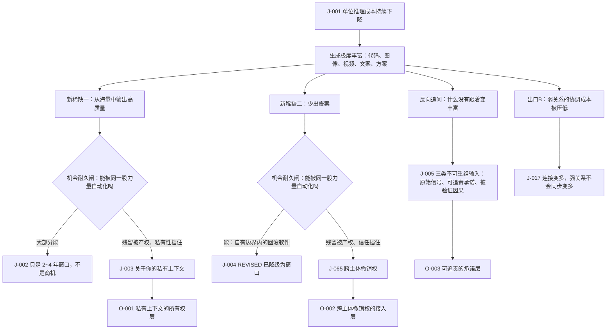

# C1 · 生成变得免费之后，什么反而买不到了

[English version](../../en/chains/10-generation-becomes-free.md)

> **这条链的位置**：它是全部推演的起点。所有更远的判断都要踩着它往前走。
> **一句话**：当「做出一个东西」的成本趋近于零，价值就整体迁移到「做出来之前」和「做出来之后」——迁移到**你是谁、你想要什么、你敢不敢为结果负责**。

> **边界说明**：本链引用的 J-001、J-002、J-003、J-004（状态 `REVISED`）、J-005、J-017、J-035、J-065、J-072 全部已判为**闸一（规模）不通过**，属职业／组织／制度性判断；每条的受众天花板由所引卡片的「受众规模」与「普及闸复核」字段定义，本链任何一步都不得以「整个社会」「普遍」「成为风气」的口吻转述。闸一判据见[历史回顾 · 闸一](../01-retrospect.md#七用这道闸检验我们自己写过的东西)，逐卡依据见[判断台账 · 检查日志](../90-ledger.md#八检查日志)。本说明一次性覆盖全文：2026-10-09 之前正文每一节重复一次的同一条「范围标签 · 闸一」已收口到这里，判断内容与结论未变——逐卡的受众量级与过闸理由始终只存放在台账卡片里，本说明与原先的逐节标签都只是指路。

---

## 一、先看一眼 2029 年的某个下午

一家三十人的公司，没有设计部，也没有前端团队。市场负责人想做一次改版，她对着系统说了四十秒，十二分钟后拿到 **六十套** 完整可上线的方案——文案、配图、动效、埋点、A/B 分流，全都齐了。

她盯着屏幕，花了整整两个下午，什么也没决定。

不是因为方案差。六十套里至少有二十套比她公司历史上做过的任何一版都好。问题在于：**她说不出自己要哪一种。** 她知道「我们公司是什么调性」，但这句话从来没有被写下来过，它散在过去七年的几千次决策里，散在她和创始人的对话里，散在几次她否掉某个方案时那句「这个不像我们」里。

系统能生成一切，唯独生成不出**她**。

第三天她做了一件事：把过去七年所有被否掉的方案翻出来，一条条写下「当时为什么否」。这份文档最后成了这家公司最贵的资产——因为只有它，能把六十套压到三套。

这条链要论证的就是：**上面这个场景不是段子，但它也不是「整个社会的必然结果」——它是一条可以从成本结构推出来的职业性场景。** 做这个动作的人必须同时满足「职业上批量产出候选」「本人有拍板权」「至少每周一次」三个条件，全球量级在**百万级、周频**，按[普及闸](../01-retrospect.md#七用这道闸检验我们自己写过的东西)的闸一并不通过，登记为 [J-072](../ledger/71-80.md#j-072--从几十套候选方案中择一是一条职业性判断其受众天花板在百万量级)。因此本链的推演只在这类职业人群里成立，不得以「整个社会」「普遍」「成为风气」的口吻转述；同一条链上真正可能到社会级的不是「选」，是「做」。以及，它会带来哪些买不到的东西。

---

## 二、链条骨架

> **怎么读这张图**：方框是推理步骤，菱形是[机会耐久闸](../00-method.md)；图只画承重步骤，不替代正文，每一步的依据在下文各节末尾的台账链接里。

**本链用到的透镜**（定义见 [方法论 §2](../00-method.md)）：

- **L1 丰富→稀缺**：起手用它定位价值往哪儿跑。
- **L2 约束迁移**：L1 只能说什么升值，说不出「会长出一个原本不存在的东西」——本链最关键的一步（瓶颈从产能跳到取舍）靠 L2。
- **L6 不可逆性**：用来切开「哪些领域被便宜的生成彻底改写、哪些几乎不动」，这条切线比按行业分类有用。
- **L8 人性常数**：在第六环做反向校验——如果结论要求人性改变，多半错了。

**未使用的透镜**：L3（成本结构）、L4（扩散滞后）、L5（信号与伪造）、L7（制度滞后）、L9（关系不对称）。原因：本链只推「价值迁移到哪里」这一步，不推采用速度与时间窗（L4）、不推组织边界与外包形态（L3）、不推凭据伪造成本塌陷后筛选转向哪里（L5）、也不推制度到位前后的租金窗口（L7）——这四项分别由 [C2](20-real-signals-become-contracts.md)、[C3](30-power-land-and-permits.md) 与 [C10](100-trust-collateralization.md) 单独承重。L9 同样不在本链：第七节「连接会变多、强关系不会同步变多」用的是 L8 的子规律（强关系数量受认知约束），人与 AI 的不对称关系由 [C11](110-authority-before-intelligence.md) 承重。

按[映射表](../00-method.md#五类起点与-l1l9-的对应表)反查，本链的底座是**供需关系**（L1 逐字、L2 延伸）＋**人性规律**（L8）＋**技术规律的后半句**（L6），没有碰到历史规律与社会规律的条文——这是本链自身的入口偏斜，读者可据此判它越界。

---

## 三、第一环：成本为什么必然继续降

**观察到的事实**：单位智能（每次有效推理）的边际成本在持续下降，且下降不依赖任何单一突破。

**推理**：推理是**可并行的确定性计算**。历史上每一种可并行的确定性计算——纺纱、印刷、光刻、带宽、存储——单位成本都遵循学习曲线：累计产量每翻一倍，单位成本下降一个固定比例。没有理由认为 token 是例外。

更强的是，成本下降有**三条互相独立的通道**：

1. **硬件能效**：每瓦特能做多少次运算；
2. **模型效率**：同等能力所需的参数量与计算量（蒸馏、稀疏、更好的训练配方）；
3. **调度与复用**：缓存、批处理、把简单请求路由到小模型。

三条独立意味着**不需要任何一条发生奇迹**，只要没有三条同时卡住，总成本就继续降。这是这条判断置信度高的真正原因——它赌的不是技术突破，赌的是三个独立随机事件不会同时失败。

> 详见[判断台账 J-001](../ledger/01-10.md#j-001--同等能力的单位推理成本继续下降)。

---

## 四、第二环：那么什么变稀缺了——先检验一个流行答案

最直觉的答案（也是本项目发起时的起手假设）是：**在海量产出中筛出真正高质量的那个，变稀缺了。**

这个答案**一半对，一半是陷阱**。必须过机会耐久闸。

### 机会耐久闸：「筛选高质量」能被制造丰富的同一股力量自动化吗？

**大部分能。** 理由：在相当多的领域，「质量」是**可形式化**的——

- 代码：能不能编译、能不能通过测试、有没有安全漏洞；
- 数学与逻辑：对或不对；
- 事实性内容：能不能被独立来源核验；
- 甚至设计：对比度是否合规、加载是否够快、点击率是否更高。

凡是可形式化的，都可以被同一股力量自动检验；而生成模型天然可以**生成然后自我筛选**（多采样 + 打分 + 淘汰）。所以「帮人挑出客观质量更高的那个」不会长期稀缺，它会变成模型的内置功能。

> 详见[判断台账 J-002](../ledger/01-10.md#j-002--从海量产出中筛出客观高质量不是持久稀缺只是-24-年的窗口)。

### 但有一块残留吃不掉

模型能判断「这段东西质量高」，**判断不了「这是你想要的」**。

因为「你想要什么」这件事：

- 分布在你过去成千上万次微小取舍里，从来没有被完整写下来过；
- 你自己也说不清——你能认出来，但描述不出来；
- 它是**私有**的，合法归你所有，没有强制机制能把它交出来。

这里真正的硬约束只有**产权／私有性**：关键历史上下文归特定个人或组织合法持有，不能只靠算力复制或强取。人类偏好难以自我表达会加重需求侧的信息缺口，但它不是第六类硬约束。生成再便宜，也生成不出你的历史。

于是稀缺的不是「筛选能力」，是**筛选所需的那个输入**：关于你（个人或组织）的、结构化的、可被机器使用的偏好与语境。

> 详见[判断台账 J-003](../ledger/01-10.md#j-003--真正持久的稀缺是关于你的私有上下文的所有权与可用形态)。

---

## 五、第三环：第二个流行答案——「少出废案」

另一个起手假设是：**高效运用 token、不把算力浪费在一个个废案上，变稀缺了。**

同样要过机会耐久闸。

**大部分会被自动化。** 废案率是模型能力的函数：模型越强，一次成的概率越高；同时成本在降，废案的代价也在同步变小。两头夹击，「省 token」作为一门生意的空间在收缩，而不是扩大。

**但有一块残留吃不掉，而且很硬：当结果不可撤销时，废案的代价不是 token，是现实世界的损失。**

- 生成十版文案挑一版——废案成本 ≈ 0；
- 生成十版数据库迁移脚本并**都执行一遍**再挑——公司已经没了。

在写文章、画图、写代码草稿里，「多试几次」是免费的；在下单、付款、发送、部署、签约、投药这些动作上，**试错本身就是损害**。这暴露出背后的**物理与法律／责任约束**：不可逆性是判断风险的辅助透镜，不是另一个硬约束类别。

于是稀缺的不是「少犯错」，也**不是**「把不可逆的事情变成可逆」这套软件——这一步我第一轮写错了，2026-09-19 的机会耐久闸复核把它拆开了。影子环境、动作沙盘、一键回滚，只要动作**不跨出你自己的所有权边界**（自有数据库、自有云资源、测试沙盘），它们就是纯软件：恰恰是让生成变丰富的同一股力量最擅长造的东西，何况被操作的系统由平台自己持有，它有动机把回滚内置成默认能力并免费发放。这一半有人付钱，但过不了机会耐久闸。

真正复制不出来的是另一半：**跨主体撤销权**。一旦一个动作把状态写进了**别人**的账本——款已请、货已放行、权利已转让、合同已生效——撤销就必须由那个主体同意并执行，而它的默认利益是**终局**，不是可撤销；它出售的恰恰是终局性，撤销额度被配额化并单独计价（争议手续费、托管费、开证费）。算力可以无限复制沙盘代码，复制不出对方同意回退的义务。历史上这种跨主体回退只在少数封闭网络里真正建成过——卡组织拒付、证券结算撤销、托管与信用证——每一个都是会员规则、保证金与长期重复博弈熬出来的，不是软件工期熬出来的。所以硬约束不在「物理」，在**产权／私有性**与**信任／关系**。

（而对**物理上不可逆**的动作——货已消耗、人已受损、药已注射——不存在可撤销产品，残余只剩「谁赔付」，那是下一节第二类输入的地盘。）

> 详见[判断台账 J-065](../ledger/61-70.md#j-065--ai-跨主体执行动作后真正稀缺的不是回滚软件而是跨主体撤销权)。原判 [J-004](../ledger/01-10.md#j-004--随着-ai-从生成内容转向执行动作稀缺项是让行动可撤销的基础设施) 保留在台账里不删除，状态已改 `REVISED`——留着它，才看得见这一步是怎么被自己的机会耐久闸挡回来的。

---

## 六、第四环：把镜头拉远——谁没有跟着变丰富

前两环都在问「丰富带来什么麻烦」。更有力的问法是反过来：**列出没有跟着变丰富的东西，它们会整体升值。**

生成的本质是**对已有模式的重组**。因此凡是不能靠重组得到的东西，都不会变丰富：

1. **不可复制的原始信号**——真实世界正在发生、但还没有被记录下来的事。模型再强也生不出新的观测；要拿到它必须有人或设备**在现场**。硬约束：物理在场。
2. **可追责的承诺**——「这句话如果错了，谁赔钱」。当内容无限时，内容本身不再是过滤器，**责任**成为唯一还能用的过滤器。而责任只能由能被起诉的主体承担。硬约束：法律。
3. **被验证的因果**——相关性可以被无限生成，因果只能靠**干预**获得（做实验、改变现实、观察结果）。硬约束：物理 + 时间。

> 详见[判断台账 J-005](../ledger/01-10.md#j-005--生成丰富之后价值向三类不可重组的输入集中原始信号可追责承诺被验证因果)。

---

## 七、所以现在可以做什么

三条从本链直接落出的商机候选（完整论证见 [`../40-opportunities.md`](../40-opportunities.md)）：

- **[O-001](../40-opportunities.md#o-001--私有上下文的所有权层) 私有上下文的所有权层**——把「我们是谁、我们否掉过什么、为什么否」变成可携带、可授权、可计价的资产。来自 [J-003](../ledger/01-10.md#j-003--真正持久的稀缺是关于你的私有上下文的所有权与可用形态)。
- **[O-002](../40-opportunities.md#o-002--跨主体撤销权的接入层) 跨主体撤销权的接入层**——延迟终局的结算、可编程托管、预先谈定的单方撤销窗口：把「对方同意回退」这项义务取得、组合，开放给机器发起的动作。来自 [J-065](../ledger/61-70.md#j-065--ai-跨主体执行动作后真正稀缺的不是回滚软件而是跨主体撤销权)。（边界内的沙盘与自有资源回滚已在 2026-09-19 降级为窗口机会。）
- **[O-003](../40-opportunities.md#o-003--可追责的承诺层) 可追责的承诺层**——为 AI 输出附加真实赔付责任的中间层。来自 [J-005](../ledger/01-10.md#j-005--生成丰富之后价值向三类不可重组的输入集中原始信号可追责承诺被验证因果)。

一条明确**不**推荐当结构性机会的：

- ❌ **通用的「AI 产出质检／择优」工具**——[J-002](../ledger/01-10.md#j-002--从海量产出中筛出客观高质量不是持久稀缺只是-24-年的窗口) 判定它是 2~4 年窗口，会被模型厂商内化。可以吃窗口，但不要按长期护城河来投入。

### 结构性后果（出口 B）：连接会变多，但强关系不会同步变多

AI 会先把**弱关系的协调成本**压到很低：介绍、翻译、约时间、整理共同背景、把一段争论压缩成三句，都可以交给中介。一个人因此能维护更多“能联系上的人”。但强关系的瓶颈不是发送信息，而是共同经历、互相承担、冲突后的修复和有限的注意力。通信成本下降会放大弱关系网络，却不会自动放大一个人能长期在场的关系数量。

> 详见[判断台账 J-017](../ledger/11-20.md#j-017--ai-中介会比强关系更快扩大弱关系协调)。

**所以谁该改变什么行为**：个人和组织应把「协调」与「承诺」分开设计。把可压缩的背景同步交给 AI，把需要共同承担后果的决定、冲突修复和关键仪式保留为人对人的在场；否则组织会得到更多连接，却误把连接数量当成信任。

---

## 八、我可能错在哪（最强反方）

**反方一：偏好也许比我以为的容易复现。**
[J-003](../ledger/01-10.md#j-003--真正持久的稀缺是关于你的私有上下文的所有权与可用形态) 建立在「你的取舍无法从少量交互中还原」之上。如果模型在极少样本下就能稳定推断个体偏好（比如观察你两周的日常使用即可达到你自己 80% 的认可度），那么「私有上下文」就不是资产，而是一个几周就能重建的临时缓存，[O-001](../40-opportunities.md#o-001--私有上下文的所有权层) 整条塌掉。
**我会撤回的信号**：出现公开可复现的结果，显示少量通用交互即可达到高个体认可度的偏好还原。

**反方二：撤销权可能被持有方自己发掉，或者买方根本不想要。**
[J-065](../ledger/61-70.md#j-065--ai-跨主体执行动作后真正稀缺的不是回滚软件而是跨主体撤销权) 假定跨主体撤销权会稀缺到值得有人专门去取得并转售。但支付与结算网络（或监管）完全可能直接规定一个统一的机器动作撤销窗口并免费发放，接入层无事可做；另一种更朴素的可能是买方压根不要可撤销——延迟终局占用资金，若这笔资金成本高于事故的期望损失，组织会理性地选「不可撤销 + 事后赔付」，需求整体流向承诺层。
**我会撤回的信号**：到 2033 年，主要支付与结算网络已把机器发起动作的撤销窗口写进默认规则且不单独计价；或高后果采购里始终没有独立计价的托管／延迟终局条目，而责任险条目在同期扩大。

**反方三：整条链假设成本下降不会被非技术因素卡死。**
如果能源、供应链或监管对算力形成硬上限，[J-001](../ledger/01-10.md#j-001--同等能力的单位推理成本继续下降) 失效，「生成极度丰富」这个前提本身就不成立，后面全部作废。我判断这个概率不高（因为三条下降通道相互独立），但它是唯一能一次性推翻整条链的机制。
**我会撤回的信号**：[J-001](../ledger/01-10.md#j-001--同等能力的单位推理成本继续下降) 的证伪条件触发。

---

## 九、这条链往下长出什么

- 由 [J-005](../ledger/01-10.md#j-005--生成丰富之后价值向三类不可重组的输入集中原始信号可追责承诺被验证因果)（原始信号升值）→ 推出中期的**数据从免费抓取转向合同化定价**，见 [C2：当数据不再免费：现实信号如何变成合同资产](20-real-signals-become-contracts.md)。
- 由 [J-002](../ledger/01-10.md#j-002--从海量产出中筛出客观高质量不是持久稀缺只是-24-年的窗口) + [J-005](../ledger/01-10.md#j-005--生成丰富之后价值向三类不可重组的输入集中原始信号可追责承诺被验证因果)（可追责承诺成为过滤器）→ 推出远期的**信任抵押化**：当「说得好」不再是能力信号，社会退回更古老、更昂贵的凭据——担保、抵押、长期关系、身份。这一方向尚未写成独立链，目前落在 [远期图景第 5 节](../30-far.md#5-权力与制度答案变多不等于行动权分散) 与 [J-035](../ledger/31-40.md#j-035--责任抵押进入重要-ai-输出的交易结构)，多为「仅图景」，并且**不占用链编号**——这条链尾一度把它预告成「C3」，而写成 C3 文件的是电力与许可链，编号归属见[推演链登记](../../../README.md#推演链登记)。

> C2 与 C3 都已写成可检验的承接链：[C2 · 当数据不再免费：现实信号如何变成合同资产](20-real-signals-become-contracts.md) 沿原始信号这一线继续往下；[C3 · 电子落地：算力的瓶颈从芯片移到电网、土地与许可](30-power-land-and-permits.md) 则拆掉本链一直默认成立的那个前提——算力只要肯付钱就买得到。全部链的编号、主题与状态见[推演链登记](../../../README.md#推演链登记)。
