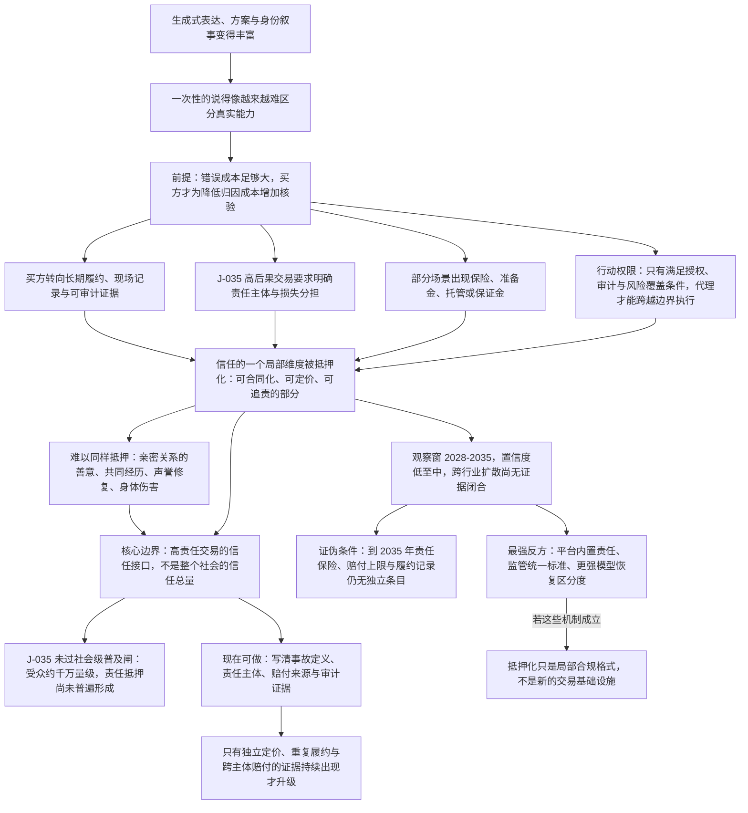

# C10 · 信任抵押化：当表达不再证明能力，谁为结果承担后果

[English version](../../en/chains/100-trust-collateralization.md)

> **这条链的位置**：它从 C1 的「可生成表达变得便宜」与 C2 的「现实信号进入合同」继续向前，不把 J-035 的职业／组织性判断升级成社会必然趋势。
> **一句话**：当语言、方案与身份叙事都可以廉价生成，重要交易会更依赖可追责的履约记录、赔付能力与预先约定的损失分担；这可能把一部分信任「抵押化」，但目前尚未普遍形成责任抵押。

> **边界说明**：本链引用的 J-035 全部已判为**闸一（规模）不通过**，属职业／组织／制度性判断；每条的受众天花板由所引卡片的「受众规模」与「普及闸复核」字段定义，本链任何一步都不得以「整个社会」「普遍」「成为风气」的口吻转述。闸一判据见[历史回顾 · 闸一](../01-retrospect.md#七用这道闸检验我们自己写过的东西)，逐卡依据见[判断台账 · 检查日志](../90-ledger.md#八检查日志)。

---

## 一、一个重要采购决定的前夜

一家组织准备把一个 AI 系统接入真实业务。供应商的演示无可挑剔：解释清楚、案例丰富、回答迅速，甚至能现场生成一份看起来比人工团队更完整的风险报告。

但采购人最后问的不是「它能不能说服我」，而是三件更慢、更不体面的事：如果报告错了，谁赔？这家公司过去是否在类似场景里持续兑现？事故发生后，哪一笔准备金、哪一份保险、哪一个有权限的主体会真正接住损失？

这不是说所有人与所有交易都会进入抵押时代。它首先可能发生在高责任、可定价、需要重复履约的组织交易中；普通闲聊、低风险内容和一次性的个人表达，不应被这条链代言。

**证据边界先放在这里**：J-035 目前只是中等置信度的职业／组织性判断。它的普及闸复核明确判定受众规模约为千万量级的高责任输出采购组织、保险人与专业者，未通过社会级普及闸；当前卡片还明确写着「尚未普遍形成责任抵押」。本链讨论的是可检验的延伸机制，不把链文存在写成 J-035 已被验证。

---

## 二、链条骨架

> **怎么读这张图**：方框是推理步骤，箭头是正文论证的依赖次序；图只画承重步骤，不替代正文，每一步的依据在下文各节与台账卡片里。

**本链的透镜声明**（代号定义见[方法论 §2 透镜工具箱](../00-method.md#2-透镜工具箱)，到五类起点的反查见[映射表](../00-method.md#五类起点与-l1l9-的对应表)）：

- **L5 信号与伪造**：这是本链的核心一步——一次性的「说得像」伪造成本塌陷之后，筛选转向担保、抵押、长期关系与可追责身份。
- **L2 约束迁移**（原文作「C1 的约束迁移」）：瓶颈从「能不能说服我」跳到「错了谁赔、哪一笔准备金接得住」。
- **L6 不可逆性**：高后果交易的错误代价是现实损失与法律责任，不是重写一份报告。
- **L8 人性与需求**：取其「为确定性付费」与「责任归属」两项——买方买的是可追索，不是更好的演示。

**在用但此前被漏记的透镜**（2026-10-10 经独立攻击改判）：本页原先把 L1、L3、L4、L7、L9 一并列入「未使用」，其中四项被本页自身文本反证，故撤回该否认——L1、L3、L7 在用，L4 改判为部分使用。**L1（丰富→稀缺）**：原措辞「L1 只作为 [C1](10-generation-becomes-free.md) 的输入引入，链内不再走一次翻转」不成立，[方法论 §3](../00-method.md#3-机会耐久闸与三个出口不是每个稀缺都是商机也不是只有商机才算数) 的四步翻转在本链正文里完整走了一遍：①丰富什么——骨架图首个节点「生成式表达、方案与身份叙事变得丰富」；②稀缺什么——页首一句话「重要交易会更依赖可追责的履约记录、赔付能力与预先约定的损失分担」，即 L1：「某样东西变便宜、变多之后，与它互补却没有同步变多的东西可能升值」；③能否再次被丰富——第五节最强反方「平台可能把责任统一内置并免费提供」与「更强的模型也可能让一次性表达重新获得足够区分度」；④归类——第六节「才值得把机会候选从「机制窗口」升级为结构性机会」。前两步的丰富与稀缺确与 C1 的 J-005 同源，但第三、四步是本链用自己的材料重走的，所以「链内不再走一次翻转」与本页文本不可同真；保留下来的只有原措辞「不把「丰富→稀缺」当总解释」这半句——本链自述的核心一步仍是 L5。**L3（成本结构）**：原措辞「不推采购组织的边界重排」只否认了 L3 的一面。L3：「组织的边界由协调成本和交易成本塑造」，并点名用于「产品打包方式」。本链骨架图四条分支 B1–B4 全部从同一个前提节点出发——「前提：错误成本足够大，买方才为降低归因成本增加核验」，核验与归因成本正是交易成本，这是全链的前提节点；第四节「只有满足授权、审计与风险覆盖条件的主体，才能让代理跨越边界执行」把代理能否跨越边界写成这些核验与风险覆盖条件的函数（骨架图中 B4 正挂在该前提之下）；第五节最强反方「平台可能把责任统一内置并免费提供」、与共识一条「分歧在于是否会形成可独立定价、跨场景复制的责任抵押层」、第六节「把履约记录、现场干预证据和赔付安排组合成可审计的合同附件」推的都是产品打包方式。原措辞字面那一面——采购组织自身的公司规模与雇佣关系是否重排——本链确实没有推，这一点保留。**L4（扩散滞后）**：原措辞「不给抵押化的采用速度写时间窗（L4，这是本链登记在案的缺口）」与第五节「暂定观察窗为 **2028–2035**」直接矛盾（骨架图 WIN 节点同写「观察窗 2028-2035」）。准确的说法是：本链**写了时间窗**，做的正是 L4：「它用于把方向判断变成时间窗」这件事；但这个窗口**不是由 L4 的四类周期推导的**——L4：「折旧周期、监管周期、采购周期和技能形成周期决定采用速度」，而第五节只说本判断是「从 J-035 延伸出的中期至远期机制判断」，J-035 的透镜字段为「L2（约束迁移）+ L7（制度租金窗口）」、时间窗为 2028–2033，本链正文没有一处用这四类周期推算 2028 或 2035。故改判为部分使用，缺口登记收窄为：窗口未由四类周期推导。**L7（制度滞后）**：第五节最强反方「监管可能直接规定统一的赔付与审计标准，使独立「信任抵押」产品没有租金」就是 L7：「制度落位后，租金可能消失」这一句的实例；本链唯一的判断锚点 J-035 的透镜字段也写着「L7（制度租金窗口）」。原措辞「保险与赔付制度何时落位（L7）由 [C11](110-authority-before-intelligence.md) 承重」这一委托同样撤回：核对 C11 当前正文，保险只出现在第 1 节的提问「谁有保险、资产或申诉义务」、2.3 节的反向边界、J-098 卡的闸五待核验项、领先指标「代理事故的责任归属与保险除外条款」与最强反方，以及第 6 节「下一轮应补齐」的保险定价数据里，没有一处推断保险与赔付制度何时落位。所以 L7 在本链用的是租金关闭那一面；「何时落位」这一问本链没有写，C11 也没有承重，是一处尚无任何链承载的空白，不是已委托的步骤。

**未使用的透镜**：L9（关系不对称）。原因（2026-10-10 攻击后重写，原措辞「本链明确不涉及」只是宣布，读者无从核对）：本链最像 L9 的一步是第四节「仍然难以被同样方式抵押的包括：亲密关系中的善意」一段与「保证金可以让某些交易更可执行，却不能自动制造宽恕、忠诚或意义」。它确实碰到了关系，但 L9 从持续互动的关系对象起步——L9：「人会对任何持续互动的对象建立关系模型」——并要求指认双方不对称的是哪一项，再由此推出「此前不存在的规范、依赖与伤害形式」；第四节只是给抵押化划外缘——这些关系**不能**被抵押——既没有指认任何一项不对称，也没有推出新的关系形态。本链的交易双方（采购人与供应商、被保险人与保险人）是可追责的法律主体，代理在骨架图 B4 里只是被授权的执行者，不是关系对象。本链也**不**声称抵押会取代关系信任。按[映射表](../00-method.md#五类起点与-l1l9-的对应表)反查，改判后本链底座是**社会规律**（L5，几乎是条文的展开）＋**供需关系**（L1；L2 为延伸；L3 为延伸且无条文源句）＋**历史规律**（L4 部分使用、L7）＋**技术规律的后半句**（L6）＋**人性规律**（L8，按映射表还带「供需的需求侧那半句」）。原先「不含历史规律的条文——这意味着本链没有任何历史案例校准，置信度上限因此停在「中」」一句的前提随之失效（L4、L7 都反查到历史规律），这条由透镜映射推出的理由撤回。但底座触及历史条文，与正文用历史案例校准过，是两件事：核对正文，本链没有点名任何历史案例——第五节只有一句「机制有现实制度先例」，未指出是哪一个先例，也没有用任何先例推算观察窗或置信度；L7 在本链只承担最强反方的机制，不是案例校准。所以置信度上限仍停在「中」（本链自报「低至中」），理由改为正文未引任何历史案例，而不再由透镜映射推出。

---

## 三、第一环：表达丰富，为什么会削弱一次性证明

当同一套模型能够为不同主体生成专业口吻、完整案例和风险说明时，表达仍然有用，但其区分度下降。买方要判断的不是「这段话是否流畅」，而是：它是否来自真实经历，是否能在现实中重复兑现，出错后是否有可执行的责任安排。

这一步并不要求人类偏好改变，也不要求 AI 直接替代所有决策。它只要求在高后果交易里，错误成本足够大，买方会为降低错误归因成本而增加核验。可观察的中间产物不是「社会突然不再相信语言」，而是合同字段、审计要求、保险条款和可验证履约历史的增加。

与 J-035 的关系是**机制承接而非证据升级**：J-035 已保留“重要输出必须由能够承担损失的一方接住后果”的理由，但其时间窗（2028–2033）与普遍性尚未得到外部证据闭合。

---

## 四、第二环：什么被抵押，什么不能被抵押

「信任抵押化」不是把人类信任变成一笔统一的保证金。更准确的说法是，信任中可被合同化、定价和追责的部分，会获得抵押、保险或准备金等形式的外化载体。

可能被外化的包括：

- **结果责任**：对可定义的错误支付赔偿，或把赔偿上限写进合同；
- **履约一致性**：用长期记录、复购、违约和现场证据衡量兑现率；
- **行动权限**：只有满足授权、审计与风险覆盖条件的主体，才能让代理跨越边界执行；
- **损失吸收能力**：保险、准备金、托管和保证金把「谁承担事故」从口头承诺变成制度安排。

仍然难以被同样方式抵押的包括：亲密关系中的善意、不可预先定义的政治承诺、共同经历、声誉修复和无法用金钱补回的身体伤害。保证金可以让某些交易更可执行，却不能自动制造宽恕、忠诚或意义。

因此本链的核心边界是：**抵押化可能扩展的是高责任交易的信任接口，不是整个社会的信任总量。**

---

## 五、时间窗、证伪条件与领先指标

这是从 J-035 延伸出的中期至远期机制判断，暂定观察窗为 **2028–2035**，置信度 **低至中**：机制有现实制度先例，但跨行业扩散与社会规模仍没有证据闭合。

- **证伪条件**：到 2035 年，高价值 AI 服务的采购与续约仍主要依据一次性演示和无责任承诺，责任保险、赔付上限、审计采购与可验证履约记录没有形成可观察的独立条目；或者这些条目普遍存在，却没有改变高责任交易的选择与定价。
- **领先指标**：AI 责任保险保费与除外责任；合同中的赔付上限、准备金、托管或保证金；要求现场证据和履约历史的采购比例；因代理事故触发的追责与续约变化。应按半年或年度观察，并与相似的非 AI 服务做对照。
- **最强反方**：平台可能把责任统一内置并免费提供；监管可能直接规定统一的赔付与审计标准，使独立「信任抵押」产品没有租金；更强的模型也可能让一次性表达重新获得足够区分度。若这些机制成立，抵押化只会是局部合规格式，不会成为新的交易基础设施。
- **与共识的关系**：与“高责任 AI 需要治理、审计和保险安排”的方向一致；分歧在于是否会形成可独立定价、跨场景复制的责任抵押层。本链不把方向上的一致冒充为时间窗或普及规模的证据。

---

## 六、所以现在可以做什么

对高责任 AI 采购者：不要只问模型的准确率和演示效果，先写清楚事故定义、责任主体、赔付来源、审计证据、退出机制与不可转嫁的损失。

对服务提供者与保险人：可以试点把履约记录、现场干预证据和赔付安排组合成可审计的合同附件，但必须在限定行业与责任边界内验证，不要把它包装成普遍的社会信用层。

对研究者：优先收集真实合同、保险定价、采购条款和事故后的责任归属，而不是用发布会数量或模型榜单推断信任已经被抵押化。

这些是风险治理与测量建议，不是对 J-035 的验证，也不是自动成立的商机。只有当独立定价、重复履约和跨主体赔付的证据持续出现，才值得把机会候选从「机制窗口」升级为结构性机会。

---

## 七、这条链往哪里接

- 它回接 [C1：生成变得免费之后，什么反而买不到了](10-generation-becomes-free.md) 中关于可追责承诺、真实信号与验证因果的三类不可重组输入；
- 它承接 [C2：当数据不再免费：现实信号如何变成合同资产](20-real-signals-become-contracts.md) 的现实信号合同化，但把问题从「信号归谁」推进到「错误由谁承担」；
- 它与 [C4：具身智能](40-embodied-intelligence.md)、[C5：生物与医疗](50-biology-medicine.md) 相连：身体风险与临床责任越不可逆，证据和责任安排越不能只靠生成文本替代；
- 它的当前判断锚点是 [J-035](../ledger/31-40.md#j-035--责任抵押进入重要-ai-输出的交易结构)。请沿该卡的状态、证伪条件和历史迁移记录继续复核，而不要把本链当成第二份台账。

> **链文状态**：已写成双语入口；这只说明可读正文已经存在，不表示 J-035 已验证，也不表示「信任抵押化」已成为普遍社会趋势。
