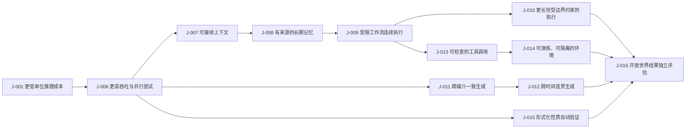

# C12 · 技术能力演进链：什么先到，什么才因此成为可能

[English version](../../en/chains/120-technology-capability-sequence.md)

[返回 README／文档地图](../../../README.md)

> **登记说明（2026-10-10）**：本篇原在 `docs/zh/05-tech-sequence.md`，成文早于[推演链登记表](../../../README.md#推演链登记)，一直没有编号——于是档案对外既像有 11 条链，又像有 12 条。现按登记表写明的判据（围绕一个问题纵向推进依赖、以 `J-NNN` 卡承载可检验判断、页首声明透镜）登记为 **C12**。它是并列的十二条链之一：回答「什么能力先到」，但不替其余各链决定「什么变丰富」，也不是它们共同的前提层；能力到达之后还要穿过什么才变成社会后果，由 [C7](70-capability-to-social-consequences.md) 回答。正文与 12 张卡一字未删，旧路径保留为跳转页。

周三下午四点，林岚把一句话交给工作台：“把上季度的客户反馈整理成三个可执行的改版方案，先不要发给任何人。”

十分钟后，系统交回三个方案、每个方案的原型、风险清单和一组相互矛盾的证据。它没有失败在“不会生成”，而是失败在“下一步该相信什么”。林岚让它查资料、打开测试环境、重跑验证；系统又提出了新的假设。真正改变工作方式的，不是某个模型突然会做某件事，而是能力必须按次序到达：便宜的推理先把尝试变成常态，记忆再把尝试接起来，接口才让尝试触碰环境，验证能力最后决定哪些动作值得留下。

这条链只讨论能力如何到达，不把社会后果提前写进来。读者可以沿着每一节追问同一个问题：**什么先到 → 因此什么才成为可能 → 接着什么才有机会到达。**

**本链的透镜声明**（2026-10-10 补写；代号定义见[方法论 §2 透镜工具箱](../00-method.md#2-透镜工具箱)，到五类起点的反查见[映射表](../00-method.md#五类起点与-l1l9-的对应表)）：

- **L2 约束迁移**：每一节的落点都是瓶颈换位——推理变便宜之后，卡住的是「我上次做了什么」（第一节末）；记忆接上之后，卡住的是「触碰外部世界的资格」（第二节末）；接口接上之后，卡住的是「知道行动正确」（第五节末）。这正是 L2：「解除一个瓶颈不会让系统所有环节均匀变快，瓶颈会跳到另一个环节」。12 张卡的透镜字段都写了 L2。
- **L6 不可逆性**（此前漏记）：第三节「只在任务边界清晰、动作可以暂停、失败可以报告的环境中连续完成几步」与第五节「先模拟或影子运行，再决定是否触碰真实状态」，走的是 L6：「低成本试错只在结果可以撤销时有价值」。[J-014](../ledger/11-20.md#j-014--可演练环境晚于单工具接入) 的推理链「真实状态不可随意试错 → 需要隔离、快照、影子运行和回滚来扩大尝试空间」同样以它推进，而该卡透镜字段只写了「技术演进顺序 + L2 约束迁移」，已在卡上就地加注。按映射表，L6 是技术条文后半句（「需要真实世界介入、等待、能量、责任或不可逆后果的环节下降更慢」）唯一的承载透镜。

**主干这一步没有透镜承载**：本链的主干是哪类能力**先**到、哪类随后才可靠——在排序这一步，本链的推理不被 L1–L9 承载。12 张卡透镜字段里的「技术演进顺序」不是 L1–L9 中的任何一个，它恰是[映射表「技术规律」行](../00-method.md#五类起点与-l1l9-的对应表)登记的那处最硬缺口：条文前半句「可并行、可复制、可数字化的确定性工作更容易降本」，在九段定义里没有一句承载。第六节「验证先覆盖可形式化的部分，再面对开放世界」几乎就是这半句条文的展开，但它的依据只能回溯到 §1 技术条文与各卡的「与共识」对照，**不构成可核对的透镜出处**。按 §1.3，补一个承载它的透镜属于实质规则变化，须先完成历史案例校准，所以本轮只声明，不补透镜、不改判断；12 张卡的透镜字段已就地加注。按映射表的现行纪律，别的链需要「某能力已到达」作前提时，必须 `depends-on` 到本链的 `J-NNN`，不得以透镜口吻直接断言。

**未使用的透镜**：L1、L3、L4、L5、L7、L8、L9。逐个反向尝试：

- **L1**：本链只写能力到达，不写任何东西因此升值。最像 L1 的是开篇「它没有失败在“不会生成”，而是失败在“下一步该相信什么”」，但那是瓶颈从生成跳到验证（L2），不是互补品估值；「便宜之后什么升值」由 [C1](10-generation-becomes-free.md) 承重。
- **L3**：L3 自述用于「产品打包方式」，本链第七节的最强反方也确实写了「供应商封装可能把记忆、工具、验证全部隐藏起来」；但那是一种会掩盖可观测次序的反例机制，本链没有由协调成本或交易成本推出任何封装边界。第一节「把简单步骤交给更小的模型」是调度，不是组织边界。
- **L4**：本链的时间窗是能力窗口，不是采用速度（台账本节自述「技术能力的出现不等于普遍采用」）。折旧、监管、采购与技能形成周期在本链不推任何一步；J-014 的领先指标借用了「AI 工作流采购中影子环境和回滚条目」，但只作观测口径，推理链不经过任何采用周期。采用由 [C7](70-capability-to-social-consequences.md) 与 [C4](40-embodied-intelligence.md) 承重。
- **L5**：第二节「带来源、时间和置信边界」的记忆与第六节「事实是否能被独立来源核对」看似凭据问题；但 L5 的触发是「一旦文本、图像或履历的伪造成本塌陷」，本链没有一处以伪造变便宜为前提。来源在这里是让系统局部修正的内部状态，不是筛选者转而寻找的难伪造凭据。
- **L7**：最接近制度的是 [J-016](../ledger/11-20.md#j-016--开放世界评估是自主边界扩张的最后门槛) 的领先指标「授权范围随评估结果扩张的幅度」；但本链把授权扩张写成跟随评估证据的技术门槛，不推制度何时落位、租金何时开合。授权制度由 [C11](110-authority-before-intelligence.md) 承重。
- **L8**：本链不推任何需求变化；开篇林岚说「先不要发给任何人」是场景，不是由确定性偏好推出的需求。
- **L9**：最像 L9 的是第二节的长期记忆（L9 第一项不对称「一方记得全部，另一方只记得片段」）与第三、五节的暂停和回滚（第三项「一方可被随时复制、暂停、回滚」）。但在本链里，记忆是任务状态，暂停与回滚是环境控制项（由 L6 推出）；链中没有任何一方对系统建立 L9 所说的关系模型，也没有推出新的规范、依赖或伤害形式。人与 AI 的关系由 [C11](110-authority-before-intelligence.md) 承重。

按[映射表](../00-method.md#五类起点与-l1l9-的对应表)反查，本链底座是**供需关系的延伸**（L2，无条文源句）＋**技术规律的后半句**（L6）；技术规律的前半句——也就是本链的主干——无透镜承载，如上。这就是本链在体系中的位置：它不是诸力量的发动机，而是「技术」这一股力量自己的那条链，并且这股力量在透镜层仍有一处登记在案的空缺。

> **本篇引用的 12 张卡已按普及闸整体降级（2026-09-20）**：本篇引用 J-001 与 J-006–J-016 共 12 张判断，在 2026-09-20 的闸一（受众规模）全库复核中**无一过闸**——它们的受众规模都只到百万量级（模型开发者、云服务商、使用知识工具的专业者与组织采购者），是技术前提而不是社会日常动作，离「亿级不同个人每周执行同一动作」的社会级门槛差两到三个数量级。因此这 12 张全部降级为**职业／组织性判断**，状态改为 `REVISED`（原卡正文一字未删，编号不复用）。其中 [J-008](../ledger/01-10.md#j-008--有来源的长期记忆成为可靠协作前提)、[J-012](../ledger/11-20.md#j-012--跨时间连贯生成依赖状态与验证)、[J-015](../ledger/11-20.md#j-015--形式化验证先于开放世界评估)、[J-016](../ledger/11-20.md#j-016--开放世界评估是自主边界扩张的最后门槛) **只落在本篇**，没有第二个正文落点，它们的降级说明只能写在这里。判据见[历史回顾 · 闸一](../01-retrospect.md)，逐卡判定与本轮计数口径见[判断台账 · 检查日志](../90-ledger.md#八检查日志)。

> **闸位现状 · 读能力次序之前先读这一段（2026-10-10 标注）**：上一段的「无一过闸」，判据是[历史回顾 · 闸一](../01-retrospect.md#闸一--先数人再看技术)的原文：「这项能力服务的那个动作，**有多少人在做、多久做一次**？一项能力能影响的人数上限，由动作的人数 × 频次决定，不由技术能力的上限决定。」下表 12 张卡的「普及闸复核」字段逐张写着同一句结论：「闸一**不过**——按普及闸降级为职业／组织性判断，不得以「整个社会」「普遍」「成为风气」的口吻引用」，状态均为 `REVISED`。2026-10-09 的[隔离盲判复审](../../evidence/blind-review-reaudit-2026-10-09.md)在去掉标签后重判这 12 张：J-006 再次被闸一否决，J-011 被闸二否决，其余 10 张为 `ABSTAIN`（无闸位判否；闸只能判否，不得据此上调）。**所以读下面的次序时，请打两道折扣**：(1) 规模——每一步只在所引卡片写明的职业／组织人群内成立，不是社会级趋势；(2) 方法——「什么先到」这一步没有登记透镜背书（见上方透镜声明与[映射表「技术规律」行](../00-method.md#五类起点与-l1l9-的对应表)），依据只能回溯到 §1 技术条文与各卡的外部对照。这 12 张卡的正当用途，是被别的链 `depends-on`，充当「某能力已到达」的可证伪前提——[C3](30-power-land-and-permits.md)、[C4](40-embodied-intelligence.md) 与 [C7](70-capability-to-social-consequences.md) 正是这样引用本链。

| 卡片 | 受众规模（卡面字段） | 闸一（2026-09-20） | 隔离盲判（2026-10-09） |
|---|---|---|---|
| [J-001](../ledger/01-10.md#j-001--同等能力的单位推理成本继续下降) | 百万量级：模型开发者、云服务商与组织采购者 | 不过 | `ABSTAIN` |
| [J-006](../ledger/01-10.md#j-006--推理吞吐先于长程自主性) | 百万量级：模型研发者与基础设施运营者 | 不过 | `VETO`·闸一 |
| [J-007](../ledger/01-10.md#j-007--可接续上下文先于可靠长期记忆) | 百万量级：使用知识工具的专业者与组织 | 不过 | `ABSTAIN` |
| [J-008](../ledger/01-10.md#j-008--有来源的长期记忆成为可靠协作前提) | 百万量级：需要可审计协作的专业者与组织 | 不过 | `ABSTAIN` |
| [J-009](../ledger/01-10.md#j-009--受限工作流中的连续执行先成熟) | 百万量级：采用受限工作流的组织与专业者 | 不过 | `ABSTAIN` |
| [J-010](../ledger/01-10.md#j-010--长程自主执行晚于受限连续执行) | 百万量级：高责任组织与代理系统运营者 | 不过 | `ABSTAIN` |
| [J-011](../ledger/11-20.md#j-011--跨媒介一致性先于长时连贯性) | 百万量级：内容与产品团队 | 不过 | `VETO`·闸二 |
| [J-012](../ledger/11-20.md#j-012--跨时间连贯生成依赖状态与验证) | 百万量级：长周期内容、研发与运营组织 | 不过 | `ABSTAIN` |
| [J-013](../ledger/11-20.md#j-013--可检查的工具调用先于开放环境行动) | 百万量级：使用工具调用的组织与开发者 | 不过 | `ABSTAIN` |
| [J-014](../ledger/11-20.md#j-014--可演练环境晚于单工具接入) | 百万量级：代理系统运营者与高责任组织 | 不过 | `ABSTAIN` |
| [J-015](../ledger/11-20.md#j-015--形式化验证先于开放世界评估) | 百万量级：模型开发者、企业评估者与审计人员 | 不过 | `ABSTAIN` |
| [J-016](../ledger/11-20.md#j-016--开放世界评估是自主边界扩张的最后门槛) | 百万量级：高责任组织与监管／评估机构 | 不过 | `ABSTAIN` |

> **能力到达顺序图（阅读投影）**：下面只把本篇正文已经论证的顺序画成入口，不增加新的能力判断；完整字段仍以链接的 `J-NNN` 台账卡片为准。箭头表示“可靠应用把前者当作底座”，不表示前者必须完美后者才会出现。
>


## 一、先是更便宜、更密集的推理

最先改变的不是“模型会不会思考”，而是同等能力的推理能否被大量调用。一次回答变便宜以后，系统可以同时走几条路线、反复尝试、把简单步骤交给更小的模型，再把困难步骤集中给更强的模型。于是“生成一个答案”变成“生成、比较、修正一批答案”。这正是 [J-001](../ledger/01-10.md#j-001--同等能力的单位推理成本继续下降) 所描述的成本底座。

当吞吐提高，延迟降低，工作流不再必须围绕一次问答设计。系统可以在后台持续整理、等待新证据、在多个候选之间做局部搜索。[J-006](../ledger/01-10.md#j-006--推理吞吐先于长程自主性) 的关键不是更聪明的单次回答，而是让更多次尝试能够在同一任务里并行发生。

它们只打开了可能性，没有解决连续行动中的“我上次做了什么”和“这次为什么这样做”。下一步因此不是继续堆候选，而是把上下文接住。

> **范围标签 · 闸一**：本段引用的 J-001, J-006 已判为职业／组织性判断；受众天花板由所引卡片定义，不作社会级趋势断言。完整判据见[历史回顾 · 闸一](../01-retrospect.md#七用这道闸检验我们自己写过的东西)，逐卡依据见[判断台账 · 检查日志](../90-ledger.md#八检查日志)。

## 二、接着是能被追溯的上下文与记忆

林岚第二天回来时，系统必须知道哪些方案已经被否决、否决的理由是什么、哪些事实仍然只是猜测。把历史对话全部塞回窗口并不等于记忆：窗口会溢出，旧结论会混进新事实，错误也会被重复引用。

因此先到的是可检索的短期上下文：把任务、证据、决定和未决问题分开存放，并在需要时取回。[J-007](../ledger/01-10.md#j-007--可接续上下文先于可靠长期记忆) 描述了这一步如何让跨轮次任务变得可接续。再往后，系统需要把记忆写成带来源、时间和置信边界的事件，而不是一段不可解释的摘要；[J-008](../ledger/01-10.md#j-008--有来源的长期记忆成为可靠协作前提) 使长期协作可以追问“这条记忆从哪里来、后来有没有被推翻”。

记忆一旦有了来源，系统才可能在新证据到来时局部修正，而不是整体重写。于是可靠的自主执行开始有了必要的内部状态，但还没有获得触碰外部世界的资格。

> **范围标签 · 闸一**：本段引用的 J-007, J-008 已判为职业／组织性判断；受众天花板由所引卡片定义，不作社会级趋势断言。完整判据见[历史回顾 · 闸一](../01-retrospect.md#七用这道闸检验我们自己写过的东西)，逐卡依据见[判断台账 · 检查日志](../90-ledger.md#八检查日志)。

## 三、再往后是受边界约束的自主执行

一个没有可靠记忆的系统只能重复建议；一个有记忆但没有边界的系统可能把猜测当命令。自主执行的第一步不是“完全放手”，而是只在任务边界清晰、动作可以暂停、失败可以报告的环境中连续完成几步。

[J-009](../ledger/01-10.md#j-009--受限工作流中的连续执行先成熟) 由此先预测受限工作流的可靠性上升：输入和输出可检查，权限有限，失败有明确出口。它使“从计划到一串动作”成为可能。随后，系统才会尝试跨越更长的时间、更少的人类确认和更多不确定状态；[J-010](../ledger/01-10.md#j-010--长程自主执行晚于受限连续执行) 的重点是，这种开放世界可靠性不会与受限工作流同时到达。

这不是把安全问题移出技术链，而是承认执行能力有两个不同的门槛：在封闭环境里把动作做完，和在变化的世界里知道何时不该继续。前者先来，后者必须等待更多状态观测与验证。

> **范围标签 · 闸一**：本段引用的 J-009, J-010 已判为职业／组织性判断；受众天花板由所引卡片定义，不作社会级趋势断言。完整判据见[历史回顾 · 闸一](../01-retrospect.md#七用这道闸检验我们自己写过的东西)，逐卡依据见[判断台账 · 检查日志](../90-ledger.md#八检查日志)。

## 四、多模态生成先获得一致性，再获得长程连贯

当推理成本下降、上下文可以接续，系统会同时处理文字、图像、声音和视频。第一阶段的突破不是“任何风格都能生成”，而是让同一个任务中的角色、尺寸、语气、镜头和数据在不同媒介之间保持一致。[J-011](../ledger/11-20.md#j-011--跨媒介一致性先于长时连贯性) 描述了这种受约束的一致性：它让多模态产出从漂亮的样片变成可组合的工作材料。

下一阶段才是长时段的连贯：一个故事在更长时间内保持因果、空间和动作连续，或一个交互环境根据用户的行为持续变化。[J-012](../ledger/11-20.md#j-012--跨时间连贯生成依赖状态与验证) 认为这需要更强的状态记忆、世界模型和反复验证，所以不会仅凭单次生成质量的提升自动出现。

真正的顺序判断在于，跨模态“看起来像”会先于跨时间“始终成立”。

> **范围标签 · 闸一**：本段引用的 J-011, J-012 已判为职业／组织性判断；受众天花板由所引卡片定义，不作社会级趋势断言。完整判据见[历史回顾 · 闸一](../01-retrospect.md#七用这道闸检验我们自己写过的东西)，逐卡依据见[判断台账 · 检查日志](../90-ledger.md#八检查日志)。

## 五、工具与环境接口决定能力能否离开窗口

即使系统会推理、会记忆、会生成，它仍可能被困在聊天窗口里。要读数据库、修改文件、运行实验或控制设备，工具必须向系统暴露可理解的动作、权限、状态和错误。[J-013](../ledger/11-20.md#j-013--可检查的工具调用先于开放环境行动) 描述了先出现的 typed 工具接口：系统不再只收到一段自然语言，而是收到可检查的参数、前置条件和结果。

但接口只是门把手，不是房间。高价值任务还需要一个可观察、可隔离、可恢复的环境，让系统能先模拟或影子运行，再决定是否触碰真实状态。[J-014](../ledger/11-20.md#j-014--可演练环境晚于单工具接入) 因而把环境接口视为下一步：工具调用、状态快照、权限边界和回滚点被组合成一个可演练的工作空间。

到这里，系统才真正拥有“行动的身体”。然而能行动仍不等于知道行动正确；接口越多，错误路径也越多，验证能力必须跟上。

> **范围标签 · 闸一**：本段引用的 J-013, J-014 已判为职业／组织性判断；受众天花板由所引卡片定义，不作社会级趋势断言。完整判据见[历史回顾 · 闸一](../01-retrospect.md#七用这道闸检验我们自己写过的东西)，逐卡依据见[判断台账 · 检查日志](../90-ledger.md#八检查日志)。

## 六、验证先覆盖可形式化的部分，再面对开放世界

最早成熟的验证是可执行的：代码能否通过测试，输出是否满足 schema，事实是否能被独立来源核对，动作是否违反权限。[J-015](../ledger/11-20.md#j-015--形式化验证先于开放世界评估) 判断，系统会把生成与测试、反例搜索、静态检查组合起来；这会让“先生成很多，再淘汰错误”成为默认流程。

但开放任务的正确性往往要等现实反馈：实验是否有效，策略是否造成副作用，长期目标是否仍被满足。[J-016](../ledger/11-20.md#j-016--开放世界评估是自主边界扩张的最后门槛) 所描述的下一步不是更多自评，而是独立证据、外部观测、因果干预和持续监控共同组成的评估回路。只有当系统知道自己不知道什么，较长的自主执行才有资格扩大边界。

因此整条顺序不是一条“越来越聪明”的直线，而是一组互相卡住的门：

```text
更低的单位推理成本（J-001）
  → 更高吞吐与并行尝试（J-006）
  → 可接续的上下文（J-007）
  → 有来源、可修正的长期记忆（J-008）
  → 受限工作流中的连续执行（J-009）
  → 更长但仍受边界约束的执行（J-010）
  → 跨媒介的一致生成（J-011）
  → 跨时间的连贯生成（J-012）
  → 可检查的工具调用（J-013）
  → 可演练、可隔离的环境接口（J-014）
  → 对形式化性质的自动验证（J-015）
  → 对开放世界结果的独立评估（J-016）
```

这条链的含义不是后一个能力必须等前一个能力“完美”才出现，而是后一个能力的可靠应用会把前一个能力当作底座。任何一个上游判断被证伪，都应沿判断依赖链重新检查下游，而不是只修改最后一段叙事。

> **范围标签 · 闸一**：本段引用的 J-015, J-016, J-001, J-006 已判为职业／组织性判断；受众天花板由所引卡片定义，不作社会级趋势断言。完整判据见[历史回顾 · 闸一](../01-retrospect.md#七用这道闸检验我们自己写过的东西)，逐卡依据见[判断台账 · 检查日志](../90-ledger.md#八检查日志)。

## 七、链条的边界

最强的反方不是“技术发展可能变慢”，而是另一种组合顺序：专用系统、人工流程和供应商封装可能把记忆、工具、验证全部隐藏起来，使能力看起来同时到达；或者能源、硬件供给与数据访问把推理成本卡在一个平台，令并行尝试无法普及。若这些机制持续成立，[J-001](../ledger/01-10.md#j-001--同等能力的单位推理成本继续下降)、[J-006](../ledger/01-10.md#j-006--推理吞吐先于长程自主性) 的窗口就会移动，后续顺序也必须重排。

观察这条链，首先不要问哪家公司赢了，而要问三个可见变化是否依次发生：单位推理成本是否继续下降；系统是否开始保存带来源的状态而非只保存聊天记录；高价值工具是否先提供模拟、权限和结果验证，再扩大自主权限。能观察到的顺序比漂亮的终局更值得下注。

> **范围标签 · 闸一**：本段引用的 J-001, J-006 已判为职业／组织性判断；受众天花板由所引卡片定义，不作社会级趋势断言。完整判据见[历史回顾 · 闸一](../01-retrospect.md#七用这道闸检验我们自己写过的东西)，逐卡依据见[判断台账 · 检查日志](../90-ledger.md#八检查日志)。
