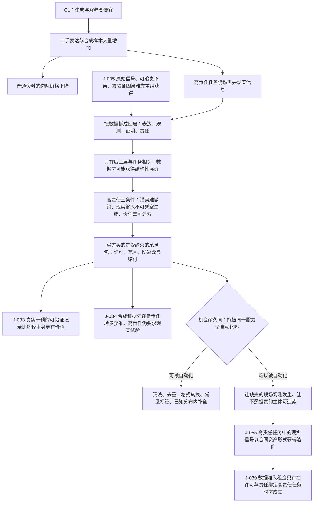

# C2 · 当数据不再免费：现实信号如何变成合同资产

[English version](../../en/chains/20-real-signals-become-contracts.md)

> **这条链承接 [C1](10-generation-becomes-free.md)**：C1 论证生成会变丰富，而不可复制的原始信号、可追责承诺与被验证因果不会随之复制。本链只沿第一条继续：当“解释”变得便宜，谁拥有现实信号、谁允许它被使用、谁为它的真实性负责，会成为交易的一部分。
> **一句话**：数据不会整体变贵；但在高责任场景里，未经安排的现实观测会从“顺手抓取的原料”变成带来源、用途、责任和更新义务的合同资产。

> **边界说明**：本链引用的 J-005、J-033、J-034、J-039、J-055 全部已判为**闸一（规模）不通过**，属职业／组织／制度性判断；每条的受众天花板由所引卡片的「受众规模」与「普及闸复核」字段定义，本链任何一步都不得以「整个社会」「普遍」「成为风气」的口吻转述。闸一判据见[历史回顾 · 闸一](../01-retrospect.md#七用这道闸检验我们自己写过的东西)，逐卡依据见[判断台账 · 检查日志](../90-ledger.md#八检查日志)。本说明一次性覆盖全文：2026-10-09 之前正文每一节重复一次的同一条「范围标签 · 闸一」已收口到这里，判断内容与结论未变——逐卡的受众量级与过闸理由始终只存放在台账卡片里，本说明与原先的逐节标签都只是指路。

## 一、2030 年的一次采购谈判

一家做工业维护的公司要训练代理，模型和生成式代码都不贵。真正难的是最后一公里：一批传感器数据来自哪台机器？采集时设备是否校准？中间有没有删改？如果模型据此安排停机，事故由谁承担？

卖方不再只报“多少 GB”。报价单分成四行：采集现场、传感器校准、使用范围、错误赔付。买方也不再只买文件，而是买一段可追溯的现实经历，以及在这段经历不可靠时可以追索的主体。

这不是“数据就是石油”的重演。石油可以储存和转卖；一次具体观测的价值，常常在于**它发生过、发生在哪里、谁能证明、谁愿意为误差负责**。当合成解释无限增加，交易对象会从数据文件转向数据的来历与责任链。

## 二、链条骨架

> **怎么读这张图**：方框是推理步骤，菱形是机会耐久闸，箭头是正文论证的依赖次序；图只画承重步骤，不替代正文，每一步的依据在下文各节与台账卡片里。

**本链的透镜声明**（代号定义见[方法论 §2 透镜工具箱](../00-method.md#2-透镜工具箱)，到五类起点的反查见[映射表](../00-method.md#五类起点与-l1l9-的对应表)）：

- **L1 丰富→稀缺**：解释变便宜之后，未被复制的现实观测相对升值。
- **L2 约束迁移**：瓶颈从「有没有数据」跳到「来源、许可与责任能否被证明」。
- **L5 信号与伪造**：合成样本压低了「看起来像真实记录」的伪造成本，筛选转向校准记录、时间戳与可追索主体。
- **L6 不可逆性**：高责任场景里一次错误的代价是现实损失，不是再生成一次。
- **L7 制度滞后**（部分使用，2026-10-10 补记）：只经骨架图里两个承重步骤进入——J-034 的合成证据按责任高低先后获准（技术先行、制度后到），与 J-039 的「数据准入租金」；本链不推这份租金何时打开、何时关闭。
- **L8 人性与需求**（部分使用，2026-10-10 补记）：只取「责任归属」与「确定性」两个需求侧锚——买方要为谁对误差负责、为可追溯性与更新义务持续付费，独立价值层才成立。

**在用但此前被漏记的透镜**（2026-10-10 经独立攻击改判）：本页原先把 L7、L8 与 L3、L4、L9 一并列入「未使用」，其中 L7、L8 被本页自己的文本反证，撤回该否认，两者都改判为**部分使用**。L7（制度滞后）：原措辞说 L7 只在第八节引用 J-039 时被触及、「本链没有把制度滞后写成独立推理步骤」，两点都不成立——第二节骨架图把「J-039 数据准入租金只有在许可与责任绑定高责任任务时才成立」与「J-034 合成证据先在低责任场景获准，高责任仍要求现实试验」都画成方框，图下的读法说明写明「方框是推理步骤」「图只画承重步骤」，而这两张卡的透镜字段分别是「L1（丰富→稀缺）+ L2（约束迁移）+ L7（制度租金窗口）」与「L2（约束迁移）+ L7（制度租金窗口）」。两张卡的出处是中期图景而非本链，但本链把它们当承重步骤用，L7 就随之进入第二节、第四节（J-034 的中期延伸）与第八节；本链正文没有另写一段从制度滞后出发的推导，L7 全部经这两张卡进入。用到的是 L7 的两面：L7：「技术先行、制度后到」（J-034：合成证据的获准按责任高低先后落位，高责任场景的监管保留现实试验），以及租金本身（J-039 的数据准入租金）。没有用到的是它的时间面，即 L7：「制度未落位时可能产生短暂租金；制度落位后，租金可能消失」——第八节给数据租金设的是结构条件（「不是所有数据都收租，只有现实信号、使用许可和责任能绑定到高责任任务时才可能收租」），不是制度尚未落位这一时间条件；租金消失只作为边界出现在第五节「监管也可能接受更多合成证据」与反方一，本页没有据此推出这份租金何时打开、何时关闭。L8（人性与需求）：原措辞「不触及需求侧人性锚点」不成立——第六节「只有当买方愿意为可追溯性、责任和更新义务持续付费，并且这些要求不能被平台内置或合成模拟完全吞掉，才有独立价值层」正是 L1 定义要求的需求侧复核（L1：「边界是需求结构也可能被改写，所以必须用 L8 复核」），第一节又把一次观测的价值落在「谁愿意为误差负责」、把买方所买写成「在这段经历不可靠时可以追索的主体」。这些步骤用的是 L8：「地位、确定性、责任归属、真实关系和在场感是检查需求侧的锚」 中的「责任归属」，并经可追溯性与更新义务触及「确定性」；地位、真实关系与在场感三个锚没有用到（第三节观测层「需要在场」指传感器或实验到场，不是需求侧的在场感），强关系上限这条子规律也没有用到。原先「它由 [C3](30-power-land-and-permits.md) 承重」的委托同样过宽：C3 第十三节只把 J-039 的「能源准入租金」「从一句结论拆成可检验的机制」，其余推演链正文中引用 J-039 的也只有 C3；数据准入租金这一端没有第二个承载者，只由本链第八节收窄检验，所以这一端的 L7 不能委托出去，按本段记为本链部分使用。

**未使用的透镜**：L3（成本结构）、L4（扩散滞后）、L9（关系不对称）。原因（2026-10-10 攻击后逐项改写为反向尝试；原措辞「不推采用速度与时间窗」「不推买卖双方的组织边界如何重排」只给结论，读者无从核对）：L3——最像它的一步是第四节把买方所买写成「受约束的承诺包」、第六节建议做来源、许可、校准和责任条款的「组合层」，这正落在 L3 的用途「产品打包方式」上；反方二还设想平台把责任吸收为内部功能。但承诺包是由第四节的高责任三条件（错误不可轻易撤销、现实输入不可凭空生成、责任需要可追索）推出的，不是由 L3：「组织的边界由协调成本和交易成本塑造」 推出的；反方二只给出「平台用统一赔付和内部审计承担全部错误」这一证伪情形，没有比较平台内部化与独立合同的交易成本，本链也不推断责任层最终落在组织边界的哪一侧。L4——最像它的一步是骨架图中 J-034 的「先在低责任场景获准」，它确实给出了一个采用次序；第一节也把情景放在「2030 年」。但 J-034 的次序按责任高低排列，不是由 L4：「折旧周期、监管周期、采购周期和技能形成周期决定采用速度」 推出的速度（该卡透镜字段只声明 L2、L7）；「2030 年」是情景设定，本页没有给任何一步写时间窗——本链唯一的时间窗 2029–2033 写在 J-055 卡上，而 J-055 的透镜字段是 L1、L2、L5、L6；第六节「改变采购口径」改的是买什么，不是采购周期的快慢。L9——最像它的一步是第一节买方不知道「一批传感器数据来自哪台机器」而卖方知道的不对称，以及第五节「让一个不愿承担责任的主体变得可追索」。但这是交易双方之间关于来源的信息不对称，本链用校准记录、时间戳与赔付条款去筛选它（走的是 L5）；L9 的前提是 L9：「人会对任何持续互动的对象建立关系模型」，产出是 L9：「每一项不对称都会长出一套此前不存在的规范、依赖与伤害形式」，买卖双方之间不存在这样的关系模型，本链的落点是合同条款，不是关系形态。按[映射表](../00-method.md#五类起点与-l1l9-的对应表)反查，改判后本链底座是**供需关系**（L1；L2 为延伸，无条文源句）＋**社会规律**（L5）＋**技术规律的后半句**（L6）＋**历史规律的后半段**（L7 部分使用，只经 J-034、J-039 进入）＋**人性规律的一部分**（L8 的「责任归属」与「确定性」两个锚）——原先「不含历史规律与人性规律的条文」一句随之撤回。

它**不**声称所有数据都会升值，也不把“有人需要数据”直接等同于商机。

## 三、第一步：先把“数据”拆开

C1 的 [J-005](../ledger/01-10.md#j-005--生成丰富之后价值向三类不可重组的输入集中原始信号可追责承诺被验证因果) 不是“数据总量会稀缺”，而是指出三类难以靠重组获得的输入：原始信号、可追责承诺、被验证因果。落到数据交易，至少要区分四层：

1. **表达层**：摘要、标签、报告和预测。它们越来越容易生成，普通场景的价格承压。
2. **观测层**：某个时间、地点、设备或身体真实发生了什么。它需要在场、传感器或实验。
3. **证明层**：采集过程是否可验证，是否有时间戳、校准、版本和访问记录。
4. **责任层**：数据错误造成损失时，谁承担通知、纠正、赔付或重新采集义务。

只有后面三层同时与任务相关，数据才可能获得结构性溢价。一个普通营销文本的来源证明，不会自动变成高价值资产；一份决定设备停机或病人治疗路径的观测，才会把错误成本推入合同。

## 四、第二步：为什么高责任场景先合同化

高责任场景有三个共同条件：

- **错误不可轻易撤销**：错过一次故障、错用一份样本，事后补写解释不能恢复原状；
- **现实输入不可凭空生成**：模拟可以补足已知分布，却不能保证覆盖尚未观察到的异常；
- **责任需要可追索**：监管、保险或交易对手必须知道谁提供了什么、在什么边界内保证什么。

因此，买方最终购买的不是“更多数据”，而是一个受约束的承诺包：允许如何使用、覆盖什么时间和地点、如何证明没有篡改、发现错误后谁通知、谁补采、谁赔付。

这也是 [J-033](../ledger/31-40.md#j-033--真实干预的可验证记录比解释本身更有价值) 与 [J-034](../ledger/31-40.md#j-034--合成证据先在低责任场景获准高责任场景仍要求现实试验) 的中期延伸：真实干预记录的价值可能高于解释本身；合成证据可能先在低责任场景获准，而高责任场景保留现实试验。

## 五、第三步：过机会耐久闸

新稀缺能不能被制造丰富的同一股力量消灭？答案是**部分可以，部分不可以**。

- 可以被自动化的部分：清洗、去重、格式转换、常见标签、已知分布内的补全、对既有记录的交叉核验。
- 难以被自动化的部分：让不存在的现场观测真实发生；让一个不愿承担责任的主体变得可追索；让一次未做过的干预拥有真实结果。

高保真模拟会持续扩大可替代范围，监管也可能接受更多合成证据。因此本链不推出“现实数据永远稀缺”，只推出一个更窄的判断：在错误代价高、分布外风险重要且责任必须落地的任务中，**来源与责任链**比文件数量更可能获得溢价。

## 六、所以现在可以做什么

- **组织应改变采购口径**：把数据采购从“买多少条”改成“买哪段现实、证明到什么程度、谁承担什么错误”。
- **数据提供者应记录边界**：采集条件、校准、缺失、用途许可和撤回机制，不要把这些当作售后补丁。
- **创业者可验证一个窄入口**：为高责任行业做来源、许可、校准和责任条款的组合层，而不是再做一个通用数据湖。

这仍不是自动成立的长期商机。只有当买方愿意为可追溯性、责任和更新义务持续付费，并且这些要求不能被平台内置或合成模拟完全吞掉，才有独立价值层。

## 七、我可能错在哪

**反方一：世界模型足够好，现实观测可以被模拟替代。** 如果在多个高责任领域，合成证据被监管、保险和买方接受，且事故率不高于现实数据，来源溢价会消失。观察指标是高责任审批中合成证据的占比、保险费率差异和现实试验预算。

**反方二：平台把责任统一吸收，数据合同被隐藏。** 如果大型平台用统一赔付和内部审计承担全部错误，买方不再为数据来源、校准和提供者身份单独付费，那么合同化可能只是平台内部功能，不构成独立市场。

**反方三：数据产权或隐私规则使可用数据减少，但没有形成可交易资产。** 约束收紧不等于供给方获得议价权；若许可流程只增加摩擦而没有可核验的责任溢价，本链应降级为制度摩擦图景。

## 八、这条链往下长出什么

- 它承接 C1 的 [J-005](../ledger/01-10.md#j-005--生成丰富之后价值向三类不可重组的输入集中原始信号可追责承诺被验证因果)，并具体化为判断 [J-055](../ledger/51-60.md#j-055--高责任任务中的现实信号以合同资产形式获得溢价)。
- 它为 [J-039](../ledger/31-40.md#j-039--模型租用更丰富但能源数据和渠道控制形成准入租金) 的“数据准入租金”提供一个更窄的检验：不是所有数据都收租，只有现实信号、使用许可和责任能绑定到高责任任务时才可能收租。
- 若 [J-055](../ledger/51-60.md#j-055--高责任任务中的现实信号以合同资产形式获得溢价) 得到支持，下一步应研究谁拥有跨组织现实信号的议价权；若它被证伪，则应把数据合同化从结构性判断降为行业特定的合规成本。
- 本链和 C1 共用一个前提：算力只要肯付钱就买得到。C1 追问过它，但只放在最强反方里（反方三：若能源、供应链或监管对算力形成硬上限，整条链作废），没有展开；把它展开成一条独立链的是 [C3 · 电子落地：算力的瓶颈从芯片移到电网、土地与许可](30-power-land-and-permits.md)——若交付日期由并网队列而非价格决定，那么本链里“更新义务”“持续供数”这类条款还要额外背一层交付风险，而卖方对这层风险并不比买方更有把握。

> **当前状态**：这是一条可检验的中期推演链，不是对所有数据市场的结论。完整判断卡片见台账 [J-055](../ledger/51-60.md#j-055--高责任任务中的现实信号以合同资产形式获得溢价)。已写成的链与被预告但尚未写成的方向，统一见[推演链登记](../../../README.md#推演链登记)。
