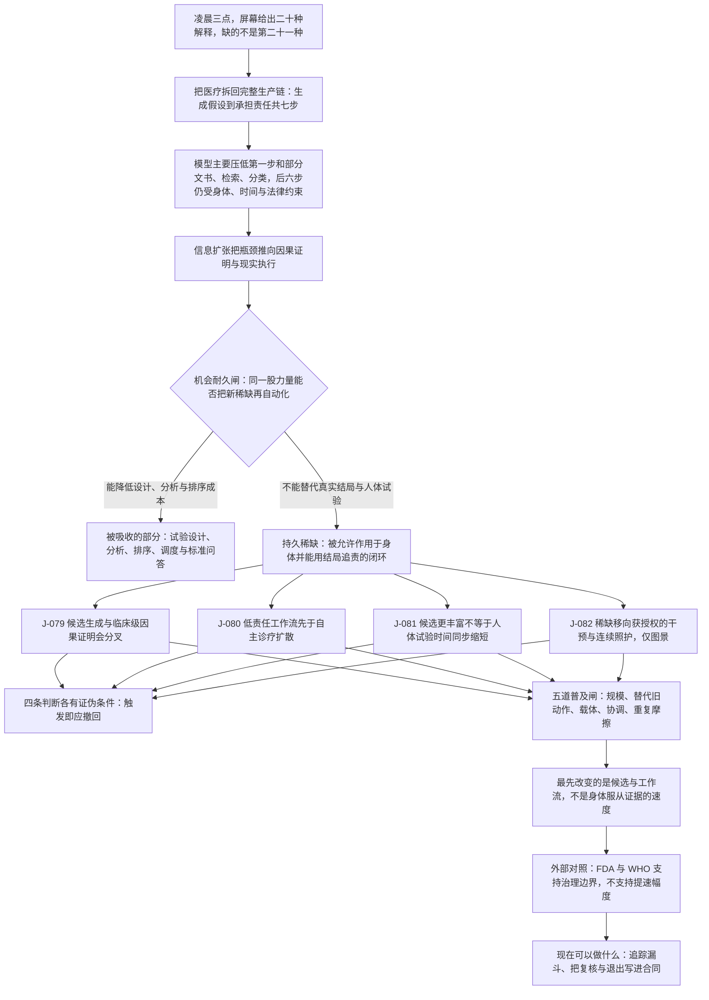

# C5 · 生物与医疗：答案会先变便宜，证明与照护不会

[English version](../../en/chains/50-biology-medicine.md)

> **一句话**：AI 会先把「可能是什么、可以试什么」变成近乎无限的候选；医疗真正稀缺的仍是把候选变成可对某个身体负责的证据、授权和照护能力。

> **边界说明**：本链引用的 J-079–J-082 全部已判为**闸一（规模）不通过**，属职业／组织／制度性判断；每条的受众天花板由所引卡片的「受众规模」与「普及闸复核」字段定义，本链任何一步都不得以「整个社会」「普遍」「成为风气」的口吻转述。闸一判据见[历史回顾 · 闸一](../01-retrospect.md#七用这道闸检验我们自己写过的东西)，逐卡依据见[判断台账 · 检查日志](../90-ledger.md#八检查日志)。

## 一、凌晨三点，屏幕给出二十种解释

急诊医生不缺第二十一种解释。她缺的是：哪一种解释能改变眼前这个人的处置；如果错了，谁能发现、停止并承担后果；床位、检验、药物和护理人手是否真的可用。

这不是对 AI 能力的否定，而是把医疗拆回它的完整生产链：**生成假设 → 测量身体 → 前瞻验证 → 获得授权 → 实施干预 → 观察结局 → 承担责任**。模型主要压低第一步和部分文书、检索、分类成本；后六步受身体、时间、伦理、法律和组织容量约束。

印刷术让医学知识更易复制，却没有替代临床试验；影像设备让观察更精细，却没有自动产生诊断责任；计算化合物筛选扩大候选空间，却没有让人体毒性和长期疗效可以纯粹在屏幕内结算。历史反复出现的不是「信息无用」，而是**信息扩张把瓶颈推向因果证明和现实执行**。

**本链的透镜声明**（代号定义见[方法论 §2 透镜工具箱](../00-method.md#2-透镜工具箱)，到五类起点的反查见[映射表](../00-method.md#五类起点与-l1l9-的对应表)）：

- **L1 丰富→稀缺**：候选解释与候选分子变丰富，与之互补而未同步变多的前瞻验证相对升值。
- **L2 约束迁移**：瓶颈从「想不出假设」跳到因果证明、授权与现实执行。
- **L4 扩散滞后**：低责任工作流先于自主诊疗成为常规配置，取决于采购、资格与培训周期而不是模型能力。
- **L6 不可逆性**：人体试验与临床处置的错误代价是身体伤害与法律责任，不是再生成一次。
- **L7 制度滞后**：执业授权、监管终点与赔付规则决定「能做」何时变成「被允许做」。
- **L8 人性与需求**：取其「责任归属、真实关系和在场感」三个锚——长期照护中的触碰与信任、处置出错时由谁承担，都不会因为解释变丰富而被吸收。

**在用但此前被漏记的透镜**（2026-10-10 经独立攻击改判）：本页原先把 L3、L5、L8、L9 一并列入「未使用」。其中 **L8（人性与需求）**被本链自己的正文反证，故撤回该否认。原措辞称 L8 只在 J-080 那条「缺医地区」反方里以需求侧可得性出现、「本链没有把它写成独立推理步骤」；但第二节机会耐久闸表的「长期照护」一行把新稀缺写成「连续观察、触碰、信任与异常升级」，并以「不能消除身体和关系的在场成本」回答闸问；紧接的结论把持久稀缺定为「被允许作用于身体、并能用结局追责的闭环」，即「物理、法律／责任与身体在场三类硬约束」的叠加——这正是图中引出全部四张卡的「持久稀缺」节点；开篇急诊场景也把「如果错了，谁能发现、停止并承担后果」列为医生真正缺的东西。这几处运行的正是 L8：「责任归属、真实关系和在场感是检查需求侧的锚」——闸之所以答「不能」，前提是人对触碰、信任与有人承担后果的需要不会因为解释变丰富而消失。这是闸表里承重的一格，不是反方里的旁注，与原措辞不可同真。L8 在本链只用这三个锚：「地位」「确定性」两个锚与强关系上限那条子规律没有调用；那句结论里的「物理」与「法律」两面由 L6、L7 承重，不算在 L8 名下。**L3（成本结构）**（复核攻击结论时另发现）也不能再写成干净的「未使用」：本链 J-081 的透镜字段写作「L2 约束迁移 + 成本结构」，用的正是 L3 的名称。但逐句核对，J-081 的推理链（更多候选争夺「没有同比扩张的湿实验、受试者、站点与监管容量」）及其「我为何仍坚持」一栏「候选计算与人体时间属于不同生产函数」推的是产能排队，不是 L3 定义的「组织的边界由协调成本和交易成本塑造」，不涉公司规模、雇佣、外包边界或产品打包；正文最像 L3 的一步——第四节闸四「机构内闭环有单一责任主体，容易先扩散」——裁定的是扩散速度，不是组织边界落在哪里。所以 L3 在本链只是**卡片名义声明、机制未运行**：本页把它移出「未使用」，但不计为在用，也不把 J-081 的排队推理改挂到 L3 名下；卡片字段与机制的这处错位已在 J-081 透镜字段就地标注，字段本身未改。

**未使用的透镜**：L5（信号与伪造）、L9（关系不对称）。原因（2026-10-10 攻击后按反向尝试重写）：**L5**——本链最像 L5 的一步是第二节那句「物理、法律／责任与身体在场三类硬约束」：L5 列举的更难伪造的凭据里恰有「可追责身份或身体在场」。但 L5 的机制是「一旦文本、图像或履历的伪造成本塌陷，筛选会寻找担保、抵押、长期关系、可追责身份或身体在场等更难伪造的凭据」，本链没有走这一步：身体在场与责任在这里稀缺，是因为处置必须作用于一个真实身体、并由某人承担后果，不是因为某种原先有效的信号被廉价伪造、筛选者才转而要它们。本链没有一处写到伪造或筛选转移（第一节的「计算化合物筛选」筛的是分子，不是信号）；第六节「不把演示数量当临床产能」说的是演示停在生产链第一步，也不是伪造成本塌陷。两者只共用词汇，机制未运行。原先「它由 C2 与 C10 承重」一句收窄：这两条链承重的是 L5 的一般机制（数据记录与能力表演的伪造），都没有推医疗凭据——[C2](20-real-signals-become-contracts.md) 正文涉及医疗的只有「一份决定设备停机或病人治疗路径的观测，才会把错误成本推入合同」，讲的是数据溢价；[C10](100-trust-collateralization.md) 只在「这条链往哪里接」的相连清单里提到临床责任——所以医疗凭据被伪造后的筛选转移目前没有任何一条链承重。**L9**——L9 定义点名的关系里就有「医患」，本链最像 L9 的一步是第二节「长期照护」一行：解释、提醒与远程问答由 AI 持续提供，新稀缺里列着「信任」。但本链没有问这段关系里哪一项不对称，也没有推出 L9 要求的「每一项不对称都会长出一套此前不存在的规范、依赖与伤害形式」；那一行的落点是 AI「可吸收标准问答」而在场成本仍在，是稀缺落在哪个环节，不是关系形态。原先「医患关系的不对称（L9）由 C11 承重」一句撤回：[C11](110-authority-before-intelligence.md) 只在人与 AI 的授权关系上用 L9（「一方可被复制、暂停、回滚而另一方不能」），全文没有一处推医患关系的不对称，所以这一项目前同样没有任何链承重。按[映射表](../00-method.md#五类起点与-l1l9-的对应表)反查，改判后本链底座是**供需关系**（L1、L2 延伸）＋**历史规律**（L4、L7）＋**技术规律的后半句**（L6）＋**人性规律的一项**（L8，即 §1 人性条文中的「对真实在场与责任归属的偏好」）——原先「不含人性规律与社会规律的条文」一句随之收窄：本链只是不含社会规律的条文。L5 未使用；L3 只是卡片名义声明，即便计入，按映射表也只回溯到已列出的供需一类（延伸，无条文源句）。

**这条链的骨架**：

> **怎么读这张图**：方框是推理步骤，菱形是机会耐久闸，箭头是正文论证的依赖次序；图只画承重步骤，不替代正文，每一步的依据在下文各节与台账卡片里。

## 二、同一股力量能否把新稀缺再自动化

| 环节 | AI 使什么变丰富 | 新稀缺 | 同一股力量能否自动化 |
|---|---|---|---|
| 分诊与诊断 | 候选解释、影像标注、病历摘要 | 针对具体人群与场景的前瞻验证 | 可降低试验设计与分析成本，不能凭生成结果替代真实结局 |
| 药物研发 | 靶点、分子、适应症与试验方案候选 | 湿实验、人体安全性、招募与随访时间 | 可优先排序，不能复制同一个不可逆人体试验 |
| 临床处置 | 指南检索、沟通草稿、风险提示 | 授权、责任、床位、器械与照护时间 | 可辅助调度，不能自行取得执业权或凭空增加身体在场 |
| 长期照护 | 解释、提醒、远程问答 | 连续观察、触碰、信任与异常升级 | 可吸收标准问答，不能消除身体和关系的在场成本 |

所以这里的持久稀缺不是「医疗答案」，而是**被允许作用于身体、并能用结局追责的闭环**。这是物理、法律／责任与身体在场三类硬约束的叠加。

## 三、四个判断，四种可被现实推翻的路径

### [J-079](../ledger/71-80.md#j-079--生物医学候选生成与临床级因果证明会分叉) · 候选生成与临床证明会分叉

从 2026 到 2034 年，生物医学候选的生成与排序成本很可能显著下降，但临床级因果证明不会按同一比例提速。理由不在模型“不会推理”，而在可信因果必须穿过真实样本、时间和受试者保护。更好的生物模型、替代终点和合成对照组可能同时压缩实验与临床环节；如果至少三个高责任医疗类别在不增加真实样本和随访强度时，把候选到获批有效干预的中位周期压缩一半以上且安全性撤回率不升，这条判断就应撤回。

### [J-080](../ledger/71-80.md#j-080--低责任医疗工作流先于无专业复核的自主诊疗扩散) · 低责任工作流先于自主诊疗扩散

摘要、编码、排程和医生复核下的决策支持，比脱离专业复核的自主诊疗更容易在 2026–2031 年成为常规配置：前者替换已有动作、能嵌入医院载体、错误可以局部回退；后者必须额外跨越执业授权、责任与不可逆处置。不过，缺医地区可能先接受“较差但立即可得”的自主系统。若至少两个大型司法辖区长期出现无人工复核的自主诊疗患者人次高于复核型支持，而且不是一次性强制采购造成，本判断失效。

### [J-081](../ledger/81-90.md#j-081--药物候选更丰富不等于人体试验时间同步缩短) · 药物候选更丰富，不等于人体时间同步缩短

搜索空间扩大后，更多候选会争夺没有同比扩张的湿实验、受试者、站点和监管注意力。因此到 2034 年，候选增长未必等比例转化为获批药物。预测性生物标志物、适应性试验和数字终点是最强反方：如果 AI 起源候选从首次人体试验到获批的中位历时与失败率都下降一半以上，并在三个治疗领域复现，就说明人体时间也被同一股力量改写了。

### [J-082](../ledger/81-90.md#j-082--解释变多后医疗稀缺移向获授权的干预与连续照护仅图景) · 解释变多后，稀缺移向获授权的干预与连续照护（仅图景）

慢病、老龄和基层医疗中，标准解释和提醒的供给会比可授权干预、连续观察与异常升级更快增长。没有本地资源与责任链时，更多建议只是增加未兑现需求。远程监测、家庭机器人与任务重构可能使连续照护本身可扩展；目前跨国纵向证据不足，所以这里只保留为低置信度图景。若多个国家在 AI 问答普及后五年内同时提升可干预工时、随访完成率和异常响应速度，并且人力与机构容量不再是主要排队原因，这幅图景应被撤回。

四条判断的完整受众规模、时间窗、证伪条件、领先指标、依赖、置信度与外部对照，分别登记在[判断台账 J-079–J-080](../ledger/71-80.md#j-079--生物医学候选生成与临床级因果证明会分叉)与[判断台账 J-081–J-082](../ledger/81-90.md#j-081--药物候选更丰富不等于人体试验时间同步缩短)。

## 四、五道普及闸怎么判

1. **规模**：患者影响面巨大，但不能拿患者人数冒充专业动作分母；四条判断均按职业／组织性命题处理。
2. **替代已有动作**：摘要、检索、编码较容易替代旧动作；额外生成更多候选若不替代试验动作，反会增加拥堵。
3. **已有承载物**：医院信息系统、药企研发和监管流程是现成载体；居家连续照护的载体更碎。
4. **协调**：机构内闭环有单一责任主体，容易先扩散；跨医院、支付方、监管和患者的数据闭环更慢。
5. **重复摩擦**：每次复核、同意、采样与随访都是重复成本，不能用一次性采购掩盖。

结论不是「医疗不会被 AI 改变」，而是：**它最先改变的是候选与工作流，不是身体服从证据的速度。**

## 五、外部对照与证据边界

- **FDA，AI-enabled Medical Devices**：支持已有 AI 医疗器械通过不同上市路径获授权、用途与决定日期可追踪；不支持完整覆盖、临床采用规模、基础模型识别完整性或自主诊疗普及。<https://www.fda.gov/medical-devices/software-medical-device-samd/artificial-intelligence-enabled-medical-devices>
- **FDA，Considerations for the Use of Artificial Intelligence To Support Regulatory Decision-Making for Drug and Biological Products**：支持按 Context of Use 与风险建立可信度；不支持具体研发提速幅度、成功率或本链时间窗。<https://www.fda.gov/regulatory-information/search-fda-guidance-documents/considerations-use-artificial-intelligence-support-regulatory-decision-making-drug-and-biological>
- **WHO，Ethics and governance of artificial intelligence for health**：支持自主、透明、问责、公平与安全不是模型能力可自动消除的治理边界；不支持某种监管终局或采用次序。<https://www.who.int/publications/i/item/9789240029200>
- **WHO，Health workforce**：支持卫生人力供给与分布是现实容量约束；不支持把全球缺口直接换算成 AI 市场或自动化比例。<https://www.who.int/news-room/fact-sheets/detail/health-workforce>

## 六、现在可以做什么

- 研究者：公开追踪“候选数—人体试验数—获批数”漏斗，不把演示数量当临床产能。
- 医疗机构：采购时把复核权、异常升级、部署后监测和退出机制写进合同，而不只比较模型准确率。
- 创业者：优先做能嵌入现有责任链、减少旧动作的工具；若产品只增加一个建议入口，要先证明谁会处理新增建议。
- 读者：看到“AI 发现药物”或“AI 看病”时，先问它走到了生产链哪一步，以及下一步由谁承担。
