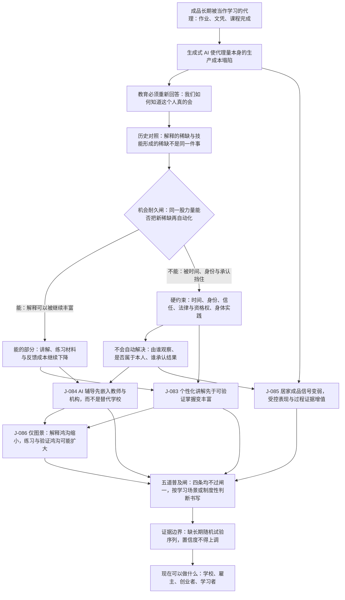

# C6 · 教育与技能形成：讲解会泛滥，掌握仍要留下痕迹

[English version](../../en/chains/60-education-skill-formation.md)

> **一句话**：AI 会先让每个人都得到一位不厌其烦的讲解者；真正稀缺的会是持续练习、被看见的真实表现，以及别人愿意据此授予机会的可信证明。

> **边界说明**：本链引用的 J-083–J-086 全部已判为**闸一（规模）不通过**，属职业／组织／制度性判断；每条的受众天花板由所引卡片的「受众规模」与「普及闸复核」字段定义，本链任何一步都不得以「整个社会」「普遍」「成为风气」的口吻转述。闸一判据见[历史回顾 · 闸一](../01-retrospect.md#七用这道闸检验我们自己写过的东西)，逐卡依据见[判断台账 · 检查日志](../90-ledger.md#八检查日志)。

## 一、一个学生交出完美作业，却答不出下一问

老师面前的论文结构完整、语言流畅。她追问：「如果把这个条件反过来，结论还成立吗？」学生沉默。

过去，成品常被当作学习的代理：作业像掌握、文凭像能力、课程完成像技能形成。生成式 AI 不是简单地让作弊更容易；它使**代理量本身的生产成本塌陷**。当漂亮成品可以外包，教育必须重新回答一个更古老的问题：我们如何知道这个人真的会？

印刷术扩展教材供给，却没有消灭学校；函授、广播和 MOOC 扩展课程触达，却没有自动产生完成率、练习纪律和被雇主接受的资格。历史反复说明：**解释的稀缺与技能形成的稀缺不是同一件事**。技能需要时间中的反馈、动机、身体或社会实践；资格还需要一个有信誉的机构把观察结果变成机会。

**本链的透镜声明**（代号定义见[方法论 §2 透镜工具箱](../00-method.md#2-透镜工具箱)，到五类起点的反查见[映射表](../00-method.md#五类起点与-l1l9-的对应表)）：

- **L1 丰富→稀缺**：讲解与成品变丰富，与之互补而未同步变多的持续练习与可信观察相对升值。
- **L2 约束迁移**：瓶颈从「得不到讲解」跳到「练习时间、真实表现与谁来承认」。
- **L4 扩散滞后**：机构内的局部闭环比重建整套制度先扩散，速度由课程、评价与资格周期决定。
- **L5 信号与伪造**：居家成品的伪造成本塌陷，筛选转向更贵、更难转包的身份、现场表现与长期记录——这是本链最核心的一步。
- **L7 制度滞后**：资格与机会由学校、雇主与公共机构承认，承认结构的变化慢于工具能力。
- **L8 人性与需求**：动机、归属与规范是检查「讲解变多是否转化为掌握」的需求侧锚。

**在用但此前被漏记的透镜**（2026-10-10 经独立攻击改判）：本页原先把 L3、L6、L9 一并列入「未使用」，其中 L9（关系不对称）被本页自身文本反证，改判为**部分使用**。本页开头的一句话「AI 会先让每个人都得到一位不厌其烦的讲解者」，正是 L9 四项不对称中第二项的实例——L9：「一方无限耐心、不疲倦」；第二节表格「师徒与同伴」一行把 AI 一侧写成「随时问答和角色模拟」，是同一项不对称落在 L9 点名的师生关系上。**在用的一面**：讲解者一方不厌其烦、随时可得，被当作前提写进全链的起点，与 L1 的讲解变丰富并用。**未用的一面**：L9 的关键产出「每一项不对称都会长出一套此前不存在的规范、依赖与伤害形式」，本链没有推——J-083–J-086 四张卡的透镜字段都不声明 L9，正文也没有一步从这项不对称推出新的规范、依赖或伤害。原措辞「在本链只被预告，由 C11 承重」两半都不成立：作为前提，它在一句话里就已承重，不是预告；而本链正文除这一声明行外从未指向 [C11](110-authority-before-intelligence.md)，C11 页首对 L9 只取人与 AI 授权关系里的复制、暂停、回滚，自述「这正是 L9 四项不对称中的第三项」，其正文检索不到师生、学生或耐心。这个预告没有落点，故撤回对 C11 的委托：推导面目前在本链与 C11 都没有展开。

**未使用的透镜**：L3（成本结构）、L6（不可逆性）。原因（2026-10-10 攻击后按反向尝试重写：原措辞对 L3 只是一句否认，对 L6 没有指出正文中最像它的一步）：**L3**——本链最像 L3 的一步是 J-084「AI 辅导先嵌入教师与机构，而不是替代学校」：它判断「学校又已经承载身份、课程、同伴、评价与资格」这一组合不会被 AI 辅导拆开，形似 L3 定义点名的「产品打包方式」；但它的推导是「局部闭环比重建整套制度更容易扩散」，即采用次序（该卡透镜字段为「L4 扩散滞后 + 普及闸三至闸五」），全链没有一步用协调成本或交易成本去定位学校或雇主的组织边界——唯一谈协调的是第四节闸四「跨机构资格互认需要可观测权威或共同标准」，而[普及闸不是第十种可选透镜](../00-method.md#普及闸不是第十种可选透镜)。第一节「当漂亮成品可以外包」与 J-085「更难转包的身份」里的外包，指的是个人把成品交给 AI 代做，本链把它当作伪造成本塌陷（L5）来推，不是 L3 的外包边界。**L6**——本链最像 L6 的一步是第二节：主要约束不在生成，而在 AI「不能替学习者承受练习时间」，硬约束清单里还有「法律／资格权」，形似 L6 的「主要成本就不是生成成本」；但 L6 的门槛是 L6：「若一次错误会造成身体伤害、法律责任、产权损失或不可逆声誉损害」，而学习的错误代价通常可撤销、可重做，本链正文没有一步以学习错误不可撤销为前提——错误恰是练习的材料（J-083「练习却仍要求注意、时间和反馈后的行为改变」）；「法律／资格权」指谁有权承认结果，由本链的 L7 承接，不是一次错误招致的法律责任。这正是教育与 [C5](50-biology-medicine.md) 医疗的分界：C5 声明 L6 的理由是「人体试验与临床处置的错误代价是身体伤害与法律责任，不是再生成一次」。按[映射表](../00-method.md#五类起点与-l1l9-的对应表)反查，改判后本链底座是**供需关系**（L1、L2 延伸；L8 还带需求侧那半句）＋**历史规律**（L4、L7）＋**社会规律**（L5）＋**人性规律**（L8；L9 部分使用，经 L8 归入此类）——五类起点中本链唯一没有经透镜碰到的仍是技术规律的条文：其后半句只由 L6 承载，而 L6 在本链未用。需要注明一点：J-083「讲解可以复制」是该条文前半句「可并行、可复制、可数字化的确定性工作更容易降本」的一个实例，但映射表登记这半句在 L1–L9 中没有承载透镜，所以这一步没有透镜背书。

**这条链的骨架**：

> **怎么读这张图**：方框是推理步骤，菱形是机会耐久闸，箭头是正文论证的依赖次序；图只画承重步骤，不替代正文，每一步的依据在下文各节与台账卡片里。

## 二、同一股力量能否把新稀缺再自动化

| 环节 | AI 使什么变丰富 | 新稀缺 | 同一股力量能否自动化 |
|---|---|---|---|
| 讲解与练习材料 | 任意难度、语言和风格的例子与反馈 | 学习者持续投入与纠错 | 能降低反馈成本，不能替学习者承受练习时间 |
| 作业与作品 | 完整文本、代码、图像与演示 | 判断作品是否代表本人能力 | 能生成更多检测手段，也能生成更难识别的代理产物 |
| 评价 | 题目、评分草案、能力画像 | 可信身份、受控条件与可复核观察 | 能辅助记录，不能自行取得学校、行业和雇主共同承认 |
| 师徒与同伴 | 随时问答和角色模拟 | 动机、归属、规范与现场示范 | 能部分模拟，不能自动制造长期互相承诺的群体 |

硬约束不是「AI 不够聪明」，而是时间、身份、信任、法律／资格权和身体实践。解释能被同一股力量继续丰富；**由谁观察、观察是否真属于本人、谁承认结果**不会自动解决。

## 三、四个判断，四种可被现实推翻的路径

### [J-083](../ledger/81-90.md#j-083--个性化讲解先于可验证掌握变丰富) · 个性化讲解先于可验证掌握变丰富

从 2026 到 2030 年，按个人水平生成解释、例题和即时反馈很可能成为常规能力，但可验证掌握不会同比增长。讲解可以复制，练习却仍要求注意、时间和反馈后的行为改变。高质量自适应辅导可能同时改善节奏与动机；如果多国、多年龄、多学科在广泛使用两年后，受控迁移测试与长期保持率按使用强度同比提高，而且不需要课程重设，本判断应被撤回。

### [J-084](../ledger/81-90.md#j-084--ai-辅导先嵌入教师与机构而不是替代学校) · AI 辅导先嵌入教师与机构，而不是替代学校

机构内辅导可以替换答疑、练习生成和形成性反馈，学校又已经承载身份、课程、同伴、评价与资格；因此 2026–2031 年，局部闭环比重建整套制度更容易扩散。学校成本、地域缺口和成人学习需求是最强反方。若至少三个大型教育系统中，脱离学校或雇主的 AI 学习路径获得的普遍认可资格持续超过机构内路径，这条判断失效。这里判断的是制度载体，受影响学生人数不能直接当作闸一动作分母，所以按制度性判断书写。

### [J-085](../ledger/81-90.md#j-085--居家成品信号变弱受控表现与过程证据增值) · 居家成品信号变弱，受控表现与过程证据增值

成品生成成本下降后，成品与本人能力的相关性会变弱；选择者仍需区分能力，于是更贵但更难转包的身份、现场表现和长期记录在 2027–2034 年增值。过程记录同样可能被伪造，受控评价也可能放大焦虑与不平等；如果主要大学与大型雇主继续提高无过程验证居家成品的独立权重，而且它对后续表现的预测效度不降，本判断被证伪。

### [J-086](../ledger/81-90.md#j-086--解释鸿沟缩小但练习与验证鸿沟可能扩大仅图景) · 解释鸿沟缩小，练习与验证鸿沟可能扩大（仅图景）

便宜解释会先让有设备和自律的人受益，但掌握仍依赖时间、反馈与实践环境，资格还依赖机构承认。若没有学校、雇主或公共机构承载，技能与机会差距可能不降反升。低成本、离线、高质量辅导也可能恰好给资源最少者带来最大边际收益；当前缺少足够长期证据，所以这里只保留为低置信度图景。若没有新增教师、设备、评价或社会支持投入的地区，收入组之间的独立掌握和资格差距连续五年显著缩小，这幅图景应被撤回。

四条判断的完整受众规模、时间窗、证伪条件、领先指标、依赖、置信度与外部对照，集中登记在[判断台账 J-083–J-086](../ledger/81-90.md#j-083--个性化讲解先于可验证掌握变丰富)。

## 四、五道普及闸怎么判

1. **规模**：[J-083](../ledger/81-90.md#j-083--个性化讲解先于可验证掌握变丰富) 的影响面虽是构造式十亿量级、学习可达日频，但没有可引用统计证明十亿个不同个人每日执行同一种 AI 辅导动作；[J-084](../ledger/81-90.md#j-084--ai-辅导先嵌入教师与机构而不是替代学校)、[J-085](../ledger/81-90.md#j-085--居家成品信号变弱受控表现与过程证据增值)、[J-086](../ledger/81-90.md#j-086--解释鸿沟缩小但练习与验证鸿沟可能扩大仅图景) 判断的又是学校、雇主或公共载体。四条均不过闸一，按学习场景或制度性判断书写；[J-086](../ledger/81-90.md#j-086--解释鸿沟缩小但练习与验证鸿沟可能扩大仅图景) 另标「仅图景」。
2. **替代已有动作**：课程内答疑、练习和反馈能替换旧动作；独立再开一个聊天窗口容易变成附加负担。
3. **已有承载物**：学校、企业培训、图书馆和考试制度是载体；纯个人工具若不接资格出口，价值在兴趣耗尽后坍塌。
4. **协调**：一所学校或雇主可形成局部闭环；跨机构资格互认需要可观测权威或共同标准。
5. **重复摩擦**：登录、提示、核验和监督若每次都收费或耗时，会压低长期使用；真正扩散的功能会被埋进原工作流。

## 五、外部对照与证据边界

- **UNESCO，Guidance for generative AI in education and research**：支持以人为中心、年龄适配、隐私、教师参与和教学设计边界；不支持具体学习效应、教师替代或评价终局。<https://www.unesco.org/en/articles/guidance-generative-ai-education-and-research>
- **OECD，Digital Education Outlook 2023**：支持数字教育依赖治理、互操作生态和教师能力，而非单一工具；不支持生成式 AI 的具体采用次序或学校边界永久不变。<https://www.oecd.org/en/publications/oecd-digital-education-outlook-2023_c74f03de-en.html>
- **World Bank，What is Learning Poverty?**：支持基础学习成果缺口是十亿量级教育系统问题；不支持把缺口归因于讲解稀缺，亦不支持 AI 对不平等方向的预测。<https://www.worldbank.org/en/topic/education/brief/what-is-learning-poverty>
- **证据缺口**：本轮未取得可跨国家、跨学科复现且可公开核查的长期生成式 AI 辅导随机试验序列。因此四条判断的置信度不得因短期单课实验上调。

## 六、现在可以做什么

- 学校：把 AI 用在原有练习—反馈闭环里，同时保留独立表现的测量点；不要用“已启用 AI”替代学习结果。
- 雇主：减少对光滑成品的迷信，增加短时现场任务、口头追问、试工和有来源的过程记录。
- 创业者：若产品不能进入课程、教师、雇主或资格出口，先证明它替换了哪个高频旧动作，而不是只证明回答更好。
- 学习者：用 AI 生成解释后，关闭它，在新条件下独立完成；能否迁移而不是能否看懂，才是掌握。
