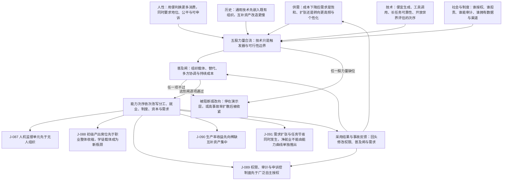

# C7 · 技术先到，权力后到：能力出现次序如何穿过组织，才变成社会后果

[English version](../../en/chains/70-capability-to-social-consequences.md)

> **一句话判断**：技术能力不会直接改写社会。它先降低某类任务的成本，再穿过工作流、责任、权限与稀缺互补资产；只有这些中介也改变时，能力次序才会依次改写分工、就业、制度、资本与需求。

> **边界说明**：本链引用的 J-087–J-091 全部已判为**闸一（规模）不通过**，属职业／组织／制度性判断；每条的受众天花板由所引卡片的「受众规模」与「普及闸复核」字段定义，本链任何一步都不得以「整个社会」「普遍」「成为风气」的口吻转述。闸一判据见[历史回顾 · 闸一](../01-retrospect.md#七用这道闸检验我们自己写过的东西)，逐卡依据见[判断台账 · 检查日志](../90-ledger.md#八检查日志)。

---

## 一、2030 年上午九点：模型已经会做，组织却还不会交给它

一家保险公司的理赔模型已经能读完病历、核对保单、调用数据库并起草付款决定。演示里，它十分钟做完过去两小时的工作。

真正上线时，屏幕旁仍坐着三个人：一人决定哪些案子能交给模型，一人处理例外，一人在争议发生后解释谁批准了什么。公司没有立刻消失一个部门；它先长出一个新的工作单元——**机器做第一遍，人决定边界并为后果署名**。

这不是因为技术“不够先进”。即使模型明天再强十倍，保单是谁签的、赔款从谁的账户出去、监管者找谁问责、错误能否撤回，仍不是模型参数能单独改写的事实。

[技术能力演进链](../05-tech-sequence.md)回答“什么先到”。本链回答另一半：**能力到达之后，要穿过什么，才会成为社会后果。**

---

## 二、不是一条技术单因果链，而是五股力量的合流

本链不用“模型更强，所以社会必然如此”的写法。每一步都同时检查[方法论 §1](../00-method.md) 列出的五类合法起点，并按[方法论 §2](../00-method.md#2-透镜工具箱) 的代号写明各由哪个透镜承重：

1. **供需**（**L1 丰富→稀缺**、**L8 人性与需求**的需求侧那半句）：成本下降后，需求是饱和、扩张，还是转向更高频与更个性化？
2. **人性**（**L8 人性与需求**）：人会不会把便利换成更多消费，同时保留对地位、公平与可申诉性的要求？
3. **历史**（**L4 扩散滞后**、**L3 成本结构**）：通用技术通常先嵌入既有组织，再与新组织形式竞争；互补资产的改造往往慢于核心设备。
4. **技术**（**L1–L9 中无承载透镜**，见下）：便宜生成、工具调用、长任务可靠性、开放世界评估按什么次序成熟？
5. **社会与制度**（**L7 制度滞后**、**L6 不可逆性**）：谁有权授权、谁承担责任、谁能审计、谁拥有数据、渠道、资本与客户关系？

**在用但此前被漏记的透镜**（2026-10-10 经独立攻击改判）：本页原先写「本链不调用 L2（约束迁移）、L5（信号与伪造）、L9（关系不对称）」，其中两项被**本链自己的正文与台账卡**反证，故撤回该否认。L2：第四节「如果企业只削掉初级席位而不重建学徒、模拟、轮岗或受监督实战，几年后会遇到继任与专业判断供给不足」走的正是 L2：「解除一个瓶颈不会让系统所有环节均匀变快，瓶颈会跳到另一个环节」——初级产出这一环被压低之后，约束跳到带反馈的真实练习与专业判断的供给上；该节引用的 J-088 在标题里就写明「学徒载体成为新瓶颈」，推理链落点是「学徒、模拟与受监督实战的稀缺上升」，第八节的图把这一步画成 U2，图注又自述「图只画承重步骤」。原先「瓶颈换位由 [C3](30-power-land-and-permits.md) 承重」因此不能替本链免掉 L2：C3 确实承载芯片→电网的瓶颈换位，但本链在职业入口上自己推了一次。L5 改判为**部分使用**：J-088 的透镜字段写「任务束 + 技能形成 + 信号博弈」，而同一台账文件里 J-085 的透镜字段「L5 信号博弈 + L1 丰富→稀缺」已把「信号博弈」等同于 L5；正文第四节「谁拥有可验证的练习环境，谁就更能进入高责任岗位」用的是筛选那一面——可验证的练习成为进入高责任岗位的凭据（L5：「筛选会寻找担保、抵押、长期关系、可追责身份或身体在场等更难伪造的凭据」），J-088 领先指标里的「外部候选人的受控表现」也是这一面。未使用的是触发那一面：本链正文没有一处以 L5：「一旦文本、图像或履历的伪造成本塌陷」为前提——第四节的触发是练习载体被自动化拿走，不是凭据变得可伪造；这一面仍由 [C2](20-real-signals-become-contracts.md) 与 [C10](100-trust-collateralization.md) 承重，两链页首的 L5 条目都以伪造成本塌陷起步。J-088 的 `出处` 字段指回本链，与原措辞「本链不调用 L5」不可同真。

**未使用的透镜**：L9（关系不对称）。原因（2026-10-10 攻击后补写反向尝试，原措辞只写了委托去向）：本链最像 L9 的一步是第五节控制面清单里的「争议发生后，谁能暂停、审计、撤销与申诉」——[C11](110-authority-before-intelligence.md) 页首的 L9 条目正是把「一方可被复制、暂停、回滚而另一方不能」当作 L9 的第三项不对称来用。但在本链里，暂停与撤销是组织必须对执行者持有的控制项，由行动权与法律责任推出（J-089 的透镜字段为「行动权 + 法律责任 + 普及闸四」），落点是权限表与审计日志，不是由不对称关系推出新的规范、依赖与伤害形式；第三节「一名责任人监督一组机器执行」同样是分工单元，链中没有任何一方对机器建立 L9：「人会对任何持续互动的对象建立关系模型」所说的那种关系模型。人与 AI 的关系不对称仍由 C11 承重。

**登记在案的缺口**（2026-10-10 复核：技术行缺口与「多方协同」两句经攻击维持；「不以透镜口吻断言能力到达次序」一句被本链台账卡反证，改写如下）：**第 4 股力量「技术」在 L1–L9 中没有任何透镜承载**：L6 只对应「哪类环节降得慢」，「哪类工作先降本」在[映射表](../00-method.md#五类起点与-l1l9-的对应表)「技术规律」行是全表最硬的缺口；最接近的 L1 也只说「某样东西变便宜、变多」，不说哪类工作先便宜。本链正文把能力到达次序写成**触发器与可行性边界**（第二节表格自述「这张表写的是**条件顺序**，不是日历承诺」），并回指[技术能力演进链](../05-tech-sequence.md)；但原先「本链因此不以透镜口吻断言能力到达次序」一句不成立，撤回——本链 J-087 的透镜字段写的是「技术次序 + 组织载体 + 普及闸二至闸四」，把「技术次序」列成了透镜，其推理链也以「生成和工具调用先成熟」起手。「技术次序」不是 L1–L9 中的任何一个，恰是上面这处缺口；按映射表该行的现行纪律，这一到达次序前提实际由 J-087 depends-on 中技术能力演进链登记的 J-006、J-007、J-009 承接，不由透镜背书——J-087 的透镜字段已就地加注。第 5 股力量里的「多方协同」同样没有条文源句（§2 已登记）：本链最接近它的是第 3 股力量下的 L3：「组织的边界由协调成本和交易成本塑造」，但那讲的是一家组织的边界由协调成本划在哪里，不是一项采用需要哪几方同时改变；所以它只能走普及闸的闸四，不进透镜层。按[映射表](../00-method.md#五类起点与-l1l9-的对应表)反查，改判后本链底座是**供需关系**（L1；L2 为延伸、无条文源句；L3 为延伸、无条文源句；L8 的需求侧那半句）＋**人性规律**（L8，四项中的三项）＋**历史规律**（L4、L7）＋**技术规律的后半句**（L6）＋**社会规律**（L5，只用筛选那一面）；技术规律的前半句与「多方协同」无条文承载，如上。反查也显示，上列五股力量的括注与映射表并不逐格对齐：L3 记在「历史」之下，L6、L7 记在「社会与制度」之下，而映射表把它们分别回溯到供需（延伸）、技术规律后半句与历史规律；本段以映射表为准，五股力量的括注本轮未改。

因此，技术只是**触发器与可行性边界**。组织载体、替代关系、多方协调与持续成本仍受[历史回顾中的五道普及闸](../01-retrospect.md)约束。

| 技术门 | 先被压低的成本 | 必须同时跨过的社会门 | 若跨过，先出现的后果 |
|---|---|---|---|
| 便宜生成与结构化输出 | 草稿、分类、比较 | 工作流必须能把它替换进现有动作 | 人机工作单元，而非“无人公司” |
| 工具调用与持续上下文 | 跨系统执行、交接 | 身份、权限、日志、撤销与例外升级 | 权限控制面进入日常运营 |
| 长任务可靠性 | 持续执行与协调 | 责任必须可定位，失败必须可接管 | 管理工作从催办转向定边界 |
| 开放世界评估与具身能力 | 更多信息／物理任务 | 现实反馈、场址、能源、牌照、身体与渠道 | 收益向稀缺互补资产集中 |

这张表写的是**条件顺序**，不是日历承诺。下面五个判断分别把组织、劳动、制度、资本与需求写成可证伪命题。

---

## 三、第一段传导：先重组工作单元，不先消灭整家公司

当生成和工具调用先成熟，最容易自动化的是边界清楚、结果可复核的任务片段。组织不会先把一个职位整个交给模型，而会先把任务拆成三层：

- **机器默认执行**：高频、可回放、低责任动作；
- **人类处理例外**：目标冲突、数据缺失、越权与异常；
- **责任人设定边界**：谁能调用什么、预算多少、何时必须停。

这会把团队的最小生产单元，从“一个人操作一个软件”改为“一名责任人监督一组机器执行”。但它不是“一个人公司”必然到来：客户获取、资金、牌照、渠道、谈判与线下履约不会被同一个能力同时消除。

正式判断：[J-087 · 人机监督单元先于无人组织](../ledger/81-90.md#j-087--人机监督单元先于无人组织成为主流部署单位)。

---

## 四、第二段传导：岗位不会整齐消失，职业入口会先变窄

初级工作常同时承担两种功能：一是便宜地产出草稿、整理信息、跑流程；二是让新人通过这些动作积累判断力。前一部分最适合被先到的生成与工具调用能力吸收，后一部分却不能自动获得替代载体。

因此最先改变的未必是职业总人数，而是**进入职业的路径**：同样的资深产能需要更少初级产出工时，但未来的资深者仍须从某处获得带反馈的真实练习。如果企业只削掉初级席位而不重建学徒、模拟、轮岗或受监督实战，几年后会遇到继任与专业判断供给不足。

这是劳动后果，也是一种权力后果：谁拥有可验证的练习环境，谁就更能进入高责任岗位。

正式判断：[J-088 · 初级产出席位先于职业整体收缩，学徒载体成为新瓶颈](../ledger/81-90.md#j-088--初级产出席位先于职业整体收缩学徒载体成为新瓶颈)。

---

## 五、第三段传导：执行越便宜，授权与申诉越贵

当模型只能给建议，组织控制的是“谁可以看答案”；当模型能调用工具并持续执行，组织必须控制的是：

- 哪个主体可以让它行动；
- 能触达哪些数据与资产；
- 预算、期限与风险上限是多少；
- 何种异常必须交还人类；
- 争议发生后，谁能暂停、审计、撤销与申诉。

所以制度变化不会等到完全自治才发生。它会先以枯燥的控制面出现：权限表、操作日志、责任签名、例外队列、外部审计和申诉入口。模型能力越接近“可执行”，这些结构越从合规附件变成生产系统本身。

这也解释了为什么技术次序不是唯一发动机：若法律不要求可追责、买方不为事故承担损失、组织内部没有明确的资产所有权，那么同样的执行能力可能停在演示层，或者以高事故率扩散后被收紧。

正式判断：[J-089 · 权限、审计与申诉先于广泛自主授权](../ledger/81-90.md#j-089--权限审计与申诉控制面先于广泛自主授权成为生产基础设施)。

---

## 六、第四段传导：核心能力变便宜后，收益先流向互补资产

若模型和调用价格下降，模型本身的稀缺租金会受压；但把能力变成收入仍需客户关系、专有工作流数据、牌照、责任资本、算力与电力、渠道以及物理部署。

在调整早期，既有资产拥有者更容易吸收收益：他们已经拥有数据、客户、合规资格和分发渠道，也能支付流程改造的固定成本。小团队的技术上限会上升，却不等于议价权自动上升。只有当开放标准、可携带数据、公共基础设施、竞争政策或新渠道降低互补资产门槛时，收益才可能再分散。

正式判断：[J-090 · 生产率收益先向稀缺互补资产集中](../ledger/81-90.md#j-090--生产率收益先向稀缺互补资产所有者集中再由竞争与制度决定是否扩散)。

---

## 七、第五段传导：便宜不会只带来裁员，也会制造此前买不起的需求

把“每项任务需要更少人”直接翻译成“总就业同比减少”漏掉了需求弹性。更便宜、更快、更个性化的服务会让原本不值得做或买不起的事务进入市场：更多版本、更细客户分层、更长营业时间、更多本地语言、更低客单价。

因此近中期更可检验的命题不是“AI 创造或消灭多少净岗位”，而是：**在采用密集行业，单位产出工时先下降，同时产出种类与服务频次先上升；净就业由需求扩张能否超过单位节省决定。** 医疗、照护、建筑等受身体、牌照与场址约束的领域，扩张会更多落到未被自动化的环节；纯数字、需求较饱和的领域，人数收缩更可能先出现。

正式判断：[J-091 · 需求扩张与任务节省同时发生，净就业不能由能力曲线单独推出](../ledger/91-95.md#j-091--需求扩张与任务节省同时发生净就业方向不能由能力曲线单独推出)。

---

## 八、把五张牌叠起来：一条社会传导链

> **怎么读这张图**：方框是推理步骤，箭头是正文论证的依赖次序；图只画承重步骤，不替代正文，每一步的依据在正文各节与台账卡片里。

图中的五股力量从同一起点进入，任一类都可以阻断或改向结果；采用结果与事故还会反过来修改权限、普及闸和需求。技术只打开可行性，并不排在组织、制度、供需与人性之前。

这五条不是彼此独立的新闻标题。它们给出一组可逆检验：若组织无需重构工作流就能直接获得长期自治收益，J-087 会失败；若初级入口没有相对收缩，J-088 会失败；若自主权限扩大而审计和申诉没有同步进入生产系统，J-089 会失败；若收益率没有向互补资产倾斜，J-090 会失败；若单位成本下降而品类与频次不扩张，J-091 的需求侧会失败。

---

## 九、这里明确不做的四个跳跃

1. **不从 benchmark 直接推出失业率。** 职业由任务束构成，需求量也会变。
2. **不把“能做”写成“会普及”。** 五道普及闸仍须逐项通过。
3. **不把组织采用写成社会授权。** 私有组织能内部闭环，不代表公共权力可以同样委托。
4. **不把生产率写成普惠。** 收益由互补资产所有权、竞争与制度再分配决定。

因此，本链完成的是“技术次序的社会传导”首轮覆盖，不是技术决定论，也不是净就业或分配结果的终局预测。

---

## 十、现在应观察什么

未来两年最有信息量的不是又一个模型分数，而是五类组织数据：

- 人工处理量中，“默认执行”与“例外接管”的占比；
- 初级招聘、学徒席位和受监督实战时数是否同步变化；
- AI 权限、日志、审计、申诉是否进入核心业务系统而非停在政策文档；
- 采用者的利润改善落在模型供应商、数据／渠道／牌照拥有者，还是劳动者与消费者；
- 单位服务工时下降后，品类、频次、客群与总量是否扩张。

这些指标能把“AI 会改变一切”拆成可以逐年判错的社会命题。完整卡片、时间窗与证伪条件见[判断台账](../90-ledger.md)。
