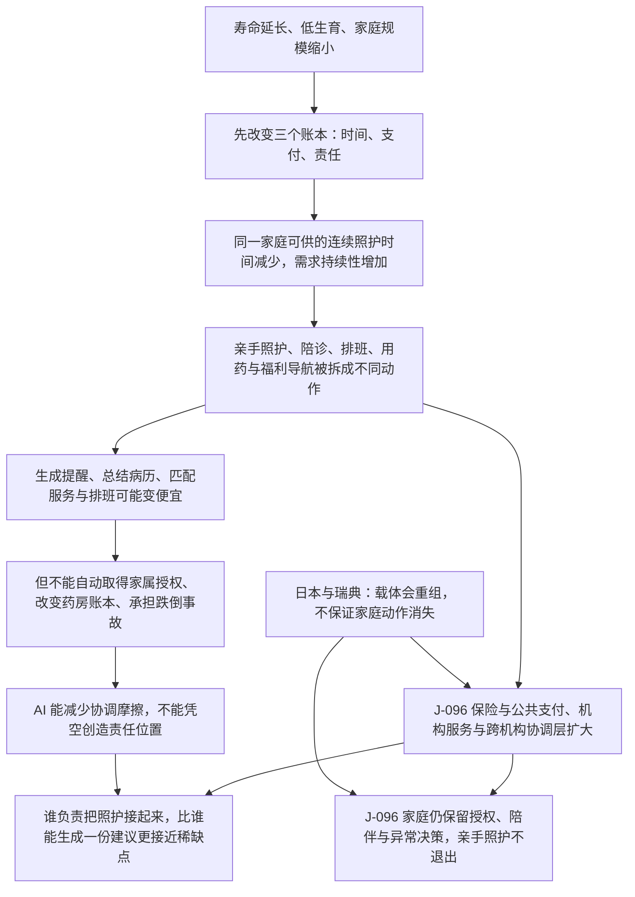
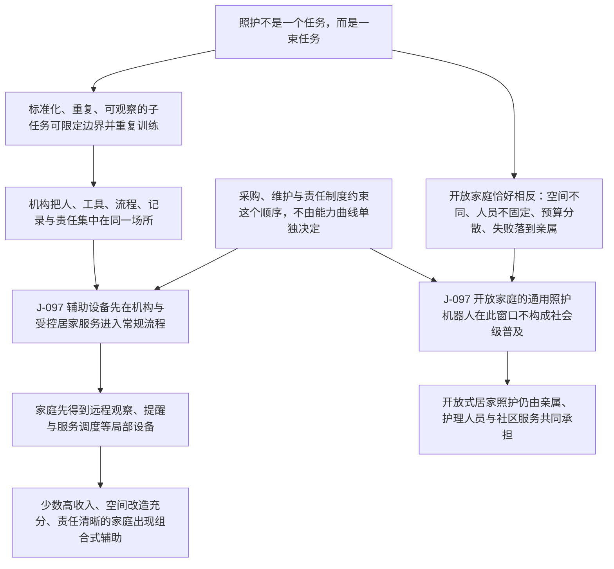

# C9：人口老龄化与制度化照护：谁承担每天的身体与协调工作？

[English version](../../en/chains/90-aging-care-and-institutional-substitution.md)

> **链的入口**：这不是「AI 先出现，所以照护会怎样」的链。它从人口结构、家庭规模、劳动供给与制度安排开始，再问 AI 和具身智能能否降低其中某些动作的成本。
>
> **一句话**：老人变多并不会自动制造一个亿级、每个人每周都亲手照护的统一市场；它更可能先把照护从家庭内部的隐性义务，推向正式服务、公共／保险支付和跨机构协调，而身体接触与长期责任仍是最难被廉价复制的部分。

> **边界说明**：本链引用的 J-066、J-069、J-073、J-074、J-096、J-097 全部已判为**闸一（规模）不通过**，属职业／组织／制度性判断；每条的受众天花板由所引卡片的「受众规模」与「普及闸复核」字段定义，本链任何一步都不得以「整个社会」「普遍」「成为风气」的口吻转述。闸一判据见[历史回顾 · 闸一](../01-retrospect.md#七用这道闸检验我们自己写过的东西)，逐卡依据见[判断台账 · 检查日志](../90-ledger.md#八检查日志)。

## 1. 先把问题从 AI 中拿出来

老龄化是一股即使删除 AI 也成立的社会力量：预期寿命延长，低生育和晚婚使同住亲属减少，劳动年龄人口与照护需求的相对比例改变。它首先改变的不是「机器人能不能做」，而是三个账本：

1. **时间账本**：一个家庭成员能否持续请假、接送、陪诊、夜间看护？
2. **支付账本**：照护由家庭无偿承担，还是由保险、税收、个人支付和雇主福利共同购买？
3. **责任账本**：当行动涉及跌倒、用药、转移、认知异常和临终决定时，谁被授权、谁被追责、谁能证明自己做过正确的事？

这三个账本解释了为什么「老人数量」不能直接当作机器人市场规模，也解释了为什么照护会成为全社会图景的一部分，却未必成为一个人人高频使用的消费产品。

**本链的透镜声明**（代号定义见[方法论 §2 透镜工具箱](../00-method.md#2-透镜工具箱)，到五类起点的反查见[映射表](../00-method.md#五类起点与-l1l9-的对应表)）：

本链的起手变量**人口结构**不是 L1–L9 中的任何一个透镜——[方法论 §2.1](../00-method.md#21-不采用-l1-的示例人口家庭与照护) 已把「人口老龄化 × 家庭缩小」登记为**不采用 L1 的示例**，并允许它从人口结构、家庭关系与制度承载能力起步。L 代号从第二步起才开始承重：

- **L3 成本结构**：三个账本（时间／支付／责任）决定照护由家庭、市场还是公共制度承担——这是一次 make-or-buy 边界推演，L3 的协调成本与交易成本正对应它。
- **L4 扩散滞后**：机构采购、培训、维护与报销周期决定具身设备何时真的落到床边。
- **L6 不可逆性**：跌倒、用药、转移与临终决定的错误代价是身体伤害与法律责任。
- **L8 人性与需求**：取其「真实关系与在场感」「责任归属」两项——家庭不会因为设备可用就退出。

**未使用的透镜**：L1（丰富→稀缺）、L2（约束迁移）、L5（信号与伪造）、L7（制度滞后）、L9（关系不对称）。原因：L1 按 §2.1 刻意不采用，本链不为了进出口 B 而虚构一次丰富→稀缺翻转；L2 与 L5 不参与本链任何一步；L7 只承接「制度后到」这一端，而本链讲的是**制度替代既有承担者**——这一机制只被**部分承载**：承担者由家庭、市场还是公共制度来当，这一面是 make-or-buy 边界，已由上面声明的 L3 承重；但「制度替代」本身在 L1–L9 里**没有源句**，也在 §2 映射表「社会规律」行被登记为条文空缺，因此本链用日本与瑞典两个历史案例校准它，而不是用透镜背书；照护关系被 AI 中介后的不对称（L9）由 [C11](110-authority-before-intelligence.md) 承重。按[映射表](../00-method.md#五类起点与-l1l9-的对应表)反查，本链有承载的那部分底座是**供需关系的延伸**（L3，无条文源句）＋**历史规律**（L4）＋**技术规律的后半句**（L6）＋**人性规律**（L8），而它的起手点与核心机制都落在条文之外——这是本链置信度的天然上限，不是漏写。

## 2. 历史先验：照护压力会改写载体，不保证家庭动作消失

### 2.1 日本：从家庭义务到长期护理保险

日本 2000 年引入长期护理保险，历史上说明了一件比「AI 能不能照护」更早的问题：当家庭照护压力与人口结构不再匹配时，制度会把融资、资格评估和服务供给组织起来，把部分照护从家庭转交给正式服务。它是机制成立的校准案例，不是对未来规模的证明。

### 2.2 瑞典：正式公共载体可以替代一部分家庭动作

瑞典的老人照护由市镇承担总体责任，并通过居家帮助、特殊住房与全天候协助提供服务。这是另一种制度路径：照护可以由公共组织承担，而不是只能由同住子女承担。但它不能证明家庭照护为零，也不能证明任何国家都会复制北欧的财政和治理结构。

### 2.3 两个反向边界

- **正式供给不足的边界**：即使制度承认长期照护是公共问题，家庭仍可能承担接送、情绪支持、决策和夜间异常处理；「社会化」不是「家庭退出」。
- **技术可行不等于载体可行的边界**：接触式转移机器人早已能在原型中抱起和移动人，但病房常规部署还要过安全责任、清洁消毒、人员培训、设备维护与采购预算等闸。能力存在不能替代组织承接。

因此，本链不把日本或瑞典当成未来预测的证据，而把它们当作两种已发生的制度回应；它们共同支持「载体会重组」，并共同提醒我们不要把照护结果压缩成单一的家庭或机器人答案。

## 3. 推演链 A：人口结构 → 家庭时间缺口 → 正式服务与协调层

> **怎么读这张图**：方框是推理步骤，箭头是正文论证的依赖次序；图只画承重步骤，不替代正文，每一步的依据在下文各节与台账卡片里。

这条链的关键不是需求会不会增长，而是增长后的动作会被谁承接。生成提醒、总结病历、匹配服务和排班可能变便宜；但它们不能自动取得家属授权、改变药房账本、承担跌倒事故或在深夜替人做不可逆决定。AI 能减少协调摩擦，却不能凭空创造责任位置。

### 判断卡片 1：J-096

- **判断**：2027–2035 年，老龄化与家庭缩小会使部分照护从家庭内部的隐性义务转向正式服务、保险／公共支付和跨机构协调；但这不等于家庭亲手照护退出。
- **受众规模**：受影响人群为照护对象、家庭成员和照护劳动者，构造式千万量级影响面；实际重复执行者是每周至少一次完成亲手照护或照护协调的成年人，现有可比证据只支持百万量级以内的职业／调查子群，不能据此声称亿级普及。主要是重新分配既有照护者的负担，也让原本无法持续照护的家庭使用正式服务。
- **普及闸复核**：受影响人口不是同一社会动作的执行者；当前证据不足以构造全球去重分母，闸一不过，按制度与职业判断书写。
- **透镜**：人口结构（**L1–L9 中无承载透镜**，见 §2.1「不采用 L1 的示例」）、供需与支付（**L1**、**L3**）、制度替代（**只被部分承载**：「由家庭、市场还是公共制度承担」这一面是 make-or-buy 边界，由 **L3** 承重；但「制度替代既有承担者」本身在 L1–L9 里没有源句，L7 也只承接「制度后到」这一端）、家庭关系（**L8**）（代号定义见[方法论 §2](../00-method.md#2-透镜工具箱)，缺口见[映射表](../00-method.md#五类起点与-l1l9-的对应表)）。
- **推理链**：老年照护需求持续 → 可用家庭时间相对减少 → 无偿照护出现排班、请假和连续性缺口 → 保险／公共服务与协调岗位承接部分动作 → 家庭仍保留授权、陪伴和异常决策。
- **时间窗**：2027–2035。
- **证伪条件**：到 2033 年，在至少四个具有可比人口与照护统计的制度中，家庭照护时间、正式照护支出和协调岗位均没有向正式／协调载体移动；或者移动完全由短期经济周期解释，而非人口结构与家庭规模变化。
- **领先指标**：非正式照护者的日／周频率、照护请假与退出劳动市场比例、长期护理保险／公共照护支出、居家服务工时、照护协调岗位与等待时间；每年。
- **置信度**：中
- **depends-on**：J-066, J-073。
- **最强反方**：生产率和移民供给提高了家庭可购买的照护服务，或延迟失能使需求增长低于人口结构推断，导致家庭与正式载体的分工不明显。
- **与共识**：**部分一致**：OECD 的可比调查证明日频／周频非正式照护真实存在，日本与瑞典证明制度可以重组照护载体。**边界**：这些材料不能给出全球照护者分母，也不能证明正式服务会在所有制度扩张。**我仍保留**：家庭时间是不可储存的约束，制度选择会改变谁执行动作，但不会消除连续照护本身。
- **外部对照来源**：EXT-62, EXT-63, EXT-64。
- **出处**：本链第 2、3 节。
- **下次检查日**：2027-06-30。
- **状态**：ACTIVE

## 4. 推演链 B：标准化动作 → 机构先承接 → 家庭开放环境滞后

照护不是一个任务，而是一束任务。机构把人、工具、流程、记录和责任集中在同一场所，因此更容易先部署辅助设备：转移、清洁、药物分拣、生命体征采集、异常上报，都可以限定边界并重复训练。家庭恰好相反：空间不同、人员不固定、预算分散、任务之间没有清晰边界，且失败直接落到亲属与被照护者身上。

> **怎么读这张图**：方框是推理步骤，箭头是正文论证的依赖次序；图只画承重步骤，不替代正文，每一步的依据在下文各节与台账卡片里。

这不是说家庭不会采用技术，而是说采用单位不是「每个家庭买一台万能机器人」。更可能的顺序是：机构中的单任务设备和感知系统 → 家庭中的远程观察、提醒、服务调度 → 在少数高收入、空间改造充分且责任清晰的家庭出现组合式辅助。这个顺序受采购、维护与责任制度约束，不由模型能力曲线单独决定。

### 判断卡片 2：J-097

- **判断**：2027–2038 年，接触式转移、异常观察和标准化照护辅助更可能先在机构与受控居家服务中形成稳定流程；开放式家庭环境中的通用照护机器人在此窗口内不构成社会级普及。
- **受众规模**：直接执行者为百万量级以内的护理机构、护理劳动者、设备维护与支付方，主要提高既有专业者上限；被照护者和家庭为千万量级影响面，但不是同一高频技术操作的行动分母。
- **普及闸复核**：机构采购与家庭部署是低频组织决策；开放式家庭任务没有可引用的去重周频使用分母，闸一不过，按职业／制度判断书写。
- **透镜**：任务可分解性（**L1–L9 中无承载透镜**，属映射表「技术规律」行「哪类工作先降本」的缺口）、机构经济学（**L3**）、物理与责任约束（**L6**）、扩散闸（**不是透镜**，见 §2「普及闸不是第十种可选透镜」）（代号定义见[方法论 §2](../00-method.md#2-透镜工具箱)，缺口见[映射表](../00-method.md#五类起点与-l1l9-的对应表)）。
- **推理链**：可重复任务更容易标准化 → 机构集中采购和培训降低单位部署成本 → 责任、维护和记录可以绑定组织 → 受控场景先稳定 → 家庭的异构空间、低频突发与责任外溢阻慢通用设备扩散。
- **时间窗**：2027–2038。
- **证伪条件**：到 2035 年，在多个收入层级和至少三个制度环境中，开放式家庭照护机器人已被大量家庭持续使用，且能够覆盖至少三类跨空间任务（如转移、清洁、异常处理），其留存率、事故率和维护成本不再显著劣于机构部署；若只有展示、试点或单任务设备，不算推翻。
- **领先指标**：机构设备的付费部署与留存、每千名被照护者的设备工时、家庭设备的持续使用月数、跨任务成功率、事故与人工接管率、维护／改造成本；每年。
- **置信度**：中
- **depends-on**：J-073, J-074, J-066, J-069。
- **最强反方**：低成本软硬件、住宅改造和保险支付同时成熟，把家庭变成可标准化的受控环境；或照护劳动力短缺迫使制度承担高额补贴，跳过自然扩散速度。
- **与共识**：**部分一致**：具身智能在工厂等重复场景的扩散，以及接触式转移原型，支持「能力能做、机构更易承接」的方向。**边界**：现有来源没有跨国部署量、留存率和家庭事故数据，不能把机构先行写成已验证事实。**我仍保留**：家庭开放环境同时叠加物理不确定性、责任外溢和维护成本，按照历史扩散规律应先于能力曲线构成瓶颈。
- **外部对照来源**：EXT-43, EXT-44, EXT-45。
- **出处**：本链第 4 节。
- **下次检查日**：2027-12-31。
- **状态**：ACTIVE

## 5. 稀缺翻转：不是「照护建议」，而是连续责任的承接

如果生成和解释变得丰富，第一反应会是「照护信息筛选」成为商机。但 C1 已经提醒：客观筛选很可能被内置，不能直接当成持久机会。对照护而言，更硬的稀缺可能是：

- 在授权范围内持续观察，而不是一次性给答案；
- 在异常发生时有人能到场、接管并承担后果；
- 把家庭、护理机构、药房、医院和支付方的记录接起来；
- 在长期关系中保持可信，而不是把一次错误建议包装成确定性。

其中前两项受身体在场、劳动时间和责任法律约束，短期内不应被 AI 生成能力自动化的假设吞掉；后两项可能被软件部分改善，但仍会遇到隐私、互操作、授权与商业激励。**所以现在可以做什么**：先做照护协调、排班、异常升级、授权记录和服务可追踪性等窄任务；不要从「万能家庭机器人」的社会级市场叙事起步。

这是一条可行动的方向，不是正式商机结论：仍需通过支付意愿、留存、事故责任和实际重复行动者数据的耐久闸。没有这些数据的部分，保留为图景，不升级为投资建议。

## 6. 读者带走的画面

2032 年，一个女儿不一定每天亲手把母亲从床上抱到椅子上，但她仍可能每周确认一次护理计划、授权一次跨机构记录、在异常时决定是否赶往现场。养老院里的转移设备可能已经是常规采购，家庭里的机器人却仍只负责一个窄动作，或干脆只是把人和服务接起来。照护的变化不是「人被机器替代」这一幕，而是照护被拆成更多可计价、可记录、可追责的协作单元；身体在场和长期承诺因此更清晰地显出价格。

> **仅图景**：上述 2032 年场景用于连接判断，不是第三条正式卡片。它不声称普遍发生，也不把任何单个家庭的技术采用外推为社会趋势。

## 7. 证据边界与后续检查

本链使用的历史和制度材料只支持「照护载体能够重组」「非正式照护真实存在」「机构与家庭承担不同约束」。它们不支持全球照护行动者总数、家庭机器人渗透率或某个商业模式的收益预测。下一轮应优先补齐：同口径的亲手照护／协调照护分母、机构设备部署与留存、家庭设备事故与维护成本，以及至少两个正式照护供给强与两个家庭照护占比高制度的可比序列。

缺口不等于证伪；在数据不可计算时，按台账规则记录 `INDETERMINATE`，不把沉默改写成命中。
